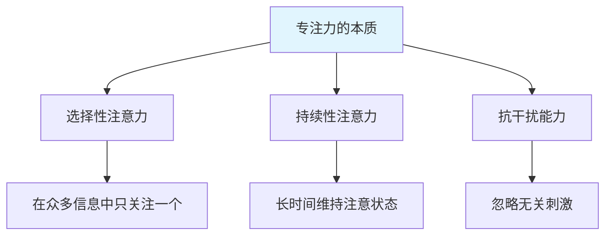
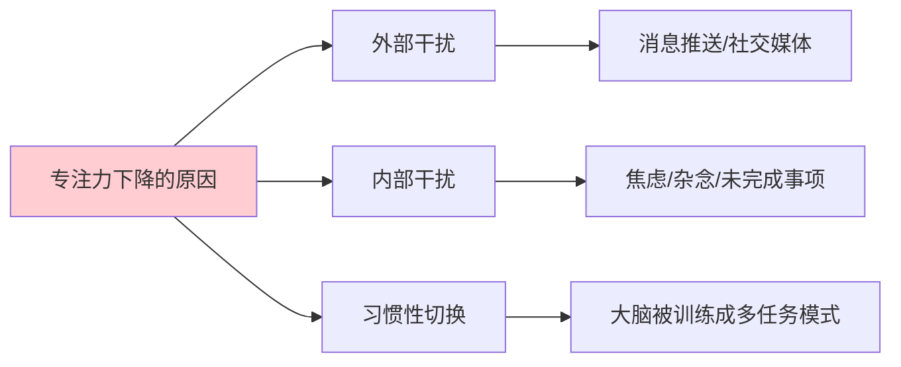
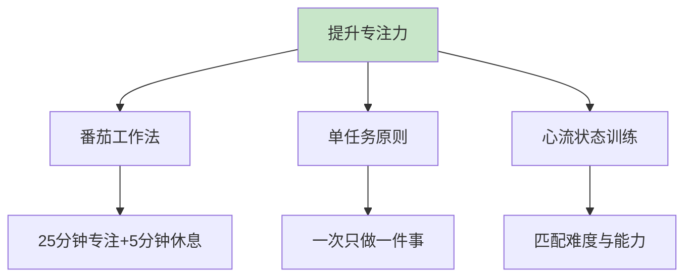
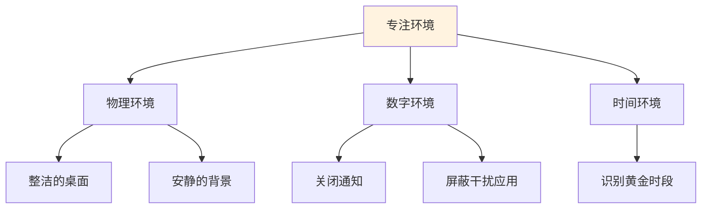
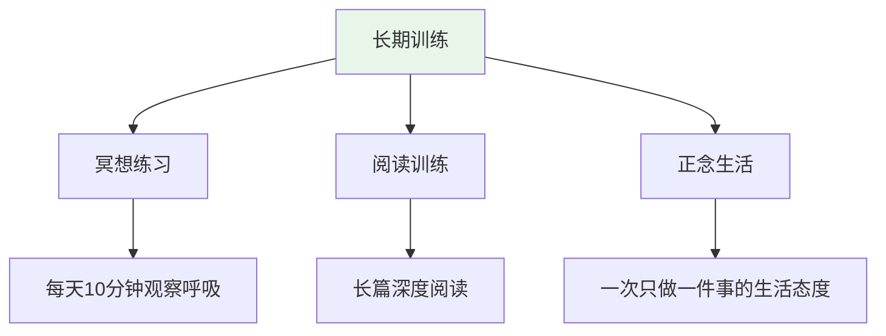
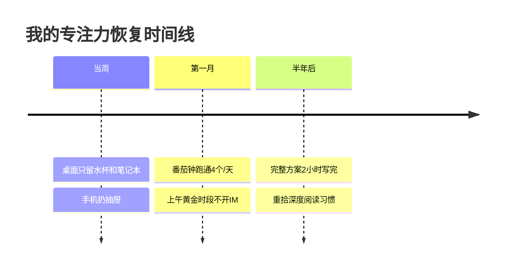
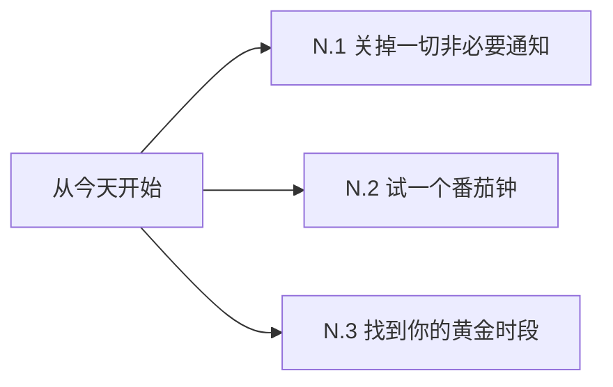

# 7.1专注能力的提升

#### 目录介绍
- [01.看一个真实案例](#01看一个真实案例)
- [02.什么是真正的专注](#02什么是真正的专注)
- [03.为什么我们越来越难专注](#03为什么我们越来越难专注)
- [04.提升专注力的核心方法](#04提升专注力的核心方法)
- [05.建立专注的工作环境](#05建立专注的工作环境)
- [06.训练大脑专注的习惯](#06训练大脑专注的习惯)
- [07.总结回顾这一节](#07总结回顾这一节)
- [08.后来发生的改变](#08后来发生的改变)
- [09.今天起改变三点](#09今天起改变三点)
- [10.课后作业思考下](#10课后作业思考下)

## 01.看一个真实案例

### 1.1 8 个标签页 3 小时只写 200 字

那天上午 9 点，我打开 Word 准备写一份方案，预估 2 小时能交。

实际过程是这样的：先去查个竞品资料，开了 3 个标签页；查到一半微信弹了同事的群消息，回了几句；想起昨天的一封邮件没回，切到邮箱写了 10 分钟；写完想喝水，路过茶水间和人聊了 5 分钟；回到工位发现刚才那 3 个标签页忘了为啥要开，重新搜了一遍；中途又点开了知乎一条推送……

12 点钟，我看了一眼 Word：**标题 + 三个一级标题 + 200 字开头**。整整 3 小时，输出的有效内容不到 5 分钟手速能打出来的量。

下午继续，结果还是这样——明明坐在电脑前 8 小时，到下班只完成了应该 2 小时搞定的活。

### 1.2 问题不在时间，而在大脑

那天加班到 9 点交了草稿后，我反思：**我不是没时间，而是我的大脑根本没在这件事上停留过 5 分钟以上**。

每隔 90 秒就被新通知、新念头、新标签页拉走一次。看似很忙，其实是大脑在不停地"上下文切换"——每切换一次，重新进入状态都要 5–15 分钟。一天下来，真正深度专注的时间可能不到 30 分钟。

这一节就是我认真补"专注力"这门课之后的总结，分享给同样焦虑"为啥时间总不够用"的你。

## 02.什么是真正的专注

### 2.1 专注的三个维度

专注不是"努力盯着看"那么简单，它由三个能力组成：

**选择性注意力**：在嘈杂环境中只关注你想关注的那一件事。比如咖啡馆里很多人聊天，你能把注意力锁定在自己的笔记本上。

**持续性注意力**：长时间保持注意状态。能盯着同一份文档 45 分钟不溜号，是一种能力。

**抗干扰能力**：消息弹出、有人走过、脑子里冒出新念头时，能快速回到原来的事情上。

### 2.2 专注 vs 假专注

很多人以为"我坐了一下午没动"就是专注。其实不是：

| 状态 | 表现 | 实际效果 |
|------|------|---------|
| **真专注** | 心、眼、手都在同一件事上 | 1 小时顶 3 小时 |
| **假专注** | 屁股没动但脑子飘了 | 8 小时顶 1 小时 |
| **碎片专注** | 每件事 5 分钟就切换 | 表面忙碌，啥都没做完 |

## 03.为什么我们越来越难专注

### 3.1 外部干扰：信息的轰炸

手机平均每天解锁 80–150 次，每次解锁背后都是一次注意力被打断。短视频把"15 秒切一次"训练成了大脑的舒适区——一旦做的事情超过 15 秒还没有反馈，大脑就开始烦躁、寻找新刺激。

### 3.2 内部干扰：杂念的堆积

很多时候打断你的不是外界，而是大脑里突然冒出的念头：「待会儿要回那条消息」「下个月房租还没交」「今天午饭吃啥」。这些杂念是"未完成事项"在大脑后台占用资源。

### 3.3 习惯性多任务

当代人引以为傲的"多任务能力"其实是个伪命题——大脑本质上一次只能聚焦一件事，所谓多任务只是**快速切换**。每切换一次就消耗一次注意力资源，一天下来你的能量被切割得粉碎。

## 04.提升专注力的核心方法

### 4.1 番茄工作法

**最经典也最有效的方法**：

1. 选定一个任务
2. 设定 25 分钟倒计时
3. 期间不看手机、不切窗口、不接话
4. 25 分钟到立刻休息 5 分钟
5. 4 个番茄后休息 15–30 分钟

刚开始可能 25 分钟都坐不住，可以从 15 分钟起步，逐步延长。

### 4.2 单任务原则

每天上班第一件事，挑出"今天必须完成的 1 件事"，写在便利贴上贴在屏幕边。其他事情都是"次要"的。

做这件事时，关闭所有不相关的窗口、退出所有 IM、把手机放抽屉。

### 4.3 心流状态训练

心流的触发条件：**任务难度略高于当前能力**。任务太简单会无聊，太难会焦虑，只有"踮脚够得着"的难度，才能让你忘记时间地投入。

刻意挑选这种"略难"的任务来做，是训练心流最有效的方法。

## 05.建立专注的工作环境

### 5.1 物理环境的整理

**桌面只放当前任务相关物品**：水杯、笔记本、当前在用的资料。其他全部收进抽屉。视野里多一样东西，就多一个干扰源。

**背景声音的选择**：有些人需要绝对安静，有些人需要白噪音、雨声、咖啡馆背景音。找到适合自己的就好。

### 5.2 数字环境的清理

- 电脑只开当前任务需要的标签页和窗口
- 手机调成"勿扰模式"或飞行模式
- 关闭所有非必要的应用通知（特别是邮件、IM）
- 浏览器装个网站屏蔽插件，工作时段屏蔽刷网站

### 5.3 找到你的黄金时段

每个人都有专注力的"黄金时段"——大多数人是上午 9–11 点，少数人是深夜或清晨。

记录一周自己的状态，找到那个**思路最清楚、最容易进入状态**的时段。把最重要、最需要专注的事情都安排在这个时段。

## 06.训练大脑专注的习惯

### 6.1 冥想：最直接的专注训练

冥想不是清空大脑，而是**练习把走神的注意力拉回来**。

每天 10 分钟，找个安静地方坐下，闭眼，把注意力放在呼吸上。一定会走神，走神不是失败，**发现走神并把注意力拉回来**这一动作本身就是训练。

坚持一个月，你会发现日常工作中"走神 → 拉回"的速度也变快了。

### 6.2 长篇深度阅读

短视频、碎片文章会把大脑的"耐受度"训练得越来越短。反过来，**每天读 30 分钟纸质书或长文章**可以重塑你的注意力系统。

挑选有一定深度的内容，强迫自己读完一个完整章节再休息。

### 6.3 把"一次只做一件事"变成生活态度

吃饭就吃饭，不看手机；走路就走路，不戴耳机；和人说话就好好看着对方眼睛。这些日常小事其实都在训练你的专注力。

## 07.总结回顾这一节

一句话核心：**专注力不是天赋，是每天选择"只做一件事"训练出来的肌肉**。

你应该带走的三件事：

1. **真专注 = 心眼手都在一件事上**，假专注只是屁股没挪动
2. **干扰来自外部 + 内部 + 习惯性切换**，三个都要治
3. **番茄钟 + 单任务 + 心流**，是最有效的三件套

## 08.后来发生的改变

### 8.1 当周：先治环境

第一周我什么也没"修炼"，只做了两件事：**关掉电脑右下角所有通知**、**手机放进抽屉里写代码**。

就这两件事，那一周下班时间提前了 1 小时。

### 8.2 第一个月：番茄钟跑通

我开始用番茄钟，每天给自己排 4 个上午番茄。前两周经常熬不到 25 分钟就想刷一下手机，逼着自己撑过去后，第三周开始能坐稳 30 分钟以上。

那个月写方案的速度变成了原来的 1.5 倍。

### 8.3 半年后：能进入心流

半年后我能在上午 9–11 点稳定进入"心流"——抬头一看 11 点了，方案已经写完一大半，自己都没意识到时间过去了。

更意外的是：**我重新捡起了读书的习惯**。一本 300 页的技术书，半个月读完，做了 20 页笔记。这在以前是不敢想的事。

## 09.今天起改变三点

### 9.1 关掉一切非必要通知

打开手机和电脑设置，把邮件、社交、新闻、购物 App 的通知**全部关掉**。只留电话和真正紧急的 IM。

### 9.2 今天就试一个番茄钟

挑一件你拖延了很久的事，定 25 分钟倒计时，期间手不碰手机。坚持完一次，你会有信心做第二次。

### 9.3 找到你的黄金时段并锁死它

记录一周自己的状态，找到那个"思维最清晰"的时段。**这个时段不开会、不接 IM、不看邮件**，只做最重要的一件事。

## 10.课后作业思考下

**自检类**：

1. 回想昨天工作的 8 小时，你估算自己真正"心眼手在同一件事上"的时间有多少？是 30 分钟、1 小时、还是 3 小时？
2. 数一下你的手机通知数量、电脑通知数量、浏览器开着的标签页数量。哪些是可以**今天就关掉**的？

**实践类**：

3. 选定明天的一件最重要的事，安排在你的黄金时段，完整跑 4 个番茄钟。结束后写一段 100 字的复盘：完成度如何？被打断了几次？干扰来自哪里？
4. 连续 7 天每天 10 分钟冥想，记录每天"走神后多久能拉回来"的变化。
