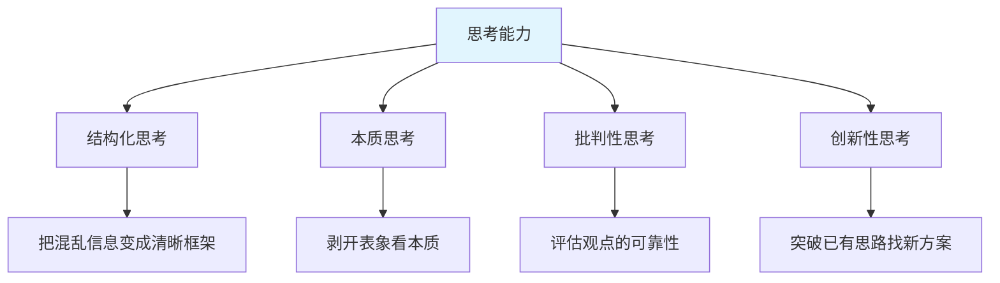
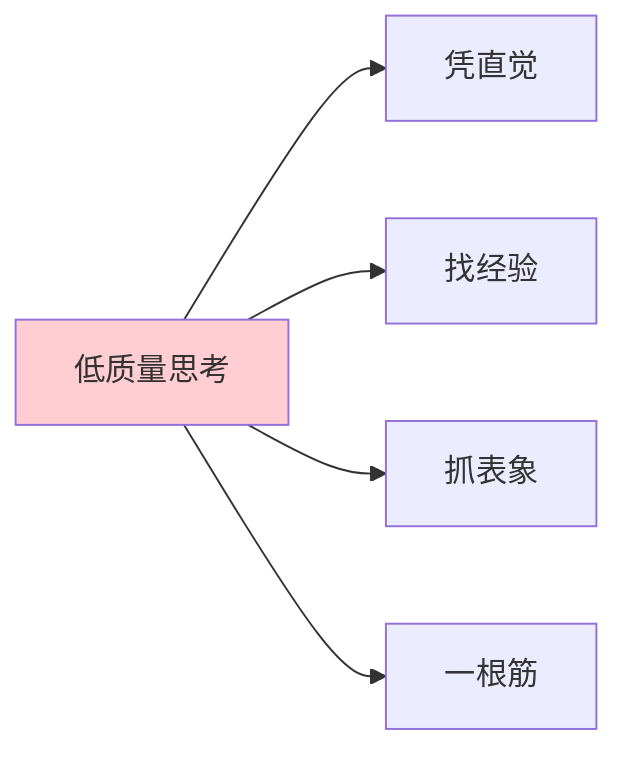
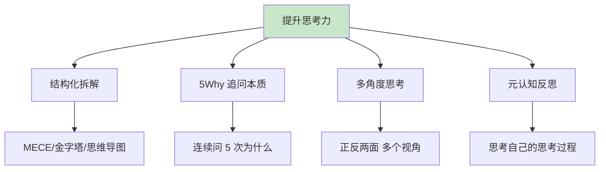
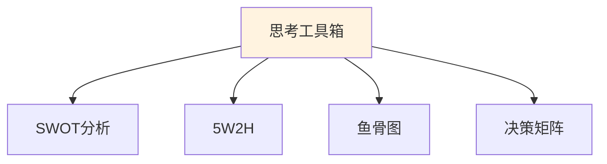
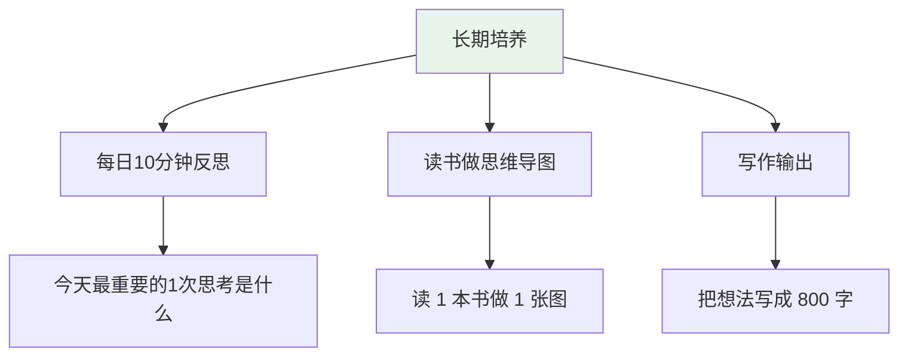
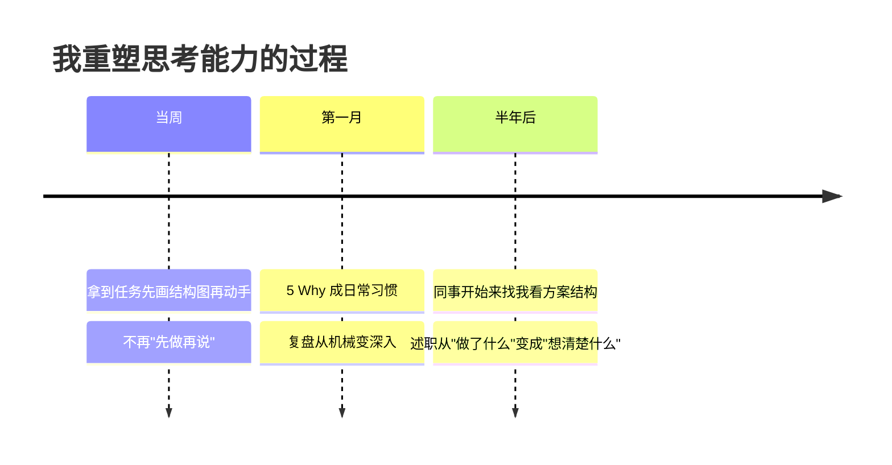
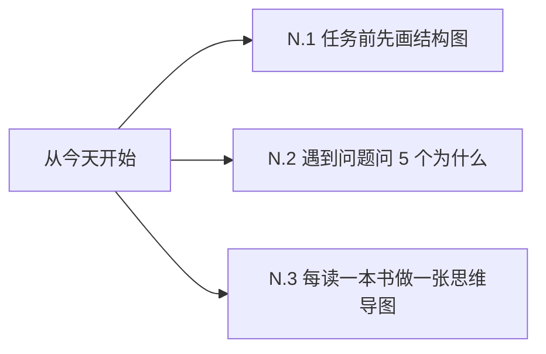

# 7.6思考能力的提升

#### 目录介绍
- [01.看一个真实案例](#01看一个真实案例)
- [02.什么是思考能力](#02什么是思考能力)
- [03.低质量思考的常见表现](#03低质量思考的常见表现)
- [04.提升思考力的核心方法](#04提升思考力的核心方法)
- [05.结构化思考的工具箱](#05结构化思考的工具箱)
- [06.把思考变成日常习惯](#06把思考变成日常习惯)
- [07.总结回顾这一节](#07总结回顾这一节)
- [08.后来发生的改变](#08后来发生的改变)
- [09.今天起改变三点](#09今天起改变三点)
- [10.课后作业思考下](#10课后作业思考下)

## 01.看一个真实案例

那是我入职第二年，组长安排了一个"做一份用户流失分析"的任务。我和同事小李同时领到。

我的做法：打开数据库，把 6 张表的数据全拉出来，开始一个字段一个字段看，今天看注册时间、明天看活跃天数、后天看付费数据……做了 3 天，写了 30 页 PPT，**核心结论一句也总结不出来**。

小李的做法：拿到任务先花 2 小时画了一张图：流失 = 「短期流失」+「中期流失」+「长期流失」，每一类找 3–5 个核心指标，每个指标对应 1 个 SQL。**第二天上午就交了报告**，3 张图说清楚了流失的核心原因。

组长看完小李的报告，对我说了一句让我蒙了三天的话：「**你不是数据不够，你是思考没结构。你在做'累活'，他在做'巧活'**。」

我那时候才意识到：我的执行力可能比小李强（更勤奋、加班更多），但**我的思考能力差他一个量级**。他先想清楚再做，我先做了再想；他用框架去切问题，我用力气去硬抗问题；他每一步都有"为什么"，我每一步都是"先做再说"。

工作 5 年后我深刻体会：**1 个想清楚的人，能顶 5 个埋头干的人**。这一节就是我从那次打击后，重学"思考"的总结。

## 02.什么是思考能力

思考能力可以拆为四个维度。

**结构化思考**：把混乱无序的信息整理成清晰的框架——MECE、金字塔、流程图，都是工具。

**本质思考**：能从纷繁的现象里看到背后的根本原因——不被表象迷惑，不被情绪干扰。

**批判性思考**：能评估一个观点是否可靠——找证据、识别假设、看逻辑漏洞。

**创新性思考**：能突破已有思路找出新方案——在所有人都说"只能这样"的时候，找到第三条路。

很多人把思考能力等同于智商，其实不是。**智商是天生的，思考能力是后天训练的**。很多智商一般的人通过刻意训练，思考能力远超天才——因为他们掌握了思考的方法论，而不只是依赖直觉。

## 03.低质量思考的常见表现

第一种是凭直觉，不验证。「我感觉这样行」「我觉得不行」——所有判断都基于第一反应，不去验证、不去推演。

第二种是找经验，不思考。遇到新问题，第一反应是"以前怎么做的就怎么做"。**经验在新场景下未必适用**——这就是"成功者陷阱"。

第三种是抓表象，不挖本质。用户流失了 → 增加促销活动；代码出错了 → 加几个 try-catch；关系紧张了 → 一起吃顿饭。这些都是表象处理，没有挖本质：用户为什么流失？代码为什么出错？关系为什么紧张？

第四种是一根筋，无对比。只想到一个方案就开始做，从不想"还有没有别的方案？哪个更好？"——这就是"先开枪再瞄准"。

## 04.提升思考力的核心方法

任何复杂问题，先用框架拆成小块。**MECE 原则**（相互独立、完全穷尽）：把"用户为什么流失"拆成「产品原因 / 用户原因 / 竞品原因 / 外部原因」四个互不重叠又覆盖全部的类别。**金字塔结构**：结论在最上，理由在中间，证据在最下，汇报必备。**思维导图**：把一个中心议题向外发散，每条分支再向下展开。

5 Why 追问本质。遇到问题，连续问 5 次"为什么"：

> 工厂的设备坏了。
> 为什么？因为电路烧了。
> 为什么？因为电流过载。
> 为什么？因为没装保险丝。
> 为什么？因为采购时没要求。
> 为什么？因为采购清单没列保险丝。
> **根本原因：采购清单不完善。**

如果只解决"换电路"，下次还会坏。

多角度思考也很重要。任何决策，至少从 3 个角度看一遍：自己的角度、对方的角度、第三方旁观者的角度。或者：短期视角、中期视角、长期视角。或者：技术视角、商业视角、用户视角。

元认知是思考自己的思考。定期反问自己：我刚才是怎么得出这个结论的？我用了哪些信息？哪些信息我忽略了？我的判断是基于事实还是基于情绪？如果换个人在我位置，他会怎么想？**思考自己的思考过程**，是高手最重要的功夫。

## 05.结构化思考的工具箱

SWOT 分析适合分析任何项目、任何决策时使用。

| 维度 | 含义 | 用途 |
|------|------|------|
| **S 优势** | 我们擅长什么 | 放大利用 |
| **W 劣势** | 我们短板在哪 | 弥补改进 |
| **O 机会** | 外部有什么红利 | 抢先抓住 |
| **T 威胁** | 外部有什么风险 | 提前防范 |

5W2H 适合定义任何任务时使用。**What**：做什么；**Why**：为什么做；**Who**：谁来做；**When**：什么时候做完；**Where**：在哪做；**How**：怎么做；**How much**：花多少成本。回答完这 7 个问题，任务就被定义清楚了。

鱼骨图（因果分析）适合分析问题原因时使用：把问题写在鱼头，从鱼骨向外发散——人、机、料、法、环、测，6 个大类下面再细分。

决策矩阵适合多个方案选择时使用：

| 方案 | 成本 | 收益 | 风险 | 时间 | 综合得分 |
|------|------|------|------|------|---------|
| A | 3 | 5 | 3 | 4 | 15 |
| B | 5 | 4 | 4 | 3 | 16 |
| C | 4 | 3 | 5 | 5 | 17 |

每个维度打分，加权求和。比"我感觉 B 好"科学得多。

## 06.把思考变成日常习惯

每日 10 分钟反思。睡前花 10 分钟反思：今天最重要的一次决策是什么？我是怎么想的？今天有没有"凭直觉"的时刻？事后看对吗？今天有没有可以做得更好的思考？

读书做思维导图也很有效。每读完一本书，强制自己做一张思维导图——**画图的过程就是结构化思考的训练**。被迫去想：作者的核心论点是什么？支撑论点的证据有哪些？这些观点之间的逻辑关系是什么？

写作是最好的思考训练。把你的想法写成一篇 800 字的文章——你会发现很多原本"想清楚了"的东西，写下来才发现根本没想清楚。**写作 = 强制结构化 + 强制证据化 + 强制逻辑化**。

## 07.总结回顾这一节

一句话核心：**思考能力是后天训练的肌肉——结构化拆 + 5 Why 挖 + 多角度看，三招贯穿一生**。

你应该带走的三件事：

1. **想清楚再做**比"先做了再说"快 5 倍
2. **结构化思考 + 5 Why + 多角度**，是思考的三件套
3. **写作和画图**是最好的思考训练，不是产物

## 08.后来发生的改变

第一周开始，我给自己定了一条死规定：**任何任务拿到后，先花 30 分钟画结构图，再动手**。刚开始觉得"耽误时间"，但执行了 5 天后我发现：**画图花的 30 分钟，节省了后面 3 小时的弯路**。同事看我画的图，都说"思路清晰"。

我把 5 Why 写在显示器边上的便利贴上，提醒自己每次遇到问题先问。线上 bug、客户投诉、团队冲突——任何场景我都连续问 5 次"为什么"。**有时候问到第 4 次才发现真正的根本原因和最初想的完全不一样**。复盘从原来"什么时候出问题、谁的锅"，变成了"根本原因 + 系统性改进措施"。

半年后，组里同事经常拿方案来找我："你帮我看看这个结构对不对"。我变成了"看方案"的人。述职的时候，老板对我说："**你今年最大的进步不是做了多少事，而是开始'想清楚'了。一个'想清楚的人'比一个'做了很多事的人'更值钱**。"那次我第一次拿到了 A 等绩效。

## 09.今天起改变三点

不要急着开干。打开白纸或思维导图工具，把任务拆成 3–5 个模块，每个模块再拆 3–5 个子项。**先把骨架想清楚，再去填血肉**。

线上 bug、关系冲突、自己情绪——任何问题，强迫自己问 5 次"为什么"。一定要追到**根本原因**，而不是停在表象。

读完后合上书，凭记忆画一张图：作者讲了什么核心论点？有哪些支撑证据？逻辑关系如何？**画不出来的，就是没真的读懂**。

## 10.课后作业思考下

**自检类**：

1. 回想最近一周你做的最重要的 3 个决策——它们是凭直觉做的，还是经过结构化思考的？事后看哪些做对了？哪些做错了？
2. 你和身边那个"想得清楚"的人，最大的差距是什么？是知识量、是经验、还是思考方法？

**实践类**：

3. 挑一件你最近的工作任务，用 5W2H 方法重新定义一遍，看看是否能发现之前没想清楚的点。
4. 用 5 Why 法分析最近一个让你头疼的问题（线上 bug、关系冲突、自己的情绪），追到根本原因，写一段 200 字总结。
