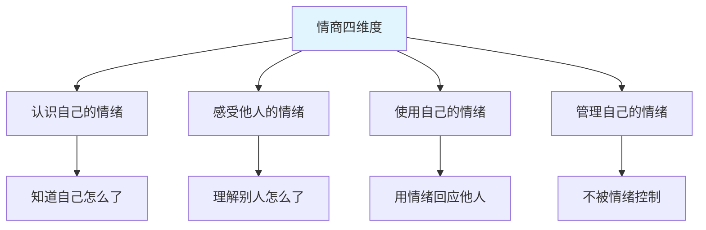
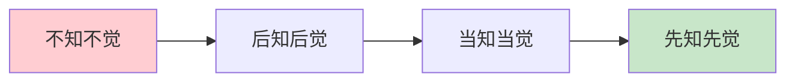
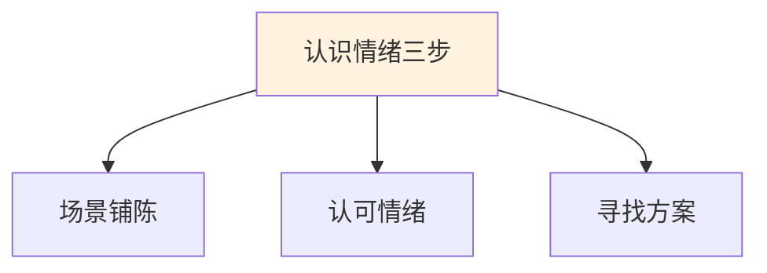
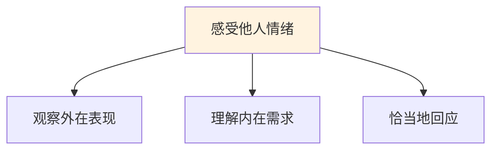
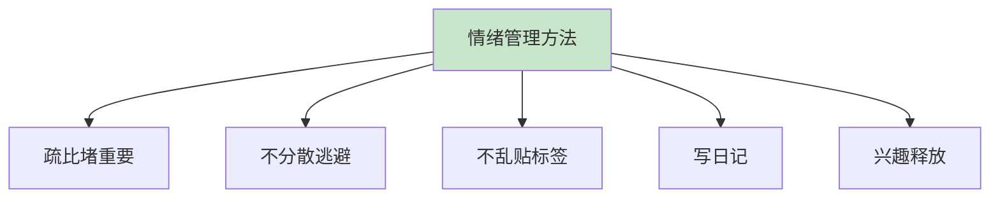
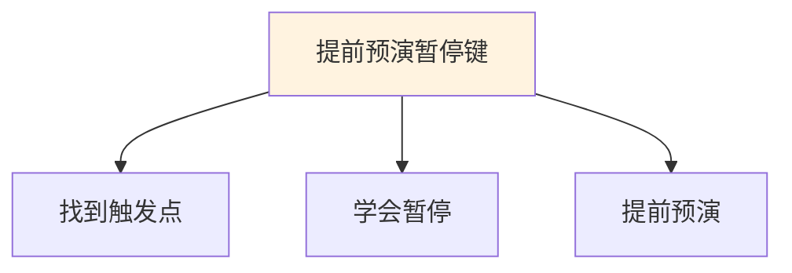
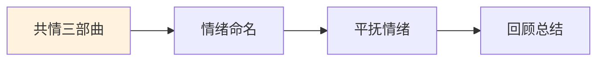
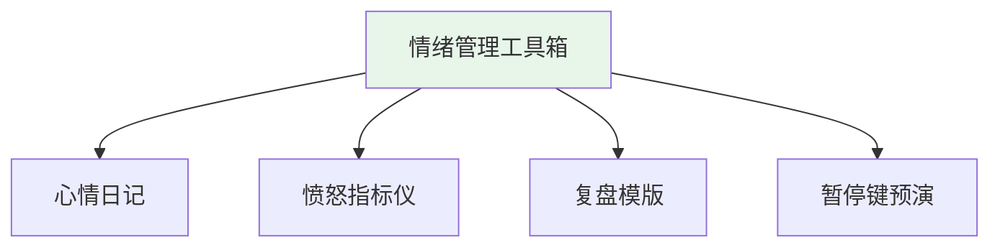
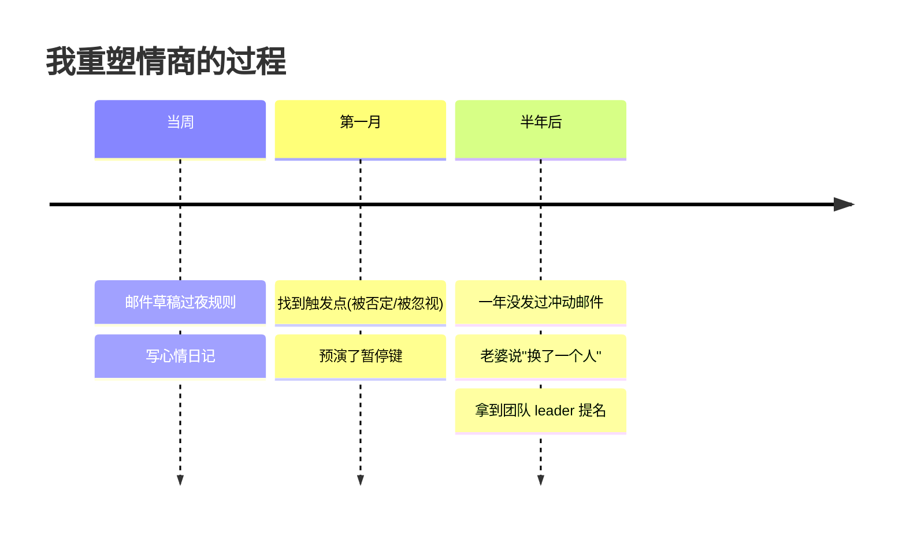
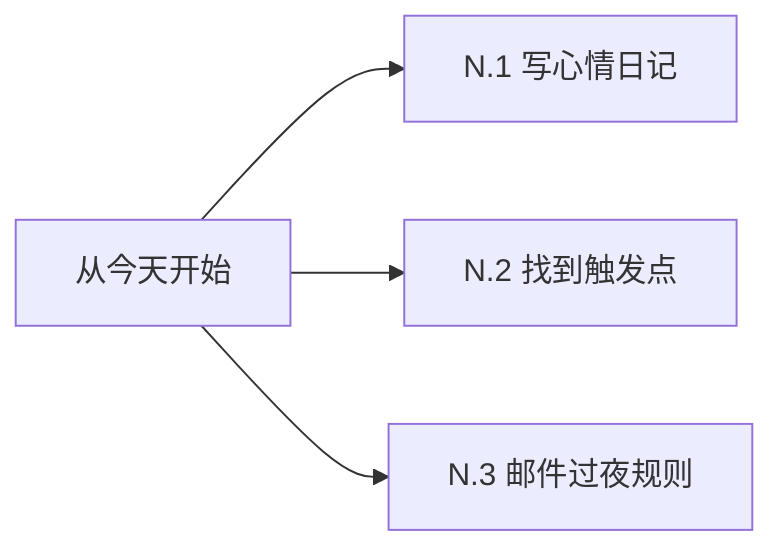

# 7.7情商能力的学习

#### 目录介绍
- [01.看一个真实案例](#01看一个真实案例)
- [02.情商到底是什么](#02情商到底是什么)
- [03.情绪管理四阶段](#03情绪管理四阶段)
- [04.如何认识自己的情绪](#04如何认识自己的情绪)
- [05.感受他人的情绪](#05感受他人的情绪)
- [06.使用和管理情绪](#06使用和管理情绪)
- [07.提前预演暂停键](#07提前预演暂停键)
- [08.情绪共情三部曲](#08情绪共情三部曲)
- [09.情绪管理工具箱](#09情绪管理工具箱)
- [10.总结回顾这一节](#10总结回顾这一节)
- [11.后来发生的改变](#11后来发生的改变)
- [12.今天起改变三点](#12今天起改变三点)
- [13.课后作业思考下](#13课后作业思考下)

## 01.看一个真实案例

那是我入职第三年，跨部门合作一个项目。对方部门的 PM 发了一封邮件抄送了我们老板，措辞是"贵团队的接口质量太差，导致我们项目延期"。

我看完气得不行，**5 分钟内回复了一封邮件**，列了对方 6 条不专业的地方，最后一句"请下次提需求前先把你们自己的事做明白"，**也抄送了老板**。

发完那一刻特别痛快。**第二天痛快变成灾难**：对方部门老大直接把邮件转给我们老板，要求我"道歉并承担项目延期责任"。我们老板找我谈话，第一句话："**你的技术没问题，但你的情商让你成了团队的炸弹**"。

那次我差点被调岗，最后写了 2000 字检讨才平息。回家路上我盯着地铁玻璃里的自己，想了很久——**我比同龄人技术好，为什么职业天花板这么低？**

复盘后我发现答案：我每个月都因为情绪问题制造一次冲突。老婆说"今晚加班别忘了吃饭"，我回"知道了别管"，吵架；同事邀请我帮忙，我回"我自己事都做不完"，关系裂；老板批评我"这部分思考浅了"，我立刻反驳，被记仇。所有这些场景里，**我不是没察觉情绪，而是完全不会管理情绪**。情绪一来，理性立刻下线，事后又后悔到睡不着。

这一节是我从那次邮件事故后，认真补"情商"这门课的总结——它救了我的婚姻、我的职场，也救了我自己。

## 02.情商到底是什么

情商不是"会说话"或"八面玲珑"那么简单，它包含四个维度。

**认识自己的情绪**：知道自己当下处于什么情绪——是愤怒、焦虑、失落还是开心。很多人只觉得"烦"却说不清为什么。

**感受他人的情绪**：能察觉到身边人的情绪状态。生活中那些被叫"缺心眼儿"的人，往往就是缺这个能力。

**使用自己的情绪**：善于用表情、语气来回应他人。跟高情商的人聊天，你会觉得特别舒服。

**管理自己的情绪**：在极端情绪状态下还能做出理性选择。

下表对比情商低与高的典型表现：

| 维度 | 低情商表现 | 高情商表现 |
|------|-----------|-----------|
| **认识情绪** | "不知道，就是烦" | "我现在感到焦虑，因为XX" |
| **感受他人** | 别人不开心时讲自己的事 | 察觉对方情绪并恰当回应 |
| **使用情绪** | 永远板着脸 | 用表情语气让对方感到被理解 |
| **管理情绪** | 顺时狂躁逆时崩溃 | 顺逆都能保持稳定 |

## 03.情绪管理四阶段

第一层是不知不觉。完全被情绪支配，对谁都没好脾气。**自己都不知道怎么了，怎么管理情绪？**

第二层是后知后觉。事后才意识到情绪问题。"我真的不想这样，我当时就是控制不住"。停留太久会陷入自责死循环。

第三层是当知当觉。突破口是**写心情日记**。每天睡前回顾，记录三件事：之前发生了什么？心理变化怎样？最终爆发时如何？不断积累后，对情绪起伏会越来越敏锐——在情绪升起的当下就能觉察。

第四层是先知先觉。进一步思考"如何提前预防"。在心情日记里追加："如果同样情况再次发生，我哪里可以做得更好？"复盘时要落实到**"具体动作可以怎么做，话应该怎么说"**——这是"情绪管理复盘"。

## 04.如何认识自己的情绪

情绪认知的第一个要素是**场景铺陈——理解"为什么会有这样的情绪"**。情绪由特定场景触发。比如"我难过"——什么时候难过？被排除在讨论外时？分享没人听时？

第二个要素是**认可情绪——情绪没有好坏之分**。所有情绪都是正常反应，是信号灯告诉你内心正在发生什么。认可它才能管理它。

第三个要素是**寻找方案——知道情绪后如何应对**。比如"难过时我可以告诉身边人，他们会陪伴我"。

情绪命名训练也很重要。很多人只会说"烦""不爽"——太笼统。试着用更精准的词汇：

| 大类 | 细分情绪词汇 |
|------|-------------|
| **愤怒系** | 生气、恼火、愤怒、不满、被冒犯 |
| **悲伤系** | 难过、失落、沮丧、心酸、惆怅 |
| **焦虑系** | 担忧、紧张、不安、恐惧、慌张 |
| **愉悦系** | 开心、满足、感动、自豪、平静 |
| **其他** | 尴尬、委屈、嫉妒、内疚、迷茫 |

颗粒度越细，对自己了解越深。"我生气了"和"我觉得被冒犯"需要不同应对策略。

身体语言觉察同样关键。注意身体信号：心跳加速、拳头握紧、肩膀耸起 → 愤怒或紧张；浑身无力、呼吸变慢 → 悲伤或沮丧。通过身体信号识别情绪，比等到爆发时反应要好得多。

## 05.感受他人的情绪

培养对他人情绪的敏感度有两个关键。**观察力**：通过表情、语气、语速、肢体语言捕捉信号。声音变小可能是沮丧，语速加快可能是焦虑，眼神回避可能是尴尬。**同理心**：不仅看到"他生气了"，还要进一步理解"他为什么生气"。

不同场景下要训练情绪感受。家里：来客人时是欢乐的，刚起床时是平静的，下班回来时情绪如何？经常觉察家庭氛围有助于维护关系。职场：办公室里同事情绪如何？开会时谁在压抑不满？项目紧张时团队走向如何？公共场所：地铁、餐厅、商场，多观察氛围和人的反应，可以大幅提升情绪感知力。

要注意几个常见错误。**急于给建议**：第一反应不应该是"你应该怎么做"，而是"我理解你的感受"。先倾听共情，再给建议。**否定对方情绪**："你有什么好难过的""这点事算什么"——会让对方感到不被理解。**只关注自己**：别人说困扰，你接话"我也是啊我比你更惨"——这不是共情，是把焦点转回自己身上。

## 06.使用和管理情绪

千万不要脱口而出"不许伤心""振作起来"。负面情绪不被疏导只会越积越多，最终以更严重形式爆发。**正确做法是给情绪一个出口**——允许自己伤心、哭、暂时低落，再在情绪平复后理性分析问题。

不要用分散注意力来逃避。一有情绪就吃东西、刷手机、看剧——短期止痛但长期是逃避。需要直面情绪问题，先搞清"我怎么了""为什么"，再寻找方案。

不要乱贴标签。情绪不好不意味着人不好。**情绪没有好坏之分**。承认"我这次情绪管理做得不好"和否定"我是个情绪化的人"完全不同——前者建设性，后者破坏性。

写日记记录心情简单却最有效。书写中思绪慢慢理清，很多想不通的事在写的过程中就想通了，达到自我和解。

通过兴趣爱好释放情绪也是好方法。**户外活动**：与大自然接触带来平静。**冥想放松**：通过深呼吸减轻焦虑。**运动释放**：跑步、游泳、打球释放内啡肽。**创造性表达**：写作、音乐、绘画宣泄又有产出。

## 07.提前预演暂停键

每个人都有特别容易失控的"触发点"——别人无所谓你却一触即发。这是因为记忆中有"隐性记忆"：过去不愉快的经历在类似情境下被激活。**追根溯源**：我刚才怎么了？什么事让我这么难受？为什么到了临界点就爆发？曾经发生过什么类似的事？感知触发点后才能有的放矢——不是针对这件事，而是某种感受触动了内心深处的经历。

暂停的方式有两种。**学会放下**：闭眼想象当年那个受伤害的自己，对他说"我已经长大了，我现在选择放下"。**提前预演"暂停键"**：每个人方式不同——离开现场、深呼吸、心里默数 10 秒、捏一下手指。**关键是平静时提前预演**——想象失控情景，练习暂停动作和应对话术。

下表是愤怒指标仪：

| 愤怒等级 | 我的表现 | 我可以做什么 |
|----------|----------|-------------|
| **轻微** | 叹气、内心不满 | 深呼吸，提醒冷静 |
| **中等** | 嗓门变大、语气变冲 | 暂时离开，喝杯水 |
| **严重** | 大声争吵、想摔东西 | 立刻停止，离开 15 分钟 |
| **极端** | 完全失控、说伤人话 | 紧急暂停，事后复盘 |

高情商其实就是**内在觉察力特别高**——清楚知道自己情绪到了什么程度，并知道该怎么应对。

## 08.情绪共情三部曲

千万不要把共情变成套路。人很敏感，能分辨真心理解还是话术应付。**真接纳**："你真的很难过，如果是我也会特别难受。你想聊聊吗？"——真诚发自内心。**假接纳**："你好生气，因为你的方案被否定了。"——机械、背台词、没情感。

共情的第一步是情绪命名，直面情绪。先温柔陪伴，给一个缓冲时间，用心去感受对方处境。

第二步是平抚情绪，自我管理。先看是什么事刺激了自己，产生什么情绪，多强烈；再思考自己对这件事的判断和态度是否有问题；如果改变态度还不能稳定，就考虑深层认知模式是否需要调整。情绪是认知评价的反映。改变认知，能间接改变情绪。

第三步是回顾总结，提炼经验。情绪平复后趁热打铁复盘——以后类似事情怎么做？这一步是把情绪管理从"偶然做到"变成"稳定能力"的关键。

## 09.情绪管理工具箱

心情日记是最基础的工具。每天睡前 5–10 分钟问自己：今天最强烈的情绪是什么？是什么事触发的？我当时怎么反应？如果重来一次会怎么做？坚持一个月你会发现：你对自己的情绪模式有清晰认识——什么事最容易让你失控、你通常怎么反应、最需要改进的是什么。

下表是情绪复盘模版：

| 环节 | 问题 | 你的记录 |
|------|------|----------|
| **背景** | 当时情绪是什么？什么事触发？ | ______ |
| **归因** | 这个情绪的本质原因是什么？ | ______ |
| **行动** | 我当时做了什么？效果如何？ | ______ |
| **优化** | 如果再来一次会怎么做？ | ______ |

情绪管理还有几条底线原则。**不在愤怒时做重大决定**：愤怒时做的决定 80% 以上会后悔。给自己至少 24 小时冷静期。**不在情绪激动时发消息/邮件**：写完先存草稿，第二天再看。很多内容你不会再想发出去了。**光宣泄情绪没有用**：吵完哭完，问题还在。先处理情绪，再处理问题。

## 10.总结回顾这一节

一句话核心：**情商不是会说话，是"觉察 + 暂停 + 共情"——能在情绪上头时，把理性请回来**。

你应该带走的三件事：

1. **认识 / 感受 / 使用 / 管理**，是情商的四件套
2. **写心情日记 + 找到触发点 + 预演暂停键**，是最实用的三个工具
3. **不在愤怒时发邮件，不在激动时做决定**，能避开 80% 的人生大坑

## 11.后来发生的改变

事故后我给自己定了一条死规定：**任何情绪化的邮件、消息，一律先存草稿，过夜再看**。第一周我存了 4 封"想骂回去"的邮件。第二天早上看，4 封全没发——我自己都觉得当时太冲动。

我开始写心情日记。一个月后我发现自己有两个核心触发点：第一是**被否定专业能力**——别人说我技术不行/思考不深时，我会立刻爆炸；第二是**被忽视存在感**——别人开会不点我名/邮件不抄我时，我会闷火好几天。知道触发点后我做了两件事：提前预演——下次再遇到时，我会先深呼吸 5 秒，然后说"我想理解一下你的意思……"；心理放下——告诉过去那个一直被否定的自己"那已经过去了"。

半年后整整一年我没发过一封冲动邮件。**职场关系变好到我自己都意外**——以前那些和我有过节的同事，开始主动找我合作。老婆有一天说："你最近变得**不一样了**——遇到不顺心的事不再发火，会先问我'你刚才那句话是什么意思'。我感觉嫁了一个新老公。"更意外的是，去年年底**我被提名为团队 leader**。老板说理由是："你的技术能力一直都在，但今年我看到的是一个'稳得住的人'——这才是带团队的关键。"

## 12.今天起改变三点

睡前 5 分钟记录：今天最强烈的情绪 / 触发因素 / 我的反应 / 如果重来怎么做。坚持一个月，对自己情绪模式会有全新认识。

回忆最近一次失控经历：什么事触发的？为什么偏偏这件事？深层原因是什么？找到触发点后**提前预演一个暂停键**——下次遇到时第一反应是什么。

任何在情绪激动时想发的邮件、消息、朋友圈，**全部先存草稿过夜**。第二天再看你会感谢自己。

## 13.课后作业思考下

**自检类**：

1. 对照情绪管理四阶段（不知不觉/后知后觉/当知当觉/先知先觉），判断你目前在哪个阶段？下一步目标是什么？
2. 回顾你生活和工作中最容易让你失控的"触发点"是什么？背后的深层原因是什么？

**实践类**：

3. 从明天开始连续写 7 天心情日记，记录最强烈的情绪、触发因素、反应、如果重来怎么做。7 天后回顾找出你的情绪模式。
4. 回忆一次面对别人负面情绪的经历——对照"共情三部曲"，你做得好的和不够好的环节分别是什么？下次如何改进？
