# 1.1小白快速带团队

#### 目录介绍

- [01.开头故事的引入](#01开头故事的引入)
- [02.管理到底做什么](#02管理到底做什么)
- [03.新晋者面临问题](#03新晋者面临问题)
- [04.何为管理四象限](#04何为管理四象限)
- [05.四象限一之管事](#05四象限一之管事)
- [06.四象限一之管人](#06四象限一之管人)
- [07.四象限一之理事](#07四象限一之理事)
- [08.四象限一之理人](#08四象限一之理人)
- [09.管理的核心原则](#09管理的核心原则)
- [10.管理风格的类型](#10管理风格的类型)
- [11.转变管理的角色](#11转变管理的角色)
- [12.最后需总结一下](#12最后需总结一下)
- [13.故事的回响](#13故事的回响)
- [14.思考题和作业](#14思考题和作业)

## 01.开头故事的引入

去年 6 月的一个下午，我被 Leader 叫进会议室，他说："下周开始你带这个 5 人小组吧。"那一刻我心里半是兴奋半是发慌，兴奋是终于等到了这一天，发慌是压根不知道"带团队"这仨字具体要做什么。

回到工位，我第一反应是打开浏览器搜"技术经理第一周该做什么"，结果跳出来的大多是《高效能人士的七个习惯》《领导力 21 法则》这种宏大叙事。道理都对，但没一条告诉我："周一早会该讲什么？周三 1v1 该问什么？周五写周报要拉谁过目？"那一整周，我白天装作一切尽在掌握，晚上回家辗转反侧，焦虑到凌晨两点还在翻书。

**老 Leader 的一句话点醒我。** 第二天我去请教隔壁部门一位做了 8 年 TL 的老大哥。他听完我的困惑，笑着在白板上画了一个田字格，写了四个字：**管事、管人、理事、理人**。

他说："带团队的事你就把它拆成这 4 个象限，每天问自己，今天手上事推进了吗（管事），今天和谁 1v1 了吗（管人），流程机制完善了吗（理事），团队氛围怎么样（理人）。**你不用一下子成为大师，你只需要每天在这 4 个格子里各挪一小步。**"

这一课，成了我管理启蒙的第一课。下面这张图，就是我后来反复咀嚼那句话之后，为自己画的"第一张管理地图"。今天这一节，我把他那套"4 象限"心法，配合我这一年踩过的坑，完整讲给你。

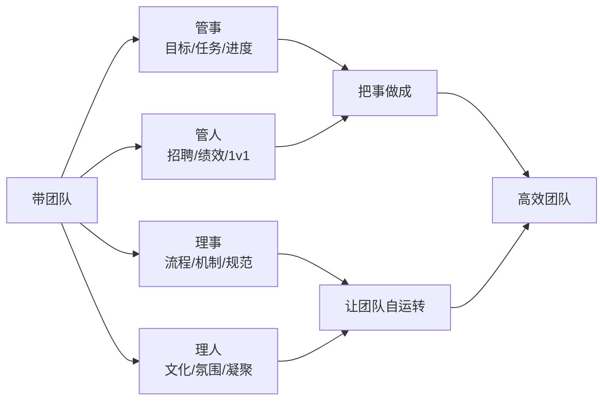

## 02.管理到底做什么

要谈"怎么带团队"，得先回答"管理到底是干什么"。这一节我们先把管理这件事的"外延"和"内核"讲清楚，后面几节的四象限才有落脚点。

时常会被问到，如何打造高效执行的团队，如何做团队建设等等。这类问题共同点就是"大"，很难给出系统的回答，因为这些问题本身包含着很多子问题。

对于第一个问题"如何打造高效执行的团队"，至少包含这样三个子问题：1.如何打造团队？2.如何让这个团队有高效的执行力？3.如何定义"高效"？

对于第二个问题也是如此，"如何群策群力打胜仗"，也至少需要回答三个子问题：1.如何群策群力？2.如何打胜仗？3.如何定义打"胜"了？

对于第三个问题，"如何做团队建设"，要想回答好，也得先弄清楚：1.在你眼里什么叫团队建设？2.这个词太泛泛了。你希望通过做团队建设达到什么目的？3.如何着手做？

于是你发现了，一个大问题背后依然是多个难以捉摸的大问题，很难理出头绪。因为问题很大，所以无法做出精确回答。拆问题的能力，恰恰是管理者的底层能力之一。

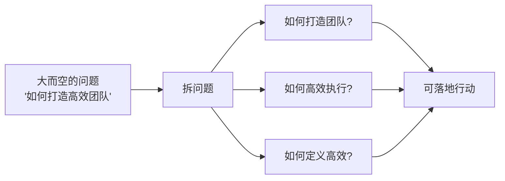

对于"管理是什么"，三位管理学大师给出了各自视角，值得我们仔细品味。

古典管理理论的代表人物亨利·法约尔认为，"管理是由五项要素组成的一种普遍的人类活动，这五个要素是：计划、组织、指挥、协调和控制。"由此可以看出他特别关注管理的过程性，强调"做事"，不愧为"管理过程学派"的创始人。

科学管理之父弗雷德里克·泰勒认为，"管理就是确切地知道你要别人干什么，并使他用最好的方法去干。"他关注的焦点在于干什么，以及怎么干，有明显的目标性和方法性，强调"目标"和"做事"。

现代管理学之父彼得·德鲁克认为，"管理是一种实践，其本质不在于'知'，而在于'行'；其验证不在于逻辑，而在于成果。其唯一权威就是成就。"这个说法的焦点在于实践性和结果性。众所周知，德鲁克是"目标管理理论"的创始人，尤其强调"目标"。

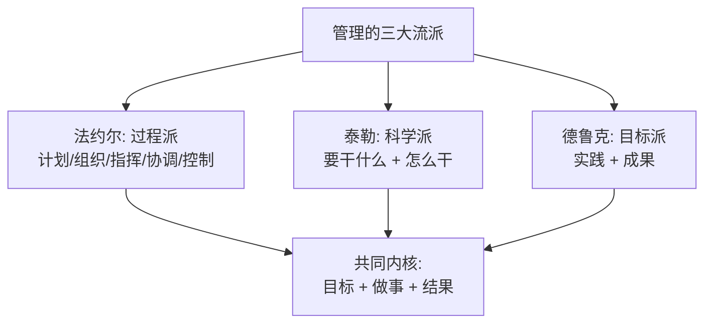

讲完大师理论，我们落到具体动作。管理规划的四个要素，对应明确回答了下面这四个问题：你团队是干什么的？你团队想做出什么成果？你依靠什么样的团队？你需要投入哪些资源？

所谓的管理规划，其实就是要管理者说明白一个问题，即，你想要什么目标，以及你需要投入什么资源。由于目标取决于团队的职能，而团队又是管理者的核心资源。所以，一份合格的规划报告，至少需要体现职能、目标、团队、路径这四个要素。

把管理规划拆解为四个最核心的要素来着手操作，分别是：职能，关于团队是干什么的；目标，关于要带团队去哪里；团队，关于依靠谁去达成目标；路径，关于走哪条路以及投入哪些资源。这四个要素回答了"是什么、去哪里、靠谁、怎么走"四个问题，也就构成了任何管理规划文档的骨架。

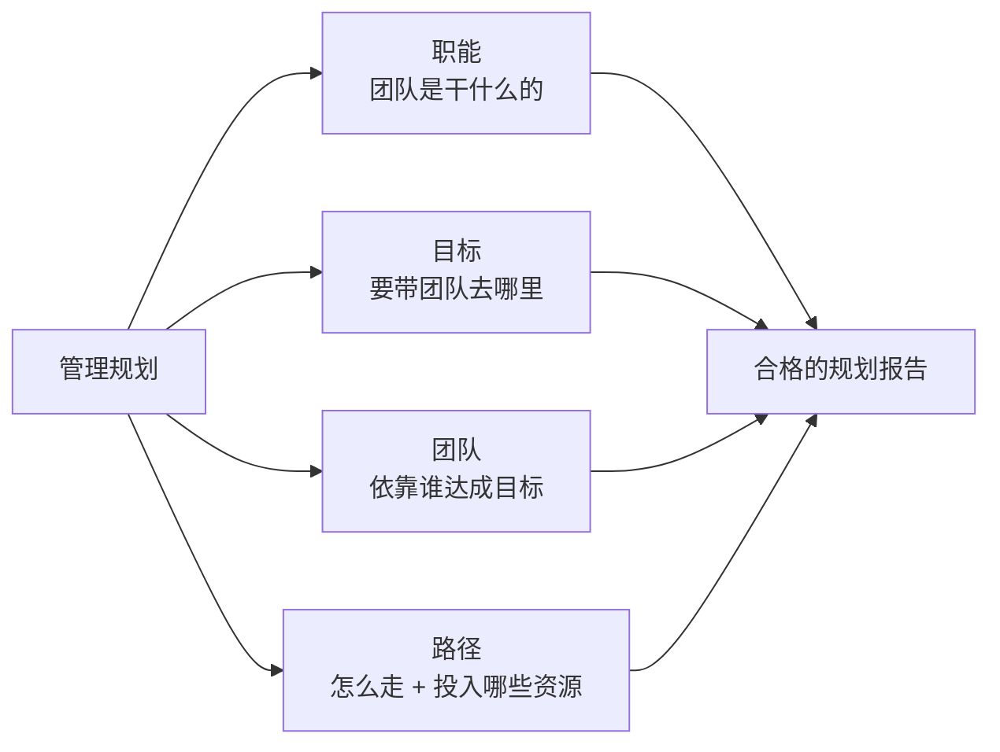

## 03.新晋者面临问题

搞清楚管理的本质之后，问题来了：刚走上管理岗的人，真正卡住自己的不是理论，而是"第一步到底该先做啥"。这一节我们盘一盘新晋者最容易踩的坑。

新晋管理者面临的一个非常大的问题就是不知道要做什么。有的人可能自己去看一些管理的书籍进行学习，但是对于学习的内容是否正确，是否适合当前团队其实也是心存疑虑。

其实，无论你采用谁的管理方法，变化的只是理念和技巧，管理的工作范畴本身是不变的。与其到处寻找"最正确的那一本书"，不如先问自己的初心："你到底想要的是什么？你能为上级、下级和公司带来哪些价值呢？"把这两个问题想透，比读十本管理书更有用。

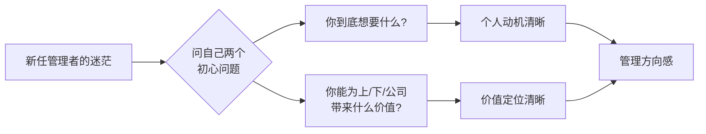

到一个全新的团队，同时面临全新的上级、下级、平级合作者和新的业务。此时，如果这个空降的管理者就是你，你会首先做哪几件事呢？

和关键角色建立沟通关系。这一条属于管理沟通。和几位核心下属管理者沟通，了解他们的情况、看法和期待。和上级对齐期待。这一条属于角色认知。和上级沟通，了解一下团队的整体情况，以及团队的职责。问问有没有特别需要注意的地方。

规划未来的管理愿景。这一条属于管理规划，即"看方向"。跟上级制定自己的目标，给下属阐述团队的未来规划。盘点和熟悉当前的团队。这一条属于团队建设，即"带人"。和团队每个人都聊一遍，跟大家建立联系。先评估团队的稳定性，稳定团队是首要的。确保当下的要事，梳理优先级。这一条属于任务管理，即"做事"。先看看手头上有哪些重要的工作是要确保完成的，梳理优先级。

不同的管理者，关注的重点也是不同的，每个人都从自己的视角和经验给出了自己的建议。大家都做出了自己认为的最好选择，是否合适、是否有效，只有当事人清楚。

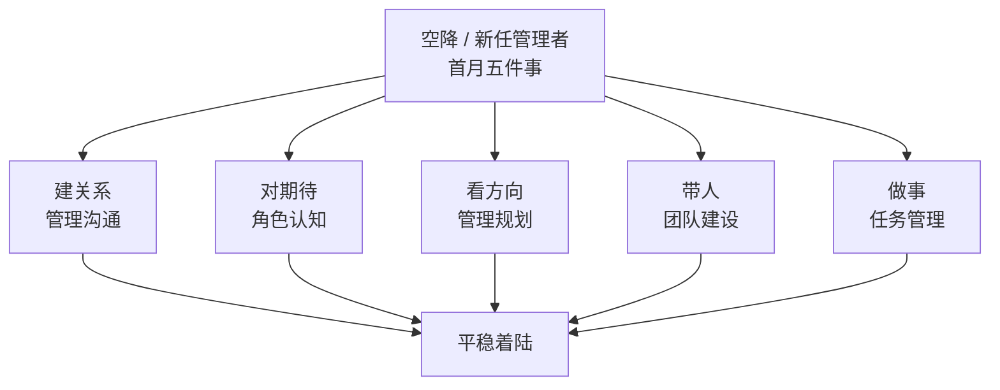

**可以做这些事情。** 上一节讲的是"思路分类"，这一节讲"具体动作清单"，两者对应起来才好落地。

首先是建立合作关系，也就是把沟通通道先建起来，比如直接上级、核心下级、重要合作平级等。沟通是管理工作的载体，而建立沟通通道则是沟通的前提。其次是盘点团队当前工作的轻重缓急，这是为了保持工作推进的平滑稳定，不能因为你的到来耽误了重要工作的正常进展。至于长期来看是不是最合理的安排，可以后续通过管理规划来重新审视。

再次是盘点团队人员情况。还记得"团建六要素"吗？能力、意愿、分工、协作、梯队和文化，可以从这六个方面去审视团队现状，为管理规划提供信息。紧接着就是管理规划。随着你对业务情况、团队人员的逐渐了解，你可以逐步做出自己的管理规划了，即未来三个月或半年，你希望把团队带成什么样子，做出什么业绩。最后是对齐目标。跟领导对齐"六个月我做好哪三件事，领导会比较满意"，同时跟下属对齐他们的目标。这样上下一条心，执行起来就不会偏航。

**入手管理框架图。** 有了上面的动作清单，我们还需要一张"全景图"把它们挂起来。到底就管理的哪些问题积累方法论呢？你不妨从"管理全景图"各个要素入手，根据实际工作场景有意识地积累。

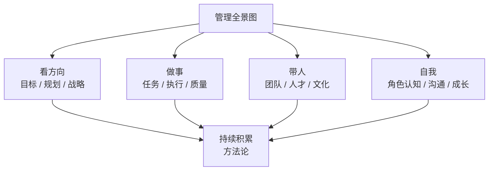


## 04.何为管理四象限

管理四象限的整体思路是，从管理的手段和范围来进行拆解，手段有两类，管和理，范围有两个，人和事，它们组合就得到了四个象限。这一节我们先把"管""理""人""事"四个基本概念拆清楚，下四节再分别讲四个象限。

**管和理。** "管"有一定的"强制"含义，可以形象地理解为从上往下压；"理"有一定的"辅助"含义，可以形象地理解为从下往上托，两个手段缺一不可。

如果你只"管"不"理"，就是把团队当成你往上爬的工具和台阶，这样团队的凝聚力往往不高，人心不太稳定。如果你只"理"不"管"，团队做事很可能就没有章法，战斗力往往不高。真正成熟的管理者，是能在"管"与"理"之间自由切换的人。

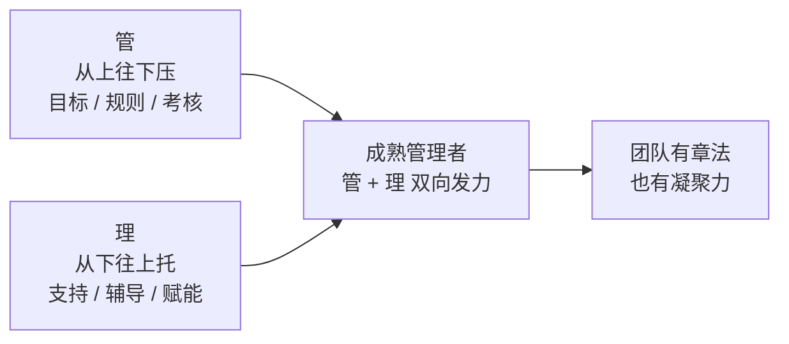

**人和事。** "人"就是团队成员，管理就是想方设法发挥出人最大的潜能；"事"就是团队要做的事情，管理就是想方设法带领团队为公司创造最大的价值，拿到更好结果，这也是"价值原则"的一个体现。

"人"和"事"不是割裂的，事是由人来做的，人是靠做事来成长的。管理者最常犯的错误就是只盯事不看人，短期能拿结果，长期团队会被耗空。

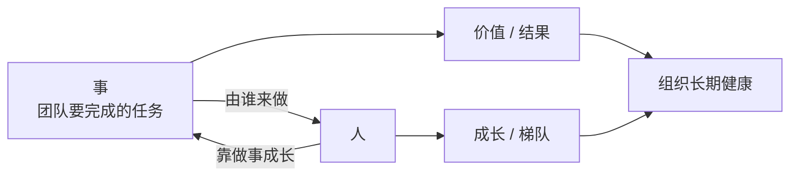

## 05.四象限一之管事

"管事"是管理者最容易上手的一块，因为它最像"执行者角色的延伸"。管事包括三个部分：团队规划、团队执行和团队汇报。

**团队规划。** 团队规划是指，制定团队一定周期内的目标和主要事项。通常情况下，管理者需要基于上级管理者的规划以及团队自己的情况，制定半年或者一年规划。

这对于新晋管理者来说是最大的一项挑战，既要承接上级意图，又要结合团队实际，还要在资源有限的前提下做取舍。具体规划方法可以参考 OKR 规划法，先定北极星目标，再拆关键结果，最后落到项目和人。

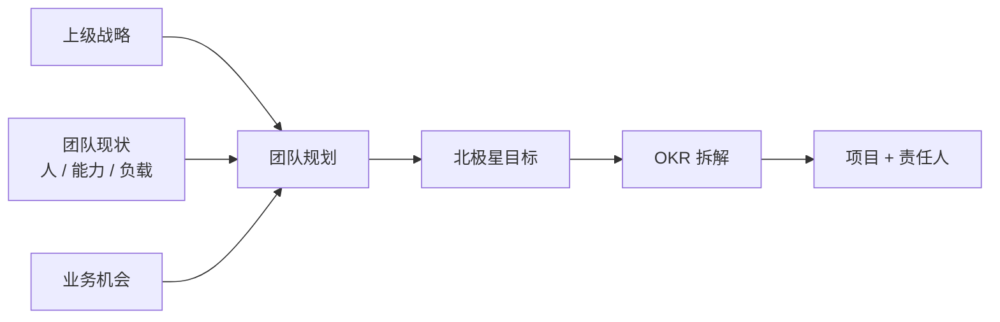

**团队执行。** 团队执行是指，将团队规划的事项落地，包括人力安排、时间安排、进度跟踪和问题处理等。有的事项需要管理者亲自执行，有的需要安排骨干人员执行，但不管由谁来执行，管理者都是最终结果的第一责任人。

新任管理者最容易在执行环节踩两个坑：一是什么都想亲自上，结果团队没长起来自己先累趴；二是安排完就不管了，结果出问题时已经晚了。正确的姿势是"盯关键节点、放日常过程"。

**团队汇报。** 团队汇报是指，归纳总结团队的工作情况，将信息反馈给上级。有些人觉得，只要带领团队把事情做好，上级肯定能看到，用不着专门汇报；也有些人害怕如果回答不出上级问的问题，会让上级觉得自己能力不行，所以不敢主动汇报。

其实这些都是错误的想法。汇报对于个人和团队的绩效评价有很大的影响，对于管理者的成长也有很大的意义。具体汇报方法可以参考金字塔汇报法：先抛结论、再给论据、最后列行动项。

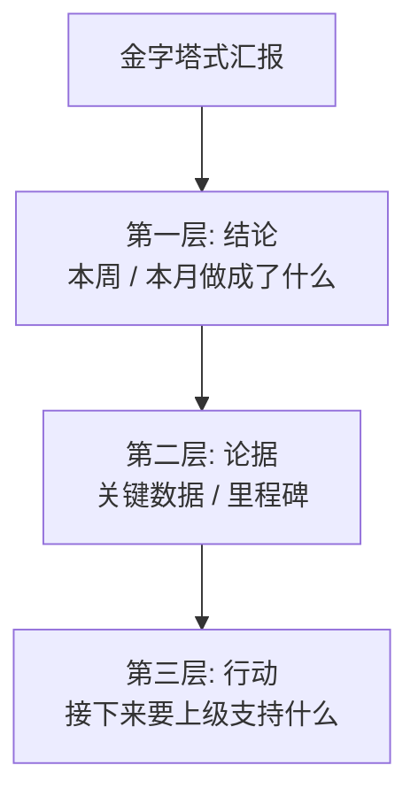

## 06.四象限一之管人

管事是"硬指标"，管人是"软功夫"。管人包括三个部分：团队构建、团队运作和团队考核。

**团队构建。** 团队构建是指，如何打造符合业务发展需要的团队。很多人有一个错误的认知：团队构建就是把 Head Count 招满，HC 不够就招聘，有人离职就补招。

实际上，招聘只是团队构建的一部分工作，人员优化、人员汰换和团队梯队设计这些事情也很重要，你需要持续不断地对团队进行打磨。一支战斗力强的团队，背后一定有一套"选、育、用、留、汰"的完整机制。

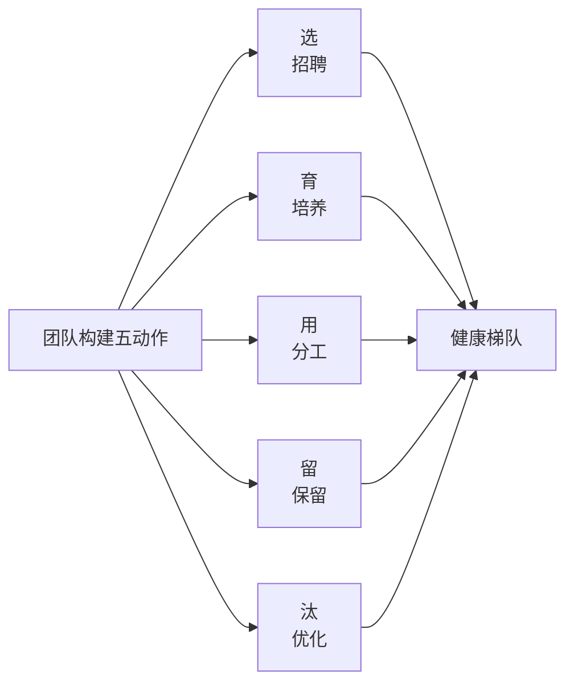

**团队运作。** 团队运作是指，通过制定团队的标准流程和奖惩机制等，让团队成员做事更加规范、更有效率。不同的团队有不同的特点，可以结合自己团队的情况来补充一些团队内部的流程机制。

但是要注意两点：第一，不要盲目学习其他公司的方法，比如华为管理法、谷歌管理法，因为它们本身可能和公司层面的机制是冲突的。第二，不要盲目地搞"新官上任三把火"，因为任何管理措施都是有成本的，不是越多越好，不合理的措施不但不能体现水平，反而会得不偿失，搞得怨声载道。

**团队考核。** 团队考核是指，确定每个团队成员的绩效。由于"僧多粥少"的客观情况，团队考核也是让绝大部分管理者最头疼的事情之一。而且，因为文化和制度的差异，不同公司在考核上做法也不完全相同，很难总结出通用的具体方法。

总的来说，管理者需要在熟悉公司文化和制度的基础上，尽可能多地在平时的工作中了解下属的实际工作状态和内容，在考核时做到实事求是，基于事实判断，避免拍脑袋凭感觉来进行评价。否则等到做绩效沟通的时候，你发现没法得到认可，很容易被下属用各种事实"打脸"。

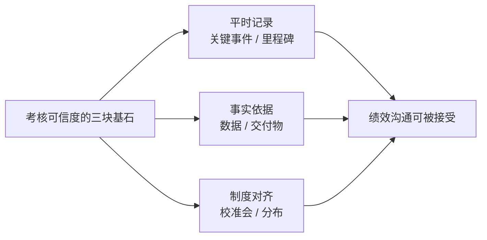

## 07.四象限一之理事

"理事"比"管事"更上一层：管事是让事情被做，理事是让事情被做好、被做得可持续。理事包括三个部分：风险管理、问题处理和资源协调。

**风险管理。** 风险管理是指，提前识别可能出现的问题，并采取预防措施。管理者需要关注的风险主要有两类：一类是核心人员流失，它导致很多重要工作无法开展，所以你需要提前培养核心人员的备份人员，搭建合理的团队梯队。另一类是项目进度太紧，它导致质量低下、团队士气低下和团队摩擦增多等问题，你可以通过提前招聘、借调人员和据理力争修改项目计划或者项目范围等方式来应对。

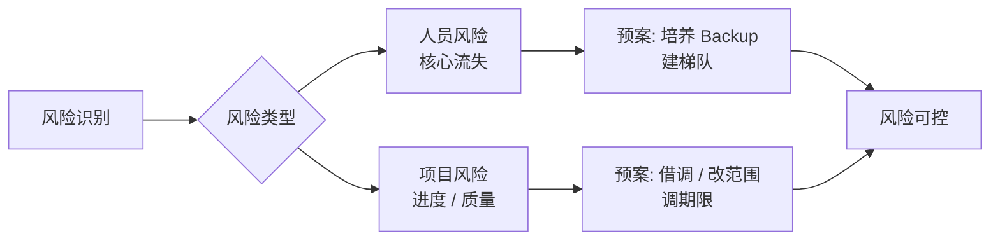

**问题处理。** 问题处理是指，解决团队已经发生的各种问题，比如人员变动、团队成员之间有矛盾、项目延迟和线上出现严重事故等。问题处理和风险管理看起来有点类似，但风险管理侧重主动预防，问题处理是被动响应。风险管理只能从概率上降低问题发生的可能性，无法彻底杜绝问题，所以问题处理是必不可少的。

对于管理者来说，正确的做法是：一方面要认识到出问题的必然性，力求不要出大问题，容忍部分小问题，认真地分析问题，谨慎地制定流程规范；另一方面要意识到自己是任何团队问题的第一责任人，你可以指出下属做的不足的地方，但不能把责任全部推给下属。

**资源协调。** 资源协调是指，申请各种团队需要的资源，比如申请多几台手机用于测试，申请新的服务器搭建环境，申请外包来临时支援项目等。这些事情没什么难度，但是有时候对于提高团队的工作效率有很大的帮助。而且在很多公司，资源只能由主管来申请，某些情况下资源不够，也可能还需要主管依靠自己的关系网借调。

资源协调本质上是"对外把团队不具备的能力借进来"。能借到多少资源，往往取决于你平时在跨部门关系上的积累，而不是申请单写得多漂亮。

## 08.四象限一之理人

"管人"靠制度，"理人"靠温度。理人包括三个部分：团队建设、团队培养和团队激励。

**团队建设。** 团队建设是指，通过举行各种形式的活动来增强团队成员的团队意识和协作精神，让团队成员相互之间更加了解和信任，同时释放工作压力。

常见的团队建设活动有聚餐、轰趴、户外运动和旅游等，大部分公司在团建方面也有一些制度规范和经费支持。要注意，团建不是福利，而是管理手段，目标是让成员在工作之外建立信任，而不是简单"吃一顿"。

**团队培养。** 团队培养是指，通过各种手段提升团队成员的能力，让团队成员既能够更好地完成工作任务，也能够逐步晋升到更高的级别。

团队培养也是管理者的核心工作之一，但在实践中经常被忽视，因为团队培养的投入很明显，但产出却不明显。如果团队工作比较繁重，最先缩减的往往就是团队培养相关的事情。常见的培养手段主要有四种：定向自主学习、专项培训、以战代练、技术交流，它们各自适合不同的人群。

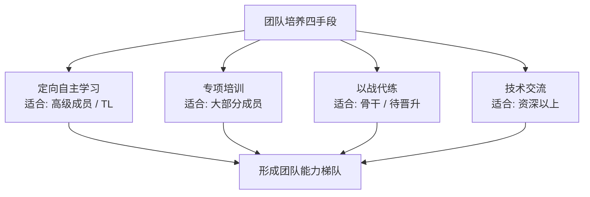

具体来说，定向自主学习是管理者指定学习目标和计划，团队成员自主学习，到了计划的时间后进行检查，比较适合高级成员的培养，比如指定某几个 TL 在 3 个月内学习设计模式，然后让他们统一给团队做培训或分享。专项培训是根据团队需要安排相关培训，包括业务培训、技术培训、晋升培训等，适合大部分团队成员。以战代练是通过带着成员做或者授权成员负责某个事项，让对方在做事情的过程中边做边学，适合培养团队核心人员，尤其是对于有晋升需求的骨干人员，应该优先安排对晋升有帮助的工作任务。技术交流是提供一些技术交流的机会，让团队成员能够开拓技术视野，认识更多业界同行，提升自己的影响力，比如参加技术大会和技术交流会议等，一般要求资深以上的级别。

**团队激励。** 团队激励是指，激发团队成员的潜能和战斗力，让团队更有激情和效率。常见的激励手段包括：在失败的时候鼓舞团队、在成功的时候由衷地表扬团队、给团队成员颁发一些奖项等。

从中长期来看，最有效的激励手段还是带领团队拿到结果和绩效。否则，没有结果的承诺就变成了画大饼，没有结果的鼓舞就变成了大忽悠，不但起不到激励作用，甚至可能还有反效果。激励不是艺术表演，而是"让付出的人觉得值"。

## 09.管理的核心原则

管理四象限工作已经基本能够覆盖管理的方方面面。就算你之前对管理没有系统的概念，也可以依样画葫芦地进行团队管理。这些经验虽说不能保证让你成为一个优秀的管理者，但是能够让你做到八九不离十，在管理上不会出现很大的偏差。

四象限是"骨架"，那"灵魂"是什么？就是下面这三条核心原则。

**要事优先原则。** 结合业务和团队的现状，判断什么时候什么事情更重要，优先处理当前重要的事情，这是管理最底层的原则。新经理最容易犯的毛病不是"不努力"，而是"努力错了地方"，把 80% 的时间花在 20% 不重要的事情上。

具体怎么判断要事？可以用这两个简单问题：**这件事做了或没做，对团队季度目标有没有显著影响？这件事如果我不做，谁还能做？** 两个都是"是"的事情，就是你必须亲自抓的要事。

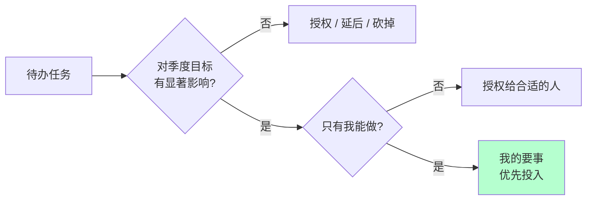

**价值输出原则。** 管理者的价值不是"自己干了多少活"，而是"带着团队拿到了多少结果"。这句话听着像鸡汤，但它决定了你每周时间的分配：**你的时间应该花在那些只有你能做的事情上，而不是任何下属都能做的事情上**。

比如方向决策、资源争取、跨部门协调、核心人才招聘，这些是只有你能做的；而写代码、查日志、对接需求细节，是下属就能做的。如果你管理岗位的时间表上充斥着后者，说明你的价值输出是错位的。

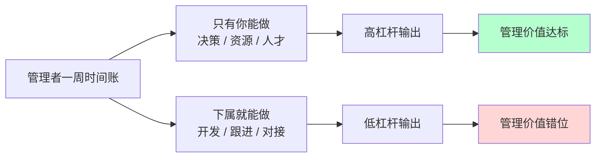

**结果导向原则。** 管理的验证标准不是过程的漂亮，而是结果的达成。德鲁克那句"管理的验证不在于逻辑，而在于成果"讲的就是这个道理。

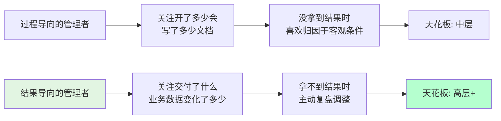

## 10.管理风格的类型

讲完"做什么"和"按什么原则做"，还有一个绕不开的问题：你打算用什么"姿势"做？也就是管理风格。关于领导力风格，或者叫管理风格，如果你去网上搜索，会看到很多不同的视角和说法。

如果真要给这些不同的说法找到一个底层的逻辑，所谓管理风格，本质就是你和团队的协作方式，也就是你和团队的"位置关系"，即你站在团队的什么位置。如果还是难以想象，你可以把带团队看作是在驾驭一辆马车：你和这几匹马是如何协作，一起把车拉到目的地呢？

**发号施令型。** 第一类是发号施令型。管理者和团队的关系是：管理者发号施令，全程指挥，但不会亲力亲为去操作，团队成员只要按管理者说的做好执行，不需要问为什么。就好像一位坐在马车上驾驶车辆的车夫，他不参与拉车，但是马匹的一举一动都听命于他的指令。所以，我们常常把这种管理风格叫做指令式管理、命令式管理，或者指导式管理。

这样的管理者带给团队的往往是很强的控制气场和压迫感，没有人情味，让人有距离感，最符合大众眼中的"领导"的形象。这类管理者往往重事不重人，眼睛盯着目标和结果，对人的发展和成长关注较少。所以，通常团队执行力很强，但是梯队很难培养起来。

**以身作则型。** 第二类是以身作则型。和指令式管理者很少亲力亲为的做法相反，以身作则的管理者凡事冲在最前面，是站在马匹中间和大家一起奋力拉车的人。这类管理者非常享受和团队打成一片，很像一位身先士卒的将军，战斗力很强，很受团队拥戴，所以往往团队凝聚力也很强。

他们非常在意团队成员的想法和感受，并愿意提供帮助和支持，分担他们的工作和困难，因此我们称之为支持式管理。对于这类管理者来说，重人不重事，不过他们并不会忽视做事，只是不太去指导员工做事，而是倾向于直接替员工做事。这类管理者更像一个带头大哥，员工会特别有归属感，但是这类管理者往往带不了大规模团队。

**激发辅导型。** 第三类是激发辅导型。这类管理者不会亲力亲为去帮员工做事，但是会去辅导和启发员工怎么去完成工作，并且提供鼓励、支持和反馈。换句话说，他们不会去替马拉车，但是会陪着马一起赶路，同时辅导马匹怎么样能够把路走好，以及要往哪里走。

这有点像球场上的教练，他们不上场，但会把握比赛节奏和方向，不断给球员提供指导和反馈。所以我们把这类管理风格称为教练式管理。教练式管理者既关心员工在做事的过程中有没有得到锻炼和成长，也关心事情本身有没有很好地完成，整体的步调和节奏如何，以及最后结果的好坏，属于重事也重人。

在这类管理者团队做事，个人成长是最显著的，团队梯队也能快速完善起来。但是由于这类风格对于管理者精力消耗比较大，很难覆盖到全体成员，所以比较适用于核心梯队的培养。

**无为而治型。** 第四类是无为而治型。无为而治似乎是很多管理者向往的境界，很多高级管理者都认为好的管理者应该是"没有我的时候，团队完全能自行运转"，第四类风格就有点这个意思。

他们往往安排好任务就"撒手不管"了，把工作完全授权给了团队成员，只是在约定的时间去检查结果是否达成，所以这类风格我们称之为授权式管理。就任务执行过程来看，他们是不重人也不重事的。

这类管理者对团队成员做事表现得非常放心，甚至让大家感觉有点漠不关心；对任务执行过程不关心，关心的只是他最在乎的目标和结果。在这类管理者团队中做事，对于不成熟的团队，成员就会变成野蛮生长；而对于成熟的团队，成员就会有很好的发挥空间和舞台，反而会得心应手。

**四风格总结一下。** 把上面四种风格按"重事"和"重人"两个维度放到坐标系里，一眼就能看清它们的区别。

```mermaid
quadrantChart
    title 管理风格四象限
    x-axis 不重事 --> 重事
    y-axis 不重人 --> 重人
    quadrant-1 教练式(重事重人)
    quadrant-2 支持式(重人不重事)
    quadrant-3 授权式(不重事不重人)
    quadrant-4 指令式(重事不重人)
    指令式: [0.85, 0.2]
    支持式: [0.2, 0.85]
    教练式: [0.85, 0.85]
    授权式: [0.2, 0.2]
```

用一句话概括每种风格的内核：指令式管理重事不重人，关注目标和结果，喜欢发号施令但不亲力亲为；支持式管理重人不重事，希望带头冲锋亲力亲为，特别在意团队成员的感受，并替他们分担工作；教练式管理重人也重事，关注全局和方向，并在做事上给予教练式辅导和启发；授权式管理不重人也不重事，关注目标和结果，不关心过程和人员发展。

**用一个案例说明。** 为了加深理解，我再用一个案例来示意一下。三国的故事，中国人都耳熟能详，其中有一段叫"刘备入川"：刘备在落凤坡损失军师庞统之后，就调集荆州的诸葛亮来支援西川，这时诸葛亮就需要把守卫荆州的重担交给刘备的二弟关羽。那他将会怎么样嘱托关羽呢？我们来看看四类不同风格的诸葛亮会如何对关羽说。

指令式的诸葛亮会说："我把荆州托付给你，你对曹操要采取抵抗的策略，而对东吴一定要采取联合的策略，你一定要照我说的做，否则荆州肯定会丢。"支持式的诸葛亮会说："兄弟，我去支援主公，没法和你一起守荆州了，但是有什么问题你随时告诉我，我全力支持！"

教练式的诸葛亮会说："云长，荆州这个重担就交给你了，如果曹操来打荆州，你打算怎么应对呢？如果曹操和孙权一起来打，你又会怎么应对呢？"听完关羽的方案，教练式的诸葛亮会给出自己的建议："你这么做荆州比较危险，你可以参考我的策略：北拒曹操，东和孙权。"而授权式的诸葛亮会说："云长，荆州就交给你了，你要确保万无一失，我相信你一定能搞定！"

所以你看，不同的风格对于同一个事情，做法差别是很大的。那么，你会是哪种管理风格呢？你的上级和你认识的管理者，他们又偏重于哪个风格呢？我相信你心里已经有数了。

**如何选择风格。** 既然叫风格，就是手段层面的东西，评价手段我们往往是用有效无效来衡量，而不会用好坏来衡量。所以这四类风格无所谓谁好谁坏。一个成熟的管理者应该对这四类风格都能有很好的了解和认知，甚至是能驾驭。不过，不同的风格在不同的场景下的确会有不同的适用程度。

当一项工作不容有闪失，而你又是唯一熟悉、且最有掌控力的人时，一个命令式的你可能更能降低风险、达成目标，所以命令式管理最适用于需要强执行的场景。当一个团队特别需要凝聚力和斗志、需要攻坚的时候，一个支持式的你会促成很好的效果，支持式管理特别能带团队士气和凝聚力。当有一些核心人才需要重点培养、团队需要发展梯队的时候，一个教练式的你会带来明显的效果，他们不但能把事情做好，个人能力还能成长。当团队梯队很成熟、团队成员需要发挥空间的时候，一个授权式的你能提供最恰当的管理方式。

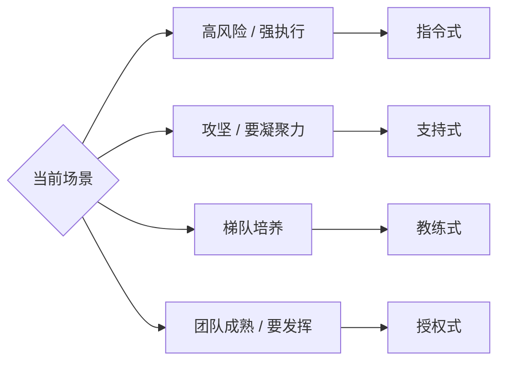

大部分管理者都还是以自己最拿手的风格来带团队，其他方式仅在必要时使用。当然，如果你能驾驭多种风格，那是非常厉害的。

## 11.转变管理的角色

从执行者到管理者，不是"多了一些工作"，而是"换了一个岗位"。下面从九个维度来看这场角色切换具体转变了什么。

**负责对象的转变。** 从负责对象来看，即你需要对谁负责。作为一名工程师，用他们自己的话说，"管好自己就可以了"，所以主要是对自己和自己的工作负责。而作为一名管理者，由于团队是上级和公司给你的资源，你需要对上级负责；你还得关心团队成员的发展和成长，对下级负责。更高的职位的确意味着更多的责任。

```mermaid
flowchart LR
    A[工程师<br/>对自己负责] --> B[管理者<br/>对上级 + 对下级 + 对公司负责]
    B --> C[责任半径显著扩大]
```

**关注焦点的转变。** 从关注焦点来看，也就是什么对你来说是最关注的。工程师一般是过程导向的，因为他们需要一步一步把工作执行到位，眼睛盯着的常常是"脚下的路"；而管理者是目标和结果导向的，他们时时关心目标和前进方向，盯着"远方的目标"，因为他们得决定要带着团队去哪里。

**工作内容的转变。** 从工作内容和能力要求来看，工程师属于个人贡献者，是靠个人专业能力来产生业绩的，工作内容以发挥专业能力为主，相对比较单一；而管理者要做成一项工作，除了技术判断力，还需要目标管理能力、团队规划能力、项目管理能力、沟通协调能力、团队建设能力等等，需要看方向的、带人的、做事的更加多维和立体的能力。

```mermaid
flowchart LR
    A[工程师能力<br/>深度单点] --> C[一把锋利的剑]
    B[管理者能力<br/>目标 / 项目 / 沟通 / 团队 / 技术判断] --> D[一个完整的工具箱]
```

**任务来源的转变。** 从任务来源来看，工程师的工作任务来源，主要是上级安排，听上级指挥；而管理者的工作内容，虽然也有上级工作的拆解和安排，但更多是靠自己筹划，然后和上级去沟通确认，从被动"等活儿"变为主动规划。

**实施手段的转变。** 从实施手段来看，大部分工程师的工作还是要亲力亲为的，因为工程师角色是个人贡献者角色，所以主要靠自己完成。而管理者的工作清单涵盖了整体团队的工作，靠自己一个人是无论如何都做不完的，因此主要是依靠团队来完成。

**合作维度的转变。** 从合作维度来看，工程师主要的合作内容就是和平级的伙伴共同做好执行，因此主要以平级合作为主。而作为管理者，合作的内容非常丰富：需要和上级合作规划好整个团队的目标，和下级合作做好落地执行，和平级管理者合作完成联合项目，有时候还需要和平级的上、下级去一起协调资源和进度。所以合作的维度变得非常立体。

```mermaid
flowchart TB
    A[管理者合作立体化] --> B[向上合作<br/>目标 / 资源]
    A --> C[向下合作<br/>执行 / 成长]
    A --> D[平级合作<br/>联合项目]
    A --> E[斜向合作<br/>跨部门 / 跨层级]
```

**合作关系的转变。** 从和团队成员的合作关系来看，之前做工程师的时候，和大家都是平等竞合关系，以合作为主，也有"竞"的成分。

我们通常爱把"竞"和"争"连在一起说，但"竞"和"争"还是不同的。"争"意味着大家拼抢同一个东西，我得到的多就意味着你得到的少，此消彼长，比如摔跤、乒乓球、下棋等都是典型的"争"。而"竞"是朝向同一方向做比较的，比如百米赛跑、跳高、跳远等田径类比赛是典型的"竞"。在之前平级的时候，你和其他同事虽然不会有"争"，但是有"竞"的成分在。

而当你成为大家的上级，作为管理者来带领这个团队的时候，你和大家反而形成了全面合作的关系，"竞"的因素不存在了。因为"竞"和"争"都是发生在同一层次上的，要在同一个场地和同一个起跑线上，才有所谓的"竞争"；而随着你的晋升，你和之前的同事已经不在同一个层面上工作了，也就不存在"竞"的关系了，而是彼此间荣辱与共、休戚与共、成败与共的全面合作关系。

**思维方式的转变。** 从思维方式来看，做工程师的时候，大部分工作内容和工作要求都是执行，所以是明显的"执行思维"，特点是关注过程和细节，更重要的是关注风险和成本，希望通过对风险的排除和成本的掌控，来保证工作交付的确定性。所以技术出身的人往往在项目执行，尤其是过程控制管理方面，有明显优势，他们天然就认为这不是什么难事。当然，他们估算排期一般也会比较保守，因为他们需要确保能完成才愿意答应。

而作为管理者，虽然也考虑风险和成本，但是更习惯于去关注做一件事能带来的可能性收益，并以此来判断是否值得投入资源去做，我们把这种叫"规划思维"。

```mermaid
flowchart LR
    A[执行思维] --> A1[盯风险 / 控成本]
    A1 --> A2[追求确定性]
    B[规划思维] --> B1[看收益 / 看杠杆]
    B1 --> B2[追求可能性]
    A2 --> C[工程师]
    B2 --> D[管理者]
```

**技术视角的转变。** 从技术视角来看，即两个角色该如何看待技术。很多新经理都担心做了管理会丢掉技术，而其实只是看待技术的视角发生了变化。

做工程师的时候，技术是用来做事情的，掌握好技术的目的就是为了做好实施，看待技术是从如何运用的角度出发。而对于管理者来说，技术是达成目标的手段之一，所以看待技术是从如何评估的角度出发，评估该项技术是否是最合理的手段，以及如何选择才合理，并据此做出决策，因此常常被称为技术判断力。老领导经常会告诫新经理，即使做了管理，技术判断力不能丢，就是指这种能力。

## 12.最后需总结一下

**四象限总览。** 管理四象限的整体思路是，从管理的手段和范围来进行拆解。手段有两类，管和理，范围有两个，人和事，它们组合就得到了管事、管人、理事和理人这四个象限。管事包括团队规划、团队执行和团队汇报；管人包括团队构建、团队运作和团队考核；理事包括风险管理、问题处理和资源协调；理人包括团队建设、团队培养和团队激励。

管理的核心原则是"要事优先"：结合业务和团队等现状，判断什么时候什么事情更重要，优先处理当前重要的事情。

```mermaid
flowchart TB
    A[管理四象限] --> B[管事<br/>规划 / 执行 / 汇报]
    A --> C[管人<br/>构建 / 运作 / 考核]
    A --> D[理事<br/>风险 / 问题 / 资源]
    A --> E[理人<br/>团建 / 培养 / 激励]
    B --> F[核心原则<br/>要事优先 + 价值输出 + 结果导向]
    C --> F
    D --> F
    E --> F
```

**新经理落地清单。** 初任管理者到底从哪一步开始做？把上面的框架落到一张"7 日行动清单"：

| Day | 重点动作 | 对应象限 |
|-----|---------|---------|
| D1 | 和直接上级对齐半年目标和期待 | 管事 |
| D2 | 挨个和团队成员做 30 分钟 1v1 | 管人 |
| D3 | 盘点团队手头重要任务和优先级 | 管事 |
| D4 | 梳理当前流程痛点，列出机制优化清单 | 理事 |
| D5 | 约 2~3 个核心合作方 TL 做认识沟通 | 理事 |
| D6 | 策划一次轻量级团建，增进了解 | 理人 |
| D7 | 写一份 100 天团队规划初稿 | 管事+管人 |

这份清单是我当年踩坑之后复盘出来的"最小可行动作"，照着做至少不会犯方向性错误。

**角色心态的切换。** 比方法更重要的是心态。从执行者到管理者的切换，最核心的是三个心态的彻底换血：从"我牛"到"团队牛"，从"事做完"到"事做成"，从"求安稳"到"担责任"。

```mermaid
flowchart LR
    A[从执行者<br/>到管理者的<br/>三大心态切换] --> B["从&quot;我牛&quot;<br/>到&quot;团队牛&quot;"]
    A --> C["从&quot;事做完&quot;<br/>到&quot;事做成&quot;"]
    A --> D["从&quot;求安稳&quot;<br/>到&quot;担责任&quot;"]
    B --> E[愿意把功劳让给团队]
    C --> F[关心结果不关心谁干的]
    D --> G[遇到问题第一个冲上]
    style A fill:#e2f5e2
```

## 13.故事的回响

**半年后的小组变化。** 前面开头讲到我被任命当 TL 那天的发慌。按照"管理四象限 + 7 日行动清单"落地后，半年下来我的这个 5 人小组发生了这样一些可量化的变化：

| 维度 | 接手前 | 半年后 | 变化 |
|------|-------|-------|------|
| 需求吞吐量（个/月） | 12 | 21 | +75% |
| 线上 P2+ 故障数 | 4 次 | 1 次 | -75% |
| 核心成员流失率 | 2 人待定 | 0 人 | 稳定 |
| 团队 OKR 完成度 | 65% | 92% | +27pp |
| 跨组合作满意度评分 | 7.2 | 8.9 | +1.7 |

这不是我一个人的功劳，但它真真切切地说明：**方法是有用的**。从我不知所措的那个下午，到半年后有能力对下属说"这摊事你放心交给我"，中间填补的就是这套四象限心法。

```mermaid
flowchart LR
    A[接手前的我<br/>焦虑 + 救火 + 无章法] --> B[四象限 + 7 日清单]
    B --> C[半年后的团队<br/>吞吐 +75% / 故障 -75% / OKR 92%]
    style A fill:#ffd6d6
    style C fill:#b5ffcf
```

**我自己的三个最大改变。** 比起数据，我自己的变化更让我惊喜。第一个改变是**从"技术单兵"到"团队大脑"**：以前我接到一个需求第一反应是"我怎么做"，现在是"谁来做、怎么保证做成"。第二个改变是**从"被动救火"到"主动规划"**：以前 70% 的时间在处理紧急事情，现在 60% 的时间在做不紧急但重要的事情。第三个改变是**从"担心被质疑"到"欢迎被挑战"**：以前开会被反驳会脸红，现在会主动说"这个方案我们一起 challenge 一下"。

三个改变加起来，其实是一句话，**我终于从"被工作推着走"变成了"推着工作走"**。

## 14.思考题和作业

**思考题。** 第一题（自查题）：把你上周的时间花销做一个"管事 / 管人 / 理事 / 理人"四象限归类，哪个象限被你严重忽视？为什么？

第二题（选择题）：如果只能保留 4 种管理风格中的 1 种作为你的"主风格"，你会选哪种？为什么不是其他 3 种？

第三题（情境题）：你刚接手一个团队，下属里有一位比你资深 3 岁、能力也不错的同学，他对你的到来明显不热情。你会怎么跟他做第一次 1v1？

**实践作业。** 作业 A（必做）：用"管理四象限"模型，写一份你目前团队的现状盘点，每个象限列 3 条做得好的、3 条做得差的。

作业 B（必做）：基于上面的盘点，列出你接下来 30 天内最重要的 3 件事（每个象限最多 1 件），以及对应的验收标准。

作业 C（选做）：找一位做 TL 已超过 5 年的前辈请教，"你从一个普通 TL 到资深 TL，最大的认知跃迁是什么？"把他的回答整理成 500 字笔记。

**延伸阅读。** 德鲁克《卓有成效的管理者》是管理者时间管理的经典，重点体会"要事优先"的真正含义。安迪·格鲁夫《高产出管理》提出了"管理杠杆率"这个概念，是理解管理价值最好的一本书。明茨伯格《经理人员的工作》是描述管理者 10 种角色的开山之作，看完你会对管理者每天到底在做什么有完全不同的认知。

---

**本节金句**：你不用一下子成为大师，你只需要每天在管事、管人、理事、理人这 4 个格子里，各挪一小步。
