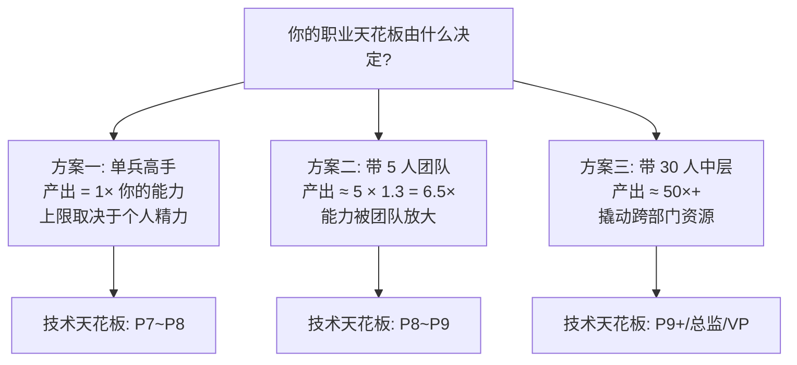
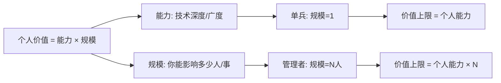
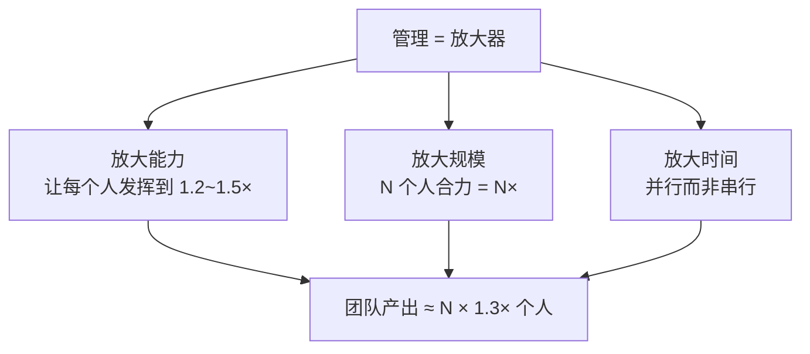
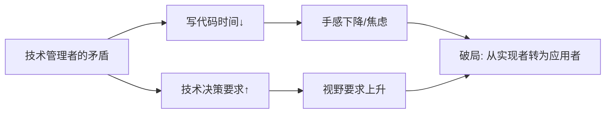
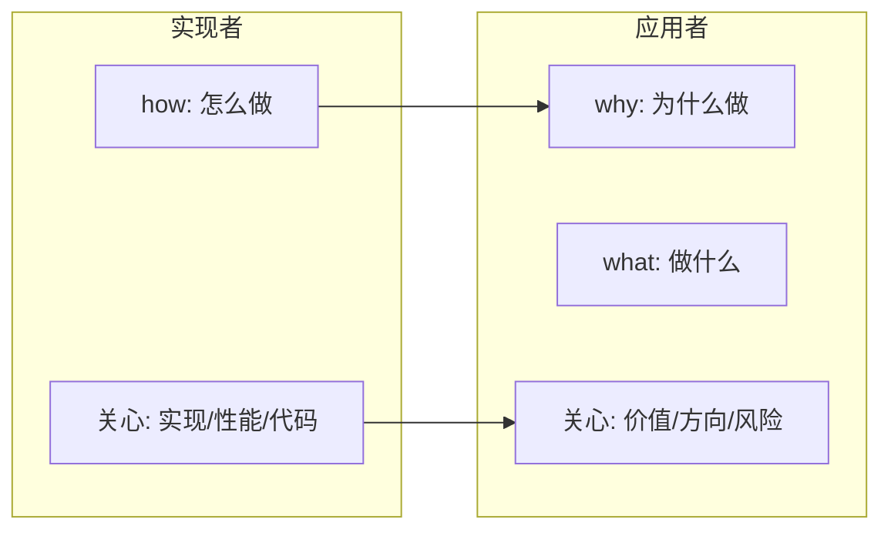
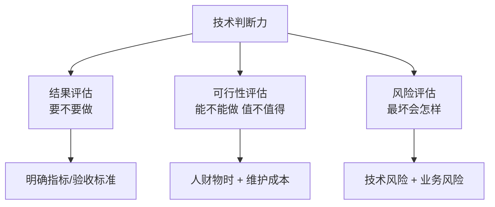
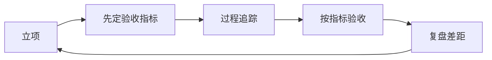
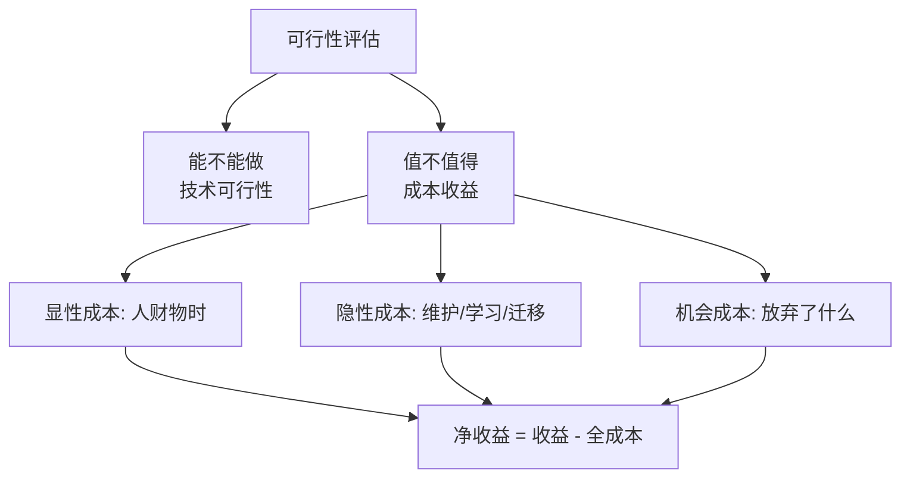
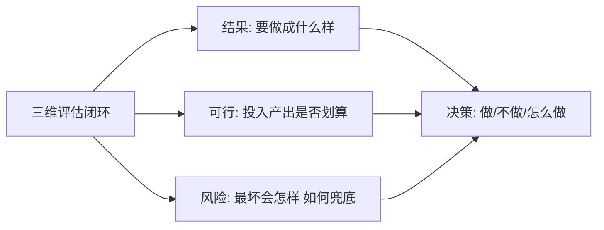
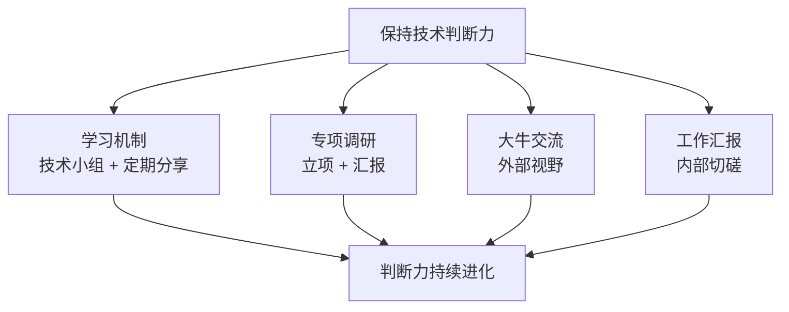

# 1.2我是否要做管理
#### 目录介绍
- [01.开头故事引入](#01开头故事引入)
- [02.前沿简单的介绍](#02前沿简单的介绍)
- [03.为什么要懂管理](#03为什么要懂管理)
- [04.技术转型的问题](#04技术转型的问题)
- [05.转型后那些变化](#05转型后那些变化)
- [06.评估技术的能力](#06评估技术的能力)
- [07.以结果进行评估](#07以结果进行评估)
- [08.可行性进行评估](#08可行性进行评估)
- [09.风险维度去评估](#09风险维度去评估)
- [10.提升技术判断力](#10提升技术判断力)
- [11.故事的回响](#11故事的回响)
- [12.思考题和作业](#12思考题和作业)

## 01.开头故事引入

### 1.1 被 HR 问到愿不愿做管理

我至今记得那次季度述职结束，HR 小姐姐把我留下聊了半小时，最后抛出一个问题："明年想不想试试带个小组？" 我当时心里第一反应是："不想。我就想好好写代码，搞乱七八糟的管理干嘛。"

但嘴上我没说出来，只是含糊地"再考虑一下"。回去后我列了一张"为什么不想做管理"的清单：要开很多会、要写很多 PPT、要处理人际纠纷、技术会越来越生、做不好还要背锅，每一条都挺"合理"。那一周我反复在"做技术"和"做管理"之间拉扯，直到被一句话点醒。

### 1.2 老板那句让我重新思考的话

过了一周，我私下找当时的老板聊。他听完我的清单，笑了笑说："你列的这些都对，但你漏了一条最关键的——你这辈子想达到多高的上限？"

他给我画了一张图：一个普通工程师单枪匹马，年产出上限大概等于自己的 1 倍能力；一个合格的 TL 带 5 个人，能把每个人的战斗力放大到 1.3 倍，团队合起来是 6.5 倍；一个优秀的中层带 30 人，能撬动的资源是普通工程师的 50 倍以上。"你是想一辈子做那个 1 倍的人，还是想看看 50 倍的世界？"

这一问把我问沉默了。我当时 P6，看似还有路可走，但他说的"天花板"确实是个扎心的话题。今天这一节，就把我从"抗拒管理"到"接受管理"的思考完整讲给你，也帮你判断：做管理，是不是你要走的那条路。

## 02.前沿简单的介绍

被问"愿不愿做管理"之前，多数工程师都有一段"只想做技术"的自我叙事。下面先把这段心路还原出来。

### 2.1 只想做技术的想法

我曾经也一样：就想一直深入做技术，成为技术高手。至于业务和管理，还是让别人去搞定吧。做管理要处理各种乱七八糟的事情，要参加各种无聊的会议；做业务要跟形形色色的客户打交道，要揣摩客户的想法，这些事情我都不想去掺和。大家分工合作，各自做好自己专业领域内的事情就行了，毕竟也没有谁要求产品和业务一定要懂技术。我只要在关键时刻发挥我的技术水平，就像武侠高手一样，平时不出手，一出手就惊艳所有人。

### 2.2 公司价值与个人天花板

但公司很看重价值原则，为公司创造价值才有机会晋升。对于高级别的人来说，业务能力和管理能力都是创造价值的核心能力。如果你不懂业务和管理，职场天花板就会很低，很难晋升到比较高的级别。

图里的乘法关系，就是"做技术"和"做管理"在价值贡献上的本质差别。

## 03.为什么要懂管理

理解了价值与规模的关系，就容易理解"为什么越往上走，越需要管理"。

### 3.1 管理是放大器

如果说理解业务才能创造更好的价值，那么学会管理才能创造更大的价值。一听到"管理"就会想到开会、做汇报、写 PPT，管理者的日常确实包括这些，但这些都是表象。管理真正的作用，是把团队的力量整合起来，让团队突破单个个体的能力上限，创造出更大的价值。

### 3.2 职级与规模的关系

对于一个需要 30 个人来做的业务需求来说，只靠你一个人是不可能完成的，或者说不可能在规划的时间内完成，必须带领团队、指挥团队成员共同完成，这就体现出管理能力的重要性。你的职级越高，面临的挑战越大，需要创造的价值越多，越需要发挥团队的作用，管理能力对你来说也越重要。

## 04.技术转型的问题

想清楚"为什么"之后，下一步要面对的，是"转型做管理"本身带来的新问题。

### 4.1 时间被会议切碎

转型做管理后，你可以用在技术上的时间会越来越少，尤其是写代码的机会越来越少，手越来越生。但与此同时，要做的技术评审和技术决策却有增无减，对技术判断力的要求反而越来越高。

### 4.2 人性与角色的冲突

无怪乎会有新经理抱怨说："技术管理者是有违人性的，一方面自己的技术越来越差，另外一方面却还要带领整个技术团队。" 技术管理者对于如何保持技术能力的焦虑，由此可见一斑。

技术管理者与普通管理者最大的区别，就是"技术"二字，这是你最鲜明的标签和最大的竞争力，它如此重要，但又令人不知所措，困扰着众多的技术新经理。破局之道不是"又写代码又管团队"，而是完成角色的转变。

## 05.转型后那些变化

那么，从技术实现者到技术应用者，具体发生了哪些转变呢？

### 5.1 从 how 到 what 与 why

对于技术实现者来说，程序设计能力、编码实现能力、技术攻坚能力和技术评估能力都是需要具备的，主要关心的是"怎么做"，属于"how"的范畴。

而对于技术应用者来说，技术评估能力变得尤其重要，因为技术管理者主要关心的是"要不要做"和"做什么"，属于"why"和"what"的范畴，是要在综合评估之后做出决策和判断的。所以很多前辈都会告诉我们要保持"技术判断力"，而并没有要求我们保持编码能力，原因就在这里。

转变的关键不是放弃技术，而是把技术从"实现手段"升级为"判断工具"。

## 06.评估技术的能力

判断力听起来很虚，落到地上就是"评估"。

### 6.1 判断力的本质是评估

那么该如何保持技术判断力呢？因为所有判断都先要评估，所以技术判断力，其实就是指对技术的评估能力。你可能会说，技术评估能力还是虚的，具体都评估什么呢？

### 6.2 三个评估维度

作为一个技术管理者，即技术应用者，要评估的维度主要是三个方面：第一个维度是结果评估，第二个维度是可行性评估，第三个维度是风险评估。

## 07.以结果进行评估

第一个维度是结果评估。即你要回答"要不要做"，希望拿到什么结果，你要从哪几个维度去衡量结果，从哪几个技术指标去验收成果。

### 7.1 用指标回答要不要做

比如，你可能因为提升服务稳定性去完善服务架构，也可能因为要提升数据准确性去改写数据采集程序，还可能为了提升性能指标去重构数据读写模块。无论如何，你心里都需要很清楚，用什么技术指标来衡量团队的某项技术工作，而不只是完成一个个项目。

### 7.2 以终为始的验收意识

事关每项工作的效果和业绩，对结果的评估能力最为关键。虽然结果验收都是放在项目完成后，但在事先就要明确如何验收，这样才能让大家有的放矢、以终为始。

## 08.可行性进行评估

第二个维度是可行性评估。可行性有两层含义：一是"能不能做"，二是"值不值得"。能不能和值不值得，是两码事。

### 8.1 从能不能到值不值得

不懂技术的管理者一般问的都是"能不能做"，而有经验的技术管理者和资深工程师考虑的是"值不值得"。所谓"值不值得"，就是成本收益问题。收益往往是显而易见的，而成本就有很多方面需要考虑了，这正是体现技术判断力的地方。

### 8.2 成本结构的完整拆解

首先是"人财物时"等资源投入成本，这是几乎每位工程师和管理者都能考虑到的，即需要投入多少人、多少时间、甚至多少资金和物资在该项目上，这项成本相对容易评估。其次是维护成本，这是评估技术方案时要重点考虑的。由于我们考虑投入的时候往往只考虑到项目发布，而发布后的维护成本很容易被忽略。

## 09.风险维度去评估

第三个评估维度是风险评估。技术风险评估，也叫技术风险判断力。

### 9.1 有哪些风险要未雨绸缪

即有哪些技术风险需要未雨绸缪，考虑该技术方案带来最大损失的可能性和边界，以及在什么情形下会发生。这项评估工作很考验技术管理者的技术经验和风险意识，而且需要借助全团队的技术力量来做出准确判断。

### 9.2 三维评估的最终目的

对于一个技术方案或一项技术决策，如果你能从以上三个维度去评估，就说明你拥有了很好的技术意识和判断力。另外你还会发现，如果能做好技术评估工作，你的技术能力并不会降低，还会持续提高。

## 10.提升技术判断力

判断力不是天生的，也不是一蹴而就的。

### 10.1 判断力来自持续积累

新经理的技术判断力，基本都来自之前技术上的实际操作、来自自己的经验积累。而做管理之后，技术评估方面的要求更高了，研究技术的时间和精力却减少了，这该怎么破？别忘了，自从你带团队的那一天起，你就已经不是一个人在战斗，你可以依靠团队和更广的人脉，去拓展技术视野和技术判断力。

### 10.2 四个持续进化的渠道

第一个渠道是建立技术学习机制。盘点你负责的业务需要哪些方面的技术，成立一个或几个核心的技术小组，让团队对各个方向的技术保持敏感，要求小组定期做交流和分享，你就可以保持技术的敏感度。

第二个渠道是专项技术调研项目化。如果某项技术对团队的业务有重要的价值，可以专门立项做技术调研，并要求项目负责人做调研汇报。

第三个渠道是和技术大牛交流。越是厉害的技术人，越能深入浅出地把技术讲明白，所以针对某项技术找大牛取经，也是学习的好途径。虽然你实际操刀的时间少了，但你和技术大牛的交流机会多了，一方面因为你有更大的影响力，另一方面你和大牛有了共同的诉求，就是把技术"变现"、让技术产生价值。

第四个渠道是听取工作汇报。因为你带的是技术团队，大部分工作都和技术相关，在读员工的周报、季度汇报时相互探讨，也是一种切磋和学习。

## 11.故事的回响

### 11.1 转型一年后的数据变化

从"被问愿不愿做管理"到"真正带起一支 8 人小组"，我花了整整一年。下面这组数据是我转型前后个人账本的对比。

| 维度 | 转型前（高级工程师） | 转型一年后（TL） | 变化 |
|------|--------|---------|------|
| 日均代码量 | 约 300 行 | 约 60 行 | -80% |
| 日均会议时长 | 1.5 小时 | 4 小时 | +2.5× |
| 负责业务产出 | 1 条线 | 3 条线 | +2 条 |
| 年绩效评级 | 良好 | 优秀 | 档次 +1 |
| 收入涨幅 | 基准 | 基准 +42% | +42% |

代码少了，但团队产出和个人收入反而双双上升。这就是"放大器"的威力。

### 11.2 我的三个观念转变

第一个转变：放下"只有亲手写的代码才算我的成果"，接受"团队做成的事就是我的成果"。第二个转变：放下"开会是浪费时间"，接受"决策对齐比单兵作战效率高 10 倍"。第三个转变：放下"我技术最强所以我说了算"，接受"好判断来自多元输入，我只是最后按按钮的人"。

## 12.思考题和作业

### 12.1 三道思考题

第一题，自查题：你现在的工作中，有没有哪件事是"你一个人加班也做不完，但 3 个人协作一周就能搞定"的？如果有，说明你已经遇到了"个人天花板"。

第二题，选择题：在"结果评估/可行性评估/风险评估"三个维度里，你目前哪个最弱？为什么？

第三题，情境题：老板让你在"继续做 P7 技术专家"和"转 TL 带 5 人团队"之间选一个，你会选哪个？列出 3 条最重要的判断依据。

### 12.2 三道实践作业

作业 A（必做）：拿出你最近负责的一个技术方案，用"结果/可行性/风险"三维重新评估一遍，看看原方案里漏了哪些维度。

作业 B（必做）：找一位已经转型 1~3 年的技术管理者聊 30 分钟，问三个问题：最大的挑战、最大的收获、最后悔的一件事。

作业 C（选做）：给自己写一封《三年后的我》的信，明确回答"我要不要做管理"这个问题，并写下理由，半年后回头再看。

### 12.3 延伸阅读书单

推荐《技术领导力实战笔记》建立对技术管理者的全貌认知；推荐《卓有成效的管理者》理解"管理=放大器"的底层逻辑；推荐《高效能人士的七个习惯》中"要事第一"一章，辅助做判断力训练。

> 本节金句：做技术是一辈子的事，做管理是把一辈子的事放大 10 倍的事。
