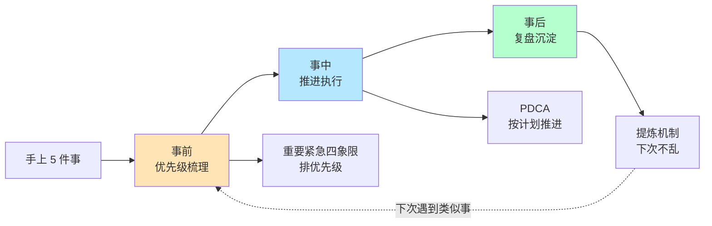
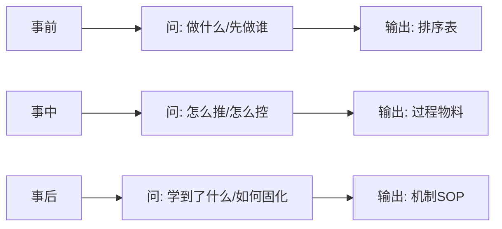
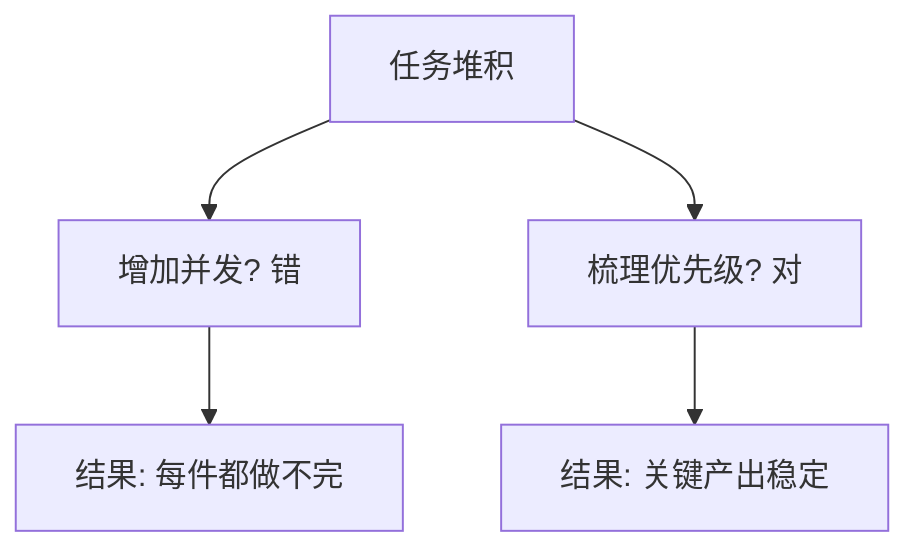
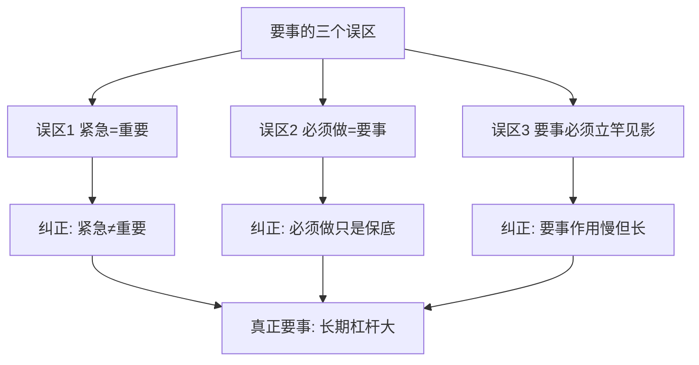
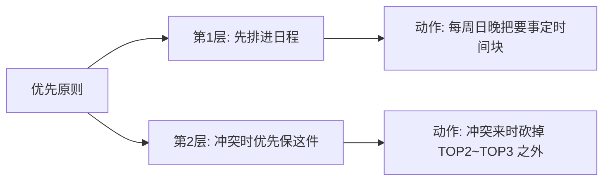
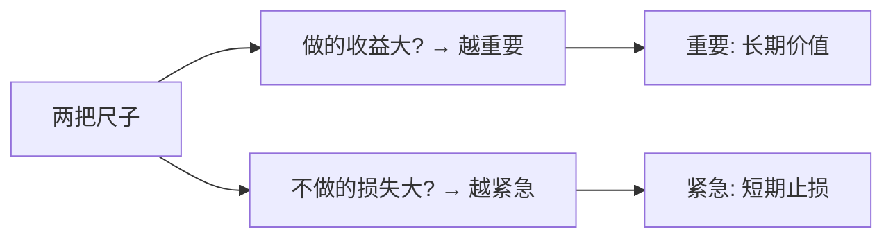
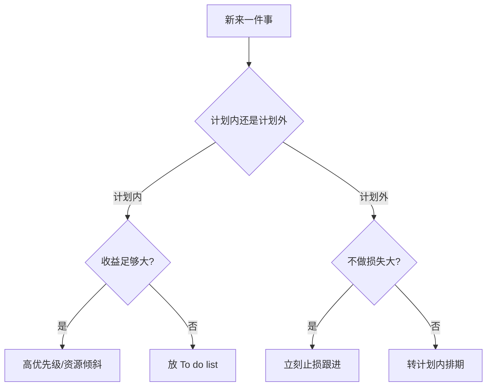
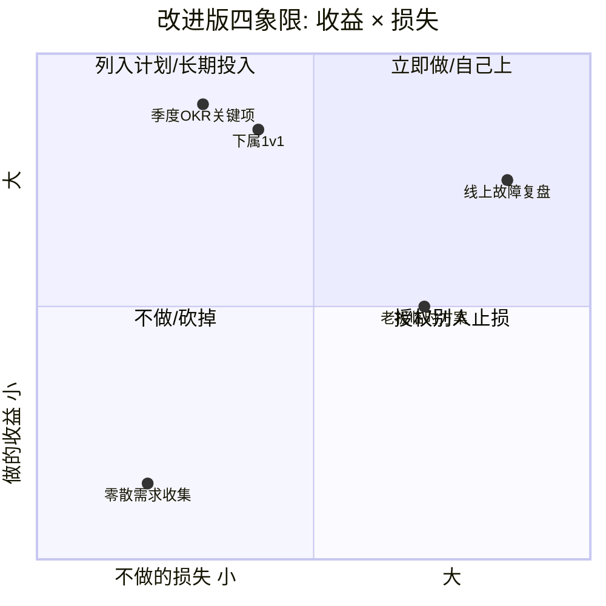
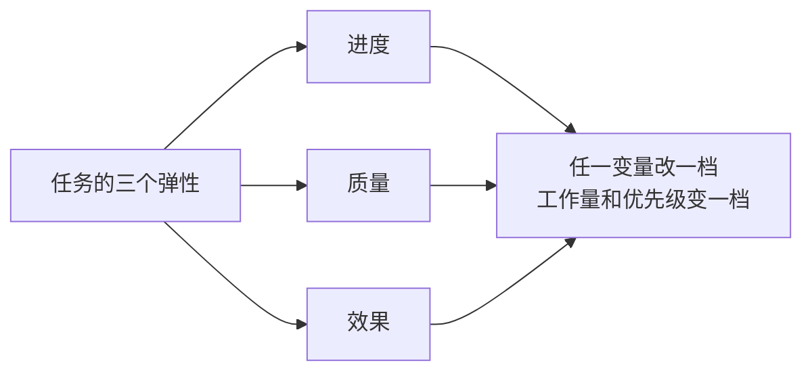
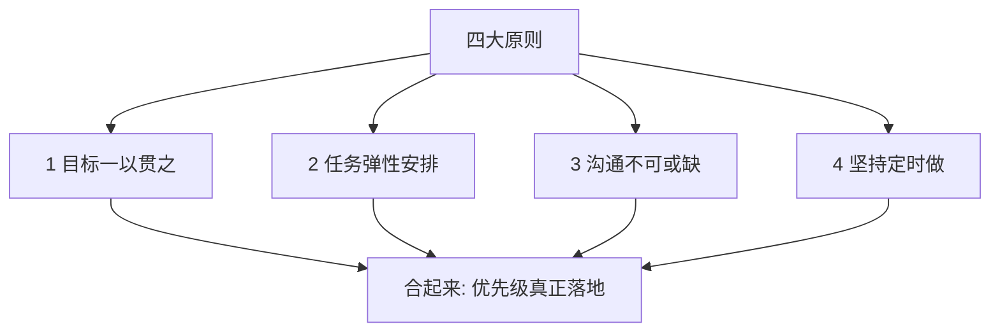

# 2.1多任务并行处理

#### 目录介绍

- [01.开头故事引入](#01开头故事引入)
- [02.做事的几个阶段](#02做事的几个阶段)
- [03.轻重缓急的梳理](#03轻重缓急的梳理)
- [04.什么是要事误区](#04什么是要事误区)
- [05.什么是优先原则](#05什么是优先原则)
- [06.举几个例子分析](#06举几个例子分析)
- [07.判断重要和紧急](#07判断重要和紧急)
- [08.改进版本四象限](#08改进版本四象限)
- [09.优先级几个原则](#09优先级几个原则)
- [10.故事的回响](#10故事的回响)
- [11.思考题和作业](#11思考题和作业)

## 01.开头故事引入

**同时接五个项目险些崩溃。** 去年某个周四，我桌上同时压着 5 件事：一个线上故障要复盘输出报告、一个季度 OKR 评审 PPT 明天要交、一个跨部门合作项目的接口联调卡住了、两个下属在 1v1 等我的反馈、老板突然丢过来一份"需要立即看一下"的方案。

从早上 9 点到下午 4 点，我像个陀螺一样在这 5 件事之间切换——每件都摸一下，每件都没做完。晚上 6 点老板来问："你今天那份方案反馈了吗？" 我才想起来我压根还没打开。那天我加班到 11 点半回家，在地铁上看着空空的车厢，心里只有一个念头：我不是事太多，我是没有章法。

**导师教我的事前事中事后三段法。** 第二天我去请教部门一位很有章法的老 TL。他听完我的抱怨，说了句让我印象很深的话："忙不是问题，乱才是问题。一忙就乱的人，就是因为没把做事拆成三段来想。"

他说："事前分得清、事中推得动、事后学得会，这三样做到位，你一个人能顶三个人。" 今天这一节，我把"事前优先级梳理"这一段讲透——这是多任务并行最底层也最关键的能力。

## 02.做事的几个阶段

**事前事中事后的分段。** 做事这个话题依然很大，要如何探讨呢？既然做事是一个过程，那么就分成"事前"、"事中"和"事后"三段来探讨。在做事之前，需要回答的问题是要做哪些事、先做哪件后做哪件，也就是分清楚轻重缓急，也叫优先级梳理。在做事过程中，要确保事情的进展按照计划推进、尽在掌握之中，也就是有效地推进执行。在做事之后，要复盘做事的整个过程，并从过去的经验之中抽取一些流程机制，以便以后在类似的场景下也可以做得更好、更顺畅。

## 03.轻重缓急的梳理

**并行问题本质是优先级。** 多任务并行该如何应对？是其中最突出的一个。为什么大家会头疼这个问题呢？因为大家面临的问题常常是人手不够、时间不多，但是要完成的工作却还在一件一件挤进来。

对于每个团队来说，当下能做的工作是有限的，增加并发并不会让大家的产出更高效，所以多任务并行问题归根结底还是优先级问题，即你要优先保证哪项工作的顺利进行。排项目优先级对于管理者来说是必备技能，每月、每周甚至每天都在训练，相信你也对"重要紧急四象限"耳熟能详了。

## 04.什么是要事误区

在讲"怎么排优先级"之前，先破三个最常见的误区。

**要事就是紧急的事。** 时间管理的四象限法都知道：把事情按紧急程度和重要程度划分，然后优先处理既重要又紧急的事。这个工具看起来很妙，但可操作性不强，因为它没有解决一个根本问题——怎么判断一件事很重要？很多人觉得如果一件事不立马做就会出问题就说明它很重要，比如修理漏水的卫生间。其实恰恰相反，这只说明它紧急，并不能说明它重要。事实上特别紧急的事往往不是要事。

**要事就是非做不可的事。** 这是很多人都会犯的一个错误。但事实上，真正的要事不一定是非做不可的事。比如办一个餐饮企业没有卫生许可证肯定不行，你必须得办否则不能开张；但从长期经营整个餐饮店来看，这并不是一个要事，因为它没有放大效应、不会对整个店铺的经营产生持续的影响。必须要做的事如果不做，别的许多事情只是"做不了"；但如果要事不做，别的许多事情会"做不好"。

**要事应快速产生作用。** 这种想法是不对的，真正的要事往往不起直接作用。比如今天培训员工，可能要后天甚至半年后作用才凸显出来，这是时间上的不直接。空间上也是一样——研发部门改进了产品设计，业绩最终可能在销售部门体现出来。但这些不直接起作用的，往往才是真正的要事。

## 05.什么是优先原则

**优先的两层含义。** 对于要事要采用"优先原则"。什么是优先？很多人会说，先做呗。这也是一个误解。真正的优先有两层意思。第一层是要把这件事优先安排在日程表中。比如你是一名经理，明天要和下属进行一对一谈话，这件事很重要但不代表你一到公司就要立马去做，你可以专门为它留出时间优先写在日程表里。第二层是如果时间发生冲突要优先保证这件事。

## 06.举几个例子分析

理论之外，先看两个容易被"站错象限"的典型场景。

**老板的临时任务。** 大家都很清楚"重要紧急的工作要排在最前面"、"重要的工作要像大石头一样做长远安排"、"紧急的工作要立即着手"、"不重要不紧急的工作直接丢弃"等应对策略。可是令大家最困惑的是，到底怎么判断一项工作重要不重要、紧急不紧急呢？这个前置步骤才是最难以判断的。

第一个案例：老板刚刚口头交代的临时任务，这到底是紧急重要的、紧急不重要的，还是重要不紧急的呢？这个场景常常被倾向于认为是紧急重要的情况，必须如此吗？实际上，很多老板的"临时交代"只是"他脑袋里刚想到"而不是"客户等着交付"，判错象限你就会用一周的时间赔掉一个月的规划。

**锻炼学习算不算要事。** 第二个案例：锻炼身体、学习培训常常被倾向于认为是重要不紧急的事情，情况真的如此吗？对于不同的人、不同的上级、不同的任务和不同的情况下，可能会被归入不同的象限，这并没有一个可供遵循的一定之规。那么当我们面对这样的问题时，该如何判断其是否重要紧急呢？下一节给出一个更好用的判断方法。

## 07.判断重要和紧急

**用收益和损失两个问句。** 采取的策略是问自己这两个问题：如果做，收益是否很大？收益越大，这个事情就越重要。如果不做，损失是否很大？损失越大，这个事情就越紧急。你可能会有疑问，不做的损失越大不也意味着很重要吗？为什么只强调紧急呢？想说的是，如果想简化问题，就需要结合我们的实际工作场景。

**计划内与计划外的分法。** 在实际的工作中，经常做的并不是梳理轻重缓急四象限，更常见的情形是——我们要把日常的工作分为两种情况：一种是计划内的，也就是按照规划进行的；另外一种是计划外的，即突发的情况和任务。

应对策略其实非常简单。对于计划内的工作，更关注它在一个规划周期内的价值和收益有多大，我们会把价值足够大的任务安排进来并持续地往前推进。对于计划外的工作由于是一种突发情况，是否要中断既有安排来高优先级跟进呢？中断既有安排一定是会影响正常推进的收益的，所以要做的决定是——是否要立刻跟进？如果不立刻跟进带来的损失有多大？是否愿意并能够承担？如果不能那就立即跟进，如果可以不立即跟进那就转化为一个可以安排到"计划内"的工作。

总结起来，对于任何工作任务决策的步骤就两步：对于"计划内工作"看收益是否足够大，收益越大就越重要也就越需要给予相匹配的优先级、资源和关注度，收益相对不大就放入 To do list 作为待办任务处理；对于"计划外的工作"看损失是否足够大，损失够大就按照紧急任务安排、以止损为核心目的，如果损失可控就放入"计划内工作"列表。

## 08.改进版本四象限

**用收益损失改造四象限。** 可以改进一下"紧急重要四象限"，让它更加方便实操。既然可以通过看收益来判断重要性、通过看损失来判断紧急性，那么这个四象限就可以调整——纵轴改为"做的收益"、横轴改为"不做的损失"，两根轴各有高低，组合成四象限：高收益高损失（立即做）、高收益低损失（列入计划）、低收益高损失（授权他人止损）、低收益低损失（干脆不做）。

## 09.优先级几个原则

排完之后还要落地，给自己四条原则。

**目标一以贯之。** 目标是需要一以贯之的。前面提到通过看收益来判断一个任务是否重要，那么你参照什么来衡量收益呢？答案是目标。规划的目标里蕴含着一段时期内最重要的诉求和期待，也是衡量一项工作收益大小的坐标轴。于是你会发现，目标的设定和评估贯穿着整个管理工作的全过程，目标越明确、在关键时刻方向感就越强；反之就会瞻前顾后、反复掂量却不得要领。所以好的决断力往往基于明确的诉求和目标。

**任务安排是弹性的。** 很常见的一个情况是，我们在做任务安排的时候往往不自觉地会在心里做一个设定——这个项目做成某个样子才叫完成，所以需要预算这么多时间。而实际上，对于一个任务来说，其进度、质量和效果这三个要素是可以此消彼长的。

所以在拆解任务的时候，对进度的预期不同、对质量的要求不同、对效果的期待不同，都会导致时间预算和优先级的变化。所以不能用固化的视角看待一个任务，每一个任务其实都是可以弹性安排的——不一定是你需要的 4 周，也不见得是上级希望的两周，根据进度、质量、效果的不同期待，你可以给出很多种排期方案。这体现一个管理者的经验是否丰富。

**沟通不可或缺。** 虽然排优先级主要是管理者来做，但是这并不意味着排好优先级之后就大功告成了。只有和所有相关的人员充分沟通了之后才算是调整完毕，尤其是和自己的上级，一定要和他沟通新的工作安排方案——告诉他你优先保证了什么，从而可能会影响什么。

一个有意思的情况是，上级更倾向于告诉你他们想要什么，而不会主动告诉你他们愿意用什么来交换。这不是他们唯利是图，也不是他们只让马拉车不让马吃草，而是因为评估影响并给出应对方案是你的工作，这是你最清楚且拿手的，而上级判断不出对你既有安排的影响到底多大。所以很多上级管理者会说，他们默认是需要沟通的而不是默认不沟通，最怕大家最后给他们一些 surprise。此外，很多上级倾向于告诉你每件工作都是重要的，都是要正常推进的，但这其实只是美好的愿望，你心里要有数——如果所有的工作都重要，那就意味着没有重要的工作。

**坚持才算真正做到。** 最重要的原则是坚持。坚持不能停留在口头上，对于每个人来说，坚持意味着要"定时"做——比如锻炼身体是要事，那你就应该每天定时做；再比如培训员工是要事，那你就不应该为了其他紧急的事随意取消约定的培训。只有这样，才算真正做到了要事第一。

最后再说一点：那些容易做的事往往都不是要事。一方面，真正的要事因为投入和收益缺乏即时、明确的反馈，长期坚持很难；另一方面，人类的本能会让我们天然倾向于做那些更容易的事情而忽视真正的要事。如果你发现最近的工作生活一直很顺手、很简单，不妨给自己提个醒：是不是陷入了容易的事情而忽视了真正重要的事情？

## 10.故事的回响

**三个月后的状态对比。** 用"事前-事中-事后"三段法跑了三个月，对比那个险些崩溃的周四，我的个人效率指标如下。

| 维度 | 崩溃周四 | 三个月后 | 变化 |
|------|--------|---------|------|
| 每天切换任务次数 | 30+ 次 | 6~8 次 | -75% |
| 当天完成闭环的事 | 0 件 | 3~4 件 | 质变 |
| 老板临时任务响应 | 忘记/漏掉 | 当天闭环 | 质变 |
| 下班时间 | 23:30 | 19:30 | -4h |
| 被上级评价 | "有点乱" | "有章法" | 质变 |

**我的三个深层领悟。** 第一个领悟：忙不是问题，没章法才是问题。第二个领悟：收益与损失这两把尺子，比"重要/紧急"这种主观判断更可操作。第三个领悟：排完优先级一定要上同步，否则上级以为什么都在推进，出了问题责任全在你。

## 11.思考题和作业

**三道思考题。** 第一题，自查题：你当前的任务列表里，有几件其实属于"容易做但并不是要事"的那一类？

第二题，选择题：上级临时派了一件活，你判断它"不做损失不大"，你敢不敢不立刻做？为什么？

第三题，情境题：同时接到"线上故障复盘"和"老板要看的方案"，你会先做哪个？请用"收益/损失"两个维度说清楚。

**三道实践作业。** 作业 A（必做）：用改进版四象限，把你下周全部任务画一张图。

作业 B（必做）：给要事设置"固定时间块"（如每周二下午 3~5 点做 1v1），写进日历并雷打不动一个月。

作业 C（选做）：每天下班前 5 分钟，做一次"今日是否被紧急事赶着跑"的自我复盘，连续做 10 天看规律。

**延伸阅读书单。** 推荐《高效能人士的七个习惯》中"要事第一"章；推荐《搞定 GTD》的"收集-加工-组织-回顾-执行"五步流程；推荐《Deep Work 深度工作》理解为什么要给要事安排固定时间块。

> 本节金句：多任务不是并行的艺术，是"敢于先不做什么"的艺术。
