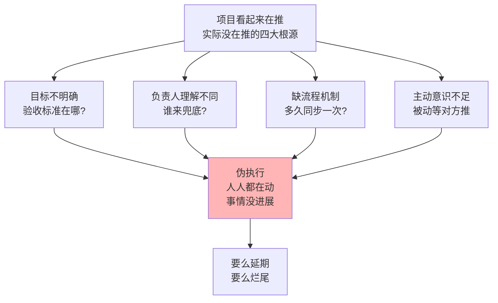
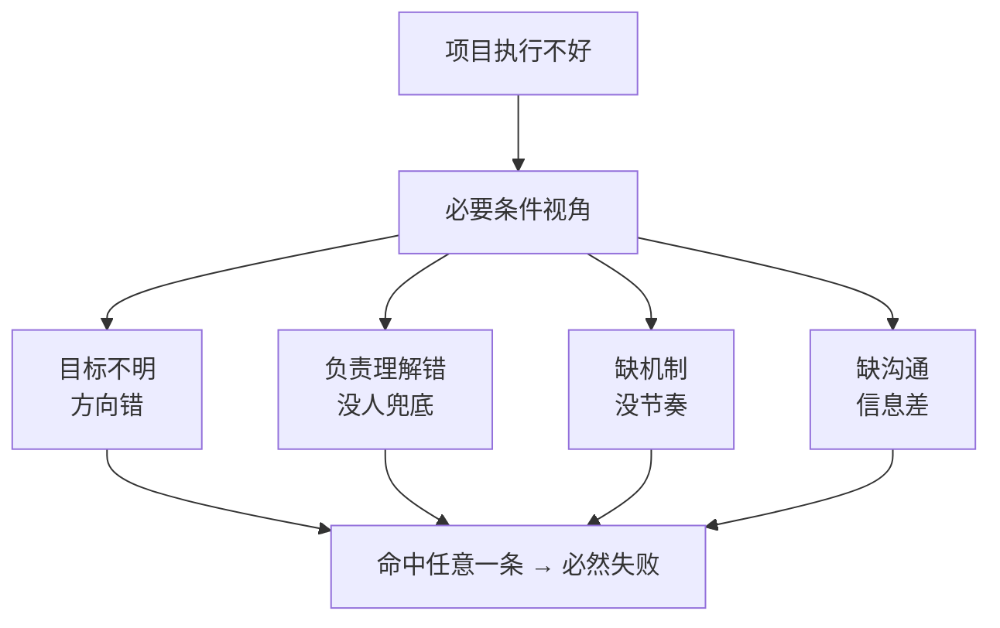
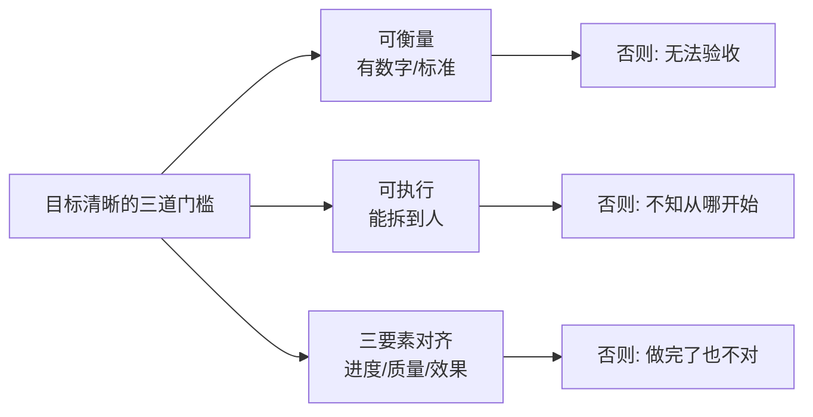
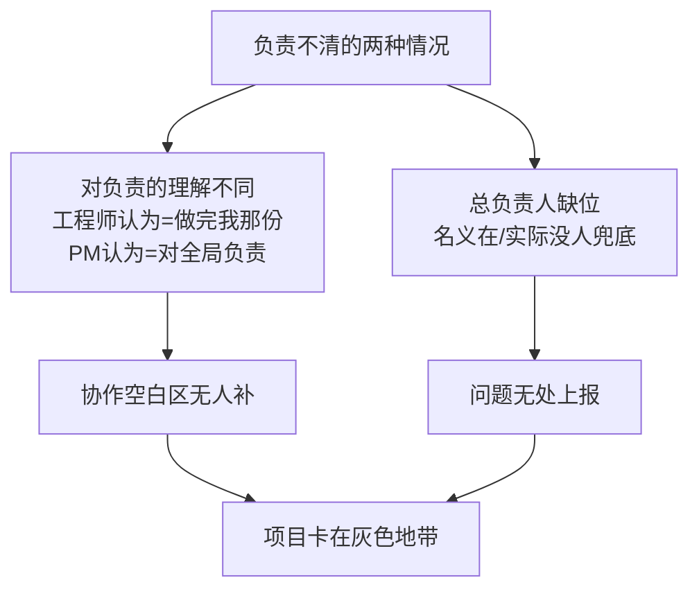
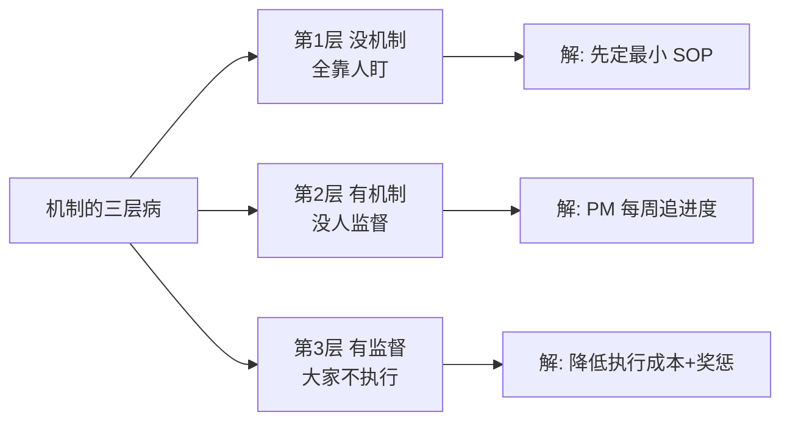
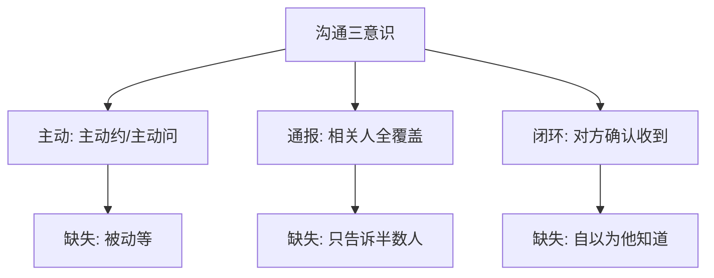
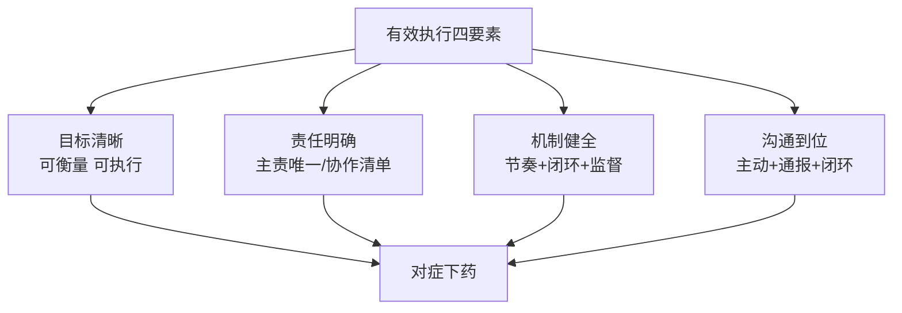

# 2.2确保项目去执行
#### 目录介绍
- [01.开头故事引入](#01开头故事引入)
- [02.任务如何去落地](#02任务如何去落地)
- [03.目标不明确具体](#03目标不明确具体)
- [04.对负责理解不同](#04对负责理解不同)
- [05.缺乏流程和机制](#05缺乏流程和机制)
- [06.主动意识真不足](#06主动意识真不足)
- [07.有效执行四要素](#07有效执行四要素)
- [08.故事的回响](#08故事的回响)
- [09.思考题和作业](#09思考题和作业)

## 01.开头故事引入

### 1.1 一个谁都觉得自己在推的项目

我带的团队里有一个跨三个小组协同的埋点规范项目。启动会开得特别热闹，大家都说"这事很重要"，散会后我松了口气，觉得"项目就启动了"。

三周后 Review，各方汇报："我这边已经推了但他们还没给反馈"、"我们在等他们的接口"、"我以为这事是他负责的"、"我以为那个规范已经对齐了"。结果是：三周过去，没有任何一个子任务真正落地，每个人都觉得自己已经做了、但每个人又都指望着别人去推动。

### 1.2 上级一句话点破伪执行

我把这事汇报给上级，他问了我三个问题让我至今印象深刻：这个项目目标是什么用什么指标验收？这个项目有明确的 PM 兜底吗不是三个小组长"大家一起负责"？这个项目有定期同步机制吗多久一次谁组织谁记录？我一条都答不上来。他说："项目不是启动了就会自己跑起来，项目是被人一步步推动的。你三个问题没答上来，这项目就是'启动了但没在执行'。"

今天这一节，就把这四个"伪执行"的根源和它们对应的破解动作讲清楚。

## 02.任务如何去落地

### 2.1 有效执行的两个视角

如何把任务列表中的这些事儿都落实到地上，也就是"怎么做"的问题，即如何确保执行过程可控、执行结果符合预期？关于如何确保项目的有效执行，有两个探讨的角度。

第一个角度是充分条件视角，即列出有效执行的所有要点，大家照着做就可以把项目执行好。第二个角度是必要条件视角，即探讨出一些要点，在项目执行中只要有一个要点没有做到项目就很难得到有效的实施。把这些要点整理出来，为我们的项目执行提供有价值的参考。

### 2.2 四大必要条件

那么都有哪些要点呢？换句话说，有哪几件事做不好就必然会引发项目执行过程的不可控呢？我们发现有四大类问题最为集中——目标不明确具体、对"负责"理解不同、缺乏流程和机制、主动意识真不足。

## 03.目标不明确具体

### 3.1 四种常见的目标模糊

你是否遇到过这些情况：虽然你很清楚做某项目的初衷，但是并没有去设定可以衡量的目标，比如某次技术重构、某个模块性能优化等，虽然你知道自己想要什么，但是不知道出于什么原因你没有设定一个清晰可衡量的目标；虽然在你眼中目标很清晰，比如"完成手机 App 的性能优化、降低崩溃到千分之二"，但是负责项目实施的员工并不知道该从哪里下手去执行；在你看起来两周能搞定的事情，他人却花了 3 周时间，诚然完成质量的确很高，可是和质量比起来你更希望在 2 周内发布；项目交付时间提前到这个周末了，员工没有完成可他为什么还一副很无辜的样子呢？项目是如期发布了可是这不是你想要的效果啊。诸如此类的状况层出不穷。

### 3.2 目标模糊的共性原因

它们的共同特点是什么？显然都是有目标的，但是这个目标出现了两个情况：一是目标不够明确具体、至少没有具体到执行人员可以执行的程度；二是上下级对目标的理解看似一致、实则有偏差，尤其是对进度、质量和效果的拿捏上。

## 04.对负责理解不同

### 4.1 三个关键的自问

请你回想一下在执行上令你不够满意的那些项目，然后问自己三个问题：这个项目涉及到的各个相关团队，是否都有一个明确的负责人呢？这个负责人和所有项目组成员是否都清楚各方面的负责人呢？这个项目是否有唯一的总负责人，以及总负责人是否有效呢？这些看上去非常普通的问题，却是很多项目执行障碍的一大源头。

### 4.2 两个让责任失控的模糊点

其中有两个模糊的地方让"责任人"这个简单的问题变得失控。第一个地方是：各负责人对于"负责"的理解常常是不一致的。很多负责开发的工程师，他们认为的"负责"就是承担自己份内的开发工作，而项目某一角色的负责人是指对该项目中所有涉及项目执行和协调的问题都要负责。第二个地方是：总负责人无效。即虽然有名义上的总负责人，但是总负责人顾不过来也好、自己不认同也好，都会在项目执行过程中"缺位"。

## 05.缺乏流程和机制

### 5.1 过度依赖个人主动性

常见的说法有："如果 A 也像 B 那么积极主动，这个项目就不会出问题了，所以 A 你能不能更主动一些呢？""我们明明约好了有问题及时通报，为啥总有些人不通报呢！""我们各种各样的流程都有，很完整也很系统，但是大家就是不按照流程办事……" 这些说法反映了一个共同的问题：由于我们见识过某些优秀人员的优秀表现，所以我们就过于迷信人的主动性和职业水平，等出现了问题的时候就总觉得是"人不行"。事实上，团队成员的能力水平都是正态分布的。另外，如果真的是"人不行"，那么人从"不行"到"行"也会是一个缓慢的过程，而此时此刻你就得做事，那你打算怎么办呢？这就要靠流程和机制了。

### 5.2 流程机制的三层失灵

于是很多管理者就制定了全套的流程让团队遵循，但由于学习和执行成本很高，员工遵循起来非常痛苦，因此就干脆让流程机制去"睡大觉"。这也是很多团队的真实情况——他们有很多流程机制、规章制度的页面，但是还是做不好项目。

归结起来，这类问题主要体现为三层：过于依赖人的主动性，缺乏基本的流程和机制；虽然有机制，但是没有人监督执行；虽然机制有人监督执行，但是大家依然不愿意执行。

## 06.主动意识真不足

### 6.1 信息不对称的典型表现

常见的说法有："我通知了啊，为啥他们就是不听呢？""对方有问题不主动找我沟通，关我什么事！""我不知道啊！什么时候变更的？""不是说好了周五交付的吗，他们没有如期交付啊！" 类似的说法还有很多很多。相信你一眼就可以看出，这类情况就是"信息不对称"——大家在一些事情上没有达成共识，由此产生了协作上的偏差和误会。原因可能是对信息本身的理解就不一致，也可能是没有有效传递和同步。

### 6.2 三个意识的缺失

总之在沟通这个问题上有诸多的不顺畅，归结起来就是：主动意识不足、沟通不够主动；通报意识不足、没有知会到所有相关人员；闭环意识不足、广播出去了就默认对方收到了。真正的沟通不是"我说了"，而是"对方确认收到了、理解了、认可了"。

## 07.有效执行四要素

### 7.1 四要素模型

关于项目得不到有效执行，也许还有许许多多的其他问题，就好像"不幸的生活各有各的不幸"一样，项目执行不好也各有各的原因。我们把避免这四类问题的钥匙归结为"有效执行四要素"，即目标清晰、责任明确、机制健全和沟通到位，以方便我们梳理和诊断执行问题。

### 7.2 十二问清单

为了提升可操作性，把这四个要素扩展为 12 个问题，如果你对某个项目的执行不够满意、又想了解到底是哪里出了问题的时候，就可以参照这个"问题清单"检查一下。

| 要素 | 问题 1 | 问题 2 | 问题 3 |
|------|-------|-------|-------|
| 目标清晰 | 是否有可衡量目标 | 是否对齐进度/质量/效果 | 执行人是否能照做 |
| 责任明确 | 各团队是否有主责 | 是否有唯一总负责人 | 总负责人是否有效 |
| 机制健全 | 是否有定期同步 | 是否有问题上报通道 | 是否有过程复盘 |
| 沟通到位 | 是否主动告知相关方 | 是否通知到所有人 | 对方是否确认收到 |

相信很快你就可以找到问题所在，从而对症下药。

## 08.故事的回响

### 8.1 重启项目后的数据对比

用"四要素十二问"重启那个埋点规范项目后的数据。

| 维度 | 失控三周 | 重启六周 | 变化 |
|------|--------|---------|------|
| 可衡量目标 | 无 | 3 个指标 | 有 |
| 总 PM | 无 | 1 人兜底 | 有 |
| 同步周会 | 无 | 每周三固定 | 有 |
| 关键节点里程碑 | 无 | 6 个里程碑 | 有 |
| 按时交付率 | 0% | 100% | 质变 |

### 8.2 我的三个深层领悟

第一个领悟：启动会开热闹不等于项目已启动，"四要素"满齐才算启动。第二个领悟：没有唯一 PM 的项目，等于没有 PM。第三个领悟：机制的生死线不在"写得好不好"，而在"有没有人每周一定会看一次"。

## 09.思考题和作业

### 9.1 三道思考题

第一题，自查题：你手上执行最不顺的那个项目，在"四要素"里缺了哪一条？

第二题，选择题：如果"目标不清"和"没有总 PM"必选一个先补，你会选哪个？为什么？

第三题，情境题：项目延期了，你是先组织复盘还是先止损继续推？说出你的顺序和理由。

### 9.2 三道实践作业

作业 A（必做）：选一个在推的项目，用"十二问清单"做一次全面诊断，列出所有答"否"的点。

作业 B（必做）：为该项目建立一个最小可行 SOP：每周一次例会、每次 3 个议题（风险/阻塞/本周计划）、每次有纪要。

作业 C（选做）：把十二问贴在每次 kick-off 的第一页，让每次新项目都先过一遍。

### 9.3 延伸阅读书单

推荐《关键对话》理解"沟通闭环"的本质；推荐《PMBOK 项目管理知识体系指南》建立机制化思维；推荐《格鲁夫给经理人的第一课》中"产出导向"的思维。

> 本节金句：项目不会自己往前走，它只会被"四要素"的组合推着走一步。
