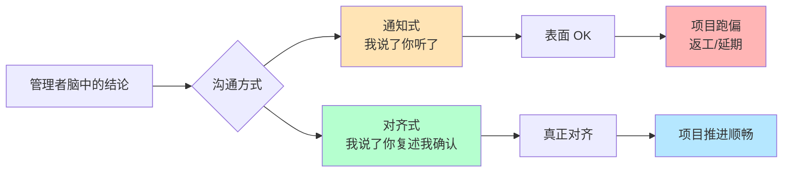
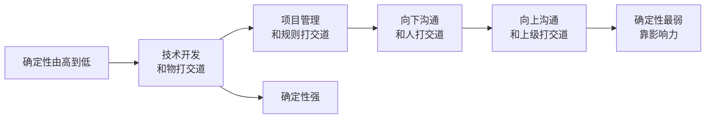
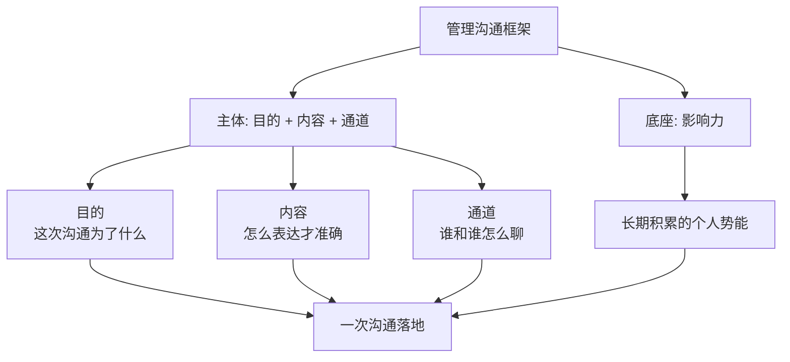
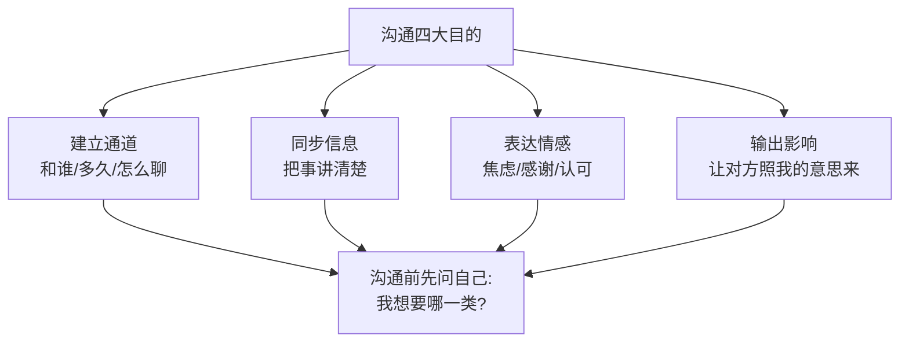
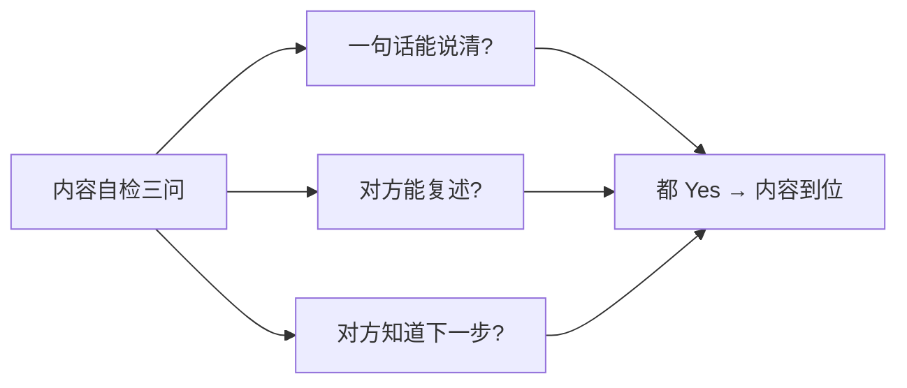
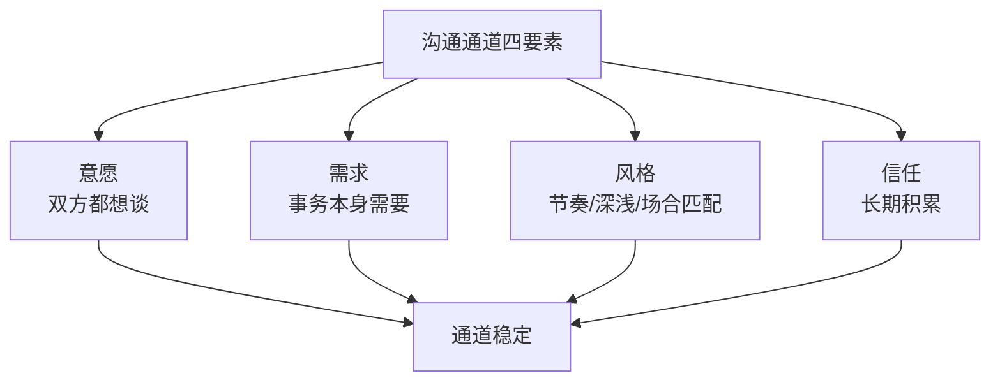
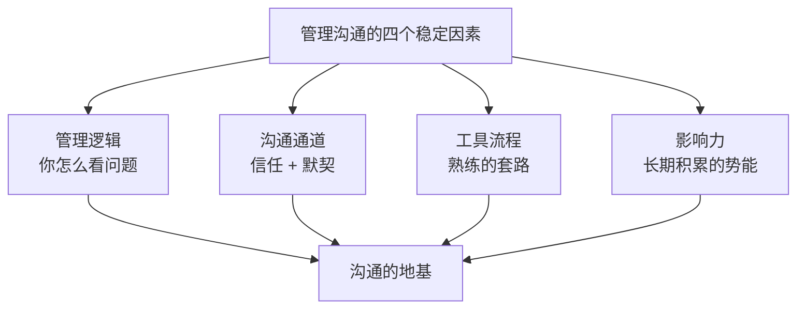
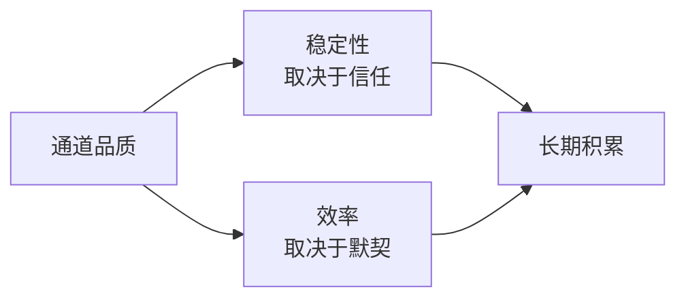
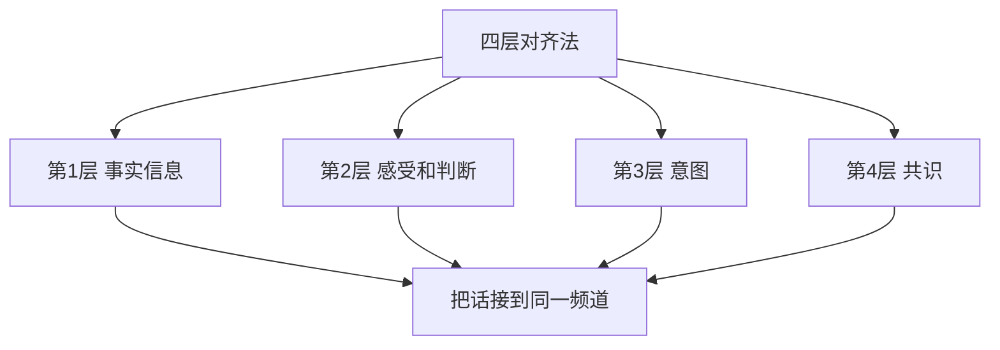

# 2.4管理沟通那些事

#### 目录介绍

- [01.开头故事引入](#01开头故事引入)
- [02.先来看一个场景](#02先来看一个场景)
- [03.管理沟通的框架](#03管理沟通的框架)
- [04.管理沟通的目的](#04管理沟通的目的)
- [05.管理沟通的内容](#05管理沟通的内容)
- [06.管理沟通的通道](#06管理沟通的通道)
- [07.管理沟通影响力](#07管理沟通影响力)
- [08.沟通稳定的因素](#08沟通稳定的因素)
- [09.提高沟通的效率](#09提高沟通的效率)
- [10.故事的回响](#10故事的回响)
- [11.思考题和作业](#11思考题和作业)

## 01.开头故事引入

**同一件事讲三遍还没对齐。** 我带的一个项目要和产品、设计、后端三方协同，排期很紧。第一次我和产品讲："这个功能 Q3 要上，优先级最高。" 产品点头。第二次我和后端讲："这个功能 Q3 要上，优先级最高。" 后端点头。第三次我在群里 at 了设计："这个功能 Q3 上线。" 设计回了一个"OK"。

一周后，产品给我发来一份需求文档，核心指标居然换成了另一个；设计把优先级排到了下个月；后端说"接口估计赶不上 Q3，往后挪一下"。三方都说"OK"，但三方对"Q3 上线"的理解完全不一样。

**沟通不是说了是说通了。** 事后我反思：我每一次"沟通"都只是在"通知"——把结论往外抛，假设对方懂了。但他们的背景、关注点、考核指标跟我完全不同，同一句话经过他们各自的"滤镜"，解读就走样了。

一位前辈跟我说过一句很贵的话："管理沟通的最低标准是'他听懂'，及格标准是'他能复述'，优秀标准是'他会按你的意图主动推进'。" 今天这一节，我从沟通的目的、内容、通道、影响力、稳定因素、效率六个维度讲清楚管理沟通的完整框架。

## 02.先来看一个场景

先从"做技术→做管理"的对象变化说起，你就能理解为什么沟通成了新经理最难啃的骨头。

**技术开发工作。** 技术开发工作主要和客观事物、自然规律打交道。客观事物和自然规律的特点就是确定性、精确性和稳定性。也正是对这些特性的掌握程度才能体现出我们对于客观世界的认知水平。对于这些客观的、稳定的特性和规律，我们的信念是认识它、掌握它、遵循它和利用它。所以精确、严谨、稳定以及按照规则办事、讲逻辑而非情感和感受，是技术人的基本哲学。而且越是优秀和出色的技术人，这些特质就越是明显。

**项目管理工作。** 项目管理虽然不可避免地要跟各个角色的人打交道，但这项工作无论是目标还是过程，核心都是做事、都是基于规则和规范的。换句话说，还是可以照规矩办事的。技术人从编程语言和技术框架的规则转换为项目管理的流程和规范，对于价值观的挑战还不是颠覆式的——精确性、规范性、确定性依然可以很好地发挥价值。虽然要不断地开会、沟通、不得不和人打交道，但是依然是在一个有规则的大框架下工作，"感觉还好"。正因为如此，项目管理是很多技术管理者的拿手好戏。

**和下级合作。** 如果说项目管理还可以大幅度地依赖规则和规范来搞定的话，那么和下级的合作和沟通就变成了完全和人打交道了。人大概是这个世界上最不稳定的"因素"了，自然性、社会性、情感性交织在一起，再加上无时无刻的相互影响和波动，就别指望有什么流程和规则是可以用于和很多人的相处了。即便是和某个确定的人相处都很难摸到规律，冲突和矛盾不断。作为管理者要和一群人相处，如果说安排他们做事还有些规矩可以用的话，那么员工激励就很难用规范和规则来实现了。

**和上级合作。** 从规则感和掌控感而言，和下级合作至少有一个因素可以利用，即你的职位和角色带来的职权。从权力角度讲，因为下级向你汇报，你对他们的工作有分配、知情、评价的权力，你可以主导团队的一些规则和文化。从视野角度讲，团队成员的工作都在你的视野范围内，所以你会有一种掌控感。而跟上级合作就几乎没有这些"确定性抓手"了，你只能靠内容质量和影响力。

## 03.管理沟通的框架

**稳定因素的四块积木。** 管理沟通让我们技术管理者们痛苦的主因是确定性和规则性的减弱、不确定性的大幅度上升。那么我们能否从和人沟通这个不稳定的工作之中找到一些稳定的因素呢？答案是有的，我们可以通过一个沟通框架来仔细探讨。这个框架主要分为上下两部分：上面的部分是由"目的"、"内容"和"通道"三个部分套在一起组成的，属于"沟通"的主体部分；下面是"影响力"部分。

## 04.管理沟通的目的

**沟通的四大目的。** 做任何工作都有一个初衷和目的，管理沟通也不例外。你可能会说管理沟通林林总总、每个沟通场景都有不一样的目的，实际上仔细想想你会发现沟通不外乎如下四个目的。建立通道，即建立沟通关系和沟通渠道，说白了就是你要和谁建立沟通关系、以什么方式和频度进行沟通，这就很像两个技术模块相互通信要建立"连接"一样；你刚接手某个团队的时候，需要跟上级、下级和合作的同级都建立沟通和合作关系，即是如此。同步信息，也就是把相互不了解的信息同步给对方、让对方知悉了解此事，这个目的在日常沟通中非常常见，比如同步目标、汇报进度、通知通报等。表达情感，有的时候沟通只是为了表达某种情感，比如表达焦虑和压力、快乐和感谢以及成就感等等，此时沟通本身就成了目的。输出影响，在工作中这类目的的沟通也是非常多的，比如提出建议希望对方采纳、管理上级的预期、和员工沟通绩效、向上级申请资源等等，都是希望别人能够采纳和满足自己的观点和诉求，从而达到输出自己影响的目的。以上是沟通的四个目的。无论是向上沟通、向下沟通还是横向沟通的各个场景，你会发现都可以纳入到这四个沟通的目的中来。

## 05.管理沟通的内容

**内容的本质是不失真。** 对于一次沟通来说，清楚了沟通的目的、也审视了沟通的通道，接下来就是组织沟通"内容"本身了。内容的有效传递是很多管理沟通课程的探讨对象，大量的沟通工具、技巧和流程，都是为了解决信息的"不失真"，以确保双方领会对方的确切意图。判断一次沟通的内容是否到位，可以用三问自检：核心观点是不是一句话能说清？对方听完能不能复述我的观点？对方是否知道接下来要做什么？这三问都"是"，内容就到位了。

## 06.管理沟通的通道

**建立通道的四要素。** 建立通道是沟通的四大目的之一。实际上，无论是不是作为沟通的目的，建立和审视沟通通道是每次沟通都必须要做的，因为沟通通道是我们沟通的前提和基础。一般来说，沟通通道或叫沟通机制的建立，从四个要素着手：沟通意愿、事务需求、沟通风格和信任关系。双方都有意愿谈、事务本身需要谈、风格上不冲突、关系上有信任，这条通道才算立得住。

## 07.管理沟通影响力

**管理沟通重点在管理。** 你可能会说我们不是在探讨沟通吗？怎么就把影响力也扯进来了呢？想说的是，我们通常所说的"管理沟通"，很多时候重点并不在"沟通"上，而在"管理"上。比如我们常常挂在嘴边的"绩效沟通"，这个沟通问题的核心其实在如何做绩效管理上，沟通只是绩效管理的一环而已。同理"上级要你扛目标"这件事，本质不是让你说得漂亮，而是让对方信服你能扛得住——这部分靠的是你长期积累的影响力，而不是你一时的话术。

## 08.沟通稳定的因素

可以看到在沟通这个不稳定的事物中，至少有四个因素是稳定的。

**管理逻辑。** 管理沟通问题其实需要从管理逻辑和沟通方法两个视角来应对和处理。所谓的管理逻辑，就是从管理角色认知和管理方法来看待该问题处理的逻辑。这是可以随着管理认知和管理经验的不断积累而不断提升的，你的管理逻辑和管理判断力会越来越可靠，应对管理沟通也就越来越有掌控感，所以这是相对稳定的一个因素。

**沟通通道。** 一个沟通通道的水平主要体现在通道是否稳定、以及沟通是否顺畅这两点上。决定这两点的就是你和对方的信任水平和默契程度，这两个要素也是会持续积累的，而且积累的水平越高沟通通道的品质就越高，故而沟通成本就越低。因此这也是管理沟通中比较稳定可靠的一个因素。

**工具流程。** 沟通有很多的工具、技巧、流程，对于最常见的向上、向下、横向这样特定的沟通场景，如果你能够持续掌握一些适合自己的工具和流程，那么这些你可以熟练使用的工具和流程，就变成了一个相对稳定的要素。

**影响力。** 影响力的积累不是一天两天的事情，而其发挥作用的时候也是非常稳定的，尤其在说服影响的沟通中，你有多大影响力基本就决定了你能影响什么样的人以及多大的事情。所以这也是沟通可以依靠的稳定的因素。

## 09.提高沟通的效率

无论是同步信息还是影响说服，如何才能轻松搞定、高效达成呢？关于沟通效率，我们可以从两个角度着手去提升：提升沟通通道的品质、提升沟通的技能。

**提升沟通的品质。** 沟通通道的品质主要是从稳定性和效率来衡量的。所谓稳定性，就是这个通道是稳定可靠的，不会动不动就谈崩或断了联系，即使有点误会双方也能够相互包容和谅解；在这个因素上，信任关系和信任水平就起了决定性作用，当你被对方充分信任的时候，你会发现很多不必要的沟通都可以省掉了，这种合作当然高效。所谓效率，就是这个沟通通道的效果和成本之比；所谓高效，是指双方只需要非常少量的成本就可以达成很好的沟通效果，在这个维度上双方的默契程度起了决定性作用。

**提升沟通的技能。** 沟通技能是使用沟通工具和沟通技巧来解决当下的沟通问题。在沟通中可以使用一个叫做"四层对齐"的工具来对齐彼此的信息、感受和意图。学过教练技术的同学一眼就可以看得出，这个工具的前三步其实就是"3F"倾听，只是在相互倾听的基础之上，又走到了第四步去确认有没有达成共识。

下面看一个小案例：某项目原定于 6 月 7 日完成，可是实际到 6 月 9 日才完成，于是研发经理刘备就找负责的工程师张飞沟通。刘备说："咱们这个项目按计划 7 号完成，你 delay 了两天也不跟我说一声，我是最后一个知道的！" 张飞说："我跟负责项目的产品经理孔明说了啊，他也觉得没问题，大家没有异议就行了呗，项目不是成功发布了吗！" 刘备说："那也应该提前跟我说一声啊，我如果提前知道就会让子龙来帮你，最后也不至于 delay 两天。" 张飞说："我觉得我能搞定，你不要动不动就让子龙来帮我，这是对我的不信任。要不是最近孩子生病我也不会 delay，即便 delay 了我也和合作方都沟通好了、什么事都没耽误，而且我已经尽最大努力了啊，你还要怎么样呢？信不过我的话下次这样的项目你交给二哥去做吧！" 刘备说："我就是想让你提前告诉我一声，你急啥！" 张飞说："你先急的好不好！" 这就是典型的"同一件事、不同频道"。

**第一层事实信息。** 即对方说了哪些事实性信息？和你掌握的信息相比有没有什么不同？这是沟通的第一层也是最基础的一层。如果双方连基本的事实信息都不一致，达成有效的沟通结果就无从谈起了。来看看，在上述案例中，刘备和张飞的沟通是基于一致的事实信息吗？不难发现，对于这三点重要的事实——项目 delay 了两天完成、张飞没有提前和刘备打招呼、项目结果各角色都认同没有耽误事儿，双方都认同是没有异议的，可见他们沟通的基础信息没有分歧。在发生意见和看法不一致的情况下，首先来对齐事实信息是必要且有效的。

**第二层感受和判断。** 即对于上述事实信息，双方是什么样的感受和判断。由于每个人生活的环境不同、所处的角色不同、惯用的思维方式不同、沟通的初衷也不同，所以即便是针对同样的客观事实，双方的感受和看法也常常是不同的，这就是沟通中最容易发生分歧的地方。我们还是通过前面的例子来看——基于同一个事实，刘备和张飞各自的感受和判断是什么。在刘备看起来：如果张飞提前告诉他这个风险，这个项目本可以不用 delay；而且自己作为张飞的直接上级最后才知道有这回事，无论怎么说，自己和张飞之间的协作方式都需要改进。在张飞看起来：delay 两天确实不应该，但也是不可抗拒的客观情况造成的，而且为了不给刘备添麻烦，自己主动协调好了各个合作方并保证项目成功发布，刘备不但不领情还一副信不过我的样子，显然在他眼里子龙更能干。

**第三层意图。** 即对方沟通的焦点在哪里，各自为了达到什么意图和目的。每一次沟通都是基于某个特定的目的和初衷的，无论这个问题你有没有在沟通之前去刻意厘清都是如此。在前面的案例中，刘备沟通的目的和意图是想说服张飞、让他在以后的工作中提前通报风险而不是瞒而不报，他从来没有质疑过张飞的能力。而张飞的目的和意图是什么呢？他在表达一种不满，这种不满情绪的背后是他希望刘备可以给他一些认可和鼓励并信任他的能力。所以你会发现他们的意图并没有矛盾和冲突，这场沟通完全可以达到彼此满意的结果。只是因为他们在沟通中不在一个频道上，把事实、判断、感受、责任、原因、方案等统统揉到一起来说了——你讲事实他说原因，你说原因他说感受，你说感受他说逻辑，你说逻辑他说责任，你说责任他说解决方案，你说解决方案他说困难……最终就成了"鸡同鸭讲"，互相的不理解和不认同。

## 10.故事的回响

**三个月后的项目协同对比。** 我用"目的-内容-通道+四层对齐"跑了三个月，下面是那条卡住的项目线数据。

| 维度 | 沟通踩坑期 | 三个月后 | 变化 |
|------|--------|---------|------|
| 同一结论需重复讲的次数 | 3 次仍没对齐 | 1 次即对齐 | -66% |
| 需求反复变更 | 2 次/周 | 0.5 次/周 | -75% |
| 三方按时交付率 | 30% | 95% | +65 pct |
| 跨团队投诉 | 4 次/月 | 0 次/月 | 质变 |
| 我花在"灭火沟通" | 每天 2 小时 | 每天 20 分钟 | -83% |

**我的三个深层领悟。** 第一个领悟：沟通不是"我说了"，是"他按我的意图动了"。第二个领悟：事实-感受-意图-共识四层必须按顺序走，跳层就一定会吵架。第三个领悟：沟通的上限是影响力，影响力的下限是信任。

## 11.思考题和作业

**三道思考题。** 第一题，自查题：你上周最失败的一次沟通，问题出在目的/内容/通道/影响力哪一层？

第二题，选择题：如果提升沟通效率必须先攻一个维度，你会选"通道信任"还是"沟通技能"？

第三题，情境题：上级让你"主动汇报但别每天打扰我"，你如何把握这个度？

**三道实践作业。** 作业 A（必做）：下次重要沟通前写一张纸条：这次沟通的目的是 4 类中的哪一类？

作业 B（必做）：选一次和下属的正式沟通，严格按四层对齐法走一遍。

作业 C（选做）：把你关键合作方的"沟通偏好"画一张表（语言直白/委婉、决策快/慢、喜欢文字/电话），据此调风格。

**延伸阅读书单。** 推荐《关键对话》系统学习"对话四层"；推荐《非暴力沟通》的观察-感受-需要-请求；推荐《影响力》理解沟通背后的稳定杠杆。

> 本节金句：沟通不是你说出来的那些字，是对方脑子里"最后留下的那句话"。
