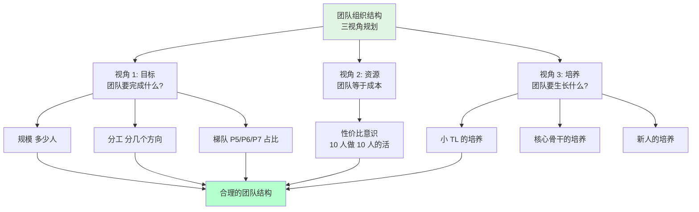
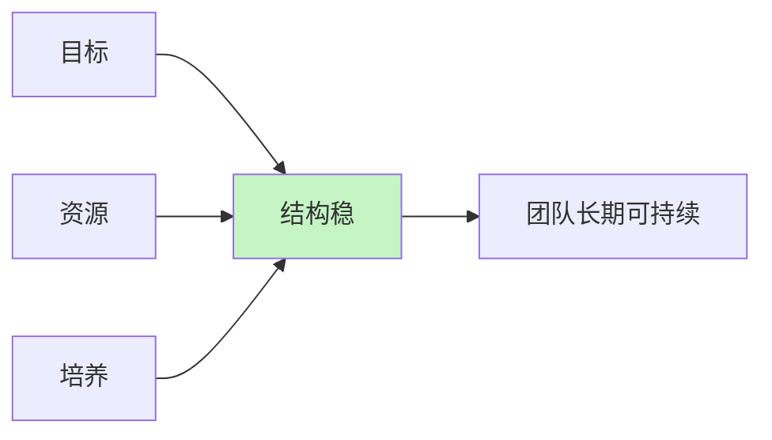
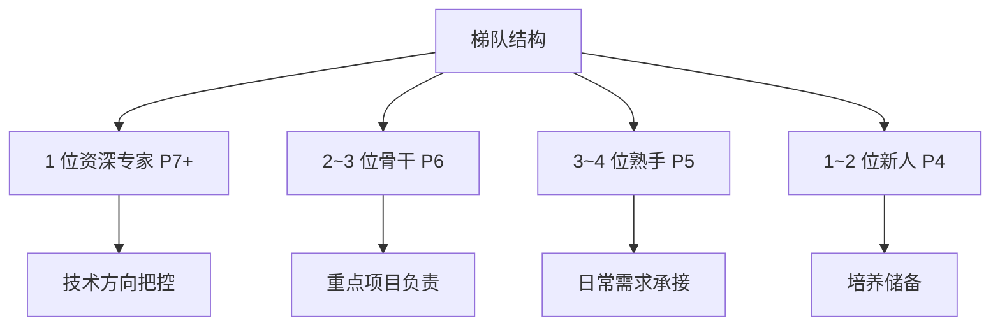
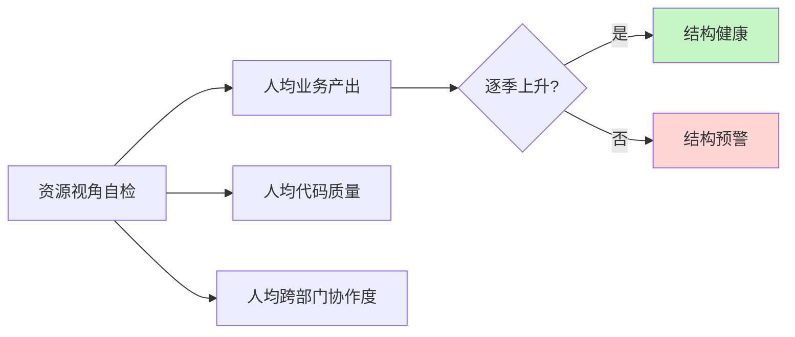
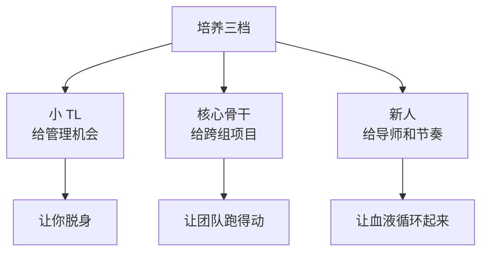

# 3.3 做团队组织结构

#### 目录介绍

- [01.开头故事引入](#01开头故事引入)
- [02.团队建设做什么](#02团队建设做什么)
- [03.第一视角看目标](#03第一视角看目标)
- [04.第二视角看资源](#04第二视角看资源)
- [05.第三视角看培养](#05第三视角看培养)
- [06.故事的回响](#06故事的回响)
- [07.思考题和作业](#07思考题和作业)

## 01.开头故事引入

**团队扩招 5 人后反而效率更低。** 我带的团队从 5 个人扩到 10 个人后，老板给了我 5 个 HC 的时候我是开心的——以为人多好办事。结果扩招完的第二个季度，团队的产出效率反而比原来下降了 30%。

复盘的时候我发现几个诡异现象：新来的 5 个人都是 P5，老团队是 3 个 P6 加 2 个 P7，梯队严重失衡；所有人都归我一个人管理，每周 10 场 1v1 把我时间耗干，我成了新的瓶颈；每个需求还是按照"谁空谁接"，没有按方向分工，10 个人重复做类似的事。

那段时间我每天最害怕听见"新同学入职"这几个字。我第一次意识到——不是团队大了就强了，是结构不对就全盘不对。

**HRBP 教我的"三视角"。** HRBP 找我吃饭，听完我的吐槽说："你这不是'团队变大'，你这是'人变多'。" 她在餐巾纸上给我画了一张图。

她说："团队不是人多就强，结构对了才强。你扩完 10 个人，应该在中间扎一个小 TL、按方向切成两个分组，你只管两个人、他们各管四个，才能跑得动。" 今天这一节，就从目标、资源、培养这三个视角讲"团队结构"该怎么规划。

## 02.团队建设做什么

**团队规划的三个视角总览。** 只是探讨团队规划，主要从如下三个视角。第一个视角是看团队目标，第二个视角是看资源，第三个视角是看人才培养。

| 视角 | 关键问题 | 产出 |
|---|---|---|
| 目标视角 | 到某个节点, 团队要长成什么样? | 规模/分工/梯队 |
| 资源视角 | 这些人值不值这个钱? | 人均产出 / 成本结构 |
| 培养视角 | 下个周期, 谁会长出来? | TL 梯队 / 骨干 / 新人 |

**为什么三个视角缺一不可。** 只看目标视角，你会把结构铺成一张漂亮的图，却没算清楚预算值不值；只看资源视角，你会砍到看不到明天的梯队；只看培养视角，你会沉迷育人而忽视当下业务。三个视角像三只脚，少一只这张凳子就翻。

## 03.第一视角看目标

**这里讲的目标不是业务指标。** 团队规划的第一个视角，是根据团队目标的设定去梳理团队。这里的"团队目标"，不是指团队所要完成的业务目标，而是你希望在某个时间节点到来的时候，把团队发展成什么状态。换句话说就是，到那个时候团队会是什么样子呢？

**看规模 盘清当前和新增。** 对于一个团队长什么样子，你要用什么指标来衡量呢？通常来说是三个维度：规模、分工、梯队。

首先是团队的规模。也就是你团队有多少人，这其中要理清楚有多少人是现有的，有多少人是接下来要新增的，即实际人数和预算人数，加起来就是你规划的团队总规模。规模定得过大，每月薪资一算老板皱眉；规模定得过小，等业务起量时人招不进来错过窗口。

**看分工 按业务切模块。** 其次是团队的分工。即你的团队都负责哪些业务、每个业务配置了多少人力、这些人员都如何分工、人力分布和业务目标是否匹配等。

一个好分工的判断标准是：别人问你"这事谁负责"，你能在一秒钟内报出一个人的名字；而不是"大家一起看一下"。

**看梯队 衡量团队复原力。** 最后是团队的梯队。一个团队的梯队情况代表了团队的成熟度和复原力。梯队成熟的团队不会因为一些偶然的因素（比如某个核心员工休假，或者某个技术负责人离职等）就随便垮掉。复原力强的团队只是短暂影响部分业务进展，但不会伤筋动骨、元气大伤，很快就会恢复正常。这个复原力很像技术服务的健壮性，会让团队非常有韧劲、经得起折腾。

一个 10 人团队理想的 P7/P6/P5/P4 配比大致是 1:3:5:1，而不是全挤在某一层。

## 04.第二视角看资源

**把团队看成一批"人力资源"。** 从资源视角来看待团队，是一个成熟管理者的标志之一。因为站在公司角度来看，每个团队都是一批人力资源，所以有个专门的职能角色叫 HR（人力资源）。

**每个 HC 都在算"性价比"。** 在现在很多互联网公司里，技术团队往往是最昂贵的资源和成本，预算人力实质上就是预算资源。所以，作为一个管理者，在盘点自己当前人力和预算人力的时候，需要有成本意识，要考虑投入这么多资源和成本是否值得、是否合理。

一个简易的自检模型：把团队的总人力成本（薪资 + 五险一金 + 股权摊销）除以团队每季度的业务产出，看看人均产出是不是逐季上升。下降就说明团队的"资源利用率"出问题了。

**资源视角三个实用动作。** 资源视角不是要你扣扣索索，而是三件事要常做：一是在每个季度末做一次人均产出统计，并和半年前对比；二是在每次扩招前先问自己"能不能让现有的人每人多做 20% 再谈新增"；三是在汇报团队时，把人力成本和业务价值放在同一页，让上级看见你是"懂成本的 TL"。

## 05.第三视角看培养

**培养视角的核心问题。** 关于对团队的盘点，除了团队的发展目标和资源投入视角，还需要从人才培养角度来看。即，到下一个时间节点，你需要重点培养出哪些人，给他们什么样的平台和空间，以及你有能力提供给他们什么指导和支持，期待他们能够胜任什么职能和角色。

**培养的三个梯度。** 培养一般分三档，每一档的目的和方式都不一样。

第一档是小 TL 的培养。当团队规模超过 8 人时，你就不能再让所有人直接汇报给自己，否则你就是新的瓶颈。这时要在中间扎一个小 TL，让他承担一部分直接管理职责。

第二档是核心骨干的培养。他们不是 TL，但是业务方向的主心骨。你需要给他们的是"复杂项目"和"跨组协作机会"，让他们提早体验小型负责人角色。

第三档是新人的培养。新人需要明确的导师、清晰的 30/60/90 天目标以及被认可的成长节奏。

**给培养加一个可执行的"人才盘"。** 实际操作上，我推荐做一张简单的"人才盘"——每季度和上级过一次。

| 姓名 | 当前层级 | 下一阶段角色 | 关键成长任务 | 风险/流失概率 |
|---|---|---|---|---|
| 小李 | P5 | P6 骨干 | 承接一个跨组项目 | 低 |
| 小王 | P6 | 小 TL | 带 3 人做专项 | 中 |
| 小张 | P7 | Backup TL | 协助我做季度规划 | 高, 可能被挖 |

这张表比一堆描述性语言更能让你和上级迅速对齐下一步培养动作。

## 06.故事的回响

**按三视角重搭结构后的数据对比。** 那次扩招翻车后，我按照三视角把团队拆成了 2 个方向小组，每个组 1 个小 TL 带 4 人，我自己只带 2 位小 TL。半年后的数据让我彻底服气——"人多不等于战斗力强，结构对了才等于"。

| 观测维度 | 扩招混乱期 | 三视角重搭半年后 | 变化 |
|---|---|---|---|
| 团队人均产出（需求/月） | 1.4 | 2.3 | +64% |
| 我每周 1v1 场次 | 10 | 2 | 降 80% |
| 梯队断档岗位 | 3 个 | 0 个 | 补齐 |
| 小 TL 数量 | 0 | 2 | 从 0 到 2 |
| 核心员工主动离职率 | 2 人/季 | 0 人/季 | 清零 |

**作者亲历后的三点领悟。** 第一点领悟是，团队规模超过 8 人是一条分水岭。8 人以内，TL 可以"亲自管到每个人"；超过 8 人，必须中间再长出一个小 TL，否则你会先被耗死。

第二点领悟是，梯队结构比人头数量更决定团队是否扛得住意外。我以前总盯着"我要多少个 HC"，后来才开始盯"我在 P7/P6/P5/P4 各档分别有多少人"——前者是数量，后者是结构。

第三点领悟是，培养视角要提前一个周期。等到一个人已经熟练到要走了才开始想接班人，一定来不及；真正的做法是——每个方向都提前 6 个月挑好一个 Backup，让他在当事人没走之前就开始影子运作。

## 07.思考题和作业

**三道思考题。** 第一题：如果明天你团队的核心骨干突然请长假一个月，会不会直接停摆某条业务？这个题目的答案就是你的梯队复原力的真实分数。

第二题：你的团队超过 8 人了吗？如果超过，为什么现在还只有你一个 TL？阻碍你扎小 TL 的是没人选，还是你没舍得放权？

第三题：回顾过去一年你团队的 HC 增长——每一个新增的人，你事后回看"值不值"？哪些是以"人手不够"为名的冲动招聘？

**三个可执行作业。** 作业 A：画一张《团队组织结构现状图》。包含层级、人数、方向分工、年龄与司龄分布，找出结构上最不合理的一处（如断档、冗余、倒挂等）。

作业 B：做一份《未来半年团队结构规划》。分别从目标、资源、培养三个视角各写三条具体动作，例如"Q3 要扎一个小 TL""Q4 要把 P5 比例从 70% 降到 50%""Q4 要给骨干 A 安排一次跨组项目"。

作业 C：和 HRBP 约一次对齐会。把上面两张图带过去对，一起识别潜在结构风险（流失风险高的骨干、梯队断档、成本不合理），形成一份正式的团队结构规划写进季度述职。

**延伸阅读书单。** 《组织的逻辑》——帮你理解组织结构背后的几种基本设计原则。《华为团队工作法》——看看巨头是怎么搭"三个层次的梯队"。《首席执行官》（吉姆·柯林斯）——从 CEO 视角看"用人"和"建结构"。《分答创始人》相关访谈——小团队快速扩大时的结构踩坑和调整经验。

---

**本节金句**：人多不等于团队强，结构对了才等于战斗力上升；你的第一件管理功课，是学会把"一堆人"翻译成"一张结构"。
