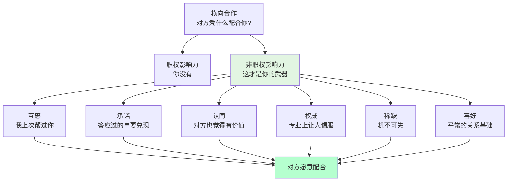

# 2.7管理之横向沟通
#### 目录介绍
- [01.开头故事引入](#01开头故事引入)
- [02.什么是横向沟通](#02什么是横向沟通)
- [03.沟通影响力分析](#03沟通影响力分析)
- [04.非职权影响合作](#04非职权影响合作)
- [05.提升八维的能力](#05提升八维的能力)

## 01.开头故事引入

### 1.1 推不动的跨部门合作

那年我们团队要做一个数据打通的项目，需要业务后台、数据平台、风控三个团队配合。三个团队都不归我管，我去谈的时候，每一家的反应都差不多：
- 业务后台说："我们 Q3 的 OKR 里没有这个，要不等 Q4？"
- 数据平台说："接口开发 3 周，我们排期已经满到 6 月。"
- 风控说："你们这个需求我要去跟我们总监对齐，等我消息。"

我每次约了对方 TL 开会，讲完诉求，大家点头表示"懂了"；会后我再跟进，他们依旧在推。**我给对方写邮件、拉群、甚至请他们吃饭，进度还是零。**

### 1.2 领导一句话让我开悟

最后我只能向我老板求助。老板听完我的描述，问了我一个问题："**你给过他们什么好处？**"

我愣了一下："好处？我没法给啊，我不是他们老板。" 老板笑："你对他们没职权影响力，那你有没有尝试过非职权影响力？你有没有帮他们想过 —— **这事做了，对他们 Q3 的 OKR 有没有加分？对他们的晋升有没有加分？对他们以后求你帮忙有没有伏笔？**"

这句话一下子把我点醒。

今天这一节，就把"没职权的人如何让对方主动配合你"这个核心难题，拆成四维八因素讲透。

## 02.什么是横向沟通
- 横向沟通，也就是和没有直接汇报关系的合作方之间的沟通。横向沟通有哪些目的呢？既然横向沟通也是一种沟通，那么就不外乎前面我们提到的四个目的：建立通道、同步信息、表达情感和输出影响。
- 在真实的横向合作中，你不难发现，大多都是以同步信息和寻求支持为目的。其中，寻求支持就是通过说服对方来支持自己，其目的也就是“输出影响”。
- 关于同步信息，对于技术出身的管理者们来说主要是意识层面的挑战。一般只要意识到了，大都就能做到，因为他们是信息传输方面的行家里手。所以，横向沟通更核心的挑战在于：对于没有汇报关系的合作者，如何获得他们的支持和帮助呢？

## 03.沟通影响力分析
- 影响力，是一种不使用强制性力量却能改变别人的看法和行为的能力。一般又分为职权影响力和非职权影响力。
- 所谓职权影响力，主要是指你的职位因素所提供给你的影响力。在我们工作中常见的是如下三个因素：
- 传统因素。即在社会传统意识和社会规范当中，对于上级的基本姿态是要服从的。所以人们对于上级有一种天然的服从感。
- 职位因素。即从组织架构的角度，由于上级对于下级有奖惩和评价的权力，使得下级对他们有一种敬畏感，从而更容易遵从上级。
- 资历因素。即有资历的人，在人们的眼中是值得敬重的。虽然在互联网领域里，已经很少提及论资排辈了，但不可否认的是，你新加入一家公司时，对于公司里资深的老员工常会有一种敬重感，这是人之常情。
- 

## 04.非职权影响合作
- 非职权影响力，即，不是利用你的职位因素而提供的影响力。那么，非职权影响力有哪些因素呢？
- 在非职权影响力方面，《影响力》可以说是殿堂级的著作，他主要从互惠、承诺一致、社会认同、喜好、权威和稀缺这六个方面，探讨了影响力是如何影响人们的。
- 基于我们管理沟通中的实际场景，并结合技术管理者日常可以采用的手段，整理出如下四个维度、八个因素。
- 

### 3.1 第一维度信任
- 第一个维度是信任，是关于“人”的。其影响力发挥的逻辑是：“你之所以能影响我，是因为你是 XX，我信任你这个人。”这个维度有两个因素比较有效：
- 一、人品和品格。这个看上去挺虚的因素，在人们实际的决策中却起着非常重要的作用。问一些管理者愿意对什么样的下属委以重任，他们基本都会提到“人品”这个因素，人品比较“正”的人他们更愿意信任。
- 二、历史表现。有人说：“你们当前的影响力，很大程度上来源于你们之前的历史表现，所以，要想之后有更好的影响力，就从现在的事情做起吧！”那么，怎么做呢？去承诺，然后去兑现承诺，即秉承我们常说的“承诺一致性”。
- 和上级约定好一段时间内所要完成的重点工作，并承诺完成。多数管理者会说“我尽量完成”，甚至是不置可否，就着手去推进这些工作了。虽然你的上级知道你在负责，但是他们心里对你能不能搞定并没有底。
- 你可能会说：“如果我承诺了，兑现不了怎么办？”首先，你不能做很多承诺，而只要去承诺那些你和上级都认为最重要的1~3件工作。其次，如果中途发生变化，提前做出更合理的调整，并和上级重新明确约定。最后，既然是你和上级都认为重要的工作，就全力以赴去确保兑现，尽可能避免上面“其次”中那种情况的发生。

### 3.2 第二维度专业
- 第二个维度是专业，是关于“能力”的。其影响力发挥的逻辑是：“你之所以能影响我，是因为我觉得你更专业，你有这个能力。”这个维度的影响力，也可以通过两个因素来提升：
- 提升权威度。这个很容易理解，在特定领域专业度较高的人，对于方案往往有更强的话语权。作为管理者，你不可能在各个方面都有很高的专业度，但是需要有一个专业度是显著的，要显著到什么程度呢？这和对方对你的期待有关系，比他的期待高得越多，就越有影响力。
- 提高逻辑性。数据准确，论据充分，条理分明，逻辑清晰，都会大大提升你的观点和结论的可信度。如果你想说服别人，你的论述就要有很好的逻辑性，经得起推敲。如果你在表述一个问题的时候，三句两句就被问得一头雾水、不知所措的话，又怎么能够让别人信服呢？

### 3.3 第三维度情绪
- 第三个维度是情绪，是关于“情绪情感”的。其影响力发挥的逻辑是：“你之所以能影响我，是我被你感染和感动了。”这个维度的影响力发挥，也有两个因素可以考虑：
- 通过诉诸情怀来感染人。虽然在很多人眼里情怀不能当饭吃，但是在一些吃饱饭的人眼里，情怀很重要。有的时候，对方看到你高远的视角和情怀，就会情不自禁地想帮你一把，甚至还会追随你一起努力。这就是为什么很多创业者会去宣扬自己的情怀和使命。
- 通过情绪来感染人。毕竟，人不是纯理性的，否则的话，那些基于“理性人”假设的经济规律早就摸透我们的前世今生了。很多时候，经济学家们之所以无法准确预测经济规律，主要还是因为他们的基本假设不成立，即，人不是纯理性的。

### 3.4 第四维度互惠
- 第四个维度是互惠，是关于“心理债务”的。其影响力发挥的逻辑是：“我欠你的，我会想办法还给你。”虽然叫“互惠”，但这个维度的焦点在于“施惠”。由于人们普遍有“还债”心理，所以一旦你首先去支持和帮助别人，那么以后别人也会找机会来回报，这样你的请求就容易被满足了。
- 厘清对方的诉求，去满足对方的诉求，然后再来满足自己的诉求。这就是我们通常意义上说的双赢。在很多临时性合作、一次性合作和对外合作中，这都是合作的基础和前提。而且，当你捕捉到对方在乎和看重的是什么的时候，也就更能说服对方接受你的方案。
- 主动提供支持和帮助。很多人都会觉得，主动提供了帮助，如果没有得到显性的回报，就认为自己“亏了”。那么今天我告诉你，即便对方没有显性的回报，你也收获到了对于他的影响力，所以你并没有白白付出。

## 05.提升八维的能力
- 知道了非职权影响力所涵盖的维度，于是，该如何提升自己的影响力也就有章可循了，即，从前面提到的四个维度、八个要素去提升。具体可以参照下表：
- 
- 你可能会问，影响力的提升毕竟是一个长期累积的过程，假如我当下就要去说服和影响别人，那该怎么办呢？
- 如果你此时就要发挥影响力去说服和影响别人，不妨在这几个方面下下功夫：厘清对方的诉求和重要关切；找到能够支持你的权威人士或权威说法；反复打磨你的思路和逻辑，让你的观点和结论很有说服力；诉诸情怀，如果你觉得沟通对象可能买账的话；展现你的决心和气魄。

