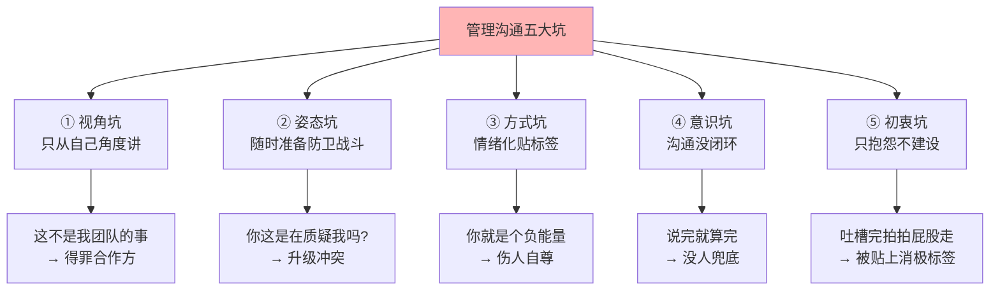

# 2.8管理沟通一些坑
#### 目录介绍
- [01.开头故事引入](#01开头故事引入)
- [02.管理沟通一些坑](#02管理沟通一些坑)
- [03.角色的认知不够](#03角色的认知不够)
- [04.沟通姿态在防卫](#04沟通姿态在防卫)
- [05.情绪化去贴标签](#05情绪化去贴标签)
- [06.沟通没形成闭环](#06沟通没形成闭环)
- [07.只给抱怨不建议](#07只给抱怨不建议)

## 01.开头故事引入

### 1.1 一句话让整个团队记恨我三个月

我接手一个小组不到一个月，部门里来了一个要跨组支持的紧急项目。我团队当时也忙，我在跨组群里脱口而出："**这不是我们团队的事，别找我们。**"

这句话在群里还没沉下去 5 分钟，我老板就私聊我："你这话说错了。" 接着给我打电话讲了半小时。更让我后悔的是，此后整整三个月，其他部门的同事对我们团队的协助需求都变得"懒洋洋"——人家说话也客气，但眼神不对，推进速度比以前慢一倍。

### 1.2 五种沟通误区的深坑

这件事让我重新审视自己——我以前以为"沟通"就是"把话说清楚"，其实沟通里有五个大坑，踩中任何一个都会让你之前辛苦积累的人际资产快速清零：

越是高位的管理者，在这五个坑上翻车的代价越大——因为**你的每一句话都会被下属、合作方、甚至上级放大解读**。今天这一节，就把这五个坑一个一个摊开来讲，每个坑配一句我当年踩坑时说过的"原话"。

## 02.管理沟通一些坑
- 关于管理沟通的误区，到这里，一共探讨了下面这些类别：
- 视角问题：沟通仅从自己出发，对管理者的角色和视角认知不够。
- 姿态问题：总是在防卫，随时准备战斗。
- 方式问题：先给人贴标签，对人不对事。
- 意识问题：沟通没有形成闭环。
- 初衷问题：只给抱怨不给建议。

## 03.角色的认知不够
- 沟通视角问题：沟通仅从自己出发，对管理者的角色和视角认知不够。这类说法背后的逻辑是：这不是我团队的事儿，问题都是别人团队的。常见的说法有：
- 在项目攻坚初期，有的技术管理者会这样说：“需求还没有出来，为什么我们团队要陪产品团队一起 996？”
- 当上级要求运营任务的时候，有些管理者会这样说：“为什么要我们团队傻傻地去点赞？这个又不在我们团队的职责范围内。”
- 在评审产品设计的时候，有些技术管理者会这样说：“怎么会有这么二的设计，一点儿逻辑都没有！”
- 在确认产品功能和效果的时候，有的产品团队管理者会这样说：“怎么研发老是自作主张，看不懂需求文档吗！”
- 如果这类说法是出自一位管理者之口，无论是技术团队的管理者，还是产品团队的管理者，其“视角”就未免有些低了。
- 阐述一个简单的逻辑：一线员工是用工作量来评估价值的，他们只要做出了自己该做的，就是有价值的；而管理者是用团队业绩来评估价值的，即便不是管理者个人的原因，只要结果是团队不出业绩，那么管理者的价值就很难体现。而且，如果“不幸”其团队成员都很能干的话，就更加凸显出管理者的失败。
- 管理者要做出好的业绩，就需要站高一层，站在自己上级的视角来和各个团队协同，以收获共同期待的成果。并且大部分时候，帮合作团队一起做好工作，也是为了自己的业绩，你并不会吃亏。

## 04.沟通姿态在防卫
- 沟通姿态问题：总是在防卫，随时准备战斗。这类管理者总是以为对方在针对自己，过于敏感。常见的说法有：
- 上级问：“按照计划进度不是要到60%了吗，怎么才到40%啊？”有的管理者这样回答：“这也不能怪我啊，产品变更需求了!”
- 上级问：“约定好的流程为什么没有走呢？”有的管理者这样回应：“为啥其他人不走流程你就不说，我已经很认真了啊，流程有这么多问题，我工作又这么紧张……”
- 合作者说：“这里有个问题，帮忙看看怎么回事吧。”有的管理者这样回应：“这不可能，肯定是你看错了”，或者说：“只能做成这样子，我也没办法。”
- 合作者问：“这个 BUG 有多大影响？”有的管理者这样回应：“我估不出来，你找别人吧！”
- 对于以上四个管理者的回应，如果你是他的上级或合作者，你会是什么感受呢？我估计你会有如下两个直接反应：疑惑和僵住：“我也没说啥啊，咋就毛了呢？这话茬没法接下去了啊……”远离和放弃：“这人说不得啊，没法交流，以后少打交道吧。”
- 防卫姿态对于管理者做好工作不会有正向价值，长此以往，就等于关闭了别人提供帮助的大门，任其自生自灭，这显然是个双输的结果。所以，工作中最好还是以做事为主，少考虑一些个人感受。如果就事论事地去沟通问题，反而会赢得更多合作者的尊重。

## 05.情绪化去贴标签
- 沟通方式问题：先给人贴标签，对人不对事。一种“对人不对事”的沟通，你已经给对方贴上了负面的“标签”，而一旦给人贴上了标签，对方也就放弃了改变自己的意愿，失去了改变自己的动力。因为“反正在你心目中已经是这样的一个人了，何必徒劳无功呢！常见的说法有：
- 管理者这样对下属说：“你怎么这么不靠谱，这么简单的事儿你都搞不定！”
- 对下属相似的说法还有：“你能不能务实一些？你能不能踏实一些？你能不能努力一些？你能不能用点脑子……”
- 管理者这样抱怨合作方：“太脑残了，就没见过你这样的！”
- 管理者这样对合作的产品经理或设计师说：“你到底懂不懂怎么做产品，你根本就不懂设计。”
- 对于以上四类说法，或许有两种可能：管理者就是想发泄情绪；管理者借情绪表达自己对下属和合作方的期待。只不过，无论是哪种情况，这样的说法都换不来下属和合作方的改变。
- 作为一个管理者，如果没有注意到自己这个沟通方式的弊端的话，你将会承担这样的损失：别人成了你眼中的“屡教不改”，你看不到别人的改变。你在别人心中失去了管理者的威信，大家会觉得你没有管理者的胸襟和风范。和你同心同德的人越来越少，团队人心涣散。
- 一旦意识到问题所在，解决起来倒也简单：学会管理自己的情绪，就事论事地来讨论事情。前面几篇文章中探讨的情绪管理和沟通工具的内容，都对此会有帮助。

## 06.沟通没形成闭环
- 沟通意识问题：沟通没有形成闭环。没有形成良好的“沟通闭环”意识，认为消息和邮件发出去了，接收到的人就应该都及时看到；任务安排出去了，别人就得无失真地接收到。常见的情形有：
- 你发了一条消息石沉大海……你发了一封邮件石沉大海……你安排了一项任务石沉大海……
- 然后开始扯皮：“我说了啊；我发了啊；我安排了啊；我通知了啊……”“我没看到；我没收到；我没注意；我不会做；我觉得没那么重要；我觉得没那么急；我没时间；我看不懂；不该是我干……”
- 既然是意识问题，应对这类问题的办法也是建立觉察，意识到这一点：不能默认对方一定能收到，而且不能默认对方理解的和你想的是一致的。所以，对于你关心的问题，一定要去确认清楚，跟进到底，形成沟通闭环。

## 07.只给抱怨不建议
- 沟通初衷问题：只给抱怨不给建议。想必你也肯定和这样的管理者打过交道吧？他们共同的特点就是发泄抱怨，并没有给出应对的建议和解决方案。常见的情形有：
- “这个规定太不合理了，没法遵守！”
- “我们在指定日期肯定做不完，没戏！”
- “这个设计很不合理，完全不考虑用户体验！”
- “团队的氛围太差了，郁闷！”
- 作为管理者我们需要清楚一点，的确会有很多事情是我们掌控之外的，其中不乏不合理或不完善的。对于这样的情况，发泄抱怨则意味着我们内心深处已经对此无能无力了。而实际上，我们也许并不需要完美地解决这个问题，我们也把事情往好的方向上推进了一点点，这也是我们的价值。
- 应对这类问题，需要做的是意图转换，从“我不要……”转换到“我想要……”，然后看看有哪些事情可以做。比如对于上述四个问题，我们可以这样问自己：
- “这个规定太不合理了，没法遵守！”——那么，怎么样就合理了？
- “我们在指定日期肯定做不完，没戏！”——那么，什么条件满足之后，就能做完呢？或者，认为什么时候能做完？
- “这个设计很不合理，完全不考虑用户体验！”——那么，怎么样会合理一些呢？
- “团队的氛围太差了，郁闷！”——那么，怎么做氛围会变好一点点呢？
- 通过问自己这些问题，相信你会有“意外”的发现，而正是这些“意外”的发现，才是你的创造力、价值以及管理能力的体现。

