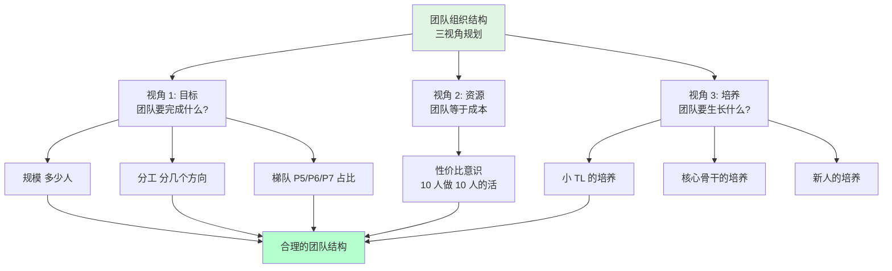

# 3.3做团队组织结构
#### 目录介绍
- [01.开头故事引入](#01开头故事引入)
- [02.团队建设做什么](#02团队建设做什么)
- [03.第一视角看目标](#03第一视角看目标)
- [04.第二视角看资源](#04第二视角看资源)
- [05.第三视角看培养](#05第三视角看培养)

## 01.开头故事引入

### 1.1 团队扩招 5 人后反而效率更低

我带的团队从 5 个人扩到 10 个人后，老板给了我 5 个 HC 的时候我是开心的——以为人多好办事。结果扩招完的第二个季度，团队的产出效率**反而比原来下降了 30%**。

复盘的时候我发现几个诡异现象：
- 新来的 5 个人都是 P5，老团队是 3 个 P6+2 个 P7，**梯队严重失衡**
- 所有人都归我一个人管理，每周 10 场 1v1 把我时间耗干，**我成了新的瓶颈**
- 每个需求还是按照"谁空谁接"，没有按方向分工，**10 个人重复做类似的事**

### 1.2 HRBP 教我的"三视角"

HRBP 找我吃饭，听完我的吐槽说："**你这不是'团队变大'，你这是'人变多'。**" 她在餐巾纸上给我画了一张图：

她说："**团队不是人多就强，结构对了才强。你扩完 10 个人，应该在中间扎一个小 TL、按方向切成两个分组，你只管两个人、他们各管四个，才能跑得动。**" 今天这一节，就从目标、资源、培养这三个视角讲"团队结构"该怎么规划。

## 02.团队建设做什么
- 只是探讨团队规划，主要从如下三个视角：第一个视角是看团队目标；第二个视角是看资源；第三个视角是看人才培养。

## 03.第一视角看目标
- 团队规划的第一个视角，是根据团队目标的设定去梳理团队。这里的“团队目标”，不是指团队所要完成的业务目标，而是你希望在某个时间节点到来的时候，把团队发展成什么状态。换句话说就是，到那个时候团队会是什么样子呢？
- 对于一个团队长什么样子，你要用什么指标来衡量呢？通常来说是如下三个：
- 首先是团队的规模。也就是你团队有多少人，这其中要理清楚有多少人是现有的，有多少人是接下来要新增的，即实际人数和预算人数，加起来就是你规划的团队总规模。
- 其次是团队的分工。即，你的团队都负责哪些业务，每个业务配置了多少人力，以及这些人员都如何分工，人力分布和业务目标是否匹配等。
- 最后是团队的梯队。一个团队的梯队情况代表了团队的成熟度和复原力。梯队成熟的团队，不会因为一些偶然的因素（比如某个核心员工休假，或者某个技术负责人离职等）就随便垮掉。复原力强的团队只是短暂影响部分业务进展，但是不会伤筋动骨、元气大伤，很快就会恢复正常。这个复原力很像技术服务的健壮性，会让团队非常有韧劲，经得起折腾。

## 04.第二视角看资源
- 从资源视角来看待团队，是一个成熟管理者的标志之一。因为站在公司角度来看，每个团队都是一批人力资源，所以有个专门的职能角色叫 HR（人力资源）。
- 在现在很多互联网公司里，技术团队往往是最昂贵的资源和成本，预算人力，实质上就是预算资源。所以，作为一个管理者，在盘点自己当前人力和预算人力的时候，需要有成本意识，要考虑投入这么多资源和成本是否值得，是否合理。

## 05.第三视角看培养
- 关于对团队的盘点，除了团队的发展目标和资源投入视角，还需要从人才培养角度来看。即，到下一个时间节点，你需要重点培养出哪些人，给他们什么样的平台和空间，以及你有能力提供给他们什么指导和支持，期待他们能够胜任什么职能和角色。

