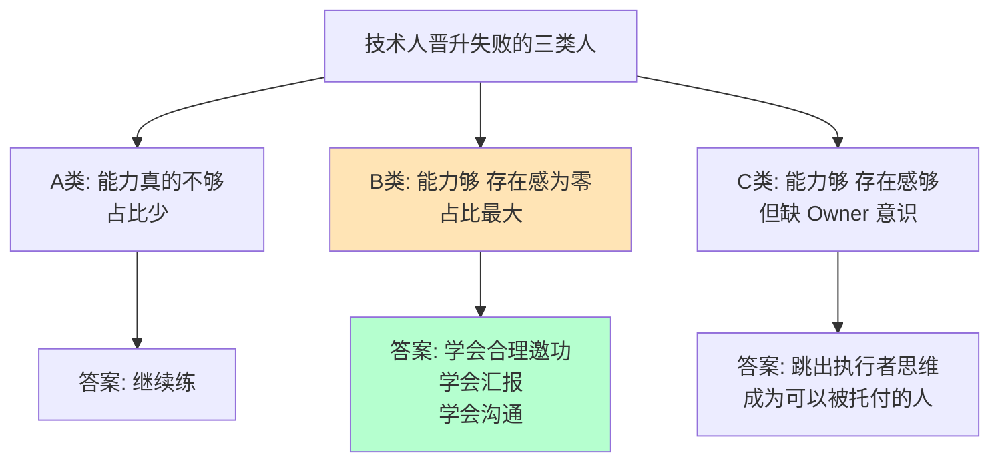

# 4.1职场进阶的要点
#### 目录介绍
- [01.开头故事引入](#01开头故事引入)
- [02.职场得学会邀功](#02职场得学会邀功)
- [03.及时和上级沟通](#03及时和上级沟通)
- [04.交代工作划重点](#04交代工作划重点)
- [05.区分做好和做完](#05区分做好和做完)
- [06.应对提问四步曲](#06应对提问四步曲)
- [07.向上汇报坏消息](#07向上汇报坏消息)
- [08.向上去成就领导](#08向上去成就领导)
- [09.职场哲学的思考](#09职场哲学的思考)
- [10.要有Owner意识](#10要有owner意识)
- [11.技能要高于薪酬](#11技能要高于薪酬)
- [12.导师管理方法论](#12导师管理方法论)
- [13.Owner管理职责](#13owner管理职责)
- [14.技术人商业头脑](#14技术人商业头脑)

## 01.开头故事引入

### 1.1 干得好却得不到提拔的朋友

我有个朋友阿杰，在一家大厂做技术做了 5 年，人勤快、活干得漂亮、口碑也不差。每次团队有大项目，阿杰都是默默冲上去把最难啃的骨头啃下来。但诡异的是，**他连续 4 年晋升都没过**，而组里一个看起来"能力不如他"的同事，第 3 年就晋到了下一档。

阿杰某天晚上喝了点酒跟我说："我真的不懂，我每天忙成狗，交出去的代码质量比他好，甚至他有问题了我还帮他看，为什么他能晋升我不能？"

我问他一个问题："你做的那些大项目，你的领导、领导的领导，**他们知道哪些是你做的吗？**"他愣了很久："……应该知道吧？写日报的时候提过。"

### 1.2 老板亲口跟我说的"残酷真相"

后来我自己带团队后，有一次和上级喝酒，我把阿杰的事讲给他听。他冷冷说了一句：

> **"90% 的晋升失败不是能力问题，是存在感问题。我们做评委的，只看得见被放到桌面上的功劳。你默默做的事，在老板眼里等于没做。"**

这句话让我重新审视了"技术人在职场的残酷真相"。

今天这一节，就把我自己亲身实践验证过的 13 个"职场进阶关键点"讲给你——每一条都来自真实的晋升复盘。

## 02.职场得学会邀功

**1.先说一下场景**

有个同事在公司以及团队干的很不错，能力在团队中也属于中上的，但是一直就是没有领导提拔，好像没有人看到自己的付出，感觉有点憋屈。

很多人会是这种情况，尤其互联网行业众多做技术的，多是属于默默无闻型，闷声做事，很少表达，更别提与别人勾心斗角与主动邀功，其实在职场，特定的邀功是必要的。

**2.邀功而非抢功**

邀功，不是抢功，所谓邀功是指自己做的功劳要让别人，尤其是领导知道。如果不是自己的功劳，非要抢别人功劳肯定是不鼓励的，而且别说，抢功在职场也不是什么新鲜事，如果你不学会邀功，那么碰到心机的同事，被别人抢功更是憋屈。

有同学肯定要说了，自己默默付出就好了，还得邀功，那多幼稚，听起来就很尴尬，而且很多人深信，只要默默付出，总有领导会欣赏我的。

职场中的默默付出，真不见得就有领导会发现，在稍微大点的公司，团队人数多了点，领导叫不出你的名字都是正常的，更别提领导会主动发现你。

你做了什么突出贡献，做出了超预期的成绩，要想办法让团队，让领导知晓。

**3.邀功方式多样化**

邀功的方式很多，有比较直接干脆的，有隐晦不经意间的，没有一个通用的方法论，不同的公司文化与氛围决定了邀功的方式不一样。

假如运营人员做了什么事情，对拉新、促活或者销售有很大的成绩，这时侯事后写一篇总结邮件，把整个过程从策划到执行再到中间遇到的困难，以及之后的经验教训总结出来，发给团队负责人，这也是借经验总结来额外邀功的一种方式。

闷声做事情也要适当反馈。真得学会必要的邀功，这不是跟别人勾心斗角，而是对自己辛苦努力付出的一种负责，这是一种表现与争取。

大家都很忙，没人会一天到晚注意到你，关注到你，你只有自己主动，才能让自己的能力有更大的发挥空间，也才能为自己的付出赢得应有的机会。

## 03.及时和上级沟通

**1.让领导知道你的进度**

如果你的工作不能达到上级的要求，一定要及时和上级沟通，要让他知道你的进度和方向。

可能在一定时期内，你的工作还没有让别人看到显著成绩，这时不要和你的上级距离太远，要创造条件去沟通，让他知道你的进度、计划和要取得的成绩。

你这样做了，上级不会责备你，他还会利用所掌握的资源给你帮助，让你提前取得业绩。

**2.不要对上级敬而远之**

有的职场新手甚至老手容易犯的错误却是，越是没有成绩越是不愿去找上级沟通，认为自己没有面子，对上级采取敬而远之的态度。

这样的风险很大，因为你业绩低迷，上级本身就不会满意，会对你的工作能力产生怀疑。如果再不了解工作状况和进度，还会认为你没有努力工作。

时间一长，你就可能进入要被淘汰的黑名单。其实在每次的淘汰名单中，并不全是业绩最差的人，但不会主动找上级沟通的人却会占很大比例。

反馈只是正在进行中，至于是如何进行、进行情况如何，一直得不到明确答复。“用人不疑”是一条原则，但这是需要有不被怀疑的行动。

**3.一定要及时反馈**

任务及时反馈制度非常的重要。不知大家是否有认同，很多任务上级交代下来你很容易的就完成了，会想当然的以为这么简单的事情就不要去汇报了，领导知道的如果完不成我肯定会向他汇报的。

这个想法非常不妥，领导一般交代下来的工作都希望有个反馈，成或不成，有没有其他的新的问题，你不反馈，领导会记着，时间长点有的领导会怕下属觉得自己沉不住气而不好去问，而且尽量不要去猜测领导的想法，要学会换位思考。

不要等领导主动问结果。等到领导主动问你结果时，他即使没说也是已经在责怪你了，交代下来的事情无论大小一律及时反馈。

对于上级安排的临时性工作，一定要及时反馈。有时上级会安排临时性工作给你，这些工作可能非常紧急，上级会要求随时反馈完成期限，这也是让上级增进对你信任度的机会。

## 04.交代工作划重点

**1.要指出思路和重点**

交代工作最好指出思路和重点。所谓抓主要矛盾就是这个意思。人在职场，会遇到很多风格迥异的领导，比如他交代工作给你后，却不和你讲清楚完成这项工作的重点和思路，要你自己去悟去体会，或者说这个事情你看着办吧，其实这些都很难办。

这样一个很明显的问题就是判断过错的主动权直接掌握在他的手里了，他可以给你穿小鞋，我也遇到过几个这样的领导，一开始不懂行以为很放权我就放手去做了，结果可想而知，后来我学聪明了。

既然无法判断这个领导的意图，我就想法设法向其请示让他给我说出工作思路和重点，应该如何去完成。

**2.给同事说清楚重点**

一定要给同事说清楚重点。有了这个痛苦，我在给下属布置工作时，从来都是先和他们说清楚工作要点和重点，提供一个借鉴思路，让下属好做些，所以说带着镣铐跳舞比没有镣铐容易，你给他局限的越多，他犯错误的概率也就越小。

**3.一定要拉齐目标**

交代工作时确保拉齐目标非常重要。当你向团队成员或同事交代工作时，明确的目标和期望可以帮助确保大家在同一方向上努力。

## 05.区分做好和做完

**1.做了是否做好**

每天看似忙碌不跌的你，在工作中执行任务时，是否也只是满足于“做”，却忽略了做的“结果”？虽然，“做完”和“做好”仅有一字之差，但二者的本质是不同的。

前者执行了但却不到位，只是走过场或者是纯粹地应付了事；而后者不但执行了，而且到位了，它代表着对自我目标负责、对上级组织负责，对公司利益负责。

一名员工是否有较高的执行力，关键就在于他重视“做好”这一结果。所以，千万不可自我满足，更不可自欺欺人，明明是自己一开始就没有执行到位，最后却把责任怪在别人头上。

既然执行了，就要付出100%的努力去做事，一步到位交出满意结果，否则拖延到最后不合格，老板就可能反反复复地要求你重新执行，直到符合要求为止，但这不仅浪费了企业的资源，更浪费了你自己的时间。

**2.做好的法则**

法则1：纠正“差不多”心态，执行任何一项任务都要严格要求自己。在这个竞争激烈的社会，要想做得出色，受到认可和欢迎，就必须严格要求自己，这也是把事情做好的保证，如果总是觉得“差一不二”就行了，那你将永远停留在“做完”那一步。

法则2：在执行中树立自己的品牌，既然做就要做好。一次高效的执行不仅可以带给你一个圆满的成果，还能使你渐渐树立其自己的品牌，产生源源不断的工作动力。所以，既然做就做好，这样一来，你的整个工作流程就会变成一种良性循环，任务就会轻松一步到位地搞定。

法则3：对自己和结果负责，提高核心竞争力。身为企业员工，不要一味地背诵执行的重要性，更要在实际行动中把任务执行到位，对自己和结果负责，这样才能在“做完”的基础上“做好”，逐渐提高自己的核心竞争力。

## 06.应对提问四步曲

**1.先说背景介绍**

在演讲时，大多数人都非常欢迎听众提出问题，因为只有提出问题才代表听众在思考，说明听众对演讲内容感兴趣。

但是，很多演讲者又害怕听众提问。因为一旦回应不好，他会觉得自己在听众心目中失分或者光辉形象被打折扣。打工充，分享了一种完美回应提问的四步法则，或许能帮助更好地回应听众问题。

**2.第一步聆听问题**

只有听清楚听众的问题是什么，才能够有效地做出回应。在听的过程中，除了全神贯注外，最好能够注视对方，同时点头示意，并且用肯定的语气鼓励对方完整地表述他的问题。

享誉全球的催眠治疗大师米尔顿·埃里克森曾说，聆听是非常有讲究的，它至少可以划分为三个层次：

第一层次是表达者只是听到了自己想听的；第二层次是表达者听到了对方所真正关心的；第三层次是“听”到对方的气息、情绪、动作，感知对方的状态。

毫无疑问，每个表达者都要努力让自己在聆听的境界上达到第三个层次。

**3.第二步检验理解**

在听完问题后，先要去检验你有没有准确理解问题。这样做的另一个好处是为自己争取更多的时间去思考你的回答，所以检验理解很重要。

你可以通过复述的方法，重复一遍他提出的问题，或者帮助他澄清一些概念的方式，以助于你针对问题本身，和提问者达成共识。

**4.第三步给予肯定**

听众有两方面的需求，即逻辑需求和情感需求。当他提出一个问题时，一方面他会关心你的答案；另一方面他也希望得到来自表达者的认可跟肯定。

所以在真正回应问题之前，你需要满足他的情感需求，这样做也有助于拉近彼此的距离。

另外，给予肯定需要成为表达者在回应听众问题时的一个规定动作，而且，需要用不同的方式：可以是一个认同的眼神，也可以是一个大拇指的手势，还可以走上前去轻拍对方的肩膀，等等。

**5.第四步回应问题**

回应问题有几项原则，一是表达时运用先后、主次的技巧，比如“首先、其次、最后”，这样做的好处是，听众会认为你的回答富有逻辑性。二是尽量控制回应问题的时间，不宜洋洋洒洒、长篇大论，以要点为主。

另外，如果听众提出的问题其实是演讲中已经讲过的内容，你也不要打击听众，尝试用更委婉的方式来回应。

**6.答不上来咋办**

当遇到自己很难回答甚至完全回答不上来的听众提问时，又该怎么办呢？

通常这类具有挑战性的问题，分为两类：第一类是围绕着获取信息提出的问题；第二类是围绕着观点探讨提出的问题。

如果听众提出的是围绕事实信息类的问题，你可以有两种回应策略。

1. 第一种是老实承认自己不知道，暂时没法提供答案。这么回应的好处是显得你很诚恳，当然风险在于听众对你的专业形象会有所质疑，所以要谨慎使用。
2. 第二种回应策略是拖延战术。这要看场合，当你不能简单地告诉对方你不知道，同时你有可能为自己争取更多时间去找到问题答案，再给予对方回应时，你就可以用拖延战术。

观点信息类问题，当你不知该如何作答时，有两个办法可以防止场面尴尬。

1. 一是转移战术。尝试在现场找到适合替你回答问题的对象。前提是你了解你的听众或者你的支持者阵线当中，谁有什么样的专长，能帮助你回答什么样的问题。
2. 二是变焦法战术。当对方提出了一个范围很大、很笼统的问题时，你可以通过调整问题的范围，聚焦在某一个你能回答的点上给予对方回应。

## 07.向上汇报坏消息

**1.看一个故事案例**

职场沟通中，关于向上汇报工作的文章不在少数，但鲜有提到“如何向上汇报坏消息”。这种让人“脑壳疼”的情况其实时常出现在我们的工作中，需要每一位职场人士认真思考如何应对。

看一个故事案例。曾经，曾国藩统帅湘军与太平天国作战，初期各种不顺，各种被虐，但他始终坚持“结硬寨，打呆仗”，一点一点扳回局势。

某一次吃了败仗后，属下起草好向朝廷汇报战况的奏折给曾国藩批阅，他把奏折中提到的“屡战屡败”改为“屡败屡战”，一下子立意就高大了很多。这背后的逻辑是从积极、正向的视角来重新定义和呈现问题，然后再具体解决问题。

**2.如何向上汇报坏消息**

也许会说我们远远达不到曾国藩的高度，但是今天，每一个职场人士也都会有这样的经历，那就是要向公司领导，甚至是向甲方汇报一些坏消息。

对于如何向上汇报坏消息，我有三点建议：1.不要回避问题；2.不要逃避责任；3.要有对策和行动。

**3.第一点：不要回避问题**

所谓报喜不报忧，很多时候我们都害怕汇报坏消息。在职场中，汇报好消息会让领导对你赞许有加，而汇报坏消息很可能会让对方雷霆震怒，接下来对你一顿猛批，甚至影响你今后在组织或团队的发展。

很多人会想各种办法去掩盖问题，或者尽量拖延、隐瞒不报。客观说，这种做法极不可取，一来是错过了纠偏改正的黄金时间，二来会给组织或者团队造成更大伤害，当事人往往在最后也被迫承担更坏的结果。

另外，如果坏消息被领导发现，或者经由他人之口告诉了领导，你再被传唤当面质问，后果就会更加糟糕。

所以，向上汇报坏消息的第一个法则是：第一时间，亲自汇报。你的开场白可以是：“领导，我真的很抱歉，但关于我们正在实施的项目，有一个不太好的消息我想第一时间跟您汇报一下……”

与此同时，你也要告诉领导：“我觉得，这次项目失败一定程度上暴露了我们当前存在的很多问题……”

**4.第二点：不要逃避责任**

在汇报坏消息的过程中，领导一定会问，什么原因造成今天的问题？谁对问题负有主要责任？这个时候，你有两个选择：外归因和内归因。

所谓外归因，就是向领导或者向客户诉苦，并且试图撇清自己的责任，比如“老板，我们真的已经尽力了，但今年市场环境真的太差了，竞争对手又投入了更多的促销资源，供应链又特别不给力，总是掉链子……”

但是，请记住，这种外归因的做法极不可取，会让领导认为你没有担当，难堪重任。正确的做法就是内归因，真挚诚实地剖析问题的本质以及你的责任在哪里。

所以，向上汇报的第二个法则是：直面问题，主动担责。但凡员工能够做到这一点，领导通常不会过分纠缠在问题本身上，因为已经造成的损失属于客观现实，无法改变。

一旦领导识别到你的态度正面积极，他就会主动跟你一起讨论问题的解决方案。要有对策和行动

**5.第三点：要有对策和行动**

向上汇报坏消息要想转变危机的关键在于你是否真正能看清楚局势，想清楚问题，能否向领导提供切实有效的解决对策。

对于领导而言，他最关心的就是，你有没有想清楚接下来的应对策略，可不可以一步一步落地执行，能不能够最大程度地替公司挽回损失。

向上汇报坏消息的第三个法则是：卷起袖子，搞定问题。你需要跟领导讲清楚：在向他汇报之前，你已经快速采取了哪些举措，跟他汇报完之后，你还会实施哪些行动，包括具体步骤、执行时间、预测结果等。

**6.最后要说一下**

当整件事得以完整或者部分解决，请记住一定要向领导再做一次完整的汇报。

优秀员工除了告诉领导最终结果以外，还会向领导呈现一套优化后的机制、系统或流程，用于预防今后类似问题的出现或者推动问题更为高效地解决。

## 08.向上去成就领导

**1.思考一个问题：为什么有些人在职场上打拼很多年，但依然没有一个好的职业生涯**

原因有很多，其中一个原因是不会向上管理。向上管理是非常重要的。正如彼得·德鲁克所说：“你不必喜欢、崇拜或者憎恨你的老板，你必须管理他，让他为你的成效、成果和成功提供资源。

成就上级从而成就自己。工作使大家走到了一起，同事首先就是一种合作关系。上级所掌握的资源和影响力，对人在职场中的发展起到了决定性作用。

职场上快速发展的人无疑都是善于和上级合作的，他们在做好份内事的同时，会积极帮助上级排忧解难。

上级也会把更多的锻炼机会提供给他们，把自己的真经传授给他们。他们会逐步熟悉上级的工作内容和技巧，而这些都是一个人得到快速发展的重要条件。

**2.1 向上管理1: 让领导知道你做了什么！**

很多人不愿和领导沟通，觉得自己把事情做好就可以了，或者总想着领导太忙了，不想去麻烦领导，但实际上这样做是错的。

通常来说，管理的半径是十来个人，领导不是只有你一个下属，所以不要有“我的工作领导全都看得见，有必要的话他会来找我”这样的想法。

实际上，他对你的工作并不是太了解。如果你都没有见到你的领导，你就没有机会和他交流，他就不知道你的工作过程，看不到你的付出。

所以你要向上管理，让领导知道你的过程，知道你具体做了什么。

**2.2 向上管理2: 让领导知道你拿到了什么！**

在职场上，有没有拿到结果是衡量一个人是否优秀的标准之一。领导通常会喜欢能力强，靠谱的下属。很多时候，你的领导不喜欢你，其实也是因为你不会向上管理。

你只知道埋头干活，但却没有展现你的成果，领导并不知道你究竟为团队带来了哪些重要的影响。因此，你要懂得向上管理，从而让领导看到你的贡献。

**2.3 向上管理3: 让领导知道你需要什么！**

在工作中，经常出现这样一种情况。你没有完成目标，领导问你：“怎么回事？” 你说：“有这样、那样的问题。”

这时候，他就会无奈地问：“那你怎么不早说？” 哪怕真的存在客观原因，但领导会认为你在找借口。所以，遇到问题的时候，你一定要及时求助，表达需要。

你从事管理工作，你要完成目标，一定是需要人手的，需要资源的。而领导的资源一定比下属多，所以为了实现目标，你一定要告诉领导你需要什么。这样，他才能帮助你达成你的绩效。

**3.如何做好向上管理**

向上管理非常重要，那么该如何做好向上管理？有3个步骤，分别是：配合、融合、实现。

**3.1 如何做好向上管理1——>配合**

公司是一支球队，而领导就是教练。球队的核心目的要赢球，所以球员和教练要相互配合。

①尊重和信任，配合的前提就是你要尊重和信任你的领导。但很多人总会认为自己的领导无能。要知道，他能做你的领导，那么他一定是有过人之处的。因此，不要傲慢。而是要看到他的优点，向他学习。

②把领导当成客户，向上管理，核心就是你要把领导当成客户，从战略上配合他，将你的工作朝他的目标靠拢，帮助他让他更成功。你要拔高自己，站在他的角度思考，对他的目标达成共识，最后帮助他实现目标。

**3.2 如何做好向上管理2——>融合**

①提供安全感，领导最讨厌的是不靠谱的下属，明明答应得好好的，但最后不了了之。或者布置一项任务，他只要不问，下属就没有反馈。如果是这样，他是不会信任你的。所以你一定要给领导安全感，凡事有交代。就是只要你做出承诺，你就能兑现。件件有着落。就是要有执行力，有态度、能扛事、可以拿到结果。事事有回音。则是你要能做到反馈闭环，在重要的环节及时汇报。

②适应工作方式，另外，在和领导配合的过程中，要求同存异，寻找最大公约数。每一个人的工作方式都不同，你要去适应他。记住，你要适应上司，而不是改造上司。比如有的领导是视觉性的动物，喜欢看文件，你说太多，他反而记不住。你心里抱怨，觉得你都给他讲过，但他没记住。有的领导是听觉型的，他喜欢跟你交流，在交流过程中，会触发他的思考。这时候你给他看文件，也是没有用的。

**3.3 如何做好向上管理3——>实现**

我们要帮助领导完成他的工作目标，但同时还要完成自己的目标，实现你的价值追求，做到相互成就。因此，你要会“利用”你的领导。

①利用上司的时间和资源。我在公司，我也会跟向我汇报的管理者讲清楚，我是你们的资源，是可以被你们使用和管理的。

所以你要充分利用领导的时间，比如你有解决不了的问题，这时候要举手，让领导花时间来诊断你的问题。同时，你的领导资源也是比你多的，也可以利用领导的资源来解决你完成不了的问题。

②利用上司的长处。彼得·德鲁克在《卓有成效的管理者》一书中说：“工作想要卓有成效，下属发现并发挥上司的长处是关键。”

所以你要思考：我的上级真正擅长做的是什么？ 他过去做得特别好的是什么？他要从我这里得到什么才能做好工作？

发现领导的长处后，就可以利用领导的长处。比如你的领导有很强的个人影响力和话语权，你就可以请他帮忙处理部门间的矛盾和冲突。

③建立信任。最后就是你一定要打胜仗。为了拿到结果，你要有“杨根思连”的精神：不相信有完不成的任务，不相信有克服不了的困难，不相信有战胜不了的敌人。

当你付出全部的努力，把每一件事做好，每一件事都做出结果，慢慢地，你就会积累信任，成为领导倚重的人。

## 09.职场哲学的思考

**1.对层次低的人要让利**

对低层次的人，让利。别忘了，人在职场，除了内部竞争之外，还有单位和外部的竞争。“外部”是指外单位、顾客、客户、管辖范围内的普通群众等。

没有了外部的支撑，一味地强化内部竞争，显然是没有意义的。真正厉害的人，会想办法拉拢单位外部的人，形成一个巨大的利益圈。从而让单位获得利益。

看一个故事，春秋时，齐景公喜欢的东西很多。为了保护自己喜欢的东西，不择手段。

他在郊野种了竹子，然后安排官吏看守。一个普通人看到竹子长势喜人，就砍了几根竹子，背回家。

齐景公很生气，赶着马车，追上了砍竹子的人，抓起来。

大臣晏子听说了这件事，赶紧入宫，说：“古时候，有一个叫丁公的人，占有了曲城，下令禁止城里的人把财物搬出城。但是有人假借安葬的机会，把金子放在棺材里。丁公知道后，说，仁德为重，财物为轻。”

经过一番劝说，齐景公把砍竹子的人放走了。还有一次，齐景公站在雪地里，说“一点都不冷”。晏子说：“你穿暖了，难道别人也一样吗？”因而，齐景公马上打开仓库，把衣服分给穷苦的家庭。

孔子点赞：“救民百姓而不夸，行补三君而不有，晏子果君子也。” 金杯银杯，不如群众的口碑。当一个人在低层次的人面前保持谦卑的时候，他就会让大家都得到利益，从而形成“众乐乐”的局面。表面上有损失，其实是心怀天下。

**2.对高层次人让名**

在我们身边，常常有一些人，喜欢对高层次的人点头哈腰，说一些阿谀奉承的话。只要高层次的人对你有好的印象，以后办事就容易多了。

事实上，一味地讨好，会迷失自己。对于贤明的人来说，还会心生厌恶。

晏子对齐景公各种让名。春秋时的某一年冬天，齐景公安排群众修建高台。当时，天空下着雨雪，非常寒冷，大家都怨声载道。

晏子知道这件事之后，跑到齐景公面前唱歌：“冰冷的水，打湿了衣服，冷啊；大王让我妻离子散，苦啊。” 齐景公马上意识到，应该“停工”了，于是安排官吏去下令。

秋天时，齐景公要安排群众修大房子，晏子故伎重演，唱歌：“秋风在刮，但是稻谷不能收割，日子怎么过？”

孟子说：“管仲以其君霸，晏子以其君显。”让高层次的人做出很大的贡献，而自己甘居其下，当好配角，这就是真正的善良和功德了。

不管自己的功劳有多大，都不要“独乐乐”，要把功劳算在上司的头上。这样的话，上司才更有威严，并且深得民心。

你努力工作，把“功劳”送给上司，比阿谀奉承一百句，更有效果。毕竟，任何一个单位，都需要“实干的人”。

**3.对同层次人让路**

有道是，同行是冤家。同样，在一个单位里，同层次的人，也是冤家。大家都希望自己出类拔萃，不愿意一直停留在某个层次。

可是，单位的结构，是一种金字塔的模式。越到高处，职位越少。大多数的人，只能看着高处的位置，望洋兴叹。因而，做人要懂得给自己定位，不要盲目去竞争。

当你把同层次的人都得罪之后，也许你就真的没有立足之地了。关键时候，网开一面，和气对待，才是最好的。

晏子去楚国出差的时候，楚国人见他身材矮小，想要羞辱一番。

在大门口，站着一群高大的武士。晏子见状，说：“我是来交友的，不是来交战的。”武士们就退下去了。

接着，楚国几十个大臣在门内，每个人出一道难题，让晏子回答，局面很尴尬。楚大夫伍举说：“楚王还在等着见面呢。”

人在单位，如果要防备所有的人和你竞争，你会很累，并且防不胜防。不如让一步，反而体现自己的大度。

如果你认真观察，就会发现，一个队伍里，排在最前面的人，洋洋得意；最谦卑的人，混得如鱼得水。不同的姿态，带来不同的心态。

你堵住了别人的路，其实是冲撞了别人，要是别人强行通过，就会两败俱伤，不可取。

## 10.要有Owner意识

**1.什么叫有Owner意识**

什么叫有 Owner 意识呢？我举几个例子大家应该就明白了。

某天客户突然在群里询问了一个问题，你及时在群里回应了客户。这就叫有 Owner 意识。

觉得项目某个模块的设计有问题，自己私下进行了深度思考，并给出了优化方案，之后找到技术 Leader 说明了自己想法。这就叫有 Owner 意识

**2.什么叫没Owner意识**

什么叫没有 Owner 意识呢？我举几个反例大家应该就明白了。

某天客户突然在群里询问了一个问题，你看到了问题，但是觉得自己的工作还没做完或者觉得这事不重要，干脆就假装没看见。这就叫缺乏 Owner 意识。

觉得项目某个模块的设计有问题，自己就直接找到 Leader 开始抱怨：“这特么设计的什么鬼啊！代码架构一团糟”。这就叫缺乏 Owner 意识。

觉得项目某个模块的技术方案有问题，自己睁一只眼闭一只眼，没有找技术 Leader 沟通，技术方案确定之后，却经常抱怨技术方案设计的不够好。这就叫缺乏 Owner 意识。

**3.保持有 Owner 意识**

并不是说让大家都去当“奋斗逼”，故意在上级面前多表现一下。而是说，希望自己能够对工作更加负责，更加积极主动地参与项目的建设。

## 11.技能要高于薪酬

**1.外酬和内酬**

在职业生涯理论中，对于薪酬有“外酬”和“内酬”之说。

所谓“外酬”指的是企业给你发的工资、奖金、补贴、福利等，以及企业现在给你确定的岗位和职务，而“内酬”则指的是员工在工作过程中获得的培训机会、成长的空间、职业资历、技能水平的提高等。

**2.外生涯和内生涯**

相应的，一个员工的职业生涯也就有了“外生涯”与“内生涯”之分，“外生涯”表示你现在的薪水与职务水平等，“内生涯”表示你现在的知识、能力和发展潜力等，是你现在所拥有的职业水平。

由此，不难理解，薪酬是大于薪水的，衡量收入的高低不仅要看“外酬”、“外收入”薪水的高低，更要看“内酬”、“内收入”的多少。

**3.提升自己的内功**

在职业生涯过程中，关注薪酬、待遇是应该的，也是必须的。但是，薪酬、待遇、职位之类的东西只是属于外职业生涯，通常由别人决定、给予的，也容易被别人否定和剥夺。

企业今天能给你加薪，明天也可能给你降薪，今天给你升职，明天也可能会降你的职、免你的职。

**而知识、能力、技能、素养、态度这些“内收入”，则主要靠借助企业的平台，自己持续努力地学习、探索和积累获得，这些并不会随外职业生涯因素的改变而丧失**。

可见，“内生涯”是根本，“外生涯”是表象，“内生涯”是原因，“外生涯”是结果。所以，我们应该眼睛向内，注重提高自己的职业技能，这样才能在职业竞争中无往而不胜。

## 12.导师管理方法论

**1.导师角色介绍**

随着业务不断的发展，团队的规模也越来越大，为了让新入职的同学能更好更快速地融入集体发挥自身热量，需要老童鞋们特殊的关怀。

不同于公司层面的伙伴，偏重于公司制度和生活层面的内容。

导师 (Mentor) 的角色更像是游戏里的助手，让你能快速地接收任务，明白整个游戏的运转方式，然后不断的接受挑战，增长经验提升战斗力，然后独当一面。

**2.导师管理整体节奏**

第一月：第一、二周完成新人串讲、试用期目标的制定；第三、四周开始修复小bug、完成小需求，尽快进入状态

第二月：能完成小/中需求

第三个月：能完成中需求

第四个月起：可以完成中/大需求开发以及模块的重构任务

**3.导师管理的流程要求**

Mentor需要对新人进行每日进度的沟通，确保方向正确

Mentor还需要每周进行正式沟通，给予新人阶段性反馈和改善意见

新同学需要发送新人日报、并在新人日报WiKi中创建自己的新人日报内容，新人可以通过wiki去记录学习到的内容以及看到的问题，方便横向沟通（新人日报、周报持续一个月，一个月后相关内容记录到组内周报中）

Mentor需要每周五发送新人周报，内容需要体现：时间（入职第xx周）、主要工作内容、对新人的阶段性评价以及后续的培养任务计划 （Mentor周报持续两个月）

Mentor还需要对新人进行代码理解的指导，确保新人能够快速理解整个项目的结构并进行相关模块的新人分享

Mentor需要对新人的试用期目标进行沟通和设定，保证新人有明确的工作内容和方向

**4.导师管理的细节说明**

不同的新人会有不同的性格，Mentor不仅需要关注新人的集体融入情况以及相关任务的进展状况，同时也需要有老童鞋的温度，在工作和生活方面都给予帮助和指导，提升新人的幸福感和目标感。

Mentor需要不定时去询问新人是否遇到困难，是否需要帮助，有些新人可能会碍于面子等因素自己花费大量时间去解决某些问题，而这些问题大部分都是已知问题，确保新人不在环境等低级问题层面耗费大量精力和时间。

## 13.Owner管理职责

**1.为什么要有owner**

因为服务之间的依赖，为了实现同⼀个产品需求，往往需要跨团队多服务联合升级，这时候，就需要有⼀个开发owner作为项⽬的研发负责⼈。

**2.什么项⽬要有owner**

跨2个及以上团队的项⽬，必须有开发owner，没有开发owner，项⽬不能启动。什么时间确认开发owner？最晚要在需求详细评审完成时，明确开发owner。

**3.怎么确定owner**

⼤原则上（主要从上⾄下原则）

- 项⽬中需要对接最多⽅的团队的主要开发⼈员或者负责⼈
- 改动点最多的团队的主要开发⼈员或者负责⼈真实参与项⽬的⼈
- ⾃愿原则

**4.开发owner的职责**

需求评审：

- 1、叫⻬需求涉及的所有开发团队，包括对应qa，参与需求评审
- 2、评审需求内容，关注需求合理性、与其他系统的关联性、现有能⼒能否满⾜该需求
- 3、对于需求评审过程中，需求wiki没有说清楚的地⽅，线下沟通明确给出结论，保证沟通结论及时更新wiki，并周知到所有项⽬参与者
- 4、明确排期，遵循能提前尽可能提前的原则，排期各服务的开发周期、提测时间、联调时间、准出时间、线上回归时间

技术⽅案设计评审：

- 1、评估项⽬影响⾯，拉起技术⽅案评审，叫⻬需求涉及的所有开发团队及对应qa，讨论并确定技术⽅案，做到接⼝定义清晰、使⽤⽅法明确
- 2、保证技术⽅案兼容性、⽆漏洞，具备可测性，
- 3、需求实验⽅案，明确需求是否需要进⾏实验，如果需要，明确实验流量控制⽅案
- 4、监控报警，规划必要的监控报警以保证严重线上问题能及时发现
- 5、明确上线⽅案、回滚⽅案、上线时间点
- 6、明确是否需要发起代码cr

测试case评审：

- 1、case评审环节，保证case设计完整、预期正确
- 2、明确各模块准⼊case、研发联调case
- 3、对于⼤型项⽬，特别是需要跟第三⽅交互的项⽬，审核线下测试⽅案（包括环境问题如何解决、联调场景构造）、线上回归⽅案

开发实践：

- 1、定期review开发进展，对于⼤型项⽬，如果有必要，每天站会同步进展和⻛险
- 2、按照既定排期，推进开发并组织联调
- 3、守住提测时间，如果出现提测延期，周知各⽅delay原因、新的提测时间、delay⻛险，重新review后续的 时间节点进⾏必要调整

测试阶段：

- 1、跟进测试进度，把控测试完成的⻛险
- 2、重点关注严重问题、阻塞性问题是否及时解决，

上线阶段：

- 1、按照技术评审制定的上线⽅案，执⾏上线过程
- 2、关注pre回归、线上回归进度
- 3、pre回归、线上回归过程中出现问题，严格执⾏回滚⽅案或者关闭功能开关
- 4、线上回归发现问题情况下，制定修复⽅案、推动及时修复、问题验证和回归影响⾯评估，
- 5、上线开流量后，观察2-3天

**5.owner失责的判定**

1. ⽆失 没有明显的失职之处职
2. ⼀般 对标《开发owner的职责》部分，有失职 <= 3 项以内职责没有做到位
3. 严重 对标《开发owner的职责》部分，有失职 > 3项职责没有做到位

## 14.技术人商业头脑

**1.先看下背景介绍**

工程师要不要具备商业头脑呢？对于这个问题，答案众说纷纭，不过可以肯定的是，有商业头脑的技术人，通常都会判断技术和业务之间的关系。

而公司的发展离不开业务，技术人拥有商业头脑更有利于自己的职业发展。

**2.具备四个特点**

在产品经理眼中，有商业头脑的技术人大致有四个特点：

1. 理解业务。具体一点讲，明白当前业务的现状、目标和方向，清楚为什么要做以及做了以后能给业务带来的价值。
2. 了解技术实现的细节。比如当前的业务产品在系统中是怎么实现的，有哪些能力和局限，与上下游的关系是怎样的？如何能够快速实现目前的产品需求？很多时候同一个问题可以有多种技术实现，每种实现都有自己的优缺点。优秀的技术同学能够基于对当前业务问题的理解，做出最恰当的选择。
3. 能给到产品有效的输入。对产品设计不合理的地方提出挑战和有建设性的意见。对产品设计遗漏的地方给予补充，对稳定性、安全性，以及资损、舆情、PR 等潜在的风险给予意见和建议。 
4. 积极地沟通和推动项目落地。帮助产品一起管理好业务的预期，也能够换位思考，理解业务面临的压力，管理好项目的风险，保持信息的透明，想尽办法帮助业务实现需求。

**3.培养商业头脑**

培养商业头脑需要一个过程，以及可借鉴的培养方法。

1. 第一，要了解业务，最快最有效的途径就是通过和你对接的产品同学。多和对方交流，认真参与每次 PRD 评审、产品规划、总结分享。并且要多提问，你会逐渐成长为领域的业务专家，至少可以和产品平等对话。商业头脑更多的是一种思维方式和习惯，多与产品讨论业务，业务思考的角度就会自然形成。
2. 第二，培养数据意识。学会用数据来说话，首先从业务核心的 KPI 入手，牢记它。并学会问自己，项目的目标是什么？与业务 KPI 有什么关系？如何埋点、如何追踪？数据如何变化，变化背后的业务含义是什么？
3. 第三，深入了解自己的业务领域。这包括以下几点：对自己负责的业务领域，有基本的业务框架认知；了解业务发展的前景、现状和痛点；对业务单元的主要角色有深入了解；
4. 第四，拓展自己的知识边界。包括日常的财经新闻、评论、重要的商业事件、互联网公司的上市财报、竞争对手的动态、朋友圈动态等等。
5. 第五，补充专业知识。要想真正成为一名业务专家，那么，基本的经济学常识、行业知识、商业分析的模型和框架等都开始变得重要。跨学科的知识往往能够帮助你拓展思维方式和思考深度，带来创新。

