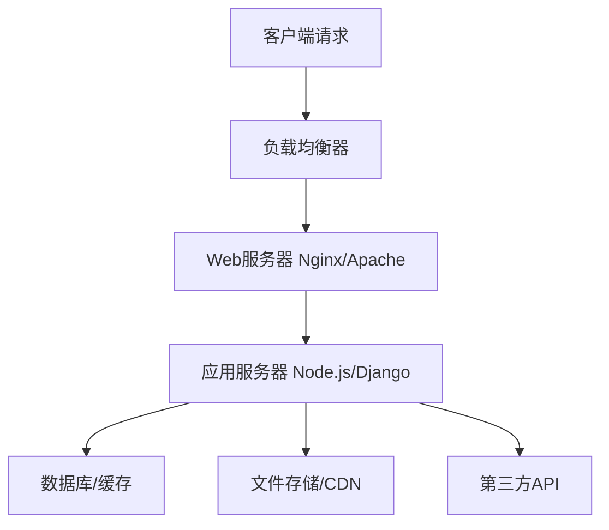
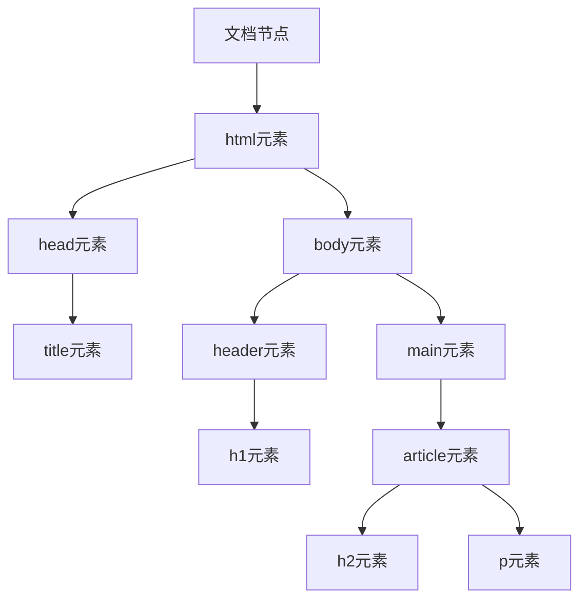

# 从输入URL到新闻页面渲染：一次完整HTTP请求的技术流程


### 2.3 建立网络连接


## 3. HTTP请求构建与发送

### 3.1 HTTP请求报文结构
```http
GET /headlines/2024?category=politics HTTP/1.1
Host: news.example.com
User-Agent: Mozilla/5.0 (Windows NT 10.0; Win64; x64) AppleWebKit/537.36
Accept: text/html,application/xhtml+xml,application/xml;q=0.9,image/webp,*/*;q=0.8
Accept-Encoding: gzip, deflate, br
Accept-Language: zh-CN,zh;q=0.9,en;q=0.8
Connection: keep-alive
Upgrade-Insecure-Requests: 1
Sec-Fetch-Dest: document
Sec-Fetch-Mode: navigate
Sec-Fetch-Site: none
Cache-Control: max-age=0
Cookie: session_id=abc123; user_pref=dark_mode
```

**请求行关键组件**：
- **方法**：GET/POST/PUT/DELETE等
- **URI**：统一资源标识符
- **HTTP版本**：1.1或2.0/3.0

**重要请求头**：
| 头部字段 | 说明 | 示例值 |
|---------|------|--------|
| `Host` | 虚拟主机标识 | `news.example.com` |
| `User-Agent` | 客户端信息 | 浏览器/操作系统详情 |
| `Accept` | 可接受的响应类型 | `text/html` |
| `Accept-Encoding` | 压缩算法 | `gzip, deflate, br` |
| `Cookie` | 会话状态 | 身份验证/偏好设置 |
| `Referer` | 来源页面 | 上级页面URL |

### 3.2 HTTP/2与HTTP/3特性
**HTTP/2优化**：
- 二进制分帧
- 多路复用
- 头部压缩（HPACK）
- 服务器推送

**HTTP/3特性**：
- 基于QUIC协议（UDP）
- 内置TLS 1.3
- 零RTT连接恢复
- 改进的拥塞控制

## 4. 服务端处理流程

### 4.1 服务器架构层次


### 4.2 服务器端处理代码示例
```python
# Django视图函数示例
from django.http import HttpResponse
from django.shortcuts import render
from django.views.decorators.cache import cache_page
from news.models import Article

@cache_page(60 * 5)  # 缓存5分钟
def get_headlines(request, year):
    """处理新闻头条请求"""
    # 1. 解析查询参数
    category = request.GET.get('category', 'all')
    page = int(request.GET.get('page', 1))
    
    # 2. 数据库查询
    articles = Article.objects.filter(
        publish_year=year,
        category=category,
        status='published'
    ).select_related('author').prefetch_related('tags')
    
    # 3. 分页处理
    paginator = Paginator(articles, 20)
    page_obj = paginator.get_page(page)
    
    # 4. 构建上下文
    context = {
        'articles': page_obj,
        'category': category,
        'current_year': year,
        'page_title': f'{year}年{category}新闻头条'
    }
    
    # 5. 渲染模板
    return render(request, 'news/headlines.html', context)
```

### 4.3 数据库查询优化
```sql
-- 优化的新闻查询SQL
SELECT 
    a.id, a.title, a.summary, a.publish_time,
    a.author_id, u.username as author_name,
    GROUP_CONCAT(t.name) as tags,
    COUNT(c.id) as comment_count
FROM articles a
LEFT JOIN users u ON a.author_id = u.id
LEFT JOIN article_tags at ON a.id = at.article_id
LEFT JOIN tags t ON at.tag_id = t.id
LEFT JOIN comments c ON a.id = c.article_id
WHERE a.publish_year = 2024
  AND a.category = 'politics'
  AND a.status = 'published'
GROUP BY a.id
ORDER BY a.publish_time DESC
LIMIT 20 OFFSET 0;
```

## 5. HTTP响应构建

### 5.1 响应报文结构
```http
HTTP/1.1 200 OK
Server: nginx/1.18.0
Date: Mon, 15 Jan 2024 10:30:00 GMT
Content-Type: text/html; charset=utf-8
Content-Length: 15678
Connection: keep-alive
Cache-Control: public, max-age=300
ETag: "abc123def456"
Content-Encoding: gzip
Vary: Accept-Encoding
Set-Cookie: session_id=xyz789; Path=/; HttpOnly; Secure; SameSite=Lax
X-Content-Type-Options: nosniff
X-Frame-Options: DENY
Content-Security-Policy: default-src 'self'

<!DOCTYPE html>
<html lang="zh-CN">
<head>
    <meta charset="UTF-8">
    <title>2024年政治新闻头条</title>
    <link rel="stylesheet" href="/static/css/news.css?v=1.2.3">
</head>
<body>
    <!-- 页面内容 -->
</body>
</html>
```

### 5.2 响应状态码分类


### 5.3 缓存控制策略
```http
# 强缓存策略
Cache-Control: public, max-age=3600, s-maxage=7200
Expires: Tue, 16 Jan 2024 10:30:00 GMT

# 协商缓存策略
ETag: "abc123def456"
Last-Modified: Mon, 15 Jan 2024 09:00:00 GMT
```

## 6. 客户端渲染流程

### 6.1 关键渲染路径
```javascript
// 浏览器渲染主流程
1. 接收响应 → 字节流解码
2. HTML解析 → DOM树构建
3. CSS解析 → CSSOM树构建
4. JavaScript执行 → 可能阻塞解析
5. 构建渲染树 → 合并DOM和CSSOM
6. 布局计算 → 计算元素位置大小
7. 绘制 → 栅格化处理
8. 合成 → 图层合并显示
```

### 6.2 DOM树构建过程
```html
<!-- 原始HTML -->
<!DOCTYPE html>
<html>
<head>
    <title>新闻页面</title>
    <link rel="stylesheet" href="styles.css">
</head>
<body>
    <header class="news-header">
        <h1 id="main-title">今日头条</h1>
    </header>
    <main>
        <article class="news-article">
            <h2>重大新闻标题</h2>
            <p>新闻内容...</p>
        </article>
    </main>
</body>
</html>
```



### 6.3 CSSOM构建与渲染树
```css
/* styles.css */
.news-header {
    background-color: #f8f9fa;
    padding: 20px;
    border-bottom: 2px solid #dee2e6;
}

#main-title {
    color: #007bff;
    font-size: 2rem;
    margin: 0;
}

.news-article {
    max-width: 800px;
    margin: 20px auto;
    line-height: 1.6;
}
```

**渲染树构建**：
1. 从DOM根节点开始遍历
2. 为每个可见节点查找CSS规则
3. 计算最终样式（层叠、继承、优先级）
4. 创建渲染树节点（不包含display:none元素）

### 6.4 JavaScript执行与阻塞
```html
<script>
// 同步脚本 - 阻塞解析
console.log('同步脚本开始执行');
document.addEventListener('DOMContentLoaded', function() {
    console.log('DOM已完全加载');
});

// 获取新闻数据
fetch('/api/latest-news')
    .then(response => response.json())
    .then(data => {
        renderNews(data.articles);
    });
</script>

<!-- 异步加载 -->
<script async src="analytics.js"></script>
<script defer src="news-widget.js"></script>
```

**脚本加载策略对比**：
| 属性 | 解析阻塞 | 执行时机 | 顺序保证 |
|------|----------|----------|----------|
| 无属性 | 是 | 立即 | 按顺序 |
| `async` | 否 | 下载完立即 | 不保证 |
| `defer` | 否 | DOMContentLoaded前 | 按顺序 |

## 7. 资源加载优化

### 7.1 预加载策略
```html
<!-- 预加载关键资源 -->
<link rel="preload" href="critical-font.woff2" as="font" type="font/woff2" crossorigin>
<link rel="preload" href="hero-image.jpg" as="image" imagesrcset="img-480w.jpg 480w, img-800w.jpg 800w">
<link rel="prefetch" href="next-page.html" as="document">

<!-- DNS预连接 -->
<link rel="preconnect" href="https://cdn.example.com">
<link rel="dns-prefetch" href="https://analytics.example.com">
```

### 7.2 图片懒加载
```html

```

```javascript
// 懒加载实现
const lazyImages = document.querySelectorAll('img.lazyload');

const imageObserver = new IntersectionObserver((entries, observer) => {
    entries.forEach(entry => {
        if (entry.isIntersecting) {
            const img = entry.target;
            img.src = img.dataset.src;
            img.classList.remove('lazyload');
            observer.unobserve(img);
        }
    });
});

lazyImages.forEach(img => imageObserver.observe(img));
```

## 8. 性能监控与优化

### 8.1 Web性能指标
```javascript
// 使用Performance API监控
const perfData = window.performance.timing;

// 关键性能指标
const metrics = {
    // DNS查询耗时
    dnsLookup: perfData.domainLookupEnd - perfData.domainLookupStart,
    
    // TCP连接耗时
    tcpConnect: perfData.connectEnd - perfData.connectStart,
    
    // 请求响应时间
    requestResponse: perfData.responseEnd - perfData.requestStart,
    
    // DOM加载时间
    domReady: perfData.domContentLoadedEventEnd - perfData.navigationStart,
    
    // 页面完全加载
    pageLoad: perfData.loadEventEnd - perfData.navigationStart,
    
    // 首次内容绘制
    getFCP: () => {
        const paintEntries = performance.getEntriesByType('paint');
        const fcp = paintEntries.find(entry => entry.name === 'first-contentful-paint');
        return fcp ? fcp.startTime : null;
    }
};
```

### 8.2 优化建议
1. **减少HTTP请求**：合并CSS/JS，使用雪碧图
2. **启用压缩**：Gzip/Brotli压缩
3. **使用CDN**：地理分布的内容分发
4. **浏览器缓存**：合理设置Cache-Control
5. **代码分割**：按需加载JavaScript
6. **图片优化**：WebP格式，响应式图片
7. **最小化主线程工作**：Web Worker处理复杂计算

## 9. 安全考虑

### 9.1 安全头部配置
```http
# 建议的安全头部
Content-Security-Policy: default-src 'self'; script-src 'self' trusted-cdn.com;
X-Content-Type-Options: nosniff
X-Frame-Options: DENY
X-XSS-Protection: 1; mode=block
Referrer-Policy: strict-origin-when-cross-origin
Permissions-Policy: geolocation=(), camera=(), microphone=()
Strict-Transport-Security: max-age=31536000; includeSubDomains
```

### 9.2 防止常见攻击
- **XSS**：输入转义，CSP策略
- **CSRF**：SameSite Cookie，Token验证
- **点击劫持**：X-Frame-Options
- **信息泄露**：移除Server头部信息
- **中间人攻击**：强制HTTPS，HSTS

## 10. 现代Web开发趋势

### 10.1 渐进式Web应用（PWA）
```javascript
// Service Worker注册
if ('serviceWorker' in navigator) {
    navigator.serviceWorker.register('/sw.js')
        .then(registration => {
            console.log('SW注册成功:', registration);
        });
}

// 添加到主屏幕
window.addEventListener('beforeinstallprompt', (e) => {
    e.preventDefault();
    deferredPrompt = e;
    showInstallPromotion();
});
```

### 10.2 服务端渲染（SSR）与静态生成
```javascript
// Next.js示例
export async function getServerSideProps(context) {
    const res = await fetch(`https://api.example.com/news`);
    const news = await res.json();
    
    return {
        props: { news }, // 将作为页面组件的props
    };
}

export default function NewsPage({ news }) {
    return (
        <div>
            <h1>最新新闻</h1>
            {news.map(item => (
                <article key={item.id}>
                    <h2>{item.title}</h2>
                    <p>{item.content}</p>
                </article>
            ))}
        </div>
    );
}
```

## 11. 总结

一次完整的新闻网站访问涉及数十个技术环节，从底层的网络协议到顶层的应用渲染。理解这个完整流程对于：

1. **前端开发**：优化加载性能，改善用户体验
2. **后端开发**：设计高效API，合理缓存策略
3. **运维工程**：监控系统性能，快速排查问题
4. **网络安全**：实施防护措施，保护用户数据
5. **产品设计**：基于技术限制做出合理决策

随着Web技术的发展，新的优化手段和最佳实践不断涌现，但理解这些基础原理仍然是构建高性能、高可用Web应用的关键。