# 学习的七大原则
#### 目录介绍
- [1.看过就以为做到](#1看过就以为做到)
- [2.真正实现的目标](#2真正实现的目标)
- [3.方法论而非招数](#3方法论而非招数)
- [4.学习要趁热打铁](#4学习要趁热打铁)
- [5.布置作业要实践](#5布置作业要实践)
- [6.走出自己舒适圈](#6走出自己舒适圈)
- [7.不妄想立即改变](#7不妄想立即改变)
- [8.学习根源框架图](#8学习根源框架图)
- [9.今天起改变三点](#9今天起改变三点)
- [10.课后作业思考下](#10课后作业思考下)

## 学习的七大原则

1. **认知转变**：从"看过"到"做到"的思维转换
2. **目标明确**：设定真正可实现的学习目标
3. **方法论导向**：掌握背后的理论体系而非表面招式
4. **立即行动**：趁热打铁，避免拖延
5. **实践驱动**：通过作业和实践加深理解
6. **挑战自我**：主动走出舒适圈
7. **长期视角**：避免妄想立即改变的幻想

## 1.看过就以为做到

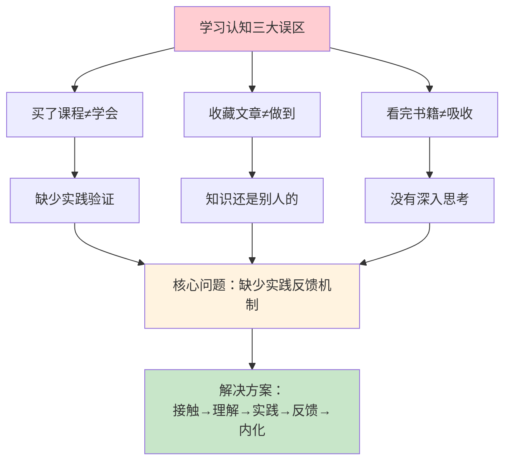

### 1.1 三大学习认知误区

网络课程我买了。**但是买了课程不等于学会**。就像你以为学习课程懂了，但一实践或者讨论，又经不起推敲。

文章我都收藏了。**但是收藏不等于做到**。就像你学完的内容，这些知识还是别人的，不是你的。当学完后，这份学习的责任就递交给你了。

书籍我都看完了。**但是看完不等于吸收**。就像你读完的内容，如果不去思考和没有自己的见解或感受。当过段时间，许多知识点也就忘记了。

### 1.2 知识内化的条件

什么时候才会真正的内化？首先需要实践，并从中得到反馈，经过这样的一个过程，才能把知识真正地内化。**很多时候，缺少了实践反馈机制**。

如何帮助你学得更好，在进行这次课程准备的时候，曾问自己：现在不缺知识，不缺信息吧？答案是肯定的，每天新闻，书籍，博客等都是那么多。

为什么大家会花时间来学习这样一个系列课呢？后来我找到了答案——需要给大家更多的附加值。**这个附加值不应该只是知识，而是怎么更有效地学习和输出**。

### 1.3 从知道到做到的路径

从"知道"到"做到"之间，有一条清晰的路径。很多人之所以停留在"知道"的阶段，是因为跳过了中间几个关键步骤：

| 阶段 | 状态 | 关键动作 | 常见障碍 |
|------|------|----------|----------|
| **知道** | 接触了信息 | 阅读、听课 | 停留在此阶段 |
| **理解** | 能复述内容 | 思考、提问 | 只是表面理解 |
| **应用** | 能解决问题 | 实践、练习 | 不愿动手 |
| **内化** | 成为习惯 | 反复实践、反思 | 缺乏持续性 |

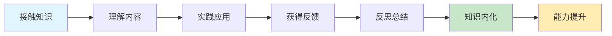

## 2.真正实现的目标

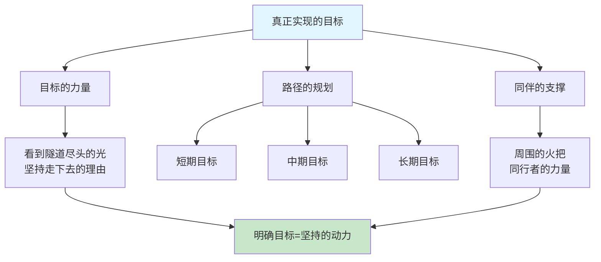

### 2.1 目标是坚持的理由

很多时候学习东西，看到前方漆黑一片，你不知道自己走得对不对，不知道这么走下去到底有没有效果，会不会浪费时间。

所以，学习路径——真正可以实现的目标，就显得特别重要。一旦能够看到隧道尽头有那么一丝光，你就会告诉自己："尽管辛苦，但会走到底，因为看到了那个目标。"

### 2.2 同伴的力量

如果正好周围有一个火把，你就会觉得："不是我一个人这么走，原来有那么多伙伴一起走！"你也会告诉自己："我是对的，我会坚持走！"但是很多时候，我们缺乏这样一个火把。

**学习从来不是一个人的事**。找到和你有相同目标的人，组成学习小组，定期交流进度和心得。这种社交学习不仅能提供情感支撑，还能让你从不同视角理解知识。

### 2.3 如何设定好目标

所以，这是第一点想要分享给大家的：**大家要搞清楚真正要实现的目标是什么，这是让我们坚持下去的理由**。

好目标有三个特征：**可描述、可衡量、有时限**。"我想变得更好"不是好目标；"我要在3个月内读完6本专业书并输出读书笔记"才是好目标。好目标像一个明确的GPS坐标，而不是一个模糊的方向。

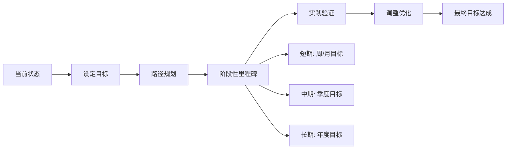

## 3.方法论而非招数

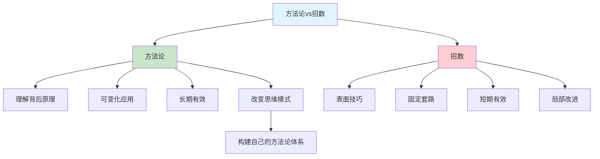

### 3.1 方法论与招数的本质区别

要思考为什么要这么做，这背后支撑的理论体系是什么？如果你把这两个问题想透，我们每个人都可以掌握各种可变化的招式，来帮助自己更好地成长。

甚至这也能成为改变我们本身思维模式的契机。**很多时候我们焦虑、紧张，觉得好像学习没有效果，更多的是因为没有掌握方法论，只是在学简单的招式**。

| 维度 | 方法论 | 招数 |
|------|--------|------|
| **深度** | 理解背后原理 | 表面技巧 |
| **适用性** | 可变化应用 | 固定套路 |
| **持续性** | 长期有效 | 短期有效 |
| **思维影响** | 改变思维模式 | 局部改进 |
| **迁移能力** | 可跨领域使用 | 仅限特定场景 |

### 3.2 如何构建方法论

方法论不是凭空产生的，它来自于对大量实践经验的**归纳、提炼和验证**。构建方法论有三个步骤：

1. **观察规律**：在反复做同一类事情的过程中，发现哪些做法总是有效的，哪些总是无效的
2. **提炼原则**：把有效的做法抽象成可复用的原则和框架
3. **验证迭代**：在新的场景中应用这些原则，根据结果不断优化

### 3.3 方法论的四大支柱

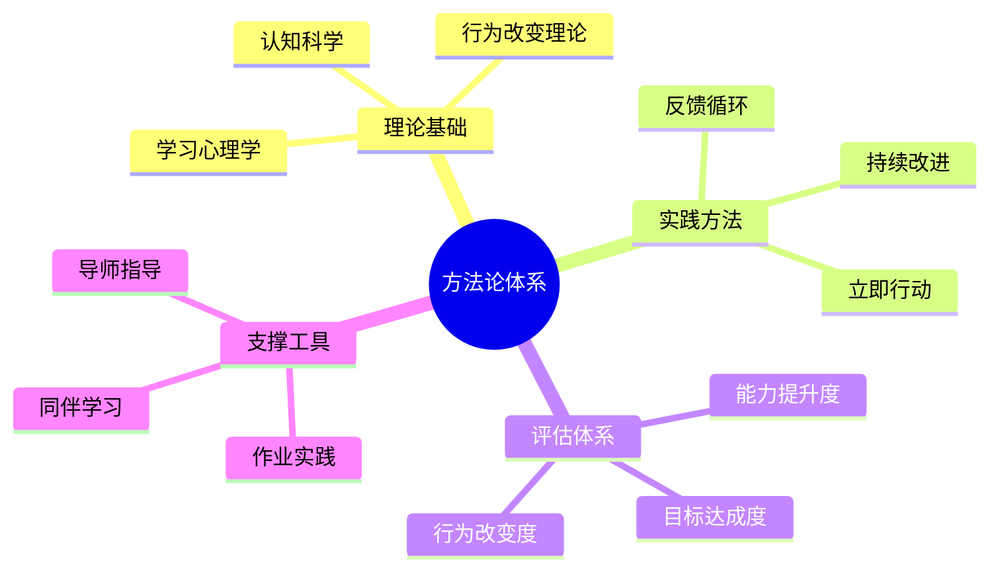

掌握方法论的人，面对新问题时不会慌，因为他有一套分析和解决问题的框架。而只会招数的人，一旦遇到没见过的情况就手足无措。**方法论是你的操作系统，招数只是应用程序——应用可以换，但操作系统必须稳定强大**。

## 4.学习要趁热打铁

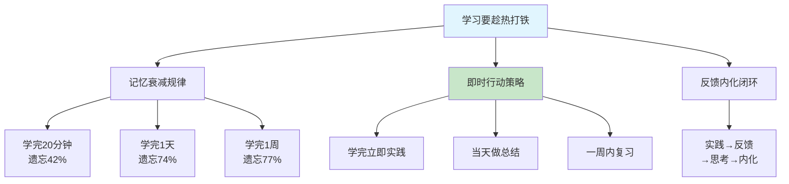

### 4.1 艾宾浩斯遗忘曲线

学完这一章，可以改变的事情是什么，从明天开始，马上、立刻行动起来，打铁要趁热。很多人学完后，说："等我以后有空了再复习，先收藏。"

这样就没用了，因为记忆曲线马上就会下降。德国心理学家艾宾浩斯发现，**人在学习后的20分钟内就会遗忘42%的内容，1天后遗忘74%，一周后遗忘77%**。也就是说，如果你学完不立即行动，一周后大部分内容已经从你脑中消失了。

### 4.2 立即行动的三个层次

如果你立刻行动起来，立刻去实践，马上就会得到反馈；一有反馈，我们就会思考；有了思考，再回去重温，这时候知识就容易内化了。

立即行动可以分为三个层次：

| 层次 | 时间窗口 | 具体行动 | 效果 |
|------|----------|----------|------|
| **第一层** | 学完5分钟内 | 用自己的话复述核心观点 | 初步理解 |
| **第二层** | 学完当天内 | 写一段总结或做一个小练习 | 加深记忆 |
| **第三层** | 学完一周内 | 在实际场景中应用所学 | 真正内化 |

### 4.3 反馈内化闭环

"趁热打铁"不是蛮干，而是一个完整的闭环：**实践→反馈→思考→重温→内化**。每一次实践都会暴露你理解不到位的地方，每一次反馈都会让你重新审视知识的细节，每一次思考都会加深你对底层逻辑的理解。这个循环转得越快，知识内化的速度就越快。

## 5.布置作业要实践

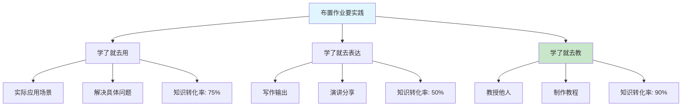

### 5.1 作业驱动学习

布置作业。一旦有了作业，就会督促我们更好地去思考、去反思。现在的慢，才是将来的快。

想一想读书的时候，为什么学习的知识点很熟悉，那是因为课前预习，课后演练，这样可以让学习的东西印象更加深刻。**作业的本质不是负担，而是一种强制性的实践反馈机制**。

### 5.2 实践的三种方式

那么作业一般怎么实践呢？**要么学了就去用；要么学了就去表达；要么学了就去教**。在实践的过程中，我们将对学习的知识点印象更加深刻。

美国学者埃德加·戴尔提出的"学习金字塔"理论告诉我们，不同的学习方式有着截然不同的知识留存率：

| 实践方式 | 具体做法 | 知识留存率 | 难度 |
|----------|----------|------------|------|
| **学了就去用** | 在实际项目中应用所学知识 | 约75% | ★★★ |
| **学了就去表达** | 写博客、做笔记、朋友圈分享 | 约50% | ★★ |
| **学了就去教** | 教授他人、制作教程、做培训 | 约90% | ★★★★ |

### 5.3 从消费者到创造者

很多人的学习方式一直停留在"消费模式"——看书、听课、刷视频，本质上都是输入。而真正高效的学习者，早已切换到了"创造模式"——写文章、做分享、教别人。**从被动接收到主动输出，这个转变是学习效率质变的关键分水岭**。

每次学完一个知识点，逼自己用其中一种方式输出。刚开始可能觉得吃力，但坚持一个月后你会发现，你的理解力、表达力和记忆力都会显著提升。

## 6.走出自己舒适圈

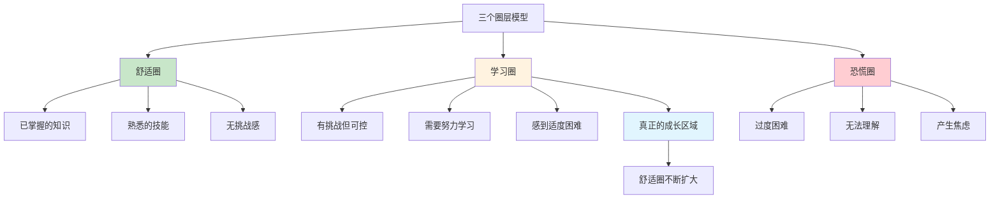

### 6.1 舒适圈的陷阱

学习的本质就是难的，因为只有发现难，你才会觉得离开了自己的舒适圈。如果不难，说来说去都是你懂的东西，那就是无效学习。

**舒适圈最大的陷阱在于：它给你一种"我在学习"的错觉**。比如你已经很熟悉Java了，每天刷Java基础教程，看似在学习，其实只是在舒适圈里打转。真正的学习发生在你去研究JVM源码、去啃并发编程原理的时候——那些让你觉得"有点难"的地方。

### 6.2 学习区才是成长区

心理学家利夫·维果茨基提出了"最近发展区"理论：**真正有效的学习发生在"你现在做不到，但在稍加努力和引导下可以做到"的区域**。这就是学习区。

如何判断自己是否在学习区？有一个简单的标准：

- 如果学习过程中**完全没有困难感**——你在舒适圈，需要提高难度
- 如果学习过程中**有适度的挑战感**——你在学习区，继续保持
- 如果学习过程中**完全无法理解**——你在恐慌区，需要降低难度

### 6.3 刻意练习走出舒适圈

每一次觉得难时，你才知道，时间没白花。但不要怕，因为实践：通过方法论、立刻行动的要点、作业打卡、学习路径等，来帮助大家不断地去实践。不要怕学习难，就怕你没有开始的勇气。

走出舒适圈不是一蹴而就的，而是需要"刻意练习"——**有针对性地选择略高于自己当前水平的挑战，在挑战中获得反馈，在反馈中不断调整**。每次完成一个挑战，你的舒适圈就扩大了一圈，之前觉得难的东西就变得容易了。

## 7.不妄想立即改变

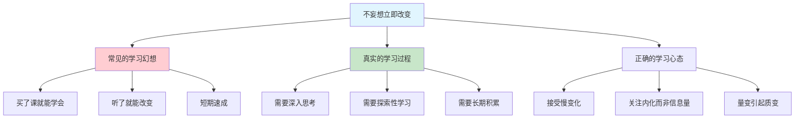

### 7.1 速成心态的危害

我们会学习很多课程，有些人花了钱购买了某课程，然后学习了一段时间发现没有多大的效果，于是便开始吐槽，后面导致许多人加入口水战之中。

不得不说，妄想通过一系列课程就改变生活本质的人，如果听听课程或者学习下就能获取成功或者有好结果，这简直就是幻想……

**速成心态的核心问题在于：把"知道"等同于"做到"，把"接触"等同于"掌握"**。事实上，从知道到做到，中间隔着大量的实践、反思和迭代。这个过程没有捷径，急不来。

### 7.2 深入思考才能质变

对于许多优质课程，大牛们提供的知识，或者理论分析工具，或者得出的结论，或者对未来作出的预测，那许多的东西都是经过加工，然后不断精细化的产物，倘若你不深入思考或者探索性学习，也是很难发生质变的。

存在的问题主要有：无法追查问题根源，信息与思维的时效性。**重要的不是你看到或者听到了多少东西，重要的是你内化了多少东西**。重要的是你把学到的东西内化成自己的，这个是学习的终极目标。

### 7.3 拥抱长期主义

学习是一场马拉松，不是短跑冲刺。**真正的改变是在日积月累中悄然发生的**——今天比昨天多理解了一个概念，这周比上周多解决了一个问题，这个月比上个月多掌握了一项技能。

不要期望学了一门课就脱胎换骨，要期望自己每天进步1%。1%看起来微不足道，但一年下来就是37倍的提升。接受慢变化，拥抱长期主义，这才是学习最强大的力量。

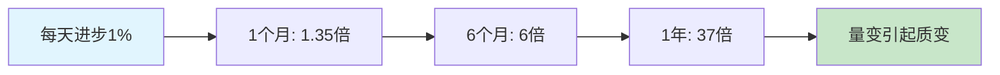

## 8.学习根源框架图

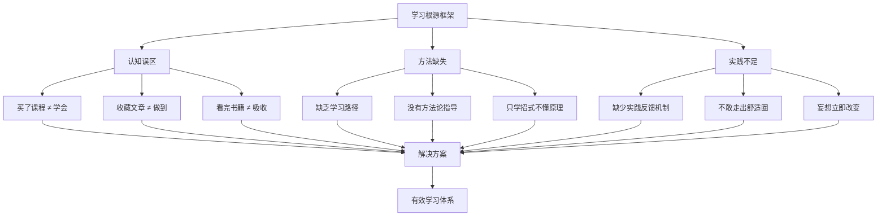

## 9.有效学习时序图

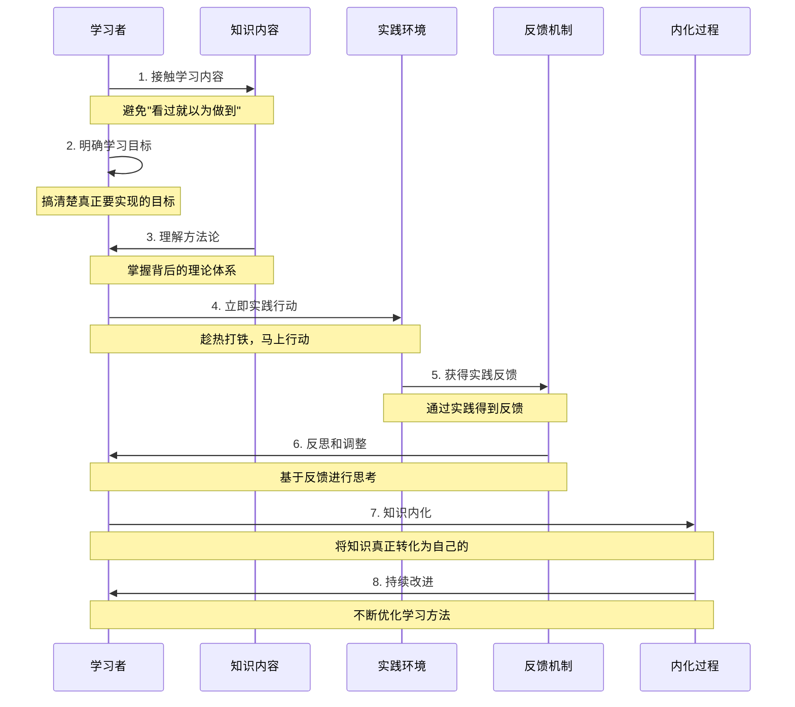

## 9.今天起改变三点

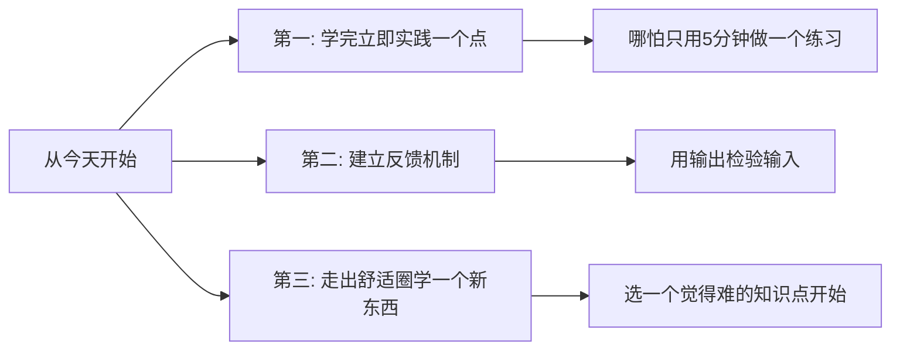

**第一，学完任何内容后，立即实践其中一个点。** 不要说"等我有空再复习"，那基本等于不会再看。从今天起，每次学完一个知识点，立即花5分钟做一个小练习或写一段总结。哪怕只是用自己的话复述一遍核心观点，也比纯粹收藏有效100倍。

**第二，为自己建立一个反馈机制。** 最简单的反馈机制就是"输出"。学完一个东西，试着讲给别人听，或者写一段文字发到朋友圈、博客、笔记本上。如果你讲不清楚、写不出来，说明你还没真正理解。这个过程本身就是最好的反馈。

**第三，主动选择一个让你觉得"有点难"的知识点来学习。** 如果你学的东西都觉得很轻松，说明你一直在舒适圈里打转。真正的成长发生在"学习区"——那个让你觉得有挑战但又不至于完全懵的地方。今天就挑一个这样的知识点开始。

## 10.课后作业思考下

1. 审视你过去一个月的学习行为：你买了几门课程？收藏了几篇文章？其中真正实践过的有几个？算一下你的"学习转化率"（实践数/学习数），这个数字让你满意吗？
2. 用一句话写下你当前最重要的学习目标。如果写不出来，说明你的目标还不够明确——花15分钟认真想一想，然后写下来贴在桌面上。
3. 选择本章提到的七大原则中，你做得最差的一条，制定一个为期一周的改进计划。一周后回顾效果。
4. 找一个你最近学完但还没实践过的知识点，今天就用"学了就去用/就去表达/就去教"三种方式中的一种来实践它。

