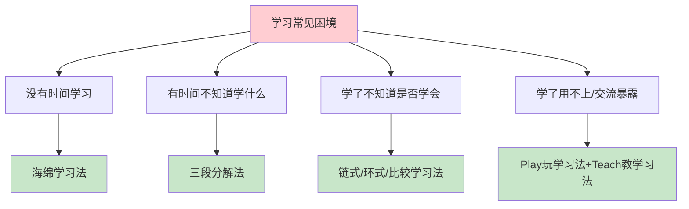
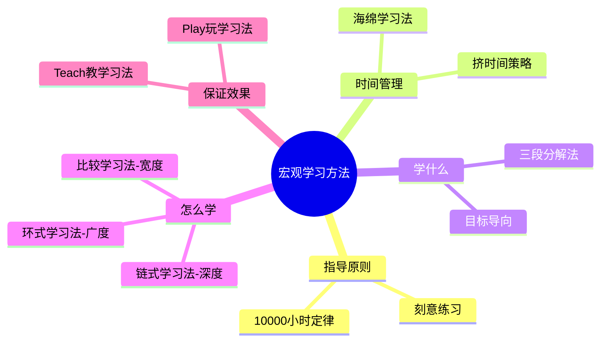
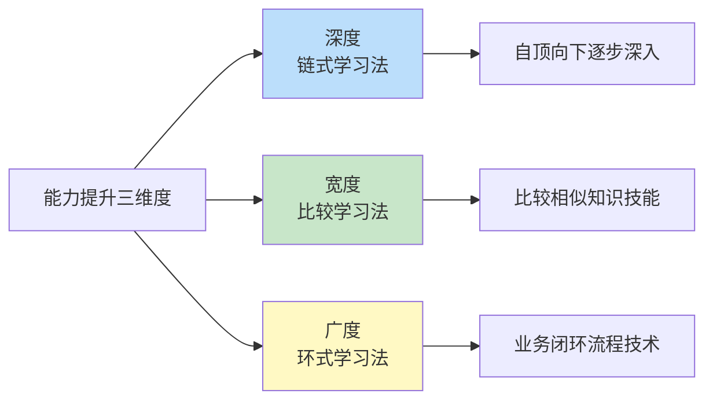
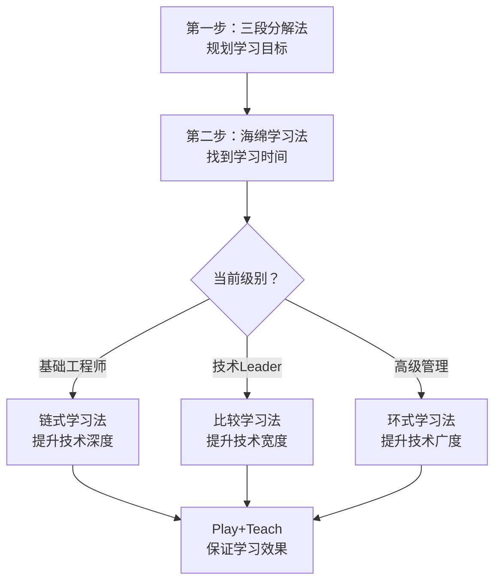
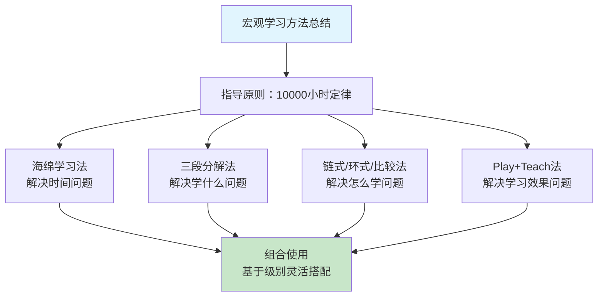
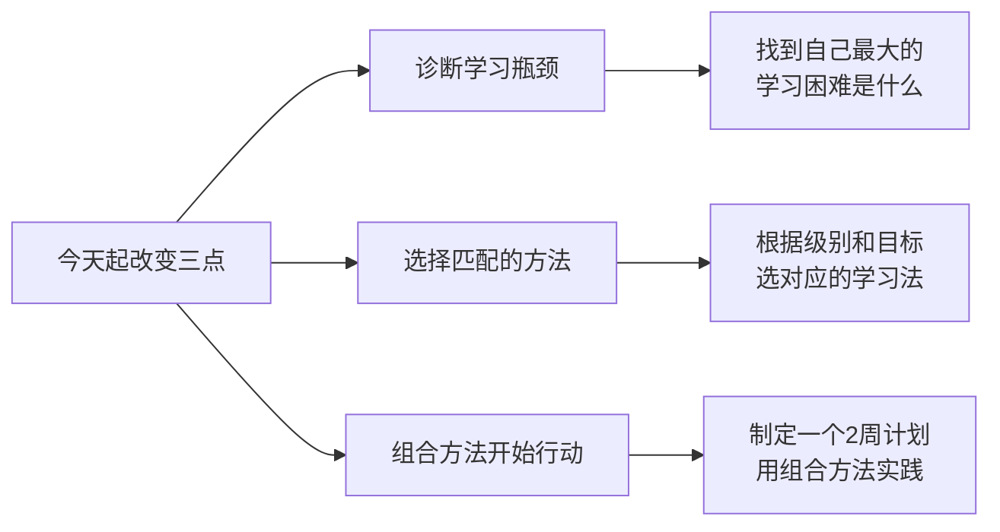

# 3.1宏观学习的方法
#### 目录介绍
- [01.先来说一个场景](#01先来说一个场景)
- [02.宏观指导的原则](#02宏观指导的原则)
- [03.用海绵法找时间](#03用海绵法找时间)
- [04.学什么三段分解](#04学什么三段分解)
- [05.链式和环式思考](#05链式和环式思考)
- [06.玩和教保证效果](#06玩和教保证效果)
- [07.学习方法论沉淀](#07学习方法论沉淀)
- [08.组合地灵活使用](#08组合地灵活使用)
- [09.总结和梳理一下](#09总结和梳理一下)
- [10.思考题要做一下](#10思考题要做一下)
- [11.今天起改变三点](#11今天起改变三点)
- [12.课后作业思考下](#12课后作业思考下)

## 01.先来说一个场景

### 1.1 学习的四大困境

不知道你有没有这样的感受：上班累得要死，还要陪家人，还有群里各种吃瓜，看剧，根本就没什么时间学习；等到哪天有点空余时间，又因为没有计划，只能随便找本书或者上网学习看看。

就算知道要针对某个技能专门提升一下，也不知道怎么学才能达到精通水平；过段时间回头一看，前几周学的东西又忘得差不多了；跟别人交流一下子就暴露了水平……

**根据上面的例子，小杨大概拆分成几个问题**：

| 困境编号 | 困境描述 | 对应解法 |
|---------|---------|---------|
| 困境一 | 没有时间去学习 | 海绵学习法 |
| 困境二 | 有了空闲时间不知道怎么安排 | 三段分解法 |
| 困境三 | 即使学习了后不知道是否学会 | 链式/环式/比较学习法 |
| 困境四 | 感觉学到了但一旦交流或使用就不会 | Play玩学习法+Teach教学习法 |

### 1.2 为什么需要系统方法

很多人的学习都是零散的、随机的——想到什么学什么，看到什么追什么。这种方式在短期内可能有些效果，但长期来看效率很低。

**建立一套系统的学习机制很关键**，或者写，或者做，或者计划，或者跟小伙伴交流。只有把学习变成一个有目标、有方法、有反馈的系统，才能真正实现持续成长。下面会逐一说到这些方法的具体内容……

## 02.宏观指导的原则

### 2.1 五个关键问题

一套系统的学习方法，既需要一个统领全局的宏观指导原则，让人能够一目了然地理解它的核心内容，同时也要能够回答以下五个关键问题，小杨总结如下：

| 关键问题 | 核心要点 | 对应方法 |
|---------|---------|---------|
| 刻意练习 | 信息太多，如何保证有效学习并学以致用 | 10000小时定律 |
| 时间从哪里来 | 没有时间投入，再好的理论也是纸上谈兵 | 海绵学习法 |
| 学什么 | 找到正确方向，明确目标，有的放矢 | 三段分解法 |
| 怎么学 | 不同目的应有不同方法，保证投入产出比 | 链式/比较/环式学习法 |
| 怎么保证效果 | 解决"学了用不上、学了就忘"的问题 | Play+Teach学习法 |

### 2.2 方法之间的关系

这五个问题并不是孤立的，而是层层递进、相互支撑的关系。**10000小时定律告诉我们"要投入"，海绵学习法解决"时间哪来"，三段分解法回答"学什么"，三种学习法指导"怎么学"，Play和Teach法保证"学到位"**。它们构成了一个完整的学习闭环，缺一不可。

## 03.用海绵法找时间

### 3.1 10000小时的挑战

总的指导原则是10000小时定律，它是一个很出名的，用于专业领域提升的理论。

有大量的相关资料可以参考（例如《异类》《1万小时天才理论》等），其核心思想是：**如果你想要在专业领域不断提升自己的能力，必须投入足够的时间**。

### 3.2 海绵法的核心思路

10000 小时可不短，相当于平均每天3小时，持续10年时间。平时工作就已经"累成狗"了，可能还有家人需要照顾，怎么才能找到自己的10000小时呢？

**这就要靠海绵学习法。海绵学习法是一个时间管理方法，它可以让你轻松地挤出时间，既不会对工作、家庭和娱乐有明显的影响，又能够兼顾学习**。关键在于"积少成多，聚沙成塔"，每天挤出2-3小时，长期坚持下来效果惊人。

## 04.学什么三段分解

### 4.1 制定学习目标

有了时间之后，我们要学什么呢？怎么才能制定合理的学习目标呢？如何制定可行的学习计划并能够真正落地呢？这就要靠三段分解法。

### 4.2 逐级分解落地

三段分解法是制定学习目标和计划的方法，它基于职业等级体系，将10000小时逐级分解，最终落实到可以实施的各项学习行动。

**三段分解的核心逻辑是：大目标→中目标→小行动**。先把10年的宏大目标分解为2-3年的等级目标，再把等级目标分解为6个月的技能目标，最后把技能目标分解为1-2个月的具体行动。每完成一个阶段都能获得正反馈，形成持续学习的动力。

## 05.链式和环式思考

确定目标和计划后，我们具体要怎么提升能力呢？能力可以拆解成三个维度：深度、宽度和广度。针对能力的不同维度，有3个不同的学习方法：

**链式学习法**适合提升深度，通过自顶向下逐步深入的方式，将关联技术逐一掌握。

**比较学习法**适合提升技术宽度，通过比较相似的知识或者技能，全面掌握单个领域的技术。

**环式学习法**适合提升技术广度，通过学习业务闭环流程中相关技术，全面掌握多个领域的技术。

## 06.玩和教保证效果

### 6.1 两个常见困难

就算用对了方法，在学习过程中还是会遇到一些难以解决的困难，这些困难会导致我们学习效果不好。

**第一个常见困难是，如果平时不学，真正要用的时候又来不及临时学；但如果平时学了，可能要等很久才能在工作找到的实践机会，到时候技术可能都生疏了**。

**第二个常见的困难是，学完之后感觉学得不深，跟别人讨论的时候，或者在晋升答辩环节被问到的时候，就发现很多东西明明学过，却说不出个所以然来**。

### 6.2 Play和Teach两种解法

针对这两个常见影响学习效果的问题，小杨通过学习和实践，归纳提炼出如下两种学习方法：

| 方法 | 解决的问题 | 核心思路 | 操作方式 |
|-----|-----------|---------|---------|
| Play——玩学习法 | 工作中暂时没有实践机会 | 学以致"玩" | 通过模拟场景来应用所学 |
| Teach——教学习法 | 学得不深、理解不透 | 教学相长 | 通过写作和培训来加深理解 |

## 07.学习方法论沉淀

### 7.1 三步学习法

通过三步学习法规划，第一步制定目标；第二步实践学习；第三步运用输出。**它是一个从目标设定到学习执行再到成果输出的完整闭环**。

### 7.2 极简学习法

通过极简学习法实践，极简学习法作为一种高效的学习方法，通过精简资源、时间和学习材料，帮助我们更专注于最重要的概念和技能，从而实现用最小的投入获取最大的学习收益。**核心理念是"少即是多"，去掉噪音，聚焦本质**。

### 7.3 费曼学习法

通过费曼学习法输出，费曼学习法就是一个操作简单，并且具有普适性的方法，它只有四个步骤：假装讲给孩子听、复习卡住的地方、整理并简化笔记、讲给别人听至懂。**如果你能用大白话给一个12岁孩子讲清楚，就说明你真正理解了**。

## 08.组合地灵活使用

### 8.1 三步组合策略

这些学习方法是相辅相成的，你可以根据你当前的级别和实际工作内容，把它们组合起来使用，具体的方式如下：

**第一步，无论你当前是什么级别，先用"三段分解法"来规划你的学习目标和计划**。

**第二步，使用"海绵学习法"来找到你可以用于学习的时间**。

**第三步，根据学习目标采取相应的学习方法**。

### 8.2 根据级别匹配方法

| 你的级别 | 推荐学习法 | 提升维度 | 具体做法 |
|---------|-----------|---------|---------|
| 基础工程师 | 链式学习法 | 技术深度 | 学习某技术自顶向下逐步深入 |
| 技术Leader | 比较学习法 | 技术宽度 | 横向比较同领域的不同技术方案 |
| 高级管理 | 环式学习法 | 技术广度 | 学习跨领域的技能形成闭环 |
| 吃瓜群众 | 灵活组合 | 综合能力 | 任何场景都可以用方法论提升能力 |

如果你是吃瓜群众，你当然也可以采用该方法，了解该吃什么瓜，怎么吃，如何收集信息，如何发表自己观点等等，照样可以提高吃瓜能力。

## 09.总结和梳理一下

### 9.1 核心要点回顾

总结一下这一讲的重点内容：一套系统的学习方法，既需要一个总的指导原则，也需要回答 4 个关键问题：时间从哪里来？学什么？怎么学？怎么保证效果？

在总结的这套学习方法中，10000小时定律提供了指导原则：

1. 海绵学习法解决了时间从哪里来的问题；
2. 三段分解法解决了学什么的问题；
3. 链式、环式和比较学习法解决了怎么学的问题；
4. Play 和 Teach 学习法解决了怎么保证学习效果的问题。

**学习方法是相辅相成的，你需要基于当前的级别和工作内容，把多个方法组合起来使用。不要只用一种方法，也不要贪多用所有方法，找到最适合自己当前阶段的组合才是关键**。

## 10.思考题要做一下

你在学习过程中遇到的最大困难或者困惑是什么？你尝试了什么解决方法呢，效果怎么样？

## 11.今天起改变三点

**第一点：诊断你当前的学习瓶颈**。今天就花15分钟想清楚：你学习最大的困难是什么？是没时间（用海绵法）？不知道学什么（用三段分解法）？还是学了就忘（用Play和Teach法）？精准诊断问题，才能对症下药。把你的核心痛点写在纸上，这是解决问题的第一步。

**第二点：根据你的级别选择匹配的学习方法**。如果你是基础工程师，重点用链式学习法提升技术深度；如果你是技术leader，用比较学习法拓展技术宽度；如果你想全面发展，用环式学习法培养全局视野。不要贪多，先选一种最适合你当前阶段的方法，专注使用2-3个月。

**第三点：制定一个具体的2周学习计划**。把上面的方法和你的目标结合起来，制定一个可执行的2周计划。具体到每天学什么、怎么学、花多少时间。2周后回顾效果，调整方法和计划。记住：学习方法是相辅相成的，需要基于实际情况灵活组合使用。

## 12.课后作业思考下

**1. 学习困境诊断**：对照文中提到的四个关键问题（时间从哪里来？学什么？怎么学？怎么保证效果？），评估你在哪个环节最薄弱。针对这个最薄弱的环节，选择对应的学习方法，制定一个改善计划。

**2. 方法匹配测试**：根据你当前的职业级别（初级/中级/高级/专家），选择文中推荐的对应学习方法。用这个方法学习一个你正在提升的技能，2周后评估效果。如果效果不理想，分析是方法选错了还是执行不到位。

**3. 学习效率审计**：统计你上周用于学习的总时间，然后评估这些时间的有效利用率——有多少时间是真正在"刻意练习"？有多少时间只是"假装学习"？思考如何提高学习时间的质量而非仅仅增加数量。

**4. 组合方法实验**：选择两种学习方法进行组合（比如海绵法+链式学习法），针对一个具体技能点进行为期一个月的学习实验。记录过程和效果，月底评估组合使用的效果是否好于单一方法。

