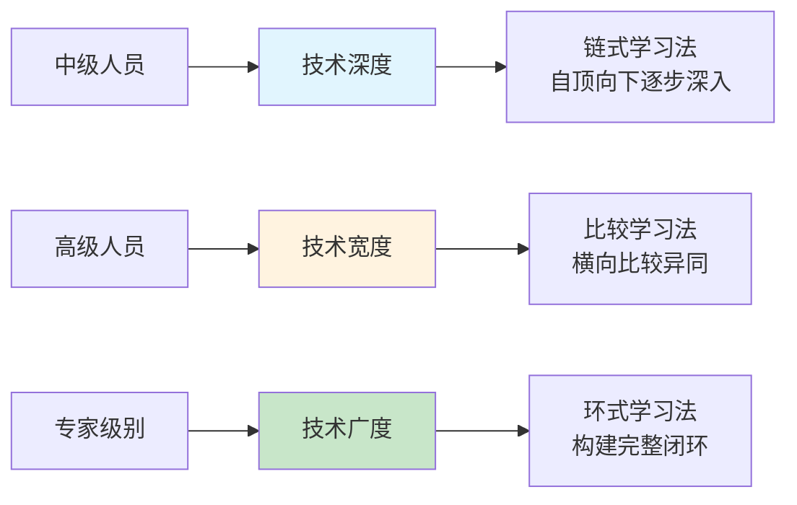
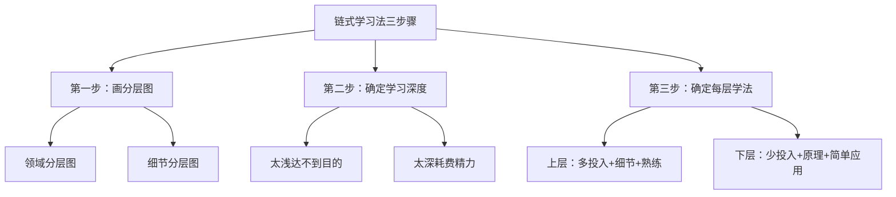
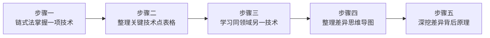
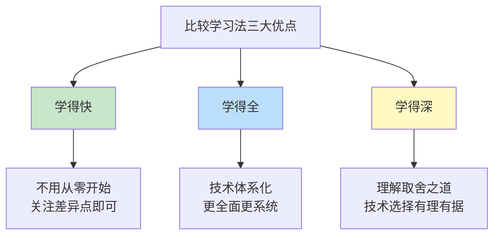
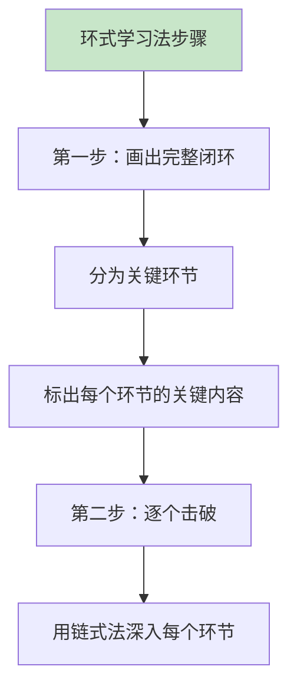
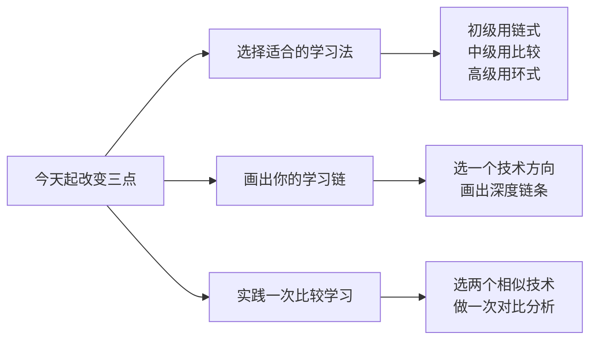

# 3.4链式和环式思考
#### 目录介绍
- [01.让学习有针对性](#01让学习有针对性)
- [02.链式学习法介绍](#02链式学习法介绍)
- [03.链式学习法步骤](#03链式学习法步骤)
- [04.链式学习法优点](#04链式学习法优点)
- [05.比较学习法介绍](#05比较学习法介绍)
- [06.比较学习法步骤](#06比较学习法步骤)
- [07.比较学习法优点](#07比较学习法优点)
- [08.环式学习法介绍](#08环式学习法介绍)
- [09.环式学习法步骤](#09环式学习法步骤)
- [10.环式学习法优点](#10环式学习法优点)
- [11.今天起改变三点](#11今天起改变三点)
- [12.课后作业思考下](#12课后作业思考下)

## 01.让学习有针对性

### 1.1 不同级别的提升方向

一般来说，中级人员主要提升技术深度，高级主要提升技术宽度，专家级主要提升技术广度。

| 级别 | 提升维度 | 推荐学习法 | 核心目标 |
|-----|---------|-----------|---------|
| 中级人员 | 技术深度 | 链式学习法 | 在一个方向上打透，达到精通 |
| 高级人员 | 技术宽度 | 比较学习法 | 掌握同领域多种技术的异同 |
| 专家级别 | 技术广度 | 环式学习法 | 构建跨领域的完整技术闭环 |

**关键点在于：不要在错误的阶段追求错误的维度**。初中级就去追求广度，结果什么都会一点但什么都不精；高级还在埋头钻深度，却忽略了横向对比和全局视野。

## 02.链式学习法介绍

### 2.1 什么是链式学习法

面对"打破砂锅问到底"的方式，如果没有充足的准备，你很可能会卡住。

所谓"链式学习法"，顾名思义，就是学习的过程好像从水里拉起一根链条，拉出一环后面又接着一环，最后将整个链条全部拉出来。**当知识联结成锁链，环环相扣，你对技术的理解就很透彻，别人问到底，你就能答到底**。

### 2.2 两种环环相扣的方式

知识的锁链不是胡乱连接的，环环相扣的方式很有讲究。常见的方式有两种：第一种是自顶向下、层层关联，打通一项技术的领域分层。第二种是由表及里、层层深入，打通一项技术的细节分层。

1. 比如：网络优化，先解析域名，然后建立连接，然后发送请求，然后接受请求，然后解析数据，最后渲染到页面。了解了每一步细节，然后才能知道从哪里优化。 
2. 比如：以网络编程为例，从接口设计，设计原理，设计方案，设计代码等层级去分析学习，也可以打通细节知识点。

## 03.链式学习法步骤

第一步，就是要**明确一项技术的深度可以分为哪些层**。具体来说，就是画出"领域分层图"和"细节分层图"。一开始你可能会觉得画不出来，这恰恰说明你对深度的理解还不够，而尝试画图本身就是一个梳理结构、强化认知的过程。

**第二步就是要明确你自己要学到哪一层**。学得太浅，达不到提升深度的目的；学得太深，又会耗费太多的时间和精力。

**第三步就是要明确每一层应该怎么学**。在领域分层图中，越往上越偏应用，实际工作中用得越多，越往下越偏原理（包括相关的工具和配置），实际工作中用得越少。所以总的原则是，在上层投入更多时间，更关注细节和熟练使用，在下层投入相对少的时间，更加关注原理和简单应用。

## 04.链式学习法优点

### 4.1 促使主动提升

大部分人在实际工作中，很多技术都只接触到了领域分层图和细节分层，没有进一步地去了解。而如果采用链式学习法，你就会意识到，使用一项技术完成了工作，并不意味着你就完全掌握了这项技术。

你还需要把刚刚自己用到的技术作为切入点，画出完整的领域分层图和细节分层图，然后逐一攻破，这样才能提升深度，达到精通水平。

### 4.2 知识和技能系统化

明确知识和技能点之间的关联关系，有助于更好的理解和应用这些知识和技能。只有使用链式学习法，你才能系统地了解到这些关联的知识和技能，以及如何将它们串起来。

### 4.3 链式学习法小结

链式学习法是让知识形成锁链，环环相扣，主要用来提升技术深度。链式学习法的步骤包括：明确一项技术的深度可以分为哪些层，明确要学到哪一层，明确每一层应该怎么学。链式学习法的优点有：促使我们主动提升，将知识和技能系统化。

## 05.比较学习法介绍

### 5.1 为什么需要技术宽度

提升技术宽度，最好使用比较学习法。举几个简单的例子：为什么发送微信消息要使用TCP协议而不是UDP协议？为什么移动端数据库选择SQLite而不是MySQL？为什么Android进程通信是使用Binder而不是Socket或管道？

这些问题大部分都是考察你思考、判断和决策的逻辑和过程。**如果你只有技术深度而没有技术宽度，这时就会陷入窘境：单个技术细节你都很熟悉，但是却无法解释为什么用这个，而不用那个**。

### 5.2 比较学习法的定义

**所谓比较学习法，就是横向比较同一个领域中类似的技术，梳理它们异同，分析它们各自的优缺点和适用场景**。这种方法能帮助你建立起技术选型的判断力和决策力，而不仅仅是"会用某个技术"。

## 06.比较学习法步骤

比较学习法的具体操作步骤如下：1.先用链式学习法掌握某个领域的一项技术，将这个领域的关键技术点整理成表格；2.基于整理好的技术点，学习这个领域的另一项技术，将它们在技术点上的差异整理成思维导图；3.找出差异较大的技术点，将背后的原理和对应用场景的影响整理成表格。

举个例子：比如发送消息为何TCP而不是UDP？从消息安全性，数据加密，传输速度，数据完整性等维度去比较两者的区别和优劣式。

## 07.比较学习法优点

### 7.1 学得快

同一个领域的技术在功能上大都是类似的，区别往往在于实现方案和细节。所以当你掌握了一项技术之后，再去同一个领域的另一项技术，就不需要从0开始了，因为基础的部分你已经学会了，只要重点关注它们的差异点就能够快速掌握。

### 7.2 学得全

整理关键技术点和制作思维导图的过程，会促使你把一个领域的技术体系化，更全面、更系统地掌握这个领域。

### 7.3 学得深

从差异点到背后的原理再到应用场景的思考过程，会让你对技术的取舍之道理解得更深，在每一次技术选择时都能给出让人信服的理由。

## 08.环式学习法介绍

### 8.1 什么是环式学习法

提升技术广度，最好使用环式学习法。很多人一听要提升广度，就以为学得越多越好，想到什么牛就学什么，看到什么热就追什么。学了一段时间，感觉学了很多，但好像啥也不会，网撒得很广，却没捞到几条鱼。**所谓环式学习法，就是构建一个完整的闭环过程，将多个领域的"鱼"一网打尽**。

### 8.2 多种闭环构建思路

无论什么领域，都可以采用环式学习法来学习跨领域的技术。除了功能环以外，还有很多构建闭环的思路：

| 闭环类型 | 含义 | 举例 |
|---------|------|------|
| 功能环 | 一个功能涉及的所有技术环节 | 用户登录：前端→客户端→网络层→服务端→数据库 |
| 业务环 | 某个业务的完整处理步骤 | 电商下单：浏览→加购→支付→发货→收货 |
| 流程环 | 某件事情的完整处理步骤 | 需求开发：需求评审→设计→开发→测试→上线 |

## 09.环式学习法步骤

### 9.1 画出闭环图

环式学习法的第一步，就是把闭环画出来。具体的画法是将完整的闭环分为几个关键的环节，然后标出每个环节的关键内容。

### 9.2 功能环的实例

就拿"用户登录"这个功能环来说，它可以分为前端、客户端、网络层、机房入口、Nginx、用户中心、安全中心和数据中心，总共8个环节；每个环节又会涉及不同的技术，比如客户端涉及 JsBridge和OkHttp，用户中心涉及微服务、MySQL和Redis等，总共涉及的技术有 18 项。

**通过画出完整闭环，你就能清晰地看到全貌，知道自己在哪些环节上是强项，哪些环节还需要补课**。

## 10.环式学习法优点

### 10.1 培养全局视野

在画出完整闭环的过程中，你可以端到端地了解全流程涉及哪些系统或者模块，每个模块的关键技术是什么，从而培养出全局的视野和能力。

### 10.2 广撒网却捞不到鱼

环式学习法划定的范围是实际工作的闭环，能够形成一套有效的组合拳，而不是东一榔头西一棒槌的胡乱搭配，能够大大提升学习效率。所以你只要对照环来提升就可以了，不用再担心广撒网却捞不到鱼了。

## 11.今天起改变三点

**第一点：根据你的级别选择对应的学习法**。如果你是初中级开发者，优先使用链式学习法——选择一个你想深入的技术方向，从基础到原理再到实战，一环扣一环地深入下去。不要急于扩展宽度，先在一个点上打透。今天就确定你要用链式学习法深入的那个技术方向。

**第二点：画出你的学习链路图**。选定方向后，画一张从"了解"到"精通"的学习链路图。列出每个阶段需要掌握的知识点、需要完成的实践项目和检验标准。这张图就是你接下来几个月的学习导航，有了它你就不会迷失方向。

**第三点：实践一次比较学习法**。选择你工作中涉及的两个相似技术或方案（比如两种数据库、两种框架），从多个维度进行系统对比——适用场景、优缺点、性能表现、学习曲线等。写一篇对比分析文章，这不仅能加深你的理解，还能帮你培养技术选型的判断力。

## 12.课后作业思考下

**1. 技术深度评估**：选择你最擅长的一项技术，用"了解→掌握→熟练→精通"四个等级评估自己处于哪个阶段。如果还没到"精通"，用链式学习法设计一条从当前等级到精通的学习路径，明确每个阶段需要攻克什么。

**2. 比较学习实操**：选择你工作中经常用到的两个工具或技术，用比较学习法做一次系统对比。至少从5个维度进行比较，形成一份对比表格。完成后思考：通过比较，你对这两个技术的理解是否比以前更深了？

**3. 环式学习规划**：如果你想培养全局视野，画出你工作涉及的完整业务闭环（比如从需求到上线的完整流程）。标记出每个环节你的掌握程度，找出最薄弱的2-3个环节，制定用环式学习法补齐的计划。

**4. 学习法效果对比**：分别用链式学习法和你以前的学习方式，各花2周时间学习一个新知识点。2周后对比两种方式的学习效果——理解深度、记忆持久度、实际应用能力。哪种方式更适合你？

