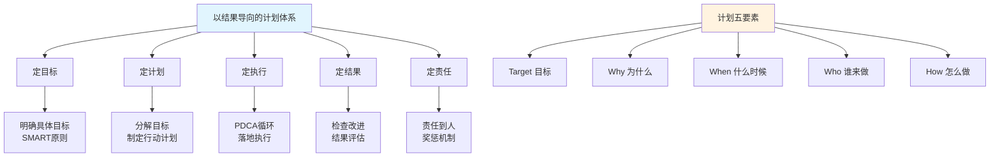
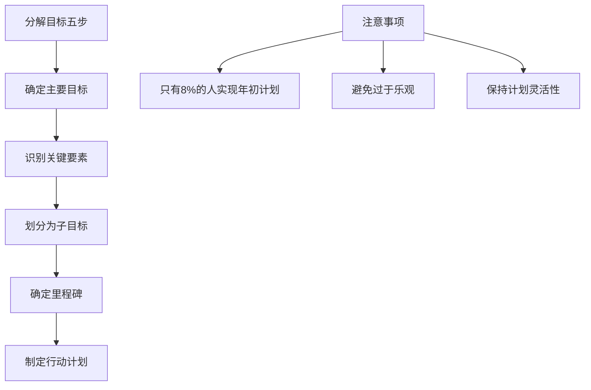
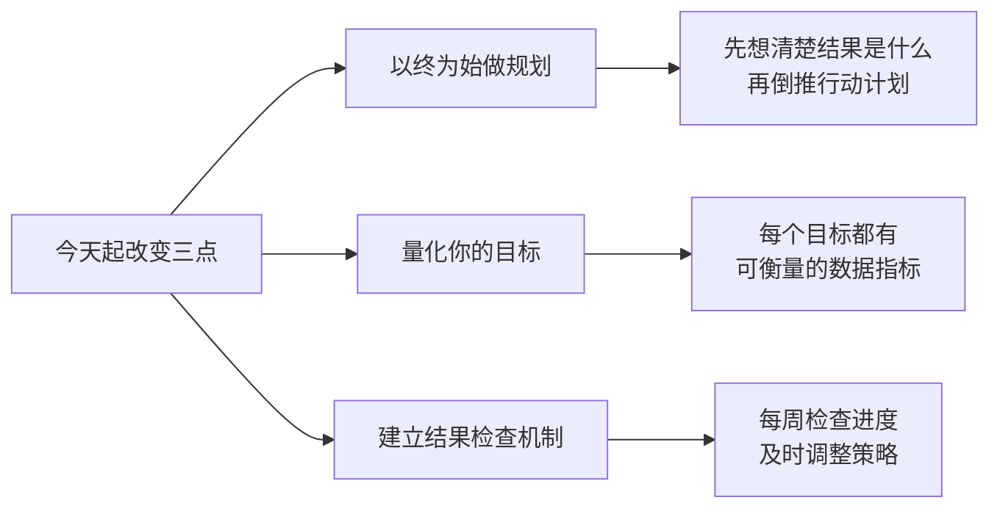

# 4.1以结果导向计划
#### 目录介绍
- [01.看看小杨的案例](#01看看小杨的案例)
- [02.小杨该如何去做](#02小杨该如何去做)
- [03.要以结果为导向](#03要以结果为导向)
- [04.定目标明确目标](#04定目标明确目标)
- [05.定计划分解目标](#05定计划分解目标)
- [06.定执行落地策略](#06定执行落地策略)
- [07.定结果检查改进](#07定结果检查改进)
- [08.定责任推动奖惩](#08定责任推动奖惩)
- [09.今天起改变三点](#09今天起改变三点)
- [10.课后作业思考下](#10课后作业思考下)

## 01.看看小杨的案例

### 1.1 做项目踩了坑

小杨是一名刚参加工作的运营数据分析师，最近直属领导给了他一个项目，一个月后要看这个结果，部门大领导到时候需要小杨去做汇报。

小杨兴冲冲地拿到了数据源，一番操作：数据清洗、统计汇总、归因分析，把当月的数算了个平均值，大概感觉了一下，然后在周五下班后加了一会儿班，兴冲冲地在工作大群里发给了总监。

### 1.2 领导不满意的原因

总监把小杨叫过去，问他，这个结果该怎么看，有对照吗，你得出来这个数据的计算逻辑是什么，有参照吗，这些策略规则的价值点、意义是什么？

总监批评了小杨一个小时，小杨本以为终于拿到重要项目了，还可以表现一下自己，结果……**如果小杨按照计划管理的方式去做这个项目，那么结果会完全不一样**。

## 02.小杨该如何去做

### 2.1 理解需求和目标

**那么小杨该怎么做才能不被领导批评呢**。最开始拿到需求的时候，对待不懂不明确的地方要多问，尤其是找到需求方，理解他的目标是否合理，目标是什么，业务场景是什么？

其次明确了需求之后，按照以往的经验，比如这个数据策略的项目，先观察现有数据特征，是否需要加入对照组，历史同比/环比的平均水平值是多少，基于历史的基准，然后来做筛选和判断。

### 2.2 做好计划和反馈

预估工期多久，及时反馈给领导需要多久可以做完，有什么困难，哪些资源拿不到需要去协调？

然后得到了数据的汇总统计结果之后，该用什么形式来展示？是通过表格展示还是PPT或者思维导图呈现。

**最后基于前面几个步骤，该怎么呈现出结果，这些数字或者结论能怎么反馈出这次的项目效果，可以做出什么策略调整？一切都需要做好详细的计划！**

## 03.要以结果为导向

### 3.1 为什么要做计划

从目标设定、计划制定、执行、检查、结果确认、责任明确和奖惩机制等方面，探讨如何构建以结果为导向的执行力。

那么为什么要做计划？目的是我们可以明确目标，然后去评估拥有的资源和当前情况，然后确定具体方案，最后才会有工作效率和工作质量的提升。

### 3.2 计划的五要素

| 要素 | 英文 | 核心问题 |
|-----|------|---------|
| Target | 目标 | 做这件事的目标/目的是什么？ |
| Why | 为什么 | 为什么要做这件事？痛点是什么？ |
| When | 什么时候 | 花多久时间去做？排期是多久？ |
| Who | 谁来做 | 需要谁来配合？跨部门协调吗？ |
| How | 怎么做 | 技术方案/解决方案是什么？ |

**小到简单的需求多问几个为什么？大到复杂的项目可以科学的规划，把控进度和节奏，能够给领导做及时的正向反馈，也能让需要配合的同事心里有数需要做什么**。

## 04.定目标明确目标

### 4.1 目标导向的核心思想

以目标为导向是一种管理和行动的方法，它强调将行动和决策与明确的目标相对应。这种方法的核心是确保所有的努力都朝着实现预定目标的方向前进。

### 4.2 明确目标的五个要求

| 要求 | 具体说明 | 举例 |
|-----|---------|------|
| 具体化 | 避免模糊表述，明确要实现的结果 | "提高销售"→"增加销售额10%" |
| 可衡量 | 使用具体指标或度量标准 | 用销售额、满意度数据来衡量 |
| 可实现 | 与能力和资源相匹配 | 考虑实际情况，目标合理可行 |
| 有时限 | 设定明确的截止日期 | 帮助保持紧迫感和动力 |
| 写下来 | 放在可见的地方 | 让目标更加具体和真实 |

## 05.定计划分解目标

在明确目标之后，需要将目标分解成具体的任务，并制定相应的计划。计划要具有可行性、可操作性和可评估性。

确保每个任务都有明确的责任人、完成时间和质量要求。同时，计划还要注重灵活性，以应对可能出现的各种变化。

有了具体的计划，但经常还是一年过去，发现实际和计划相比，总是有差距。是的，这是普遍现象，你可能并不例外：统计数字表明，在年初制定了计划的人中，只有 8% 实现了这些计划。

对于计划的估计总是过于乐观，乐观地期待 "惊喜"，然后又"惊吓"地接受现实。那如何才能让计划更具可行性呢？又可以从哪些方面来检视呢？

1. 确定主要目标：首先明确主要目标和次要目标。确保目标是具体、可衡量、可实现和有时限的。
2. 识别关键要素：确定实现主要目标所需的关键要素或关键任务。这些是实现目标所必需的关键步骤或组成部分。
3. 划分为子目标：将主要目标分解为更小的子目标。每个子目标应该是可衡量和可实现的，并且与主要目标直接相关。
4. 要确定里程碑：为每个子目标设定明确的里程碑或关键阶段。这些里程碑将帮助跟踪进展，并提供实现目标的里程碑标志，根据需要进行调整和修正。
5. 制定行动计划：为每个子目标制定具体的行动计划。确定需要采取的具体行动步骤、资源需求和时间安排。

## 06.定执行落地策略

### 6.1 细化到人和事

执行是计划得以实现的关键环节。需要将计划细化到每个岗位、每个员工，确保人人有事干、事事有人干。

在执行过程中，要注重沟通协调，确保各部门之间的顺畅配合。同时，还要不断推动PDCA循环（计划-执行-检查-处理），通过持续改进来提高执行力。

## 07.定结果检查改进

### 7.1 设置检查点

检查是确保执行效果的重要手段。需要在执行过程中设置检查点，对任务完成情况进行定期或不定期的检查。

通过检查，及时发现并纠正问题，确保任务按照既定计划进行。同时，还要注重结果的质量，确保最终成果符合要求。

### 7.2 结果评估与总结

结果的确认是执行过程的最后环节。需要对执行结果进行认真评估和总结，明确哪些做得好、哪些需要改进。

**对于好的结果要给予表彰和奖励，以激发积极性和创造力；对于不好的结果则要深入分析原因，找出问题所在，并制定相应的改进措施**。

## 08.定责任推动奖惩

### 8.1 责任明确到人

在执行过程中，责任要明确到人。每个人都要清楚自己的职责和任务，确保在执行过程中能够承担起相应的责任。

同时，还要建立责任追究机制，对于执行不力或造成损失的要给予相应的惩罚和纠正。

### 8.2 奖惩公正透明

**奖励要公正、公开、透明，确保能够激发人的积极性和创造力；惩罚则要严格、公正、合理，确保能够起到警示和纠正作用**。

## 09.今天起改变三点

**第一点：养成"以终为始"的规划习惯**。从今天起，做任何事情之前先问自己三个问题：最终要达到什么结果？这个结果该怎么衡量？对照组或参照标准是什么？像文中的小杨一样，如果只是埋头做事而不思考结果标准，最终必定是返工重做。先定义"做好"的标准，再开始行动。

**第二点：让你的每一个目标都可量化**。模糊的目标等于没有目标。把"我要变得更好"改成"我要在3个月内掌握某项技能并通过认证"；把"提升工作效率"改成"每周完成的有效产出提升20%"。量化的目标才能被追踪、被检查、被改进。

**第三点：建立每周结果检查的习惯**。每周五花15分钟，对照你的目标和计划做一次快速检查——本周计划完成了多少？哪些偏离了轨道？原因是什么？下周该如何调整？不要等到月底才发现目标偏差太大，及时发现问题才能及时修正。

## 10.课后作业思考下

**1. 结果导向自测**：回顾你最近做的一个项目或任务，当时你有没有明确定义过"成功的标准"？有没有参照和对照？如果没有，用结果导向的思维重新审视这个任务——你应该在开始前定义哪些衡量指标？

**2. 目标量化练习**：把你当前最重要的3个目标写下来，检查它们是否都是可量化、可检验的。如果有模糊的目标，用SMART原则把它们改写成具体、可衡量、有时间限制的版本。

**3. 责任矩阵梳理**：如果你正在负责一个团队任务，画一张责任矩阵表——列出每个子任务的负责人、截止时间和验收标准。确保没有任何任务是"没人管"的状态。如果是个人目标，也给自己设定一个"问责机制"（比如每周向朋友汇报进度）。

**4. 复盘一个失败案例**：回想一个你没有达到预期结果的经历，用"目标→计划→执行→检查→改进"的框架分析，到底在哪个环节出了问题。是目标不清晰？计划不具体？执行不到位？还是缺少检查和改进？从中提炼出一条你以后必须遵守的原则。

