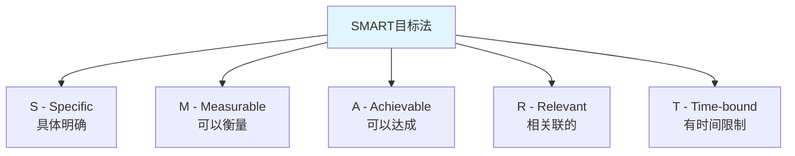
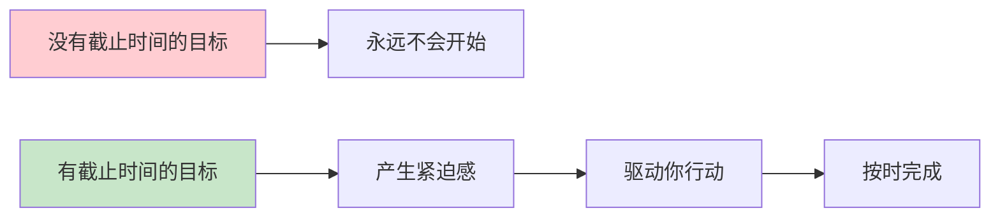
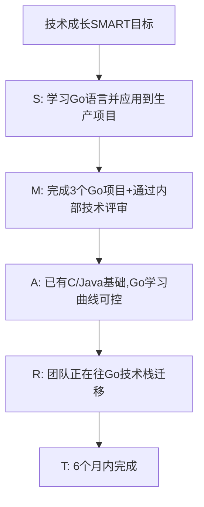
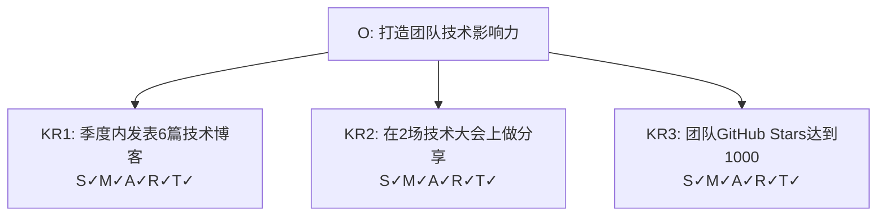
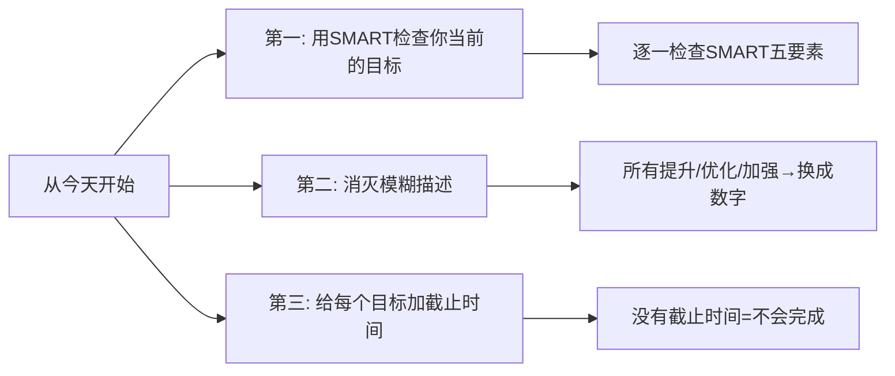

# 5.13SMART目标设定
#### 目录介绍
- [01.SMART法的背景](#01smart法的背景)
- [02.SMART五个要素](#02smart五个要素)
- [03.SMART实际案例](#03smart实际案例)
- [04.SMART与OKR配合](#04smart与okr配合)
- [05.SMART常见误区](#05smart常见误区)
- [06.总结回顾一下](#06总结回顾一下)
- [07.今天起改变三点](#07今天起改变三点)
- [08.课后作业思考下](#08课后作业思考下)

## 01.SMART法的背景

### 1.1 模糊目标的危害

"今年要好好学习""我要提升技术能力""我想更加高效"——这些目标听起来很好，但有一个致命的问题：太模糊了。模糊的目标等于没有目标，因为你无法衡量自己是否达成了，也无法制定具体的行动计划。

人类的大脑对模糊的事物天然有回避倾向。当目标不够清晰时，你的潜意识会找各种理由来拖延——"反正也不知道做到什么程度算完成"。

### 1.2 SMART法的起源

SMART原则由管理学大师彼得·德鲁克在1954年的《管理的实践》中提出雏形，后来由George T. Doran在1981年的论文中正式命名为SMART。它是全球使用最广泛的目标设定工具之一。

## 02.SMART五个要素

### 2.1 S - Specific（具体明确）

目标必须是具体的、明确的，而不是含糊的。你需要清楚地知道自己要做什么。

| 模糊目标 | SMART目标 |
|----------|-----------|
| 提升技术能力 | 掌握Kubernetes容器编排，能独立完成集群部署和运维 |
| 多读书 | 每月读完2本技术类书籍并输出读书笔记 |
| 提高团队效率 | 将团队平均需求交付周期从15天缩短到10天 |

### 2.2 M - Measurable（可以衡量）

目标必须是可以量化衡量的。"提升"了多少？"减少"了多少？用数字来定义成功的标准。

可衡量的方式包括：数量（完成XX个）、比率（提升XX%）、时间（缩短到XX天）、评分（达到XX分）。

### 2.3 A - Achievable（可以达成）

目标必须是在你的能力和资源范围内可以达成的。太容易的目标没有挑战性，太难的目标容易让人放弃。好的目标是"踮踮脚能够到"的。

判断是否可达成的方法：参考过去的数据、分析当前的资源、评估外部条件。如果团队从未做到过的事情，可以先设定一个中间里程碑。

### 2.4 R - Relevant（相关联的）

目标必须与你的核心职责或上级目标相关联。如果一个目标和你的工作方向无关，再好也不应该成为你的重点。

检验方法：问自己"这个目标完成了，对谁有价值？和团队/公司的大目标有什么关系？"如果答不上来，这个目标可能不值得投入。

### 2.5 T - Time-bound（有时间限制）

目标必须有明确的截止时间。"我要学会Python"和"我要在3个月内学会Python并完成一个实际项目"——后者才是真正的目标。有了截止时间，你才会有紧迫感，才会去制定行动计划。

## 03.SMART实际案例

### 3.1 技术人员的SMART目标

| SMART要素 | 内容 |
|-----------|------|
| Specific | 学习Go语言，能独立开发和维护Go项目 |
| Measurable | 完成3个Go语言生产项目，通过团队技术评审 |
| Achievable | 已有C/Java编程基础，团队有Go技术导师 |
| Relevant | 团队正在从Java迁移到Go，这是核心技能需求 |
| Time-bound | 6个月内完成（Q1学习基础+Q2实战项目） |

### 3.2 管理者的SMART目标

| SMART要素 | 内容 |
|-----------|------|
| Specific | 提升团队的需求交付效率 |
| Measurable | 平均交付周期从15天缩短到10天 |
| Achievable | 已识别出3个主要瓶颈，有明确的优化方向 |
| Relevant | 业务方多次反馈交付太慢，影响业务迭代速度 |
| Time-bound | 本季度内实现 |

### 3.3 个人生活的SMART目标

| SMART要素 | 内容 |
|-----------|------|
| Specific | 养成跑步锻炼的习惯 |
| Measurable | 每周跑步3次，每次5公里以上 |
| Achievable | 目前能跑3公里，循序渐进增加距离 |
| Relevant | 长期久坐导致亚健康，需要通过运动改善 |
| Time-bound | 3个月内达成稳定的跑步习惯 |

## 04.SMART与OKR配合

### 4.1 SMART用来优化KR

SMART和OKR是天然的搭档。OKR中的O负责方向（不需要量化），KR负责衡量标准——而SMART正好可以用来检验你的KR是否足够好。

**用SMART检查KR的清单：**

1. 这个KR够具体吗？（S）
2. 这个KR能用数字衡量吗？（M）
3. 这个KR在本季度内可以达成吗？（A）
4. 这个KR和O有直接关联吗？（R）
5. 这个KR有明确的截止时间吗？（T）

如果五个答案都是"是"，那这就是一个好的KR。

### 4.2 一个完整的配合案例

## 05.SMART常见误区

### 5.1 常见的五个误区

| 误区 | 表现 | 正确做法 |
|------|------|----------|
| 只关注M忽略S | 目标有数字但不具体 | 先明确做什么再量化 |
| A定得太低 | 目标太容易缺乏挑战 | 设定"跳一跳够得着"的目标 |
| R与大方向脱节 | 个人目标和团队无关 | 先确认上级目标再设定 |
| T不够紧迫 | "今年内完成" | 细化到月或季度 |
| 定完不回顾 | SMART变成一次性文档 | 每月回顾一次进度 |

## 06.总结回顾一下

SMART是最基础也最实用的目标设定工具。无论你用什么目标管理方法（OKR、KPI、个人计划），都可以用SMART来检验你的目标是否足够好。

记住：模糊的目标等于没有目标。花10分钟用SMART把目标写清楚，能帮你在后续执行中节省大量时间和精力。

## 07.今天起改变三点

**第一，今天就用SMART的五个要素检查你当前的所有目标。** 打开你的OKR/KPI/个人计划，逐一检查每个目标是否满足SMART。不满足的，立即修改。你会发现，很多你以为清晰的目标其实并不符合SMART标准。

**第二，从今天起消灭所有模糊描述。** "提升""优化""加强""改善"——这些词以后在你的目标中都不能单独出现。必须跟上具体的数字："提升30%""优化到2秒以内""从3次减少到0次"。

**第三，给你所有没有截止时间的目标加上截止时间。** 没有截止时间的目标永远不会被完成。今天就给它们都加上，哪怕是一个初步的估计也好过没有。

## 08.课后作业思考下

1. 列出你当前最重要的3个目标（工作或生活），用SMART的标准逐一检查，看看哪些要素是缺失的，修改为完整的SMART目标。
2. 找一个你一直想做但一直没开始的事情，用SMART设定一个具体的目标和截止时间。然后用PDCA制定执行计划，看看是否能推动你行动起来。
3. 观察你的团队/公司是如何设定目标的，有哪些不符合SMART原则的地方？你能提出什么改进建议？
4. 思考：SMART是否有局限性？在什么场景下SMART可能不够用？（提示：考虑创新性和探索性的工作。）

