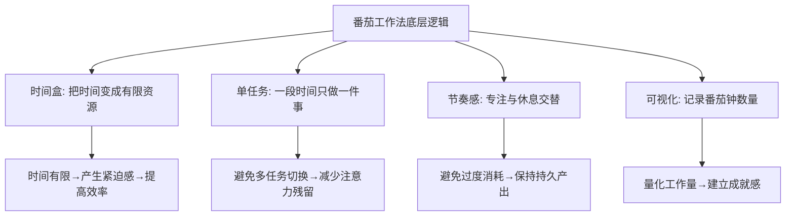
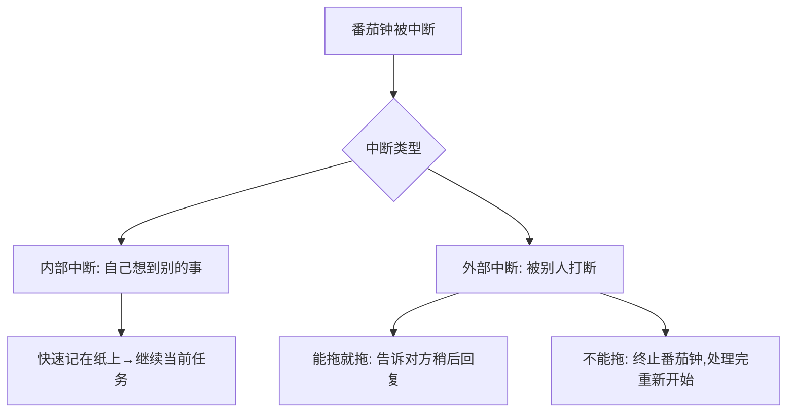
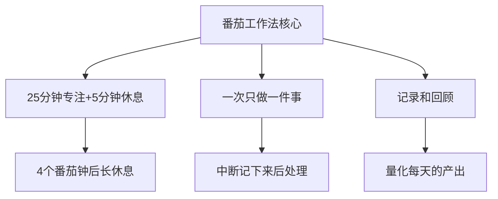
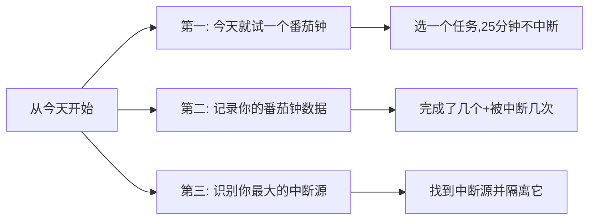

# 5.14番茄工作法实践
#### 目录介绍
- [01.番茄工作法背景](#01番茄工作法背景)
- [02.番茄工作法原理](#02番茄工作法原理)
- [03.如何开始使用](#03如何开始使用)
- [04.进阶使用技巧](#04进阶使用技巧)
- [05.番茄法的局限性](#05番茄法的局限性)
- [06.总结回顾一下](#06总结回顾一下)
- [07.今天起改变三点](#07今天起改变三点)
- [08.课后作业思考下](#08课后作业思考下)

## 01.番茄工作法背景

### 1.1 为什么需要番茄工作法

你有没有过这样的体验：一天忙忙碌碌，回头一看却不知道自己做了什么有价值的事。或者坐在电脑前，一会儿看微信一会儿刷新闻，明明只需要两小时的工作却拖了一整天。

这些问题的本质是：缺乏对时间的掌控感。番茄工作法就是一个简单有效的工具，帮助你把时间从"流逝"变为"可管理"的资源。

### 1.2 番茄工作法的起源

番茄工作法由意大利人弗朗切斯科·西里洛（Francesco Cirillo）在1987年发明。当时他还是一名大学生，为了提高自己的学习效率，用一个番茄形状的厨房计时器来计时——这就是"番茄工作法"名字的由来。

## 02.番茄工作法原理

### 2.1 基本规则

| 要素 | 说明 |
|------|------|
| 一个番茄钟 | 25分钟 |
| 短休息 | 5分钟（每个番茄钟之间） |
| 长休息 | 15-30分钟（每4个番茄钟之后） |
| 核心原则 | 番茄钟不可分割——一旦开始就不能中断 |

### 2.2 为什么是25分钟

25分钟不是随意选择的数字，它基于以下考虑：

- **足够短**：不会让你感到压力，"只是25分钟"的心理暗示能降低启动阻力
- **足够长**：能完成一个有意义的工作块，比如写一个函数、读完一个章节
- **符合注意力周期**：大多数人的注意力集中时间在20-45分钟之间

当然，25分钟不是铁律。等你熟练后，可以根据自己的情况调整为30、45甚至50分钟。

### 2.3 番茄工作法的底层逻辑

番茄工作法的精髓不在于"25分钟"这个数字，而在于它背后的四个核心理念：时间盒（把时间变成有限资源）、单任务（一段时间只做一件事）、节奏感（专注与休息交替）、可视化（记录和回顾）。

## 03.如何开始使用

### 3.1 第一步：列出今天的任务

每天早上（或前一天晚上），列出今天要完成的任务。然后预估每个任务需要多少个番茄钟。一般来说，一天有效的番茄钟数量在8-12个之间。

### 3.2 第二步：开始番茄钟

选择优先级最高的任务，设定25分钟倒计时，开始工作。在这25分钟内：

- **不看手机**（除非工作需要）
- **不回复消息**（统一放到休息时间处理）
- **不切换任务**
- **如果被打断**：记下来，休息时处理

### 3.3 第三步：处理中断

中断是番茄工作法最大的挑战。处理中断的原则是：能推迟的推迟，不能推迟的立即处理但需要重新开始一个番茄钟。

### 3.4 第四步：记录和回顾

每天结束时，记录今天完成了几个番茄钟、被中断了几次、哪些任务完成了、哪些没完成。这些数据能帮助你：了解自己一天的真实产出能力、发现最大的干扰源、优化明天的任务安排。

## 04.进阶使用技巧

### 4.1 任务与番茄钟的匹配

| 任务类型 | 建议番茄钟数 | 技巧 |
|----------|-------------|------|
| 大任务（>4个番茄钟） | 拆分为子任务 | 每个子任务1-3个番茄钟 |
| 小任务（<1个番茄钟） | 合并多个小任务 | 凑成一个番茄钟批量处理 |
| 创意类任务 | 2-3个连续番茄钟 | 短休息时不切换到其他任务 |
| 机械类任务 | 1-2个番茄钟 | 可以适当延长到30-40分钟 |

### 4.2 番茄钟+PDCA

番茄工作法可以和PDCA完美结合：

- **Plan**：早上列出任务清单，预估番茄钟数
- **Do**：按计划执行番茄钟
- **Check**：下午检查完成情况，对比预估和实际
- **Action**：总结经验，调整明天的计划

### 4.3 推荐的工具

不需要买一个真正的番茄形计时器，手机上有大量免费的番茄钟App。关键是选一个简单的、能记录数据的就行。甚至手机自带的计时器就够用了。

## 05.番茄法的局限性

### 5.1 不适合的场景

番茄工作法不是万能的，以下场景可能不太适合：

- **需要频繁协作的工作**：如果你的工作需要随时和同事沟通，严格的25分钟不中断可能不现实
- **创意思维阶段**：有时灵感来了需要一鼓作气，强制休息反而会打断思路
- **会议密集的日子**：如果一天有5-6个会议，可用的番茄钟本就不多

### 5.2 灵活调整

番茄工作法的本质是"有意识地管理时间"，不要把它变成教条。25分钟可以调整为30/45/50分钟；如果进入心流状态不想停，可以继续做；休息时间也可以根据实际情况灵活安排。

## 06.总结回顾一下

番茄工作法是一个简单但极其有效的时间管理工具。它的核心是：用25分钟的时间盒创造专注的工作环境，用5分钟的休息保持持久的产出能力，用记录和回顾不断优化你的工作效率。

记住：番茄工作法不是限制你的工具，而是帮助你掌控时间的工具。灵活使用、持续改进，才能发挥它最大的价值。

## 07.今天起改变三点

**第一，今天下午就试一个番茄钟。** 选择一个你一直在拖延的任务，设定25分钟倒计时，关闭所有通知，全力以赴。25分钟后，你会惊讶于自己的产出。这就是你重新掌控时间的第一步。

**第二，从明天开始记录你的番茄钟数据。** 不需要多复杂，一张纸就行：今天完成了几个番茄钟？被中断了几次？被什么中断的？一周后回顾这些数据，你会对自己的工作效率有全新的认知。

**第三，找到你最大的中断源并隔离它。** 记录一周的中断数据后，找出出现频率最高的中断源。如果是手机，番茄钟期间放到抽屉里；如果是同事的临时请求，设定一个"免打扰时段"告知团队。

## 08.课后作业思考下

1. 今天试用番茄工作法完成一个任务，记录：你用了几个番茄钟？预估和实际差多少？被中断了几次？感受如何？
2. 连续使用番茄工作法一周，统计你每天平均完成多少个有效番茄钟，找出效率最高和最低的时段，思考原因。
3. 尝试把番茄工作法和PDCA结合使用一天：早上Plan（列任务+预估番茄钟），白天Do（执行），下午Check（对比），晚上Action（调整明天的计划）。
4. 思考番茄工作法在你的实际工作中是否适用？如果不完全适用，你会如何调整来适应你的工作节奏？

