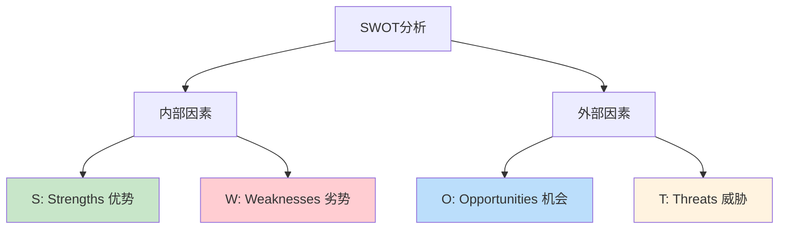
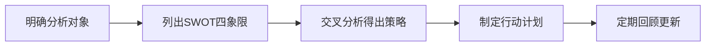
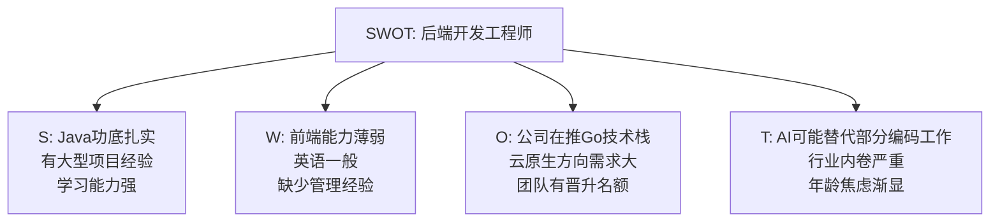
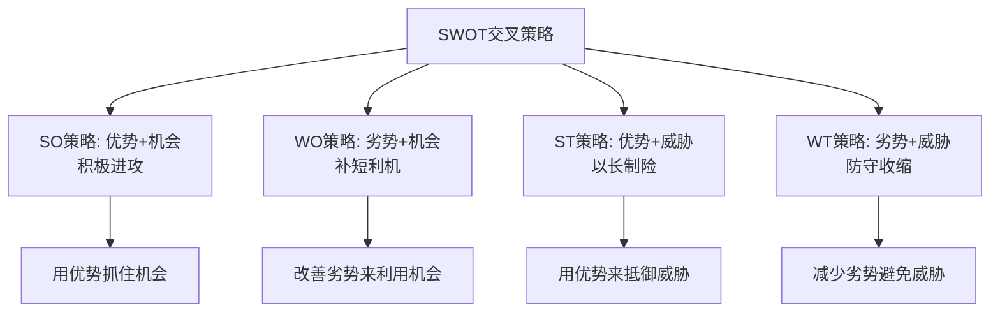
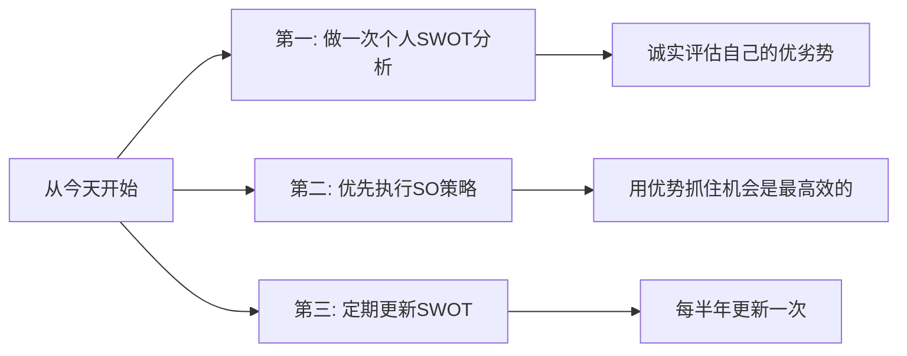

# 5.15SWOT分析方法论
#### 目录介绍
- [01.SWOT分析的背景](#01swot分析的背景)
- [02.SWOT四个象限](#02swot四个象限)
- [03.SWOT的分析步骤](#03swot的分析步骤)
- [04.SWOT实际案例](#04swot实际案例)
- [05.SWOT的四种策略](#05swot的四种策略)
- [06.总结回顾一下](#06总结回顾一下)
- [07.今天起改变三点](#07今天起改变三点)
- [08.课后作业思考下](#08课后作业思考下)

## 01.SWOT分析的背景

### 1.1 为什么需要SWOT

在做重要决策之前——比如是否换工作、是否接手一个新项目、团队下季度的战略方向——你需要对当前的形势做一个全面的评估。很多人做决策靠"感觉"，但感觉往往是不全面的，容易忽略关键因素。

SWOT分析法就是一个帮你系统化、结构化评估形势的工具，让你在做决策前看清全貌。

### 1.2 SWOT的起源

SWOT分析法由美国旧金山大学管理学教授海因茨·韦里克（Heinz Weihrich）在20世纪80年代提出。它最初用于企业战略规划，后来被广泛应用于个人发展、项目评估、竞品分析等各种场景。

## 02.SWOT四个象限

### 2.1 S - Strengths（优势）

优势是你或你的团队/产品所具备的、优于竞争对手的内部因素。分析优势时可以问自己：

- 我们做得比别人好的是什么？
- 我们有哪些独特的资源或能力？
- 别人认为我们的优势是什么？

### 2.2 W - Weaknesses（劣势）

劣势是你或你的团队/产品的内部短板。分析劣势时要保持诚实和客观：

- 我们做得比别人差的是什么？
- 哪些方面需要改进？
- 别人经常批评我们什么？

### 2.3 O - Opportunities（机会）

机会是外部环境中对你有利的因素。分析机会时要放宽视野：

- 市场/行业有什么新趋势可以利用？
- 竞争对手有什么弱点可以切入？
- 有什么新技术或新政策对我们有利？

### 2.4 T - Threats（威胁）

威胁是外部环境中可能对你造成不利影响的因素：

- 竞争对手在做什么可能威胁到我们？
- 市场/行业有什么不利的变化？
- 有什么风险是我们无法控制的？

| 象限 | 性质 | 来源 | 核心问题 |
|------|------|------|----------|
| S 优势 | 有利 | 内部 | 我们比别人强在哪？ |
| W 劣势 | 不利 | 内部 | 我们比别人弱在哪？ |
| O 机会 | 有利 | 外部 | 环境中有什么机遇？ |
| T 威胁 | 不利 | 外部 | 环境中有什么风险？ |

## 03.SWOT的分析步骤

### 3.1 第一步：明确分析对象

SWOT分析的第一步是明确你在分析什么。是分析自己的职业发展？还是分析团队的竞争力？还是分析一个产品的市场前景？分析对象不同，SWOT的内容也完全不同。

### 3.2 第二步：头脑风暴列出要素

针对每个象限，尽可能多地列出相关因素。建议每个象限列出3-5个要素。可以自己独立分析，也可以拉上团队一起头脑风暴。

### 3.3 第三步：交叉分析得出策略

这是SWOT分析中最有价值的步骤——把四个象限两两组合，得出四种应对策略。

## 04.SWOT实际案例

### 4.1 个人职业发展分析

以一个三年经验的后端开发工程师为例：

### 4.2 团队竞争力分析

| 象限 | 内容 |
|------|------|
| S 优势 | 技术团队能力强、有成熟的CI/CD流程、业务理解深 |
| W 劣势 | 人员流动率偏高、缺少产品思维、文档积累不足 |
| O 机会 | 公司业务在高速增长、新业务线需要技术支持、管理层重视技术建设 |
| T 威胁 | 竞对团队规模更大、核心成员有被挖走的风险、技术债务积累 |

## 05.SWOT的四种策略

### 5.1 SO策略（优势+机会）

利用自身优势抓住外部机会。这是最理想的策略，应该优先执行。

例如：Java功底扎实（S）+ 公司在推Go技术栈（O）→ 策略：利用扎实的编程基础快速转型Go，抢占技术红利。

### 5.2 WO策略（劣势+机会）

通过改善自身劣势来更好地利用外部机会。

例如：缺少管理经验（W）+ 团队有晋升名额（O）→ 策略：主动学习管理知识，争取带小团队练手。

### 5.3 ST策略（优势+威胁）

利用自身优势来抵御外部威胁。

例如：学习能力强（S）+ AI可能替代部分编码工作（T）→ 策略：学习AI相关技术，成为"AI+传统开发"的复合型人才。

### 5.4 WT策略（劣势+威胁）

减少自身劣势，避免外部威胁。这是防守策略，在形势不利时使用。

例如：缺少产品思维（W）+ 行业内卷严重（T）→ 策略：培养产品思维和业务理解能力，从纯技术向技术+业务复合发展。

## 06.总结回顾一下

| 步骤 | 动作 | 产出 |
|------|------|------|
| 明确对象 | 确定分析什么 | 清晰的分析范围 |
| 列出要素 | 四象限各列3-5个 | SWOT矩阵表 |
| 交叉分析 | SO/WO/ST/WT策略 | 四种应对策略 |
| 制定计划 | 挑选TOP策略落地 | 具体行动计划 |

SWOT分析法是一个简单但强大的战略分析工具。它帮助你从内部（优势/劣势）和外部（机会/威胁）两个维度全面审视形势，并通过交叉分析得出具体的应对策略。

关键是：不要只做分析不做行动。SWOT的价值在于它能指导你的决策和行动。

## 07.今天起改变三点

**第一，今天就做一次自己的个人SWOT分析。** 花20分钟，诚实地列出你的优势、劣势、机会和威胁。对劣势部分不要自我美化——你不诚实面对的劣势，最终会在某个时刻给你带来麻烦。

**第二，从SWOT分析中找出你的SO策略，优先执行。** 用你的优势去抓住当前的机会，这是投入产出比最高的策略。不要急着去补短板，先把长板发挥到极致。

**第三，每半年重新做一次SWOT分析。** 你的内部条件在变，外部环境也在变。半年前的优势可能变成劣势，半年前不存在的机会可能已经出现。定期更新SWOT，才能始终保持对形势的清醒认知。

## 08.课后作业思考下

1. 为你自己的职业发展做一次完整的SWOT分析，每个象限至少列出3个要素，然后做交叉分析得出SO/WO/ST/WT四种策略。
2. 为你所在的团队做一次SWOT分析，看看团队的核心竞争力是什么，最大的风险是什么。把结果和你的Leader讨论一下。
3. 找一个你正在犹豫的决策（换不换工作、接不接新项目等），用SWOT分析法来辅助决策，看看结论和你的直觉是否一致。
4. 对比SWOT和3C方案设计法，思考它们各自更适合什么场景。你能设计一个把两者结合使用的流程吗？

