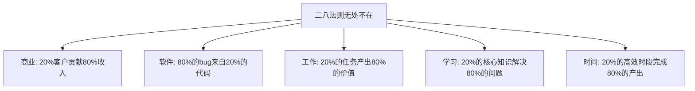
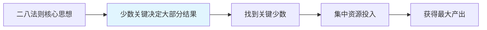
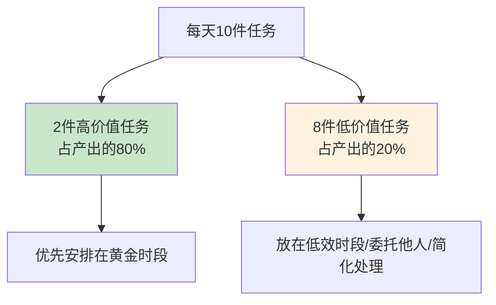
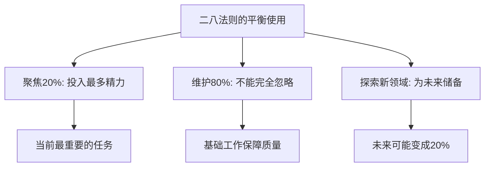
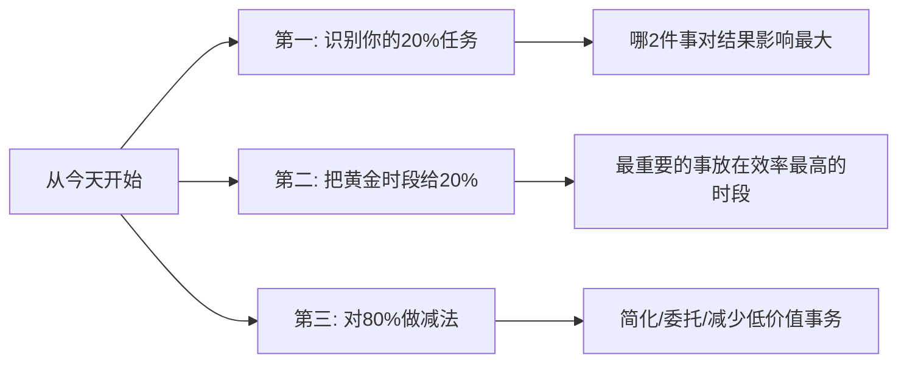

# 5.16二八法则的运用
#### 目录介绍
- [01.二八法则的背景](#01二八法则的背景)
- [02.二八法则的原理](#02二八法则的原理)
- [03.工作中的二八法则](#03工作中的二八法则)
- [04.如何找到你的20%](#04如何找到你的20)
- [05.二八法则的局限性](#05二八法则的局限性)
- [06.总结回顾一下](#06总结回顾一下)
- [07.今天起改变三点](#07今天起改变三点)
- [08.课后作业思考下](#08课后作业思考下)

## 01.二八法则的背景

### 1.1 一个关键的发现

1897年，意大利经济学家维尔弗雷多·帕累托（Vilfredo Pareto）在研究英国的财富分布时发现了一个惊人的规律：社会上20%的人占有80%的社会财富。他后来发现这个规律在很多领域都普遍存在。

这就是著名的"二八法则"（也叫帕累托法则或80/20法则）。

### 1.2 无处不在的二八现象

在工作中，二八法则的体现更加明显：你一天忙碌了10件事，其中真正产出价值的可能只有2件；你掌握的技术知识中，经常用到的核心知识可能只占20%。

认识到这个规律后，你就知道了一个提升效率的关键：**找到你的20%，把大部分精力投入到那20%上去。**

## 02.二八法则的原理

### 2.1 不对等分布

二八法则的核心是：投入和产出之间的关系不是线性的。不是你投入100%的精力就能得到100%的回报——实际上，少数关键的投入往往产生大部分的回报。

| 投入比例 | 产出比例 | 说明 |
|----------|----------|------|
| 20%的关键客户 | 80%的营业收入 | 聚焦核心客户 |
| 20%的核心功能 | 80%的用户使用量 | 聚焦核心功能 |
| 20%的高效时间 | 80%的工作产出 | 聚焦高效时段 |
| 20%的核心知识 | 解决80%的问题 | 聚焦核心知识 |

### 2.2 并不是精确的80和20

需要强调的是，"80/20"只是一个近似比例，实际可能是70/30或90/10。它传递的核心思想是：**关键少数决定了大部分结果。** 所以二八法则的精髓不是追求精确的比例，而是帮你识别出那些"关键少数"。

## 03.工作中的二八法则

### 3.1 时间管理中的二八

你一天工作8小时，但真正高效产出的时间可能只有2-3小时。问题是：这2-3小时你用来做了什么？

如果你把最高效的时段用来回复邮件和参加冗余会议，那就是把20%的黄金时间浪费在了80%的低价值事务上。正确的做法是：把最重要的任务安排在你效率最高的时段。

### 3.2 任务管理中的二八

每天列出的10件待办事项中，真正对你的KPI/OKR有重大影响的可能只有2件。其余8件虽然也要做，但对最终结果的影响很小。

### 3.3 技术学习中的二八

学一门新技术，你不需要把文档从头到尾看完。先掌握20%的核心概念和API，就能应对80%的开发场景。剩下的20%的罕见场景，遇到时再查文档就好。

### 3.4 Bug修复中的二八

80%的bug来自20%的代码模块。如果你能识别出那20%的"高危代码"并重点review和测试，就能大幅降低线上故障率。

### 3.5 团队管理中的二八

团队中20%的核心成员往往贡献了80%的核心产出。作为Leader，你需要识别出这20%的核心成员，给他们足够的资源和发展空间。同时也要提升其他80%成员的能力，避免过度依赖少数人。

## 04.如何找到你的20%

### 4.1 三个问题帮你定位

问自己三个问题：

1. **如果今天只能做一件事，你会做什么？** ——这就是你的TOP 1优先级
2. **哪些任务完成后，对结果的影响最大？** ——这些就是你的关键少数
3. **哪些事情只有你能做，别人做不了？** ——这些就是你的独特价值

### 4.2 用数据来验证

不要凭感觉判断什么是20%，用数据来验证：

| 分析维度 | 数据来源 | 关键指标 |
|----------|----------|----------|
| 时间分配 | 记录一周的时间日志 | 哪些时段产出最高 |
| 任务价值 | 回顾过去的KPI/OKR | 哪些任务对结果贡献最大 |
| 客户价值 | 分析客户数据 | 哪些客户贡献最多收入 |
| 技能价值 | 回顾项目经历 | 哪些技能被用得最多 |

## 05.二八法则的局限性

### 5.1 不能忽略那80%

二八法则不是说那80%的事情可以不做。很多基础性的工作虽然不直接产生高价值，但如果不做，整个系统就会崩溃。比如代码review、写文档、做测试——这些"低价值"任务其实是保障质量的基石。

### 5.2 80%中可能藏着未来的20%

今天看起来价值不大的事情，可能在未来变得非常重要。比如你花时间学习的一门冷门技术，可能在两年后变成行业热点。所以二八法则应该指导你的当前优先级，但不应该让你完全放弃探索。

## 06.总结回顾一下

二八法则告诉我们：20%的关键投入产生80%的结果。在时间管理、任务管理、技术学习、团队管理等各个方面，都可以应用这个原则。

核心方法是：找到你的"关键少数"，把大部分精力和资源集中在这些关键事情上。同时不要完全忽略那80%的基础工作，也要保留对未来的探索空间。

**二八法则的终极启示是：做少、做精、做对的事。**

## 07.今天起改变三点

**第一，今天就审视你的任务清单，找出真正的20%。** 你今天/本周/本月的任务中，哪2-3件事对最终结果的影响最大？把它们标记出来，确保你每天都在推进这些关键任务。

**第二，把你效率最高的时段留给那20%的关键任务。** 如果你上午10点最清醒，那就把最重要的任务安排在上午10点。不要把黄金时段浪费在回复邮件和参加低效会议上。

**第三，对那80%的低价值事务做减法。** 有些事情可以简化处理，有些可以委托给别人，有些甚至可以不做。每砍掉一件低价值的事，你就多了一份精力投入到高价值的事上。

## 08.课后作业思考下

1. 记录你这周做的所有事情，然后标注哪些对结果产生了实质性影响、哪些只是"忙碌但无价值"。你的20%是什么？
2. 分析你团队的客户/项目/需求，哪20%贡献了80%的业务价值？团队的资源分配是否和这个比例匹配？
3. 回顾你过去一年学习的技术知识，哪20%的知识是你最常用的？这个发现对你未来的学习方向有什么指导？
4. 思考二八法则在你的生活中的体现：你80%的快乐来自哪20%的人或事？你能否在这些方面投入更多时间？

