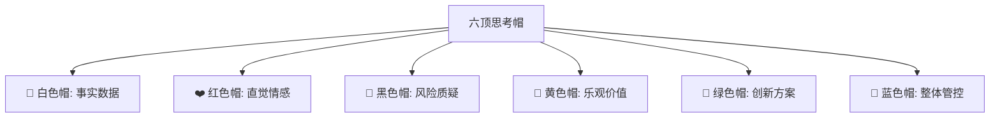
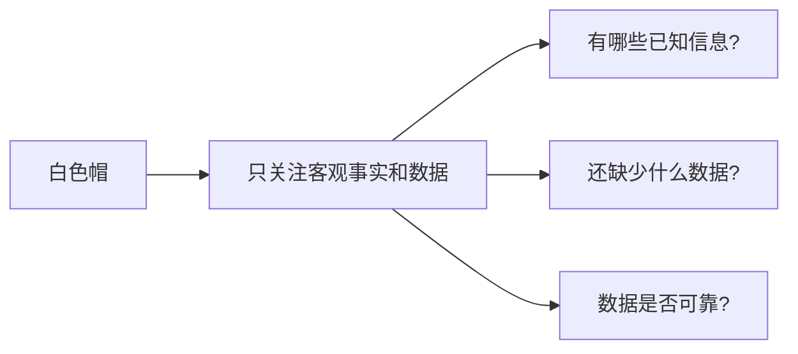
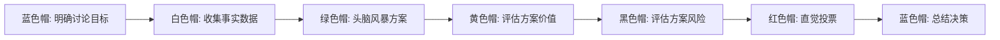
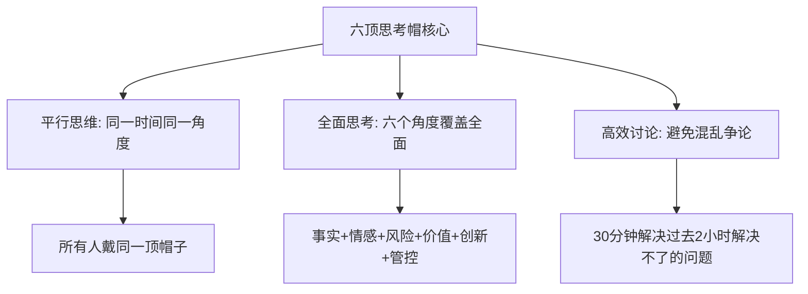
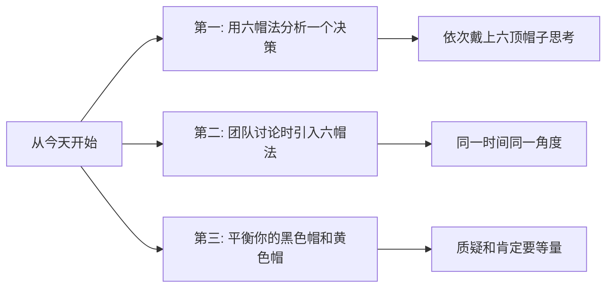

# 5.17六顶思考帽方法
#### 目录介绍
- [01.六顶思考帽背景](#01六顶思考帽背景)
- [02.六顶帽子的含义](#02六顶帽子的含义)
- [03.如何使用思考帽](#03如何使用思考帽)
- [04.思考帽实际案例](#04思考帽实际案例)
- [05.思考帽使用技巧](#05思考帽使用技巧)
- [06.总结回顾一下](#06总结回顾一下)
- [07.今天起改变三点](#07今天起改变三点)
- [08.课后作业思考下](#08课后作业思考下)

## 01.六顶思考帽背景

### 1.1 讨论低效的根源

你有没有经历过这样的会议：讨论一个方案时，有人在谈数据，有人在谈感受，有人在质疑风险，有人在提新想法——大家各说各的，讨论了两小时也没有结论。

这个问题的根源是：所有人在同一时间用不同的思维方式思考同一个问题，导致思维混乱、争论不休。

### 1.2 思考帽的起源

六顶思考帽（Six Thinking Hats）由英国心理学家爱德华·德·博诺（Edward de Bono）在1985年提出。他认为，人在思考问题时，应该把不同类型的思维分开进行，而不是混在一起——就像戴不同颜色的帽子一样。

## 02.六顶帽子的含义

### 2.1 白色帽：事实与数据

戴上白色帽时，只谈事实和数据，不夹带观点和判断。比如："上个月用户留存率是35%""竞品的同类功能上线了3个月"——这些都是白色帽的内容。"留存率太低了"则不是白色帽的内容，因为它包含了判断。

### 2.2 红色帽：直觉与情感

红色帽允许你表达直觉、感受和预感，不需要给出理由。比如："我觉得这个方案用户不会买账""我对这个项目有一种不好的预感"。红色帽的价值在于，它承认情感和直觉在决策中的作用。

### 2.3 黑色帽：风险与质疑

黑色帽专注于找出方案的问题、风险和隐患。比如："如果服务器宕机了怎么办？""这个方案的成本可能超出预算""历史上类似的项目都失败了"。黑色帽是最常被使用的帽子，但要注意不要过度使用。

### 2.4 黄色帽：乐观与价值

黄色帽专注于发现方案的优点、价值和机会。比如："这个方案能让用户体验大幅提升""如果成功的话，我们能抢占市场先机"。黄色帽和黑色帽是一对搭档，确保你既看到了风险也看到了价值。

### 2.5 绿色帽：创新与方案

绿色帽专注于创造性思维——提出新想法、新方案、新可能。比如："我们能不能换一种完全不同的技术方案？""有没有可能和XX部门合作来降低成本？"绿色帽鼓励天马行空，暂时不考虑可行性。

### 2.6 蓝色帽：管控与总结

蓝色帽是"帽子的帽子"——它负责管控整个思考过程，决定什么时候戴什么帽子，最终做出总结。通常由会议主持人来扮演蓝色帽的角色。

| 帽子 | 思维类型 | 核心问题 | 适用场景 |
|------|----------|----------|----------|
| 白色 | 客观事实 | 事实和数据是什么？ | 收集信息阶段 |
| 红色 | 直觉情感 | 直觉告诉我什么？ | 快速表达感受 |
| 黑色 | 风险质疑 | 有什么问题和风险？ | 风险评估阶段 |
| 黄色 | 乐观价值 | 有什么好处和价值？ | 价值评估阶段 |
| 绿色 | 创新方案 | 有什么新想法？ | 头脑风暴阶段 |
| 蓝色 | 整体管控 | 该怎么组织讨论？ | 贯穿全程 |

## 03.如何使用思考帽

### 3.1 团队讨论的标准流程

关键规则是：同一时间所有人戴同一顶帽子。当大家都在戴白色帽讨论数据时，不允许有人跳到黑色帽来质疑方案。这个简单的规则能大幅提升讨论效率。

### 3.2 个人思考的使用方式

六顶思考帽不仅适合团队讨论，也适合个人独立思考。当你面对一个复杂决策时，可以依次戴上六顶帽子，从不同角度审视问题。这能帮你避免思维偏见，做出更全面的判断。

## 04.思考帽实际案例

### 4.1 是否引入新技术栈

团队在讨论是否将主力开发语言从Java迁移到Go：

| 帽子 | 讨论内容 |
|------|----------|
| 🤍 白色 | Go在性能测试中比Java快30%；团队15人中有3人有Go经验；迁移预计需要6个月 |
| ❤️ 红色 | 团队成员对学新语言既兴奋又焦虑；部分老成员担心自己跟不上 |
| 💛 黄色 | 性能提升意味着节省30%的服务器成本；Go的并发模型更适合我们的业务场景 |
| 🖤 黑色 | 迁移期间可能影响需求交付速度；Go的生态不如Java成熟；招聘Go工程师更困难 |
| 💚 绿色 | 可以渐进式迁移——新服务用Go，老服务暂不迁移；组织Go培训让全员参与 |
| 💙 蓝色 | 决策：采用渐进式迁移策略，新项目用Go，先培训3个月再正式启动 |

## 05.思考帽使用技巧

### 5.1 控制每顶帽子的时间

建议每顶帽子的讨论时间控制在5-10分钟。时间太短讨论不充分，太长容易跑题。蓝色帽（主持人）负责控制时间和节奏。

### 5.2 黑色帽不要过度使用

很多人天然倾向于找问题和挑毛病（黑色帽思维），导致讨论变成了"否定大会"。解决方法：确保黄色帽和黑色帽的时间相当，每次质疑一个风险后，要求给出解决方案。

### 5.3 红色帽要快速

红色帽的讨论应该很短——每人30秒表达直觉感受即可。不需要解释理由，直觉本身就是信息。

## 06.总结回顾一下

六顶思考帽的核心价值是"平行思维"——让所有人在同一时间从同一角度思考问题，避免思维混乱和争论不休。六个角度保证了思考的全面性，时间控制保证了讨论的效率。

## 07.今天起改变三点

**第一，选择一个你正在犹豫的决策，依次戴上六顶帽子分析。** 白色帽收集事实、红色帽感受直觉、黄色帽看好处、黑色帽看风险、绿色帽想方案、蓝色帽做总结。你会发现，这比"纠结来纠结去"高效得多。

**第二，下次团队讨论时，尝试引入六顶思考帽。** 在开始时说明规则：我们先用5分钟收集事实（白色帽），再用5分钟讨论价值（黄色帽），再用5分钟讨论风险（黑色帽）……这个简单的结构变化就能让讨论效率翻倍。

**第三，有意识地平衡你的黑色帽和黄色帽。** 如果你发现自己习惯性地找问题、挑毛病（黑色帽过度），那就刻意多戴黄色帽——每提出一个质疑的同时，也说出一个优点。反之亦然。

## 08.课后作业思考下

1. 选一个你最近做过的重要决策，用六顶思考帽的方法重新分析一遍。你是否发现了之前遗漏的角度？
2. 在下一次团队讨论中试用六顶思考帽方法，记录讨论的效率和结果质量与以往的差异。
3. 观察你自己最常戴的是哪顶帽子（可能是黑色帽或红色帽），思考这对你的决策质量有什么影响。
4. 六顶思考帽和3C方案设计法可以如何结合使用？设计一个你自己的决策流程。

