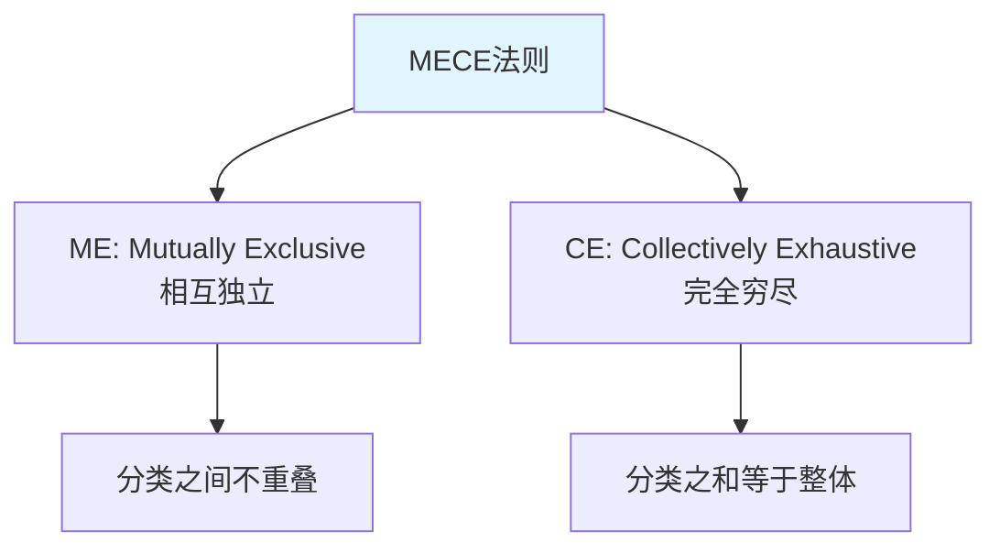
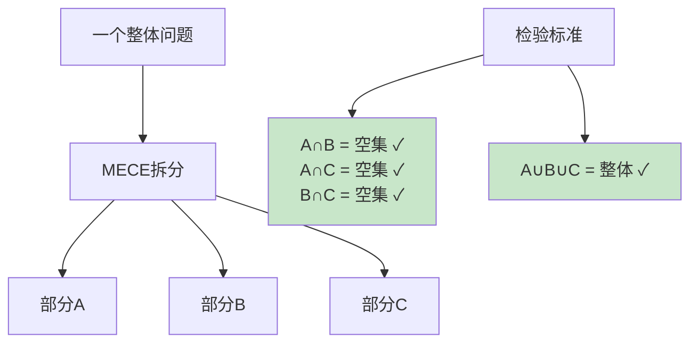
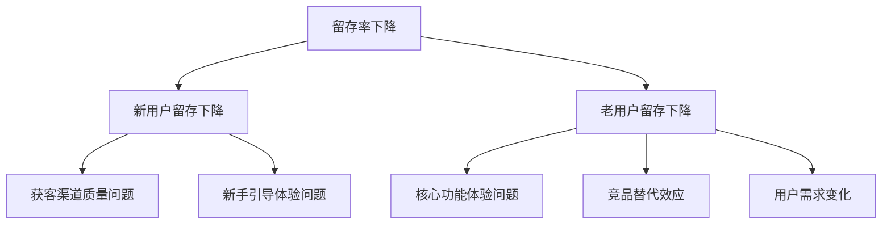
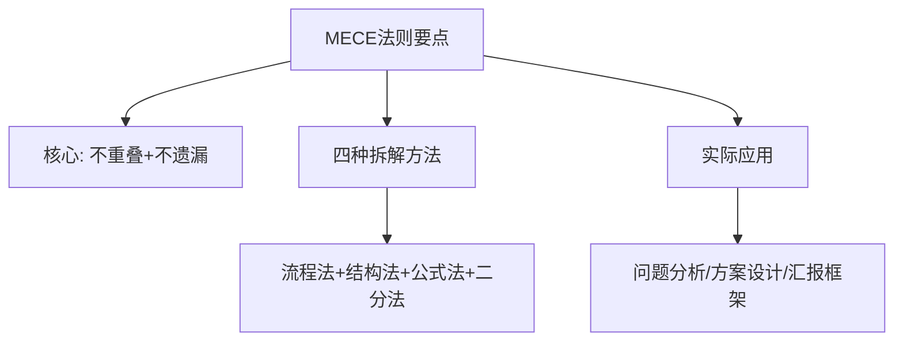
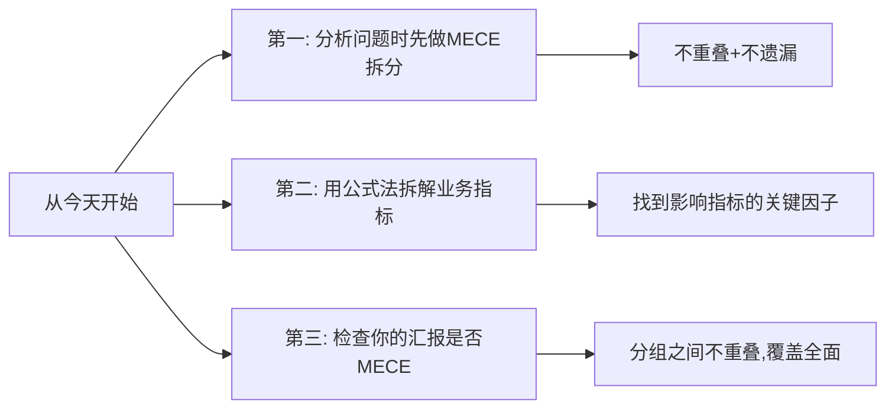

# 5.18MECE分析法则
#### 目录介绍
- [01.MECE法则的背景](#01mece法则的背景)
- [02.MECE的核心含义](#02mece的核心含义)
- [03.MECE的拆解方法](#03mece的拆解方法)
- [04.MECE的实际案例](#04mece的实际案例)
- [05.MECE的常见误区](#05mece的常见误区)
- [06.总结回顾一下](#06总结回顾一下)
- [07.今天起改变三点](#07今天起改变三点)
- [08.课后作业思考下](#08课后作业思考下)

## 01.MECE法则的背景

### 1.1 为什么需要MECE

你有没有分析问题时遇到过这样的困境：列了一堆原因，但总觉得不全面，可能遗漏了什么；又或者列出的原因之间有重叠，讨论时把同一个问题翻来覆去说了好几遍。

问题的根源在于：你的分析框架不够严谨。MECE法则就是帮你建立严谨分析框架的工具。

### 1.2 MECE的起源

MECE（Mutually Exclusive, Collectively Exhaustive）由全球顶级咨询公司麦肯锡提出，是麦肯锡方法论的核心基石。几乎所有的咨询师在入职第一周就会学习MECE原则。

## 02.MECE的核心含义

### 2.1 相互独立（ME）

"相互独立"意味着你拆分出来的各个部分之间不能有重叠。比如把人按年龄分为"18岁以下""18-35岁""35岁以上"就是相互独立的；但如果分为"学生""上班族""年轻人"就不是相互独立的，因为"年轻人"和"学生""上班族"有重叠。

### 2.2 完全穷尽（CE）

"完全穷尽"意味着你拆分出来的各个部分加在一起必须覆盖全部情况，不能遗漏。比如把性别分为"男""女"是完全穷尽的；但如果只分为"男""女""儿童"就不是MECE的，因为"儿童"和前两类重叠（ME违反），而且这种分法的逻辑也不自洽。

### 2.3 MECE的直观理解

| 情况 | 示例 | 是否MECE |
|------|------|----------|
| 不重叠+不遗漏 | 人按性别分：男/女 | ✅ MECE |
| 有重叠+不遗漏 | 人按身份分：学生/上班族/年轻人 | ❌ 有重叠 |
| 不重叠+有遗漏 | 收入来源：工资/投资 | ❌ 遗漏了兼职等 |
| 有重叠+有遗漏 | 用户分：VIP/活跃用户 | ❌ 既重叠又遗漏 |

## 03.MECE的拆解方法

### 3.1 按流程拆解

把一件事按照时间顺序或流程步骤来拆分，天然就是MECE的。

比如分析"用户流失"问题，可以按流程拆解为：注册阶段流失、首次使用流失、持续使用阶段流失、付费阶段流失。每个阶段互不重叠，加在一起覆盖了用户的全生命周期。

### 3.2 按结构拆解

把一个整体按照其组成结构来拆分。比如分析公司收入，可以按业务线拆解：A业务收入 + B业务收入 + C业务收入 = 总收入。

### 3.3 按公式拆解

利用已有的公式来拆分。比如：

- 收入 = 用户数 × 客单价 × 购买频率
- 利润 = 收入 - 成本
- 转化率 = 转化人数 / 访问人数

公式中的每个因子天然就是MECE的，因为它们数学上互不重叠且组合完整。

### 3.4 按二分法拆解

最简单的MECE拆分方式：把一个集合分为A和非A。比如"用户"可以分为"付费用户"和"非付费用户"；"需求"可以分为"已完成"和"未完成"。

| 拆解方法 | 适用场景 | 示例 |
|----------|----------|------|
| 按流程 | 分析过程类问题 | 用户购买流程各阶段 |
| 按结构 | 分析组成类问题 | 公司各业务线收入 |
| 按公式 | 分析指标类问题 | 收入=用户×客单价×频次 |
| 按二分法 | 快速粗分 | 付费用户 vs 非付费用户 |

## 04.MECE的实际案例

### 4.1 分析App留存率下降

第一层拆分（按用户类型）：新用户留存下降 + 老用户留存下降 = 全部用户留存下降。这是MECE的。

第二层拆分（按原因）：针对新用户，按流程拆解为"获客阶段"和"激活阶段"的问题；针对老用户，按因素拆解为"内部原因"和"外部原因"。

### 4.2 分析项目延期原因

用MECE拆解项目延期的原因：

| 一级分类 | 二级分类 | 具体原因 |
|----------|----------|----------|
| 需求问题 | 需求变更频繁、需求不明确 | 产品经理频繁修改PRD |
| 技术问题 | 技术方案不合理、技术难点超预期 | 未预估到第三方接口限制 |
| 资源问题 | 人力不足、关键人员请假 | 核心开发生病请假一周 |
| 流程问题 | 审批流程长、环境不可用 | 测试环境被其他项目占用 |

检验MECE：四个一级分类之间是否重叠？需求/技术/资源/流程，基本不重叠。是否穷尽？加上"其他因素"兜底，可以认为是穷尽的。

## 05.MECE的常见误区

### 5.1 过度追求完美MECE

在实际工作中，100%完美的MECE往往很难做到。不要为了追求完美而花太多时间纠结分类——做到80%的MECE就已经比没有框架好得多了。

### 5.2 层次太多太复杂

MECE拆分通常2-3层就够了。层次太多会导致分析框架过于复杂，反而降低了分析效率。

### 5.3 忘记了分析的目的

MECE是工具，不是目的。拆分完之后的关键是：通过拆分发现问题的关键所在，找到解决方案。如果拆分得很漂亮但最后没有得出有价值的结论，那就是为了MECE而MECE。

## 06.总结回顾一下

MECE法则的核心是两个要求：相互独立（不重叠）和完全穷尽（不遗漏）。它是一切结构化思维的基础。

掌握MECE，你就掌握了把复杂问题拆解为简单子问题的能力。无论是分析问题原因、设计方案框架，还是组织汇报结构，MECE都是最基础的底层工具。

## 07.今天起改变三点

**第一，下次分析问题时，先做MECE拆分。** 不要一上来就列原因，先想清楚用什么维度来拆分（流程？结构？公式？），确保拆分出来的部分不重叠、不遗漏。这个简单的步骤能大幅提升你分析问题的系统性。

**第二，找一个你关心的业务指标，用公式法做MECE拆解。** 比如GMV = 用户数 × 转化率 × 客单价。拆解后，你就能清楚地知道要提升GMV应该从哪个因子入手。

**第三，检查你最近的汇报或方案，看看分组是否符合MECE。** 如果有重叠或遗漏，重新调整分组。一份MECE的汇报，逻辑清晰度会提升一个档次。

## 08.课后作业思考下

1. 选一个你正在面对的工作问题，用MECE法则做一次完整的拆解（至少2层），检查每一层是否满足"不重叠+不遗漏"。
2. 找一个业务指标（如日活、转化率、客单价等），用公式法拆解为若干因子，分析哪个因子是当前最值得优化的。
3. 回顾你最近写的一份汇报或方案，检查其中的分类框架是否MECE。如果不是，重新组织一下结构。
4. 思考MECE和金字塔原理的关系：金字塔原理中的"归类分组"和MECE有什么联系？

