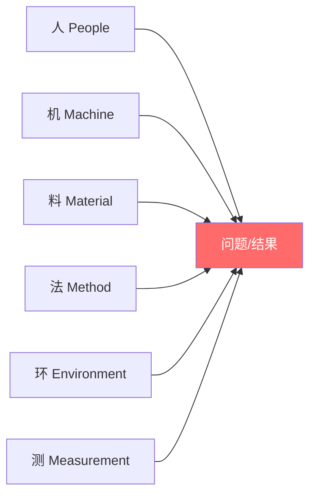
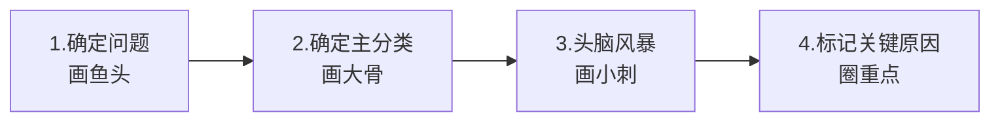
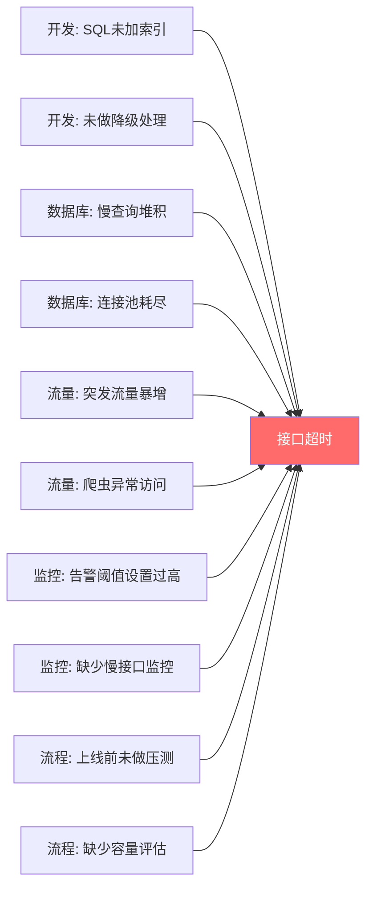
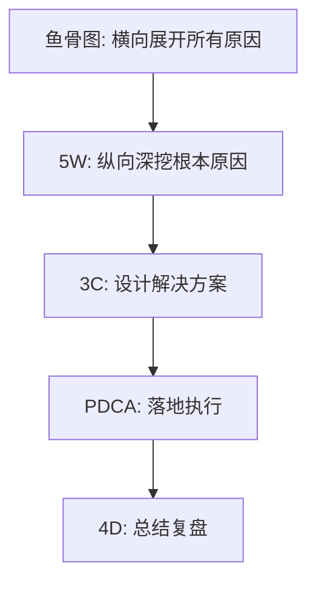
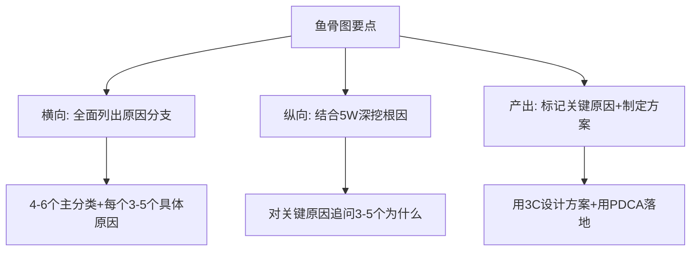
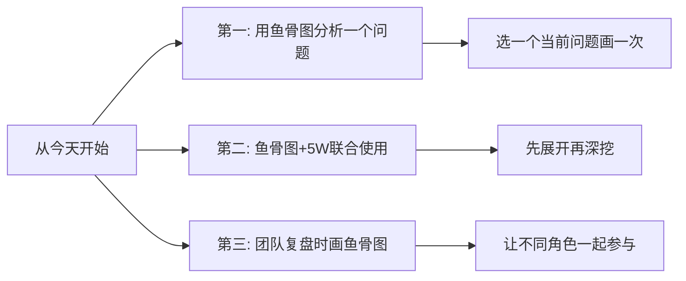

# 5.19鱼骨图分析方法
#### 目录介绍
- [01.鱼骨图分析背景](#01鱼骨图分析背景)
- [02.鱼骨图的结构](#02鱼骨图的结构)
- [03.如何绘制鱼骨图](#03如何绘制鱼骨图)
- [04.鱼骨图实际案例](#04鱼骨图实际案例)
- [05.鱼骨图使用技巧](#05鱼骨图使用技巧)
- [06.总结回顾一下](#06总结回顾一下)
- [07.今天起改变三点](#07今天起改变三点)
- [08.课后作业思考下](#08课后作业思考下)

## 01.鱼骨图分析背景

### 1.1 为什么需要鱼骨图

当一个问题涉及多个层面的原因时，如果你只是在脑子里想或者随手列几条，很容易遗漏重要因素。鱼骨图通过可视化的方式，帮你系统地梳理问题的所有可能原因，确保分析的全面性。

### 1.2 鱼骨图的起源

鱼骨图（Fishbone Diagram）又叫因果图或石川图，由日本质量管理专家石川馨（Kaoru Ishikawa）在1960年代发明。因为它的形状像鱼骨头，所以得名。它最初用于制造业的质量问题分析，后来被广泛应用于各行各业。

### 1.3 鱼骨图与5W的关系

鱼骨图和5W根因分析法是天然的搭档：鱼骨图帮你横向展开所有可能的原因分支，5W帮你纵向深挖每个分支的根本原因。两者结合使用，分析问题既全面又深入。

## 02.鱼骨图的结构

### 2.1 鱼头：问题/结果

鱼头在图的最右边，写上你要分析的问题或不理想的结果。比如"系统崩溃""用户投诉增多""项目延期"等。

### 2.2 鱼骨：主要原因分类

从鱼头延伸出来的大骨头代表主要的原因分类。在制造业中，常用的分类是"6M"：

| 分类 | 英文 | 含义 | IT行业对应 |
|------|------|------|-----------|
| 人 | Man/People | 人员相关 | 开发人员、运维人员 |
| 机 | Machine | 设备相关 | 服务器、网络设备 |
| 料 | Material | 材料相关 | 代码、配置、数据 |
| 法 | Method | 方法相关 | 流程、规范、方法论 |
| 环 | Environment | 环境相关 | 开发/测试/生产环境 |
| 测 | Measurement | 度量相关 | 监控、告警、测试 |

在IT行业中，可以灵活调整分类，比如改为：人员、技术、流程、工具、环境。

### 2.3 小刺：具体原因

每根大骨头上又延伸出小刺，代表具体的原因。小刺可以继续细分，形成更深层的原因分析。

## 03.如何绘制鱼骨图

### 3.1 绘制的四个步骤

**第一步：确定问题。** 在纸的右侧写下要分析的问题，画一条从左到右的横线（鱼脊骨）。

**第二步：确定主分类。** 根据问题的性质，选择4-6个主要的原因分类，画成斜线连接到鱼脊骨上。

**第三步：头脑风暴。** 针对每个分类，尽可能多地列出具体原因。可以一个人做，也可以团队一起头脑风暴。

**第四步：标记关键原因。** 用5W分析法对最可能的原因进行深挖，找出根本原因后用特殊标记（如红色圆圈）标注出来。

### 3.2 头脑风暴的技巧

- 不要评判：先列出所有可能的原因，不要在过程中否定任何想法
- 鼓励联想：一个人提出的原因可能触发另一个人的联想
- 数量优先：先追求数量，后追求质量
- 归类整理：头脑风暴结束后，检查是否有重复或归类不当的

## 04.鱼骨图实际案例

### 4.1 线上接口超时分析

| 主分类 | 具体原因 | 深挖（5W） | 根本原因 |
|--------|----------|-----------|----------|
| 开发 | SQL未加索引 | 为什么？→新人不熟悉→为什么？→缺少代码review | 缺少SQL审查流程 |
| 数据库 | 连接池耗尽 | 为什么？→慢查询占用连接→为什么？→索引缺失 | 同上 |
| 监控 | 告警阈值过高 | 为什么？→上次调高了没改回来→为什么？→没有review机制 | 缺少告警配置review |
| 流程 | 上线前未压测 | 为什么？→时间紧→为什么？→缺少强制流程 | 缺少上线前压测checklist |

### 4.2 用户投诉增多分析

| 主分类 | 具体原因 |
|--------|----------|
| 产品 | 新版本功能复杂度增加、操作路径变长、缺少新手引导 |
| 技术 | 页面加载变慢、频繁出现404、支付偶发失败 |
| 客服 | 响应速度变慢、话术不统一、问题升级流程不畅 |
| 运营 | 促销活动规则复杂、优惠券使用限制多、退款流程繁琐 |

## 05.鱼骨图使用技巧

### 5.1 与其他方法联合使用

鱼骨图最大的价值是"全面性"——帮你确保不遗漏重要的原因分支。但它本身不负责深挖和解决问题，需要和5W、3C、PDCA等方法配合使用。

### 5.2 分类不要超过6个

主分类建议控制在4-6个。太少容易遗漏，太多会导致分析框架过于复杂。如果某个分类下的原因很少，可以合并到相近的分类中。

### 5.3 团队共创效果更好

鱼骨图特别适合团队一起绘制。不同角色的人对问题有不同的理解——开发看到技术原因，产品看到需求原因，运维看到环境原因。团队共创能让鱼骨图更加全面。

## 06.总结回顾一下

鱼骨图是一个可视化的因果分析工具，通过分类的方式系统地梳理问题的所有可能原因。它和5W根因分析法是最佳搭档——鱼骨图负责"广度"，5W负责"深度"。

关键是：画完鱼骨图不是终点，找到根本原因并制定解决方案才是目标。

## 07.今天起改变三点

**第一，选一个你当前面临的问题，花15分钟画一个鱼骨图。** 不需要多完美，先确定4-5个主分类，然后在每个分类下列出你能想到的所有具体原因。画完后，你会对问题的全貌有一个清晰的认知。

**第二，对鱼骨图中你认为最可能的2-3个原因，用5W继续深挖。** 追问3-5个为什么，找到根本原因。鱼骨图帮你不遗漏，5W帮你挖到底。

**第三，下次团队复盘时，在白板上画一个鱼骨图。** 让不同角色的同事各自贡献原因，你会发现团队的集体智慧远超个人分析。这也是一种高效的团队复盘方式。

## 08.课后作业思考下

1. 选一个你最近遇到的工作问题（bug、故障、延期等），用鱼骨图做一次完整的原因分析。主分类可以用：人员、技术、流程、工具、环境。
2. 在鱼骨图分析的基础上，对TOP3的可能原因用5W进行深挖，找出根本原因，然后用3C方案设计法提出解决方案。
3. 对比鱼骨图和MECE法则，思考两者的异同。在什么场景下用鱼骨图更合适？什么场景下用MECE更合适？
4. 尝试把鱼骨图应用到生活问题中（比如"为什么最近总感觉累""为什么存不下钱"），体验它在非工作场景中的效果。

