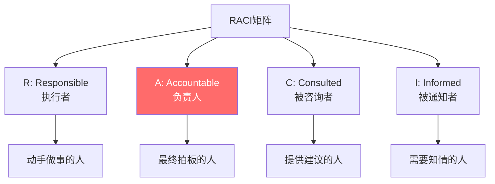
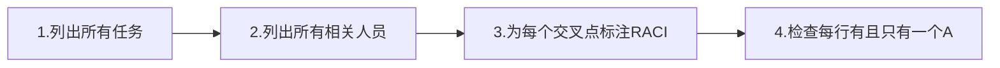
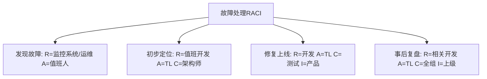
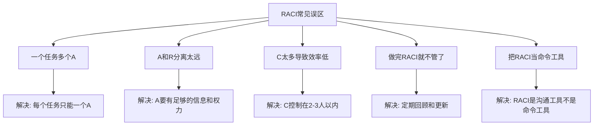
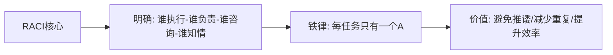
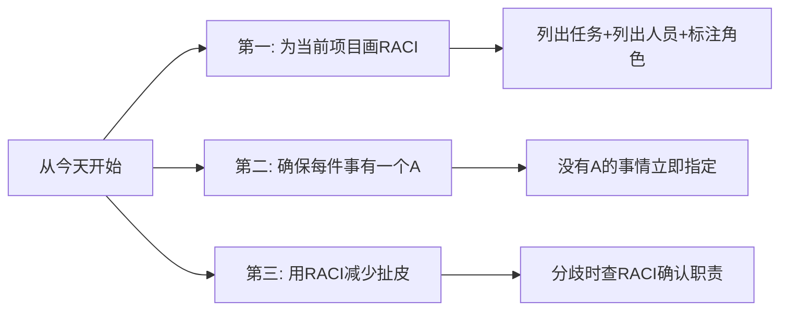

# 5.20RACI责任矩阵法
#### 目录介绍
- [01.RACI矩阵的背景](#01raci矩阵的背景)
- [02.RACI四个角色](#02raci四个角色)
- [03.如何制定RACI](#03如何制定raci)
- [04.RACI实际案例](#04raci实际案例)
- [05.RACI的常见误区](#05raci的常见误区)
- [06.总结回顾一下](#06总结回顾一下)
- [07.今天起改变三点](#07今天起改变三点)
- [08.课后作业思考下](#08课后作业思考下)

## 01.RACI矩阵的背景

### 1.1 责任不清的困境

你有没有遇到过这样的情况：一件事情出了问题，你以为是A负责的，A以为是B负责的，B以为是你负责的——结果三个人都没做，问题暴露后互相甩锅。

又或者，一个任务三个人都在做，结果做出来三个不同的版本，浪费了大量时间和精力。

这些问题的根源只有一个：**责任不清。** RACI矩阵就是解决"谁来做什么"这个问题的工具。

### 1.2 RACI的起源

RACI矩阵起源于项目管理领域，是一种用于明确项目任务中各角色职责的工具。它通过一张简单的矩阵表格，让每个人都清楚自己在每件事情上的角色是什么。

## 02.RACI四个角色

### 2.1 R - Responsible（执行者）

执行者是实际动手做事的人。一个任务可以有多个执行者。比如一个技术方案需要前端和后端各做一部分，那前端开发和后端开发都是R。

### 2.2 A - Accountable（负责人）

负责人是对任务结果最终负责的人，也是做最终决策和审批的人。**每个任务有且只能有一个A。** 这是RACI中最重要的规则——如果一件事有两个"最终负责人"，等于没有负责人。

### 2.3 C - Consulted（被咨询者）

被咨询者是在任务执行过程中需要被征询意见的人。注意C是双向沟通——你需要问他的意见，他也需要给你反馈。比如安全方案需要咨询安全团队的意见。

### 2.4 I - Informed（被通知者）

被通知者是需要被告知任务进展或结果的人，但不需要参与决策。I是单向沟通——你通知他即可，不需要等他的反馈。比如上线后通知相关的业务方。

| 角色 | 含义 | 数量限制 | 沟通方式 | 常见角色 |
|------|------|----------|----------|----------|
| R 执行者 | 动手做事 | 可以多个 | 主动执行 | 开发、设计、测试 |
| A 负责人 | 最终负责 | **只能一个** | 审批决策 | 项目经理、TL |
| C 被咨询者 | 提供建议 | 可以多个 | 双向沟通 | 架构师、安全团队 |
| I 被通知者 | 知情即可 | 可以多个 | 单向通知 | 上级、相关业务方 |

## 03.如何制定RACI

### 3.1 制定的三个步骤

**第一步：纵轴列出所有任务。** 把项目或工作拆解为具体的任务列表。

**第二步：横轴列出所有相关人员/角色。** 包括项目中的所有参与者。

**第三步：在每个交叉点标注RACI。** 每个人在每个任务上的角色是R、A、C还是I。

### 3.2 检查的两条铁律

**铁律一：每行有且只有一个A。** 如果某个任务没有A，说明没人对结果负责，必须指定一个。如果有多个A，必须精简到只有一个。

**铁律二：每行至少有一个R。** 没有R意味着没人执行，任务不可能完成。

### 3.3 注意事项

- A和R可以是同一个人（负责人亲自执行）
- 不是每个人在每个任务上都需要有角色——可以留空
- C的人数不宜过多，否则沟通成本太高
- I的范围可以适当宽一些，信息透明有利于协作

## 04.RACI实际案例

### 4.1 App新功能上线

| 任务 | 产品经理 | 前端开发 | 后端开发 | 测试 | TL | 运维 |
|------|---------|---------|---------|------|-----|------|
| 需求评审 | A/R | C | C | C | I | - |
| 技术方案设计 | C | R | R | - | A | C |
| 前端开发 | I | A/R | - | - | I | - |
| 后端开发 | I | - | A/R | - | I | - |
| 联调测试 | I | R | R | A/R | I | - |
| 上线部署 | I | R | R | C | A | R |
| 线上验收 | A/R | R | R | R | I | I |

### 4.2 线上故障处理

## 05.RACI的常见误区

### 5.1 五个常见误区

| 误区 | 表现 | 后果 | 正确做法 |
|------|------|------|----------|
| 多个A | 两个人都觉得自己最终负责 | 推诿或冲突 | 只留一个A |
| 没有A | 没人对结果负责 | 事情没人跟进 | 明确指定A |
| C太多 | 做什么事都要问一圈 | 决策效率极低 | C控制在2-3人 |
| 不更新 | 人员变动后RACI过时 | 新人不知道自己的角色 | 定期回顾 |
| 当命令 | 用RACI压人 | 引发抵触 | RACI是共识工具 |

## 06.总结回顾一下

RACI矩阵是一个简单但极其有效的责任分配工具。它通过四个角色（执行者、负责人、被咨询者、被通知者）的明确分配，解决了"谁做什么"这个团队协作中最基础也最容易出问题的问题。

核心铁律：**每个任务有且只有一个A。** 这是避免推诿和冲突的关键。

RACI不是一次性的文档，而是需要随着项目进展和人员变动定期更新的活文档。

## 07.今天起改变三点

**第一，为你当前正在进行的项目画一个RACI矩阵。** 列出核心任务，列出参与人员，在每个交叉点标注R/A/C/I。画完后和团队成员确认，确保大家对自己的角色理解一致。

**第二，检查你的团队中有没有"没有A的任务"。** 那些经常出问题、经常扯皮的事情，往往就是没有明确A的任务。今天就把它们的A指定清楚。

**第三，下次遇到"这件事谁负责"的争议时，拿出RACI矩阵来确认。** RACI是事先达成的共识，用它来解决争议比现场讨论高效得多。如果RACI没有覆盖到这件事，那就补上。

## 08.课后作业思考下

1. 为你当前负责的项目或工作模块制定一个RACI矩阵，检查是否每个任务都有且只有一个A。
2. 回忆一次团队中"互相甩锅"或"重复劳动"的经历，分析当时如果有RACI矩阵，是否能避免这个问题。
3. 思考RACI和PDCA的关系：在PDCA的Plan环节中，RACI扮演什么角色？
4. 如果你是一个5人小团队的Leader，设计一个涵盖需求评审、技术方案、开发、测试、上线全流程的RACI矩阵模板，让团队可以复用。

