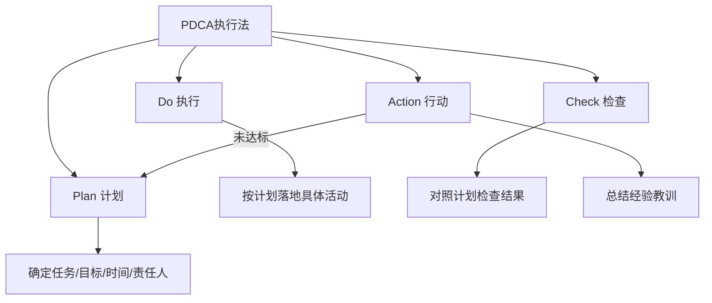
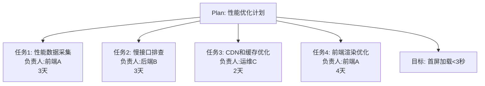
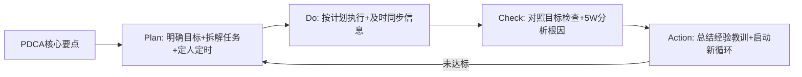
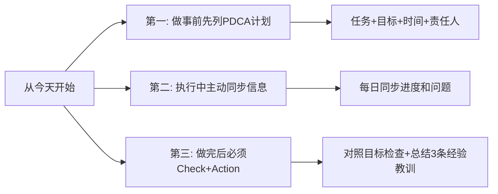

# 5.3Pdca执行方法
#### 目录介绍
- [01.PDCA简单的介绍](#01pdca简单的介绍)
- [02.何为PDCA执行法](#02何为pdca执行法)
- [03.第一环节是Plan](#03第一环节是plan)
- [04.第二环节是Do](#04第二环节是do)
- [05.第三环节是Check](#05第三环节是check)
- [06.第四环节是Action](#06第四环节是action)
- [07.PDCA执行案例](#07pdca执行案例)
- [08.总结回顾一下](#08总结回顾一下)
- [09.今天起改变三点](#09今天起改变三点)
- [10.课后作业思考下](#10课后作业思考下)

## 01.PDCA简单的介绍

### 1.1 为何PDCA重要

在事中执行阶段，最核心的方法当然就是 PDCA 执行法了。毕竟一开始工作规划得再好，如果没有落地执行，那么也产出不了任何价值。

**执行力是把规划变成现实的关键环节**，而PDCA正是帮你系统化提升执行力的最佳工具。

## 02.何为PDCA执行法

PDCA，即是计划(Plan)、实施(Do)、检查(Check)、行动(Action)的首字母组合，就是把事情的执行过程分成四个环节。

无论哪一项工作都离不开PDCA的循环，每一项工作都需要经过计划、执行计划、检查计划、对计划进行调整并不断改善这样四个阶段，保证具体事项高效高质地落地。

### 2.1 PDCA来自哪里

这个方法来源于美国质量管理专家休哈特在 1930 年提出的 PDCA 循环。20
世纪中后期，美国另一位质量管理专家戴明利用这个理论指导日本企业进行质量管理，极大地提高了日本企业的市场竞争力，也让 PDCA
循环得以在世界范围内推广。

这也反映出 PDCA 执行法是一个普适性的方法，适用于各行各业。不过它的实际效果如何，还要取决于使用者有没有掌握各个环节的具体技能。

### 2.2 PDCA如何理解

1、P (Plan) 计划，包括方针和目标的确定，以及活动规划的制定。

2、D (Do) 执行，根据已知的信息，设计具体的方法、方案和计划布局；再根据设计和布局，进行具体运作，实现计划中的内容。

3、C (Check) 检查，总结执行计划的结果，分清哪些对了，哪些错了，明确效果，找出问题。

4、A (Act）处理，对总结检查的结果进行处理，对成功的经验加以肯定，并予以标准化；对于失败的教训也要总结，引起重视。

### 2.3 为何要做PDCA

瞄准目标，基于事实。PDCA执行法的本质是**以目标为导向，基于事实来推动执行**。它不是让你凭感觉做事，而是让你有计划、有检查、有改进地完成每一项任务。

### 2.4 使用 PDCA 执行法

意味着你要完成制定计划、拆解任务、协调资源、安排责任人和检查结果等工作，所以它比较适合“负责人”这个角色，比如 Team
Leader、虚拟团队负责人和领域负责人等。

## 03.第一环节是Plan

### 3.1 Plan是做什么

第一个环节是计划（Plan）。确定具体任务、阶段目标、时间节点和具体责任人，达成目标需要采取那些措施。用PDCA来规划，也用它来推动落地。

任务计划：需要把任务划分更细并且可以执行的粒度。举一个例子，我要做一个需求，可以把任务划分为需求分析，技术方案设计，代码拟写，接口联调，自测等。

阶段目标计划：需要达到什么样的标准或者目标。

时间节点计划：每个计划，任务都需要有截止时间。

负责人：具体是有谁负责，分别负责的任务是什么。

OKR、3C 方案设计与 PDCA有何区别？OKR 规划，3C 方案设计和 PDCA，它们好像都和规划有关，那么它们之间的区别和联系是什么呢？它们之间的关系是：OKR
制定整体规划，3C 选择实现方案，PDCA 落实具体任务。

### 3.2 Plan环节技巧

1.处理紧急的事情要长短结合。

很多负责人在处理紧急事情的时候会陷入一个两难的境地：如果采取临时措施，虽然能够快速处理，但没有从根本上解决，后面还可能出现其他问题。如果采取长远措施，虽然能够从根本上解决，但是投入很大，短期内无法快速落地。

正确的做法是长短结合，先快速解决表面的问题，避免损失，然后规划长期的方法，从根本上解决问题。

2.重要但不紧急的事情拆分多个小项目。

很多人负责人都有这样的经历：对于重要但不紧急的事情，团队都知道，也都想做；可是一旦准备要做，就发现投入太大，没有足够的时间和人员投入。

于是团队每天都忙于处理各种紧急的事情，这些重要但不紧急的事情就一直拖着。正确的做法是拆分为多个小项目来落地，可以按照事情类别来拆分，也可以按照时间迭代来拆分。

3.学会利用上级的力量来协调资源。

对于某些项目，一开始并不能明确需要投入的人力。作为负责人，你很可能在分析之后发现，需要的人力投入比最初预估的要多。

如果你是 TL，你发现需要借调其他团队的人才能完成。你可以先尝试自己去跟对方的 TL 协调，如果碰到麻烦可以找上级来协调，然后成立正式的工作组。

## 04.第二环节是Do

### 4.1 Do是做什么

第二个环节是执行（Do）。按照计划落地各项具体的活动，比如技术人员完成方案设计、编码和测试等工作，要罗列下详细执行计划。

### 4.2 Do环节技巧

1.根据情况采取相应的管理风格。

在指导团队成员执行的时候，负责人经常犯两种错误，一是管得太多，一种是管得太少。

管得太多体现在因为担心团队成员出错，事无巨细都要亲自参与，结果一方面导致自己很累，另一方面让团队成员没有发挥空间，很难得到成长。

管的太少体现在只做任务分配，不做具体指导，万一出问题就找个人背锅，这样虽然自己很轻松，但团队成员仍然得不到成长；而且团队的成果会有很大的不确定性，成员如果能力一般，很可能得不到好的结果。

2.做好信息同步

很多人都有的一个坏毛病就是，收到了上级的任务后就只知道埋头干活，只要上级不来问，自己就不说，甚至出了问题都不上报，期望自己搞定，不要打扰上级。

这是一个非常严重的错误做法，特别是出了问题如果你不跟上级说，一旦他通过其他渠道得知，对你的印象都不会好。一方面他会觉得尴尬，自己团队的问题都不知道，还要等别人来告诉自己；另一方面他会觉得你故意隐瞒问题。正确的做法是，及时同步信息。

## 05.第三环节是Check

### 5.1 Check是做什么

第三个环节是检查（Check）。对照计划来检查实际执行结果，明确哪些符合预期、哪些不达预期、哪些超出预期以及存在什么问题等。

### 5.2 Check环节技巧

使用 5W 分析问题根因

大部分人在分析问题原因的时候，都倾向于归结为表面的外部原因或者客观原因，而不愿意归结为深层的内部原因，尤其是自己的原因。

所以在分析问题原因的时候，存在一种常见的现象，只要某个人说了一个外部原因或者客观原因，感觉团队成员都长舒一口气，然后分析也就到此为止了。

正确的做法是，采用 5W 根因分析法，不断追问更深一层的根本原因。

## 06.第四环节是Action

### 6.1 Action是做什么

第四个环节是行动（Action）。基于检查的结果，总结经验和教训，明确下一步需要采取的措施。

如果 Check 的结果是目标已经实现，那么当前 PDCA 循环结束。

如果 Check 的结果是目标没有实现，那么就需要调整计划，把经验和教训作为输入，开始新一轮的 PDCA 循环，如此重复直到目标达成或者取消。

### 6.2 Action环节技巧

1.做好总结汇报

你可能会问：“执行环节不是已经同步了各种信息吗，这里还要总结汇报什么呢？”

其实这两个环节的汇报有很大的区别：执行环节是同步信息，主要是问题、进展和重要的里程碑事件。行动阶段是总结汇报，主要是结果是否符合计划的预期，能总结什么经验教训，后续是否需要采取什么措施。

总结汇报不一定要写个 PPT 来汇报，很多时候写个邮件就差不多了。

2.每次最多挑选3个改进点落实到流程行动环节，最重要的产出就是经验和教训了。

一个常见的误区是，认为经验和教训越多越好。有些负责人会收集团队全体成员的意见，甚至根据意见的数量来判断团队成员的主动性，于是得到的经验和教训的数量非常多。

正确的做法是，不要想解决所有问题，而是关注可能重复发生的、影响很大的问题。我建议每次总结的时候，最多挑选 3 条经验教训相关的改进点落实到流程。

## 07.PDCA执行案例

### 7.1 案例背景介绍

以一个真实的技术团队场景为例：某团队负责的电商App出现了"用户投诉页面加载慢"的问题，团队需要在两周内完成性能优化。

### 7.2 Plan环节的操作

负责人首先明确了目标：首屏加载时间从当前的5.2秒降低到3秒以内。然后把任务拆解为4个子任务，分别指定负责人和截止时间。同时采用"长短结合"策略：短期先做CDN和缓存优化（见效快），长期规划前端架构重构。

### 7.3 Do环节的操作

团队按照计划开始执行。前端A采集了线上性能数据，发现首屏有3个大图片未做懒加载；后端B排查出2个慢接口，平均响应时间超过2秒；运维C完成了CDN节点调整和缓存策略优化。

执行过程中，负责人每天用5分钟做信息同步：今天做了什么、遇到什么问题、明天计划做什么。发现后端B的慢接口优化需要改数据库索引，涉及DBA配合，及时向上级反馈并协调资源。

### 7.4 Check环节的操作

两周后检查结果：首屏加载时间从5.2秒降低到2.8秒，达标。但发现一个新问题：某些低端机型的渲染时间仍然偏高。用5W分析法追问原因，发现是JS包体积过大导致的。

### 7.5 Action环节的操作

| 类别 | 经验/教训 | 后续措施 |
|------|-----------|----------|
| 成功经验 | CDN优化效果最明显 | 推广到其他业务线 |
| 成功经验 | 每日信息同步很有效 | 固化为团队流程 |
| 改进教训 | JS包体积问题未提前发现 | 增加构建产物体积监控 |

针对未解决的低端机型问题，启动新一轮PDCA循环：计划做代码分割和按需加载。

## 08.总结回顾一下

PDCA 执行法就是把事情的执行过程分成四个环节：计划（Plan）、执行（Do）、检查（Check）和行动（Act），从而把控执行过程，保证具体事项高效高质地落地。

计划环节确定具体任务、阶段目标、时间节点和具体责任人；执行环节落地各项具体的活动，检查环节检查实际执行结果，行动环节明确下一步需要采取的措施。

OKR 规划法、3C 方案设计法和 PDCA 的计划环节的关系是：OKR 制定目标，3C 选择方案，PDCA 落实任务。

## 09.今天起改变三点

**第一，下一次接到任务时，先花15分钟列一个PDCA计划。** 不需要多复杂，用一个简单的表格就行：任务是什么、目标是什么、截止时间是什么、谁来做。有了这个计划，你的执行就会更有方向感，也更容易向上汇报进度。

**第二，执行过程中养成主动同步信息的习惯。** 不要等领导来问你进度，而是主动告诉领导：当前进展如何、遇到什么问题、是否需要协调资源。每天花3-5分钟做信息同步，能避免很多后续的沟通成本。

**第三，任务完成后，必须做Check和Action。** 对照最初的计划检查结果：目标达成了吗？哪些做得好？哪些做得不够好？最多总结3条经验教训，落实到具体的改进措施。记住：不做Check和Action的PDCA等于没有闭环。

## 10.课后作业思考下

1. 对照一下 PDCA 的方法和技巧，你觉得自己平时做事主要是哪些地方做的不够好？看完这一讲后有什么改进或者提升的想法？
2. 选择你当前正在进行的一个任务，用PDCA的框架重新梳理一遍：你的Plan是否明确了目标和时间节点？Do的过程中有没有做好信息同步？
3. 回忆一次你做完事情后没有做总结的经历，如果当时做了Check和Action，结果可能会有什么不同？
4. 尝试用PDCA管理一件生活中的事情（比如健身计划、阅读计划），体验一下这个方法在非工作场景中的效果。

