# 6.2阅读的持续提升
#### 目录介绍
- [01.阅读提升的背景](#01阅读提升的背景)
- [02.阅读能力有层次](#02阅读能力有层次)
- [03.阅读能力的分层](#03阅读能力的分层)
- [04.知道阅读的大概](#04知道阅读的大概)
- [05.阅读书籍的目录](#05阅读书籍的目录)
- [06.留意书里的故事](#06留意书里的故事)
- [07.前后建立起联系](#07前后建立起联系)
- [08.理解故事的脉络](#08理解故事的脉络)
- [09.能够复述出内容](#09能够复述出内容)
- [10.拥有自己的理解](#10拥有自己的理解)
- [11.提出疑惑和思考](#11提出疑惑和思考)
- [12.场景化阅读训练](#12场景化阅读训练)
- [13.今天起改变三点](#13今天起改变三点)
- [14.课后作业思考下](#14课后作业思考下)

## 01.阅读提升的背景

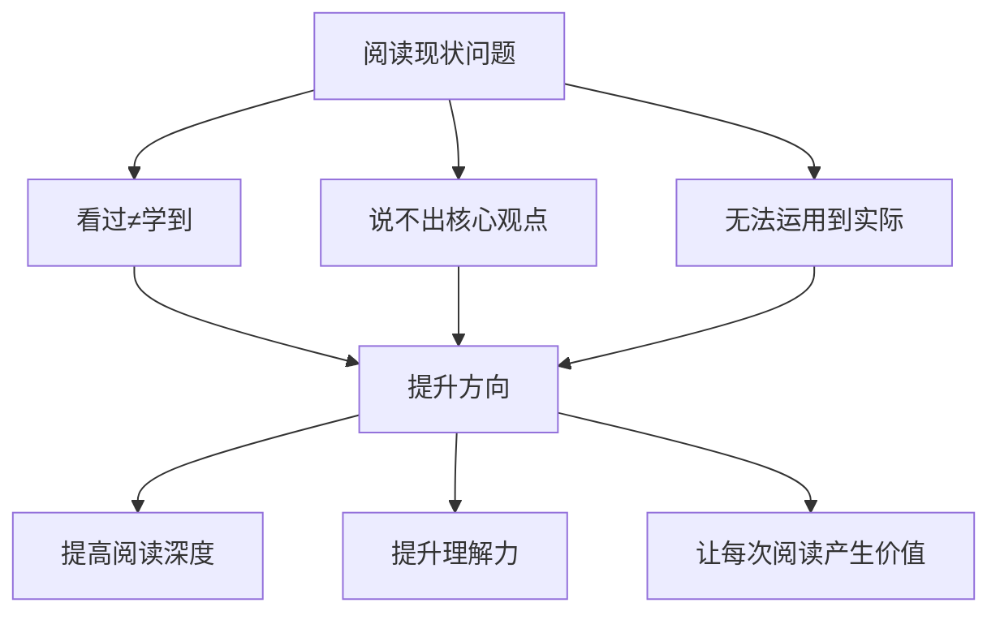

在这个信息爆炸的时代，阅读能力比以往任何时候都更加重要。无论是工作中的技术文档、行业报告，还是生活中的书籍、文章，阅读都是我们获取知识、提升认知的核心途径。

然而，很多人的阅读还停留在"看过"的层面，看完一本书后，既说不出核心观点，也无法将书中的知识运用到实际中。这种低效的阅读方式，本质上是在浪费时间。

### 1.1 阅读的三种困境

**信息过载困境**：每天接触的文章、公众号、短视频、书籍浩如烟海，你可能"看了很多"，但真正"读进去"的很少。浏览不等于阅读，点赞收藏不等于学到。

**浅层阅读困境**：快餐式阅读让人习惯了浮光掠影——扫一眼标题、看几段摘要就觉得自己"知道了"。但如果有人让你展开说说，你会发现自己说不出什么有深度的内容。

**学用脱节困境**：读了很多书，道理都懂，但到了实际工作和生活中，依然是老样子。知识停留在"知道"层面，没有转化为"能力"。

### 1.2 提升的核心方向

提升阅读能力，不仅仅是提高阅读速度，更重要的是提升阅读的深度和理解力，让每一次阅读都能产生真正的价值。具体来说，就是从"看过"到"理解"，从"理解"到"复述"，从"复述"到"应用"，从"应用"到"批判"。

## 02.阅读能力有层次

阅读能力并非一成不变，而是可以通过有意识的训练不断提升的。根据认知发展理论，阅读能力可以划分为多个层次，从最基础的"识字阅读"到最高级的"批判性阅读"。

每个层次都有不同的特征和要求，了解这些层次有助于我们评估自己当前的水平，并有针对性地进行提升。

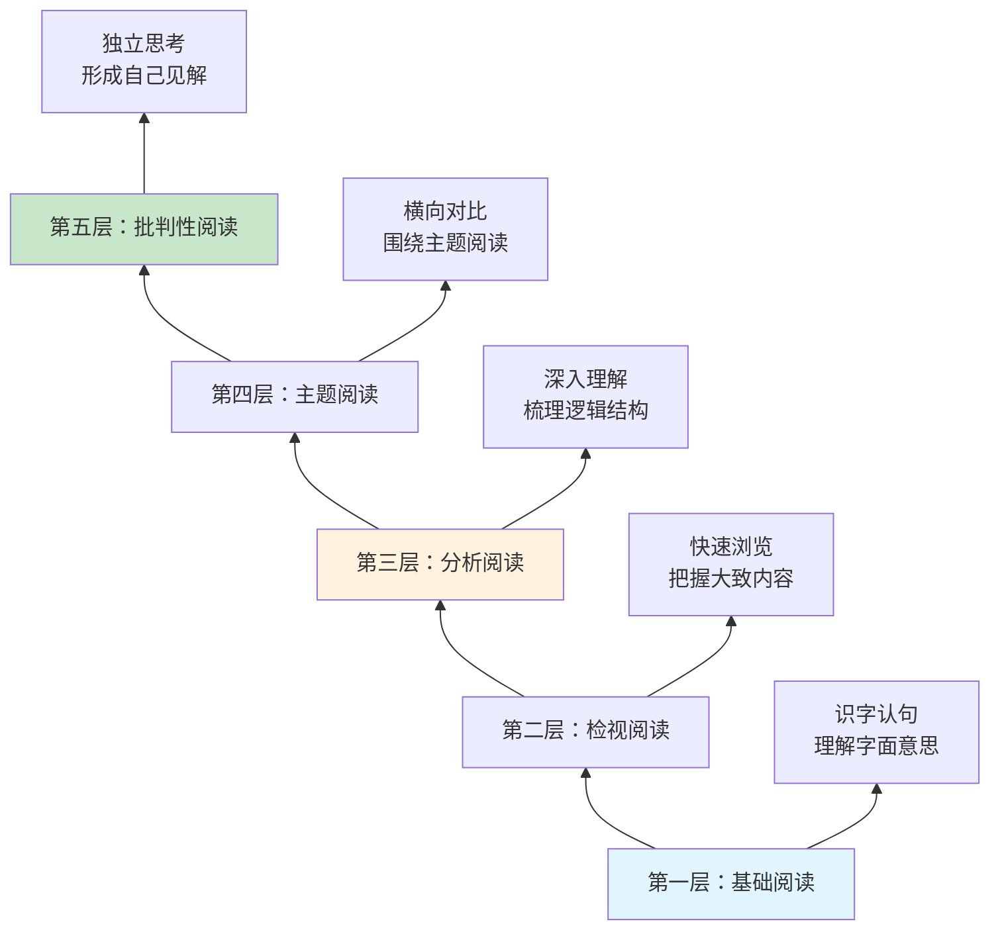

### 2.1 基础阅读与检视阅读

**基础阅读**是最底层的能力——认识文字、理解句子的字面意思。大多数成年人都已经具备这个能力，但不要小看它，很多人在阅读专业领域的内容时（比如法律文书、学术论文），连字面意思都未必能完全读懂。

**检视阅读**是快速浏览一本书，在较短时间内把握全书大致内容的能力。它不要求你深入理解每一个细节，但要求你能回答"这本书大概讲什么"。检视阅读是高效阅读的入口，帮你判断一本书是否值得深入阅读。

### 2.2 分析阅读与主题阅读

**分析阅读**是真正深入一本书——梳理作者的论证逻辑、理解核心观点、评估论据的充分性。这个层次要求你不只是"读"，而是"研究"。大多数人的阅读停留在检视阅读层面，很少做到分析阅读。

**主题阅读**是围绕一个主题，同时阅读多本书或多篇文章，进行横向对比和综合分析。比如你想深入了解"时间管理"，可以同时读《高效能人士的七个习惯》《深度工作》《番茄工作法》，对比不同作者的观点和方法，形成更全面的认知。

### 2.3 批判性阅读

**批判性阅读**是阅读的最高层次——不盲目接受作者的观点，而是带着独立思考的态度去评判。作者的论据充分吗？逻辑有漏洞吗？有没有更好的解释？在什么情况下这个观点可能不成立？能做到批判性阅读的人，才是真正意义上的"读书人"。

## 03.阅读能力的分层

将阅读能力细分为以下几个可操作的层级：

| 层级 | 能力描述 | 核心动作 | 检验标准 |
|------|----------|----------|----------|
| **Level 1** | 知道大概内容 | 浏览目录和标题 | 能说出书的主题 |
| **Level 2** | 留意关键信息 | 标记重点段落 | 能复述核心故事 |
| **Level 3** | 建立前后联系 | 做笔记、画导图 | 能梳理逻辑脉络 |
| **Level 4** | 理解深层含义 | 思考为什么 | 能解释背后原理 |
| **Level 5** | 复述并表达 | 写读书笔记 | 能讲给别人听 |
| **Level 6** | 形成自己见解 | 结合经历思考 | 有独立的观点 |
| **Level 7** | 提出质疑思考 | 批判性分析 | 能发现不足之处 |

这7个层级是递进关系，但不需要每本书都读到Level 7。根据你的阅读目的来决定读到哪个层级：消遣娱乐到Level 2就够了，学以致用需要到Level 5，想要深入研究需要到Level 7。

## 04.知道阅读的大概

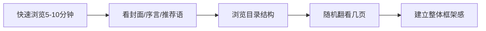

对我来说，我知道阅读是有趣的、好玩的。只有觉得有趣，才会想去学。有趣比有用更重要。

### 4.1 快速浏览建立框架

在开始阅读一本书之前，先花5-10分钟快速浏览，了解这本书大概讲什么内容。这个阶段的目标不是深入理解，而是建立一个整体的框架感。

具体做法包括：看封面、序言和推荐语，了解作者背景和写作目的；浏览目录结构，了解全书的章节安排和逻辑线索；随机翻看几页，感受作者的写作风格和内容深度。

### 4.2 带着三个问题浏览

在快速浏览时，带着三个问题会让你的浏览更有效率：

- **这本书要解决什么问题？** 了解全书的核心议题。
- **作者的核心观点是什么？** 通过序言和目录推测作者的立场。
- **我能从中获得什么？** 明确你的阅读目的和期待。

带着问题去浏览，你的大脑会自动在浏览中寻找答案，效率远高于漫无目的地翻看。

## 05.阅读书籍的目录

目录是一本书的骨架，通过仔细阅读目录，你可以快速掌握全书的知识结构。好的阅读习惯是，先把目录当作一张"地图"来研究。

### 5.1 目录的研读方法

具体做法：将目录手抄或拍照保存；标记出你最感兴趣或最需要的章节；根据目录预判每个章节可能讲述的内容；带着问题去阅读对应的章节。

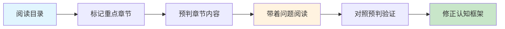

### 5.2 目录的价值不止于导航

好的目录本身就是一篇精炼的"书籍摘要"。当你熟练运用目录阅读法后，很多书你只需要读目录和关键章节就能获取80%的核心价值——这就是"二八法则"在阅读中的应用。

另外，目录也是复盘的好工具。读完一本书后，再看一遍目录，检验自己能否回忆起每个章节的核心内容。记不起来的章节，说明理解不够深入，可以有针对性地回去重读。

## 06.留意书里的故事

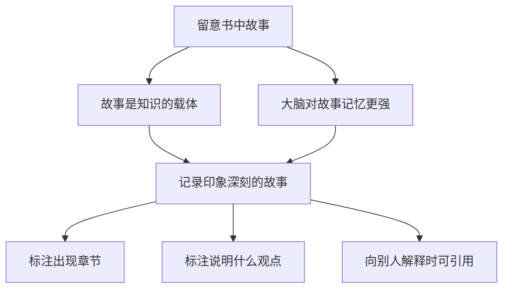

留意一下阅读中你印象深刻的故事。故事是知识的载体，人类的大脑天生对故事有更强的记忆力。

### 6.1 为什么故事比道理更好记

认知心理学研究表明，大脑对"叙事性信息"（故事）的记忆效率是"陈述性信息"（道理）的6-7倍。这是因为故事会激活大脑的多个区域——不仅是语言处理区域，还有情感区域、运动区域甚至感官区域。

当你读到"项目延期的教训"时，可能过几天就忘了；但当你读到"某团队因为没有做风险评估，导致项目延期三个月，最终负责人被辞退"这个故事时，你可能记很久。

### 6.2 如何有效记录故事

在阅读过程中，要特别关注作者用来说明观点的案例和故事。这些故事往往是作者精心挑选的，它们能帮助我们更直观地理解抽象的概念。

建议在阅读时准备一个笔记本，记录下让你印象深刻的故事，并标注它出现在哪个章节、用来说明什么观点。这样做的好处是，当你需要向别人解释某个概念时，可以直接引用这些故事。

一个实用的记录格式是：**故事概要（一句话）→ 它说明什么观点 → 我的感想或联想**。这样既保留了故事，又关联了知识，还融入了你的思考。

## 07.前后建立起联系

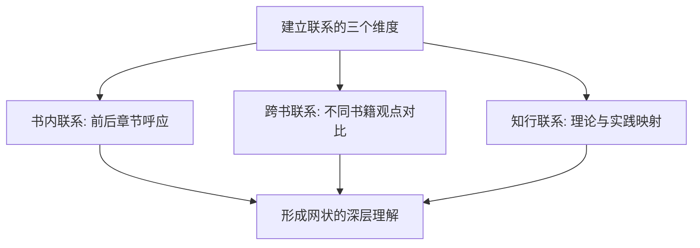

高质量的阅读不是线性的，而是网状的。在阅读过程中，要有意识地将当前阅读的内容与之前读过的内容建立联系。

### 7.1 书内联系

比如，你在读到第五章的某个观点时，发现它和第二章的某个案例有呼应关系，这就是在建立联系。这种联系越多，你对全书的理解就越深入。

一个实用的方法是在书页边缘做标注："参见第X章"或"与XX观点呼应"。这些标注会帮助你在复习时快速建立知识网络。

### 7.2 跨书联系

同时，也要将书中的内容与你已有的知识和经验建立联系。这就是"温故而知新"的过程，将新知识嫁接到已有的知识树上，形成更加稳固的理解。

比如读完《非暴力沟通》后，你发现它和之前读的《关键对话》有很多相通之处——都强调先处理情绪再处理问题。这种跨书联系能帮你形成更完整的知识体系。

### 7.3 理论与实践的联系

读书时碰到一个理论或方法，立刻想一想：这个在我的工作和生活中对应什么场景？把理论映射到实践中，既加深了理解，又为下次实际应用做好了准备。

## 08.理解故事的脉络

在留意故事的基础上，进一步理解故事背后的逻辑脉络。一个好的故事通常包含：背景设定、问题出现、解决过程和最终结果。

### 8.1 故事脉络的拆解

理解脉络的方法：尝试用自己的话，将一个故事的起因、经过、结果串联起来；思考作者为什么选择这个故事来说明观点；如果换一个故事，效果会不会一样。

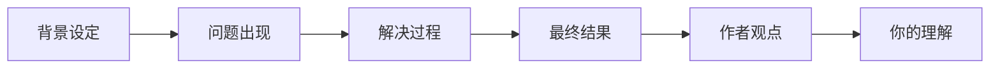

### 8.2 从故事中提炼方法论

好的读者不仅能理解故事本身，还能从故事中提炼出可迁移的方法论。比如你在一本管理书中读到"某公司通过OKR制度实现了业绩翻倍"的故事，你不仅要理解这个故事的脉络，还要提炼出"目标对齐→关键结果量化→定期复盘→及时调整"的方法论，然后思考这个方法论能否用在你自己的工作中。

这个"故事→方法论→应用"的过程，就是从Level 2到Level 5的跨越。

## 09.能够复述出内容

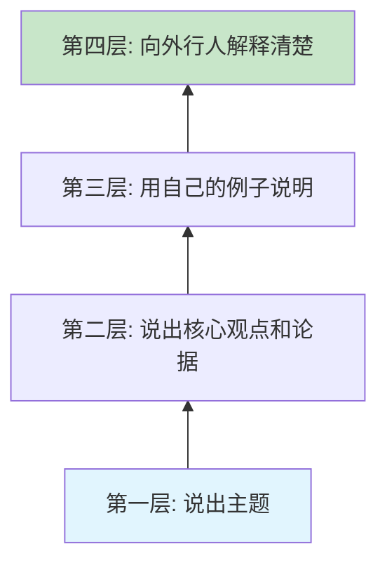

能够复述是检验理解程度的重要标准。如果你读完一本书或一个章节后，无法用自己的话复述出核心内容，说明你的理解还不够深入。

### 9.1 复述的层次

复述的几个层次：第一层，能说出这本书/章节讲了什么主题；第二层，能说出核心观点和论据；第三层，能用自己的例子来说明这些观点；第四层，能向完全不了解的人解释清楚。

每一层的跨越都意味着理解的深入。能到第三层说明你已经将书中的知识和自身经验进行了关联，能到第四层说明你已经真正吃透了这些内容。

### 9.2 复述的训练方法

建议每读完一个章节，花5分钟合上书，尝试用自己的话复述核心内容。如果发现说不清楚的地方，再回去重新阅读。

一个更高阶的训练方法是"教学复述"——找一个朋友或同事，把你刚读到的内容讲给他听。在"教"的过程中，你会发现自己理解模糊的地方，这些模糊的地方就是你需要回去重读的重点。

## 10.拥有自己的理解

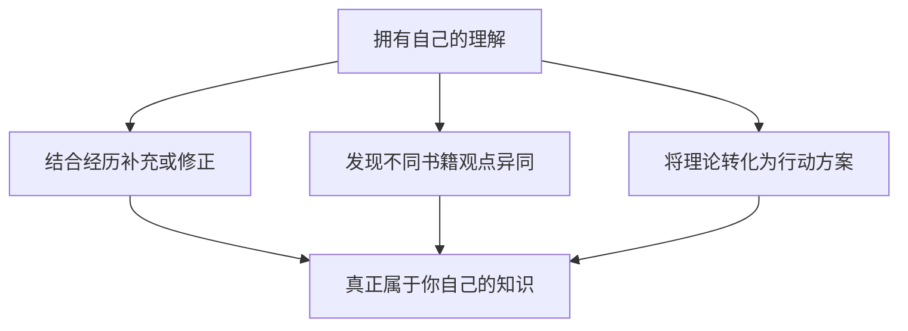

阅读的最终目的不是记住作者的观点，而是在此基础上形成自己的理解和见解。

### 10.1 独立理解的标志

具有独立理解的标志：能够结合自己的经历和认知，对书中的观点进行补充或修正；能够发现不同书籍之间观点的异同，进行比较分析；能够将书中的理论转化为可落地的行动方案。

### 10.2 写读书笔记

写读书笔记是培养独立理解的最佳方式。好的读书笔记不是抄书，而是写下你的思考、联想和感悟。一个实用的读书笔记结构是：

| 部分 | 内容 | 目的 |
|------|------|------|
| 核心观点 | 用一句话概括书/章节的核心 | 检验你是否理解了主旨 |
| 印象最深的点 | 记录2-3个最有启发的观点或故事 | 保留最有价值的信息 |
| 我的联想 | 联系自己的经历和已有知识 | 将新知识嫁接到已有体系 |
| 行动计划 | 我打算如何应用这些知识 | 从"知道"走向"做到" |

## 11.提出疑惑和思考

批判性阅读是阅读能力的最高层次。它要求我们不盲目接受作者的观点，而是带着质疑的态度去思考。

### 11.1 批判性阅读的要点

作者的论据是否充分？是否存在逻辑漏洞？作者的观点是否有适用边界？在什么情况下可能不成立？是否存在作者没有考虑到的角度？如果将这些观点应用到不同场景，结果会怎样？

### 11.2 批判不是否定

需要特别说明的是，批判性阅读不是"找茬"或"全盘否定"，而是在尊重作者的基础上进行独立思考。一个好的批判性读者，既能发现书中的价值，也能识别其局限性。

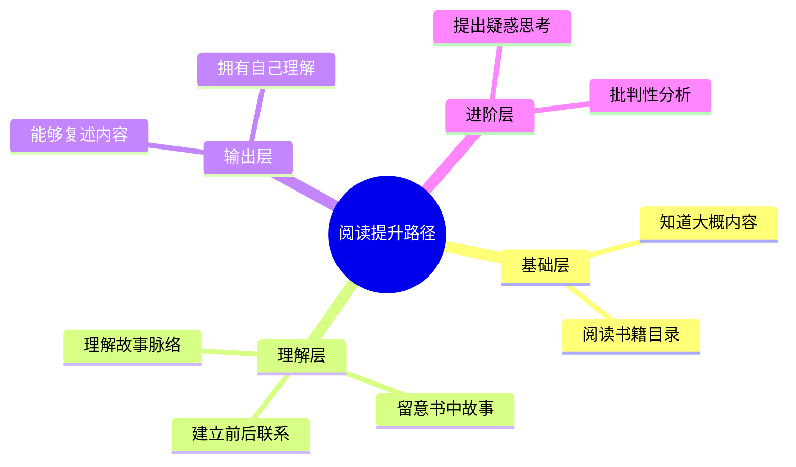

## 12.场景化阅读训练

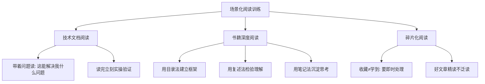

### 12.1 技术文档的阅读

技术文档的阅读目标是"会用"，而不是"读完"。带着具体的问题去读，读到能解决问题的部分就停下来动手实操。在实操中遇到新问题，再回来继续读。这种"读→做→读→做"的交替方式，比从头读到尾效率高得多。

### 12.2 书籍的深度阅读

对于值得深入的书籍，建议采用"三遍阅读法"：第一遍快速浏览，建立框架感（30分钟）；第二遍精读重点章节，做标注和笔记（数小时到数天）；第三遍复盘回顾，写读书总结（1小时）。

### 12.3 碎片化信息的阅读

对于公众号文章、新闻资讯等碎片化内容，要学会"即时处理"——要么立刻读完并提炼核心，要么果断跳过。不要养成"先收藏稍后再看"的习惯，大量研究表明，收藏夹里的内容，90%以上永远不会被打开。

## 13.今天起改变三点

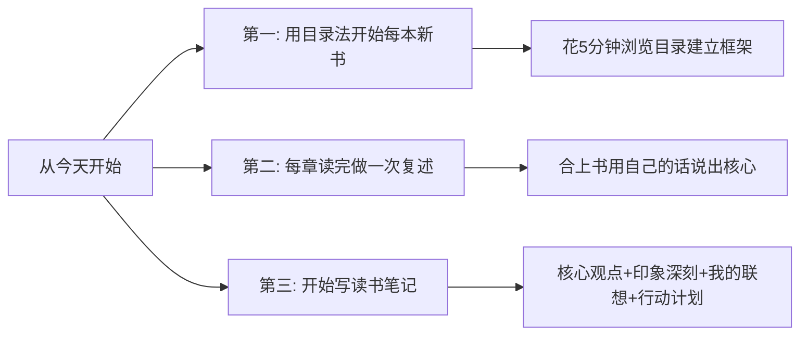

**第一，从今天起，每开始一本新书，先花5-10分钟浏览目录。** 不要急着翻到正文就开始读。先把目录当作地图研究一遍，标记出你最感兴趣的章节，预判每个章节可能讲什么，然后带着问题和预期去阅读。

**第二，每读完一个章节，合上书做一次复述。** 花3-5分钟用自己的话说出这个章节的核心内容。说不清楚的地方就回去重读。坚持一个月，你的阅读理解力和记忆力一定会有显著提升。

**第三，开始写读书笔记。** 不需要长篇大论，每本书写下"核心观点、印象最深的点、我的联想、行动计划"这四部分就够了。写笔记的过程就是深度思考的过程，它会让你的阅读价值翻倍。

## 14.课后作业思考下

1. 回顾你最近读的一本书，你能用自己的话复述出核心内容吗？如果不能，说明你需要在哪些方面加强训练？
2. 在阅读过程中，你是否有意识地将新内容与已有知识建立联系？试着用"跨书联系"的方法，找两本你读过的书的共同点。
3. 尝试用本章介绍的分层方法，评估一下你当前的阅读能力处于哪个层级？你最想提升到哪个层级？
4. 选一本书，按照"目录浏览→重点精读→故事留意→复述核心→写读书笔记"的完整流程阅读一遍，看看效果如何。

