# 6.4 沟通能力的演进
#### 目录介绍
- [01.什么是沟通能力](#01什么是沟通能力)
- [02.高效倾听的模型](#02高效倾听的模型)
- [03.三明治的沟通法](#03三明治的沟通法)
- [04.别总封闭性问题](#04别总封闭性问题)
- [05.女性生气沟通法](#05女性生气沟通法)
- [06.非暴力沟通模型](#06非暴力沟通模型)
- [07.沟通中提问技巧](#07沟通中提问技巧)
- [08.螺旋推进沟通法](#08螺旋推进沟通法)
- [09.SOFTEN沟通六原则](#09soften沟通六原则)

## 01.什么是沟通能力

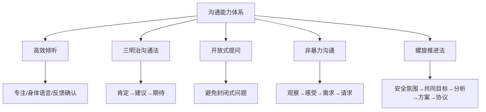

人类是社会动物，人与人、人与群体通过"沟通"传递信息和情感。沟通可以获取或传递信息和知识，也可以促成一致观点或协议，最重要的是有助于情感管理。

街头大妈们家长里短地唠嗑，能不能叫"沟通"？大学课堂上教授口若悬河、滔滔不绝地讲课，能不能叫沟通？

大妈聊天漫无目的，最多是"多向信息交流"，不是"沟通"；教授讲解虽有目的，但如果没有跟学生互动，那也不算是"沟通"。

什么是沟通呢？沟通是"有目的的多向信息交流"。沟通的方式一定是谈话吗？不是，能交流信息即可，不拘泥于形式。

在沟通过程中要时刻有意识地提醒自己：沟通是有目的的：你的初衷是什么？你现在的行为和言语有没有妨碍你完成你的初衷？沟通是多向信息交流：你有让对方了解到你的真实想法吗？你了解到对方的真实想法了吗？

## 02.高效倾听的模型

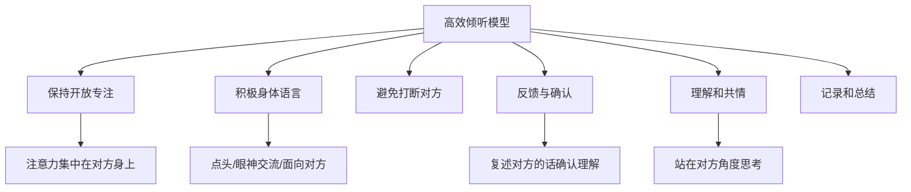

### 2.1 理解高效倾听

高效倾听模型是一种帮助人们提高倾听效果的框架或方法。在高效倾听模型中，倾听不仅仅是听到对方说话的内容，更是要理解对方所表达的情感、需求和意图。

高效倾听模型通常包括多个方面，例如注意对方的语气、语调和身体语言，以及积极回应和反馈。

高效倾听模型的应用可以提高人际交往的效果，帮助人们更好地与他人建立联系和合作。通过倾听，人们可以更好地理解对方的需求和期望，从而更有效地解决问题和达成共识。

### 2.2 应用高效倾听

高效倾听模型的应用是一个多层次、多方面的过程，旨在提升我们的倾听效果，从而更有效地与他人沟通和交流。以下是一些关于如何应用高效倾听模型的建议：

1. 保持开放和专注：高效倾听首先要求我们保持开放的态度，将注意力完全集中在对方身上。避免分心，比如看手机或想其他事情，确保自己能够全神贯注地听取对方的观点和感受。
2. 使用积极的身体语言：身体语言在沟通中起着至关重要的作用。通过面向对方、点头表示理解、保持眼神交流等积极的身体语言，我们可以传达出对对方的尊重和关注，从而鼓励他们更加开放地表达自己的想法。
3. 避免打断对方：在倾听过程中，我们要尽量避免打断对方，即使我们不同意他们的观点或想表达自己的想法。给予对方充分的时间来表达，尊重他们的发言权和思考过程。
4. 反馈与确认：在倾听时，适时地给予反馈和确认可以帮助我们更好地理解对方的意思。可以通过复述对方的话、提出疑问或总结对方的观点来确认自己的理解是否正确。
5. 理解和共情：努力理解对方的观点和感受，尝试站在他们的角度思考问题。通过共情，我们可以更好地把握对方的真实意图和需求，从而更有效地进行沟通。
6. 记录和总结：在倾听过程中，可以适当地记录关键信息或对方的观点，以便在沟通结束后进行总结和回顾。这有助于我们更全面地把握对话内容，并为解决问题或达成共识提供有力的支持。

## 03.三明治的沟通法

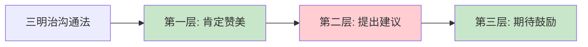

### 3.1 什么是三明治沟通

关于沟通，如何提出自己的要求和建议，以前看到过"三明治"沟通法，即把好的放在上下，把不好的夹在中间。

因此，当我们希望对方改变什么的时候，可以通过这样的方式来进行。

### 3.2 三明治沟通操作

大概做法：首先先认可对方好的一面，然后提出对方改变的地方，最后再表明对方改变之后更好的样子。

1. 首先：你这个人很好，很努力很漂亮很温柔。这是肯定赞美她。首先肯定对方身上好的地方，让对方飘入云端。
2. 然后：但是，如果你能不能不熬夜到凌晨。这是指出对对方的要求和希望。委婉的道出对方身上不好的一些地方，在肯定之后再说出来，会让对方感受更好。
3. 最后：那你就真的十全十美啦。这是最后的肯定。对对方改变之后的肯定和高度的赞美。

用"三明治沟通法"，先认同，赏识，肯定，关爱他的积极面，再加上鼓励，希望，信任她的有待完善的另一面。

### 3.3 不要一味地批评

一味的批评更容易让人产生抵抗的情绪。三民治沟通法把一味的批评和指责变成了站在对方角度思考问题，然后合理的提出期待。不仅不会挫伤对方的自尊和积极性，还能激活对方主动改变的效率。

好好说话就包括明确的表达自己，说出的话不会伤害别人，能让别人有很好的体验。

## 04.别总封闭性问题

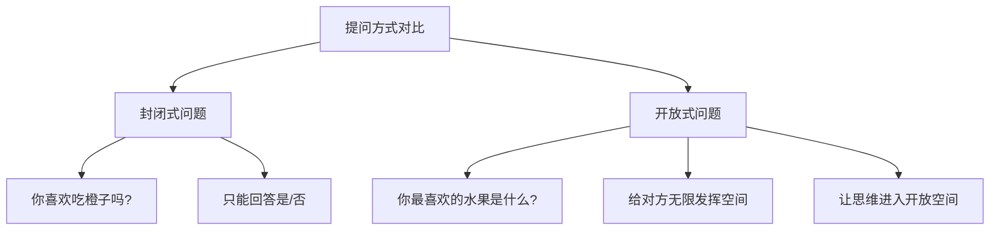

### 4.1 不要问封闭问题

不要问封闭问题。问对方的问题大多数都是封闭式的话题，让对方只能从我们给出的选择当中进行回答。聊天和沟通当中，很多时候我们问对方的问题，其实都是一个封闭的问题。

什么叫做封闭性问题。就是在问题当中给了对方一个选择，让对方非此即彼，只能选择"是"或者"不是"，"有"或者"没有"，"好"或者"不好"等等。

比如，"你喜欢吃橙子吗？"这就是一个封闭性的话题，因为对方只有"喜欢"或者"不喜欢"两种选择。

### 4.2 开放性话题

破除聊天当中傻瓜式的选择。开放性话题则是让对方主动说出来，而不是被动的选择，开放性话题让对方有更多表达的可能，而不是在已经给出的选择当中作出简单的回复。

比如："看你去了那么多地方，你最喜欢的是哪里呀？"。这个问题就是一个开放性的问题，它更容易让对方说出自己最喜欢的地方，甚至说出喜欢的理由。

### 4.3 多用开放性话题

当然，对于封闭性的话题，如果对方很会聊天，他也可能不会规规矩矩的回答。但是，如果我们遇到这样会聊天的人，可能也就不需要费尽脑汁去做那么多了。

比如：你可能会问"你周末的时候会去健身吗？"。给对方两种选择，会或者不会。但是如果你换成"你周末休息的时候，一般最喜欢做什么呀？"，就给了对方发挥的空间，给了他无数的可能。

在不知道对方最想说的话题是什么的时候，尽量用开放性话题去探索寻找，不要给对方限定范围，让他只能被动从当中选择。让我们的思维从一个封闭的空间进入到一个开放的空间，也是给生活重新开了一扇门。

## 05.女性生气沟通法

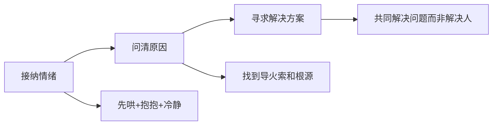

### 5.1 看一下背景

生气的理由有千万种，但吵架并不能解决问题，只是在宣泄情绪。所以，气头上的姑娘，你多说讲一句大道理都是火上浇油，你稍微大声点说话就是在凶她!

这时候她更多的是需要被哄，被道歉，被亲亲，被抱抱，被理解她有可以生气的"偏爱"。

等那股气下头之后，才是双方共同解决问题之时，明事理的姑娘，不会让你哄太久，也不会逃避问题。

### 5.2 为何哄她无效

在女生生气的每一个瞬间，总有"正义使者"加身的男友，试图讲道理、分对错、明是非。

不证明是女友无理取闹不罢休，或者用男生理性思维想要，弄清缘由，当场解决问题，结果当然是无效啦。

### 5.3 做到有效沟通

第一步：首先接纳她的情绪，并舒缓她的情绪。说白了就是先哄，给她一个抱抱，让她冷静下来。 情绪上头真心不是解决问题的好时机。

第二步：其次问清生气的原因。任何矛盾都有导火索，也许是针对事情本身，也许是对过去旧账的延伸，也许是情绪的累积，等她冷静下来，愿意沟通时候，双方再好好沟通谈心。

第三步：最后才是寻求解决方案。问题摆在眼前，双方的共同目的就是怎么一起解决问题，如何在未来规避同样的问题，而不是解决提出问题的人。

最后时刻记住，吵架只是情绪宣泄，不是解决方式。为了甜甜的爱情能安稳着陆，男生女生都要多一些理解多一些包容，多一些努力，真诚沟通，双向奔赴。

## 06.非暴力沟通模型

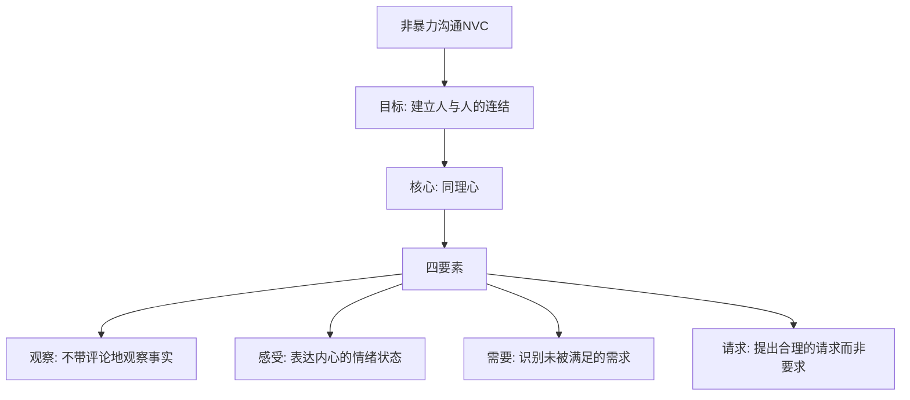

### 6.1 何为非暴力沟通

非暴力沟通（Nonviolent Communication，NVC）是由美国心理学家马歇尔·卢森堡（Marshall Rosenberg）创立的一种沟通模式和冲突解决方法。

它旨在促进人际关系的和谐、理解和合作，以及解决冲突和建立互惠关系。非暴力沟通的核心理念是，每个人都有基本的人类需求，而冲突和问题通常是由于这些需求没有得到满足而产生的。

通过非暴力沟通，人们可以学习如何表达自己的需求和感受，以及如何倾听和理解他人的需求和感受。

非暴力沟通的四个要素包括：
1. 观察：观察客观事实，避免评判和批评。
2. 感受：表达自己对观察到的事物的感受，而不是陷入情绪化或指责。
3. 需求：识别和表达自己的需求，以及他人的需求。
4. 请求：明确地提出请求，以满足自己和他人的需求，而不是使用要求、命令或威胁。

通过运用这些要素，非暴力沟通可以帮助人们建立更深入的沟通，增进彼此的理解和共情，解决冲突，并促进和谐的人际关系。非暴力沟通的应用范围广泛，可以用于个人关系、家庭、工作场所、社区和国际冲突等各个领域。

### 6.2 非暴力沟通框架

整体上，非暴力沟通可以分成三个部分：

**问题域**：在日常沟通中，常见的"暴力沟通"有哪些？也即是疏离生命的语言。常见的有四种：
- 道德评判：使用道德标准去分析、指责、批评他人，给人贴标签，甚至辱骂他人。
- 推卸责任：将原本属于自己责任的事情推卸给对方或第三方，通俗地讲就是"甩锅"。
- 做比较：将自己或他人与其他人进行比较，比如"你看看别人家的孩子"。
- 要求：对自身或他人的期许，当期许没有得到满足时，可能会用道德等去指责对方。

**战略域**：非暴力沟通的理论和技巧，包括目标（与人建立连结）、核心（同理心）、四要素（观察、感受、需要、请求）。

**战术域**：将非暴力沟通应用到六个场景，分成三类：面对自己（爱自己、宽待自己）、面对感受（表达感激、赞美和愤怒）、面对矛盾（化解冲突、调和纷争）。

### 6.3 保持同理心

同理心是非暴力沟通的核心。在倾听他人前，我们要清空先入为主的想法，全身心地聆听他人的观察、感受、需要和请求。

在必要的时候，我们可以"反馈"、"复述"他人的意思。在他人感到真正被理解后，再来关注解决方案或者提出请求。

要做到同理心其实并非那么容易，因为需要我们完全抛弃自己内心的起伏、过往的经历，不含任何杂念，只是纯粹地倾听。

### 6.4 不带评论的观察

观察是眼睛看到的、耳朵听到的、嗅觉闻到的、触觉感觉到的；而评论是经过了内心对这些输入的二次加工，是经过大脑处理的。

如果我们去评论他人的时候，他人一般会产生抗拒的心理，所以想要与他人开始连结就需要去"不带评论的观察"。

### 6.5 感受与需要

感受是一个人内心对事情的反应，更多是一种情绪状态。我们可以用词汇去表达积极或消极感受，同时也要允许自己表达感受、袒露脆弱。

需要是消极感受背后的根源——某个需要没有被满足。在沟通过程中，挖掘对方的需要至关重要。当我们听到不中听的话时，有四种态度：指责自己、指责他人、体会自己的感受与需要、体会他人的感受与需要。

如果我们能够直接说出自己的感受和需要，他人就能够对我们做出善意的回应。

### 6.6 请求而非要求

非暴力沟通的最后一步是按照对方的需要提出合理的请求。最重要的是区分请求和要求：

- **请求**：如果对方拒绝，不会对对方产生压力或惩罚，对方是主动愿意提供帮助的。
- **要求**：如果对方拒绝，会对对方产生压力或惩罚，让对方感觉到"不得不"的被动支持。

提出请求时还需要注意：阐明请求的目的；主动诚恳地提出；采用正向积极的语言提出清晰、具体的请求；如有必要，可以邀请对方复述请求。

### 6.7 实战应用场景

**面对自己**：善待自己可能是人生中最重要的课题。当自己犯错时，应该对自己进行"哀悼"和"自我宽恕"，而不是道德绑架。如果用"自己的哪些需要没有被满足"来评价自己，就可以避免压抑和愤怒。

**表达感激与赞赏**：通过三个步骤组织：对方做了什么行动给我们带来了贡献；我们有哪些需要被满足了；因此我们产生了什么愉悦感受。

**表达愤怒**：我们感到愤怒是因为某个需要没有被满足，他人并不对我们的愤怒负责。处理愤怒的策略：停下来深呼吸；辨识脑海的评判性想法；连结自己的需要；表达自己的感受和未被满足的需要。

**化解冲突**：在解决冲突时，不应该讨论事件或策略，而是首先找到双方的需要。先对双方进行同理（观察、感受），确保他们的痛苦能够被听到，然后在了解双方需要后再去制定策略。

## 07.沟通中提问技巧

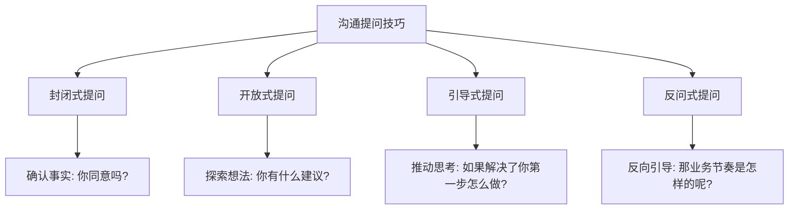

会提问的人通常都是沟通达人，他们可能在沟通时说话不多，但往往能提出一些发人深省的问题，让你打开一个新世界的大门。善于提问的人才是真正引导沟通方向的人。

一般来说，提问的方式有四种，不同的场合、环境、目的需要采用不同的提问方式：
- **封闭式**：你同意这个方案吗？我们能按期完成这个任务吗？适用于确认事实和快速决策的场合。
- **开放式**：你有什么好的建议吗？适用于头脑风暴和探索性交流的场合。
- **引导式**：如果资源的问题解决了，你第一步打算怎么做？适用于推动对方思考和行动的场合。
- **反问式**：我想问一下，这个需求开发排期是怎么样的？那业务的运营节奏是怎样的呢？适用于反向引导和深入了解的场合。

在不知道对方最想说的话题是什么的时候，尽量用开放性话题去探索寻找，不要给对方限定范围。同时要善用社交语言（非语言反馈）和情感呼应，让对话自然而然地进行下去。

## 08.螺旋推进沟通法

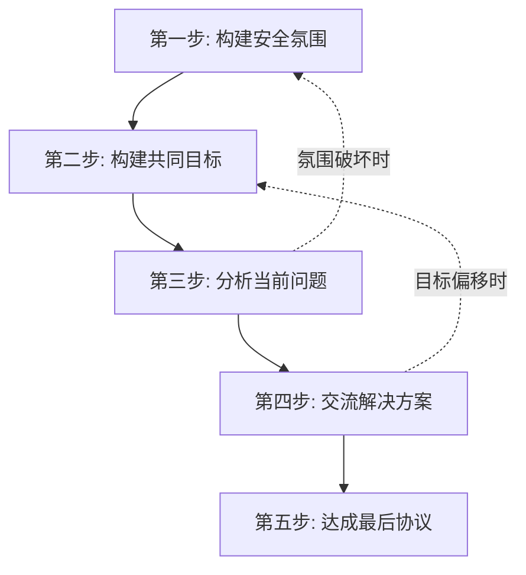

"螺旋推进"模型是一种非直线型、迂回推进的沟通模型，它侧重沟通的流程。基础概念包括四个重要因素：安全氛围、监控器、共识线、情感线。

### 8.1 构建安全氛围

沟通前先确保双方心平气和，愿意敞开心扉。如果你有问题在先，对方很可能处于消极对抗状态，此时不要急着解释或埋怨，而是先让对方相信你很在意他的想法，带着十分的诚意。等他心绪平静下来再往下推进。

### 8.2 构建共同目标

让对方感觉到"你们有共同的目标，沟通成功对双方都有利"。要避免两个雷区：一是越过这步直接分析问题，会让对方对你的动机产生怀疑；二是让对方觉得你"只为达成自己的目的而来"。

如果措辞不当导致对话失去安全氛围，要退一步重新构建安全氛围——这就是"螺旋推进"的含义。

### 8.3 分析问题与方案

在问题和原因没有完全浮出水面时，不要急着讨论方案。原因是：可能看到的是表面问题而非本质问题；可能看到部分问题而非全部问题。

交流解决方案时，要带着"这是我的建议，希望得到反馈"的心态。永远不要陷入"二选一"陷阱，要坚信"第三种方案"能让大家都满意。避免老好人心态和不敢表达观点两个误区。

### 8.4 达成协议与沟通效果

达成协议后要充分尊重并带头执行，建立良好的信任关系。

从情绪体验和信息匹配的维度，沟通效果可划分为四个区域：
- **安慰区**：情绪好但共识度不高，互相"打哈哈"。
- **目标区**：情绪好且共识达成，是期望达到的状态。
- **破坏区**：没达成共识且场面不和谐，最糟糕的情形。
- **风险区**：共识达成但人际关系变差，难以齐心协作执行。

## 09.SOFTEN沟通六原则

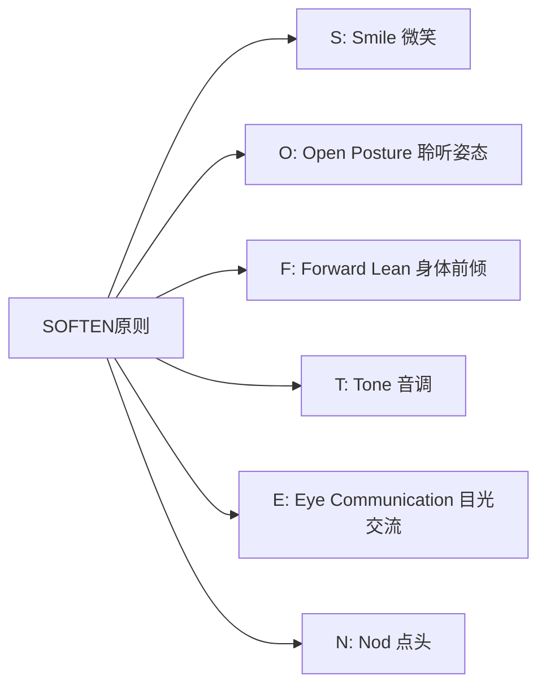

沟通中，要想准确传达观点，有两个关键：逻辑和情绪。如果发现自己沟通缺乏逻辑，可以从"讲三点"这个简单的技巧入手锻炼。如果发现表达逻辑没问题但对方难以接受，那很可能是沟通过程中传递的情绪出了问题。

SOFTEN沟通六原则就是解决沟通情绪问题的好方法：
- **S：Smile（微笑）**，保持微笑更容易获得他人的信任和好感。微笑是最简单也最有效的"破冰"工具。
- **O：Open Posture（聆听姿态）**，面对讲话人站直或端坐，让他认为你时刻在准备聆听。身体朝向对方，不要侧身或背对。
- **F：Forward Lean（身体前倾）**，交谈中不时将身体前倾，表示你专心在听。前倾是一种"我对你说的很感兴趣"的身体信号。
- **T：Tone（音调）**，谈到重要内容时，语速放慢、提高音调着重强调。语音语调的变化能让表达更有感染力。
- **E：Eye Communication（目光交流）**，注视会让对方感受到你对谈话内容的重视。注意不要死盯着对方，自然地在眼睛和脸部之间移动视线。
- **N：Nod（点头）**，偶尔向对方点头，不只表示赞同，同时说明你认真地听了他的讲话。

SOFTEN六个字母组成的单词意为"柔和"，这也正是它要传递的核心理念：让你的沟通姿态变得柔和，对方才更容易接受你的观点。

## 10.场景化沟通训练

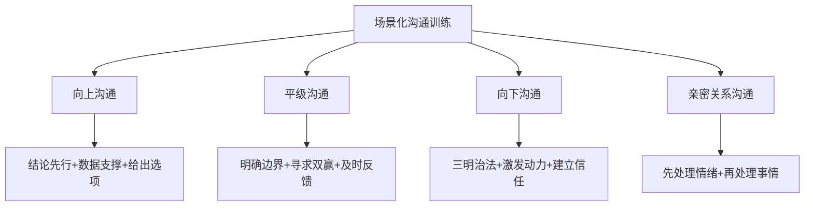

### 10.1 向上沟通

和领导沟通时，最重要的原则是"节省领导的时间"。具体做法：结论先行（先说结论再说原因）、数据说话（用事实和数据支撑你的观点）、给出选项（不要只提问题，要带着方案来——最好是2-3个方案供选择）。

### 10.2 平级沟通

和同事沟通时，最容易出现的问题是"边界模糊"和"目标不一致"。建议在沟通前先明确：这件事谁负责什么？标准是什么？时间节点是什么？沟通后用文字确认共识，避免后续扯皮。

### 10.3 亲密关系沟通

和伴侣、家人沟通时，情感的权重远大于信息的权重。记住"先处理情绪，再处理事情"这个原则。对方向你倾诉时，他/她要的不一定是解决方案，可能只是一个理解和陪伴。

## 11.今天起改变三点

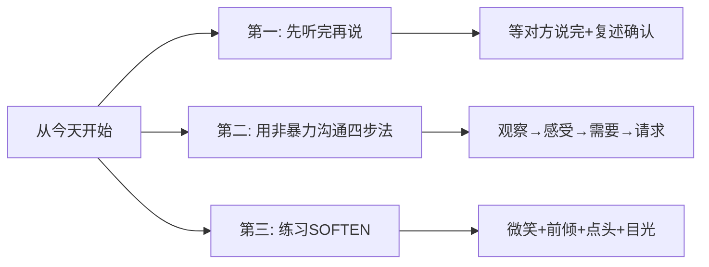

**第一，养成"先听完再说"的习惯。** 从今天开始，在任何沟通中，等对方说完之后再开口。不打断、不急于反驳。听完后先用一句话复述对方的核心意思："你说的是XX对吗？"确认理解正确后再表达自己的想法。这个简单的改变，能大幅减少沟通中的误解和冲突。

**第二，在下一次需要提出建议或表达不满时，用非暴力沟通的四步法。** 不要说"你总是XX"，而是说"当我看到XX（观察），我感到XX（感受），因为我需要XX（需要），你能XX吗（请求）？"。用这个结构来组织你的表达，对方会更容易接受。

**第三，在明天的每一次对话中，刻意练习SOFTEN原则。** 保持微笑，身体面向对方，适时前倾，用语调变化来强调重点，保持目光交流，不时点头回应。坚持一周后，你会发现别人对你的态度会有明显变化。

## 12.课后作业思考下

1. 回忆你最近一次沟通不顺利的经历，用非暴力沟通的四要素（观察、感受、需要、请求）重新组织一遍你的表达，看看效果是否会不同。
2. 在接下来一周内，每天选择一次沟通，刻意使用"三明治沟通法"来给出建议或反馈，记录对方的反应有何不同。
3. 找一位信任的朋友或同事，请他/她在和你沟通后给你反馈：你的倾听做得怎么样？有没有打断？有没有给出有效的回应？
4. 用螺旋推进法的框架，模拟一次你即将进行的重要沟通（比如和领导谈升职、和合作方谈方案），把五个步骤写下来提前演练。

