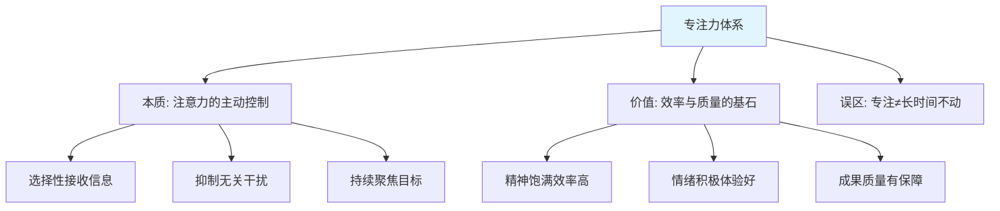
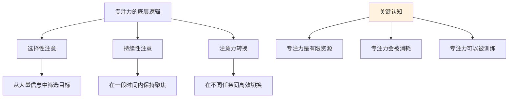
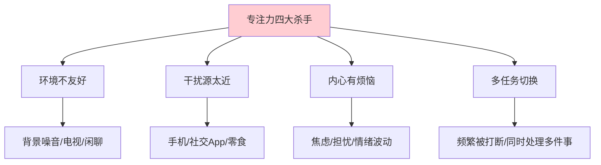
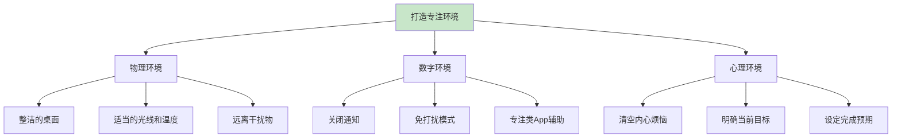
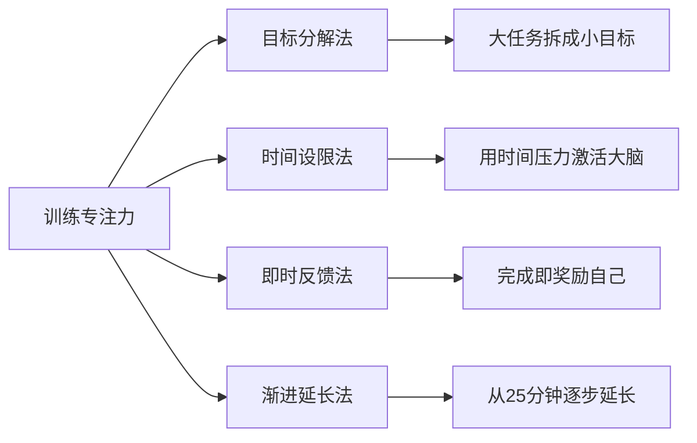
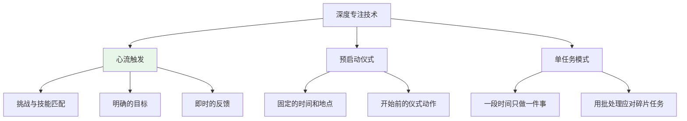
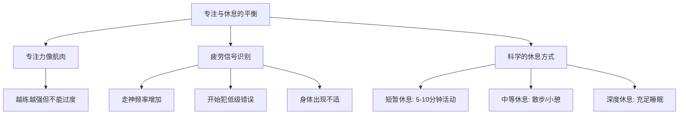
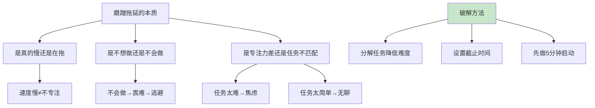
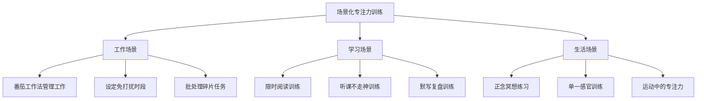
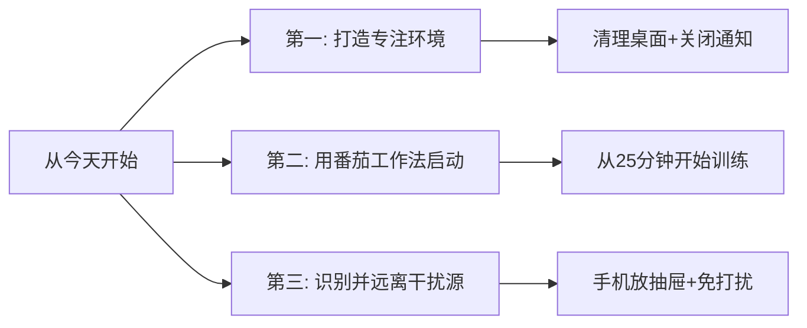

# 7.1专注能力的提升
#### 目录介绍
- [01.什么是专注能力](#01什么是专注能力)
- [02.专注力的底层逻辑](#02专注力的底层逻辑)
- [03.专注力的四大杀手](#03专注力的四大杀手)
- [04.打造专注的环境](#04打造专注的环境)
- [05.训练专注的方法](#05训练专注的方法)
- [06.深度专注的技术](#06深度专注的技术)
- [07.专注与休息的平衡](#07专注与休息的平衡)
- [08.磨蹭拖延与专注力](#08磨蹭拖延与专注力)
- [09.场景化专注力训练](#09场景化专注力训练)
- [10.今天起改变三点](#10今天起改变三点)
- [12.课后作业思考下](#12课后作业思考下)

## 01.什么是专注能力

### 1.1 专注力的定义

专注力是指人们在进行活动时，心理活动朝向某一事物，有选择地接收信息并抑制其他干扰的能力。当一个人处于专注状态时，精神饱满、做事效率高、情绪积极，身体也会感到舒适，不会轻易受到周围环境的影响。

简单来说，专注力就是"在一段时间内，把注意力集中在一件事上，排除干扰，高效完成"的能力。它不是天赋，而是一种可以通过训练不断提升的技能。

### 1.2 专注力的真实困境

你可能无数次地遇到过这样的情形：写文章时有个概念没搞明白，然后上网去查，查到之后开始专心研究这个概念，并进行延展——然后你感觉有点累了，忍不住打了一局游戏或看了一集剧来"奖励自己"——最后你发现三个小时过去了，你最初要完成的写作依然停留在开头的几十个字上。

你完全偏离了任务轨道。这不是意志力的问题，而是专注力管理的问题。你没有建立起"保护专注"的机制，也没有掌握"恢复专注"的方法。

### 1.3 专注力与成功的关系

在学生时代，老师批评学生时常说"注意力不集中，上课不认真听讲"，似乎专注力好就等于好学生。这种观念过于简单化了。专注力确实是成就的重要因素，但它不是唯一因素，也不是固定不变的。

真正需要关注的是：你的专注力是否足够支撑你完成当前阶段最重要的任务。专注力的培养是一个渐进过程，从很短的时间开始，慢慢提高，而且它跟自控力、思考能力等是紧密结合的。

## 02.专注力的底层逻辑

### 2.1 专注力的三种类型

| 类型 | 定义 | 场景举例 | 训练重点 |
|------|------|----------|----------|
| **选择性注意** | 从大量信息中筛选出目标信息 | 嘈杂环境中听清对方说话 | 提高信息过滤能力 |
| **持续性注意** | 在一段时间内保持对某事的关注 | 专心读书两小时 | 延长专注时长 |
| **注意力转换** | 在不同任务间灵活切换 | 从写代码切换到开会讨论 | 减少切换损耗 |

大多数人所说的"专注力差"，其实是持续性注意不够——无法在较长时间内保持对一件事的聚焦。而工作中最隐蔽的效率杀手，往往是注意力转换过于频繁导致的损耗。

### 2.2 注意力残留效应

每次切换任务时，你的大脑不会瞬间从上一个任务中脱离。研究表明，当你从任务A切换到任务B时，大脑中仍有一部分在处理任务A的信息，这种现象叫做"注意力残留"。

注意力残留会导致：切换后的前几分钟效率极低；频繁切换累积下来，一天可能浪费数小时；大脑感到疲惫，但实际产出很少。这就是为什么"一段时间只做一件事"是最高效的工作方式。

### 2.3 区分不专注和没兴趣

在评判自己"专注力差"之前，需要先区分两个概念：到底是"不专注"，还是"没兴趣"。如果你对感兴趣的事情能够长时间专注（比如打游戏、看小说），说明你的专注力本身没有问题，问题在于如何把这种专注力迁移到你需要完成的任务上。

解决方案是找到任务中的"兴趣锚点"，或者通过目标分解、及时反馈等方式来创造专注的动力。

## 03.专注力的四大杀手

### 3.1 环境不友好

环境对专注力的影响远超你的想象。最典型的场景是：你想专心写方案，但旁边的电视开着、同事在闲聊、手机不时弹出通知——你指望在这种环境下保持专注，就像指望在嘈杂的集市上安静阅读一样不切实际。

需要特别警惕的是"背景噪音陷阱"：很多人习惯一边工作一边放视频或音乐当"背景音"，以为这样更舒适，实际上这种状态下大脑处于"刺激过度"的状态，看似在工作，实际效率大打折扣。

### 3.2 干扰源太近

有时候不是你的意志不坚定，而是"敌人"太狡猾。当手机、平板、零食摆在触手可及的地方时，你的注意力就像被磁铁吸引一样，不自觉地被它们拉走。

解决方法很简单也很有效：把这些干扰物从你的视线中移走。当你的工作桌上只剩下与任务相关的东西时，你会更容易进入专注状态。具体措施包括：手机开启免打扰模式、关闭不必要的通知、工作时把手机放在抽屉里、使用专注模式App等。

### 3.3 内心有烦恼

工作目标很明确，桌面也收拾干净了，但内心却没有清空。内心的焦虑、担忧和情绪波动，是最隐蔽也最难对付的专注力杀手。

处理方法是分类应对：如果是急需解决的事情（比如家人生病需要处理），那就先停下来处理完再工作。如果是对未来的担忧（比如担心项目进度、担心考核结果），可以把这些烦恼写下来——写在纸上的烦恼会比留在脑中的烦恼更容易被"搁置"。告诉自己：我现在不处理这件事，等专注时间结束后再来面对。

### 3.4 多任务频繁切换

这是现代人专注力的最大杀手。一会儿回复消息，一会儿看邮件，一会儿又跳到另一个需求——看似忙碌了一整天，实际产出却少得可怜。

每一次任务切换都会产生"注意力残留"，你需要额外花时间让大脑重新进入状态。频繁切换的代价是：你可能需要花15-25分钟才能完全恢复到切换前的专注状态。一天被打断5次，仅恢复时间就可能消耗1-2小时。

## 04.打造专注的环境

### 4.1 物理环境的优化

一个好的专注环境，首先是"减法"——减少一切不必要的视觉和听觉干扰。桌面只放与当前任务相关的物品；如果是开放式办公室，可以戴上降噪耳机；如果家里干扰太多，可以找一个固定的"专注角落"。

关键原则是：环境越简单，大脑需要过滤的信息越少，可以投入到任务上的注意力就越多。

### 4.2 数字环境的管控

在数字时代，手机和电脑是最大的干扰源。建议采取以下措施：

- **消息免打扰**：微信、邮箱等通讯工具设为免打扰，集中时段统一处理
- **关闭推送通知**：除了电话，关闭所有App的推送通知
- **浏览器管控**：专注工作时只打开与任务相关的标签页，关闭社交媒体和新闻网站
- **使用专注工具**：如番茄钟App、网站屏蔽插件等，给自己创造一个"数字围墙"

### 4.3 心理环境的准备

开始工作前花2-3分钟做"心理清零"：把脑中盘旋的事情快速记录在清单上（不用解决，只需要记下来），然后明确告诉自己：接下来的XX分钟，我只做XX这一件事。这个简单的仪式感可以帮助大脑从"分散模式"切换到"专注模式"。

## 05.训练专注的方法

### 5.1 目标分解法

当任务目标太大、太模糊时，大脑容易感到"无从下手"，从而分心去做更容易的事情。解决方法是把大目标分解为一个个具体的、可执行的小任务。

比如"写一篇技术方案"这个目标太大，可以分解为：（1）列出方案大纲（2）写背景和问题分析（3）写解决方案核心部分（4）补充实施计划和风险评估。每完成一个小任务就打个勾，这种"完成感"会推动你继续专注下去。

### 5.2 时间设限法

给每个任务设定明确的截止时间。有了时间压力的意识，大脑和行动会变得更加敏捷。"帕金森定律"告诉我们：工作会自动膨胀到填满可用的时间。如果你给自己三天写完报告，就会花三天；如果给自己半天，大概率也能完成。

实操方法：在便签或任务管理工具上写下"XX点之前完成XX"，把它放在视线可及的地方。时间到了就停下来评估进度。

### 5.3 即时反馈法

专注力的维持需要"正反馈"来支撑。当你完成一个小目标时，给自己一个即时的小奖励：喝一杯喜欢的饮料、起来走动五分钟、听一首歌——这种"完成→奖励→好心情→下次更愿意专注"的正循环，是维持长期专注的关键。

注意奖励要"小而即时"，不要用"打一局游戏"这种容易让你掉入深渊的方式来奖励自己。

### 5.4 渐进延长法

如果你现在只能专注15分钟就开始走神，不要强迫自己一下子做到两小时。从当前水平开始，每周增加5分钟。15→20→25→30……循序渐进，让大脑逐步适应更长时间的专注。

番茄工作法是一个很好的起步工具：专注25分钟，休息5分钟，4个循环后休息15-30分钟。当25分钟变得轻松后，可以逐渐延长到45分钟、60分钟。

## 06.深度专注的技术

### 6.1 心流状态的触发

"心流"是专注力的巅峰状态——当你完全沉浸在一件事中，忘记了时间的流逝，感到充实而满足。心流的触发需要三个条件：

**挑战与技能匹配**：任务不能太简单（容易无聊走神），也不能太难（容易焦虑放弃），难度恰好在你能力的边界——"踮踮脚能够到"的状态最容易进入心流。

**明确的目标**：你需要清晰地知道当下要完成什么。目标越具体、越清晰，越容易进入心流。

**即时的反馈**：你需要能够实时感知自己做得怎么样。写代码时的编译反馈、写文章时的字数增长、画画时的效果呈现——这些即时反馈让你始终知道自己在进步。

### 6.2 预启动仪式

很多高效人士都有自己的"专注仪式"：固定的时间、固定的座位、泡一杯固定的茶、戴上降噪耳机——这一系列动作像"开关"一样，告诉大脑："接下来要进入专注模式了。"

你也可以建立自己的仪式：清理桌面→关闭手机通知→打开任务清单→倒一杯水→戴上耳机→开始。这个过程只需要2-3分钟，但它能显著加快进入专注状态的速度。

### 6.3 单任务模式

现代工作环境鼓励"多任务并行"，但研究反复证明：人类大脑不擅长真正的多任务处理。所谓的"多任务"，本质上是在不同任务之间快速切换，每次切换都会损失效率。

最高效的方式是"单任务模式"：在一段时间内只做一件事。对于那些琐碎的小任务（回复消息、处理邮件、审批流程等），采用"批处理"的方式——集中在固定时段统一处理，而不是来一个处理一个。

## 07.专注与休息的平衡

### 7.1 自控力与专注力的消耗

自控力和专注力就像肌肉一样，使用过度就会疲劳。如果你上午已经高度专注地完成了一项高难度任务，下午再让你做另一项需要高度专注的工作，效率可能会大打折扣。

这不是你"专注力差"，而是"专注力消耗完了"。解决方案不是硬撑，而是合理安排任务的顺序：把最需要专注的重要任务放在精力最好的时段（通常是上午），把不需要太多专注力的事务性工作放在下午。

### 7.2 识别疲劳信号

当你出现以下信号时，说明专注力已经接近极限：
- 走神的频率明显增加，每隔几分钟就忍不住拿起手机
- 开始犯低级错误，比如打错字、忘记保存
- 同一段内容反复读了好几遍还是无法理解
- 身体出现不适，比如眼睛干涩、肩颈酸痛、头脑发胀

出现这些信号时，不要硬扛，休息一下反而能让后续的工作效率更高。

### 7.3 科学的休息方式

休息不等于刷手机。刷手机本质上是另一种"注意力消耗"，刷完之后你可能更累。真正有效的休息方式是：

**短暂休息（5-10分钟）**：起来走动、做几个拉伸动作、看看窗外的远处，让眼睛和大脑都得到放松。

**中等休息（15-30分钟）**：到楼下散步一圈、小憩15分钟（注意不要超过30分钟，否则容易进入深度睡眠反而更困）。

**深度休息（晚上）**：保证7-8小时的充足睡眠。睡眠质量是第二天专注力的基石，这是任何技巧都无法替代的。

## 08.磨蹭拖延与专注力

### 8.1 区分"慢"和"拖"

很多人把磨蹭、拖拉归咎于专注力不够好，但实际上这往往是两回事。首先需要区分：做事慢一点不等于不专注——有些人天性谨慎，做事仔细，花的时间自然多一些，但质量也更有保障。

真正的问题是"拖"：明明知道该做，却一直推迟不开始，做其他无关的事情来逃避。这种情况的根源通常不是专注力差，而是对任务的"畏难情绪"——你觉得这个任务太难、太复杂、太无聊，所以本能地回避。

### 8.2 "五分钟启动法"

对付拖延最有效的方法之一是"五分钟启动法"：告诉自己"我只做五分钟"。五分钟的承诺足够低，不会引起心理抵触。而一旦你开始了，往往会发现"其实也没那么难"，然后继续做下去。

大多数时候，最难的不是完成任务，而是开始任务。五分钟启动法解决的就是"开始"这个最大的障碍。

### 8.3 拖延的影响分析

拖延对谁造成了影响？如果拖延导致你上班迟到、错过截止日期、影响团队进度，那就是需要认真对待的问题。如果只是你做事的节奏偏慢但不影响结果，那可能只是个人风格的差异，不必过度焦虑。

关键是对结果负责：慢一点没关系，最重要的是要吸收、要输出、要有结果。

## 09.场景化专注力训练

### 9.1 工作场景的训练

**番茄工作法实践**：每天选择最重要的3个任务，每个任务用2-3个番茄钟（每个25分钟）来完成。记录每个番茄钟内被打断的次数，目标是逐周减少被打断的次数。

**设定"免打扰时段"**：在日历上标注每天2-3小时的"深度工作时段"，在这个时段内不看消息、不开会、不被打断。告诉同事你的免打扰时段，争取团队的理解和支持。

**批处理碎片任务**：把回复消息、处理邮件、审批流程等碎片任务集中到固定时段（如每天上午10点和下午3点各处理一次），而不是来一个处理一个。

### 9.2 学习场景的训练

**限时阅读训练**：给自己设定目标"30分钟内读完一个章节并写下3个要点"。时间压力会强迫大脑集中注意力，避免漫无目的地读。

**听课不走神训练**：听课或听播客时，每5分钟在心里快速总结"刚才讲了什么"。如果总结不出来，说明注意力已经飘走了，立刻拉回来。

**默写复盘训练**：学完一个知识点后，合上教材或笔记，在白纸上默写出核心内容。默写的过程既是记忆训练，也是专注力训练。

### 9.3 生活场景的训练

**正念冥想**：每天花5-10分钟做正念冥想——坐在安静的地方，闭上眼睛，专注于自己的呼吸。当思维飘走时（一定会的），不要自责，温柔地把注意力拉回到呼吸上。这个"走神→察觉→拉回"的过程，就是在训练大脑的专注力"肌肉"。

**单一感官训练**：吃饭时专注于食物的味道，走路时专注于脚底的感觉，听音乐时专注于某一种乐器的声音。这些日常生活中的练习可以随时随地进行。

**运动中的专注力**：跑步、游泳、打球等运动都需要专注力。在运动中刻意保持对身体感觉和动作的关注，是非常好的专注力训练方式。

## 10.今天起改变三点

**第一，打造你的专注环境。** 今天就开始：清理你的工作桌面，只留下与当前任务相关的物品；关闭手机和电脑上不必要的通知推送；如果可能的话，找一个相对安静的角落作为你的"专注区"。环境的改变是最容易做到、效果也最立竿见影的。

**第二，用番茄工作法开始训练。** 下载一个番茄钟App，从今天的工作开始，用25分钟专注+5分钟休息的节奏来完成任务。记录每天完成了几个番茄钟、被打断了几次。不要追求完美，先养成习惯。

**第三，识别并远离你最大的干扰源。** 每个人的"专注力杀手"不同：有人是手机，有人是社交媒体，有人是零食，有人是噪音。找到你最大的那个干扰源，今天就采取一个具体的措施来隔离它。记住：不是靠意志力对抗干扰，而是让干扰物理上远离你。

## 12.课后作业思考下

1. 回想你上一次能够长时间专注的经历（不管是工作、学习还是娱乐），分析一下那次是什么条件让你能保持专注——是环境安静？任务有趣？有时间压力？把这些条件总结出来，看看能否在日常工作中复制。

2. 从明天开始，用一周时间记录你每天的"专注日志"：几点到几点在做什么？被打断了几次？被什么打断的？一周后回顾，找出你最大的三个干扰源，并制定具体的应对措施。

3. 选择一个你一直在拖延的任务，用"五分钟启动法"开始——告诉自己只做五分钟。观察五分钟后你是否会继续做下去，并记录你的感受。

4. 尝试正念冥想练习：每天找一个安静的时间，闭上眼睛，专注于呼吸5分钟。记录一周内你的走神次数有没有减少、拉回注意力的速度有没有加快。
