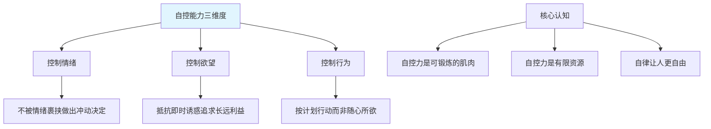
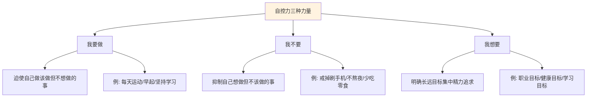
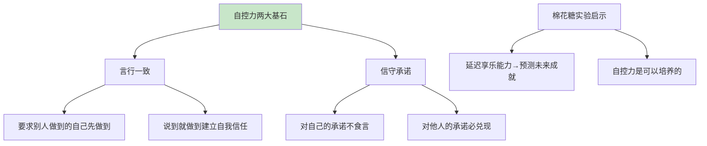
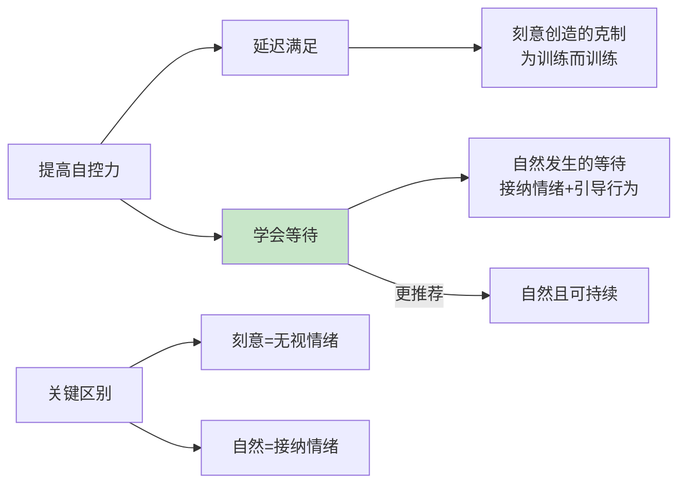
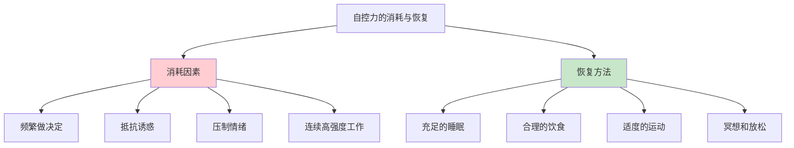
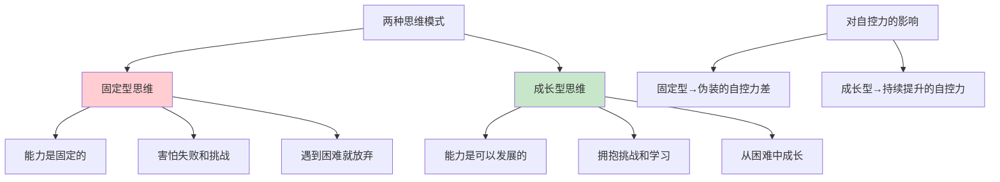
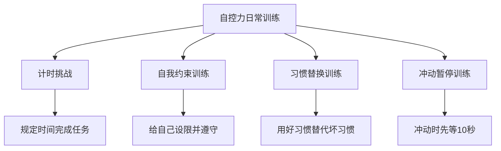
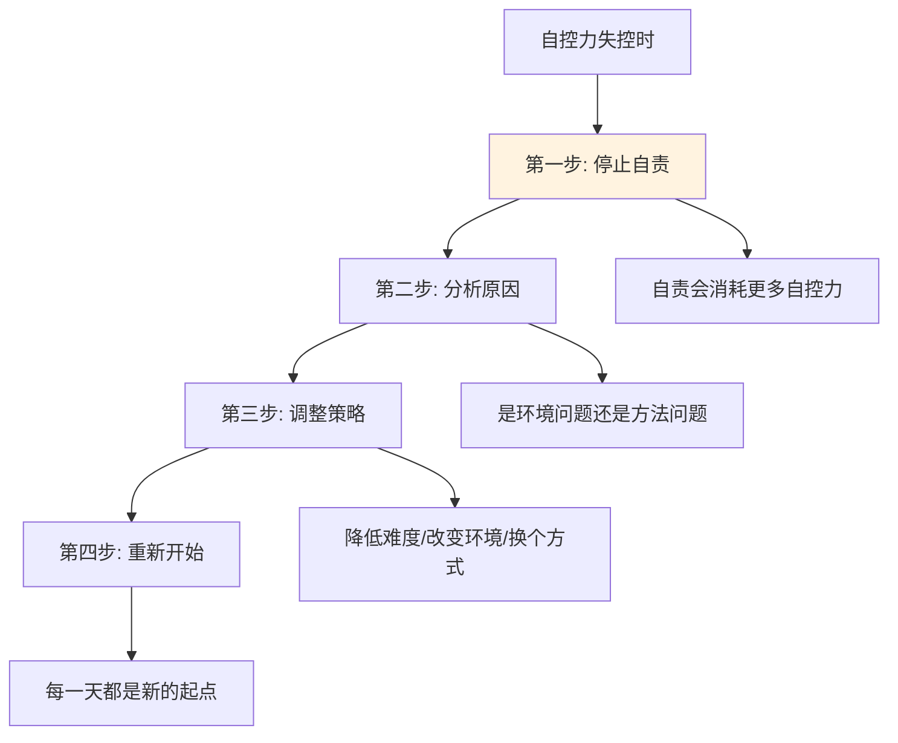
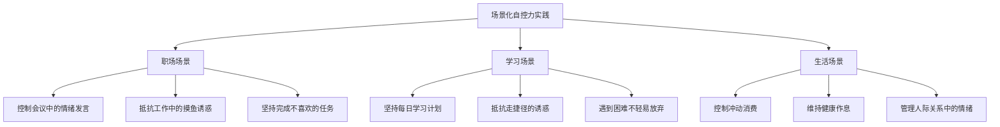
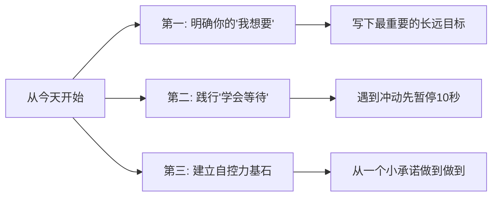

# 7.2自我自控的调节
#### 目录介绍
- [01.自控能力的本质](#01自控能力的本质)
- [02.自控力的三种力量](#02自控力的三种力量)
- [03.自控力的两大基石](#03自控力的两大基石)
- [04.延迟满足与等待](#04延迟满足与等待)
- [05.自控力的消耗与恢复](#05自控力的消耗与恢复)
- [06.思维模式与自控力](#06思维模式与自控力)
- [07.自控力的日常训练](#07自控力的日常训练)
- [08.自控力失控的应对](#08自控力失控的应对)
- [09.场景化自控力实践](#09场景化自控力实践)
- [10.今天起改变三点](#10今天起改变三点)
- [12.课后作业思考下](#12课后作业思考下)

## 01.自控能力的本质

### 1.1 自控力的定义

自控力就是自我控制的能力——能够完全自觉地、有意识地控制自己的情绪，支配自己行动的能力。它是个人意志力与情商的重要体现。

自控能力包含三大维度：**控制情绪**（不在愤怒时做决定）、**控制欲望**（抵抗即时诱惑去追求更长远的目标）和**控制行为**（按计划行动而非凭心情随意行事）。

### 1.2 自控力的核心认知

关于自控力，有三个关键认知需要先建立：

**第一，自控力像肌肉，越练越强。** "自律让我更自由"就是这个道理——你越早开始锻炼自控力，就越能熟练地驾驭自己的行为和情绪。

**第二，自控力是有限资源。** 一天中频繁地做出需要自控的决定，你的自控力会逐渐耗尽。这就是为什么你白天能坚持不吃零食，到了晚上却忍不住大吃一顿——不是你晚上意志力差，而是白天消耗得太多了。

**第三，自控不等于压抑。** 真正的自控是理性地选择最优行动方案，而不是一味地忍耐和压制。硬撑式的自控不可持续，聪明的自控是设计好环境和机制，让"正确的选择"变成"容易的选择"。

### 1.3 为什么自控力如此重要

生活中你会发现：能坚持早起锻炼的人，身体更健康；能管住嘴的人，身材更好；能控制情绪的人，人际关系更和谐；能抵抗即时诱惑的人，事业发展更好。

这不是巧合。自控力是一种底层能力，它影响着你生活的方方面面——从健康到财富，从人际到事业。提高自控力，就是在提高你人生的整体质量。

## 02.自控力的三种力量

### 2.1 "我要做"的力量

"我要做"是指迫使自己去做该做的事情，即使你不想做。每个人心中都有一些"知道应该做但一直没做"的事情：坚持运动、早睡早起、定期读书、学习新技能……

提升"我要做"力量的方法是：找到一件你一直在拖延的事情，从最小的行动开始。比如你想坚持运动，不要一开始就计划"每天跑5公里"，而是先做到"每天换上运动鞋出门走10分钟"。关键是启动，而不是完美。

### 2.2 "我不要"的力量

"我不要"是指抑制自己最顽固的坏习惯。你生活中最难改掉的习惯是什么？频繁刷手机？深夜吃零食？工作时开小差？冲动消费？

"我不要"的力量不是靠压制欲望来实现的，而是靠**替代**和**远离**。你想戒掉晚上刷手机的习惯，与其靠意志力对抗（往往会失败），不如在睡前把手机放到另一个房间，在床头放一本书——当环境改变了，行为自然就改变了。

### 2.3 "我想要"的力量

"我想要"是三种力量中最核心的——它是你的长远目标和终极动力。当你非常清楚自己"想要什么"的时候，"我要做"和"我不要"就有了方向和动力。

问自己：你最想集中精力完成的长远目标是什么？那种当下的"渴望"（刷手机、打游戏、偷懒）是怎么诱惑你远离自己目标的？把你的长远目标写在醒目的地方（手机壁纸、书桌便签、电脑桌面），让它时刻提醒你。

| 力量类型 | 核心问题 | 实践方向 | 破解策略 |
|----------|----------|----------|----------|
| **我要做** | 什么事该做但一直在拖延？ | 启动最小行动 | 降低启动门槛 |
| **我不要** | 什么坏习惯最顽固？ | 替代和远离 | 改变环境设计 |
| **我想要** | 最重要的长远目标是什么？ | 明确方向和动力 | 时刻可视化目标 |

## 03.自控力的两大基石

### 3.1 言行一致

自控力的第一块基石是"言行一致"——你对自己说的话，你对别人的要求，你自己能不能先做到。

如果你要求团队成员不迟到，自己却经常迟到；如果你告诉自己要早睡，却每天刷手机到凌晨——这种"说一套做一套"会严重侵蚀你的自控力根基。因为你的大脑已经学会了："反正说了也不会做到，不用当真。"

反过来，每一次"说到做到"都在强化你大脑中的自控力回路。从小事开始：今天说了要读30页书，就一定读完；说了要10点睡觉，就放下手机上床。这些小小的"说到做到"积累起来，你的自控力就会越来越强。

### 3.2 信守承诺

心理学上有一个著名的"棉花糖实验"：研究者告诉孩子们，如果现在不吃棉花糖，等15分钟后就能得到两块。后续追踪发现，能够等待的孩子在未来的学业、事业和健康方面都表现更好。

这个实验说明了两件事：**一是延迟享乐的能力确实是成功的预测因素**；**二是这个能力是可以培养的**，关键在于"信守承诺"——你答应过的事情（无论是对自己还是对别人），一定要做到。

每次你兑现了一个承诺，你的大脑就会更相信"承诺是有意义的"，下次需要自控时就更容易做到。每次你食言，大脑就会更加怀疑"承诺不靠谱"，自控力就会进一步削弱。

## 04.延迟满足与等待

### 4.1 延迟满足是一种价值观

延迟满足不只是一种方法或技巧，更是一种价值观——你怎么看待自己的付出和收获，怎么看待眼前利益和长远发展。

有自制力、能够克制、延迟满足的人更容易成功，而急于变现、急于兑现的人往往会失去更好的机会。这在职场中尤其明显：急着表现的人可能短期内获得关注，但真正走得远的往往是那些愿意扎扎实实积累、不急于求成的人。

### 4.2 "学会等待"优于"延迟满足"

关于提高自控力，很多人一想到就是"延迟满足"。但更好的方式是"学会等待"。两者有微妙但重要的区别：

**延迟满足**是刻意创造的、不自然的——你硬生生地压制自己的欲望，无视情绪，为了训练而训练。这种方式短期有效，但长期容易导致心理反弹。

**学会等待**是自然发生的——你接纳自己想要的情绪（"我确实很想吃那块蛋糕"），但引导自己的行为（"但我选择等到饭后再吃"）。它不否定情绪，但控制行为。

这种"接纳情绪+引导行为"的方式更加自然，也更可持续。

### 4.3 日常等待的训练

你可以在日常生活中自然地练习"学会等待"：

- 想看手机通知时，告诉自己"再过15分钟再看"
- 购物时看到心仪的东西，先放进购物车等3天再决定是否购买
- 想发表意见时，先等对方说完再开口
- 遇到问题想立刻寻求帮助时，先自己思考10分钟

## 05.自控力的消耗与恢复

### 5.1 休息的艺术

自控力像肌肉一样，坚持锻炼很重要，但也需要休息，不能过度消耗。很多人陷入一个误区：只看到局部而忽略大局。

比如你上午已经非常专注地完成了一项高难度的工作，下午又面对另一项需要高度自控的任务时，你可能发现自己怎么也集中不了注意力。这不是你自控力差，而是上午已经消耗得差不多了。

**建议**：不要把连续两个需要高度自控力的任务紧密排列。中间留出休息时间，让大脑"回血"。就像健身时不会连续做两组极限重量一样。

### 5.2 自控力的恢复手段

| 恢复方法 | 具体做法 | 效果原理 |
|----------|----------|----------|
| **充足睡眠** | 每晚7-8小时高质量睡眠 | 大脑在睡眠中恢复前额叶皮层的功能 |
| **合理饮食** | 保持血糖稳定，避免暴饮暴食 | 大脑的自控功能依赖稳定的血糖供应 |
| **适度运动** | 每天30分钟有氧运动 | 运动促进多巴胺分泌，增强自控力 |
| **冥想放松** | 每天5-10分钟正念冥想 | 训练大脑的注意力控制和情绪调节 |

### 5.3 避免"自控力疲劳"

"自控力疲劳"是指因过度使用自控力导致的效能下降。预防方法包括：

**减少不必要的决策**：日常生活中有很多小决定在悄悄消耗你的自控力（穿什么、吃什么、走哪条路）。通过建立习惯和常规来减少这些无谓的决策。比如固定早餐食谱、提前一周规划衣着。

**优化任务安排**：把最需要自控力的任务放在精力最好的时段，把不需要太多自控力的事务性工作放在疲劳时段。

**创造有利环境**：与其靠自控力抵抗诱惑，不如直接消除诱惑。不想吃零食就不要买、不想刷手机就把手机放远——让正确的选择成为最容易的选择。

## 06.思维模式与自控力

### 6.1 固定型思维的陷阱

很多人在遇到不擅长或做不好的事情时，会把放弃归咎于"自控力差"。但如果更准确地分析，可能不是自控力的问题，而是思维模式的问题。

**固定型思维**的人认为自己的能力是天生的、固定的。他们害怕失败，因为失败就意味着"自己不行"。所以他们只选择做简单的、有把握的事情，一遇到困难就各种找借口逃避。

表面上看，这是"自控力差，做不坚持"；但本质上，是因为害怕失败而不敢面对挑战。

### 6.2 成长型思维的力量

**成长型思维**的人认为能力是可以通过努力不断发展的。接受困难的任务和挑战，是为了让自己成长。失败不是"我不行"的证明，而是"我还能进步"的信号。

同样是学习一项新技能，固定型思维的人在遇到困难后容易放弃："学不会，说明我没这个天赋。"成长型思维的人则会坚持："虽然现在做不好，但只要持续练习就能进步。"

后者看起来"自控力更强"，但本质上是因为他们有不同的信念——他们相信努力有回报，所以更愿意坚持。

### 6.3 如何转变思维模式

如果你发现自己常常因为"怕做不好"而不敢开始，可以尝试以下方法：

- **关注过程而非结果**：不要问"我能不能做好"，而是问"我今天比昨天进步了吗"
- **重新定义失败**：失败不是结论，而是反馈。它告诉你哪里还需要改进
- **使用"还没有"的思维**：不是"我做不到"，而是"我还没做到"——加了"还"字，意义完全不同
- **记录进步而非差距**：每天写下"今天做到了什么"，而不是"今天还差什么"

## 07.自控力的日常训练

### 7.1 计时挑战训练

设定一个时间目标，在规定时间内完成一项任务或解决一个问题。时间的限制会迫使你集中注意力、快速决策并保持专注。

**实操方法**：选择一项日常任务，估算一下通常需要多长时间，然后给自己减少20%的时间来完成。比如你通常花1小时写周报，试试50分钟能不能完成。这种适度的压力会激活大脑的高效模式。

### 7.2 自我约束训练

主动给自己设定一些规则和限制，并严格遵守：

- 工作时间内不看社交媒体（设定具体的时段）
- 每天的娱乐时间不超过1小时
- 每月的非必需消费不超过预算的XX%
- 饭量控制，到了七分饱就放下筷子

关键不在于规则本身有多严格，而在于**制定了就要做到**。每一次遵守规则，都是在强化你的自控力肌肉。

### 7.3 习惯替换训练

直接戒掉一个坏习惯非常难，但用一个好习惯替换坏习惯就容易得多。因为你的大脑需要那个"奖励回路"，与其去掉它，不如用更健康的方式满足它。

| 坏习惯 | 替换方案 | 奖励替代 |
|--------|----------|----------|
| 压力大时刷手机 | 起来走动5分钟 | 身体放松感 |
| 无聊时吃零食 | 喝一杯水或茶 | 口腔刺激感 |
| 焦虑时熬夜 | 写日记释放情绪 | 情绪宣泄感 |
| 拖延时打游戏 | 先做5分钟任务 | 完成感 |

### 7.4 冲动暂停训练

当你感受到冲动时——想买东西、想发脾气、想放弃任务——先给自己10秒钟的"暂停"。在这10秒里，做三次深呼吸，然后问自己："这个决定是我的情绪在做，还是我的理性在做？"

10秒钟看起来很短，但它足以打断"刺激→冲动反应"的自动模式，让理性有机会介入。练习多了以后，可以把暂停时间延长到30秒、1分钟。

## 08.自控力失控的应对

### 8.1 失控后不要自责

很多人在自控力失控后（比如又刷了两小时手机、又暴饮暴食了一顿）会陷入强烈的自责："我怎么又这样了，太没用了。"

但研究表明，**自责不仅无法帮助你恢复自控力，反而会进一步消耗你的心理能量**，让你更容易在下一次继续失控。正确的做法是对自己宽容一些："好吧，这次没做好，但没关系，下次我可以做得更好。"

### 8.2 分析失控的原因

失控之后，冷静地分析原因比自责有用得多：

- 是环境的问题吗？（比如手机就在手边、零食就在眼前）
- 是方法的问题吗？（比如任务太大没有分解、时间安排不合理）
- 是身体的问题吗？（比如太疲劳、太饿、没睡好）
- 是心理的问题吗？（比如压力太大、情绪低落需要宣泄）

找到原因，才能对症下药。

### 8.3 调整策略重新开始

根据失控原因调整策略：环境问题就改造环境，方法问题就优化方法，身体问题就先恢复身体，心理问题就先处理情绪。

最重要的是：**不要因为一次失控就否定整个计划。** 坚持运动的人也会有偷懒的一天，坚持饮食控制的人也会有放纵的一餐。一次失控不代表失败，只要你能重新开始，进步就在持续。

## 09.场景化自控力实践

### 9.1 职场中的自控力

**控制情绪发言**：当会议中有人提出让你不舒服的意见时，不要立刻反驳。先做三次深呼吸，在心里想清楚"我要表达的核心观点是什么"，然后再冷静地发言。冲动的反驳只会让讨论偏离主题，理性的回应才能解决问题。

**抵抗摸鱼诱惑**：工作中总会有无聊或困难的时刻，让你想掏出手机刷一刷。建议在工作时间把手机放在看不到的地方，设定固定的"检查手机时间"（如每2小时检查一次）。

**完成不喜欢的任务**：每个人都会遇到自己不喜欢但必须完成的工作。把它分解成小任务，每完成一个就给自己一个小奖励，让整个过程变得可以忍受。

### 9.2 学习中的自控力

**坚持学习计划**：不要制定过于宏大的学习计划。"每天学习4小时"很难坚持，但"每天学习30分钟"就容易得多。关键是持续性，而不是单次的强度。

**抵抗走捷径**：学习时总会有"直接看答案"、"跳过困难部分"的诱惑。提醒自己：走捷径省下的时间，最终会在理解不到位时加倍偿还。

### 9.3 生活中的自控力

**控制冲动消费**：看到心仪的商品先不买，加入购物车等待3天。3天后如果还想买，再做决定。数据表明，大部分冲动消费的欲望会在24小时内消退。

**维持健康作息**：给自己设定一个"电子宵禁"时间——比如晚上10点半后不再使用手机和电脑。一开始可能很难做到，但坚持一周后你会发现睡眠质量明显改善。

## 10.今天起改变三点

**第一，明确你的"我想要"。** 当你在纠结要不要坚持、要不要放弃时，回忆一下你最想要的长远目标是什么。把这个目标写下来，贴在你每天能看到的地方。有了清晰的方向，自控力就有了源源不断的动力。

**第二，践行"学会等待"而非"延迟满足"。** 当你感受到冲动时，不要压制情绪，而是接纳它——"我确实很想做这件事"——然后引导自己的行为——"但我选择再等等"。从今天开始，每次冲动时先暂停10秒，做三次深呼吸再决定。

**第三，从一个小承诺开始建立自控力基石。** 选一件很小的事情（比如每天起床后立刻叠被子、每天喝够8杯水），承诺自己做到，然后真的做到。不要小看这些小承诺，它们是你重建自控力信任的起点。

## 12.课后作业思考下

1. 分析一下你目前最大的自控力挑战是什么——是"我要做"（有事该做但一直拖延）、"我不要"（有坏习惯改不掉）、还是"我想要"（长远目标不清晰）？针对你最大的挑战，制定一个具体的、可执行的小计划。

2. 回顾一下你最近一次"自控力失控"的经历，按照"停止自责→分析原因→调整策略→重新开始"的流程，写下你的分析和改进计划。

3. 选择一个你生活中最想改掉的坏习惯，用"习惯替换法"设计一个替代方案。记录一周的执行情况，看看效果如何。

4. 自控力的两大基石"言行一致"和"信守承诺"，你哪个做得不够好？从今天起选择一个小承诺，连续做到7天，观察自己的变化。
