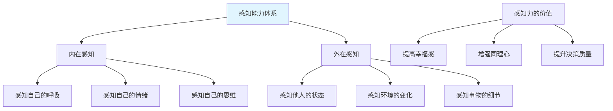
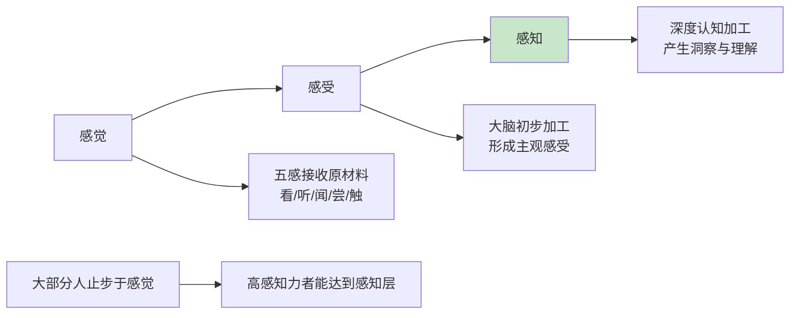
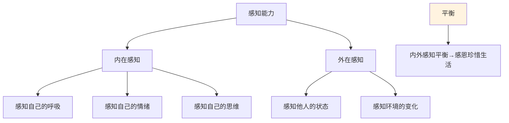
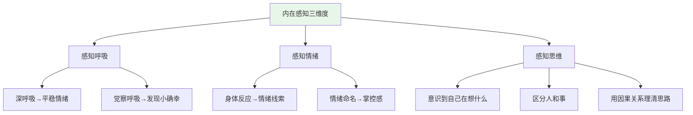
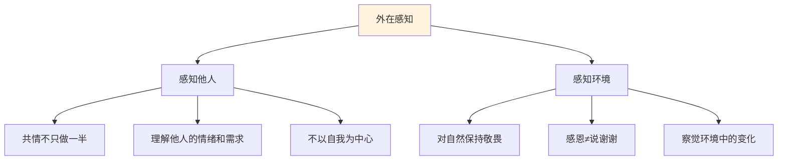
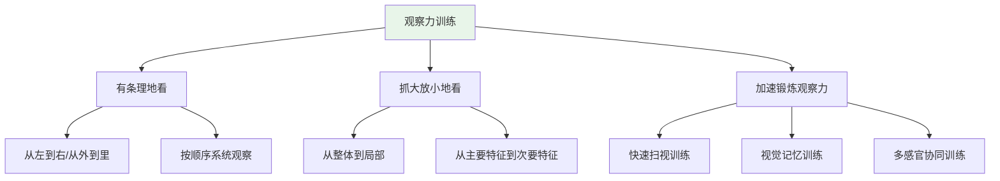
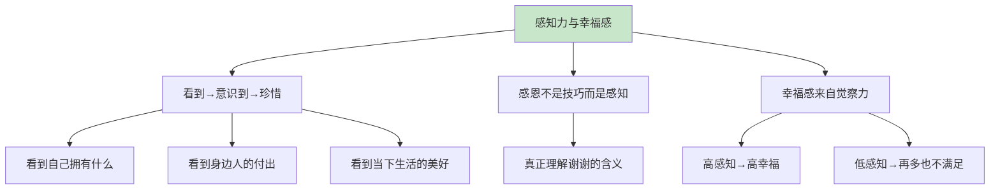
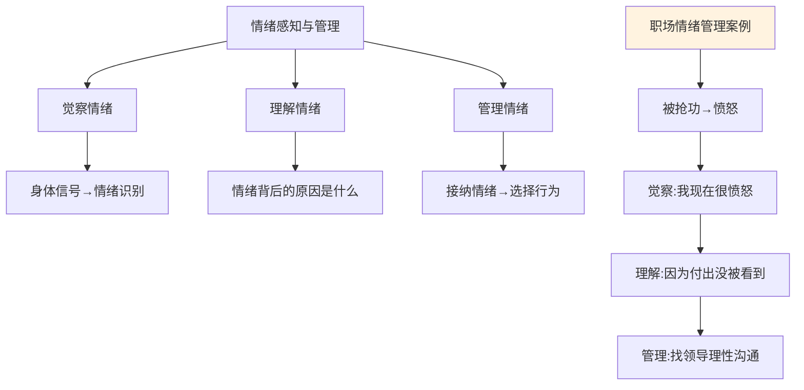
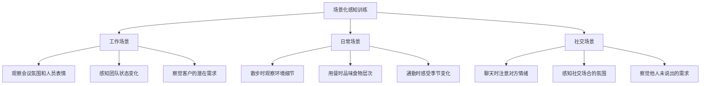
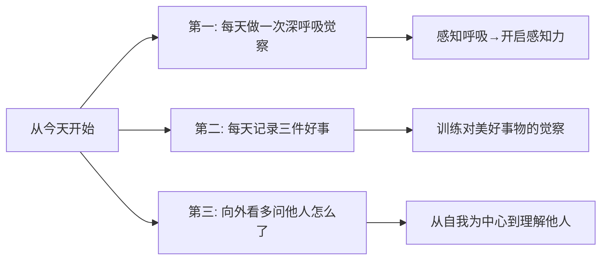

# 7.3感知能力的提升
#### 目录介绍
- [01.什么是感知能力](#01什么是感知能力)
- [02.感觉感受与感知](#02感觉感受与感知)
- [03.感知能力的分类](#03感知能力的分类)
- [04.内在的感知能力](#04内在的感知能力)
- [05.外在的感知能力](#05外在的感知能力)
- [06.观察力的系统训练](#06观察力的系统训练)
- [07.感知力与幸福感](#07感知力与幸福感)
- [08.情绪感知与管理](#08情绪感知与管理)
- [09.场景化感知训练](#09场景化感知训练)
- [10.今天起改变三点](#10今天起改变三点)
- [12.课后作业思考下](#12课后作业思考下)

## 01.什么是感知能力

### 1.1 感知能力是大脑的"软装潢"

如果把人的能力体系比作一栋别墅，那么逻辑能力、表达能力、执行能力等是"硬装潢"——它们决定了房子的结构和功能。而感知能力是"软装潢"——它决定了你住得是否舒心、幸福感是否"爆表"。

感知能力是大脑对外界和内在信息的敏锐捕捉与深度加工能力。它不像技术能力那样直接产出成果，但它深刻影响着你的生活质量、人际关系和内心幸福。一个感知力强的人，能觉察到生活中那些被忽略的"小确幸"，能敏锐地感受到他人的情绪变化，能在复杂环境中快速捕捉到关键信息。

### 1.2 感知力为什么容易被忽视

在快节奏的工作和生活中，我们往往把注意力集中在"有用"的硬技能上，而忽略了感知力这种"看不见摸不着"的软能力。但事实上，很多人感到不幸福、不满足，不是因为物质条件不够好，而是因为感知力太弱——拥有了很多却"看不到"自己拥有的。

观察力是感知力的重要组成部分，它就像生活的接收器。"看到"是意识到"自己拥有"的前提。只有看到自己拥有什么、看到身边的人和事、看到当下的生活，才会产生珍惜感和幸福感。

### 1.3 感知力的三个层次

| 层次 | 描述 | 特征 | 举例 |
|------|------|------|------|
| **感觉** | 通过五感接收外界信息 | 被动接收，原始信息 | 我看到了、我听到了、我闻到了 |
| **感受** | 大脑对信息的初步加工 | 主观判断，形成印象 | 我觉得、我认为、我感到 |
| **感知** | 对感觉和感受的深度认知 | 主动察觉，洞察本质 | 我意识到、我理解了、我领悟到 |

大部分人的感知都是无意识进行的。感知能力的提升，就是把这个无意识的过程变成有意识的——主动去感觉、深入去感受、清醒地去感知。

## 02.感觉感受与感知

### 2.1 感觉：信息的原始采集

感觉是通过五感（视觉、听觉、嗅觉、味觉、触觉）来认识外界世界的过程。它是最基础的信息采集——我看到一朵花、我听到一首歌、我闻到饭菜的香味、我尝到咖啡的苦味、我感受到风吹在脸上。

感觉是被动的，不需要刻意去做，只要你的感官正常运作就会自动接收。但问题在于，很多人虽然在"感觉"，却没有真正在"感受"——信息从眼前过、从耳朵过，却没有进入大脑的加工系统。

### 2.2 感受：信息的初步加工

感受是大脑对五感采集到的"原材料"进行初步加工后形成的主观体验。同样是看到一朵花，有的人感受到"美好、宁静"，有的人感受到"无聊、无所谓"——感觉相同，感受不同。

感受比感觉更深一层，它需要大脑的参与。一个感受力丰富的人，会从一杯普通的茶中品味到生活的滋味，从一次普通的散步中感受到季节的更替。

### 2.3 感知：信息的深度认知

感知是对感觉和感受的进一步深度加工，是有意识的、主动的认知活动。感知有显性和隐性之分——你明确意识到的是显性感知，潜意识里捕捉到但未明确意识到的是隐性感知。

比如你走进一个房间，感觉灯光偏暗（感觉），感到有点压抑（感受），然后意识到"这个空间的布局可能会影响开会时的氛围，建议换个更明亮的会议室"（感知）。从感觉到感受到感知，信息处理的深度在不断递进。

## 03.感知能力的分类

感知能力包含两大模块：**内在感知**和**外在感知**。

**内在感知**是对自己的觉察——你是否清楚自己当下的呼吸状态、情绪状态、思维状态。很多人在忙碌中完全忽略了自己的内在状态，直到身体发出警报（生病、崩溃）才意识到问题。

**外在感知**是对外界的觉察——你是否能敏锐地感受到他人的情绪变化、环境的氛围转换、事物的细微差异。很多人际关系中的矛盾，都源于外在感知力不足——你没有注意到对方已经不高兴了，还在自顾自地说话。

一个内在感知和外在感知真正平衡的人，更容易感恩并珍惜自己的生活。他们既能照顾好自己的身心状态，也能敏锐地回应外部世界。

## 04.内在的感知能力

### 4.1 感知自己的呼吸

"当一个人开始意识到自己在呼吸时，就会开始留意生活中那些习以为常却常常忽略的事物。"这就是感知能力的起点。

我们都在呼吸，但有多少人真正"意识到"自己在呼吸？大多数时候，呼吸是自动的、无意识的。而当你刻意地去感知自己的呼吸——深吸一口气，感受空气进入鼻腔、充满肺部，再缓缓呼出——你会发现整个人瞬间安静下来，情绪也跟着平稳了。

这不只是一种冥想技巧，它是感知能力的基础训练。当你能够感知到呼吸这个最基本的生理活动时，你对其他事物的感知也会逐渐敏锐起来。你会开始注意到那些"习以为常"的东西——阳光照进窗户的温暖、午饭时食物的香味、同事说话时的语气变化——这些"小确幸"是幸福感的真正来源。

### 4.2 感知自己的情绪

很多人其实不知道自己的情绪是什么。"不知道自己怎么了，就是心里堵得慌"——这种"不知道"其实是最痛苦的。如果我们能够清晰地识别出自己的情绪（"我现在是愤怒的"、"我现在是焦虑的"、"我现在是失落的"），就会有一种"我知道怎么回事，我可以控制住"的掌控感。

**感知情绪的方法是从身体反应入手。** 情绪虽然抽象，但身体的反应是具体的：

| 身体反应 | 可能对应的情绪 | 感知要点 |
|----------|---------------|----------|
| 心跳加速、肌肉紧绷 | 愤怒、紧张 | 察觉身体的"战斗"信号 |
| 胸口发闷、呼吸短促 | 焦虑、压抑 | 注意呼吸的变化 |
| 浑身无力、不想动 | 疲惫、失落 | 感受能量的消退 |
| 嘴角上扬、身体轻松 | 开心、满足 | 留意愉悦的身体信号 |

当你开始有意识地关注身体反应，并将它们与对应的情绪联系起来时，你对自己情绪的感知力就会越来越强。然后你可以正向反馈到感觉和感受上——引导自己的情绪从负面转向正面，更好地进行情绪管理。

### 4.3 感知自己的思维

思维是最隐性的感知——你可能没有明显的感觉和感受，但能否感知自己的思维模式，却能在很大程度上影响你应对外界的方式。

**意识到"自己在思考什么"，并学会调整思考方式。** 很多人被惯性思维支配："我也不想发脾气，却脱口而出了。""我也知道这一点不好，但没办法，改不了。"这些惯性思维其实是可以改变的，前提是你先要"看到"它们。

**区分人和事的思维训练。** 一件事的失败不等于一个人的失败。很多人会有这样的倾向：一遇到做不好的事情，马上全盘否定自己。"这个项目搞砸了"变成"我就是不行"——这是思维上的认知扭曲。学会区分人和事，是受用一生的思维感知能力。

**用因果关系理清思路。** 很多人经常出现"想做一件事却不知道怎么开始"或"总是在拖延"的情况。这不仅是习惯问题，也是因为缺乏对思维的感知——不知道自己的思路到底是什么。多用"因为……所以……"的因果关系句式来整理思绪，把混乱的想法理出清晰的脉络。

## 05.外在的感知能力

### 5.1 感知他人

人是社会性动物，仅仅对自己的感知敏锐是不够的，对外界尤其是对他人的感知同样重要。

共情的核心是理解"他人怎么了"，而不只是知道"我自己怎么了"。很多人的共情只做了一半——他们学会了认识自己的情绪，却没有学会去理解他人的情绪。结果就是以自我为中心，不理解别人的感受和需求。

**提升感知他人能力的方法很简单：多问一句"那个人怎么了？"** 当你看到同事闷闷不乐时，不要视而不见，也不要自顾自地说自己的事情。先观察，再感受："他可能在为什么事情烦心？我能做些什么？"这一个简单的思维转变，就能大幅提升你的外在感知力和人际关系质量。

### 5.2 感知环境

感知环境包括对自然界、对生活空间、对社会氛围的觉察。一个高感知力的人，对生命充满敬畏，他知道生命得来不易，"可以活着"本身就是一件特别美好的事情。

现代人物质条件越来越好，但幸福感却不一定更高。这是因为物质的丰裕反而削弱了感恩的能力——当一切都理所当然时，就感受不到拥有的珍贵。

**感恩不等于"谢谢"。** 很多人张口闭口都会说"谢谢"，但这只是口头上的礼貌，并不是真正的感恩。真正的感恩是一种深层的感知——你真切地感受到别人为你做了什么、你拥有的这些东西来之不易。不要让"谢谢"流于形式，要去理解"谢谢"背后的实际意义。

### 5.3 感知环境变化的训练

在日常生活中，可以有意识地训练自己感知环境变化的能力：

- **通勤时**：观察路上的变化——今天和昨天有什么不同？新开了什么店？路边的树有什么变化？
- **工作中**：感知团队的氛围——今天大家的情绪如何？有没有人状态不好？办公室的气氛是否比平时紧张？
- **回家后**：觉察家庭的氛围——家人今天的心情如何？家里有什么需要我注意的？

## 06.观察力的系统训练

### 6.1 有条理地观察

观察不是随意地"看"，而是有方法、有条理地收集信息。两种基本的观察方法：

**空间顺序法**：从左到右、从上到下、从外到里。比如观察一辆车，先看外观整体造型，再看车身细节，然后打开车门看内饰，再感受座位的舒适度。这样有条理地看，不容易遗漏信息。

**主次分层法**：先看整体再看局部，先抓主要特征再注意次要特征。比如走进一个新办公室，先观察整体布局和氛围，再注意具体的家具摆设和装饰细节。

这两种方法可以灵活运用，有时甚至叠加使用。观察没有绝对的对错，关键是要有意识地去"看"，而不是让眼睛无目的地扫过。

### 6.2 加速锻炼观察力

**快速扫视训练**：练习在短时间内快速扫描周围环境的能力。走进一个新房间，用10秒钟快速扫视一遍，然后闭上眼睛，回忆你看到了什么。这种训练可以帮助你更快地捕捉到重要信息。

**视觉记忆训练**：观察一张图片或一个场景30秒，然后尝试回忆并描述其中的细节。逐渐增加难度——增加细节数量、减少观察时间。这种训练既提升观察力也提升记忆力。

**多感官协同训练**：不只是用眼睛看，还要同时调动耳朵、鼻子、手等多种感官。比如在咖啡馆里，同时观察环境布置（视觉）、聆听背景音乐（听觉）、闻咖啡的香气（嗅觉）、感受杯子的温度（触觉）。多感官协同可以大幅提升你对环境的感知深度。

### 6.3 工作中的观察力应用

观察力不只是一种生活技能，它在工作中也有极大的价值：

| 应用场景 | 观察要点 | 价值体现 |
|----------|----------|----------|
| **会议中** | 观察与会者的表情和肢体语言 | 判断谁赞同、谁反对、谁犹豫 |
| **汇报时** | 观察领导的反应 | 及时调整汇报重点和方式 |
| **团队管理** | 观察团队成员的状态变化 | 提前发现问题、及时沟通支持 |
| **客户沟通** | 观察客户的需求信号 | 捕捉商机、提升服务质量 |

## 07.感知力与幸福感

### 7.1 幸福感的源泉是觉察

现代社会物质丰富，但很多人的幸福感却很低。原因不在于拥有的太少，而在于感知的太弱。当我们把一切视为理所当然时，就失去了感受幸福的能力。

只有当我们开始"看到"——看到自己拥有什么、看到身边的人在为我们做什么、看到当下的生活有多少值得感恩的地方——才会真正感受到"我拥有"的幸福。这份觉察会让我们珍惜眼前、珍惜当下、珍惜身边的人。

### 7.2 有些"没用"的事最有用

在追求效率和成果的时代，感知力培养经常被归为"没用"的事情。但身心平衡、幸福感恩的状态，恰恰是高效学习和工作的基础。一个内心充盈的人，做事更有动力、更有创造力、也更能坚持。

花时间去散步、去观察自然、去品味一杯茶、去和朋友深度聊天——这些看似"没用"的事情，其实是在给你的感知力"充电"，也是在为你的幸福感"续航"。

### 7.3 培养感恩的习惯

**每日三件好事**：每天睡前写下今天发生的三件让你感到感激的事情，无论大小。可以是"今天天气很好"、"同事帮了我一个忙"、"吃到了好吃的午饭"。坚持30天，你会发现自己对生活的感知力和幸福感都明显提升。

**感恩信/感恩对话**：每周选一个你感激的人，写一封简短的感恩信或当面表达感谢。不是泛泛的"谢谢"，而是具体地说出"你做了什么让我感到XX"。这个过程既表达了感恩，也训练了你对他人付出的感知力。

## 08.情绪感知与管理

### 8.1 职场情绪感知的案例

闭上眼睛想象一个场景：你和同事一起做一个项目，你是主要负责人，辛辛苦苦熬夜一周赶出了一份出色的报告。但第二天去分享成果的是你的同事，老板赏识和表扬的也是你的同事。

面对这种情况，不同人的反应截然不同：

**反应一**：当场爆发——"怎么可以这样？你凭什么抢我的功劳！"情绪完全失控，当众制造矛盾。

**反应二**：生闷气——"吃了哑巴亏，这公司太不公平了，我要跳槽。"情绪向内压抑，越想越郁闷。

**反应三**：先觉察情绪，再理性行动——当下确实生气，但马上想到"光发泄没用，我要找领导谈谈"。然后理清思路："我做了什么？我的预期是什么？我需要从领导那里得到什么支持？"带着方案去沟通。

第三种反应就是高感知力的体现——先觉察到自己的情绪，再理解情绪背后的原因，最后选择理性的行为来解决问题。

### 8.2 提升情绪感知的方法

无论在职场还是生活中，光宣泄情绪没有用。关键是建立"觉察→理解→管理"的情绪处理链条：

**觉察**：我现在是什么情绪？（用情绪词汇命名：愤怒、焦虑、失落、委屈……）

**理解**：这个情绪是什么引起的？（不是"他让我生气"，而是"因为我的付出没有被看到，所以我感到委屈和愤怒"）

**管理**：我想要什么结果？我应该怎么做？（把注意力从"情绪宣泄"转移到"问题解决"上）

事后如果有机会，进行情绪复盘："如果重新来过，我应该怎样？"用同理心想想对方的立场，制定沟通计划，对自己的情绪进行管理。

## 09.场景化感知训练

### 9.1 工作场景的感知训练

**会议感知训练**：下次开会时，除了关注讨论内容，还要刻意观察与会者的表情和肢体语言。谁在积极参与？谁在敷衍？谁有话想说但没说？会后记录你的观察，看看后续是否验证了你的判断。

**团队感知训练**：每天花2分钟观察团队成员的状态。谁今天比平时安静？谁看起来压力很大？谁需要帮助但没有开口？主动关心一下，你会发现这种感知力对团队管理和协作有巨大的价值。

### 9.2 日常场景的感知训练

**散步观察游戏**：走在路上时，有意识地寻找你看到的所有"红色的东西"或"三角形的东西"。这种有目的的观察比随意地看要有效得多，它会让你的观察力越来越敏锐。

**天气感知记录**：每天花30秒观察天气，不只是说"今天是晴天"，而是深入感受："天空是蓝色的（视觉），阳光照进来很暖和（触觉），空气中有花香（嗅觉），所以今天是个让人心情愉悦的晴天。"把天气和感受联系起来，训练感觉与思维的连接。

**用餐感知训练**：下一顿饭时，放慢速度，闭上眼睛品尝第一口食物。感受它的温度、质地、味道层次。你会发现平时狼吞虎咽错过了多少美味。

### 9.3 社交场景的感知训练

**情绪捕捉训练**：和朋友聊天时，不只是听对方说了什么内容，还要注意对方的语气、语速、表情变化。当你感觉到对方情绪有变化时，试着确认："你是不是在为这件事烦心？"

**"什么不见了"游戏**：和朋友或家人玩一个小游戏——桌上放一些物品，让大家记住，然后闭上眼睛，移走几个，看看谁能最快发现"什么不见了"。这个游戏既锻炼观察力也锻炼记忆力。

## 10.今天起改变三点

**第一，每天做一次深呼吸觉察。** 找一个安静的时刻，闭上眼睛，做10次深呼吸。每一次呼吸都去感受空气的温度、胸腔的起伏、身体的放松。这个简单的练习是打开感知力大门的钥匙——当你能感知到呼吸，就能开始感知到更多。

**第二，每天睡前写下三件好事。** 无论今天多忙多累，花2分钟写下今天让你感到感激的三件事。不需要多大的事，可以是"同事帮我倒了杯水"、"午饭很好吃"、"下班时看到了漂亮的晚霞"。坚持30天，你的幸福感会有明显的提升。

**第三，开始向外感知，多问"那个人怎么了"。** 当你在关注自己的同时，不妨也向外看看：身边的人今天状态如何？有没有人需要关心和帮助？从自我为中心转向理解他人，你的感知力和人际关系都会迈上一个新台阶。

## 12.课后作业思考下

1. 选择一种内在感知进行为期一周的训练：每天花5分钟专注感知自己的呼吸、情绪或思维，记录下你的感受和变化。一周后回顾，看看你对自己的了解是否更深了。

2. 做一次"观察力测试"：走一段你每天都走的路（上班的路或回家的路），刻意观察你以前从未注意到的5个细节。写下来，你会惊讶于自己在熟悉的环境中遗漏了多少信息。

3. 在接下来一周的工作中，每天刻意观察一位同事的状态。记录你的观察（他今天看起来开心/疲惫/焦虑），以及你的判断是否准确。通过这个练习提升你对他人的感知力。

4. 坚持30天"每日三件好事"记录。30天后回顾这份记录，看看你是否发现自己对生活中美好事物的敏感度提高了。
