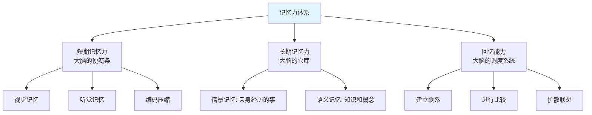
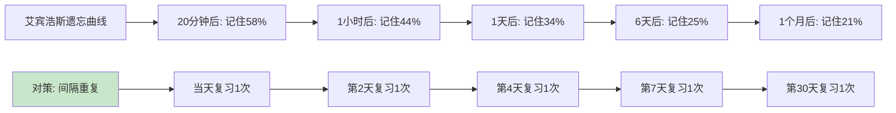
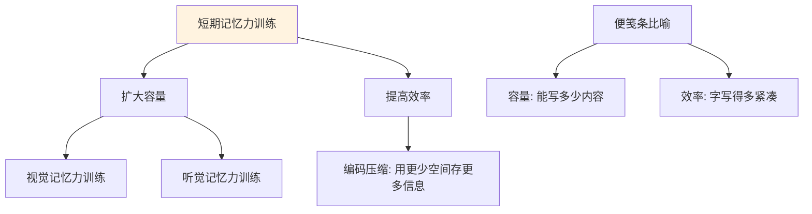
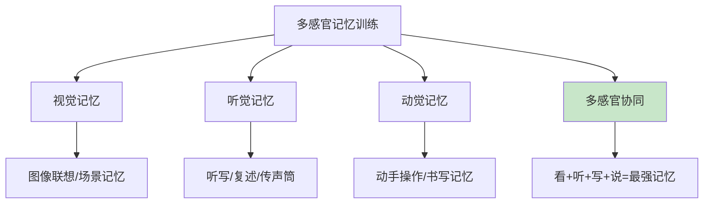
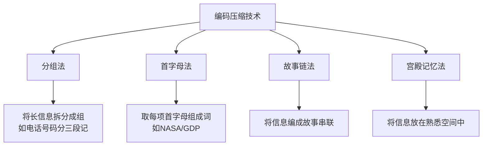
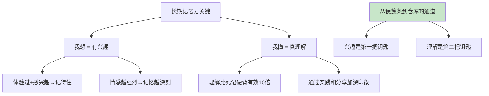
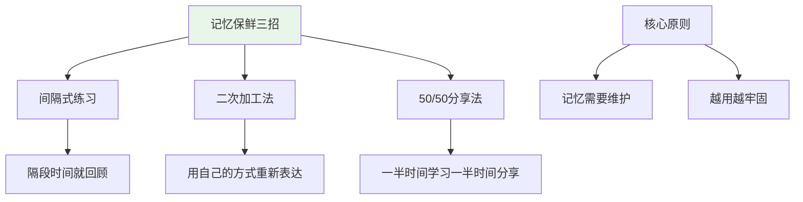
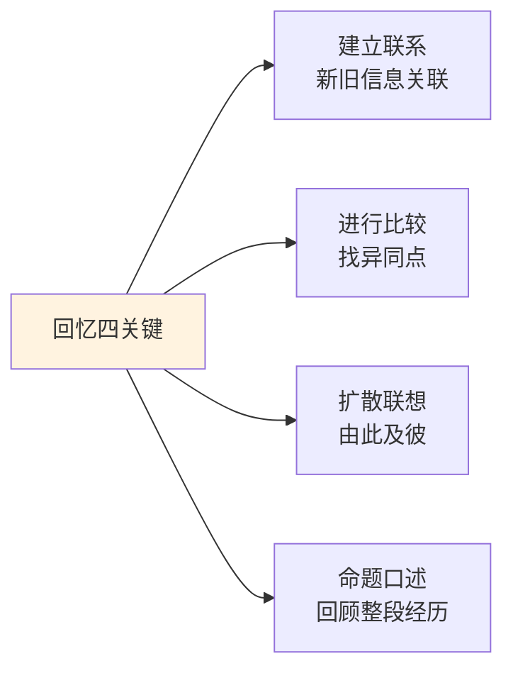
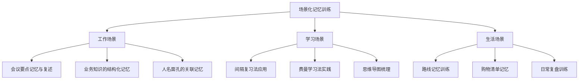
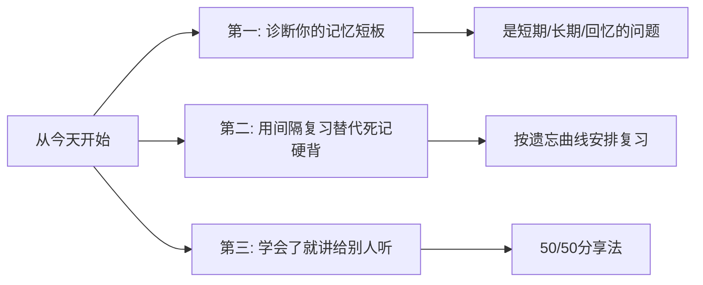

# 7.4记忆能力的训练
#### 目录介绍
- [01.记忆力的组成体系](#01记忆力的组成体系)
- [02.遗忘规律与对策](#02遗忘规律与对策)
- [03.短期记忆力训练](#03短期记忆力训练)
- [04.感官记忆力锻炼](#04感官记忆力锻炼)
- [05.编码与压缩技术](#05编码与压缩技术)
- [06.长期记忆力提升](#06长期记忆力提升)
- [07.给大脑记忆保鲜](#07给大脑记忆保鲜)
- [08.回忆能力的训练](#08回忆能力的训练)
- [09.场景化记忆训练](#09场景化记忆训练)
- [10.今天起改变三点](#10今天起改变三点)
- [12.课后作业思考下](#12课后作业思考下)

## 01.记忆力的组成体系

### 1.1 记忆力的三大组成

小时候读书记不住，常被说"金鱼脑子"。但很少有人告诉我们：记忆力不是一个整体，而是由三个不同的部分组成，每个部分有不同的功能和训练方法。

**短期记忆力**——大脑的"便笺条"。它像随手贴一样，可以暂时存储一些信息，事情处理完后就可以丢掉。比如你临时记下一个电话号码，打完电话就忘了。短期记忆的容量有限，一般只能同时记住5-9个信息单元。

**长期记忆力**——大脑的"仓库"。重要的信息从便笺条转移到仓库中，可以长期存储。长期记忆又分为情景记忆（亲身经历的事）和语义记忆（学到的知识和概念）。

**回忆能力**——大脑的"调度系统"。仓库里存了很多东西，但能不能在需要的时候快速找到并调取出来，取决于回忆能力。很多人说"我记性差"，其实不一定是存储的问题，可能是调取的问题。

### 1.2 诊断你的记忆力短板

| 症状 | 可能的短板 | 训练方向 |
|------|-----------|----------|
| 刚听到的信息转头就忘 | 短期记忆力不足 | 扩大"便笺条"容量 |
| 死记硬背但过几天就忘 | 长期记忆转化不足 | 通过理解和兴趣加深编码 |
| 知道学过但想不起来 | 回忆能力不足 | 建立更多信息联系和检索线索 |
| 记不住别人说的长句子 | 听觉记忆力不足 | 专项听觉记忆训练 |
| 看完的内容无法复述 | 视觉记忆+加工能力不足 | 联想记忆+复述训练 |

很多人笼统地说"记忆力差"，但不同的症状对应不同的训练方向。先诊断自己的短板在哪里，才能有针对性地提升。

### 1.3 记忆力与学习效率

在学习过程中，很多人每天翻来覆去地死记硬背，最终却记不住多少。这不是努力不够，而是方法不对。提高记忆力不是"更用力地记"，而是"更聪明地记"——掌握遗忘规律、使用正确的编码方式、建立有效的提取线索。

## 02.遗忘规律与对策

### 2.1 掌握遗忘规律

艾宾浩斯遗忘曲线揭示了记忆和时间之间的关系：刚记完一个东西，20分钟后只能记住58%；1小时后44%；1天后34%；6天后25%；1个月后只剩21%。

这个规律告诉我们两件事：**第一，遗忘的速度是先快后慢的**——刚学完的前几小时遗忘最快，之后遗忘速度逐渐减缓。**第二，时时刻刻重复记忆的效果并不好**，在"快要遗忘"的时间点进行复习才是最高效的。

### 2.2 间隔重复法

根据遗忘规律，科学的复习安排如下：

| 复习时间 | 距学习的间隔 | 目的 |
|----------|-------------|------|
| 第1次复习 | 学习当天 | 趁记忆还新鲜，巩固第一遍 |
| 第2次复习 | 第2天 | 在快速遗忘期内拉回记忆 |
| 第3次复习 | 第4天 | 进一步巩固，减缓遗忘 |
| 第4次复习 | 第7天 | 一周回顾，强化长期记忆 |
| 第5次复习 | 第30天 | 月度回顾，转入长期仓库 |

比如学习一本技术书，每天学习新内容的同时，安排时间复习前几天学的内容；每周末回顾本周所学；每学完一个章节做一次章节总结；全书学完后做一次整体复习。这种"滚动复习"的方式，远比从头到尾读一遍然后束之高阁要有效得多。

### 2.3 复习的正确姿势

复习不是简单地"重新看一遍"。更有效的复习方式是**主动回忆**——合上书本或笔记，尝试在脑中回忆刚才学的内容。回忆得出来的部分已经记住了，回忆不出来的部分才需要重新学习。这种"考试式复习"比"重读式复习"的效果要好2-3倍。

## 03.短期记忆力训练

### 3.1 短期记忆是基础中的基础

短期记忆力如同长期记忆力和回忆能力的"入口"——如果入口特别小，输入的东西必然就少。只有把短期记忆的基础打好，才能让整体记忆力提升上去。

把短期记忆比作"便笺条"，要提高短期记忆力无非两点：**第一，扩大便笺条的容量**（提高视觉记忆力和听觉记忆力）；**第二，提高便笺条的使用效率**（通过编码和压缩技术，在相同空间内记录更多信息）。

### 3.2 视觉记忆力训练

视觉记忆力是最常用的记忆通道。训练方法包括：

**观察→回忆→验证**：观察一张图片或一个场景30秒，然后闭上眼睛回忆细节，最后对照验证。逐渐增加观察的信息量和减少观察时间。

**文字转图像**：研究表明，大脑对图像的记忆远比文字深刻。因为记忆图像时，大脑同时调动了左右脑的语言区和非语言区。所以尽量把要记的文字信息转化为图像来记忆——比如记一个流程，在脑中画出流程图。

**联想可视化**：把要记忆的抽象概念和具体的视觉形象联系起来。比如要记住"通货膨胀"的概念，想象一个气球被不断吹大，最终钱币从气球里掉出来——这个画面会比干巴巴的定义好记得多。

### 3.3 听觉记忆力训练

**学会"听"**：锻炼听觉记忆力，首先要学会认真地听。听演讲、听播客、听别人说话时，刻意去捕捉关键信息，而不是让声音从耳边飘过。

**"传声筒"复述法**：听完一段话后，立刻用自己的话复述出来。复述的过程就是在检验你是否真的"听到"了。从简单的短句开始，逐渐增加到长段落和完整内容。

**听写训练**：选一段音频，仔细聆听并尝试将听到的内容准确地写下来。逐渐增加难度，提高听写的准确性和速度。

**数字/单词序列训练**：让别人随机报一串数字或单词，你立刻复述。从3个开始，逐渐增加到5个、7个、9个。这是最直接的听觉短期记忆训练。

## 04.感官记忆力锻炼

### 4.1 多感官协同的威力

利用多种感官参与学习——听、看、写、说同时进行——可以显著增强记忆效果。因为每增加一种感官通道，就多了一条通往记忆的路径。

比如学习一个新概念：先阅读（视觉），然后听别人讲解或听音频（听觉），再用自己的话写下来（动觉+视觉），最后讲给别人听（语言表达）。这样通过四种感官通道多次编码的信息，比只用眼睛看一遍的记忆效果强数倍。

### 4.2 情景关联记忆法

将要记忆的内容与具体的情境或场景联系起来，可以大幅提升记忆效果。因为大脑擅长记忆"故事"和"场景"，而不擅长记忆孤立的信息片段。

比如你要记住一个会议中达成的五项决议，可以在脑中想象会议室的场景——把第一个决议和会议室的投影仪联系起来，第二个决议和白板联系起来，第三个和桌上的咖啡杯联系起来……通过场景中的具体物品作为"记忆锚点"，信息就变得容易记住了。

### 4.3 动觉记忆的力量

有些人是"动觉型学习者"——通过动手操作和身体参与来加深记忆。如果你发现自己看了记不住、听了记不住，试试动手写、动手做。

**手写笔记**比打字笔记的记忆效果更好，因为手写的速度更慢，迫使大脑对信息进行筛选和加工。**动手实操**比纯粹看教程的学习效果更好，因为身体的参与创造了更丰富的感官记忆。

## 05.编码与压缩技术

### 5.1 编码压缩的原理

短期记忆的容量有限，一般只能记住5-9个信息单元。但如果你能把多个小信息"打包"成一个大信息单元，就相当于在相同的便笺条上记录了更多内容。

会速记的人之所以"牛"，就是因为他们用代码把一整句话浓缩成几个字。我们虽然不需要学速记，但可以运用一些编码压缩技术来提高记忆效率。

### 5.2 常用的编码压缩方法

**分组法**：把长信息拆分成几个小组来记。比如电话号码"13812345678"拆成"138-1234-5678"就容易记多了。这是最简单也最常用的编码方式。

**首字母法**：取每个要记忆项目的首字母组成一个新词或短语。比如"SMART目标"就是Specific、Measurable、Achievable、Relevant、Time-bound的首字母组合。在工作和学习中可以广泛运用这个技巧。

**故事链法**：把一串无关联的信息编成一个有趣的故事串联起来。故事越荒诞、越有画面感，记忆效果越好。比如你要记住"苹果、钥匙、大象、雨伞"这四个词，可以想象"一只大象撑着雨伞，用钥匙打开了一个巨大的苹果"。

**宫殿记忆法**：在脑中构建一个你非常熟悉的空间（比如你的家），把要记忆的信息依次放在这个空间的不同位置。回忆时在脑中"走"一遍这个空间，就能按顺序提取出所有信息。这是记忆大师们最常用的技巧。

### 5.3 编码的核心原则

不管用什么编码方法，核心原则都是一样的：**把抽象的信息转化为具体的、有联系的、有画面感的信息**。大脑不擅长记忆抽象、孤立、无意义的信息，但非常擅长记忆具体的画面、有趣的故事和有逻辑的关联。

## 06.长期记忆力提升

### 6.1 "我想"：兴趣是最好的记忆力

为什么你能记住一年前旅游的经历，却记不住昨天才学的知识？为什么你能一字不差地背出喜欢歌曲的歌词，却记不住考试的重点？

答案就藏在"我想"两个字里。长期记忆力最关键的驱动力是**兴趣**。你感兴趣的东西，大脑会自动分配更多的注意力和处理资源来编码它，记忆自然更深刻。你不感兴趣的东西，大脑会把它当做"不重要"的信息，简单过一遍就扔掉了。

**提升方法**：对于那些你必须记住但不太感兴趣的内容，想办法找到其中有趣的角度，或者把它和你感兴趣的事物联系起来。比如你对经济学不感兴趣，但你对投资感兴趣——那就从投资的角度来学经济学，兴趣自然就来了。

### 6.2 "我懂"：理解是长期记忆的基石

死记硬背的东西，就算当时记住了，过不了多久也会忘。但如果你真正理解了一个概念的原理和逻辑，它就会牢牢地扎根在长期记忆中。

**理解记忆 vs 机械记忆**：

| 对比维度 | 机械记忆 | 理解记忆 |
|----------|----------|----------|
| 记忆方式 | 逐字逐句反复背诵 | 理解原理后用自己的话表述 |
| 保持时间 | 短，容易遗忘 | 长，不容易遗忘 |
| 灵活性 | 低，换个问法就不会 | 高，能举一反三 |
| 提取难度 | 高，需要完全匹配的线索 | 低，多种线索都能激活 |

**提升方法**：不要死记硬背。学任何东西都先搞懂"为什么"和"怎么运作的"。最好通过实践来加深理解——看了一个编程教程就动手写代码，读了一个管理理论就在工作中尝试应用。

## 07.给大脑记忆保鲜

### 7.1 间隔式练习

信息进入长期记忆后并非一劳永逸，它会随着时间逐渐模糊。就像食物需要保鲜一样，记忆也需要"保鲜"。

**间隔式练习**是最有效的记忆保鲜方法。比如你读了一本特别好的书，与其读完就放在书架上再也不看，不如在一个月后再读一遍，三个月后再读一遍，半年后再读一遍。每次重读你都会有新的理解，同时原有的记忆也得到了巩固。

关键是"隔段时间就要回顾"，而不是一次性密集复习。间隔式的回顾比密集式的背诵效果好得多。

### 7.2 二次加工法

死记硬背的知识越来越少，活学活用的技能越来越多。理论到实践的转化是工作后非常重要的能力。

**学会用自己熟悉的方式进行二次加工。** 无论是读一本书还是学习一项业务，重要的是加入自己的理解，用自己的语言方式去重新表达。只有经过你大脑加工后输出的信息，才是真正被你理解和记住的。

比如学了一个新的技术概念，不要只是标记"已读"，而是用自己的话写一段总结；参加了一个培训，不要只是保存PPT，而是用自己的理解重新整理一份笔记。

### 7.3 50/50分享法

把你50%的时间用来学习新东西，剩下50%的时间用来和别人分享或解释你所学到的东西。向别人解释一个概念是促进自己学习的最好方法。

比如你今天花了1小时读一本书，读到一半的时候，停下来尝试回忆之前的内容，然后把学到的关键思想分享给朋友或写在笔记中。这种"学一半、分享一半"的方式，是学习、处理、保留和记住信息的最优方法。

**费曼学习法的核心就是这个原理**：如果你能用简单的语言把一个概念解释清楚，说明你真的理解了。如果解释不清楚，说明你的理解还有缺口。

## 08.回忆能力的训练

### 8.1 回忆能力是"调度系统"

很多人的长期记忆力其实不错，"仓库"里存了很多东西。但问题是：需要的时候找不到。这就是回忆能力不足——调度系统出了问题。

提升回忆能力的关键是：在存储信息时就建立好"检索线索"，让信息在仓库中不是杂乱堆放，而是按照一定的逻辑关系有序排列。

### 8.2 四种提升回忆能力的方法

**建立联系**：每学一个新知识，都问自己"这和我以前知道的什么有关系？"人的认知过程就是不断建立联系的过程。比如读到一个新的管理理论，可以想想它和你之前学的哪个理论有相似之处。联系越多，回忆时的"入口"就越多。

**进行比较**：把新信息和已有信息进行比较。今天的方案和昨天的方案有什么不同？这本书的观点和那本书的观点有什么冲突？比较的过程帮助你建立更多的联系和区分，让信息在记忆中更有辨识度。

**扩散联想**：由一个信息点向外扩散联想。看到一个词或概念，你能联想到什么？从一个点扩散到五个点，再从五个点各自扩散——这就是扩散性思维，它让记忆网络越来越密，回忆时就能从多个路径找到目标信息。

**命题口述**：定期做"我的一天"或"我的一周"的口述回顾。不看任何记录，完全凭回忆描述一个完整的时间段里发生了什么。这种练习帮助你回顾、调度和组织记忆，是非常好的回忆能力训练。

## 09.场景化记忆训练

### 9.1 工作场景的记忆训练

**会议要点记忆**：开完会后，不看笔记，花3分钟回忆会议的核心要点：讨论了什么？结论是什么？我的待办是什么？然后对照笔记验证，看漏掉了什么。

**业务知识的结构化记忆**：用思维导图把业务知识整理成树状结构。先记住主干（大的分类和框架），再填充细节。结构化的信息比零散的信息好记得多。

**人名面孔关联记忆**：初次见面时，把对方的名字和一个突出的外貌特征联系起来。比如"张三——戴圆框眼镜的高个子"。下次见面时，眼镜会激活"张三"的记忆。

### 9.2 学习场景的记忆训练

**间隔复习法实践**：买一套复习卡片或使用间隔重复App（如Anki），把重要的知识点做成卡片，按照遗忘曲线的节奏自动安排复习。

**费曼学习法实践**：每学完一个知识点，假装你面前坐着一个完全不懂的人，尝试用最简单的语言向他解释。说不清楚的地方就是你还没理解透的地方，回去重新学习。

**思维导图梳理**：每学完一个章节或一个主题，画一张思维导图梳理其中的逻辑关系。这个过程既是理解过程，也是记忆编码过程。

### 9.3 生活场景的记忆训练

**购物清单记忆**：去超市前列一份购物清单，然后把清单放起来不看，尝试凭记忆买完所有东西。回来后对照清单，看漏了几样。

**路线记忆训练**：去一个新地方后，尝试不用导航，凭记忆走回来。这种空间记忆训练对整体记忆力有很好的促进作用。

**睡前复盘**：每天睡前花5分钟，回忆今天最重要的三件事。不需要面面俱到，只需要核心内容。这是对回忆能力最好的日常训练。

## 10.今天起改变三点

**第一，诊断你的记忆力短板。** 问问自己：我的记忆问题到底出在哪里？是记不住（短期记忆不足）、还是记不久（长期记忆转化不足）、还是想不起来（回忆能力不足）？找到短板才能对症下药。

**第二，用间隔复习替代死记硬背。** 从今天开始，无论学什么新东西，都按照"当天→第2天→第4天→第7天→第30天"的节奏安排复习。不要指望看一遍就能记住，更不要在最后一刻临时抱佛脚式地死记硬背。

**第三，学会了就讲给别人听。** 今天读了一篇文章、学了一个新概念，找个机会用自己的话讲给同事或朋友听。如果讲不清楚，说明你还没有真正理解和记住。"教是最好的学"，把50/50分享法变成你的学习习惯。

## 12.课后作业思考下

1. 如果你总觉得自己"记忆力差"，请对照本章的诊断表自查一下，你的记忆力短板到底在哪里——是短期记忆、长期记忆还是回忆能力？针对短板制定一个具体的训练计划。

2. 选择一个你正在学习的知识点，用费曼学习法来检验你的掌握程度：尝试用最简单的语言解释给一个外行人听。记录下你"卡壳"的地方，那就是你需要重新学习的部分。

3. 从明天开始，用间隔复习法来管理你的学习内容。可以使用Anki等间隔重复App，也可以简单地用便签记录复习日期。坚持一个月，对比之前的记忆效果。

4. 设计一个适合自己的"记忆保鲜"习惯：比如每周五花30分钟回顾本周学到的新知识，用思维导图整理，然后尝试讲给别人听。
