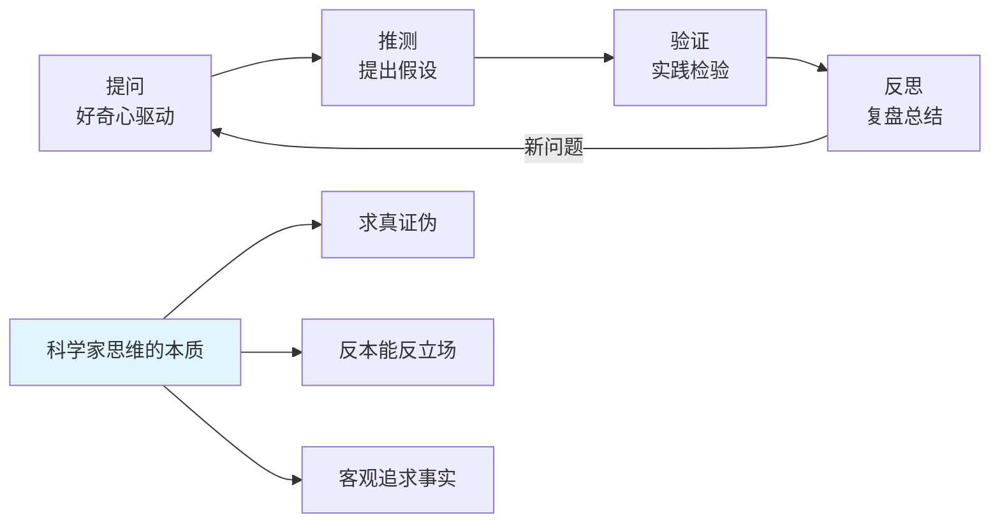
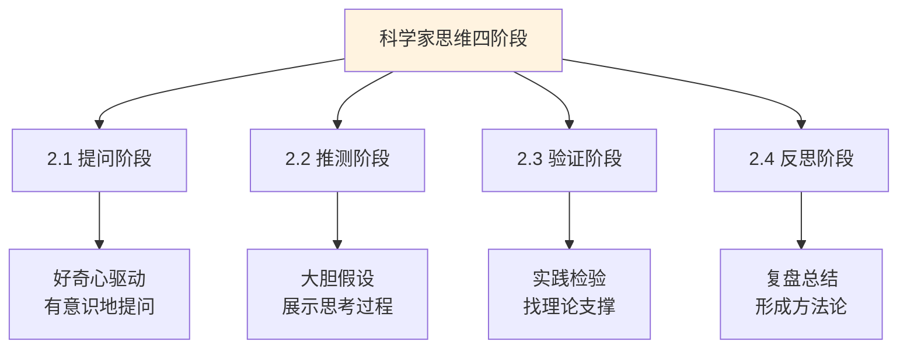
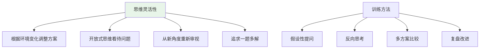
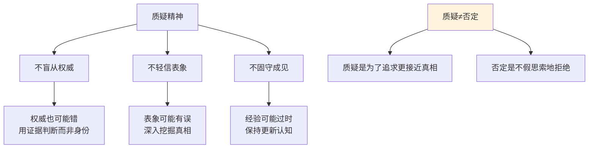
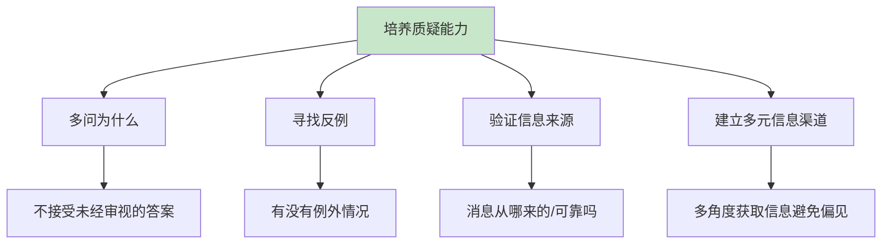
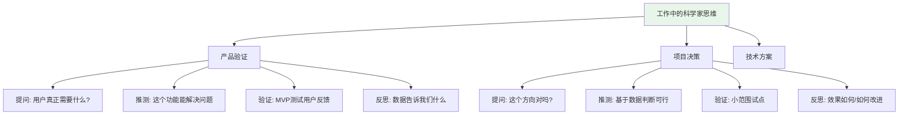
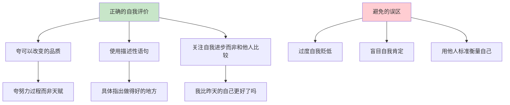
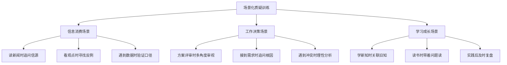
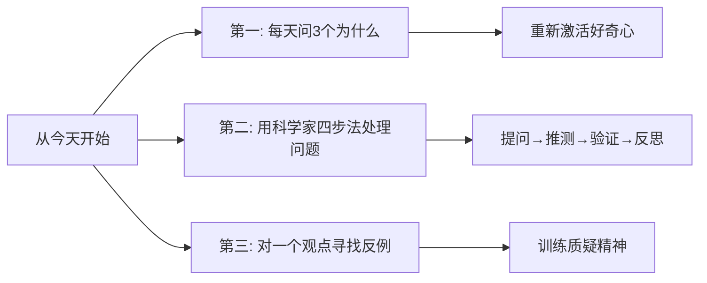

# 7.5质疑精神的分析
#### 目录介绍
- [01.什么是科学家思维](#01什么是科学家思维)
- [02.四个阶段的详解](#02四个阶段的详解)
- [03.思维灵活性训练](#03思维灵活性训练)
- [04.质疑精神的本质](#04质疑精神的本质)
- [05.如何培养质疑能力](#05如何培养质疑能力)
- [06.科学实验思维方式](#06科学实验思维方式)
- [07.正确的自我评价](#07正确的自我评价)
- [08.场景化质疑训练](#08场景化质疑训练)
- [10.今天起改变三点](#10今天起改变三点)
- [12.课后作业思考下](#12课后作业思考下)

## 01.什么是科学家思维

### 1.1 为什么要学科学家思维

学习科学家思维不是为了成为科学家，而是为了让自己的思考质量更高。每个科学家都具有顶尖的质疑能力、思考能力和逻辑能力——我们要培养的就是像科学家那样思考。

"科学家思维"是一种求真证伪的思维模型。它与普通人思维最大的区别在于：**客观追求事实，反本能、反立场、反观点**。普通人容易被情绪、立场和偏见左右判断，而科学家思维要求你先放下预设的观点，用证据和逻辑来得出结论。

### 1.2 科学家思维的四个阶段

| 阶段 | 核心动作 | 关键词 | 实际应用 |
|------|----------|--------|----------|
| **提问** | 对现象产生好奇 | 这是什么？为什么？ | 遇到问题时主动提问而非回避 |
| **推测** | 基于已有知识提出假设 | 我认为、我猜测 | 大胆假设但不盲信 |
| **验证** | 通过实践检验假设 | 试试看、查查看 | 用数据和事实验证推测 |
| **反思** | 复盘总结形成方法论 | 为什么对/错？下次如何做更好？ | 无论成败都提取经验 |

大部分科学家的伟大发明，都是从一个"提问"开始的。而大部分人的成长停滞，恰恰是因为失去了提问的习惯——对一切都"习以为常"，不再好奇，不再质疑。

## 02.四个阶段的详解

### 2.1 提问阶段：重新激活好奇心

提问是科学家思维的起点。有意识地对自己进行提问、刺激思考，就会自然而然地产生探索的欲望。

互动性、开放式的提问——"这是什么？""为什么会这样？""还有没有其他可能？"——能持续激发思维的活跃度。

**好奇心是会退化的。** 如果你每天都生活在固定的环境中，对很多东西已经司空见惯，好奇心就会逐渐萎缩。解决办法是刻意"换个环境"或"换个视角"：去没去过的地方、读不同领域的书、和不同背景的人交流。新的刺激会重新点燃你的好奇心。

**日常训练**：每天至少问自己3个"为什么"。看到一个现象、读到一条新闻、听到一个观点，先不要接受或拒绝，而是问：为什么是这样？有没有其他解释？

### 2.2 推测阶段：大胆提出假设

提出问题后，下一步是基于自己已有的知识和经验进行推测。这个阶段的关键是**敢于假设，不怕犯错**。

有意识地使用推测性的语言："我认为……""我猜测……""虽然我不确定，但根据经验推测可能是……"这些语句的使用帮助你意识到自己在进行推测而非陈述事实。

**展示思考过程很重要。** 遇到问题时，不仅要想答案，还要清晰地展示你的思考步骤："我看到的问题是什么→基于我的经验我推测原因是什么→如果是我的话我会怎么做。"这个过程帮助你建立系统化的推测能力。

**大胆假设一个突破方法。** 先别管这个假设是否有效，先假设它有效。这个"假设"本身就是你行动的"动力源"——有了假设才有验证的方向，有了方向才有行动的动力。

### 2.3 验证阶段：用事实说话

推测出来了，接下来就要验证——不是在脑子里空想，而是用实际行动去检验。

**所有的问题都是好问题，但如何找到答案才是关键。** 验证的方式包括：

- **查找资料**：要给推测找"理论支撑"，这个理论可以是别人的经验总结、学术研究或行业数据
- **小范围实践**：做项目先找个小市场测试；做产品先出个最小可行版本；做研发先跑实验数据
- **请教他人**：向有经验的人请教，看看你的推测是否经得起推敲

实践是检验真理的唯一标准。验证的过程本质就是"实践"——通过现实结果反向验证假设是否成立。

### 2.4 反思阶段：复盘形成方法论

推测的结果无论正确与否，最关键的一步是反思。反思不是简单的"总结"，而是把经验提炼为可复用的方法论。

**反思的核心问题**：
- 我的假设是否成立？为什么成立/不成立？
- 这次经验能提炼出什么规律？
- 下次遇到类似问题，我可以怎么做得更好？
- 这个经验能否迁移到其他领域？

不断地修正和反思，形成可以在多种场景下使用的方法论。这是反思的价值和意义。最终目标是形成自己的经验认知体系——把一次次的个案经验，沉淀为系统化的方法论。

## 03.思维灵活性训练

### 3.1 什么是思维灵活性

思维灵活性是指根据环境变化提出更优方案的能力，它包括：开放式的思维、愿意从新角度审视问题、与创新精神密切关联。

读书时有一种特别"牛"的同学——他们喜欢"一题多解"。别人觉得做出来就行了，他们却在思考："有没有更优的解法？更简洁的步骤？另一种思路？"这种追求更优解的习惯，就是思维灵活性的体现。

在工作中同样如此：面对一个问题，如果你只能想到一种解决方案，说明思维灵活性还有很大的提升空间。如果你能想到3-5种方案并分析各自的优劣，你的思维灵活性就相当出色了。

### 3.2 假设性提问训练

假设性提问是锻炼思维灵活性最有效的方法之一。它的核心是"换位思考"和"情景推演"：

**成功了怎么做**："如果再来一次，如何做得更好？还有什么新方法？"——不满足于成功，追求更优。

**失败了怎么做**："如果重来一次，哪里可以改进？什么策略可以避免这个失败？"——从失败中提取最大价值。

**换个角度怎么做**："如果我是客户/领导/竞争对手，我会怎么看待这个方案？"——跳出自己的视角。

**极端情况怎么做**："如果资源只有现在的一半，我还能达成目标吗？如果时间减半呢？"——在限制中激发创造力。

### 3.3 反向思考训练

思维灵活性的另一个重要维度是"反向思考"——不是想"怎么做能成功"，而是想"怎么做一定会失败"。

比如你要策划一个活动，常规思路是想"怎么让活动成功"。反向思考则是列出"所有可能导致活动失败的因素"，然后逐一排除这些风险。这种"逆向工程"往往能发现正向思考中遗漏的盲点。

## 04.质疑精神的本质

### 4.1 质疑不等于否定

首先需要明确一个重要区分：**质疑不是否定**。质疑是带着好奇心和求真心去审视信息，目的是追求更接近真相的答案。否定是不假思索地拒绝，是封闭的态度。

质疑的姿态是："这个观点有意思，但支撑它的证据充分吗？有没有其他角度？"而否定的姿态是："我不信，肯定不对。"前者是开放的、建设性的；后者是封闭的、破坏性的。

### 4.2 质疑精神的三个维度

**不盲从权威**：即使是行业大咖、知名学者、资深前辈说的话，也要用证据和逻辑来判断，而不是因为"他是权威所以一定对"。历史上太多次证明，权威也会犯错，曾经的"共识"也会被推翻。

**不轻信表象**：第一眼看到的、第一次听到的，不一定是事实的全部。表象可能是片面的、误导性的甚至是刻意包装的。养成"多看一层、多想一步"的习惯。

**不固守成见**：你过去的经验是宝贵的，但经验也可能过时。在快速变化的世界里，"这是我一直以来的做法"不能成为不改变的理由。保持认知的持续更新。

### 4.3 质疑精神在日常中的应用

- 看到一条热搜新闻：先不急着相信或转发，问一问"消息来源可靠吗？有没有其他角度的报道？"
- 听到一个观点："他说得有道理，但论据充分吗？有没有反例？"
- 面对一个决策："这个方案是最优的吗？我们有没有遗漏什么风险？"
- 接到一个需求："这个需求背后真正要解决的问题是什么？有没有更好的方式？"

## 05.如何培养质疑能力

### 5.1 "五个为什么"法

丰田公司有一个著名的"五个为什么"（5 Whys）方法：遇到问题时连续追问5个"为什么"，层层深入直到找到根本原因。

比如：
- 为什么项目延期了？→因为开发没有按时完成
- 为什么开发没按时完成？→因为中途需求变更了
- 为什么需求变更了？→因为前期需求评审不充分
- 为什么评审不充分？→因为没有邀请关键干系人参与
- 为什么没邀请？→因为没有建立完善的评审流程

通过连续追问，你会发现表面的问题背后往往有更深层的原因。这就是质疑精神在问题解决中的强大作用。

### 5.2 主动寻找反例

当你听到一个观点或结论时，刻意去寻找反例——"有没有例外情况？有没有这个观点不成立的场景？"

比如有人说"996是成功的必要条件"。你可以思考：有没有不996也很成功的人？有没有996却没有成功的人？这个观点的前提条件是什么？在什么条件下它成立？在什么条件下它不成立？

寻找反例不是为了否定对方，而是为了更全面地理解一个事物。一个能经受住反例考验的观点，才是更可靠的观点。

### 5.3 验证信息来源

在信息泛滥的时代，培养验证信息来源的习惯至关重要：

| 验证维度 | 关键问题 | 可靠信号 | 不可靠信号 |
|----------|----------|----------|-----------|
| **来源** | 信息从哪来的？ | 权威机构、原始数据 | 来源不明、未标注出处 |
| **证据** | 有没有数据或事实支撑？ | 有具体数据和案例 | 只有观点没有论据 |
| **立场** | 发布者有没有利益冲突？ | 立场中立客观 | 明显有商业或政治立场 |
| **时效** | 信息是最新的吗？ | 标注了时间和更新日期 | 信息过时或时间不明 |
| **多源** | 其他渠道有类似报道吗？ | 多个独立来源交叉验证 | 只有单一来源 |

## 06.科学实验思维方式

### 6.1 把工作当"实验"来做

科学家思维不只是用在实验室里，它完全可以应用到工作的方方面面。核心理念是：**把每一个决策都当做一个"实验"——有假设、有验证、有结论、有改进。**

做产品：提出假设"这个功能能解决用户XX痛点"→做出最小可行版本（MVP）→投放到小范围用户中测试→根据数据反馈决定是否继续。

做项目：提出假设"这个方案可以在预算内解决问题"→先做试点→收集效果数据→根据结果决定是否全面推广。

做研发：提出假设"这种技术方案性能更好"→搭建实验环境跑压测→用数据验证假设→根据结果选择最优方案。

### 6.2 科学实验的关键提醒

在用科学家思维做事时，要注意以下几点：

**不要急于看结果。** 很多人做完一个"实验"就像看变戏法一样——看完结果觉得有意思，然后就结束了。真正有价值的是过程中的提问、推测和反思，而不只是最终的结果。

**按四步走。** 每次面对一个问题，按照"提问→推测→验证→反思"四步来走。即使你很有经验，也不要跳过提问和推测直接"凭感觉"做决定。

**记录过程。** 把你的假设、验证方法和结论记录下来。这些记录积累起来就是你的"方法论知识库"，未来遇到类似问题时可以快速参考。

## 07.正确的自我评价

### 7.1 正确评价自己的努力

质疑精神不仅用于审视外界信息，也应该用于审视自己——但方向很重要。正确的自我评价应该是建设性的，而不是破坏性的。

**评价可以改变的品质。** 不要用"我不够聪明""我没有天赋"这种固定思维来评价自己。这些品质你无法控制。而应该评价那些你可以改变的：我是否足够努力？我的方法是否正确？我有没有在持续改进？

**使用描述性的评价。** 不要笼统地说"我做得不好"，而要具体地分析："我在XX环节做得不错，但在XX方面还有提升空间，具体可以通过XX来改进。"

### 7.2 关注自我进步

避免和他人比较的评价方式。"他比我强多了""我不如他"——这种比较毫无建设性，只会打击信心。

正确的做法是和自己的过去比："我比上个月进步了吗？""和三个月前相比，我在XX方面有什么变化？"关注自己的进步轨迹，而不是在某个时间点上和他人的静态对比。

### 7.3 从失败中学习而非自我否定

质疑精神要求我们对失败有正确的态度：失败不是自我价值的否定，而是学习的机会。

- 一次方案被否定 → 不是"我能力不行"，而是"这次方案的XX部分需要改进"
- 一次考试没考好 → 不是"我不适合学这个"，而是"我的XX知识点还没有掌握"
- 一次沟通不顺畅 → 不是"我情商低"，而是"我在XX情况下的沟通方式需要调整"

区分"事情的失败"和"人的失败"，是质疑精神应用于自我评价时最重要的原则。

## 08.场景化质疑训练

### 8.1 信息消费中的质疑训练

**每天选一条新闻进行"质疑练习"**：读一条新闻，然后回答以下问题——信息来源是什么？有没有多个独立来源交叉验证？报道中使用了哪些证据？有没有可能存在偏见或利益冲突？有没有其他角度的报道？

**每周选一个观点进行"反例搜索"**：听到一个你很认同的观点，刻意去寻找反对这个观点的论据和案例。这不是为了改变你的看法，而是为了让你的观点更加全面和稳固。

### 8.2 工作决策中的质疑训练

**方案评审时**：不要只看方案"能不能做"，还要问"为什么要这样做？有没有其他方案？各方案的利弊是什么？最坏情况会怎样？"

**接到需求时**：不要拿到需求就开始做，先追问"这个需求背后要解决的问题是什么？这是最好的解决方式吗？有没有更简单的方案？"

**遇到分歧时**：不要急于争论谁对谁错，先理解对方的立场和依据是什么，然后用事实和逻辑来讨论，而不是用情绪和立场来争论。

### 8.3 学习成长中的质疑训练

**带着问题去学习**：学习前先列出你想要回答的问题，然后带着这些问题去阅读。这种"主动寻找答案"的方式比"被动接收信息"的效率高数倍。

**读书时做"批注"**：每读到一个观点，在旁边写下你的反应——"我同意，因为……""我不确定，需要看更多证据""这和XX书说的矛盾，需要进一步思考"。这些批注就是你在练习质疑精神。

## 10.今天起改变三点

**第一，每天至少问自己3个"为什么"。** 遇到任何现象、观点、决策，先不急着接受或拒绝，先问"为什么"。为什么是这样？为什么不是那样？有没有其他解释？这个简单的习惯就是质疑精神的起点。

**第二，用科学家四步法来处理一个工作问题。** 选一个你正在面对的工作问题，按照"提问→推测→验证→反思"四个步骤走一遍。把你的假设写下来，然后用实际行动去验证，最后复盘总结。让科学家思维从概念变成你的实际工具。

**第三，对一个你深信不疑的观点，刻意寻找反例。** 选一个你一直坚持的观点或信念，花15分钟去搜索反对这个观点的论据。你不需要改变想法，但这个过程会让你的思考更加全面、更加深刻。

## 12.课后作业思考下

1. 选一个你最近遇到的工作问题，用科学家思维的四个阶段来分析：你的问题是什么（提问）？你的假设是什么（推测）？你打算怎么验证（验证）？无论结果如何，你从中学到了什么（反思）？把这个过程写下来。

2. 在接下来一周，每天选一条你看到的新闻或观点，用"五个维度验证法"（来源、证据、立场、时效、多源）来审视它。记录你的分析过程和发现。

3. 回顾你最近一次重要的工作决策。如果用科学家思维重新来过，你会在哪个阶段做得不同？提问、推测、验证、反思，哪个环节可以改进？

4. 学完本章后，总结出你明天起就能改变的3点具体行动。不要写空话（如"提高质疑精神"），要写具体的动作（如"每次看到标题党文章时先查证再转发"）。
