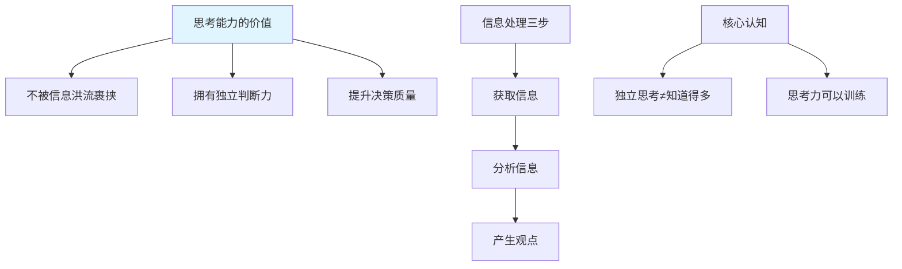
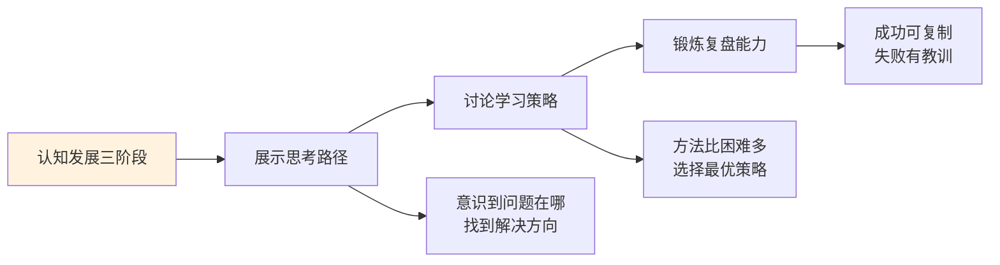
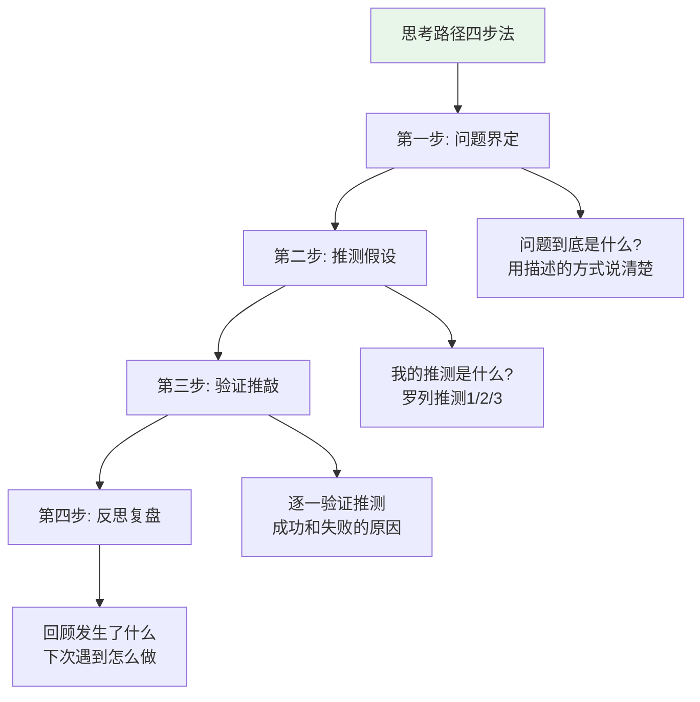
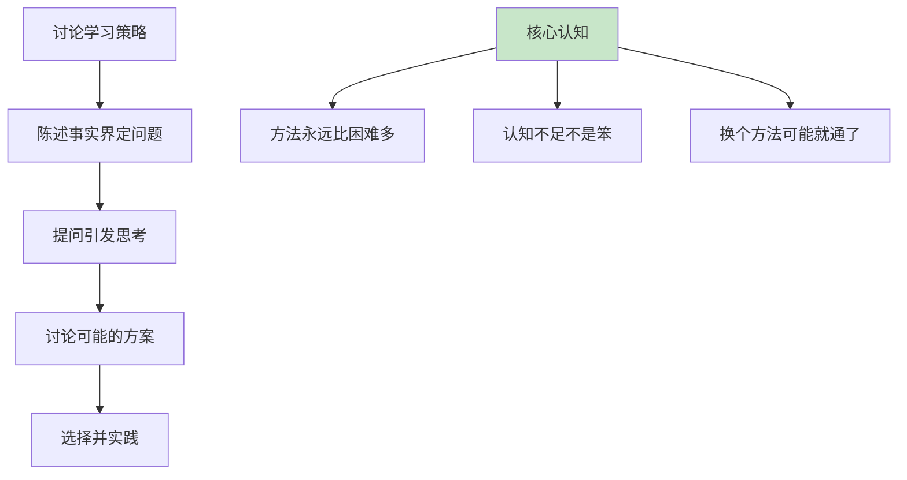
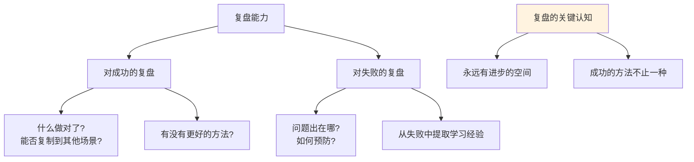
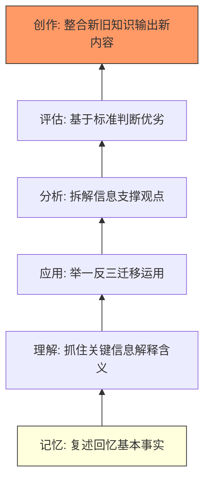
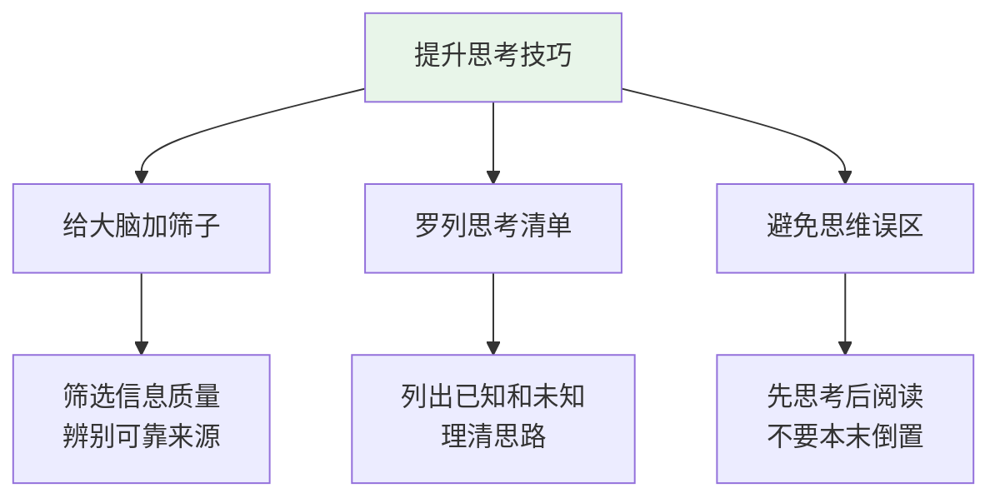
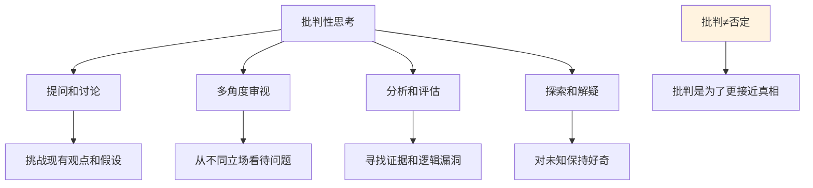
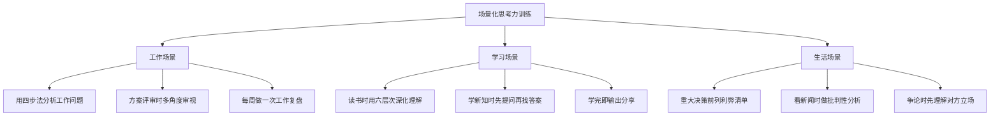
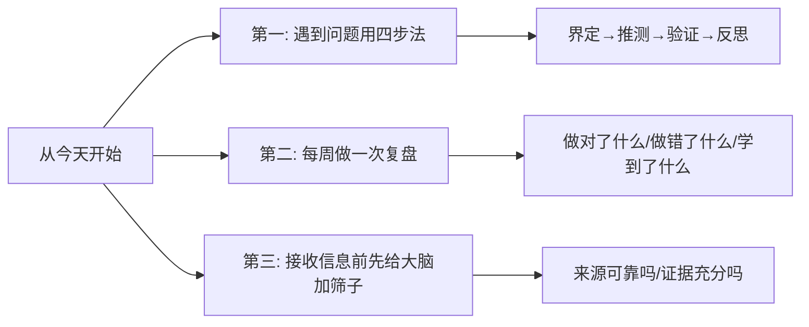

# 7.6思考能力的提升
#### 目录介绍
- [01.为何提升思考能力](#01为何提升思考能力)
- [02.促进认知的三阶段](#02促进认知的三阶段)
- [03.展示思考的路径](#03展示思考的路径)
- [04.讨论学习的策略](#04讨论学习的策略)
- [05.锻炼复盘的能力](#05锻炼复盘的能力)
- [06.布鲁姆思考六层次](#06布鲁姆思考六层次)
- [07.提升思考的实用技巧](#07提升思考的实用技巧)
- [08.引导批判性思考](#08引导批判性思考)
- [09.场景化思考力训练](#09场景化思考力训练)
- [10.今天起改变三点](#10今天起改变三点)
- [12.课后作业思考下](#12课后作业思考下)

## 01.为何提升思考能力

### 1.1 思考能力为什么重要

提到思考能力，很多人觉得太玄了，不知道它到底是什么，更不知道如何提升。但在互联网时代，思考能力的重要性比任何时候都大。

**信息泛滥的挑战**：一会儿刷抖音，一会儿打开小红书，一会儿又逛微博，我们每时每刻都在接收大量信息。如果一股脑接受而不加思考，思维就会越来越局限，逐渐丧失独立思考的能力。被大数据"投喂"的结果是：你以为自己在获取信息，其实是信息在控制你。

**独立思考的意义**：保持独立思考的能力，才能客观地看待这个世界。获取信息并独立思考可以概括为三步：**获取信息→分析信息→产生观点**。关键是最后一步——一定要输出自己内化后的见解，而不是简单复制别人的结论。

### 1.2 两个需要警惕的问题

**问题一**：我们获取信息变得超级简单，但大部分接收到的信息是毫无营养的。如果不去思考这些信息的好坏、真假和价值，思维就会越来越浅薄。

**问题二**：阻碍思考深度最大的坏习惯是——**自己有答案的问题，很少问别人；自己没答案的问题，很少问自己**。前者导致自以为是，后者导致思维懒惰。

### 1.3 一个重要的认知纠偏

很多人以为"要读很多书、知道很多事，才能成为一个独立思考的人"。但其实反过来的：**很多人不是因为读得多才学会独立思考，而是因为他们在独立思考的过程中不断给自己提问，为了解决问题去读书，然后看了很多书，思考了很多事。**

思考在前，阅读在后。先有问题，再找答案。

## 02.促进认知的三阶段

锻炼独立思考的能力，首先要促进认知的发展。认知的发展分为三个递进阶段：

**第一阶段：展示思考路径**——学会有意识地、有步骤地思考问题，把"我怎么想的"清晰地展示出来。

**第二阶段：讨论学习策略**——认识到解决问题不止一种方法，学会探索和比较不同的策略。

**第三阶段：锻炼复盘能力**——不满足于"做完了"，而是追问"怎么做得更好"，持续优化自己的思考方式。

对待问题需要去独立思考，而不是完全套用别人的答案。有时候得出的结论偏离了正确答案，但在这个探索的过程中，你学会了怎么去思考——这比答案本身更有价值。

## 03.展示思考的路径

### 3.1 为什么要展示思考路径

发展认知能力的第一步，是让自己意识到"问题出在哪里"，然后才能进一步明白"怎么去解决问题"。

很多人遇到问题时的状态是"脑子里一团浆糊"——知道有问题，但说不清楚问题是什么；觉得应该解决，但不知道从哪里下手。这就是因为缺乏清晰的思考路径。

### 3.2 思考路径的四个步骤

**第一步：问题界定** —— 问题到底是什么？用描述的方式把问题说清楚。很多时候问题一旦被清晰地定义出来，解决方案就已经浮现了。

**第二步：推测假设** —— 我觉得原因可能是什么？把自己的推测罗列出来：推测1、推测2、推测3……不要急于下结论，先把所有可能性都列出来。

**第三步：验证推敲** —— 逐一检验每个推测。哪些推测能被事实支撑？哪些推测站不住脚？验证成功和失败的原因分别是什么？

**第四步：反思复盘** —— 回顾整个过程。成功了——哪里做得好，可以复制？失败了——哪里出了问题，下次怎么避免？

### 3.3 实际应用示例

| 步骤 | 示例：项目进度延期 |
|------|-------------------|
| **界定问题** | 项目比计划晚了一周，主要延期在开发阶段 |
| **推测** | ①需求变更导致返工 ②开发人员对技术方案不熟悉 ③工期评估过于乐观 |
| **验证** | ①确认有2次需求变更共增加3天工作量 ②技术方案有一处设计不合理导致重构 ③原计划就偏紧未留缓冲 |
| **反思** | 下次立项时：需求评审更充分+技术方案先做POC+计划留20%缓冲时间 |

## 04.讨论学习的策略

### 4.1 方法比困难多

建立了思考路径后，就进入第二个阶段——讨论学习策略。这个阶段的核心认知是：**方法永远比困难多**。

当你遇到困难时，不要一味地指责自己"怎么这么笨"。很多时候不是你不够努力，而是方法不对。认知和思考能力的提升需要时间和正确的策略。

### 4.2 讨论策略的模式

**第一步：陈述事实，界定问题。** "我每天花2小时背英语单词，但一周后只记住了30%。"这是事实陈述。

**第二步：通过提问引发思考。** "有没有更高效的记忆方法？其他人是怎么背单词的？我的方法哪里可以优化？"

**第三步：讨论可能的方案。** 
- 方案A：每天多增加30分钟学习英语
- 方案B：把重点单词贴在家里最醒目的位置，利用碎片时间记忆
- 方案C：用间隔重复法替代集中背诵
- 方案D：通过阅读英文文章在语境中记忆单词

**第四步：选择最适合的方案并开始实践。** 不是每个方案都适合每个人，选择你觉得最可行的，试一段时间看效果。

### 4.3 讨论策略的价值

这个过程不仅能帮你解决眼前的问题，更重要的是它在训练你的思维方式：**遇到困难→不抱怨不放弃→分析原因→寻找多种方案→选择最优→付诸行动**。当这种思维方式内化为习惯后，你面对任何问题都会更从容。

## 05.锻炼复盘的能力

### 5.1 复盘是持续进步的引擎

了解了"怎样思考"和"怎样探索不同的策略"之后，还不能满足于"完成了"，而是要锻炼复盘能力——对自己的行为和结果进行回顾和反思。

复盘能力的核心认知是：**成功的方法不止一种，永远有进步的空间。**

### 5.2 成功时的复盘

成功了不代表没有改进空间。复盘成功时要问：

- **什么做对了？** 找出成功的关键因素，这些因素能否复制到其他项目？
- **有没有更好的方法？** 虽然这次成功了，但有没有更高效、更简洁的方式？
- **哪些是运气成分？** 成功中有多少是实力，有多少是运气？如果运气不好，还能成功吗？

### 5.3 失败时的复盘

失败时的复盘更为关键。不要只是说"下次认真一点"，而要具体分析：

比如你写的代码出了Bug，与其说"以后要细心"，不如复盘："这个Bug的根本原因是什么？是逻辑理解错误还是边界条件没考虑到？下次可以通过什么手段（代码审查、单元测试、预先设计）来预防？"

**关键是从失败中提取可操作的学习经验**，而不是笼统地归结为"不够认真"或"运气不好"。

### 5.4 复盘的标准模版

| 复盘环节 | 核心问题 | 输出 |
|----------|----------|------|
| **回顾目标** | 当初设定的目标是什么？ | 目标描述 |
| **评估结果** | 实际结果和目标的差距？ | 达成/未达成及差距分析 |
| **分析原因** | 为什么做到了/没做到？ | 成功/失败的关键因素 |
| **提炼经验** | 学到了什么？下次怎么做？ | 可复用的经验和改进方案 |

## 06.布鲁姆思考六层次

### 6.1 布鲁姆思考模型

1956年，教育心理学家布鲁姆提出了思考能力的六个层次，从低到高分别是：**记忆→理解→应用→分析→评估→创作**。这个模型被广泛接受和使用，是训练思考能力最经典的框架。

每个人不会只停留在某一个层次——面对不同的问题和场景，你的思考能力会有所不同。关键是要有意识地向更高层次训练。千万不要因为"畏难"而不尝试，当你开始用了，就已经成功了一半。

### 6.2 六个层次的详解与训练

| 层次 | 定义 | 训练方法 | 实用提问 |
|------|------|----------|----------|
| **记忆** | 复述、回忆基本事实 | 多使用"什么、何时、多少"类提问 | 这件事的时间线是什么？关键数据是什么？ |
| **理解** | 抓住关键信息，理解真实含义 | 多使用"解释、描述、猜测"类提问 | 你能用自己的话解释一下吗？核心观点是什么？ |
| **应用** | 举一反三，把知识迁移到新场景 | 多使用"展示、联系、检查"类提问 | 这个原理还能用在哪些场景？和之前的XX有什么关联？ |
| **分析** | 拆解信息，组装观点 | 多使用"区别、比较、分析"类提问 | 这两个方案最大的区别是什么？支撑这个结论的依据有哪些？ |
| **评估** | 基于标准判断信息的价值和优劣 | 多使用"评估、量化、判断"类提问 | 这个方案的ROI是多少？如何用数据衡量效果？ |
| **创作** | 整合新旧知识，输出新内容 | 多使用不同媒介展示成果 | 基于你学到的，能不能写一篇总结/做一次分享？ |

### 6.3 在工作中应用六层次

**记忆层**：项目的关键时间节点、核心数据、重要决策——这些基本事实你能准确记住并复述吗？

**理解层**：你能用自己的话解释项目的目标和核心策略吗？你能向一个不了解项目的人说清楚吗？

**应用层**：你从上一个项目学到的经验，能迁移到当前项目中吗？A项目的解决方案能否适配B项目的类似问题？

**分析层**：面对多个技术方案，你能拆解各自的优劣势，并用逻辑支撑你的推荐吗？

**评估层**：你做的方案效果如何？能用数据量化吗？在既定标准下达标了吗？

**创作层**：你能把项目经验总结成方法论，做一次技术分享或写一篇经验文章吗？

## 07.提升思考的实用技巧

### 7.1 给大脑加"筛子"

在信息爆炸时代，你的大脑需要一个"筛子"来过滤信息。收集信息之前先思考：**我对这件事了解多少？我需要什么样的信息？什么来源的信息是可靠的？**

很多缺乏独立思考能力的人，往往表现为"来者不拒"——什么信息都往脑子里塞，不加筛选。结果是大脑被大量垃圾信息占据，真正有价值的信息反而被淹没。

**实用方法**：建立你的"信息食谱"——确定几个你信任的高质量信息源（专业书籍、权威媒体、行业报告），把大部分信息获取集中在这些渠道，而不是无目的地刷社交媒体。

### 7.2 罗列思考清单

遇到一个需要深度思考的问题时，拿出一张纸或打开笔记，把以下内容列出来：

- **我已经知道什么？** （已有的知识和信息）
- **我还不知道什么？** （需要补充的信息）
- **我为什么认可/不认可某个观点？** （找出具体的理由）
- **这个观点的信息来源是什么？** （追溯信息源头）
- **有没有我遗漏的角度？** （检查盲区）

这份清单不仅能理清思路，还能暴露出你思考中的薄弱环节——那些你"不知道自己不知道"的盲区。

### 7.3 避免思维误区

**误区一：以为知道得多就能思考得深。** 很多人以为读了很多书、掌握了很多信息就能独立思考。但信息≠思考。信息是原材料，思考是加工过程。光有原材料不加工，最终还是一堆废料。

**误区二：以为有了答案就不需要思考。** 当你快速获得一个答案时，不要急着结束思考。问自己：这个答案是怎么得来的？逻辑是否完整？有没有其他可能的答案？最好的答案是经得起质疑的答案。

**误区三：以为思考就是想很久。** 高质量的思考不一定需要很长时间，但一定需要正确的方法。有时候花5分钟用结构化的方式思考，比漫无目的地想2小时更有效。

## 08.引导批判性思考

### 8.1 提问和讨论

批判性思考的第一步是学会提问。鼓励自己提出问题，挑战现有的观点和假设。问自己：为什么？如何证明？有什么证据支持？

通过开放性的问题，引发深入思考和讨论。比如在阅读一本书或看一部电影时，问自己："我同意主角的行为吗？为什么？在不同的场合，为何这个人表现不一样？"这样的问题能激发你从不同角度看待问题。

### 8.2 多角度审视

批判性思考要求你不只是从自己的角度看问题，而是尝试从不同的利益相关者的立场来审视。

**换位思考训练**：面对一个决策或争议，刻意站在不同角色的立场来思考——如果我是客户、我是竞争对手、我是团队成员、我是管理层，我分别会怎么看这个问题？不同视角的碰撞往往能产生最全面的理解。

### 8.3 分析和评估

当遇到一个观点或决策时，进行系统的分析和评估：

- **寻找证据**：支持或反驳这个观点的证据有哪些？
- **检查逻辑**：论证的逻辑链条是否完整？有没有跳跃或漏洞？
- **评估影响**：这个决策的短期和长期影响分别是什么？
- **权衡利弊**：不同选择的优缺点各是什么？最优方案是哪个？

每一个决策都有其背后的理由和结果。只有充分分析和评估，才能做出明智的决定。

### 8.4 探索和解疑

对未知的事物保持好奇，对不确定的事情进行探索和验证。遇到不懂的就去查找资料、请教他人、实际尝试。

对于某个假设或观点，主动提出反例或反证来检验其有效性。**"反思自己的思考过程"是批判性思考最高级的形式**——不仅要审视外部信息，还要审视自己的思维方式是否存在偏见和盲区。

## 09.场景化思考力训练

### 9.1 工作场景的训练

**用四步法分析工作问题**：每周选一个工作问题，按照"界定问题→推测原因→验证检验→反思总结"的四步走一遍。把过程写下来，积累你的"思考案例库"。

**方案评审时多角度审视**：不只是看方案的可行性，还要从成本、风险、替代方案、最坏情况等多个维度进行评估。准备一份"方案评审checklist"，每次评审时对照检查。

**每周做一次工作复盘**：每周五花30分钟回顾本周：做对了什么？做错了什么？学到了什么？下周要改进什么？写在固定的复盘本上，季度末回顾会发现自己进步了多少。

### 9.2 学习场景的训练

**用六层次深化阅读**：读完一本书或一篇文章后，按照布鲁姆六层次依次自问——我记住了什么（记忆）？我能解释它吗（理解）？我能把它用在其他场景吗（应用）？我能分析它的优劣吗（分析）？我能评估它的价值吗（评估）？我能在此基础上创造新内容吗（创作）？

**先提问再找答案**：学习新知识前，先列出你想回答的3-5个问题，然后带着问题去学。这种"目标导向"的学习比"无目的浏览"效率高得多。

### 9.3 生活场景的训练

**重大决策前列利弊清单**：买房、换工作、学新技能等重大决策前，在纸上画两列——一列写所有的好处（pros），一列写所有的坏处（cons）。然后逐条评估权重，做出理性的决定。

**看新闻时做批判性练习**：每天选一条新闻，花5分钟做批判性分析——来源可靠吗？证据充分吗？有没有其他角度？这个训练坚持30天，你对信息的辨别能力会大幅提升。

## 10.今天起改变三点

**第一，遇到问题时用四步法来思考。** 不要遇到问题就"凭感觉"或者"问别人"。先自己走一遍思考路径：问题是什么→我的推测是什么→怎么验证→反思总结。即使最终的结论和别人一样，你通过自己思考得出来的理解深度是完全不同的。

**第二，每周做一次简短的工作复盘。** 每周五花15-30分钟回顾本周：做对了什么可以继续？做错了什么可以改进？学到了什么新东西？下周最重要的一件事是什么？把这个习惯坚持下来，三个月后你会明显感觉到思考力的提升。

**第三，接收信息时给大脑加个"筛子"。** 看到一条信息、一个观点、一个结论时，先不要急着接受。花10秒钟问自己：这个来源可靠吗？有证据支撑吗？有没有其他角度？经过筛选的信息才值得进入你的大脑。

## 12.课后作业思考下

1. 选一个你正在面对的工作问题，用"思考路径四步法"完整地走一遍，把每一步的思考过程写下来。和你平时"凭感觉"处理问题的方式对比，有什么不同？

2. 用布鲁姆六层次来检验一下你最近学到的一个知识点：你能记住它吗（记忆）？能解释它吗（理解）？能应用它吗（应用）？能分析它的优劣吗（分析）？能评估它的价值吗（评估）？能在此基础上输出新内容吗（创作）？看看你在哪个层次"卡住"了。

3. 从明天开始连续5天，每天选一条你看到的新闻或观点，花5分钟做批判性分析。记录你的分析过程，看看一周后你对信息的判断力有没有提升。

4. 做一次完整的工作复盘：选一个最近完成的项目或任务，按照"回顾目标→评估结果→分析原因→提炼经验"的框架写一份复盘报告。
