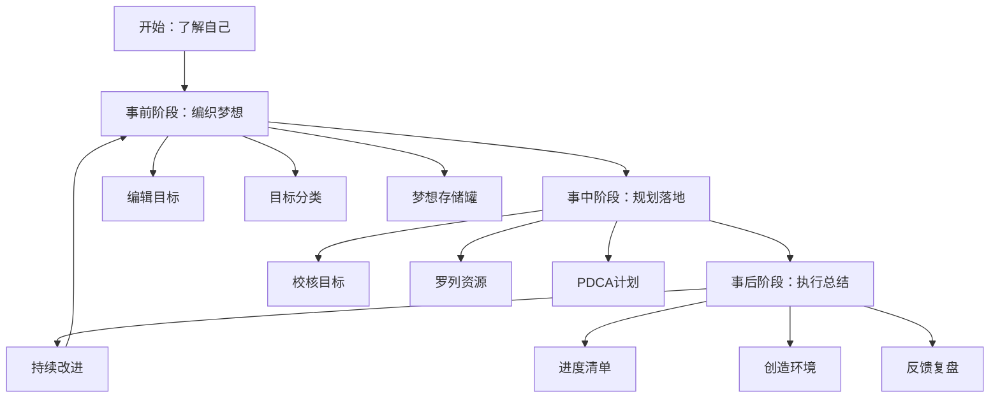
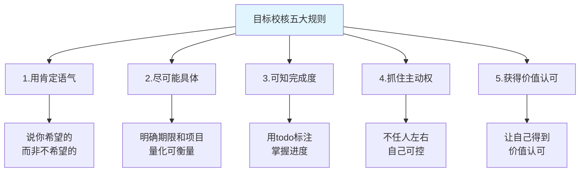
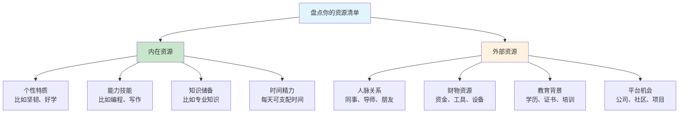
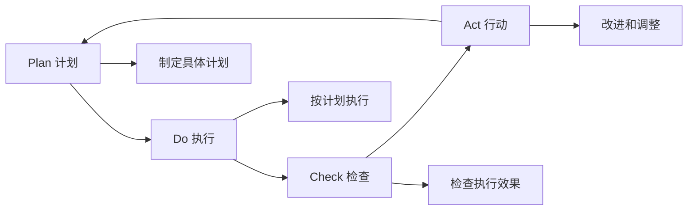
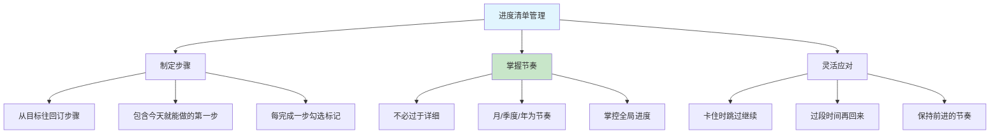
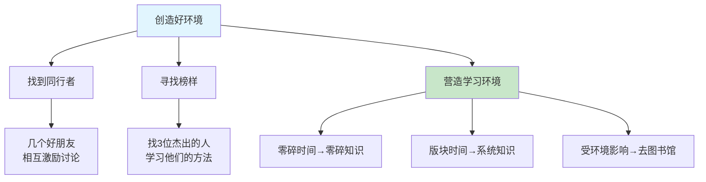
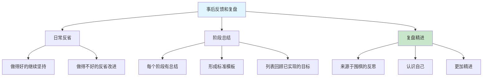
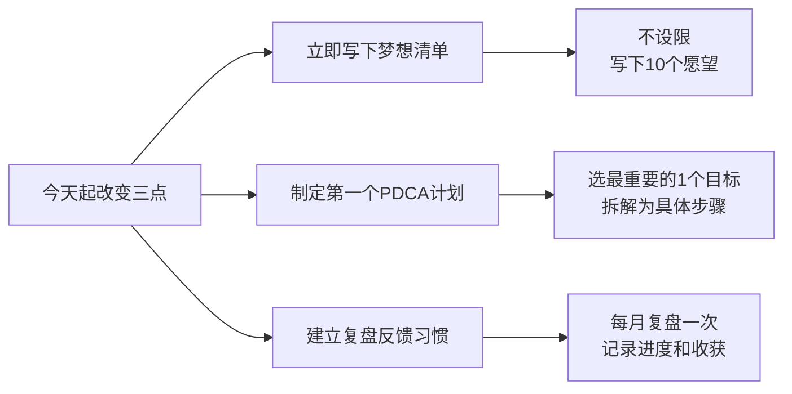

# 1.3一起来做个练习
#### 目录介绍
- [01.看一个真实案例](#01看一个真实案例)
- [02.这是重要的练习](#02这是重要的练习)
- [03.事前要编辑目标](#03事前要编辑目标)
- [04.事前对目标分类](#04事前对目标分类)
- [05.事前梦想存储罐](#05事前梦想存储罐)
- [06.事中要校核目标](#06事中要校核目标)
- [07.事中罗列些资源](#07事中罗列些资源)
- [08.事中用PDCA计划](#08事中用pdca计划)
- [09.事后弄进度清单](#09事后弄进度清单)
- [10.事后创造好环境](#10事后创造好环境)
- [11.事后反馈和复盘](#11事后反馈和复盘)
- [12.总结回顾本章节](#12总结回顾本章节)
- [13.后来发生的改变](#13后来发生的改变)
- [14.今天起改变三点](#14今天起改变三点)
- [15.课后作业思考下](#15课后作业思考下)

## 01.看一个真实案例

### 1.1 哭着写愿望清单

30 岁生日那天我没有出去庆祝。家人和同事都以为我在加班，其实我一个人坐在阳台上，手里拿着一张 A4 纸和一支红笔。那天下午公司例行谈话，领导说"你今年的晋升名额让出来了，明年再看"，我表面上笑着说"没关系"，回到工位写完了当天的周报。

凌晨 1 点我突然就哭了。我发现我从大学毕业到现在这 8 年，**没有认真写过一次自己的愿望清单**。我做过的所有"目标"几乎都是别人给我的：爸妈希望我进大厂，老板希望我完成 KPI。我为这些目标拼命了 8 年，那一刻却问不出"然后呢"。

那张 A4 纸上我写下了 4 个字："我想要的。" 然后就写不下去了。我才 30 岁，居然不敢认真写自己想要的，怕写出来被自己笑，怕写出来做不到更难受。

### 1.2 整晚让我下定决心

那一晚我一直坐到天亮。天亮之前，我给自己定了一条规矩："不管写得多蠢、多浮夸、多不切实际，今晚必须把它写出来。" 一开始我写得战战兢兢："希望有一天能被别人真心尊重"、"希望能做一件留得下来的东西"、"希望可以带爸妈出国一次"……越写越顺，最后密密麻麻写了 23 条。

那张纸我到今天还留着。回头看，那是我人生一次**真正意义的梦想练习**，不是交作业、不是为了鸡汤、不是为了朋友圈——就是认真地把"自己想要什么"第一次掏出来放在桌上。

那一晚之后，我对"要不要做梦想练习"这件事没有任何犹豫。这一篇我想认真带你做一遍这个练习——因为我知道，如果没有那一张 A4 纸，我这 30 年都是在替别人活。

## 02.这是重要的练习

### 2.1 做个作业

首先了解自己，这是一个重要的练习，它能让你勇敢地去梦想，去了解自己。当我们不知我们要什么的时候，我们如何去要？所以，这个梦想规划的练习，是让我们去了解自己所要的，以及要如何去要。

让自己做个作业，建议找一个时间静静地坐下来，拿起你的纸与笔，一步一步来做。也许，你没有一次做完所有的步骤，没有关系，第二天再找一个时间，继续你未完的内心历程。

建议，在一周内完成这个练习。几周内，你的内心会越来越稳定而有方向感。因为你渐渐对自己的未来有了规划……

做了作业，还需要不断完善。然后经常拿起来看看，你会慢慢发现。你的眼光开始变得敏锐起来，你能在生活、工作、人际关系中快速地发现有助于自己目标实现的因素，并引为已用。

别人会开始注意到你的改变。几年内，你会发现自己的一些目标在一步一步变在现实。你在无形中，走到一个令自己与他人惊讶的高度。

### 2.2 总体规划方案

这个作业从设想到执行，总体规划方案可以分为：**事前编织梦想——>事中详细规划和落地——>事后持续落实和总结**。

## 03.事前要编辑目标

### 3.1 动手写下心愿

**开始编织美梦，包括你想拥有的，你想做的，你想成为的，你想体验的**。现在，请坐下来，拿一张纸和一支笔，动手写下你的心愿。

在写的时候，不必管那些目标该用什么方式去达成，就是尽量写。直到你觉得没有什么可以写的时候，你可以看看下面几个问题并回答它们，这些问题会引导你去了解自已内心深处的渴求，这会花上一些时间，但你现在的努力，将是为下一步丰盛的收获作下基础。

### 3.2 七个引导思考的问题

1. 在你生活中，你认为哪五件事情最有价值？
2. 在你的生活中，有哪三个最重要的目标？可以先罗列 10 个目标然后再依次去除！
3. 假如你只有六个月的生命，你会如何地运用这六个月？
4. 假如你立刻赚取了第一桶金，在哪些事情上，你的做法会和今天不一样？
5. 有哪些事是你一直想做，但却不敢尝试去做的？
6. 在生活中，有哪些活动，你觉得最重要的？
7. 假如你确定自己不会失败（拥有充实的时间、资源、能力等），你会敢于梦想哪一件事情？

**这 7 个问题里最狠的一题，是第 5 题——"不敢尝试去做的"**。当年我写到这题的时候，第一反应是"没有"，但是拧了半个小时之后，真正的东西才冒出来：我不敢公开写作、我不敢在会议上反驳领导、我不敢承认我不想做管理……每个"不敢"的背后，都藏着你真正在乎的东西。

## 04.事前对目标分类

### 4.1 目标&知识分类

回答完这些问题后，把你所列出的所有目标分成六个类，对学习知识分成四个类。

**目标分类的作用，主要是为了让自己平衡生活和工作，均衡发展。知识分类的作用，主要是为了自己，学习有个优先级**。

对目标分类：**1、健康；2、修养/知识；3、爱情/家庭；4、事业/财富；5、朋友；6、社会。**

对知识分类：**1、了解；2、理解；3、熟悉；4、掌握**。在学校时老师反复强调，如今工作多年慢慢有了点感悟。

### 4.2 分类后的思考

我当时做完分类突然发现——我那 23 条愿望里，"事业 / 财富" 类占了 15 条，"健康"只有 0 条，"朋友"只有 1 条。这个分布让我愣住了：原来我一直说"我是一个很顾家、很重友情的人"，但在我真实的愿望清单上，家庭和朋友几乎没有位置。

**分类不是为了统计，而是让你看清楚你嘴上说的自己和真实在追的自己之间有多大的距离。**

## 05.事前梦想存储罐

### 5.1 筛选最重要的目标

写完 10 个愿望后，认真地把最重要的 3 项圈出来，然后，每天都把自己的自己写的愿望单子从头到尾看一遍，它会不断提醒你想要什么，你自然会在生活中密切关注可以帮助你实现这些愿望的机遇。

**为什么只选 3 个？** 因为人的注意力和精力是有限的，心理学研究表明，同时追求超过 3 个目标时，每个目标的完成概率都会大幅下降。选 3 个不是限制你的梦想，而是让你在当前阶段集中力量打歼灭战。

### 5.2 让梦想可视化

随便拿一个罐子，将梦想纸条放到罐子，把它作为梦想储蓄罐，值得注意的是，为最重要的那些愿望各准备一个罐子。当你实现一个梦想的时候就标记一下。

梦想可视化的心理学原理是**"曝光效应"**——你越频繁地看到某个目标，大脑就越会把它当成重要的事情来处理，潜意识里就会自动搜索实现它的机会和资源。把梦想写下来、贴在看得见的地方，比单纯在脑子里想，效果要好得多。

### 5.3 设置时限的重要性

一定设置期限。审视自己所写的，预期希望达成的时限。你希望何时达成呢？有实现时限的才可能叫目标，没时限的只能叫梦想，没落实的只能叫空想。

选出在这一年里对你最重要的三个目标。从你所列出的目标里，选择你最愿意投入的、最令你雀跃欲试的、最能令你满足的三件事，并把他们写下来。

现在建议你明确地、扼要地、肯定地写下你实现它们的真正理由，告诉你自己能实现目标的把握和它们对你的重要性。

如果你做事知道如何找出充分的理由，那你就无所不能，因为追求目标的动机比目标本身更能激励我们。

## 06.事中要校核目标

### 6.1 区分目标与欲望

想通过技术开发一年赚 100 万，这是欲望不是目标。虽然说设置目标要远大，但是一定要具体，不要吹牛逼。

因为你我大都是普通人……**目标和欲望的核心区别在于：目标有路径，欲望只有方向**。"我想变有钱"是欲望，"我要在 2 年内通过 XX 技能把月薪从 1 万提升到 3 万"才是目标。

### 6.2 目标校核五大规则

核对你所列的三个目标，是否与形成结果的五大规则相符：

| 规则 | 要求 | 正面示例 | 反面示例 |
|------|------|----------|----------|
| **肯定语气** | 说你希望的 | "我要每天读30页书" | "我不要再浪费时间" |
| **具体明确** | 有期限和数量 | "3个月内学完数据结构" | "我要学好算法" |
| **可检验** | 知道完成了没 | "完成10个项目实践" | "我要多练习" |
| **主动可控** | 你能掌控的 | "每天投入2小时学习" | "等公司给我机会" |
| **价值认可** | 有意义感 | "能提升我的核心竞争力" | "别人都在学我也学" |

### 6.3 用 SMART 原则检验

每一个目标都要经过 SMART 原则的检验：**Specific（具体的）、Measurable（可衡量的）、Achievable（可达到的）、Relevant（相关的）、Time-bound（有时限的）**。

通过了这五项检验的目标，才是一个真正值得你投入时间和精力去追求的好目标。

## 07.事中罗列些资源

### 7.1 为什么要盘点资源

列出你已经拥有的各种重要资源。当你进行一个计划，就得知道该使用哪些工具。

**很多人在制定目标时只看到"我缺什么"，却忽略了"我已经有什么"**。其实你手头已有的资源，往往比你想象的多得多。盘点清楚已有资源，不仅能增强信心，还能帮你找到实现目标的最短路径。

### 7.2 如何做资源清单

列出一张你所拥有资源的清单，里面包括自己的个性、朋友、财物、教育背景、时限、能力、技能、以及其他。这份清单越详尽越好。

建议按以下分类来盘点：

- **时间资源**：每天可以投入多少小时？周末有多少空闲时间？
- **能力资源**：你目前最拿手的 3-5 项技能是什么？
- **人脉资源**：在你的目标领域，你认识谁能帮到你？
- **信息资源**：你知道去哪里找到高质量的学习材料？
- **财务资源**：你愿意为目标投入多少学习费用？

### 7.3 资源的杠杆效应

最聪明的资源利用方式不是平均分配，而是**找到那个能产生杠杆效应的关键资源**。比如一个好的导师可能比看 100 本书更有效，一次实际项目可能比刷 100 道题更有收获。找到你的杠杆资源，集中投入。

## 08.事中用PDCA计划

### 8.1 PDCA 四步法

毕竟一开始目标或者远景，规划得再好，如果没有落地执行，那么也产出不了任何价值。

所谓 PDCA 执行法，就是把事情的执行过程分成四个环节：计划（Plan）、执行（Do）、检查（Check）和行动（Act），从而把控执行过程，保证具体事项高效高质地落地。

### 8.2 达成目标本身的条件

写下要达成目标本身所具有的条件。是坚持的毅力，还是好的方法，还是工具的优势，都写下来。

### 8.3 逆向推导的思维

写下你不能马上达成目标的原因。首先你得从剖析自己的个性开始，是什么原因妨碍你的前进？要达成目标，你得采取什么做法呢？如果你不确定，可以想想有哪位成功者值得你去学习？

你得从最终的成就倒算，记得大学学机械时，有门课程叫做逆向工程，当时不太懂，现在有点顿悟呢。就是先有结果然后逆向推导。往你目前的地位一步步列出所需的做法。

## 09.事后弄进度清单

### 9.1 倒推法制定步骤

现在请你针对自己那三个重要目标，制订出实现它们的每一步骤。别忘了，从你的目标往回订步骤，并且自问，我第一步该如何做，才会成功？是什么妨碍了我，我该如何改变自己呢？

一定要记得你的计划得包含今天你可以做的，千万不要好高骛远和吹牛逼。同时，如果某一天卡住了，可以选择跳过进入下一个目标。过段时间再去看卡点和解决。

### 9.2 选择合适的管理节奏

进度清单，不要太过于详细，我理解为就是掌控一个全局进度的清单，写好每一个阶段做的事情即可，每次完成一个节奏勾选一下。因为我试过，每周弄清单那种实在太累了，调整成月，季度，年这个节奏会好一点。

**推荐的进度管理节奏**：

| 时间维度 | 管理颗粒度 | 关注点 |
|----------|-----------|--------|
| **年度** | 3-5个大目标 | 方向和愿景 |
| **季度** | 每个目标的里程碑 | 阶段性成果 |
| **月度** | 本月核心任务 | 可交付产出 |
| **每日** | 当天最重要的1件事 | 立即行动 |

### 9.3 遇到卡点怎么办

在执行过程中遇到卡点是非常正常的。**关键不是永远不卡住，而是卡住了以后知道怎么处理**。遇到卡点时，先判断是能力问题还是资源问题——能力不够就去学习，资源不够就去借力。如果短期内解决不了，先跳过去做能推进的部分，保持前进的节奏比什么都重要。

## 10.事后创造好环境

### 10.1 找到你的同行者

有时候，总有些烦心的事情，或者遇到了某坎，不想坚持想躺平了。怎么办？那就找到几个好朋友，相互激烈地讨论，有几个就好。

**一个人走得快，一群人走得远**。找 2-3 个和你目标相似的伙伴，建立一个小群或定期见面的习惯。在你想放弃的时候，他们的坚持会带动你；在他们迷茫的时候，你的分享也会帮助他们。

### 10.2 寻找值得效仿的榜样

为自己找一些值得效法的模范。从你周围或从名人当中找出三位在你目标领域中有杰出成就的人。

在你做完这件事，请你阖上眼睛想一想，仿佛他们每一个人都会提供你一些能达成目标的建议，记下他们每一位建议的方法，如同他们与你私谈一样。

**榜样的力量不在于模仿他们的行为，而在于理解他们的思维方式**。为什么他们能在同样的环境下做出不同的选择？他们在关键时刻的判断依据是什么？理解了这些，你才能真正从榜样身上汲取养分。

### 10.3 营造适合学习的环境

为自己创造一个适当的环境。零碎的时间可以学习零碎的知识，版块的时间可以学习比较系统的知识，如果自己比较受环境影响，那就去图书馆。

我刚开始就是去首图图书馆，不管多烦，一去了就心静下来了。

**环境对学习的影响被大多数人严重低估了**。你在嘈杂的办公室和在安静的图书馆，学习效率可能相差 3-5 倍。不是你意志力不够，而是环境在消耗你的注意力。找到或创造一个让你"一进入就能专注"的环境，这是提升学习效率最简单有效的方法。

### 10.4 回顾过去的成功经验

当自己做完这一切，回顾过去，有那些你所列的资源会运用得很纯熟。回顾过去找出你认为最成功的两三次经验，好好想想。

仔细想想是做了什么特别的事，才造成事业、健康、财务、人际关系方面的成功，请记下这个特别的原因。**你过去的成功经验，是你最宝贵的方法论库**。把成功背后的关键因素提炼出来，它们就是你可以反复使用的"成功配方"。

## 11.事后反馈和复盘

### 11.1 建立反省机制

经常反省所做的结果，一定要经常反省，这个反省针对自己做的好的要继续坚持，如果不好的那就要反省自己那些做的不好。每个阶段对结果要有总结，这种总结最好形成模板。

**反省不是自我批评，而是客观地审视自己的行为和结果**。推荐一个简单的反省框架：

| 反省维度 | 问自己的问题 |
|----------|-------------|
| **成果** | 这个阶段我完成了什么？达到预期了吗？ |
| **过程** | 我的方法有效吗？有没有更好的做法？ |
| **心态** | 我在过程中的状态如何？有没有半途想放弃？ |
| **收获** | 我从中学到了什么？可以复用到其他事情上吗？ |

### 11.2 回顾已实现的成就

列一张表，写下过去曾是你目标而目前已实现的一些事。你要从其中看看自己学到了些什么，这期间有哪些值得感谢的人，你有哪些特别的成就。

有许多人常常只看到未来，却不知珍惜和善用已经拥用的。**定期回顾已实现的成就，不是为了自满，而是为了从成功中提炼可复用的经验**。每一次成功都不是偶然的，找到背后的关键因素，它们就是你最有价值的方法论。

### 11.3 复盘的方法论

有时候，事情没做好，进度没坚持下来。一定要懂得一点复盘的常识，复盘在于认识自己，来源于围棋事后的反思。这样可以更加精进。复盘可以形成自己模板。

推荐一个简单实用的复盘模板（**GRAI 复盘法**）：

1. **Goal（目标）**：当初的目标是什么？
2. **Result（结果）**：实际达成了什么结果？
3. **Analysis（分析）**：目标和结果之间的差距是什么？原因是什么？
4. **Insight（洞察）**：从中得到了什么经验教训？下次怎么做会更好？

## 12.总结回顾本章节

### 12.1 一句话核心

**一次认真的梦想练习 = 一张纸 + 一支笔 + 一整段敢于写下真实想要的时间，三者缺一不可。**

### 12.2 你应该带走的三件事

| 关键词 | 一句话理解 | 何时用到 |
|--------|-----------|----------|
| **敢写下来** | 梦想没被写在纸上之前，都只是空想 | 生日、年初、重大节点 |
| **选 3 不选 10** | 同时追 10 个你会一个都拿不下 | 定年度目标时 |
| **PDCA + GRAI** | Plan Do Check Act 做循环，GRAI 做复盘 | 每个季度做一次 |

## 13.后来发生的改变

### 13.1 第一周——把 23 条清单变成 3 个年度目标

那张凌晨 1 点写下的 23 条愿望清单，我第二天一大早用红笔做了第一次筛选。筛选的办法是：每一条问自己一个问题——"如果一年后回头看这条没做，我会不会遗憾？" 不遗憾的划掉。最后剩下 7 条。再做一次筛选："这 7 条里，哪 3 条我最愿意今年立刻开始？" 最后留下 3 个：**写专栏、系统健身、陪爸妈出国一次。**

### 13.2 第一个月——给 3 个目标各做一份 PDCA

3 个目标我分别做了一份一页纸的 PDCA。以"写专栏"为例：Plan 是每周一篇 2500 字；Do 是每周日晚上 8 点固定写；Check 是月底看阅读量和反馈；Act 是下月根据反馈调选题。写的时候我就惊觉——**以前我做的从来不是计划，是口号**。过去我写过无数次"今年要多读书"，从来没写过"每周日 20 点到 22 点固定阅读并输出"。粒度不够，执行就不会发生。

### 13.3 半年后——梦想储蓄罐上有了 2 个勾

半年后我回头看那张清单：写专栏那一栏打了勾，累计 22 篇；健身那一栏打了勾，体脂从 26% 降到 19%；陪爸妈出国这条因为爸的身体没有去成，改成了每月陪他们在家吃 4 次饭，这条也打了勾。

3 条里有 2 条完全达成，1 条调整后达成。**比这个结果更重要的是——我第一次真切地感受到，自己的生活是被自己推着走的，不是被老板、伴侣和父母推着走的**。那种感觉，值回那晚熬夜流下的眼泪。

## 14.今天起改变三点

### 14.1 立即写下你的梦想清单

今天就找一个安静的时间，拿起纸笔，不设任何限制地写下至少 10 个你想实现的愿望。不要在意它们是否现实，先让自己敢于梦想。然后从中圈出最重要的 3 个，贴在你每天都能看到的地方，让它们时刻提醒你前进的方向。

### 14.2 制定你的第一个 PDCA 行动计划

选择那 3 个目标中最紧迫的一个，用 PDCA 方法制定具体的执行计划。把大目标拆解成可以立即行动的小步骤，明确每一步的时间节点和验收标准。记住，计划中一定要包含今天就可以做的第一步，千万不要只停留在规划阶段。

### 14.3 建立定期复盘反馈的习惯

从这个月开始，每月底花 30 分钟做一次目标复盘。记录做得好的地方继续坚持，做得不好的反思原因并调整方案。不需要太复杂，一张简单的表格即可——列出目标、进展、问题和下一步行动。持续三个月，你会看到自己显著的变化。

## 15.课后作业思考下

### 15.1 自检类

1. **梦想探索练习**：请用 30 分钟时间，安静地回答文中提到的 7 个深度问题（比如"假如你只有 6 个月的生命，你会如何运用？"），然后对比你日常的时间分配，看看两者之间有多大的差距？这个差距告诉了你什么？
2. **目标分类与优先级**：把你写下的所有愿望，按照健康、修养/知识、爱情/家庭、事业/财富、朋友、社会六个类别进行分类。哪个类别的目标最多？哪个最少？这种分布是否反映了你当前生活的不平衡之处？

### 15.2 实践类

1. **PDCA 实操训练**：选择一个你本周就能开始的小目标，完整走一遍 PDCA 循环——制定计划、执行、检查结果、总结改进。一周后回顾这个过程，你在哪个环节做得最好？哪个环节最容易被忽略？
2. **复盘方法论实践**：回顾过去一年中你最成功的一次经历和最失败的一次经历，分别用"做了什么特别的事导致成功/失败"的视角来分析。把分析结果写下来，看看能否从中提炼出适用于未来的行动原则。
