# 1.5经营好自我公司
#### 目录介绍
- [01.看一个真实案例](#01看一个真实案例)
- [02.对待工作的态度](#02对待工作的态度)
- [03.不给自己设边界](#03不给自己设边界)
- [04.把自己当经营者](#04把自己当经营者)
- [05.要有自己的价值](#05要有自己的价值)
- [06.经营自己护城河](#06经营自己护城河)
- [07.做事一定要靠谱](#07做事一定要靠谱)
- [08.认准经营价值观](#08认准经营价值观)
- [09.评估经营的成果](#09评估经营的成果)
- [10.公司和你的关系](#10公司和你的关系)
- [11.离开后剩下什么](#11离开后剩下什么)
- [12.为自己未来打工](#12为自己未来打工)
- [13.总结回顾这篇文章](#13总结回顾这篇文章)
- [14.我后来发生的改变](#14我后来发生的改变)
- [15.今天起改变三点](#15今天起改变三点)
- [16.课后作业思考下](#16课后作业思考下)

## 01.看一个真实案例

### 1.1 多做一点就抱怨吃亏

刚工作第 3 年的时候，我是一个典型的"咸鱼打工人"。有一次老板让我把一个和我岗位本职没啥关系的客服工单梳理一遍，他说："一周之内给我一份报告就行。" 

我表面上答应，心里已经在炸了。回到工位我就开始给身边的同事抱怨："这不是我的活儿啊，他凭啥让我干？我又不是客服！凭啥多做这么多事情还拿一样的工资？"

那一周我做得心不甘情不愿，最后交了一份 6 页的 Word，里面基本是把工单复制粘贴了一下，没做任何归类、没看任何共性。交完我还觉得自己"顾全大局"，没有直接拒绝已经很给面子。

后来那个报告没有任何下文。但我一直记得一件事——**那周和我一起被分派同类任务的另一位同事小林，交了一份 30 页的分析报告，里面把客服工单分成了 7 类高频问题，提出了 3 个产品优化建议**。半年后小林被提为产品负责人，工资差不多是我的 1.6 倍。

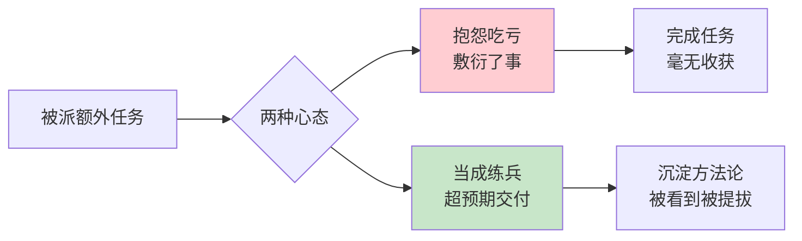

### 1.2 一直在为别人打工

过了很多年，我无意间翻到当年那份 6 页报告，突然就明白了一件事：**我当年抱怨的那句"凭啥我多做这么多"，本质上是在说——"我默认我是在给老板打工，不是给我自己打工"**。所以任何多出来的付出，我都本能地觉得"我亏了"。

而小林从一开始就没把自己当"打工的"，他把每一项任务都当成自己公司的一次产品交付。他不是"多做了"，他是在**不断给自己的简历、自己的能力、自己的口碑做投资**。那份 30 页的报告从来就不是"免费的付出"，那是他自己的经营成果。

从那之后我才真正开始以"经营者"的视角看自己的工作——这一篇，我想把这个视角一次讲清楚。

## 02.对待工作的态度

不知道你有没有注意到，关于如何对待工作，大约有两种对立的思想。

一种是所谓的"奋斗党"，对工作充满热情，会主动想办法甚至加班加点去完成工作、解决问题，认为人生因为拼搏奋斗而变得更加有意义。

一种是所谓的"咸鱼党"，秉持着给多少钱干多少事儿的态度，多出一分力都觉得自己亏了，觉得咸鱼的人生才是真正为自己活着。

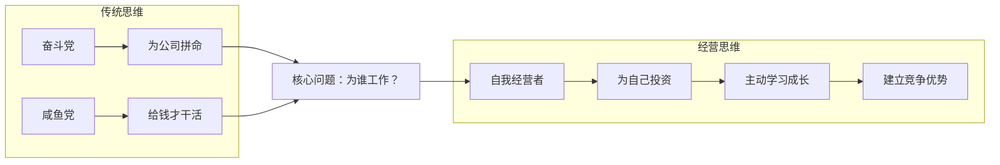

这两种想法，其实都是自己的人生选择，但它们背后的核心思想是"我在为谁而工作"。

主动性的学习和工作是为了提升自己，获得更强大的竞争力，而不只是为了一份工作或者一个老板。

## 03.不给自己设边界

### 3.1 做客服的边界

一位实习生开始接手客服工作，她几乎回复了用户发来的每一个问题，不明白的就和产品研发沟通，尽可能给用户满意的答复，在没有要求的节假日也会处理客服问题。

在这个期间她对公司的产品有了详尽的了解，不仅如此，她还和运营的同学一起组织了客服标准话术，分门别类整理反馈问题给研发和产品做参考，和运营团队一起构建客服规范等等，对业务的发展起到了非常重要的作用。

什么是牛人，就是交给他/她一件事，做成了，还做得挺好，而且还触类旁通。这个客服相比一般的人，多了一份对待工作的热情，还主动性地掌握更多，这就是经营好自我公司的一种体现。

工作时，不分哪些是我该做的、哪些不是我该做的。做事也从不设边界，即使负责客服，但遇到产品与销售上有问题，也会积极地参与讨论。

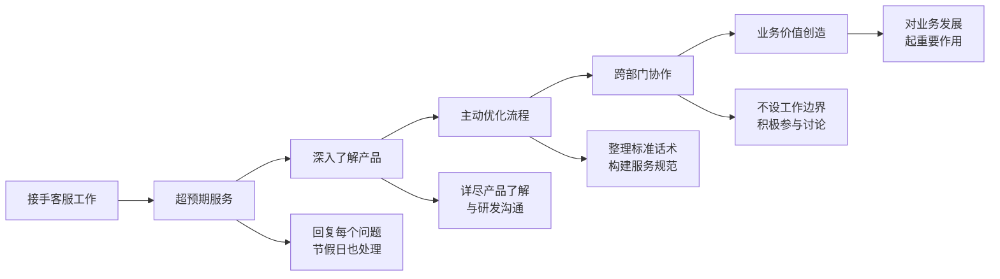

### 3.1 差距在经营视角

对于大多数人来说，进入社会，我们唯一拥有的资本就是自己。在你人生资本的原始累积阶段，如果你连这点额外的努力都不愿意付出，又怎么可能积累到足够的资源呢？

有些人会觉得，每多付出一点额外的努力，公司不就占便宜了吗？这个心态很有问题。优秀的人都是为自己打工，和公司一起成长，相互借力，才能找到自己的价值。

无论公司怎么发展，个人能力最终是沉淀到了自己的身上，这远比你浪费时间和摸鱼更好。潜意识里常常幻想自己还拥有大把的时间，拥有无限的可能。

这个案例我每次看都会想起我当年那份 6 页水报告——当年我看不见的"经营视角"，这位实习生从第一天就有了。差距不在智商，在视角。

## 04.把自己当经营者

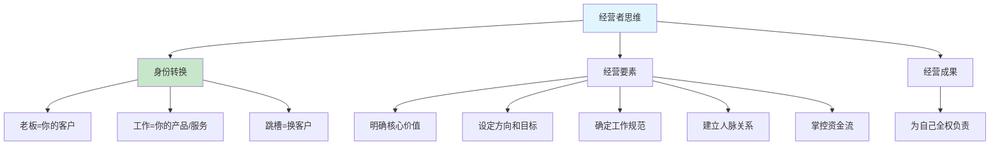

### 4.1 经营者视角的力量

换一个视角，把自己当成一家公司一样来经营，经营自己的工作和人生，可能就会有完全不同的体会。

在这个视角下，老板就是你的客户，你的工作就是你为客户提供的产品或服务，而跳槽就是换客户。**当你用经营者的视角看问题时，很多困惑就迎刃而解了**：加班不是为老板卖命，而是为了把你的"产品"做到极致；学习新技能不是公司逼你的，而是你在做"产品升级"。

### 4.2 经营者必须思考的五件事

想要把自己的人生公司经营成什么样呢？怎么做才能经营好自己的人生公司呢？

| 经营要素 | 商业公司 | 你的"个人公司" |
|----------|----------|---------------|
| **核心产品** | 公司的产品/服务 | 你能为别人创造什么价值 |
| **目标市场** | 目标客户群体 | 你想在什么行业/岗位发展 |
| **工作流程** | 标准化流程 | 你的做事方法和原则 |
| **合作伙伴** | 供应商和渠道商 | 你的人脉和合作关系 |
| **财务管理** | 收入支出管理 | 你的薪资和投资规划 |

可能需要学会明确自己的核心价值，为自己设定方向和目标，确定自己的工作流程、规范和原则，建立自己的人脉关系，掌控自己的资金流等等，全权为自己负责。

## 05.要有自己的价值

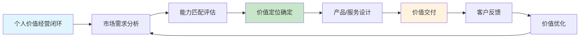

### 5.1 分析市场需求

明确自己的核心价值，也就是你能为别人提供什么样的产品和服务。要做好这件事，其中一个关键点就是，你得时不时分析一下，现在市场上需要什么样的能力。

**市场分析不是让你随波逐流，而是帮你做出更明智的选择**。了解市场需求后，你可以判断：你当前的技能是供过于求还是供不应求？哪些新兴方向正在崛起？你应该在哪个方向上加大投入？

### 5.2 学习的成本意识

学习是有成本的，要想真正学有所成、学有所用，需要你花费大量的时间和精力，压缩其他的时间。所以，先确定什么能力更受欢迎是非常必要的。

| 学习成本 | 具体表现 | 如何降低成本 |
|----------|----------|-------------|
| **时间成本** | 每天2-3小时 | 用二八定律聚焦关键技能 |
| **精力成本** | 脑力消耗大 | 选择最有效的学习方式 |
| **机会成本** | 学A就不能学B | 市场调研后再做选择 |
| **金钱成本** | 课程、书籍费用 | 先用免费资源验证方向 |

### 5.3 持续创造价值

再来说一下，别人为何选择你的产品和服务，那么你提供价值是否持续保持，让他们获益，源源不断产生价值。否则他们会放弃和你的合作……

**在职场中，你的价值 = 你能解决的问题的大小 × 你解决问题的效率**。想要提升自己的价值，要么去解决更大的问题，要么用更高的效率解决同样的问题。持续输出价值，是经营好"个人公司"的核心法则。

## 06.经营自己护城河

企业做买卖讲究供求关系一样，很多时候在职场上，决定你价值的，除了本身能提供的"产品和服务"外，还取决于行业内的供求关系。

如果你的技能在人才市场上供过于求，那么你的身价自然会变低；如果你的技能在人才市场上供不应求，那么你的身价自然会相对较高。

我们经营自己一般都要持续经营几十年之久，为了保证"基业长青"，还得围绕自己的主攻方向，努力打造自己的护城河。

### 6.1 护城河四种形态

护城河可以是卓越的技术、专业的知识、深厚的经验、独特的资源、有影响力的个人品牌、优质的人脉网络、优秀的沟通协调能力、对未来的敏锐洞察等等。

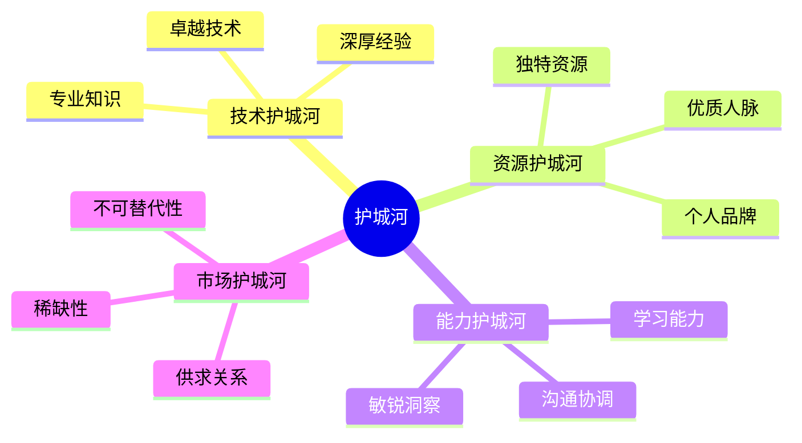

### 6.2 在哪家公司都要攒资本

老板很苛刻，待遇很糟糕，我不是说你不可以跳槽，尽量让自己的简历好看一点，所以，哪怕在一个烂公司里，尽量做一些有价值的项目，做一些有价值的工作，经受一些技术挑战，不要总觉得自己吃了亏。

说世间无伯乐，你没有努力和付出过，再好的伯乐也看不见你。不断加强自己的竞争性优势，让自己人生公司的越开越顺畅，选择也就会越来越多，比如当你对当前的客户不满意时，你就能随时终止这段合作关系，换一家客户。

### 6.3 如何加固护城河

**护城河不是一劳永逸的，它需要持续的维护和加固**。技术在更新、行业在变化，今天的护城河可能在几年后就不再是优势了。加固护城河的方法有三个：

- **纵向加深**：在你最擅长的领域继续深耕，从"会用"到"精通"，从"精通"到"能教别人"
- **横向扩展**：在核心能力周围建立辅助能力，比如技术专家加上项目管理能力
- **持续输出**：通过写文章、做分享、开源项目等方式建立个人品牌，让更多人知道你的专业价值

## 07.做事一定要靠谱

### 7.1 凡事有交代件件有着落

无论是在职场还是在生活中，让人觉得靠谱都是一件非常重要的事。比如，很多人出来创业，选择创业伙伴时，都会选他之前的同事，那怎么选呢？肯定是选择让他觉得靠谱的那一个。

所谓靠谱，就是尽量做到凡事有交代，件件有着落，事事有回音。办成了，有个交代，没办成，也要有个交代，中间有变动了，也会同步一下。

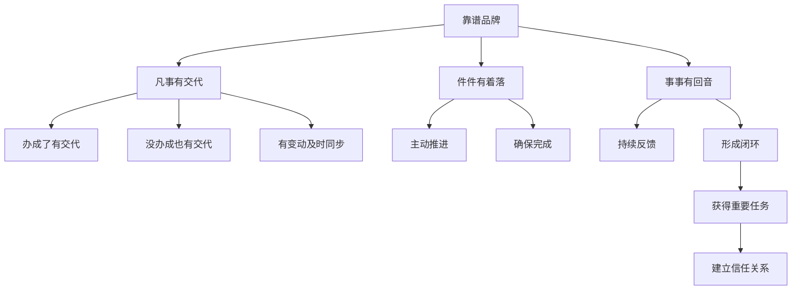

### 7.2 技术人最容易踩的坑

但是，不少技术人员只对技术有热情，对反馈就没什么概念。接到任务之后默默钻研，完成之后又默默等待下一个任务的降临，只要没人问，就一直牙关紧咬，目光坚毅，打死也不说。如果分配任务的人疏忽了，这个任务可能无疾而终了。

现在各种项目管理工具都有任务追踪功能，会时时强制你反馈，但一方面，工具管理的整体的方向和进度，并不会深入到许多细节中；另一方面，从一个独立的自我来说，具备这种反馈意识，迈出主动让事情闭环的第一步，你会发现，世界完全不同了。

你会因为持续的反馈获得更为重要的任务和职责，因为你是一个能够让事情形成闭环的家伙，一个靠谱的人。

## 08.认准经营价值观

### 8.1 用两轴划出人生 4 大类

人的精力有限、能力也有限，那该如何平衡各个领域，让生活过得更有目标感呢？生活中的哪些领域对你来说是必不可少的？

把理想人生用 2 个轴划分开，纵轴是「基础」与「发展」，横轴是「社会」与「自我」，两个轴一交叉，就可以得出构成人生的 4 个大类。

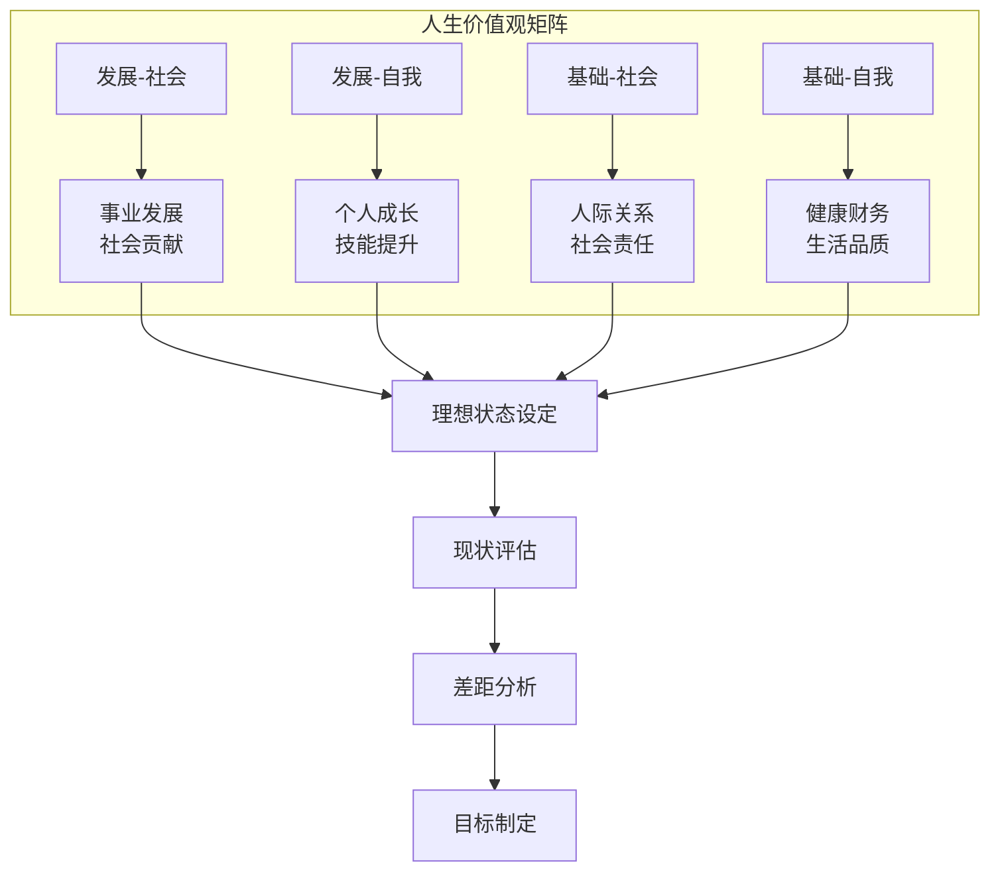

### 8.2 从差距中找到目标

梳理好你最重视的人生领域以后，接下来就要展开想象，想象自己在各个领域如果做到了什么事、达成了什么样的目标，就可以称得上是处在理想的生活状态。

知道自己各个领域的理想状态是什么样以后，就可以反思自己差在哪里了。接下来就要对自己现在的生活状态做个评估。

看见理想、看见现实，我们就能看到自己的「差距」，于是目标也就形成了。这一步我们需要做的就是思考差距，从中设定各个领域的大目标、核心指标与具体计划。

### 8.3 副业不能脱离主业

拍短视频、做家教、兼职翻译、开网约车……疫情下，越来越多的年轻人计划或正开展一门副业。开始兼职各种副业，甚至"身兼数职"。对于主业之外发展副业的目的和出发点，也不尽相同。

最好的副业是能够有效利用自己主业的知识和技能，而且在副业中积累的知识、技能与经验有助于促进主业进步。

要想发展副业，不能舍本逐末——主业是"本手"，副业不宜脱离主业，否则就可能失去支撑下出"俗手"。只有守牢主业发展副业，"妙手"才会不期而至。

## 09.评估经营的成果

### 9.1 用数据说话

当你的职业不断发展，你需要用结果来衡量你的经营成果。必须坦率地接受经营结果反映了自己每个月每年的经营状况这一事实。所有结果都反映在数据上。

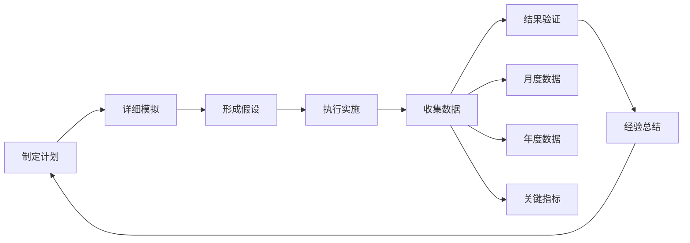

### 9.2 通过结果验证假设

合理有效地活用各项结果数据也很重要。有一种说法叫做"不是检查结果，而是通过结果来进行检验"。也就是说有根据地制订计划，通过详细的模拟计算，得出一个假设，最后用结果来进行验证。

**我自己设的个人 OKR**：每季度给自己设 3 个可量化指标——例如"写 12 篇千字以上技术博客"、"推动一次线上事故复盘至团队"、"新习得一项周围没人会的小众技能"。季度末看数据而不是看感觉。这种"用结果检验"的习惯，是我后来从咸鱼心态彻底扭转的关键。

## 10.公司和你的关系

谁都想去一个好的公司，能给未来的自己积累到最好的筹码。其实人生就是选择，机会往往稍纵即逝，关键在于自己不要后悔（当然后悔也是没用的）。

### 10.1 在哪都能学到东西

很多人，在不断的选择、跳槽中，彻底迷失了自己。其实去任何公司，哪怕这个公司再烂，只要你足够用心，都能学到很多有用的东西，无心者去哪都一样。

我们都在找一个终点，但永远不知道他究竟在哪儿。与其这样，不如好好的完善自己。

### 10.2 用人单位看的是你的成长轨迹

牛逼的公司的确能给你一个光环，但不代表你就牛逼。一定要在一家公司好好沉淀个三四年，切莫荒废了自己。用人单位最看重的是什么？

他们更看重你在以前公司积累的内在的东西，不是你平时做什么，而是你做出了什么成绩、你有什么资源、你在这个公司的成长轨迹、因为有你给这个公司带来了什么。

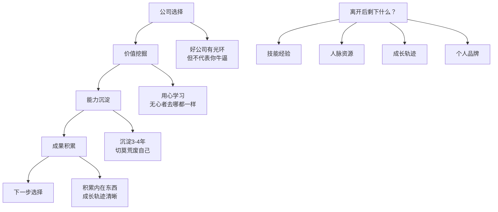

## 11.离开后剩下什么

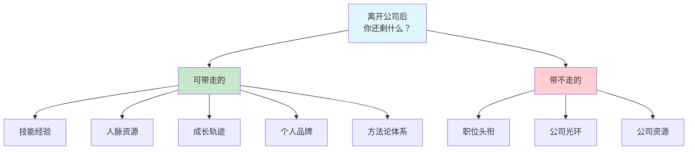

### 11.1 可带走的才是你的

离开了这个公司，你还剩下什么？很多人很可悲。现在这个社会太浮躁，太多人抱怨自己的公司如何如何，抱怨自己的领导如何如何。

抱怨是徒劳的，他们经常不会因为你的抱怨而改变，至少本质不会变。关于这个问题，给 6 个字：要么忍，要么滚。

**真正有价值的东西，是离开任何一家公司后你还能保留的**——你的技能、你的经验、你的人脉、你的口碑、你的方法论。而职位头衔、公司光环、内部资源——这些都是暂时借给你用的，走的时候一样也带不走。

### 11.2 在公司中积累可迁移价值

这个世界上没有完美的人，公司也如是。你要明白自己在这个公司，真正需要的是什么？如果值得挖，请深挖。如果爱，请深爱。

领导也一样，他们能成为你的领导，就一定有比你强的地方，他好的地方，你跟着好好学就是了。觉得不 OK，那就另谋出路。

**聪明人在每一家公司都在做两件事：一是为公司创造价值（你的工作职责），二是为自己积累资本（可迁移的能力和经验）**。两者并不矛盾，做好工作本身就是最好的学习和积累。

## 12.为自己未来打工

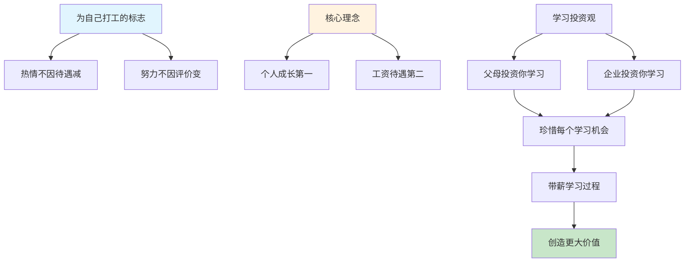

### 12.1 什么是为自己打工

什么是为自己打工？在成长发展的进程中，什么时候你的工作热情、努力程度不为工资待遇不高、不为上级评价不公而减少，从那时起你就开始为自己打工了。

**这是一种思维的质变——从"为别人工作"到"为自己投资"**。当你意识到，你每天 8 小时的工作不仅仅是在给公司创造价值，同时也在给自己积累经验、锻炼能力、拓展人脉时，你就不会再斤斤计较那些眼前的得失了。

### 12.2 个人成长优先

必须树立一个最基本也是最重要的理念：个人成长第一，工资待遇第二。一定要珍惜企业为你搭建的平台，把工作真正当成愉快的带薪学习的过程，抓住一切可能的机会，创造一切可能的条件，在职业实践中提高自己。

### 12.3 带薪学习的智慧

试想一下，一般情况下，人生在世，除了父母和少量的慈善家花钱供自己学习之外，还有其他人花钱供你学习吗？

如果有，那这第二个人就是你的企业和老板，老板给你开着工资，同时也极大"剥削"你，那就好好学习和锻炼自己。如果你有选择的能力，你完全可以创造更大价值！

**换个角度想：公司给你发工资，还给你实战的机会、真实的项目、专业的同事、成熟的流程——这些如果你自己花钱去培训班学，要花多少钱？** 带着这个心态工作，你会发现每一天都是赚的。

## 13.总结回顾这篇文章

### 13.1 一句话核心

**把自己当成一家要经营一辈子的公司——你所有的工作，本质上都是在为这家"自己的公司"投资与积累，而不是在给别人打工。**

### 13.2 你应该带走的三件事

| 关键词 | 一句话理解 | 何时用到 |
|--------|-----------|----------|
| **经营者视角** | 老板是客户、工作是产品、跳槽是换客户 | 被派额外任务觉得"亏"的时候 |
| **护城河** | 纵向加深 + 横向扩展 + 持续输出 | 每半年盘点竞争力时 |
| **凡事闭环** | 交代、着落、回音，三件都要做到 | 每一条和别人的协作上 |

## 14.我后来发生的改变

### 14.1 第一周——重写一遍那份"水报告"

回忆起当年那份 6 页的客服报告让我脸热了好几天。那一周我做了一件事——翻出公司最近一个月的全部客服工单，自己动手重做了一份 22 页的深度报告，分类 8 项高频问题、给 5 条产品优化建议，周五晚上主动发给了产品总监。总监第二天早上回了我一个"很棒，你来一下我办公室"。那一刻我突然理解了：**不是做多少，是做的时候心在不在那里**。

### 14.2 第一个月——建立"个人公司"的 OKR

第一个月我做了两件事：一是把自己的"个人公司"写在一页纸上——核心产品（能独立交付复杂后端系统）、目标客户（中大型互联网公司）、护城河（分布式缓存和高并发设计）、3 年规划（成为所在城市该方向可查询的 Top 50）。二是给自己立了季度 OKR：3 个可量化目标、每月自评一次、每季度做一次复盘。

**变化最明显的是心态**：我再也不会因为"这不是我的活儿"而抱怨，因为每一项任务都是我"个人公司"的产品机会，我为什么要拒绝白送上门的练兵？

### 14.3 半年后——被点名做分享 + 接到猎头

半年后我被总监在全部门会上点名表扬了两次：一次是客服复盘推动了产品优化、另一次是主动承担了一次跨组的灰度故障处理。年底我接到了 3 个猎头的主动接触，其中一家开出的价格是我当时的 1.8 倍。

更重要的是——**我再也没有因为"觉得吃亏"而产生情绪**。因为我知道，我每一次多做的付出，都是在给我自己这家"个人公司"充值。就算这家客户（老板）不续单，我的产品（能力）还在，我随时可以换一个出价更高的客户。

## 15.今天起改变三点

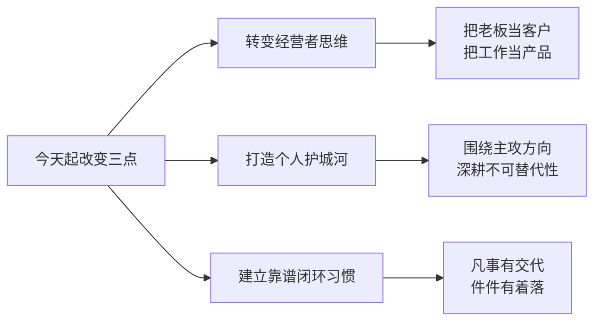

### 15.1 转变为经营者思维

从今天起，不再用"打工人"的视角看待工作，而是把自己当成一家公司的 CEO 来经营。老板是你的客户，你的工作成果是你的产品。每次接到任务时问自己："如果这是我自己的公司，我会怎么做这件事？"这个思维转变会让你从被动执行变为主动经营，格局完全不同。

### 15.2 开始打造你的护城河

梳理你当前的核心竞争力，选择一个最有潜力的方向深耕下去。每周至少投入 5 小时用于护城河的建设——可以是技术深度的提升、行业知识的积累、人脉关系的维护，或者个人品牌的打造。记住，护城河不是一天建成的，但每天的积累都在加宽它。

### 15.3 养成靠谱闭环的工作习惯

从今天起，对每一件经手的事情做到"凡事有交代、件件有着落、事事有回音"。接到任务后主动同步进度，遇到问题及时反馈，完成后主动汇报结果。一个月后你会发现，因为靠谱，你会获得更多重要的机会和信任。

## 16.课后作业思考下

### 16.1 自检类

1. **经营者视角练习**：把自己当成一家公司，写一份你的"公司简介"——核心产品是什么（你能提供的价值）、目标客户是谁（你想服务的雇主/行业）、竞争优势在哪（你比别人强的地方）、发展规划是什么（未来 3 年的方向）。这个练习能帮你清晰地认识自己的定位。
2. **靠谱度自测**：回顾过去一个月你经手的所有任务，有多少是你主动汇报进度和结果的？有多少是被催促后才反馈的？有多少是不了了之的？计算你的"主动闭环率"，如果低于 80%，思考如何建立一套自己的任务追踪反馈机制。

### 16.2 实践类

1. **护城河深度分析**：列出你目前的 3 个核心竞争力，然后评估它们在市场上的稀缺性——是供过于求还是供不应求？如果你的技能容易被替代，你打算如何提升它的不可替代性？给自己制定一个具体的 6 个月护城河加固计划。
2. **离职价值盘点**：假设你明天就要离开当前公司，认真想想你能带走什么——是技能经验、人脉资源、成长轨迹还是个人品牌？如果你发现"带走的东西"很少，说明你在这家公司的沉淀不够，需要思考如何在日常工作中有意识地积累可迁移的价值。
