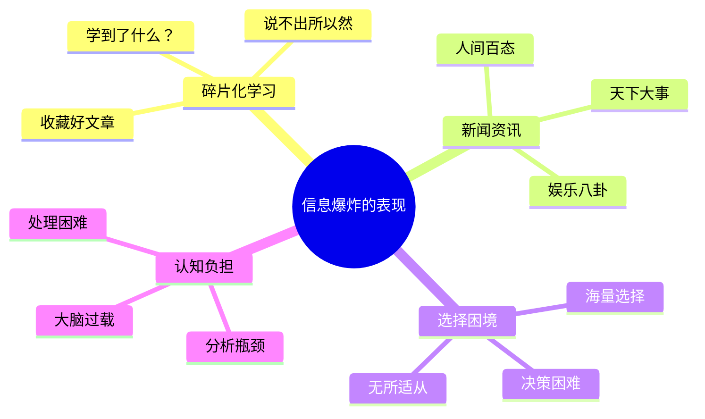
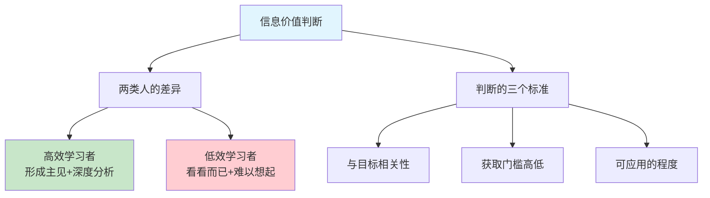
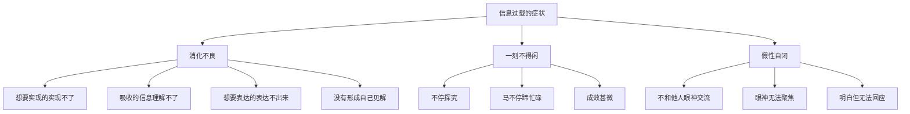
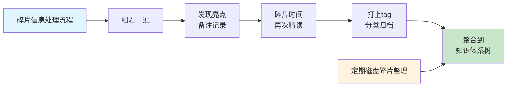
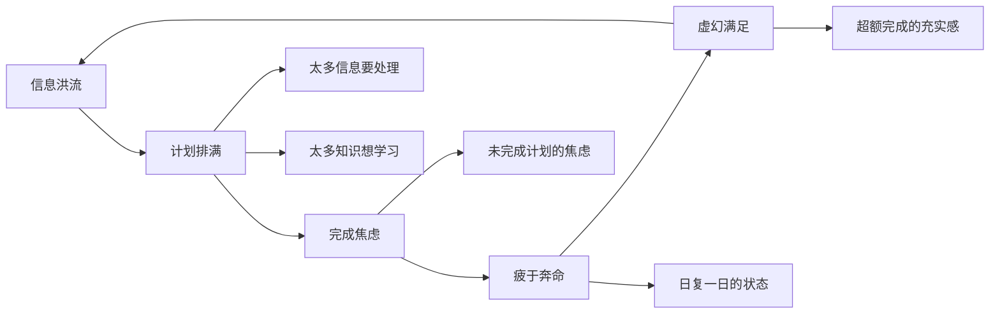
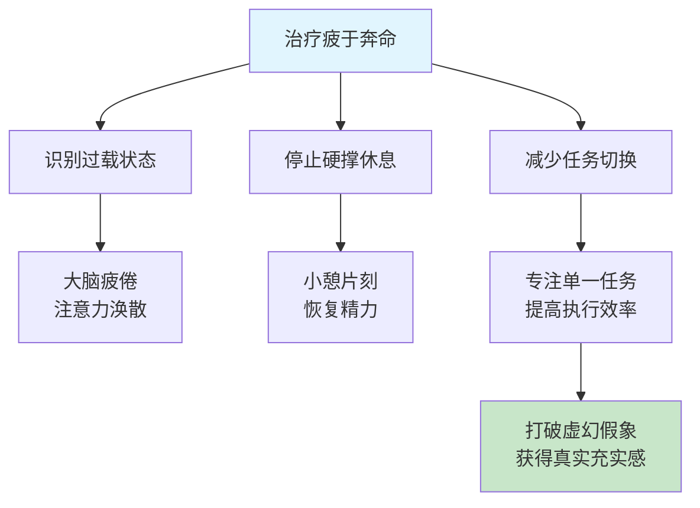
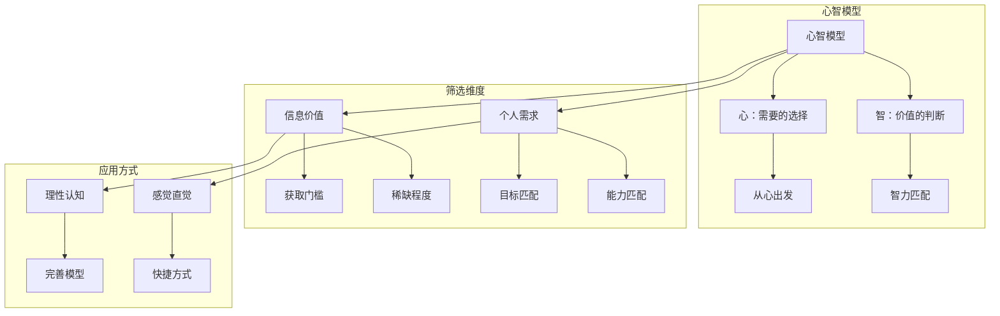
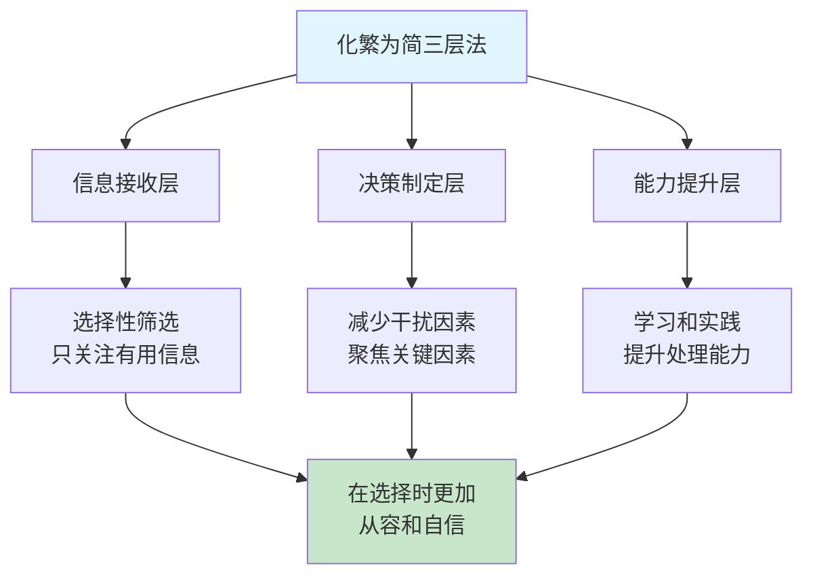
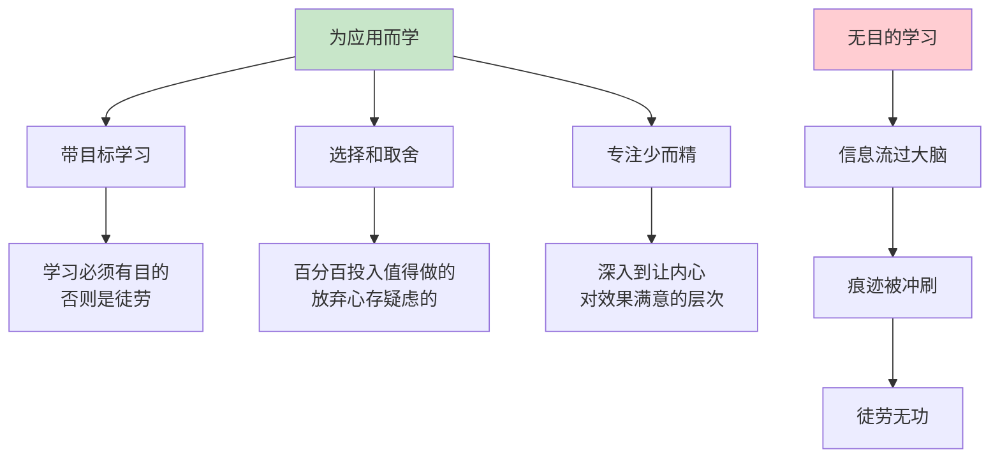
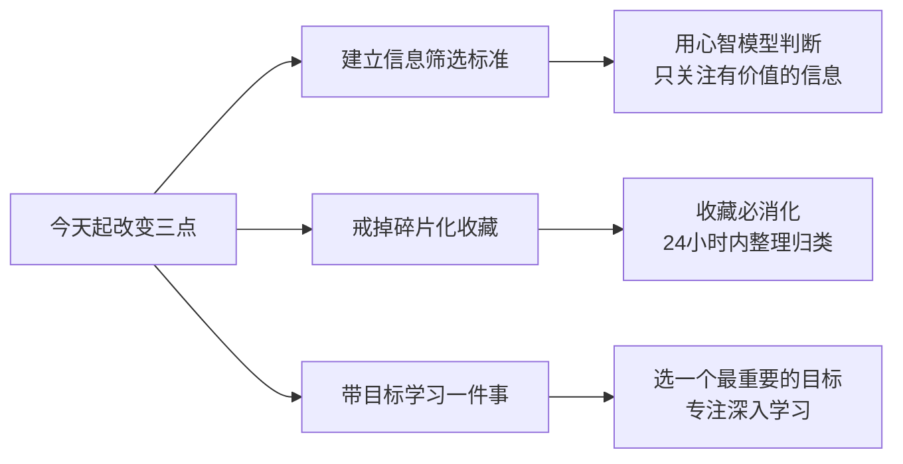

# 2.1信息过载怎么办
#### 目录介绍
- [01.信息的爆炸场景](#01信息的爆炸场景)
- [02.判断信息价值观](#02判断信息价值观)
- [03.信息过载的现状](#03信息过载的现状)
- [04.过载信息学标记](#04过载信息学标记)
- [05.疲于奔命的模式](#05疲于奔命的模式)
- [06.如何治疲于奔命](#06如何治疲于奔命)
- [07.心智模型去筛选](#07心智模型去筛选)
- [08.化繁为简的原则](#08化繁为简的原则)
- [09.为应用去做和学](#09为应用去做和学)
- [10.今天起改变三点](#10今天起改变三点)
- [11.课后作业思考下](#11课后作业思考下)

## 01.信息的爆炸场景

每天都有大量的信息，知识，新闻等，让碎片化时间感觉自己都是在学习。那么你究竟学习了什么东西？可能一时间难以回答这个问题，不要紧，可以坐下来静静思考一下……

收藏好文章【收藏的可能下次就不会看了】，觉得这个文章很好，可是说不出所以然，究竟学到了什么？

看到头条一些新闻，发现即使在一个地方上班，也能尽知天下大事，娱乐八卦，还有人间百态各种事情，让自己知识广度大有增长。

在信息爆炸的时代，互联网如同一道敞开的闸门，让海量的信息汹涌而来。然而，这种信息的丰富性却并非总是带来便利，相反，它常常使人陷入纠结和困惑之中。

面对如此多的选择，我们的大脑往往难以承受，导致我们在决策时变得犹豫不决，无法做出决定。

## 02.判断信息价值观

### 2.1 你真的懂了吗

发现自己有好多东西要学，但是哪些对我们有价值呢？哪些投资回报率不高呢？我们选择的标准是什么？好像懂得了很多东西，但是别人一问，我们却讲不出来……

或者说出来没有自己的主见或深度；有些人阅读后能够形成自己的主见，并且结合自己的经历有深刻的分析；

而有些人则只是看看而已，至于看完后，就难以想起刚才阅读究竟是讲了什么东西；甚至还有些，则是陷入了口水战。

### 2.2 信息价值的判断标准

**判断信息是否有价值，可以用三个简单的问题来过滤**：

| 判断维度 | 核心问题 | 高价值标志 | 低价值标志 |
|----------|----------|------------|------------|
| **相关性** | 这个信息和我的目标有关吗？ | 直接助力目标 | 纯粹消遣娱乐 |
| **稀缺性** | 这个信息随处可得吗？ | 需要付出努力才能获取 | 到处都能看到 |
| **可用性** | 我能在一周内用上它吗？ | 能立即指导行动 | 看完就忘 |

**检验标准**：如果你看完一篇文章，不能用自己的话复述其核心观点，不能说出它对你的具体启发——那这篇文章对你来说就是低价值信息，不值得再投入时间。

## 03.信息过载的现状

信息时代，作为离信息距离最近的职业之一，程序员应该最能感受这个时代的信息洪流与知识迭代的速度有多快。

信息数据量的高速增长，也带来了处理信息技术的快速发展，所以新技术层出不穷，而且现有的技术也开始在其深度和广度领域不断地开疆拓土。

这样的发展状况说明了一个现实：没办法掌握这一切。别说"一切"，其实更符合实际的情况是，仅仅掌握了已有信息和知识领域中非常微小的一部分。

无论是在购物、找工作，还是在选择生活方式时，我们都面临着前所未有的选择困境。信息的多样性虽然带来了更多的可能性，但也让我们在选择时变得无所适从。

在信息大爆炸的时代，我们对信息越发敏锐，信息就越会主动吸引我们，让我们产生一种过载的感觉。

那么大脑信息过载有什么表现呢？核心是信息消化不良！想要实现的事情实现不了，吸收的信息理解不了，想要表达的想法表达不出来。比如说跟人探讨问题，没有形成自己的见解！

一刻不得闲，大家可不要理解成精力过剩，这种情况其实就是信息过载导致的不停探究。一直马不停蹄地忙碌，但有时候成效甚微！

大脑无法同时处理如此多的信息，更无法对每一条信息进行深入的分析和比较。因此，在面临选择时，我们往往会感到迷茫和不安，不知道该如何做出决策。

假性自闭：不和他人眼神交流，眼神无法聚焦，但明白他人在说什么………等不良状态，不要因为这些行为生气焦虑。

## 04.过载信息学标记

### 4.1 碎片信息的处理策略

平时在各种渠道接收一些碎片文章或信息，这些碎片内容大部分是一些比较片面的，一般都是先粗看一遍，如果发现有什么亮点，去备注或记录一下。

然后，某个碎片时间，把这些平时粗筛文章拿出来看，这次再看有哪些可以被我吸收的知识，然后给它打上tag，最后遇到一些问题的时候，就可以从这些tag中，寻找答案。

### 4.2 碎片信息的隐患

过载化碎片文章其实是有很大隐患，因为长期只从片面的角度看这些文章的东西，会让你的思维变得混乱、焦虑，所以你需要一段时间就进行一次磁盘碎片整理，将这些大量信息，添加到你自己的知识体系树上。

**碎片信息处理的四个阶段**：

| 阶段 | 动作 | 目的 | 时间投入 |
|------|------|------|----------|
| **粗筛** | 快速浏览，标记亮点 | 初步过滤 | 每篇1-2分钟 |
| **精筛** | 碎片时间再次阅读 | 提取价值 | 每篇5-10分钟 |
| **标记** | 打tag分类归档 | 方便检索 | 每篇1分钟 |
| **整合** | 纳入知识体系树 | 产生价值 | 每周1小时 |

### 4.3 碎片变体系的关键

只有让这些碎片零散信息成为你知识体系的一个根节点，这些碎片文章才是有意义的，否则，这些碎片时间就完全被浪费掉了。这就是为什么，看了各个大佬的干货，却依然成不了大佬？

**答案就在于：大多数人只做了前两步（粗筛和精筛），却从未做第四步（整合到体系中）**。信息不整合，就像散落一地的拼图碎片——每一块看起来都有意义，但拼不出完整的画面。

## 05.疲于奔命的模式

### 5.1 疲于奔命的触发机制

在面对信息与知识的洪流时，有时我们会不自觉地就进入到了 "疲于奔命"模式中。

因为每天感觉有太多的信息要处理，太多的知识想学习。计划表排得满满的，似乎每天没能完成当天的计划，就会产生焦虑感，造成了日复一日的 "疲于奔命" 状态。

**疲于奔命模式的触发有一个经典路径**：信息焦虑→制定超载计划→完成不了→自我否定→更加焦虑→制定更多计划。一旦进入这个循环，你越努力反而越焦虑，因为你把"忙碌"当成了"进步"的衡量标准，而忽略了真正的产出。

### 5.2 虚幻满足感的陷阱

总是焦虑着完成更多，划掉 TODO List 上更多的事项，希望每日带着超额完成计划的充实与满足感入睡，最后这一切不过是一种疲于奔命带来的虚幻满足感。

**区分"真实满足感"和"虚幻满足感"的标准很简单**：问自己"今天做的事情中，有多少是对我的核心目标有直接帮助的？"如果答案是"大部分都有"，那是真实的充实；如果答案是"我也说不清楚"，那多半是在用忙碌来麻痹焦虑。

**触发机制**：信息过多→计划过满→焦虑驱动

**恶性循环**：疲于奔命→虚幻满足→继续过载

**本质问题**：追求数量而非质量的学习

## 06.如何治疲于奔命

### 6.1 最好的办法是休息

所以，在感觉大脑处于"过载"的疲倦中时，别"疲于奔命"，别硬撑，最好的办法就是去小憩片刻。

进入了疲于奔命状态，其实我们就在不断给大脑喂任务，且不停地切换大脑任务，让它永远处于繁忙甚至超频状态。

### 6.2 任务切换的隐性成本

这样每个任务的执行效率都会下降且效果也不佳，所以导致执行任务的时间反而延长了，这就给我们营造了一种"忙碌、充实而疲倦"的虚幻假象。

**心理学研究表明，每次任务切换会导致15-25分钟的注意力恢复时间**。如果你一天切换20次任务，光是恢复注意力就浪费了5个多小时。这就是为什么很多人"忙了一天"却什么都没做成。

### 6.3 从忙碌到高效的转变

打破虚幻假象的关键，是**从追求"忙碌感"转向追求"产出感"**。具体做法：

- **每天只设定3个核心任务**，完成后才考虑其他事情
- **用番茄工作法**，25分钟专注+5分钟休息，保持节奏
- **关闭无关通知**，给大脑创造不被打断的环境
- **每天留出30分钟空白时间**，让大脑做深度思考

## 07.心智模型去筛选

### 7.1 信息筛选的两个维度

面对大量的信息和知识，我们该如何应对？这可以从两个角度来考虑：信息和知识本身的价值？我需要怎样的信息和知识？

第一点，信息和知识的价值是一个主观的判断，有一个客观点的因子是获取门槛。如果一个信息或知识随处可得，大家都能接触到，甚至变得很热门，那么其价值可能就不大。

**这里有一个反直觉的规律**：越容易获取的信息，价值往往越低。真正有价值的信息和知识，通常藏在专业书籍的深处、行业前辈的经验中、或者你自己的实践总结里——这些都需要付出努力才能获得。所以当你发现一个知识点"人人都在讲"的时候，反而要警惕它的实际价值。

### 7.2 心智模型的工作原理

第二点，就提出了一个关于如何筛选信息和知识的问题。心理学上有一个 "心智模型"。"心智模型"是用于解释个体对现实世界中某事所运作的内在认知历程，它在有限的领域知识和有限的信息处理能力上，产生合理的解释。

每个人都有这样的 "心智模型"，用来处理信息，解释行为，做出决策。不过只有少部分人会更理性地认知到这个模型的存在，而且不断通过吸收相关信息和知识来完善这个模型；更多的众人依赖的是所谓的 "感觉" 和 "直觉"。

但实际上 "感觉" 和 "直觉" 也是 "心智模型" 产生的一种快捷方式，只是他们没有理性地认知到这一点。

"心智" 这两个字合在一起是一个意思，分开为 "心" 和 "智" 两个字又可以分别解释为："心" 是你对需要的选择，从心出发；"智"是对价值的判断，智力的匹配。

**核心概念**：用于解释现实世界运作的内在认知历程

**双重维度**：心（需要选择）+ 智（价值判断）

**应用差异**：理性完善 vs 感觉直觉

## 08.化繁为简的原则

### 8.1 以少胜多的核心原则

在互联网思维中，有一个非常重要的原则，那就是"化繁为简，以少胜多"。这个原则告诉我们，在面对复杂的信息和选择时，我们应该尽可能地简化问题，找到最核心的需求和关键点。

### 8.2 三个层面的化简

**第一层：信息接收**。在接收信息时，我们应该有选择性地进行筛选和过滤，只关注那些对自己真正有用的信息。

**第二层：决策制定**。在决策时，我们应该尽量减少干扰因素，只考虑那些最关键的因素，从而做出最符合自己利益的决策。

**第三层：能力提升**。我们还可以通过学习和实践来提升自己的信息处理能力和决策水平，让自己在面对选择时更加从容和自信。

### 8.3 化繁为简的实操方法

**化繁为简不是让你忽视复杂性，而是在复杂中找到那个最关键的支点**。具体的操作方法：

| 场景 | 化简方法 | 操作要点 |
|------|----------|----------|
| **信息太多** | 设定3个筛选条件 | 不满足条件的一律忽略 |
| **选择太多** | 只保留前3个选项 | 超过3个就强制淘汰 |
| **任务太多** | 每天只做最重要的3件事 | 完成后才考虑其他 |
| **知识太杂** | 围绕1个核心目标学习 | 不相关的暂时不碰 |

**核心理念：少即是多。当你把80%的精力用在20%最重要的事情上时，你的产出会远超过把精力平均分配在所有事情上**。

## 09.为应用去做和学

### 9.1 学习的终极目的是应用

储备了信息，建立了知识，最终都是为了应用。囤积信息，学习知识，如果不能被应用在改变自己上，那还有什么意义？

没有目的的学习是徒劳的，它仅仅是在我们的头脑中流过一遍，流过的痕迹很快又会被新的信息冲刷干净。

不管我们拥有怎样的"最强大脑"，在面对这股信息与知识洪流时，都几乎可忽略不计。所以，**学习带着目标是比较好的**！

### 9.2 选择和取舍的智慧

在信息爆炸的时代，我们需要学会如何面对选择困境并找到解决问题的方法。

通过实践化繁为简的原则，我们可以提升自己的决策水平和生活质量，让自己在这个充满变化和挑战的时代中更加从容和自信地前行。

做和学就要有选择和取舍，你得挑选那些真正值得做和学的东西去让大脑满负荷运转，但凡投入决心去做的事情，就需要百分百投入。

### 9.3 深度学习的标准

这就是专注于少而精的东西，深入了解这些东西，进入到更深的层次上。深可以无止境，那到底多深才合适？

我的答案是：**让你的内心对取得的效果感受到满意的深度层次上**。它的反面是：**但凡心存疑虑，不是那么确定要全力投入的事情，干脆就不做了**。

这个标准看似模糊，实则非常精准——**因为你的内心最清楚，哪些东西你真的掌握了，哪些只是一知半解在自欺欺人**。当你对一个知识点的理解达到了"内心踏实"的程度，那就是属于你的合适深度。

## 10.今天起改变三点

**第一点：建立你的信息筛选标准**。从今天起，不再无差别地接收所有信息。给自己设定3个筛选条件：这个信息与我的目标相关吗？获取门槛高不高（是否人人可得）？我能在一周内应用它吗？只有至少满足2个条件的信息，才值得深入了解。把这3个条件写在便签上，贴在电脑旁。

**第二点：戒掉无效收藏的习惯**。从今天起，每收藏一篇文章，必须在24小时内阅读并做笔记，提炼出3个关键知识点，打上标签归入你的知识体系。如果做不到，就不要收藏。收藏≠学习，消化才是真正的获取。每周日花1小时整理本周收藏，做一次"碎片整理"。

**第三点：带目标学习一件具体的事**。选择你当前最需要提升的一个技能或知识领域，用2周时间专注深入学习它。不求广度，只求深度。学到让你"内心对效果感到满意"的层次。完成后再开启下一个目标。记住：专注少而精，远胜于贪多求全。

## 11.课后作业思考下

**1. 信息过载自测**：统计一下你今天接收了多少条信息（包括新闻、公众号、短视频、聊天消息等），其中有多少是对你真正有价值的？有多少是看完就忘的？计算你的"信息有效率"，如果低于20%，说明你的信息过载问题已经很严重了。

**2. 心智模型构建**：尝试用文中的"心智模型"方法，对你最近收藏但未阅读的10篇文章进行筛选。用"心"（我真的需要吗？）和"智"（它真的有价值吗？）两个维度打分，1-5分。删掉所有总分低于6分的文章，感受一下"断舍离"的清爽。

**3. 疲于奔命诊断**：回顾你上周的学习计划完成情况。是否经常觉得计划排得满满但完成不了？是否有"忙碌但充实"的虚幻满足感？如果是，试着把下周的学习计划砍掉一半，只保留最重要的部分，看看效果是否反而更好。

**4. 应用导向实验**：选择你最近学到的一个知识点，在本周内找到一个实际场景来应用它。可以是工作中的项目、与朋友的讨论、写一篇分析文章等。应用后反思：这个知识点是否真的被你消化了？还是只是"看过"而已？
