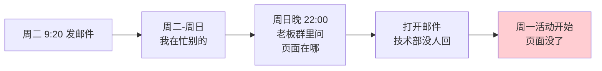
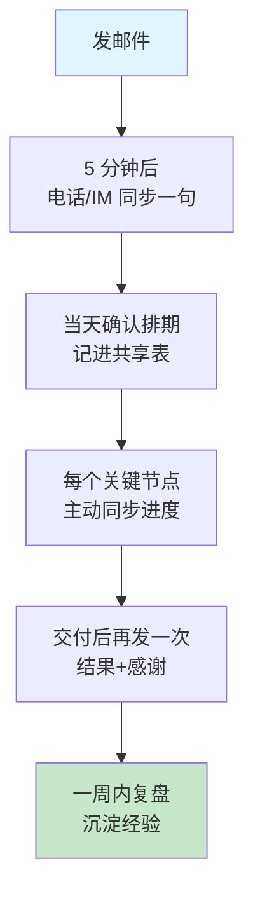
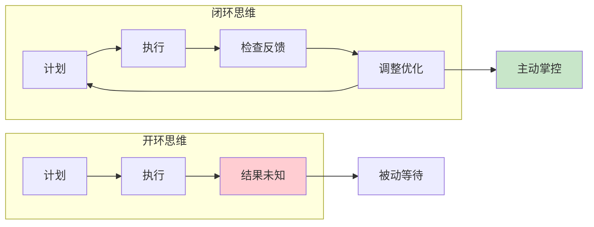
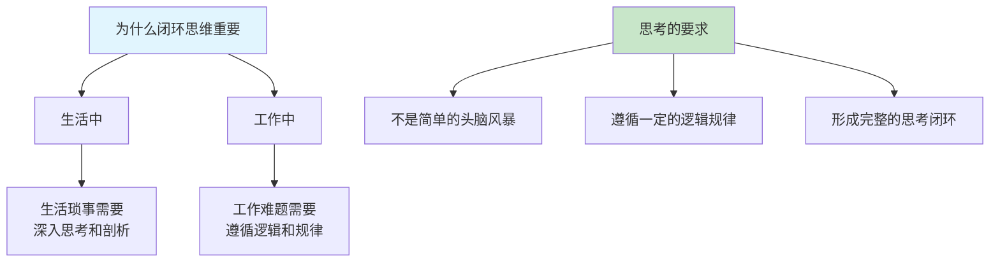
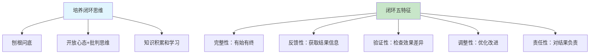
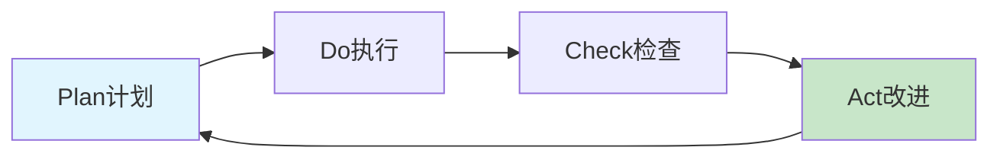
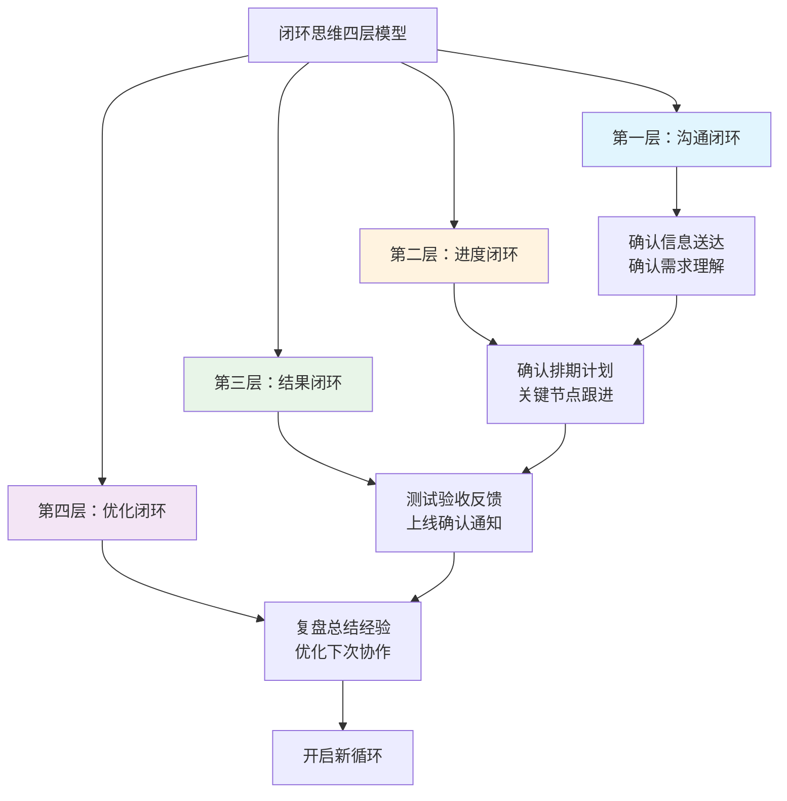
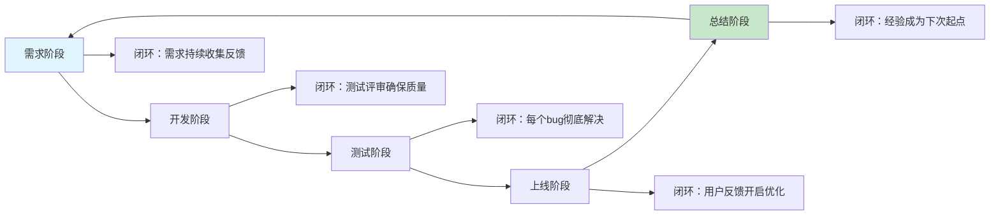
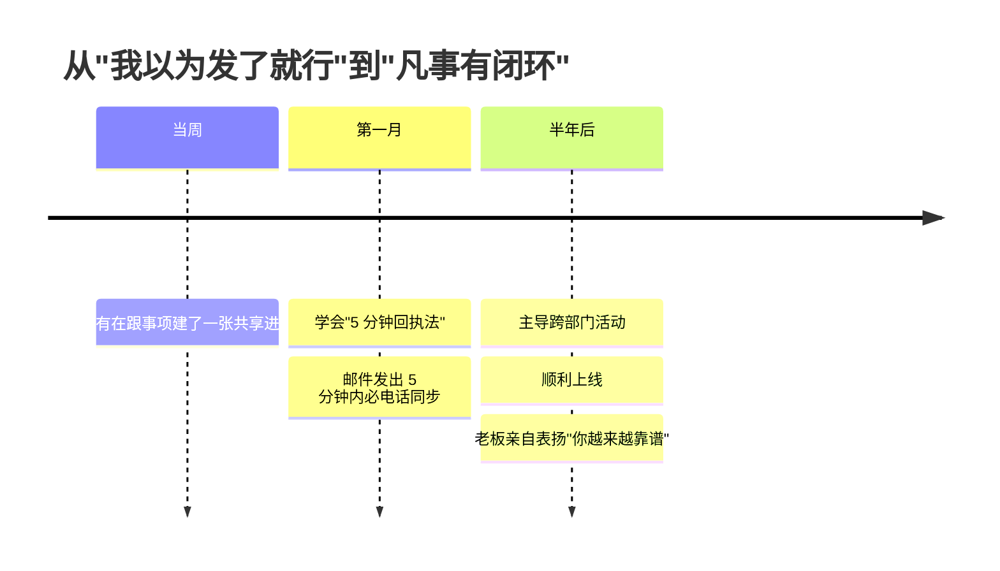
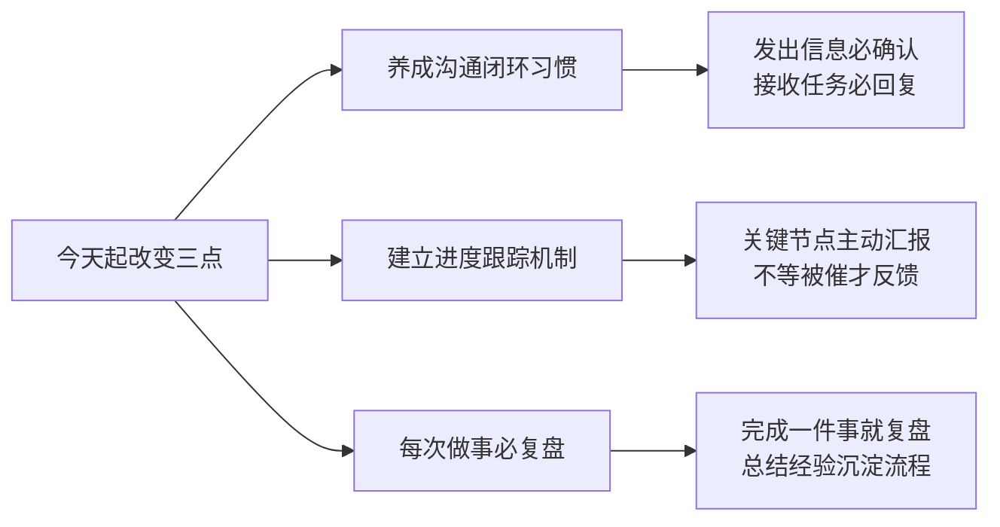

# 2.4闭环思维的逻辑
#### 目录介绍
- [01.看一个真实案例](#01看一个真实案例)
- [02.为何要闭环思维](#02为何要闭环思维)
- [03.闭环思维重要性](#03闭环思维重要性)
- [04.闭环思维的概念](#04闭环思维的概念)
- [05.如何去培养闭环](#05如何去培养闭环)
- [06.未闭环和已闭环](#06未闭环和已闭环)
- [07.我们来看个例子](#07我们来看个例子)
- [08.总结回顾这篇文章](#08总结回顾这篇文章)
- [09.我后来发生的改变](#09我后来发生的改变)
- [10.今天起改变三点](#10今天起改变三点)
- [11.课后作业思考下](#11课后作业思考下)

## 01.看一个真实案例

### 1.1 毁掉一场大的技术分享活动

去年公司要办一场技术分享线上市场活动。我刚晋升终端负责人，特别想表现"专业"——周一晚上熬夜写了一份 8 页的需求文档，**周二早上 9 点 20 分，把文档邮件发给技术总监，抄送双方领导**。

我心想：邮件发了、领导抄了、文档有了——**专业流程走完了**，然后就去做下一件事了。

周日晚上 10 点，老板在大群里 @我："明天活动，落地页在哪？"我打开邮件——**收件人技术总监没回，被抄送的领导也没说话，技术部根本没排上期**。我冲进技术部群求救，技术总监一句话回过来：**"你这个需求我们以为不急，没人催过我们。"**

那次活动用临时方案救了场。我蹲在工位上写反思报告，写出一行字记一辈子：

> "我以为发出去就等于交付了。其实在协作里，'我以为'就是事故的开始。"

### 1.2 同一件事，靠谱的人是怎么做的

事后我去观察那位技术总监带的小组长，他们对接需求的标准动作是：

每一步都是"动作 + 回执"，从来不让一件事悬在半空。**靠谱不是态度好，而是行动闭环**——这就是接下来要讲的"闭环思维"。

## 02.为何要闭环思维

### 2.1 用导航类比闭环

**开环导航（无闭环）**："去机场。"然后司机就凭记忆和感觉开。路上堵不堵？有没有事故？飞机是否准点？他不管。你只能忐忑不安地坐在车里听天由命。

**闭环导航（有闭环）**："去机场。"高德地图立刻规划路线。上路后，它实时反馈："前方拥堵 500 米"。它主动检查并提供新方案："为您推荐一条新路线，快 5 分钟"。你根据反馈做出处理："好的，切换路线"。最终，它确认结果："您已到达目的地"。

### 2.2 闭环思维的本质

闭环思维，就是你为自己的人生和工作安装的一套"高德地图"。它让你从不确定性中寻找确定性，从被动等待变为主动掌控。

| 闭环思维的价值 | 具体表现 |
|---------------|----------|
| **在不确定性中创造确定性** | 通过反馈机制，随时知道自己在哪里、该往哪走 |
| **在协作中建立坚不可摧的信任** | 凡事有交代、件件有着落、事事有回音 |
| **在经验中萃取能力** | 每次闭环都是一次复盘，实现复利式成长 |

## 03.闭环思维重要性

### 3.1 思考需要逻辑闭环

在复杂多变的世界中，每天都会面对各种各样的问题。生活中的琐事，工作中的难题，都需要进行深入的思考和剖析。

思考并非简单的头脑风暴，而是需要遵循一定的逻辑和规律。明白思考问题的底层逻辑，特别是逻辑思维和逻辑闭环的重要性。

### 3.2 没有闭环的危害

**没有闭环思维的人，做事有三个典型特征**：

| 特征 | 表现 | 后果 |
|------|------|------|
| **有始无终** | 事情做一半就放下了 | 永远在"启动"，从未"完成" |
| **没有反馈** | 做完了不检查结果 | 不知道做得好不好 |
| **不做改进** | 同样的错误反复犯 | 原地踏步，没有成长 |

**闭环思维的核心价值在于：它让你的每一次行动都有结果、有反馈、有改进——这三者缺一不可**。

## 04.闭环思维的概念

### 4.1 闭环的基本定义

思维闭环是指思维过程中的逻辑链条形成一个完整的闭环，起始于问题，经过一系列推理分析，最终回到问题本身，形成一个圆满的解答。

这种思维模式要求不仅仅停留在问题的表面，而是要深入挖掘问题的本质，寻找问题的根源，从而得出有效的解决方案。

### 4.2 逻辑思维是闭环的基础

逻辑思维是实现逻辑闭环的关键。逻辑思维是一种基于事实和规则的推理过程，它要求在分析问题时保持清晰、准确、有条理。

通过逻辑思维，可以将复杂的问题拆解成若干个简单的子问题，逐一进行剖析和解答。同时，逻辑思维还能帮助识别并剔除错误的信息和观点。

### 4.3 闭环思维在日常中的体现

**闭环思维不是高大上的管理理论，它在日常生活中无处不在**。比如：

| 场景 | 开环做法 | 闭环做法 |
|------|----------|----------|
| **约人吃饭** | "改天一起吃饭啊" | "周三中午 12 点，XX 餐厅，我来订位" |
| **答应帮忙** | "好的我看看" | "好的，我周五前给你回复" |
| **汇报工作** | 做完了就不管了 | 做完后主动告知结果和下一步计划 |
| **学习课程** | 看完就收藏了 | 看完就实践+写总结+分享给别人 |

**每一件小事的闭环，都在塑造你的行为模式**。当闭环变成习惯，你在大事上的表现也会自然而然地变得靠谱。

## 05.如何去培养闭环

### 5.1 三个培养方法

如何培养和提高逻辑思维和逻辑闭环的能力呢？

**方法一：学会"刨根问底"**。面对问题时，不要满足于表面的答案，而是要深入挖掘问题的根源和背后的原因。通过不断地提问和质疑，逐渐揭示问题的真相。

**方法二：保持开放的心态和批判性思维**。开放的心态意味着我们要愿意接受新的观点和想法；而批判性思维则要求对所接收的信息进行审慎的评估和筛选。

**方法三：注重知识的积累和学习**。只有掌握了足够的知识和信息，才能更好地理解问题、分析问题并解决问题。

### 5.2 闭环思维的五个特征

| 特征 | 定义 | 反面表现 |
|------|------|----------|
| **完整性** | 有始有终，不半途而废 | 做到一半就放弃 |
| **反馈性** | 及时获取执行结果信息 | 做完就不管了 |
| **验证性** | 检查执行效果与预期的差异 | 不知道做得好不好 |
| **调整性** | 根据反馈进行优化改进 | 同样的问题反复出现 |
| **责任性** | 对结果负责，不推诿不逃避 | 出了问题甩锅 |

### 5.3 PDCA闭环模型

闭环思维最经典的框架就是**PDCA循环**：

每一次 PDCA 循环，都不是简单的重复，而是螺旋上升的——**上一轮的"改进"变成了下一轮的"计划"**，这就是闭环思维带来的复利式成长。

## 06.未闭环和已闭环

### 6.1 开环做法的灾难

背景：公司要举办一场大型线上市场活动，你作为市场部的负责人，需要技术部帮你开发一个临时的活动落地页。

**未闭环的做法（开环思维）**：

计划 (Plan)：写了一份需求文档，但没有拉齐对齐。

执行 (Do)：把文档邮件发给技术部负责人，并抄送双方领导。

然后呢？没有然后了。你没确认对方是否收到、是否理解需求。你没主动跟进排期和进度。技术部因为忙于其他项目，你的需求被搁置了。

结果：活动临近，页面还没开发。你跑去向老板哭诉："技术部不配合！" 技术部反驳："你也没催啊，我们不知道这个这么急！" 项目失败，部门间产生矛盾。

### 6.2 闭环做法的四层模型

**第一层闭环：沟通闭环**。行动：发出需求邮件后，立即通过即时通讯工具或电话联系技术部负责人："XX 你好，我刚发了一个活动页面的需求，比较急，麻烦查收一下，看看有没有不理解的地方。"目的：确认信息已送达且被理解。

**第二层闭环：进度闭环**。行动：与技术部确认排期和开发计划（例如，"下周三给我初版，对吗？"）。在关键时间点（如周三早上）主动跟进："今天方便看一下初版进展吗？有什么困难吗？" 目的：监控过程，确保执行不偏离轨道。

**第三层闭环：结果闭环**。行动：拿到初版后，立即测试，将修改反馈给技术部。页面正式上线后，主动告知技术部："页面已上线，感谢支持！"，并将活动数据结果分享给他们。目的：交付完整成果，并给予反馈。

**第四层闭环：优化闭环**。行动：活动结束后，组织一个复盘会，与技术部一起总结："这次合作哪些地方可以优化？下次需求文档是否可以写得更规范以便你们开发更高效？" 目的：将本次循环的经验转化为下一个循环的优化点。

## 07.我们来看个例子

### 7.1 项目背景

项目背景：某公司要开发一款电商移动应用，项目经理小王负责该项目。

### 7.2 各阶段的闭环实践

**需求阶段闭环**。具体行动：1.与业务方多次沟通，明确需求细节；2.组织开发、测试、设计团队进行需求评审；3.将确认后的需求形成正式文档；4.建立需求变更流程。闭环体现在需求确认后不是终点，而是持续收集反馈。

**开发阶段闭环**。具体行动：1.制定详细的开发计划和时间节点；2.每日站会汇报进度；3.代码完成后进行测试和同行评审；4.发现问题立即修复。闭环体现在开发不是写完代码就结束，而是通过测试和评审确保代码质量。

**测试阶段闭环**。具体行动：1.测试人员提前介入；2.设计完整的测试用例覆盖所有功能；3.发现缺陷后详细记录并跟踪处理状态；4.开发修复后必须重新验证；5.进行回归测试。闭环体现在测试不是简单找 bug，而是确保每个问题都得到彻底解决。

**上线阶段闭环**。具体行动：1.制定详细的上线计划和回滚方案；2.上线后密切监控系统运行状态和性能指标；3.收集用户反馈和使用数据；4.根据反馈持续优化产品功能。闭环体现在上线不是项目终点，而是通过用户反馈开启新的优化循环。

**总结阶段闭环**。具体行动：1.项目结束后组织复盘会议；2.总结成功经验和失败教训；3.将经验沉淀为文档和规范；4.优化开发流程和工具；5.分享给其他团队。闭环体现在每个项目结束都成为下一个项目更好的起点。

### 7.3 案例的核心启示

这个案例完美展示了闭环思维的精髓：**每一个阶段的结束都不是终点，而是下一个阶段的输入**。需求阶段的输出是开发阶段的输入，开发阶段的输出是测试阶段的输入……如此环环相扣。

**项目做得好不好，不取决于某个阶段做得多出色，而取决于所有阶段之间的衔接是否紧密**。任何一个环节的断裂，都可能导致整个项目的失败。

## 08.总结回顾这篇文章

### 8.1 一句话核心

**靠谱不是天赋，是把每一件事都按"沟通 → 进度 → 结果 → 优化"四层闭环走完一遍**——闭环走得越多，复利越大。

### 8.2 你应该带走的三件事

1. **凡事有回应，是闭环的最低门槛**：收到立即确认，发出主动跟进。
2. **每个关键节点都要"主动报"**：不要等被催，被催一次代表你已经掉链子一次。
3. **每件事都做一次复盘**：哪怕只有 10 分钟，把经验沉淀成下次的"计划"。

## 09.我后来发生的改变

### 9.1 当周：建立"在跟事项"共享表

写完反思报告的那一周，我做了一件最简单也是最有效的事：**做了一张 Excel 共享表**，列上"事项 / 对接人 / 排期 / 当前进度 / 下一节点 / 风险"。我手上每一件超过 1 天的事，全部进表，每天下班前花 5 分钟更新一次。

效果立竿见影——再也不会出现"我以为对方在做"的事情，因为表里写得清清楚楚"上次同步是 X 月 X 日"。

### 9.2 第一月：5 分钟回执法

我学到了那位技术总监带的小组长的一个动作，我管它叫**"5 分钟回执法"**：邮件发出后 5 分钟内，必须在 IM 上补一句"邮件已发，方便看一眼吗？"。微信发出后 5 分钟内，如果对方没回，必须电话补一通。

听起来很啰嗦，但效果惊人——一个月里我对接的 14 件协作，**0 件出现"忘了"或"以为不急"的情况**，部门间的吵架从"互相甩锅"变成"互相提醒"。

### 9.3 半年后：那场没失败的活动

半年后我又主导了一场更大的活动——3000 人。我从启动当天就拉了一个群，每周一发"周进展+风险+下周计划"三段式简报。**活动如期上线，PV 是去年的 2.3 倍，老板在大群里 @我说："你现在做事让我很放心。"**

更让我得意的是，我把那张共享表+5 分钟回执法+周简报模板，做成了一份《项目协作 SOP》分享给团队。半年内整个团队的事故率下降了一大截。**这就是闭环思维真正给我的礼物——不是不出错，而是错了能止损，做完能复利**。

## 10.今天起改变三点

### 10.1 养成沟通闭环的习惯

从今天起，做到"凡事有回应"——收到任务消息立即确认，发出信息后主动跟进对方是否收到并理解。不要以为"我发了"就等于"对方知道了"。每次沟通后，用一句话确认："我理解的是 XXX，对吗？"这个简单的动作能避免 80% 的沟通误解。

### 10.2 建立你的进度跟踪机制

对你手上的每一个任务，设定关键检查节点，到了节点就主动汇报进度——不管进展顺利还是遇到了困难。可以用一个简单的表格记录：任务名称、当前进度、下一步计划、风险点。每天花 5 分钟更新，比被催 10 次更高效。

### 10.3 养成事后复盘的习惯

从今天起，每完成一件有意义的事情（不管大小），花 10 分钟做一次简单复盘：哪些做得好可以继续？哪些做得不好需要改进？有什么经验可以沉淀成流程？把复盘结果记录下来，半年后你会拥有一份价值连城的经验库。

## 11.课后作业思考下

### 11.1 自检类作业

**1. 闭环能力自测**：回顾你最近一个月经手的所有工作任务，按照四层闭环模型（沟通闭环、进度闭环、结果闭环、优化闭环）逐一检查。每一层你做到了多少？你最容易断裂的是哪一层？制定一个具体的改进计划。

**2. 开环 VS 闭环对比**：回想一个你曾经"开环"处理的事情（比如发了邮件就不管了、布置了任务就没跟进），它最终的结果是什么？如果用闭环思维重新处理，你会在哪些环节做得不同？把这个反思写下来，作为警醒。

### 11.2 实践类作业

**3. 复盘模板设计**：参考文中的项目闭环案例，为你最常做的一类工作设计一个标准复盘模板。模板应包含：目标回顾、过程评估、结果分析、经验总结、改进计划五个部分。下次完成类似工作时，用这个模板做一次完整复盘。

**4. 闭环协作实验**：选择一个需要与他人协作的任务，完整运用四层闭环思维来执行——从沟通确认、进度跟踪、结果反馈到事后复盘。记录整个过程中对方的反应和最终效果，对比以往的协作方式，看看闭环思维带来了哪些改变。
