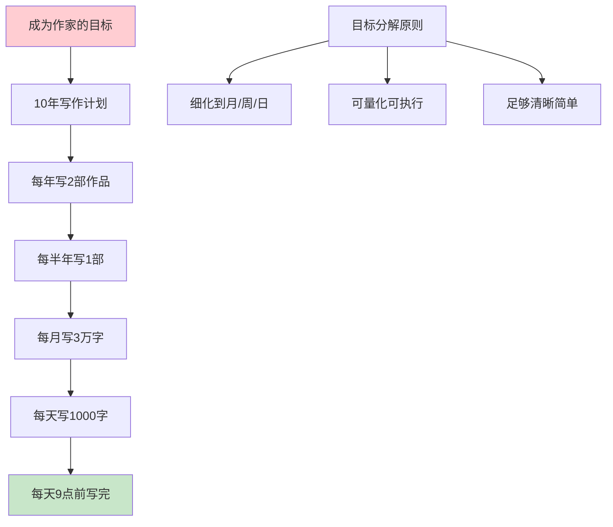
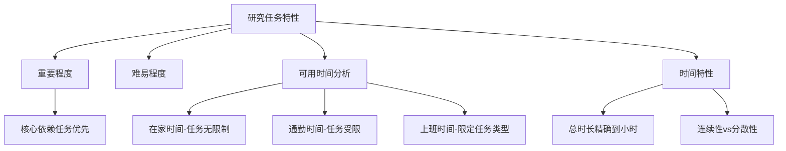
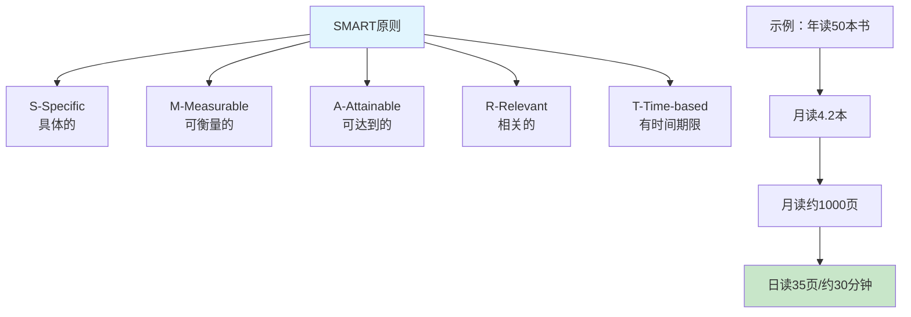
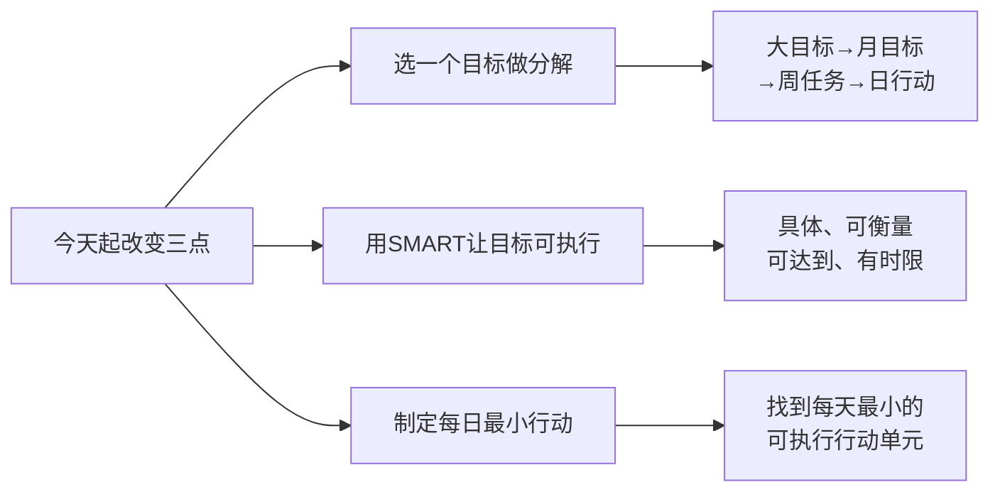

# 4.3分解目标要明确
#### 目录介绍
- [01.目标分解的背景](#01目标分解的背景)
- [02.研究任务的特效](#02研究任务的特效)
- [03.任务时间的特性](#03任务时间的特性)
- [04.目标拆任务案例](#04目标拆任务案例)
- [05.今天起改变三点](#05今天起改变三点)
- [06.课后作业思考下](#06课后作业思考下)

## 01.目标分解的背景

### 1.1 目标转化为任务

当目标确定后，就应当把目标转化成要做的具体任务，比如确定了要学习英语要通过自考本科英语考试的目标。

那么接下来就应当进行任务划分，比如可以划分为背诵新概念课文、练习短文写作等等具体的任务，注意要把握好目标和任务的层级关系。

### 1.2 目标细化的力量

**必须把目标细化。目标细化的好处是什么？就是让长期目标变得容易实现**。比如：我要成为作家，想要成为什么样的作家？将大目标分解成每个月、每天的小目标，以及当下的目标。

我要成为作家，怎么细化它。比如：我想成为作家，我打算先写10年；打算每年写2部作品；打算每半年写出1部作品；打算每个月写3万字；打算每天写1000字；打算每天9点写完。

这就是细化，现在是不是觉得成为作家也是可以的，而且很简单。这样你还会焦虑吗？基本不会，为什么呢？**因为目标明确，可执行**。

### 1.3 细化到最小单位

在进行工作阶段分解过程中，要认真地将工作进行细化，要细化到月、周、日的级别，才能保证阶段分解真的有实际意义。

那么目标要细分到什么程度呢？**拆分后每一个小目标足够清晰、简单、具体，你一看就知道如何做**。任务分解一定要足够细，细到足够具体和可顺畅执行的程度，只要足够细，就没有难的任务。

## 02.研究任务的特效

研究任务的特性就是研究任务的重要程度、难易程度、自己可用来完成任务的时间、任务的时间特性。

难易程度不用多说，接下来稍微说明下任务的重要程度和自己可用来完成任务的时间，然后重点论述任务的时间特性。

### 2.1 判断任务的重要程度

什么是重要的任务？关键在于找到**核心依赖关系**。比如说java进阶学习，具体任务划分为学习jvm、学习高并发、学习javaE。

jvm是java底层核心技术，要想深入学习javaE和高并发技术就必须对jvm有比较深入的理解，也就是说jvm的学习深度限制了高并发和javaEE的学习深度，因此可以说jvm学习任务是java进阶学习最重要的任务。

**判断任务重要程度有一个简单的方法：看它是否是其他任务的前置依赖**。如果一个任务不完成，其他任务就无法推进或者效果大打折扣，那它就是最重要的任务。就像盖房子必须先打地基一样，地基任务永远排在最前面。

### 2.2 分析可用时间的构成

研究自己可用来完成任务的时间，就是研究自己除了吃饭、睡觉、工作、休息等必要时间之外，可用来完成任务的总时间有多少以及构成总时间的成分，总时间不必多说，主要说下构成总时间的成分。

就我个人而言，我的可用来完成任务的时间成分主要包括在家的时间、在地铁上的时间、上班期间可争取用来完成任务的时间，显然这三类时间的性质是不同的。

### 2.3 根据时间性质匹配任务

比如在家时间是几乎可以去执行所有的任务，在地铁上的时间可以执行的任务就会受到很大限制比如学习英语的任务、学习编程的任务、健身减肥的任务则是不能在地铁上执行的。

然后上班期间可争取用来完成任务的时间则受到极大的限制基本只能限定在执行学习编程的任务上，弄清楚这些可用来完成任务的时间的不同性质之后，可以根据不同的时间性质来安排不同的任务。

| 时间类型 | 可执行的任务范围 | 最佳匹配任务 |
|---------|---------------|------------|
| **在家时间** | 几乎无限制 | 深度学习、编程实践、健身 |
| **通勤时间** | 受限较大，不适合动手操作 | 听音频、看电子书、思考规划 |
| **上班间隙** | 限定在工作相关 | 技术学习、阅读文档 |
| **碎片时间** | 5-15分钟的空隙 | 背单词、复习笔记、快速阅读 |

**核心原则：让时间的性质和任务的性质匹配起来**。深度学习需要安静连续的时间，就安排在家里；轻量级的输入型学习，就安排在通勤路上。这样才能让每一段时间都发挥最大价值。

## 03.任务时间的特性

任务时间特性，研究这一点是非常关键的，任务的时间特性包括完成任务的总时长，注意完成任务的总时长是精确到小时而不是天，任务的时间特性还包括完成任务时间的连续性和分散性。

### 3.1 持久战与歼灭战的区分

弄清楚什么任务需要长期作准备什么任务适合短期突破，换句话来说就是什么任务适合打持久战，什么任务适合打歼灭战。

比如学习英语目标里面有一个任务是背诵新概念英语课文，那么可不可以短期集中所有业余时间来完成这个任务呢，答案是不合适的。

因为一方面短期集中时间进行大量背诵是会让人产生厌倦感的另一方面背诵课文具有遗忘性如果短期集中时间强行背诵下来了那么时间拉长还是会很快遗忘的，因此背诵课文是不能短期集中时间毕其功于一役的，而应该是将学习总时长尽可能分散到长期的每一天，采取细水长流的方式。

| 任务类型 | 时间策略 | 典型任务 | 核心特征 |
|---------|---------|---------|---------|
| **持久战任务** | 分散到每天，细水长流 | 背英语、健身、阅读 | 需要重复巩固，遗忘性强 |
| **歼灭战任务** | 短期集中突破 | 考证、写报告、学完一门课 | 可以一次性完成，不会遗忘 |
| **混合型任务** | 先集中再分散 | 学新技术框架 | 入门需集中，精通靠日常 |

### 3.2 研究时间特性的三重意义

**第一重意义：让我们心里有底**。我们知道了所有任务要完成的总时长是多少，如果总时长过长超出了我们前面说的能够利用的总时间，那就说明我们定的目标过多或者过高，就应当减少目标或降低目标要求使任务减少减轻切合自己实际掌控的时间。

**第二重意义：提高时间利用效率**。避免各个任务被平均对待，平均投入时间到每一个任务上，以至于一个任务都完成不了。个人时间毕竟有限而且同一时间只能专注做一件事，那么我们只有让同一段时间要的事情稍微少一点，即降低我们任务的并发数量，这样我们做起事才会得心应手。研究任务的时间特性，尤其是找到适合打歼灭战的任务是有重要意义的，这样我们短期集中时间去完成一个任务，这个任务一旦完成就消失了至少是在这个年度消失了，也就是不会再出现在我们并发任务的清单中。

**第三重意义：振奋人心的鼓舞作用**。我们有很多需要长期用分散时间去完成的任务，时间一长如果这些打持久战的任务没有明显突破，那么我们必然士气低落。与此同时我们可以集中一部分时间突破可以打歼灭战的任务那么势必会提升我们的士气。

### 3.3 制定时间分配的策略

**把持久战和歼灭战穿插安排，是保持学习动力的关键**。持久战提供稳定的积累，歼灭战提供阶段性的成就感。具体的分配建议是：

- **每天的固定时间**（如早起30分钟、睡前30分钟）→ 安排给持久战任务
- **周末的整块时间**（如周六下午3小时）→ 安排给歼灭战任务
- **每完成一个歼灭战任务就庆祝一下**，用成就感为持久战续航

这样做的效果是：你的任务清单会越来越短（歼灭战不断消灭任务），同时你的基础能力在持续增长（持久战不断积累）。双线并行，既有长期收益，又有短期激励。

## 04.目标拆任务案例

将目标进行拆分变成具体可执行的任务，可以尝试套用一下smart原则。将每个核心目标转化为具体的行动计划，包括具体的任务、时间节点和预期结果等。将这些行动计划落实到年、月、周、日的执行计划中，以便更好地跟进和完成目标。

1. s-specific 具体的： 目标必须是具体的，让人知道应该怎么做。 
2. m-measurable 可衡量的： 目标或者指标要是能够测量，能够给出明确判断的，比如通过数据。 
3. a-attainable 可达到的： 在给自己或者他人确定目标的时候，目标不能定太高，也不能太低，最好是努力一下能够达到的。 
4. r-relevant 相关的： 目标与目标之间要有一定的关联性，整体都是为大目标或者大方向服务。 
5. t-time-based 有明确的时间期限：对于一个目标而言，如果没有截止期限，那么就基本等同于无效，这也是拖延最大的敌人。所以，需要设定截止时间。

举个例子：我想在2024年坚持读书。经过评估之后，变成了，我想在2024年读完50本书。

再继续细化变成了：我想在2024年我想读完50本书，平均每个月需要读4.2本。按照每本书平均200-250页算起，一个月需要读书1000页左右。

所以，我最终给自己制定的计划是：2024年，平均每天读书35页，预计花费30分钟，一周读完1本书，一年预计可以读完50本书。

将计划拆分倒推，每天读完35页书，远比读完50本书这个目标好实现的多。忘记50本书这件事，从每天35页书，每周1本书，每个月4本书开始，你会发现原本很难做到的事情自己轻而易举就完成了。

将50本书这个相对比较大的指标，细致拆分到每一天，每一周、每一个月，再通过每周每月复盘来督促自己行动，完成率会更高。

## 05.今天起改变三点

**第一点：今天就选一个目标做完整分解**。拿出你最重要的一个年度目标，像文中读50本书的例子一样，把它层层分解到每天的行动。年目标→月目标→周任务→日行动。算出每天只需要做什么、做多少，你会发现看似遥不可及的目标，分解后其实并不难。关键是把大象切成片，一片一片吃。

**第二点：用SMART原则检验每一个分解后的小目标**。分解不是简单地把数字除以天数，每一个小目标都要满足SMART——具体是什么、怎么衡量完成了、是否现实可达、与大目标是否相关、截止时间是什么。不符合标准的小目标要重新定义，否则执行时一定会模糊不清。

**第三点：找到你的"每日最小行动"**。从分解后的任务中，提炼出一个每天都能执行的最小行动单元——比如"每天写1000字""每天读35页""每天做1道算法题"。这个最小行动要小到"没有借口不做"的程度。坚持21天，它就会变成习惯；坚持一年，结果会超出你的想象。

## 06.课后作业思考下

**1. 目标分解全流程实操**：选择你今年最重要的一个目标，按照"年→季度→月→周→日"的层级做一次完整分解。每一级都要明确数量指标和截止时间。分解完成后检查：最底层的每日行动是否简单到"不需要思考就能开始"？

**2. 任务特性分析**：参考文中关于任务特性的分析，把你当前手头的所有任务按照"紧急程度、重要程度、难度、时间需求"四个维度进行分类。看看哪些任务可以并行，哪些必须串行，哪些可以委托或放弃。

**3. SMART改造练习**：把以下模糊目标用SMART原则改写为可执行的具体目标——"我要学好英语""我要提升技术""我要变得更健康"。改写后的目标必须包含：具体做什么、达到什么标准、什么时间完成。

**4. 倒推法计划设计**：选一个你想在6个月后达成的目标，用倒推法制定计划——从最终结果出发，倒推每个月需要达成什么里程碑，每周需要完成什么任务。这种"以终为始"的规划方式是否比"从现在开始往前看"更有方向感？