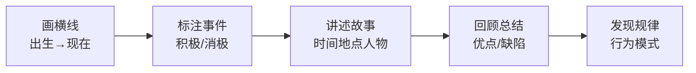
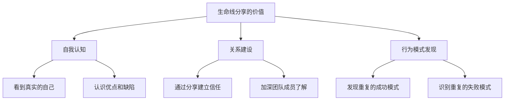
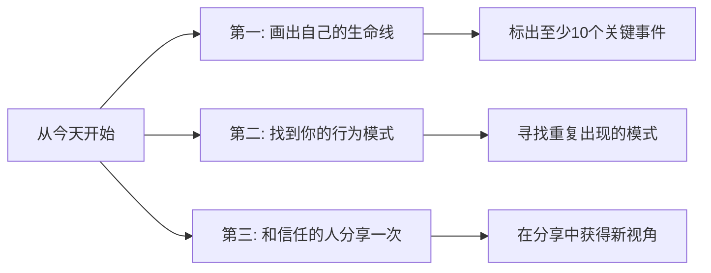

# 5.10生命线分享游戏
#### 目录介绍
- [01.生命线游戏背景](#01生命线游戏背景)
- [02.生命线分享工具](#02生命线分享工具)
- [03.用白纸记录事件](#03用白纸记录事件)
- [04.标出事件要阐述](#04标出事件要阐述)
- [05.回顾总结说重点](#05回顾总结说重点)
- [06.可以用那些场景](#06可以用那些场景)
- [07.充分使用该游戏](#07充分使用该游戏)
- [08.今天起改变三点](#08今天起改变三点)
- [09.课后作业思考下](#09课后作业思考下)

## 01.生命线游戏背景

### 1.1 自我认知的重要性

自我认知的重要性大家都知道，清晰且正确的自我认知决定了我们能不能更好的成长，以及更大概率地获得成功。但这并不是一件简单的事，说它是人生中最大的难题也不为过，多少人终其一生，对自己也没有正确的认识。

### 1.2 生命线分享方法

有没有什么方法能让我们更好的认知自我呢？推荐一个小技巧——生命线分享。比如同事，朋友在一起交流和分享自己的技术、管理、学习或者人生经验等。

绘制自己的"生命线"，回忆自己之前的历程，理解时间的重要性和生命的有限性，知道规划人生和树立梦想的重要性，认识到未来的生命线需要认真规划。**生命线分享就是用来复盘自己人生，并借此建立关系的一个好方法。**

## 02.生命线分享工具

### 2.1 什么是生命线分享

生命线分享是进行自我认知的一种工具，通过回顾与分析你过往的人生经历，挖掘出那些积极与消极的事件，哪些节点对"你成为今天的你"产生了较大的影响。

通常在这个过程中，你会更进一步认识到自己所具备的特质与缺陷，比如性格、能力、价值观等。

### 2.2 如何开始绘制

开始绘画自己的生命线，在不限形状、颜色、长度的情况下，根据自己的实际情况和自己的想法进行创作。

## 03.用白纸记录事件

### 3.1 画线和标注

第一步，准备一张白纸，在白纸上画一条横线，横线的最左边表示你的出生时间点，最后边表示现在。

### 3.2 回忆和记录

你可以用10-15分钟的时间，回忆你成长过程中让你印象深刻的事情，然后把这些事情按照时间顺序在横线上一一标注出来。

**注意，横线的上方标注对你有积极影响的事件，横线下方标注对你有消极影响的事件，离横线的距离远近，表示对你的影响程度。**

## 04.标出事件要阐述

### 4.1 深入讲述事件

对标注出的每一个事件，进行讲述。讲述的时候要尽量真实和完整，包含时间、地点、人物、情景、情节等要素。

同时要尽可能深入到故事中的每一个细节，包括你当时是怎么想的，又是怎么做的，最终得到了什么样的结果，你对此又有什么感受等等。

### 4.2 上帝视角反思

以自己画出的各个生命节点为起点，想象是否存在不同的选择，不同的选择是否会带来不同的结果，在不同选择上写出自己的情绪与感受。

回过头来看，通过上帝视角看待过去，你觉得你的想法发生了什么样的变化！

## 05.回顾总结说重点

### 5.1 发现优点和缺陷

回顾总结，看看在那些给你带来积极影响的事件中，你表现出了哪些优点，比如善于沟通、执行力强、创新能力强、善于整合资源等等；而那些对你有消极影响的事件，又暴露出了你哪些缺陷。

### 5.2 识别重复的模式

比如没有明确目标、缺乏自律、拖延严重、回避问题、犹豫不决、过于谨慎小心等等，再看看这些缺点是否如今依然影响着你，**你是不是陷在了一些不自知的怪圈里面走不出来，重复着失败。**

## 06.可以用那些场景

### 6.1 个人成长场景

做类似的分享，举个例子，对我有积极改变的节点包括报名参加IT培训，选择计算机行业，决心去图书馆沉淀技术，年复一年写博客，进行公众号写作练习。

对我有消极影响的包括高考考试考不上本科，毕业后去工厂搞流水线，到处乱窜找不到方向，在一家传统企业公司舒适了太久等等……

### 6.2 团队建设场景

**生命线分享特别适合团队破冰和信任建设**。新团队刚组建时，成员之间往往缺乏了解和信任，通过生命线分享可以快速拉近彼此的距离。

| 场景 | 目的 | 时间建议 | 注意事项 |
|------|------|----------|----------|
| **新团队破冰** | 快速了解彼此背景 | 每人15分钟 | 不强制分享敏感事件 |
| **年度团建** | 加深老团队默契 | 每人20分钟 | 鼓励分享近一年新增事件 |
| **一对一辅导** | 帮助下属认识自己 | 30-45分钟 | 以倾听为主，不做评判 |
| **职业规划** | 梳理职业轨迹和方向 | 独立完成即可 | 重点关注转折点的选择逻辑 |

### 6.3 自我复盘场景

除了团队场景之外，生命线分享也是一个强大的自我复盘工具。**每隔半年或一年，拿出之前画过的生命线，往后延伸，标注新增的事件**。对比前后几次的生命线，你会清晰地看到自己的成长轨迹和变化趋势。

自我复盘时可以问自己三个问题：过去半年新增了哪些积极事件？是不是正在重复以前的消极模式？下一段生命线上我希望出现什么样的事件？这种定期的"人生审计"，能帮你保持清醒，避免在日常琐碎中迷失方向。

## 07.充分使用该游戏

### 7.1 挖掘真实的自我

通过这样的生命线工具，你能够比较容易的借助故事挖掘出自己真正的特质，不论是正面的还是负面的。一方面，人的记忆具备美化功能，我们回忆中的那个自己，会比真实的自己更加优秀。

故事一般都有因有果，当你深入讲述自己生命中的关键故事时，其实也在刨根问底寻找你成功或失败的根本原因。

### 7.2 另一种形式的人生复盘

这是你的人生故事，最能反映出你的性格、兴趣、能力、价值观等等诸多特质。生命线绘画结束后，本着开放自愿的原则进行分享。

**生命线分享，其实就是另一种形式的人生复盘**，是一个能帮助你拨开记忆迷雾，让你尽可能真实认知自己的工具。而如果你能够看到真实的自我，那你就有更大的机会成为你想要成为的人。

如果你觉得这个方法对你有用，那你不妨把它作为一个常规项目，通过若干次人生复盘找到你的固有行为模式，总结出属于你的人生规律，为今后的行动提供参考和指引。

| 步骤 | 具体操作 | 时间建议 | 核心要点 |
|------|----------|----------|----------|
| 画线 | 横线从出生到现在 | 2分钟 | 留出足够标注空间 |
| 标注 | 标出积极和消极事件 | 10-15分钟 | 上方积极、下方消极、距离表示程度 |
| 讲述 | 逐一讲述每个事件 | 20-30分钟 | 包含时间、地点、人物、感受 |
| 总结 | 回顾优点和缺陷 | 10分钟 | 寻找行为模式和规律 |
| 行动 | 制定改变计划 | 5分钟 | 基于发现制定具体行动 |

## 08.今天起改变三点

**第一，今天就花20分钟画出你自己的生命线。** 拿一张白纸，画一条横线，从出生到现在，标出至少10个对你人生有重大影响的事件。积极的放上面，消极的放下面，离横线的距离表示影响程度。画完后你会对自己的人生轨迹有一个全新的认知。

**第二，从你的生命线中寻找重复出现的行为模式。** 看看那些让你成功的事件中，有没有共同的因素（比如"只要下定决心就能做到""擅长从零开始做事"）？那些让你受挫的事件中，有没有共同的模式（比如"总是在关键时刻犹豫""容易被短期利益吸引"）？这些模式就是了解自己的钥匙。

**第三，找一个你信任的朋友或家人，做一次生命线分享。** 把你的生命线讲给对方听，详细描述那些关键事件。对方的反馈往往能帮你看到自己看不到的盲点。记住，分享的前提是信任和安全感。

## 09.课后作业思考下

1. 画出你的生命线，标出至少10个关键事件。对每个事件写一段话：当时发生了什么？你是怎么想的？怎么做的？结果如何？如果重来一次你会怎么做？
2. 从你的生命线中，找出3个积极事件和3个消极事件，分析它们的共同点。你能从中发现什么关于自己的行为模式？
3. 如果你是团队Leader，试着在团队建设活动中组织一次生命线分享。记录这次活动对团队关系和信任度的影响。
4. 把生命线往未来延伸：你希望未来5年在这条线上标注什么样的事件？这些期望反映了你什么样的人生追求？

