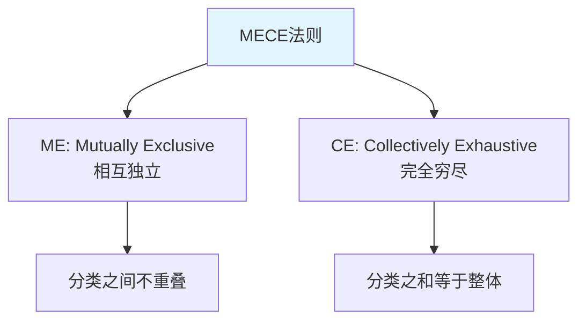
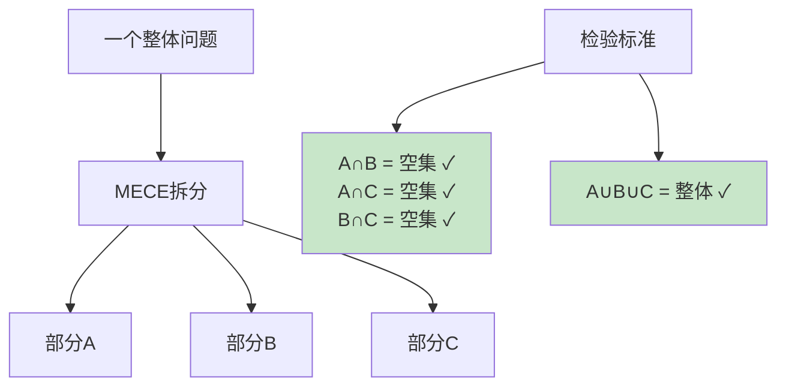
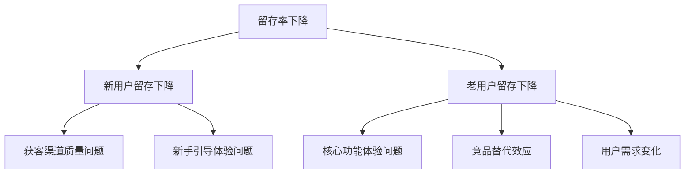
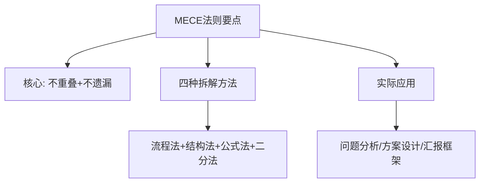
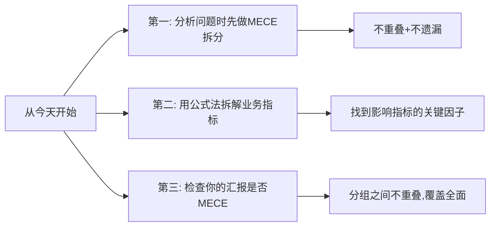

# 5.18MECE分析法则
#### 目录介绍
- [01.我的一段真实经历](#01我的一段真实经历)
  - [1.1 那份被领导评价"乱七八糟"的故障复盘](#11-那份被领导评价乱七八糟的故障复盘)
  - [1.2 麦肯锡那位前辈的一张餐巾纸](#12-麦肯锡那位前辈的一张餐巾纸)
- [02.MECE法则的背景](#02mece法则的背景)
  - [2.1 为什么需要MECE](#21-为什么需要mece)
  - [2.2 MECE的起源](#22-mece的起源)
- [03.MECE的核心含义](#03mece的核心含义)
  - [3.1 相互独立 ME](#31-相互独立-me)
  - [3.2 完全穷尽 CE](#32-完全穷尽-ce)
  - [3.3 MECE的直观理解](#33-mece的直观理解)
- [04.MECE的拆解方法](#04mece的拆解方法)
  - [4.1 按流程拆解](#41-按流程拆解)
  - [4.2 按结构拆解](#42-按结构拆解)
  - [4.3 按公式拆解](#43-按公式拆解)
  - [4.4 按二分法拆解](#44-按二分法拆解)
- [05.MECE的实际案例](#05mece的实际案例)
  - [5.1 分析App留存率下降](#51-分析app留存率下降)
  - [5.2 分析项目延期原因](#52-分析项目延期原因)
- [06.MECE的常见误区](#06mece的常见误区)
  - [6.1 过度追求完美MECE](#61-过度追求完美mece)
  - [6.2 层次太多太复杂](#62-层次太多太复杂)
  - [6.3 忘记了分析的目的](#63-忘记了分析的目的)
- [07.总结回顾一下](#07总结回顾一下)
  - [7.1 一句话核心](#71-一句话核心)
  - [7.2 MECE给你的最大价值](#72-mece给你的最大价值)
- [08.我后来发生的改变](#08我后来发生的改变)
  - [8.1 第一周：所有汇报先做MECE检查](#81-第一周所有汇报先做mece检查)
  - [8.2 第一个月：故障复盘获评"优秀范本"](#82-第一个月故障复盘获评优秀范本)
  - [8.3 半年后：MECE 成了我团队的肌肉记忆](#83-半年后mece-成了我团队的肌肉记忆)
- [09.今天起改变三点](#09今天起改变三点)
  - [9.1 第一，分析问题时先做MECE拆分](#91-第一分析问题时先做mece拆分)
  - [9.2 第二，用公式法拆解业务指标](#92-第二用公式法拆解业务指标)
  - [9.3 第三，检查你的汇报是否MECE](#93-第三检查你的汇报是否mece)
- [10.课后作业思考下](#10课后作业思考下)
  - [10.1 个人实践类作业](#101-个人实践类作业)
  - [10.2 思辨与延伸类作业](#102-思辨与延伸类作业)

## 01.我的一段真实经历

### 1.1 那份被领导评价"乱七八糟"的故障复盘

那次故障是我职业生涯永远忘不了的——**我们的核心服务在凌晨 3 点宕机了 47 分钟，影响了 30 万用户**。我作为责任人，第二天上午要给整个部门做故障复盘。

我熬了一整夜，写了一份 8 页的复盘报告。我以为自己写得很全面，原因列了整整 22 条，包括：

> "代码 Bug、SQL 慢查询、缓存穿透、新人不熟悉、流量突增、监控告警延迟、服务器配置不够、数据库连接池小、运维不到位、压测不充分、code review 走过场、文档不完善……"

报告发出去的一瞬间，我以为自己已经覆盖了所有可能的角度。

结果会议上，部门 Leader 看了 30 秒，把电脑一合，说了一句让我面红耳赤的话：

> "你这个东西**乱七八糟的**——'代码 Bug'和'新人不熟悉'到底算一类还是两类？'压测不充分'和'监控告警延迟'是同一层级的吗？你这 22 条里，**至少有 8 条是重复的，又至少漏了 4 个关键维度**。"

我当场无语——**我以为列得越多越全，没想到反而暴露了我的混乱**。

### 1.2 麦肯锡那位前辈的一张餐巾纸

会后一位前辈把我拉到楼下咖啡厅。他在我对面坐下，掏出一张餐巾纸说："让我教你一个东西。"

他在餐巾纸上画了一个矩形，分成 4 个格子，写上：

> **人 / 系统 / 流程 / 外部**

然后说："你那 22 条，全部能塞到这 4 个格子里——而且**每条只能进一个格子，不能重复**；同时**这 4 个格子加起来，要能覆盖所有可能的故障原因**。这就是 MECE。"

我当场用他的框架重新整理我的 22 条原因——

- **人**：新人不熟悉、code review 走过场、运维不到位 → 合并为"人员能力与流程不足"
- **系统**：代码 Bug、SQL 慢查询、缓存穿透、连接池小 → 合并为"代码与配置缺陷"
- **流程**：压测不充分、监控告警延迟、文档不完善 → 合并为"质量保障流程缺失"
- **外部**：流量突增 → 不可控外部因素

22 条压缩成 4 大类，**没有任何重复，且我突然发现还漏了"灾备能力"和"应急预案"两个关键维度**。这 4 大类一目了然，每一类下挂 3-5 条具体原因——这就是真正的复盘报告。

那张餐巾纸我至今还留着。下面这套方法论，就是当年那位前辈在 5 分钟内救了我职业生涯的东西。

## 02.MECE法则的背景

### 2.1 为什么需要MECE

你有没有分析问题时遇到过这样的困境：列了一堆原因，但总觉得不全面，可能遗漏了什么；又或者列出的原因之间有重叠，讨论时把同一个问题翻来覆去说了好几遍。

问题的根源在于：你的分析框架不够严谨。MECE法则就是帮你建立严谨分析框架的工具。

### 2.2 MECE的起源

MECE（Mutually Exclusive, Collectively Exhaustive）由全球顶级咨询公司麦肯锡提出，是麦肯锡方法论的核心基石。几乎所有的咨询师在入职第一周就会学习MECE原则。

## 03.MECE的核心含义

### 3.1 相互独立 ME

"相互独立"意味着你拆分出来的各个部分之间不能有重叠。比如把人按年龄分为"18岁以下""18-35岁""35岁以上"就是相互独立的；但如果分为"学生""上班族""年轻人"就不是相互独立的，因为"年轻人"和"学生""上班族"有重叠。

### 3.2 完全穷尽 CE

"完全穷尽"意味着你拆分出来的各个部分加在一起必须覆盖全部情况，不能遗漏。比如把性别分为"男""女"是完全穷尽的；但如果只分为"男""女""儿童"就不是MECE的，因为"儿童"和前两类重叠（ME违反），而且这种分法的逻辑也不自洽。

### 3.3 MECE的直观理解

| 情况 | 示例 | 是否MECE |
|------|------|----------|
| 不重叠+不遗漏 | 人按性别分：男/女 | ✅ MECE |
| 有重叠+不遗漏 | 人按身份分：学生/上班族/年轻人 | ❌ 有重叠 |
| 不重叠+有遗漏 | 收入来源：工资/投资 | ❌ 遗漏了兼职等 |
| 有重叠+有遗漏 | 用户分：VIP/活跃用户 | ❌ 既重叠又遗漏 |

## 04.MECE的拆解方法

### 4.1 按流程拆解

把一件事按照时间顺序或流程步骤来拆分，天然就是MECE的。

比如分析"用户流失"问题，可以按流程拆解为：注册阶段流失、首次使用流失、持续使用阶段流失、付费阶段流失。每个阶段互不重叠，加在一起覆盖了用户的全生命周期。

### 4.2 按结构拆解

把一个整体按照其组成结构来拆分。比如分析公司收入，可以按业务线拆解：A业务收入 + B业务收入 + C业务收入 = 总收入。

### 4.3 按公式拆解

利用已有的公式来拆分。比如：

- 收入 = 用户数 × 客单价 × 购买频率
- 利润 = 收入 - 成本
- 转化率 = 转化人数 / 访问人数

公式中的每个因子天然就是MECE的，因为它们数学上互不重叠且组合完整。

### 4.4 按二分法拆解

最简单的MECE拆分方式：把一个集合分为A和非A。比如"用户"可以分为"付费用户"和"非付费用户"；"需求"可以分为"已完成"和"未完成"。

| 拆解方法 | 适用场景 | 示例 |
|----------|----------|------|
| 按流程 | 分析过程类问题 | 用户购买流程各阶段 |
| 按结构 | 分析组成类问题 | 公司各业务线收入 |
| 按公式 | 分析指标类问题 | 收入=用户×客单价×频次 |
| 按二分法 | 快速粗分 | 付费用户 vs 非付费用户 |

## 05.MECE的实际案例

### 5.1 分析App留存率下降

第一层拆分（按用户类型）：新用户留存下降 + 老用户留存下降 = 全部用户留存下降。这是MECE的。

第二层拆分（按原因）：针对新用户，按流程拆解为"获客阶段"和"激活阶段"的问题；针对老用户，按因素拆解为"内部原因"和"外部原因"。

### 5.2 分析项目延期原因

用MECE拆解项目延期的原因：

| 一级分类 | 二级分类 | 具体原因 |
|----------|----------|----------|
| 需求问题 | 需求变更频繁、需求不明确 | 产品经理频繁修改PRD |
| 技术问题 | 技术方案不合理、技术难点超预期 | 未预估到第三方接口限制 |
| 资源问题 | 人力不足、关键人员请假 | 核心开发生病请假一周 |
| 流程问题 | 审批流程长、环境不可用 | 测试环境被其他项目占用 |

检验MECE：四个一级分类之间是否重叠？需求/技术/资源/流程，基本不重叠。是否穷尽？加上"其他因素"兜底，可以认为是穷尽的。

## 06.MECE的常见误区

### 6.1 过度追求完美MECE

在实际工作中，100%完美的MECE往往很难做到。不要为了追求完美而花太多时间纠结分类——做到80%的MECE就已经比没有框架好得多了。

### 6.2 层次太多太复杂

MECE拆分通常2-3层就够了。层次太多会导致分析框架过于复杂，反而降低了分析效率。

### 6.3 忘记了分析的目的

MECE是工具，不是目的。拆分完之后的关键是：通过拆分发现问题的关键所在，找到解决方案。如果拆分得很漂亮但最后没有得出有价值的结论，那就是为了MECE而MECE。

## 07.总结回顾一下

### 7.1 一句话核心

MECE法则的核心是两个要求：相互独立（不重叠）和完全穷尽（不遗漏）。它是一切结构化思维的基础。

### 7.2 MECE给你的最大价值

掌握MECE，你就掌握了把复杂问题拆解为简单子问题的能力。它带给我的三个最大改变是：

1. **告别"列得越多越乱"**——以前我以为列 22 条就是全面，现在我知道 4 个 MECE 的大类比 22 条乱列更有价值
2. **暴露盲点**——MECE 框架会自动提醒你"还有哪个维度没覆盖"，比如那次故障复盘让我发现漏了"灾备能力"
3. **跨级别沟通效率翻倍**——你跟 Leader、跨部门、客户讲事情，对方一眼就能看清结构，不需要反复追问

## 08.我后来发生的改变

回到开篇那次"乱七八糟"的复盘。从前辈那张餐巾纸开始，我做了下面这些改变。

### 8.1 第一周：所有汇报先做MECE检查

我做的第一件事是给自己定了一条铁律——**任何要发出去的文档/汇报/方案，提交前必须用 MECE 自检一次**。具体动作只有两个问题：

1. "我列的这些点，两两之间有重叠吗？" → 有就合并
2. "这些点加起来，覆盖了所有情况吗？" → 没覆盖就补

第一周内我自检了 5 份文档，**平均每份能合并 30% 的重复内容、补上 1-2 个漏掉的维度**。

### 8.2 第一个月：故障复盘获评"优秀范本"

一个月后，又出了一次（小）故障，又是我做复盘。这次我严格用 MECE 框架——一级 4 类（人/系统/流程/外部）、二级各拆 3-5 条具体原因、配套行动项。

部门 Leader 看完只说了一句话：

> "这才叫复盘报告。**这份直接当模板，发到全部门**。"

那一刻我才真正理解——**MECE 不是让你看起来更专业，它真的能让一份文档的价值翻几倍**。

### 8.3 半年后：MECE 成了我团队的肌肉记忆

半年后我开始带 6 人小组，我做的第一件事就是给团队全员普及 MECE，并定下三条规则：

- **所有文档"目录"必须 MECE**——一级标题之间不许重叠
- **所有问题分析必须先列 MECE 框架**——再往下填具体原因
- **所有方案设计必须用 MECE 检查覆盖度**——避免漏关键场景

效果非常明显：

- **跨部门评审通过率显著提升**——评委一眼看清结构，不再追问"你是不是漏了 XX"
- **新人成长速度翻倍**——新人有了 MECE 这个万能脚手架，写文档不再"想到哪写哪"
- **我自己晋升答辩获最高评分**——因为整份述职用的就是 MECE 结构，评委非常容易理解

如果你也常常觉得自己"分析不全面"或者"汇报抓不住重点"，下面这三点是你今天就能开始做的事。

## 09.今天起改变三点

### 9.1 第一，分析问题时先做MECE拆分

下次分析问题时，先做MECE拆分。不要一上来就列原因，先想清楚用什么维度来拆分（流程？结构？公式？），确保拆分出来的部分不重叠、不遗漏。这个简单的步骤能大幅提升你分析问题的系统性。我自己每次写文档前都会先在草稿纸上画出 MECE 框架，再往下填内容。

### 9.2 第二，用公式法拆解业务指标

找一个你关心的业务指标，用公式法做MECE拆解。比如GMV = 用户数 × 转化率 × 客单价。拆解后，你就能清楚地知道要提升GMV应该从哪个因子入手。这种"指标拆解能力"是高级别工程师/产品经理的必备技能。

### 9.3 第三，检查你的汇报是否MECE

检查你最近的汇报或方案，看看分组是否符合MECE。如果有重叠或遗漏，重新调整分组。一份MECE的汇报，逻辑清晰度会提升一个档次。**特别提醒：先看一级目录之间有没有重叠**——这是最容易被忽视的地方。

## 10.课后作业思考下

### 10.1 个人实践类作业

1. 选一个你正在面对的工作问题，用MECE法则做一次完整的拆解（至少2层），检查每一层是否满足"不重叠+不遗漏"。
2. 找一个业务指标（如日活、转化率、客单价等），用公式法拆解为若干因子，分析哪个因子是当前最值得优化的。

### 10.2 思辨与延伸类作业

3. 回顾你最近写的一份汇报或方案，检查其中的分类框架是否MECE。如果不是，重新组织一下结构。
4. 思考MECE和金字塔原理的关系：金字塔原理中的"归类分组"和MECE有什么联系？

