# 6.1语言底蕴的提升
#### 目录介绍
- [01.语言发展金字塔](#01语言发展金字塔)
- [02.社交语言是什么](#02社交语言是什么)
- [03.语言困难的表现](#03语言困难的表现)
- [04.保护好表达意图](#04保护好表达意图)
- [05.发音吐字的练习](#05发音吐字的练习)
- [06.打好思想的基础](#06打好思想的基础)
- [07.改善语言的贫乏](#07改善语言的贫乏)
- [08.语言底蕴的积累](#08语言底蕴的积累)
- [09.场景化语言训练](#09场景化语言训练)
- [10.今天起改变三点](#10今天起改变三点)
- [12.课后作业思考下](#12课后作业思考下)

## 01.语言发展金字塔

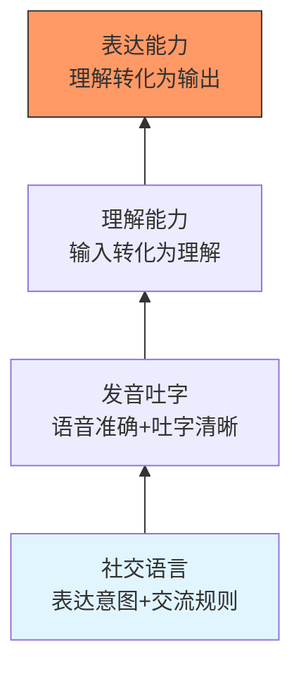

讲话和演讲最基本的也是最重要的，就是要语音准确、吐字清晰、语言有底蕴。语言能力的金字塔，即语言发展的4大要素，由底层至顶层依次为社交语言、发音吐字、理解能力和表达能力。

这四层之间是递进关系，每一层都建立在前一层的基础之上。缺少了底层的支撑，上层的能力就像空中楼阁一样无法站稳。

| 层级 | 能力要素 | 核心内涵 | 薄弱时的表现 |
|------|----------|----------|--------------|
| **第一层** | 社交语言 | 表达意图+交流规则 | 不懂察言观色、聊天容易冷场 |
| **第二层** | 发音吐字 | 语音准确+吐字清晰 | 别人听不清你说什么、口齿含混 |
| **第三层** | 理解能力 | 将输入转化为理解 | 听了半天不知道对方要表达什么 |
| **第四层** | 表达能力 | 将理解转化为输出 | 心里明白但说不出来、词不达意 |

**社交语言**：语言运用在社交场景中能发挥最大功能。社交语言是整个语言能力体系的根基，它决定了你能否在人际交往中自如地运用语言。没有社交语言作为基础，上面的能力发展都会受到局限。

**发音吐字**：好的声音，不仅能准确恰当地表情达意，而且能声声入耳，娓娓动听。所以，要讲究发声的方法和技巧，还要不断训练发音吐字并且改进优化。一个人说话含混不清，即使思想再深刻，别人也接收不到。

**理解能力**：是指将外界接收到的信息（听到的话、读到的文字）转化为自己能理解的内容的能力。没有理解力，就无法真正消化别人传递的信息，更无法做出有效回应。理解力是"输入"的关键环节。

**表达能力**：是语言金字塔的顶端，是将自己理解的内容转化为清晰、有条理的语言输出给别人的能力。表达力建立在前三层能力之上，只有社交语言、发音吐字和理解能力都打好基础，表达才能真正流畅自如。

表达能力又可以细分为三大种类：**写作表达**（写文章、写博客、写报告）、**说话表达**（与人沟通、演讲讲演）和**无声表达**（肢体语言、表情眼神等不露声色的表达）。不同种类的表达适用于不同场景，三者相辅相成。

表达能力的提升也有阶段性，从低到高依次为：

| 阶段 | 能力描述 | 训练重点 |
|------|----------|----------|
| **描述** | 能把事情描述清楚 | 练习"平行描述"，将场景和语言建立联系 |
| **扩充词汇** | 用形容词和条理性词让表达更丰富 | 积累形容词、顺序词（首先/其次/最后） |
| **多轮交流** | 能和他人进行有来有往的对话 | 练习即兴对话、开放式提问 |
| **分享讲演** | 能在公众面前做分享和演讲 | 从小范围分享开始，逐步扩大 |

**需要注意：每一个阶段不是结束，而是开始，到下一个阶段也要持续做前面的训练**。

## 02.社交语言是什么

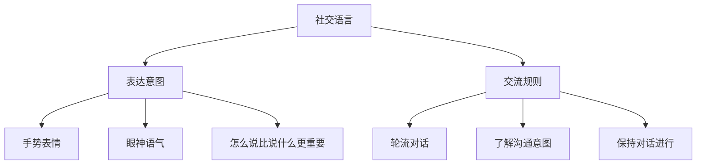

社交语言的目的是表达意图和交流规则。这两点可以说是非常关键和重要！这就是社交语言，它在语言发展金字塔的底端。

### 2.1 表达意图的多维性

表达意图不仅仅是开口说话，还包括你的每一个手势、眼神、表情等。另外，同一句话用不同的口气说，呈现的效果是不同的，表达的意图自然也不同。

比如"你今天怎么来这么晚"，用关心的语气说是关切，用不耐烦的语气说是质问，用调侃的语气说是打趣。语言学家梅拉比安的研究表明，沟通中55%的信息来自肢体语言，38%来自语音语调，只有7%来自语言内容本身。

这意味着"怎么说"往往比"说什么"更重要。一个人即便词汇量丰富、逻辑清晰，如果表达时面无表情、语气生硬，效果也会大打折扣。

### 2.2 交流规则的本质

交流规则包括三个层面：轮流对话、了解对方的沟通意图、保持对话的进行。交流是一个双向通道，要有一来一回、有来有往。

**轮流对话**：很多人在沟通时要么滔滔不绝不给别人插话的机会，要么沉默寡言一言不发。好的交流节奏是"说—停—听—回应"的循环。你说完一个要点就停下来，给对方反应的时间，听对方的回应，再做出回应。

**了解沟通意图**：有些人不懂看眼色，不懂"听话听音"。别人说"今天天气不错"，可能不是在讨论天气，而是在寻找话题、表达好心情或者暗示"我们出去走走"。了解对方沟通的真实意图，是交流规则中最考验功力的部分。

**保持对话进行**：有些人平时聊天的时候很容易把聊天"聊死"——对方说什么都回一个"嗯""哦""好的"，对话自然就进行不下去了。保持对话的进行需要主动给出新信息、提出新问题、表达新观点，让话题像接力棒一样传递下去。

## 03.语言困难的表现

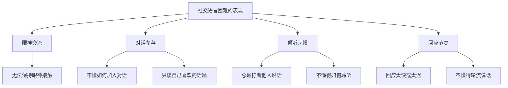

平时说话、表达没有问题，但是出现了一些社交方面的困难，比如不合群、无法与人保持眼神交流等。基于这些特征，语言发展的评估中细分出了"社交语言困难"这一概念。

### 3.1 典型困难表现

社交语言困难的表现如下：无法保持眼神交流；不懂得如何加入同事或朋友的对话中；不懂得轮流说话；不愿意分享自己的想法和感受；只谈自己喜欢的话题而不关心对方的兴趣；总是打断他人对话，不懂得如何聆听；回应他人的时间不准确，如太快或太迟回应等。

### 3.2 困难背后的原因

这些困难的根源通常不是"不想做好"，而是"不知道怎么做好"。很多人从来没有被系统地教过社交语言的规则，全凭自己摸索，难免有盲区。

另一个重要原因是**自我中心思维**——在沟通中过于关注"我想说什么"，而忽略了"对方想听什么""对方在表达什么"。要改变这种状况，需要有意识地将注意力从自己身上转移到对方身上。

### 3.3 自我诊断与改进

| 困难表现 | 自我诊断问题 | 改进方向 |
|----------|-------------|----------|
| 眼神交流不自然 | 和人说话时是否经常看别处？ | 练习"三角注视法"（看眼睛→鼻子→嘴形成三角） |
| 不知如何加入对话 | 是否经常站在群体边缘不说话？ | 从"附和+追问"入手（"对对对，后来呢？"） |
| 只谈自己的话题 | 聊天中问对方问题的比例有多大？ | 遵循"3:1原则"（说3句中至少1句关于对方的） |
| 总是打断别人 | 是否经常在对方说到一半时插话？ | 等对方说完后默数2秒再开口 |
| 聊天容易冷场 | 对方的话你是否只回"嗯""哦"？ | 回应时补充信息或反问（"嗯，我也觉得，你是因为XX才这么想的吗？"） |

## 04.保护好表达意图

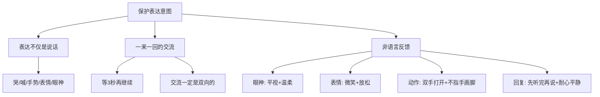

要明白，表达不仅仅是说话，还包括哭、喊、叫、手势、表情、眼神等。从难受时候的哭，到遇到挫折后的丧气，这些都是表达；一开心就拍手，笑的表情，看着别人的眼神，这些也是表达。因此，需要及时地反馈，保护好表达意图。

### 4.1 表达需要一来一回

别人可能刚想跟你表达，因为你不停地说，别人一下子就蒙了，不知道接下来该怎么办。从你那里接收的情绪感觉是哪里不对。

因此，真正保护好表达意图，需要一来一回，等3秒再继续。什么叫慢慢说话？就是一来一回的表达。交流一定是双向的！

在职场中也一样：开会时如果你一口气说了5分钟不给别人机会，别人的想法和反馈就被"堵"住了。好的做法是每说完一个要点就停下来，看看对方的反应，给对方表达的机会。

### 4.2 非语言的表达反馈

语言发展过程中，对待别人的表达，除了给出及时反馈之外，还需要有一些非语言上的反馈相结合。动作、表情、语气都是非常重要的。

**眼神**：和别人平视甚至略低于别人眼睛，这样对方可以感受到平等和安全。如果是居高临下，会让别人感受到的是威胁。在正式沟通中，建议采用"柔和注视"——看着对方眼睛周围的区域（鼻梁到额头之间），既表达关注又不会给对方压力。

**表情**：脸部放松、眼神温柔、嘴角上扬保持微笑。如果是眉头紧锁、面部紧绷、嘴巴下垂，那让别人也不容易聊下去。表情管理的关键是"自然"——不必刻意挤出笑容，而是让面部保持放松、开放的状态。

**动作**：双手打开、温柔比划、特别注意不要指手画脚。如果是站着、不耐烦地走动、双手叉腰或环绕胸前、用手指着别人的鼻子，那会导致别人反感。研究表明，双手展开的姿势会让人感觉你是开放的、可信赖的。

**回复**：等待别人说完再回复、先提问澄清再评判、耐心平静地说话。如果是打断、大吼、情绪激动，那表达将难以和谐！一个实用的技巧是"先复述再回应"——"你刚才说的是XX对吗？我的想法是……"这样既表示你在认真听，又避免了理解偏差。

## 05.发音吐字的练习

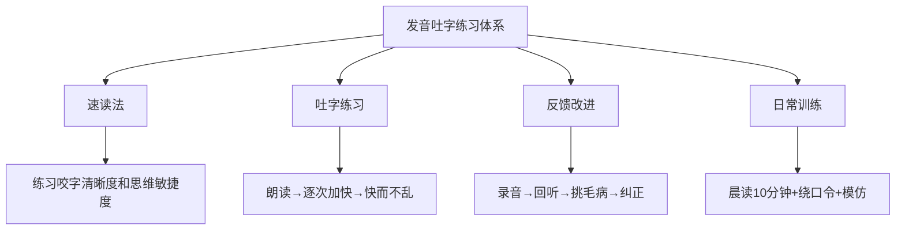

### 5.1 尝试速读法

速读法是一个锻炼语音准确、吐字清晰的有效方法。这是因为快读能练习咬字清晰度、发音准确度，而且能练习思维的敏捷度和反应的快速度。

具体操作方法：找一篇演讲词或一篇优美的散文，先拿来字典把文章中不认识或弄不懂的字词查出来，彻底弄明白，然后开始朗读。一般开始朗读的时候速度较慢，逐次加快，一次比一次读得快，最后达到你所能达到的最快速度。

关键要求是**快而不乱**——每个字、每个音都发得十分清楚、准确，没有含混不清的地方。如果你不把每个字音都完整地发出来，那么速度加快以后，就会让人听不清楚你在说什么，也就失去了"快"的意义。

### 5.2 怎么练习吐字

吐字练习的进阶路径：

| 阶段 | 训练内容 | 要求 | 时间建议 |
|------|----------|------|----------|
| **基础阶段** | 朗读散文/演讲稿 | 发声完整、不停顿 | 每天15分钟 |
| **提速阶段** | 逐次加快朗读速度 | 快而不乱、字字清晰 | 每天10分钟 |
| **挑战阶段** | 绕口令/贯口 | 速度与清晰度兼顾 | 每天5分钟 |
| **应用阶段** | 即兴演讲/复述新闻 | 流畅自然、不卡顿 | 每天10分钟 |

速读法练习的优点是不受时间、地点的约束，无论何时何地，只要手头有一篇文章就可以练习，而且还不受人员的限制，不需要别人的配合，一个人就可以独立完成。

### 5.3 吐字反馈和改进

当然你也可以速读练习的时候用手机录音，练习完后自己听听，挑出速读中出现的毛病。比如，哪个字发音不够准确，哪个地方吐字还不清晰等，这样就更有利于你有目的地进行纠正、学习和改进。

"录音回听法"是发音改进的核心方法。绝大多数人第一次听到自己的录音时都会感到不适——这恰恰说明你平时对自己的声音缺乏客观认知。建议每周至少做一次录音回听，重点关注以下几点：

- 语速是否过快或过慢
- 是否有口头禅（"嗯""那个""就是说"）
- 声调是否过于平淡或过于夸张
- 重点内容是否有适当的停顿和强调

## 06.打好思想的基础

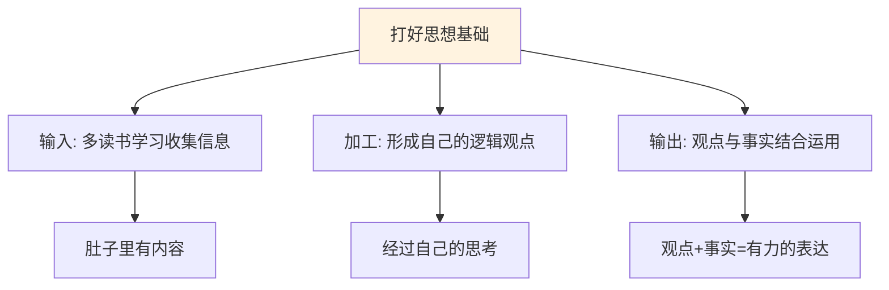

### 6.1 输入是表达的根基

克服思想贫乏只有一个途径，就是多去读书、学习、收集信息，然后以此来形成自己逻辑的观点，让自己的大脑有很多想法。

如果你肚子里面没有充足的内容，而且你对这些内容没有经过自己的思考，你很难形成自己的表达体系。一个读书少、思考少的人，在表达时要么空洞无物，要么只能重复别人的观点，缺乏自己的见解和深度。

### 6.2 观点与事实的运用

观点与事实的运用，就是我们表达的基础。"我今天过得很开心"是你的观点；"我今天去了游乐园"是你的事实。如果你没有事实的支撑，你就无法跟别人表达你很开心这个心情。

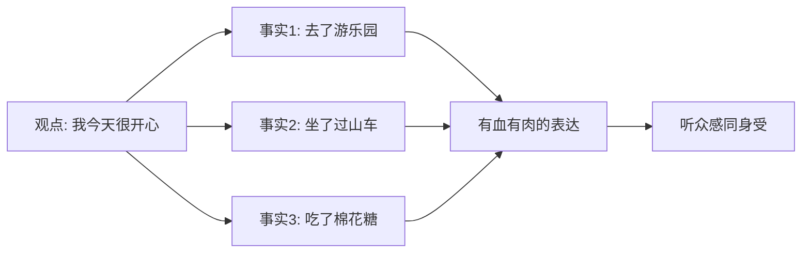

在工作中也是一样："这个方案不太好"是观点，"方案存在三个问题：第一，性能瓶颈在XX环节；第二，成本超出预算30%；第三，没有考虑XX边界情况"是事实。只有观点没有事实，说服力为零；观点加上事实，才能形成有力的表达。

### 6.3 建立知识输入体系

思想基础的积累不是一朝一夕的事，需要建立系统的输入习惯：

**广度输入**：跨领域阅读，不要只看自己专业领域的内容。历史、哲学、心理学、经济学的知识都可以成为你表达时的素材和类比。

**深度输入**：对某个领域深入研究，形成系统化的认知。浅尝辄止的阅读只能获得"知道"的层面，深入阅读才能达到"理解"甚至"应用"的层面。

**持续输入**：养成每天阅读的习惯，哪怕只有30分钟。积少成多，一年下来就是180个小时的知识积累。

## 07.改善语言的贫乏

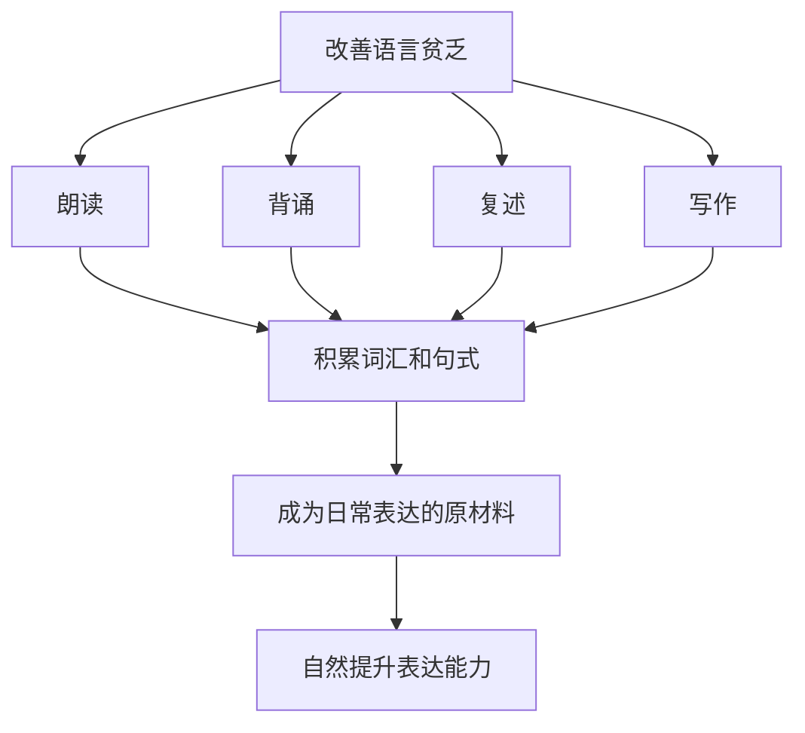

### 7.0 区分表达和背诵

在改善语言贫乏之前，先要搞清楚一个关键区别：**表达和背诵是两回事**。

- **背诵能力**：大脑并不参与创造。模式很简单——"输入→输出"，比如小时候不理解的情况下背古诗、背三字经。
- **表达能力**：大脑参与再次加工。模式是"输入→理解→重组→输出"，有一个先后的过程。

所以我们如果想发展自己的表达力，要尽量在理解的基础上去背诵，再重组输出。**死记硬背积累的是"仓库里的货"，理解后的表达才是"卖得出去的商品"**。下面介绍的朗读、背诵、复述、写作四种方法，都要在理解的基础上进行，而不是机械地重复。

### 7.1 为什么会语言贫乏

语言贫乏的核心原因是"输入不够、储备不足"。你能用的词汇和句式，取决于你积累了多少词汇和句式。如果平时不读书、不听高质量的内容、不练习表达，语言仓库里就是空的，到了需要表达的时候自然捉襟见肘。

最典型的表现就是：想夸一个人，除了"厉害""牛""好棒"想不出别的词；想描述一件事，来来回回就是"很好""非常好""特别好"这几个词。

### 7.2 四种积累方法

为什么主张朗读、背诵、复述和写作这些锻炼方法呢？因为这些方法可以积累丰富的词汇和句式，而这恰恰是我们表达的原材料。

**朗读**：多阅读、多看书、多朗读，从中积累相当数量的词汇和句式。朗读时要注意节奏和停顿，感受语言的韵律之美。建议每天朗读10-15分钟，可以选择优秀的散文、演讲稿或经典文章。

**背诵**：挑选一些经典的段落或金句进行背诵。背诵不是死记硬背，而是在理解的基础上记住那些精妙的表达方式。当你储备了足够多的经典表达，它们会在你需要的时候自然涌现。

**复述**：看完一篇文章或听完一段演讲后，用自己的话复述出来。复述训练的是"语言重组能力"——把别人的内容用你自己的方式表达出来，这个过程中你会不自觉地练习遣词造句。

**写作**：写作是最深度的语言练习。写日记、写读书笔记、写工作总结，都是锻炼语言能力的好方法。写作时你有充足的时间来斟酌用词、调整结构，这种慢节奏的练习会潜移默化地提升你的即时表达能力。

### 7.3 从积累到应用

| 积累方法 | 训练目标 | 难度 | 建议频率 |
|----------|----------|------|----------|
| 朗读 | 词汇和语感 | 低 | 每天15分钟 |
| 背诵 | 经典表达储备 | 中 | 每周背1段 |
| 复述 | 语言重组能力 | 中 | 每天1次 |
| 写作 | 深度语言组织 | 高 | 每周2-3次 |

语言材料就会成为我们日常的表达式，自然提升我们的表达能力。关键是要**从"被动积累"转变为"主动应用"**——当你在阅读中看到一个好的表达方式时，刻意在接下来的交流中使用它。用上三五次，它就真正变成你的了。

## 08.语言底蕴的积累

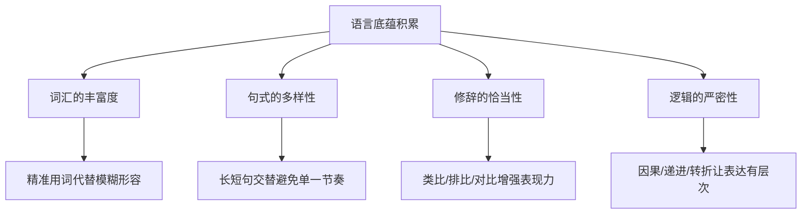

### 8.1 精准用词的力量

语言底蕴的第一个体现就是用词精准。同样是表达"累"，"疲惫不堪"和"精疲力竭"的程度不同，"心力交瘁"和"筋疲力尽"的侧重不同。精准的用词能让你的表达更加生动、准确。

在工作场景中，精准用词同样重要。"这个方案不太好"不如"这个方案在扩展性方面存在隐患"；"我觉得可以"不如"我认为这个方案在成本和效率之间达到了很好的平衡"。

### 8.2 修辞让表达更有力

好的修辞能让你的表达从"听得懂"升级到"记得住"。几种最实用的修辞手法：

**类比**：把抽象的概念用具体的事物来解释。"代码架构就像盖房子，地基不稳，楼盖得再漂亮也会塌。"

**对比**：通过反差来突出重点。"以前需要三天完成的工作，现在三个小时就搞定了。"

**排比**：通过结构相似的句子来增强气势。"我们不缺想法，缺的是执行；不缺方向，缺的是坚持；不缺能力，缺的是纪律。"

### 8.3 逻辑让表达更清晰

有底蕴的表达不仅词汇丰富、修辞得当，更重要的是逻辑清晰。逻辑是表达的骨架，没有逻辑的表达就像一盘散沙。

常用的表达逻辑结构：

- **总分总**：先说结论，再分点论述，最后总结。适合汇报和说服。
- **时间线**：按事情发展的先后顺序讲述。适合叙事和复盘。
- **因果链**：从原因讲到结果，或从结果追溯原因。适合分析和解释。
- **对比法**：先说A方案的优劣，再说B方案的优劣，最后给出建议。适合方案评估。

## 09.场景化语言训练

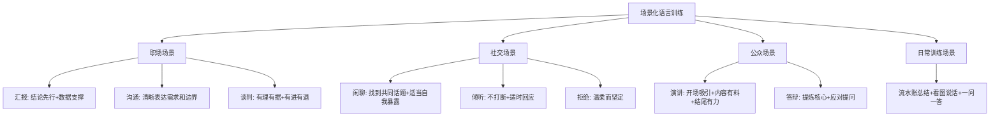

### 9.0 提高表达的三个要素

想要系统性地提高表达能力，需要具备三个核心要素：

**第一要素是底蕴**。你得是个脑子里有干货的人。脑子里没有货，想要提高表达能力很难。要做到脑子里有货，就得多学习、多读书——古今中外，文史经管哲等书都要读，做到博览群书。不仅要多读，而且要深读精读，读出味道来，真正吸收它，使自己有充足储备，厚实底蕴。

**第二要素是思维**。光脑子里有货，但茶壶里煮饺子倒不出来也不行。这就要有较强的思维能力，真正做到反应灵敏，对接迅速，脱口而出。平时要多琢磨问题，多进行辨析，多参加讨论和辩论，有意识地做思维体操来提高。

**第三要素是心理**。要有良好的心理素质，能够处变不惊，越激越兴奋。有的人会写不能说，有些人小范围可以大场合不行，有些人有准备可以即席不行，都是心理素质不够的表现。增强心理素质的办法只有一个——多实践，逼着自己主动找机会、找场合去表达。

### 9.1 职场语言训练

**汇报场景**：领导最怕的是听了半天不知道你要说什么。汇报时遵循"结论先行"原则：先用一句话说出核心结论，再用事实和数据来支撑。"本月销售额完成了目标的120%，主要原因有三个……"

**需求沟通场景**：和同事或合作方沟通需求时，要做到三个"清晰"：清晰地表达你要什么、清晰地说明为什么、清晰地定义完成标准。模糊的需求只会导致反复返工。

**给建议场景**：给别人提建议时，避免直接说"你这样不对"。可以用"我观察到……我的建议是……因为……"的结构，先说事实，再说建议，最后说原因。

### 9.2 社交语言训练

**闲聊场景**：闲聊的目的不是传递信息，而是建立关系。好的闲聊技巧包括：找到共同话题（最近的新闻、共同的爱好）、适当的自我暴露（分享自己的经历和感受）、真诚的好奇心（对对方的生活表现出兴趣）。

**倾听场景**：倾听不是沉默，而是"积极地不说话"。通过点头、"嗯嗯"、简短的回应来表示你在认真听，通过提问来表示你在认真理解。"然后呢？""你当时是怎么想的？"这些简单的追问比任何建议都更有价值。

### 9.3 公众语言训练

**即兴发言**：被突然点名发言是很多人的噩梦。应对方法是掌握一个万能结构："我有三点想法——第一……第二……第三……总的来说……"先用开头的那句话给自己争取思考时间，然后边说边组织后面的内容。

**自我介绍**：好的自我介绍不是念简历，而是用一个故事或一个标签让别人记住你。"大家好，我是XX，做了8年的后端开发，同事们都叫我'救火队长'，因为我最喜欢干的事就是排查疑难bug。"

### 9.4 日常表达训练方法

除了特定场景的训练，还有几种非常实用的日常训练方法，坚持下去对表达能力的提升帮助极大：

**每天总结流水账**：每天工作或学习之后，睡前回顾一天的事情，像流水账一样说得很详细。这个方法看似简单，但真的很有用——它训练的是你把零散的信息组织成连贯语言的能力。

**用照片看图说话**：比如你看到一张长城的图片，感觉那幅图片很恢宏。先确定你要表达的切入点——从建筑形态上来说，还是从历史文化上来说，还是世界古迹上来说，由你自己决定。然后围绕切入点，尽量说得具体、生动、有条理。

**三分钟提炼观点**：每天或每周，找一个相对冷僻的知识点或信息点，要做到理解和提炼，自己可以在三分钟内完全讲出来。比如某个历史故事、某道传统小吃的做法、某个技术产品的优劣势。

**对着镜子练习**：和别人说话有时候会紧张，和自己说不会紧张。把一个事情想透彻了之后，慢慢地表达出来，循序渐进，一定可以提高。

**复述别人讲的内容**：按照自己的理解，重述别人讲过的内容，并确认是否一致。如果不一致，双方核对信息是哪里出了偏差。一开始不一致会很常见，但这恰恰是最好的训练。

**找伙伴刻意练习**：找一个彼此信任、可以对等沟通的小伙伴，将自己学到的新东西、看书的感受分享给对方。建议每隔一段时间换一个不同背景的伙伴，因为长期沟通会存在理解默契，反而不利于锻炼表达能力。

## 10.今天起改变三点

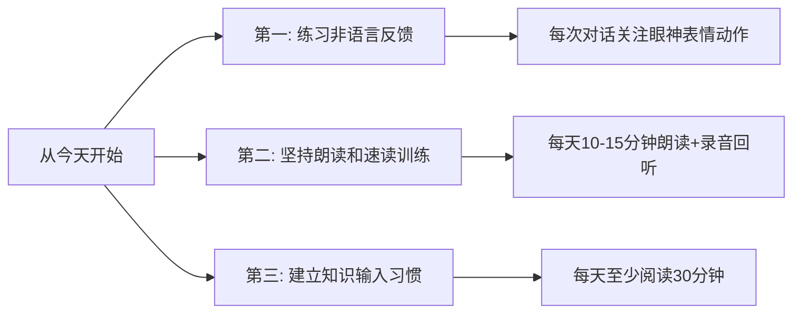

对于沟通，"说什么"和"怎么说"同样重要。怎么说，其实就是一种沟通技巧。

**第一，从今天起关注你的非语言反馈。** 在每一次和别人对话时，有意识地关注自己的眼神、表情和动作。和人说话时保持温和的眼神接触，面部放松带着微笑，双手自然打开而不是交叉在胸前。等待别人说完再回复，先提问确认再表达观点。一来一回，保护好每一次表达的意图。

**第二，坚持朗读和速读训练。** 每天花10-15分钟朗读一篇文章或演讲稿，先慢后快，注意发音准确、吐字清晰。用手机录下来回放听，找出自己的薄弱点，有针对性地改进。坚持一个月，你的口齿清晰度和语言流畅度一定会有明显提升。

**第三，建立每日阅读的习惯，打好思想基础。** 语言底蕴的提升没有捷径，核心就是"输入"。每天至少阅读30分钟，不限题材——技术书、散文、人物传记、历史故事都可以。读的时候留意那些让你觉得"说得真好"的段落，把它们记下来、朗读几遍、尝试用在你的日常表达中。积累的词汇和句式会逐渐转化为你的日常表达能力。

## 12.课后作业思考下

1. 对照"社交语言困难表现"的自我诊断表，评估一下自己在哪些方面存在不足，选择一个最想改进的点，制定一个为期一周的练习计划。

2. 选一篇你喜欢的散文或演讲稿，用速读法练习：先慢速朗读一遍，然后逐次加快，录下音来回放听，找出发音不准确或吐字不清晰的地方。

3. 回顾你最近一次让你印象深刻的对话（无论好坏），分析一下当时的"怎么说"——你的眼神、表情、动作、语气分别是怎样的？如果重来一次，你会在哪些非语言方面做出调整？

4. 从今天开始，每天记录一个你在阅读中看到的"好表达"，并在接下来一周内找机会用上它。一个月后回顾，看看你的"好表达"库积累了多少。

