# 6.3理解能力的锻炼
#### 目录介绍
- [01.什么是理解能力](#01什么是理解能力)
- [02.理解能力的层次](#02理解能力的层次)
- [03.听懂指令与信息](#03听懂指令与信息)
- [04.建立事物间联系](#04建立事物间联系)
- [05.学会精准地提问](#05学会精准地提问)
- [06.记忆复述的训练](#06记忆复述的训练)
- [07.带着疑惑去推测](#07带着疑惑去推测)
- [08.理解监测与反馈](#08理解监测与反馈)
- [09.锐化你的表达力](#09锐化你的表达力)
- [10.场景化理解训练](#10场景化理解训练)
- [11.今天起改变三点](#11今天起改变三点)
- [12.课后作业思考下](#12课后作业思考下)

## 01.什么是理解能力

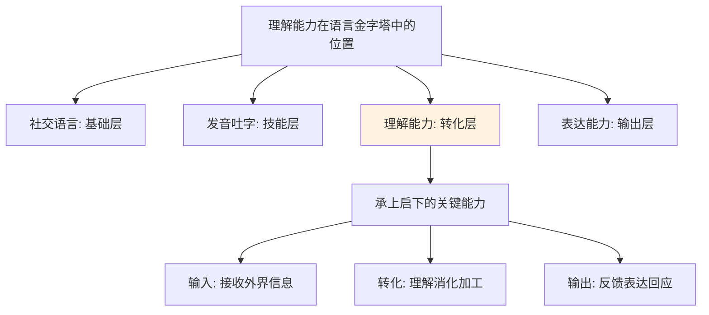

在语言发展的金字塔中，理解能力处于"承上启下"的核心位置。它连接着底层的社交语言、发音吐字，和顶层的表达能力。

我们都追求金字塔顶端的"表达能力"，但表达能力的前提是理解能力。如果没有理解能力，就无法将从外界接收到的信息（听到的话、读到的文字、看到的现象）转化为自己能消化的内容，更无法做出有效的回应和表达。

简单来说，理解能力就是**"输入→转化→输出"**这条链路中，最关键的"转化"环节。没有它，信息只是从耳朵进、从眼睛过，却没有真正进入大脑，也无法变成你自己的东西。

理解能力差的典型表现：
- 别人说了一大段话，你只记住了最后一句
- 读完一篇文章，说不清核心观点是什么
- 开会听了半天，回去却不知道下一步该做什么
- 别人话里有话，你总是后知后觉
- 看完一本书，无法用自己的话复述给别人

## 02.理解能力的层次

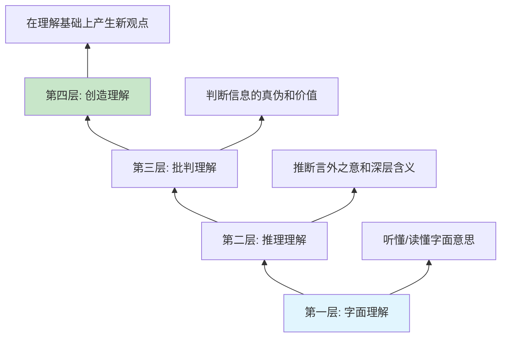

理解能力并非一成不变，而是有明确的层次划分。了解自己处于哪个层次，才能有针对性地提升。

| 层次 | 能力描述 | 核心动作 | 检验标准 |
|------|----------|----------|----------|
| **字面理解** | 听懂/读懂文字表面意思 | 逐字逐句接收 | 能复述原话 |
| **推理理解** | 理解言外之意、弦外之音 | 结合语境推断 | 能说出"他其实想表达什么" |
| **批判理解** | 判断信息的真伪和合理性 | 质疑、对比、验证 | 能指出逻辑漏洞或不同观点 |
| **创造理解** | 在理解基础上产生新的想法 | 联想、迁移、重构 | 能提出自己独到的见解 |

大多数人的理解能力停留在第一层"字面理解"，能听懂别人说了什么，但很难捕捉到深层含义。真正高效的沟通者，至少要达到第二层"推理理解"——不仅听懂对方说了什么，还要理解对方**为什么**这么说、**想要**什么。

举个例子：领导说"这个方案再想想"，字面理解是"让你再思考一下"，推理理解是"领导对方案不满意，希望你大幅调整"，批判理解是"领导可能有更好的思路但没直说，或者他自己也没想清楚"。

## 03.听懂指令与信息

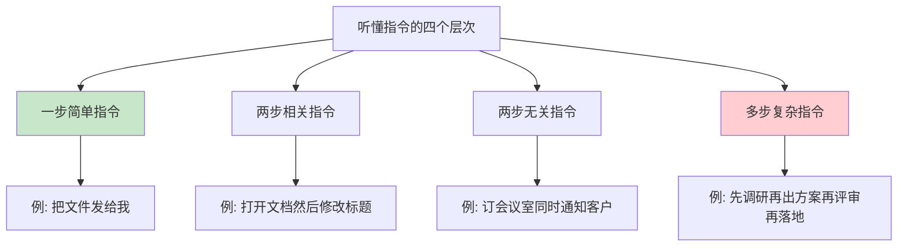

理解能力的第一步，是能够准确地听懂别人传达的信息和指令。这看起来简单，但在实际工作和生活中，"听不懂"或"听错了"是沟通失败的最大原因之一。

### 3.1 指令理解的四个层次

**一步简单指令**：只包含一个动作，比如"把文件发给我"。这是最基础的，大多数人都能做到。

**两步相关指令**：包含两个有逻辑关联的动作，比如"打开昨天的文档，然后把标题改一下"。两个动作之间有先后关系，理解难度稍大。

**两步无关指令**：包含两个没有逻辑关联的动作，比如"帮我订一下下午的会议室，另外通知一下客户明天的安排"。因为两件事之间没有关联，容易顾此失彼，漏掉其中一个。

**多步复杂指令**：包含多个步骤和条件的任务，比如"先做竞品调研，然后出方案初稿，下周三之前组织一次评审，根据反馈修改后本月底前落地"。这种复杂指令需要拆解、排序、记忆。

### 3.2 提升听懂能力的方法

**主动确认**：听完对方的话后，用自己的语言复述一遍，确认理解无误。"你的意思是……对吗？"这个简单的动作可以避免90%的理解偏差。

**抓关键词**：在接收信息时，重点捕捉"谁、什么事、什么时间、什么标准"这四个要素。把这四个问题回答清楚，基本不会理解出错。

**即时记录**：养成随手记录的习惯，尤其是面对多步复杂指令时。不要相信自己的记忆力，用笔记或清单把关键信息固定下来。

**分步拆解**：对于复杂指令，当场拆解为可执行的小步骤，确认每一步的具体要求和交付标准。

## 04.建立事物间联系

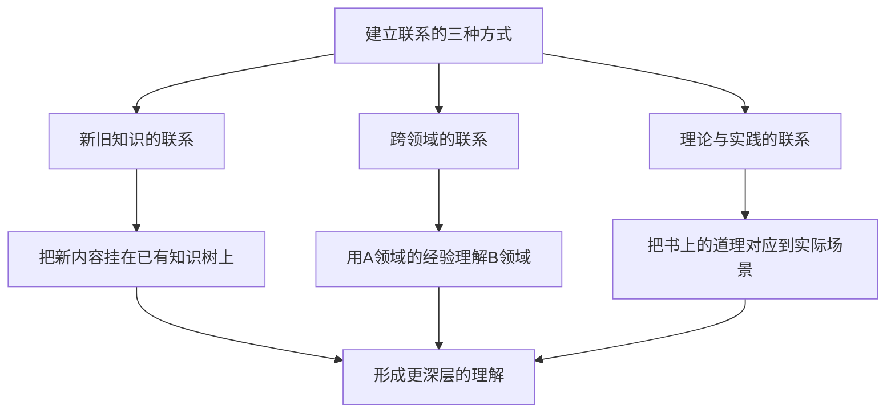

理解不是孤立地接收一个个信息碎片，而是要在信息之间建立联系。联系越多、越紧密，理解就越深刻，记忆也越持久。

### 4.1 新旧知识的联系

每当你学到一个新知识时，先问自己：这个跟我之前知道的什么有关系？

比如你在学习"非暴力沟通"时，如果你之前了解过"同理心"的概念，就可以把两者联系起来——非暴力沟通的核心就是同理心的具体操作方法。这样一来，新知识就不是孤立的，而是挂在了你已有的知识树上。

### 4.2 跨领域的联系

用一个领域的经验去理解另一个领域的事物，这叫做类比思维，也是建立联系的高级形式。

比如做软件架构和盖房子很像：地基就是底层框架，砖瓦就是业务模块，水电管道就是中间件和通信协议。通过这种跨领域的类比，你可以快速理解一个陌生领域的核心逻辑。

### 4.3 理论与实践的联系

读书时碰到一个理论或方法，立刻想一想：这个在我的工作和生活中对应什么场景？

比如读到"三明治沟通法"（先肯定、再建议、最后鼓励），想想自己上次给同事提反馈的场景，是不是直接就说了问题，没有先肯定对方？如果用三明治法，会不会效果更好？

这种从理论到实践的映射，既加深了理解，又为下次实际应用做好了准备。

## 05.学会精准地提问

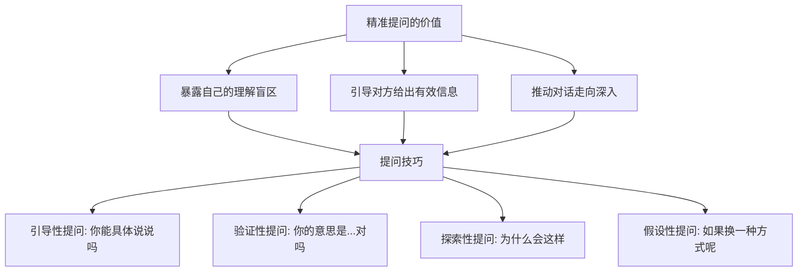

提问是理解能力的催化剂。不会提问的人，往往以为自己听懂了，实际上理解得一知半解；会提问的人，通过几个精准的问题，就能快速抓住核心。

### 5.1 提问的四种类型

**引导性提问**：用来获取更多细节。"你能具体说说这个环节是怎么操作的吗？""能举个例子吗？"这类问题让对方展开说明，帮你填补理解的空白。

**验证性提问**：用来确认自己的理解是否正确。"你的意思是我们先做A再做B，对吗？""也就是说，核心问题是预算不够，对吧？"这类问题避免理解偏差。

**探索性提问**：用来深入了解原因和逻辑。"为什么会选择这个方案？""背后的考量是什么？"这类问题帮你从表面深入到本质。

**假设性提问**：用来拓展思考维度。"如果换一种方式，效果会怎样？""假设资源不受限制，你会怎么做？"这类问题能打开新的思路。

### 5.2 提问的注意事项

好的提问应该做到：一次只问一个问题，避免连珠炮式发问；问题要具体，避免太宽泛（"你觉得怎么样"这种问题很难回答）；先听完对方的话再提问，不要打断；提问的语气要真诚，是为了理解而不是为了质疑。

一个实用的提问公式是："我理解到……（复述对方的话），但我对……（具体的点）还不太清楚，能再说说吗？"这个公式既表达了你在认真听，又精准地定位了不理解的地方。

## 06.记忆复述的训练

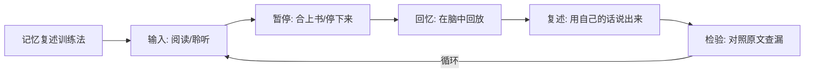

"记忆电影复述法"是训练理解能力的一个非常有效的方法。它的核心思路是：在接收完信息后，主动在大脑中"回放"一遍，然后用自己的语言复述出来。

### 6.1 为什么复述能提升理解

很多时候我们以为自己理解了，其实只是"眼睛看过了"或"耳朵听过了"。真正的理解需要经过大脑的主动加工。复述就是强制大脑进行加工的过程——你必须把零散的信息重新组织成有逻辑的语言输出，这个过程本身就是在深化理解。

如果你复述不出来，恰恰说明你对这部分内容的理解还有缺口。

### 6.2 复述的四个层次

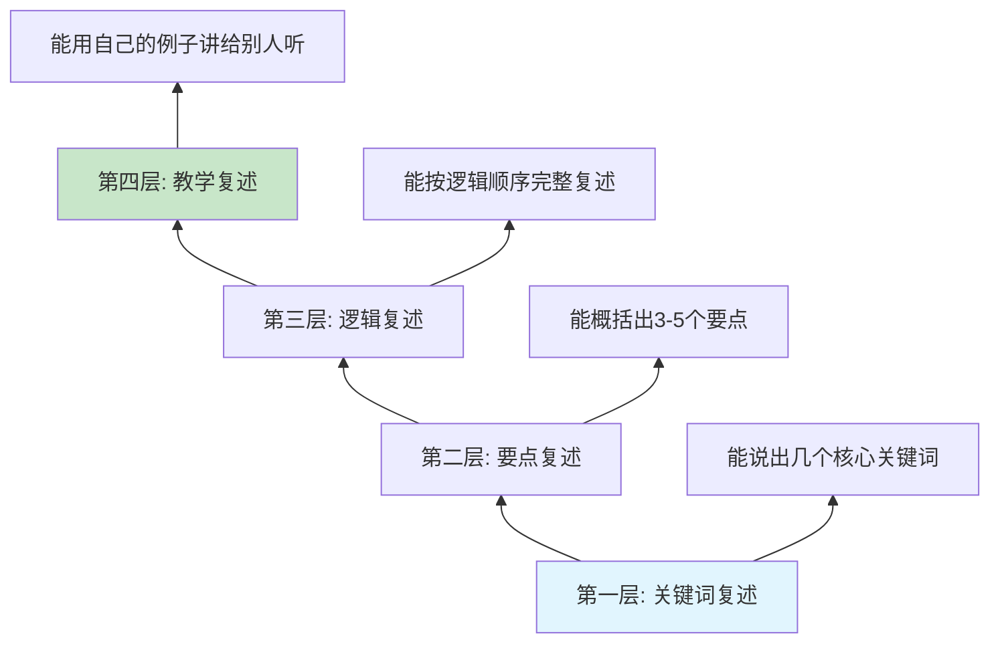

- **关键词复述**：读完/听完后，能说出几个核心关键词。这是最基础的层次。
- **要点复述**：能概括出3-5个要点，基本涵盖了主要内容。
- **逻辑复述**：能按照逻辑顺序完整复述，包括前因后果和各部分之间的关系。
- **教学复述**：能用自己的例子和语言，把内容讲给一个完全不了解的人听，并让对方理解。这是最高层次。

### 6.3 日常训练方法

**读书复述**：每读完一个章节，合上书，花3-5分钟用自己的话复述核心内容。发现说不清楚的地方再回去重读。

**会议复述**：每次开完会，立刻在笔记本上写下三个问题的答案：会议讨论了什么？达成了什么结论？我接下来需要做什么？

**对话复述**：和别人沟通完一件重要的事后，用一句话总结核心结论，发给对方确认。

**睡前复盘**：每天睡前花5分钟，回顾今天学到的最重要的一件事，尝试用自己的话复述出来。

## 07.带着疑惑去推测

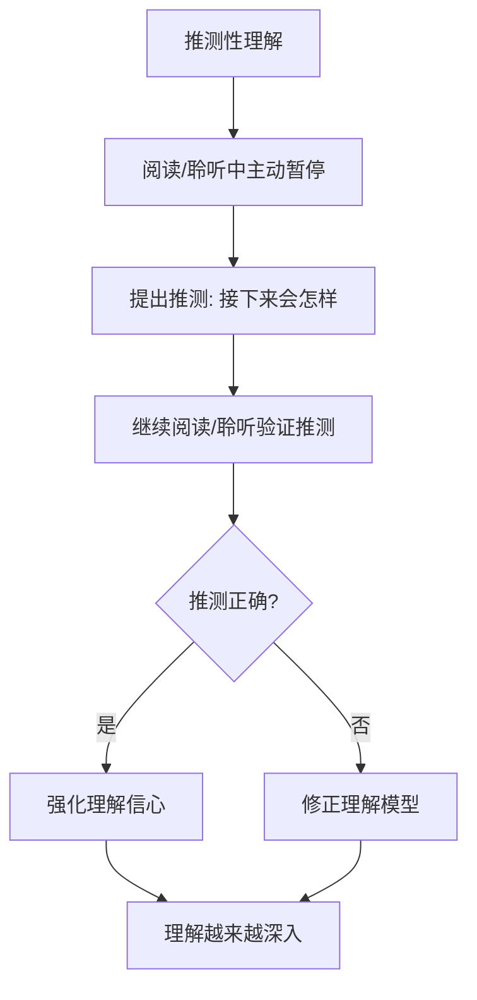

被动地接收信息和主动地理解信息，效果天差地别。推测就是让大脑从"被动接收模式"切换到"主动参与模式"的关键方法。

### 7.1 什么是推测性理解

在阅读一篇文章或听别人讲话的过程中，不要只是被动地接收，而是在关键节点主动停下来，预测接下来的内容。

比如你在读一篇关于项目管理的文章，读到"项目延期的三大原因"时，先暂停，在心里想：如果是我来写，三大原因会是什么？然后再继续读，对照作者的观点和自己的推测。

### 7.2 推测的好处

**提高专注度**：当你带着"我的推测对不对"这个悬念去阅读/聆听时，注意力会自然集中，不容易走神。

**加深理解**：推测正确说明你已经掌握了这个领域的基本逻辑；推测错误则暴露了你的认知盲区，这恰恰是最有价值的学习机会。

**锻炼思维**：推测的过程其实是在调用你已有的知识储备进行推理，这本身就是在训练逻辑思维和分析能力。

### 7.3 如何在工作中应用

**阅读报告前**：看到标题和目录后，先猜测每个章节可能讲什么，带着预期去阅读。

**开会前**：看到会议议程后，先推测每个议题可能的讨论方向和结论，开会时对照验证。

**与人沟通中**：当对方说到一半时，在心里推测他接下来要说什么、想要达成什么目的，然后验证。

**学习新技术时**：看到新技术的应用场景介绍后，先推测它的实现原理，再去看具体的技术方案。

## 08.理解监测与反馈

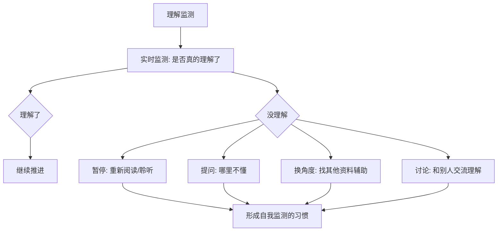

理解监测是一种"元认知"能力——对自己的理解过程进行监控和评估。简单来说，就是要养成一个习惯：不断地问自己"我真的理解了吗？"

### 8.1 为什么需要理解监测

很多人在学习或沟通时存在一个严重的问题：**以为自己理解了，其实并没有**。

你读完一篇文章觉得"嗯，讲得有道理"，但如果有人问你"这篇文章的核心观点是什么"，你可能答不上来。你听完领导的安排觉得"明白了"，但执行的时候才发现到处是模糊地带。

这就是缺乏理解监测的表现。你的大脑在"自动驾驶"模式下运行，信息从眼前飘过却没有真正进入大脑。

### 8.2 理解监测的方法

**信号灯法**：给自己设定三个信号灯——绿灯（完全理解，可以继续）、黄灯（大致理解但有些模糊）、红灯（完全不理解，需要停下来）。每读完一段或听完一个要点，给自己一个信号灯评估。

**费曼检验法**：尝试用最简单的语言把刚学到的内容解释给一个外行人。如果解释不清楚，说明自己还没有真正理解。

**提问检验法**：读完/听完后，问自己三个问题——"它讲了什么？""为什么这样？""我能用在哪里？"如果任何一个问题回答不了，就说明理解还有缺口。

### 8.3 没理解时怎么办

承认自己没理解，不是丢人的事，反而是负责任的表现。没理解时可以：
- **重新阅读/聆听**：回到没理解的地方再来一遍，换一个角度去理解
- **主动提问**：把不懂的地方精确地表达出来，向别人请教
- **查找辅助资料**：换一种解释方式，比如看视频、找图解、读其他作者的讲述
- **与他人讨论**：和同事或朋友聊聊这个话题，在交流中往往能获得新的理解角度

## 09.锐化你的表达力

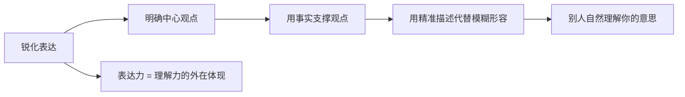

表达是理解的镜子——你能不能说清楚，本质上取决于你理解得够不够透彻。

### 9.1 观点与事实的配合

如果你说了一大堆，别人依然一头雾水，那就是说你的话没有明确的中心，不知所云。表达能力的强与弱，取决于你自己有没有清楚理解到你要表达的观点是什么。

"我今天过得很开心"是你的观点；"我今天去了游乐园，坐了过山车，吃了棉花糖"是你的事实。如果你没有事实的支撑，你就无法让别人真切地感受到你"很开心"这个心情。

### 9.2 精准描述的力量

你想跟别人描述一栋非常宏伟的建筑物，你只是说"这座建筑物很大、很高、很长"，别人也没有一个清晰的概念。

但如果你说"这座建筑物占地面积有五个足球场那么大，高度相当于80层楼，走路绕一圈也要二十分钟"，那么别人自然就明白到这个建筑物到底有多宏伟了。

精准描述的关键在于：用具体的数字、对比、类比来代替模糊的形容词。

### 9.3 结构化表达

有了观点和事实，还需要按照一定的结构组织表达：

**总分总结构**：先说结论，再说原因和论据，最后总结。适合汇报和沟通。

**PREP结构**：Point（观点）→ Reason（原因）→ Example（举例）→ Point（重申观点）。适合说服和建议。

**时间线结构**：按照事情发展的先后顺序讲述。适合叙事和复盘。

**对比法**：先说A方案的优劣，再说B方案的优劣，最后给出建议。适合方案评估。

### 9.4 顺叙和倒叙的运用

在日常表达中，有两种最基本的叙述方式值得熟练掌握：

**顺叙——按部就班讲清楚**。从头开始，一步一步娓娓道来，按照时间或空间的顺序来展开话题。比如你跟朋友说一件很开心的事，"这件事让你开心"就是你的观点，然后从起因、过程到结尾展开描述：首先什么什么，然后什么什么，接着什么什么，最后什么什么，一件事就表达完了。平时多写日记，把每天发生的事情记录下来，也可以提高顺叙的能力。

**倒叙——先说结果再讲原委**。倒叙跟顺叙差别不大，只是把结果提到前面作为开头来说。在日常生活中说话往往更容易用到倒叙，因为我们肯定会先表达结果。比如去旅游回来跟朋友说，第一句话肯定是"我前两天去了XX旅游，玩得好开心"，然后再详细阐述为什么开心。倒叙还是一种制造悬念、提高说话趣味的方式——"今天遇到一件很离奇的事"，朋友胃口自然被吊起来了。

### 9.5 让表达更清晰的四个技巧

**先说结论**：把最重要的结论或者问题抛给对方，然后再围绕结论做阐述和支撑。比如"我认为这件事应该这么办，我的理由有三点"。这样别人一下就知道你的意思，并且会带着结论听你的理由。

**不说无意义的话**：在会议、报告等注重解决问题的场合，"我听到这件事的时候感到紧张"等分享情绪的话没有意义。可以直接说"我认为这件事对公司会造成以下的影响"。

**找"踏脚石"**：如果内容比较难，先给听者铺几块"踏脚石"。不要一下把所有内容全部堆出来，而是循序渐进，先放入几个基础概念，帮助双方建立沟通的知识基础。

**做好规划**：时间越短暂，越要好好规划。如果你发言只有1分钟，不要把它看成一个60秒，而是看成三个20秒或四个15秒，规划每部分要说的内容。比如汇报工作时：第一个20秒说工作成果，第二个20秒说接下来的计划，第三个20秒说需要哪些支持。

开口之前，先在脑中快速过一遍：我的核心观点是什么？我用什么事实来支撑？我按什么结构来组织？想清楚这三点再开口，表达质量会大幅提升。

## 10.场景化理解训练

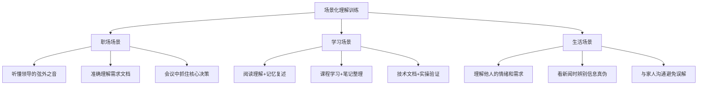

理解能力不是抽象的概念，它需要在具体的场景中不断训练和打磨。

### 10.1 职场场景训练

**听懂领导的弦外之音**：领导说"这个方案可以再优化一下"，可能意味着"方案问题不少，需要大改"。训练方法：每次和领导沟通后，写下"他说了什么"和"他可能真正想表达什么"，久而久之就能提升推理理解能力。

**准确理解需求文档**：拿到一份需求文档后，先用自己的话复述需求的核心目标，再列出你认为的关键约束和验收标准，然后和需求方确认。这个过程就是在训练理解力。

**会议中抓住核心决策**：开会时不要只是被动地听，而是时刻在心里追踪：现在讨论的核心问题是什么？已经达成了哪些共识？还有哪些分歧？最终的决策和我的待办是什么？

### 10.2 学习场景训练

**阅读理解**：用"记忆电影复述法"——读完一个章节后合上书，在脑中回放核心内容，然后尝试用自己的话复述。复述不出来的地方就是理解薄弱的环节。

**课程学习**：听完一节课后，不要急着听下一节，先花5分钟整理笔记，把刚才学到的内容用自己的框架重新组织一遍。

**技术文档**：看完一个技术方案后，动手实操一遍。实操过程中遇到的卡点，就是你理解不到位的地方。

### 10.3 生活场景训练

**理解他人的情绪**：当家人或朋友向你倾诉时，不要急于给建议，先尝试理解对方的情绪和需求。用"你是不是觉得……"这样的句式来确认自己的理解。

**辨别信息真伪**：看到一条新闻或消息时，不要立刻相信，问自己：信息来源可靠吗？论据充分吗？有没有其他角度的报道？这就是在训练批判理解能力。

**避免家庭误解**：很多家庭矛盾源于理解偏差。养成习惯，在做出反应之前先确认："你刚才说的意思是……对吗？"这个简单的动作能避免大量不必要的争吵。

## 11.今天起改变三点

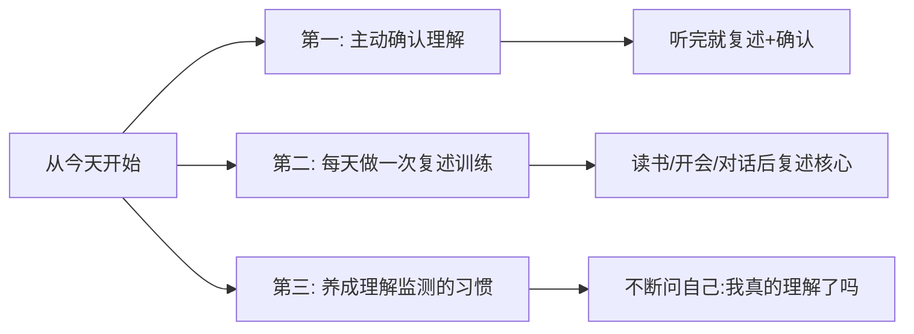

理解能力的提升不是一蹴而就的，但只要从今天开始刻意练习，日积月累一定能看到显著的变化。

**第一，养成主动确认的习惯。** 无论是听领导布置任务、和同事讨论方案、还是和朋友聊天，在对方说完后，用自己的语言简要复述一遍，然后问一句"我理解得对吗？"。这个习惯能帮你避免90%的理解偏差，也会让对方感受到你的认真和尊重。

**第二，每天至少做一次复述训练。** 读完一篇文章、听完一个播客、开完一个会，花3-5分钟用自己的话复述核心内容。一开始可能复述得很粗糙，坚持一个月后你会发现自己抓重点的能力有了明显提升。

**第三，养成理解监测的习惯。** 在学习和沟通过程中，不断问自己三个问题："它讲了什么？""为什么这样？""我能用在哪里？"如果任何一个回答不了，就停下来，用提问、重读或讨论的方式填补理解的缺口。不要让"以为自己理解了"成为你进步的绊脚石。

## 12.课后作业思考下

1. 回想你最近一次理解出错的场景（听错了话、做错了事、误解了意思），分析一下是哪个环节出了问题——是没听清指令？没建立联系？还是没有做理解监测？
2. 选一篇你感兴趣的文章，用"记忆电影复述法"阅读：读完后合上文章，用自己的话复述核心内容，然后对照原文看看遗漏了什么。
3. 在接下来一周的工作中，每次听完别人的安排或建议后，都用"你的意思是……对吗？"来确认理解，记录下确认后发现的理解偏差。
4. 找一个你认为自己已经掌握的知识点，尝试用最简单的语言向一个完全不了解的人解释清楚。如果解释不清楚，思考一下自己到底是哪里没理解透。

