# 6.4 沟通能力的演进
#### 目录介绍
- [01.我的一段真实经历](#01我的一段真实经历)
- [02.什么是沟通能力](#02什么是沟通能力)
- [03.高效倾听的模型](#03高效倾听的模型)
- [04.三明治的沟通法](#04三明治的沟通法)
- [05.别总封闭性问题](#05别总封闭性问题)
- [06.女性生气沟通法](#06女性生气沟通法)
- [07.非暴力沟通模型](#07非暴力沟通模型)
- [08.沟通中提问技巧](#08沟通中提问技巧)
- [09.螺旋推进沟通法](#09螺旋推进沟通法)
- [10.SOFTEN沟通六原则](#10soften沟通六原则)
- [11.场景化沟通训练](#11场景化沟通训练)
- [12.总结回顾这篇文章](#12总结回顾这篇文章)
- [13.我后来发生的改变](#13我后来发生的改变)
- [14.今天起改变三点](#14今天起改变三点)
- [15.课后作业思考下](#15课后作业思考下)

## 01.我的一段真实经历

### 1.1 一句"你怎么这么慢"，吵了三天冷战

那是一个周三晚上，我加班到 10 点回家，老婆在客厅坐着等我。我累得不想说话，进门换鞋。她看了看时间，说了一句："**你怎么每次都搞这么晚？是不是都不顾这个家？**"

我那时候火就上来了。我把电脑包往沙发一摔："**我加班是为了谁？我累一天回家还要被你审？你能不能先关心我累不累再说别的？**"

她"啪"地把手里的水杯放下，回卧室关门。我也赌气进了书房。**那一晚，到后面三天，我们没说一句话**。

### 1.2 三天后才搞明白吵的根本不是"加班"

第三天晚上她终于先开口，眼睛红红地说了一句让我愣住的话：**"我等你回来，是因为今天体检报告出来了，有点担心，我想跟你说说……我哪里在意你加班，我是想你了。"**

那一瞬间我脑袋"嗡"了一下。**我们吵了三天，吵的根本不是"加班晚不晚"——她要的是"我担心，你抱抱我"，我以为的是"她在指责我"**。

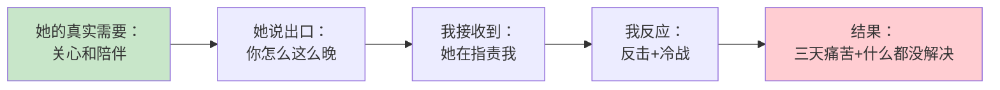

那晚我抱着她，第一次认真问自己：**我是个工科男，我每天写代码、搞架构、做技术评审都没问题，但为什么一到沟通就这么糟？**

后来我读了《非暴力沟通》《关键对话》《好好说话》，意识到一件事——**沟通不是技巧，是一套有迹可循的"系统"**。它不靠天赋，靠方法。这就是接下来要讲的整套系统。

## 02.什么是沟通能力

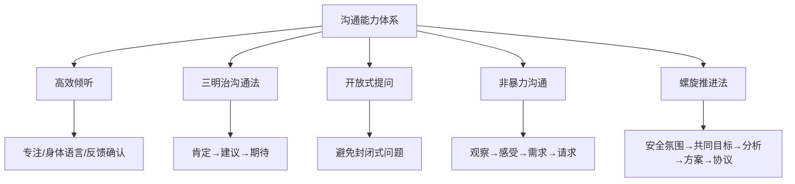

人类是社会动物，人与人、人与群体通过"沟通"传递信息和情感。沟通可以获取或传递信息和知识，也可以促成一致观点或协议，最重要的是有助于情感管理。

### 2.1 什么才算"沟通"

街头大妈们家长里短地唠嗑，能不能叫"沟通"？大学课堂上教授口若悬河、滔滔不绝地讲课，能不能叫沟通？

大妈聊天漫无目的，最多是"多向信息交流"，不是"沟通"；教授讲解虽有目的，但如果没有跟学生互动，那也不算是"沟通"。

什么是沟通呢？**沟通是"有目的的多向信息交流"**。沟通的方式一定是谈话吗？不是，能交流信息即可，不拘泥于形式。

### 2.2 沟通中常忘的两件事

在沟通过程中要时刻有意识地提醒自己：

- **沟通是有目的的**：你的初衷是什么？你现在的行为和言语有没有妨碍你完成你的初衷？
- **沟通是多向信息交流**：你有让对方了解到你的真实想法吗？你了解到对方的真实想法了吗？

## 03.高效倾听的模型

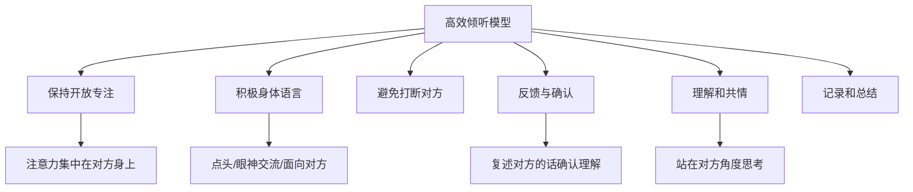

### 3.1 理解高效倾听

高效倾听模型是一种帮助人们提高倾听效果的框架或方法。在高效倾听模型中，倾听不仅仅是听到对方说话的内容，更是要理解对方所表达的情感、需求和意图。

高效倾听模型通常包括多个方面，例如注意对方的语气、语调和身体语言，以及积极回应和反馈。

### 3.2 应用高效倾听

高效倾听模型的应用是一个多层次、多方面的过程：

1. **保持开放和专注**：将注意力完全集中在对方身上。避免分心，比如看手机或想其他事情。
2. **使用积极的身体语言**：通过面向对方、点头表示理解、保持眼神交流等积极的身体语言，传达出对对方的尊重和关注。
3. **避免打断对方**：在倾听过程中，我们要尽量避免打断对方，即使我们不同意他们的观点或想表达自己的想法。
4. **反馈与确认**：可以通过复述对方的话、提出疑问或总结对方的观点来确认自己的理解是否正确。
5. **理解和共情**：努力理解对方的观点和感受，尝试站在他们的角度思考问题。
6. **记录和总结**：在倾听过程中，可以适当地记录关键信息或对方的观点，以便在沟通结束后进行总结和回顾。

## 04.三明治的沟通法

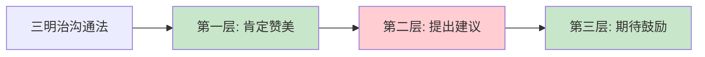

### 4.1 什么是三明治沟通

关于沟通，如何提出自己的要求和建议，"三明治"沟通法的核心是：把好的放在上下，把不好的夹在中间。当我们希望对方改变什么的时候，可以通过这样的方式来进行。

### 4.2 三明治沟通操作

大概做法：首先先认可对方好的一面，然后提出对方改变的地方，最后再表明对方改变之后更好的样子。

1. 首先：你这个人很好，很努力很漂亮很温柔。**这是肯定赞美她**。
2. 然后：但是，如果你能不能不熬夜到凌晨。**这是指出对对方的要求和希望**。
3. 最后：那你就真的十全十美啦。**这是最后的肯定**。

用"三明治沟通法"，先认同、赏识、肯定、关爱他的积极面，再加上鼓励、希望、信任她的有待完善的另一面。

### 4.3 不要一味地批评

一味的批评更容易让人产生抵抗的情绪。三明治沟通法把一味的批评和指责变成了站在对方角度思考问题，然后合理的提出期待。不仅不会挫伤对方的自尊和积极性，还能激活对方主动改变的效率。

## 05.别总封闭性问题

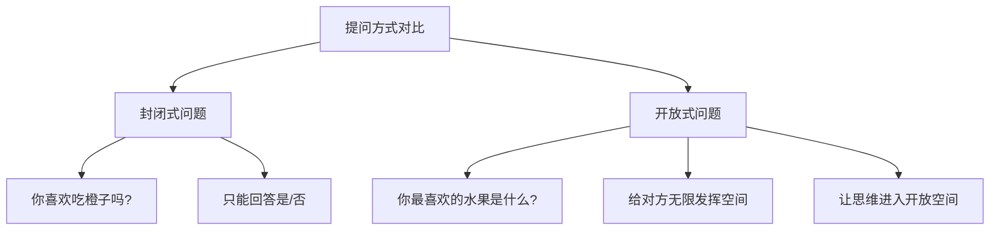

### 5.1 不要问封闭问题

聊天和沟通当中，很多时候我们问对方的问题，其实都是一个封闭的问题——就是在问题当中给了对方一个选择，让对方非此即彼，只能选择"是"或者"不是"。

比如，"你喜欢吃橙子吗？"这就是一个封闭性的话题。

### 5.2 开放性话题

开放性话题则是让对方主动说出来，而不是被动的选择，开放性话题让对方有更多表达的可能。

比如："看你去了那么多地方，你最喜欢的是哪里呀？" 这个问题就是一个开放性的问题，它更容易让对方说出自己最喜欢的地方，甚至说出喜欢的理由。

### 5.3 多用开放性话题

比如：你可能会问"你周末的时候会去健身吗？"。给对方两种选择，会或者不会。但是如果你换成"你周末休息的时候，一般最喜欢做什么呀？"，就给了对方发挥的空间。

在不知道对方最想说的话题是什么的时候，尽量用开放性话题去探索寻找，不要给对方限定范围，让他只能被动从当中选择。

## 06.女性生气沟通法

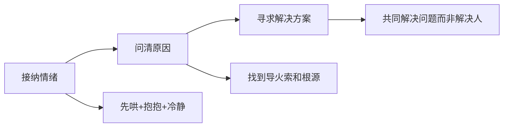

### 6.1 看一下背景

生气的理由有千万种，但吵架并不能解决问题，只是在宣泄情绪。所以，气头上的姑娘，你多说讲一句大道理都是火上浇油。

这时候她更多的是需要被哄，被道歉，被亲亲，被抱抱。

### 6.2 为何哄她无效

在女生生气的每一个瞬间，总有"正义使者"加身的男友，试图讲道理、分对错、明是非。

不证明是女友无理取闹不罢休，或者用男生理性思维想要弄清缘由，当场解决问题，结果当然是无效啦。

### 6.3 做到有效沟通

**第一步**：首先接纳她的情绪，并舒缓她的情绪。说白了就是先哄，给她一个抱抱，让她冷静下来。情绪上头真心不是解决问题的好时机。

**第二步**：其次问清生气的原因。任何矛盾都有导火索，等她冷静下来，愿意沟通时候，双方再好好沟通谈心。

**第三步**：最后才是寻求解决方案。问题摆在眼前，双方的共同目的就是怎么一起解决问题，而不是解决提出问题的人。

## 07.非暴力沟通模型

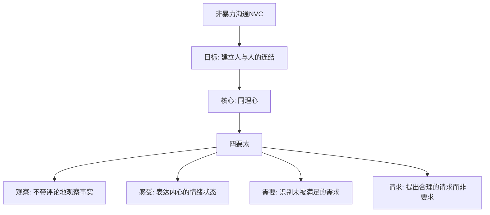

### 7.1 何为非暴力沟通

非暴力沟通（NVC）由美国心理学家马歇尔·卢森堡创立。其核心理念是，每个人都有基本的人类需求，而冲突和问题通常是由于这些需求没有得到满足而产生的。

非暴力沟通的四个要素包括：观察、感受、需求、请求。

### 7.2 非暴力沟通框架

整体上，非暴力沟通可以分成三个部分：

**问题域**：常见的"暴力沟通"——道德评判、推卸责任、做比较、要求。

**战略域**：目标（与人建立连结）、核心（同理心）、四要素（观察、感受、需要、请求）。

**战术域**：将非暴力沟通应用到六个场景，分成三类：面对自己、面对感受、面对矛盾。

### 7.3 保持同理心

同理心是非暴力沟通的核心。在倾听他人前，我们要清空先入为主的想法，全身心地聆听他人的观察、感受、需要和请求。

在他人感到真正被理解后，再来关注解决方案或者提出请求。

### 7.4 不带评论的观察

观察是眼睛看到的、耳朵听到的、嗅觉闻到的、触觉感觉到的；而评论是经过了内心对这些输入的二次加工。

如果我们去评论他人的时候，他人一般会产生抗拒的心理，所以想要与他人开始连结就需要去"不带评论的观察"。

### 7.5 感受、需要与请求

**感受**是一个人内心对事情的反应，更多是一种情绪状态。

**需要**是消极感受背后的根源——某个需要没有被满足。

**请求**与"要求"的区别：如果对方拒绝，请求不会对对方产生压力；要求则会让对方感觉到"不得不"的被动支持。

### 7.6 实战应用场景

**面对自己**：当自己犯错时，应该对自己进行"哀悼"和"自我宽恕"。

**表达感激与赞赏**：通过三个步骤组织——对方做了什么行动；我们有哪些需要被满足了；产生了什么愉悦感受。

**表达愤怒**：处理愤怒的策略——停下来深呼吸；辨识脑海的评判性想法；连结自己的需要；表达自己的感受和未被满足的需要。

**化解冲突**：先对双方进行同理（观察、感受），确保他们的痛苦能够被听到，然后在了解双方需要后再去制定策略。

## 08.沟通中提问技巧

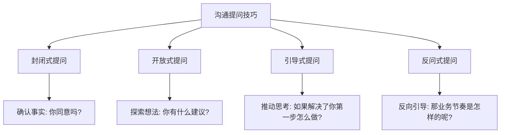

### 8.1 提问的四种方式

会提问的人通常都是沟通达人。一般来说，提问的方式有四种，不同的场合需要采用不同的提问方式：

- **封闭式**：你同意这个方案吗？我们能按期完成这个任务吗？适用于确认事实和快速决策。
- **开放式**：你有什么好的建议吗？适用于头脑风暴和探索性交流。
- **引导式**：如果资源的问题解决了，你第一步打算怎么做？适用于推动对方思考和行动。
- **反问式**：那业务的运营节奏是怎样的呢？适用于反向引导和深入了解。

### 8.2 互动探讨式对话

**提问不只是获取信息，更是一种表达训练**。在沟通中，"一问一答互探讨"是一种非常高效的对话模式。

这种方式有一个重要的前提：**不要把对话变成考试**。如果我们刻意地去"考"对方，常常得到的是拒绝和排斥。真正好的互动探讨，是双方都在自然的语境中，你一句我一句，彼此启发、彼此回应。

互动探讨的三个要点：第一，用好奇心代替考核心态；第二，给出自己的观点作为"引子"；第三，对对方的回答及时给予反馈和追问。

## 09.螺旋推进沟通法

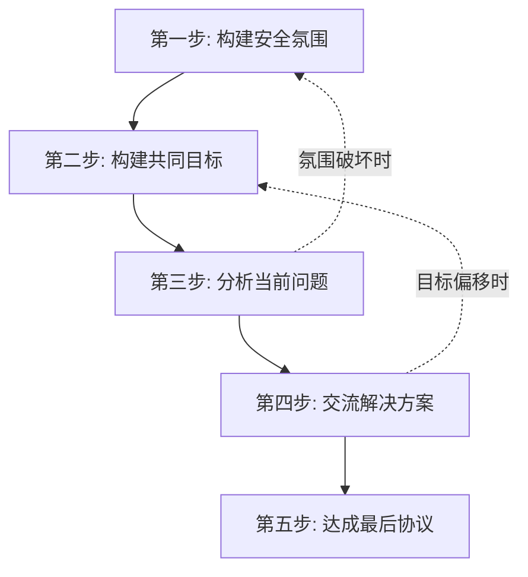

"螺旋推进"模型是一种非直线型、迂回推进的沟通模型。基础概念包括四个重要因素：安全氛围、监控器、共识线、情感线。

### 9.1 构建安全氛围

沟通前先确保双方心平气和，愿意敞开心扉。如果你有问题在先，对方很可能处于消极对抗状态，此时不要急着解释或埋怨，而是先让对方相信你很在意他的想法。

### 9.2 构建共同目标

让对方感觉到"你们有共同的目标，沟通成功对双方都有利"。要避免两个雷区：一是越过这步直接分析问题；二是让对方觉得你"只为达成自己的目的而来"。

如果措辞不当导致对话失去安全氛围，要退一步重新构建安全氛围——这就是"螺旋推进"的含义。

### 9.3 分析问题与方案

在问题和原因没有完全浮出水面时，不要急着讨论方案。

交流解决方案时，要带着"这是我的建议，希望得到反馈"的心态。永远不要陷入"二选一"陷阱，要坚信"第三种方案"能让大家都满意。

### 9.4 达成协议与沟通效果

达成协议后要充分尊重并带头执行，建立良好的信任关系。

从情绪体验和信息匹配的维度，沟通效果可划分为四个区域：
- **安慰区**：情绪好但共识度不高，互相"打哈哈"。
- **目标区**：情绪好且共识达成，是期望达到的状态。
- **破坏区**：没达成共识且场面不和谐，最糟糕的情形。
- **风险区**：共识达成但人际关系变差，难以齐心协作执行。

## 10.SOFTEN沟通六原则

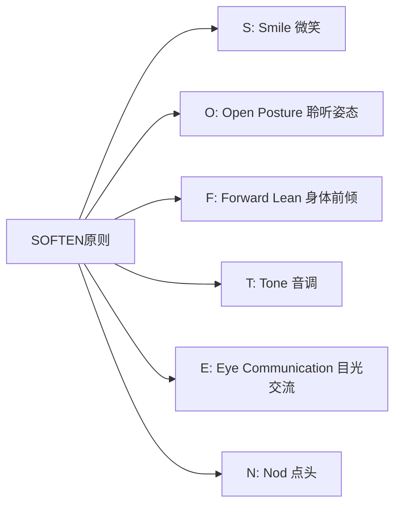

### 10.1 沟通的逻辑和情绪

沟通中，要想准确传达观点，有两个关键：逻辑和情绪。如果发现自己沟通缺乏逻辑，可以从"讲三点"这个简单的技巧入手。如果发现表达逻辑没问题但对方难以接受，那很可能是沟通过程中传递的情绪出了问题。

### 10.2 SOFTEN 六个字母

SOFTEN 沟通六原则就是解决沟通情绪问题的好方法：

- **S：Smile（微笑）**，保持微笑更容易获得他人的信任和好感。
- **O：Open Posture（聆听姿态）**，面对讲话人站直或端坐，让他认为你时刻在准备聆听。
- **F：Forward Lean（身体前倾）**，交谈中不时将身体前倾，表示你专心在听。
- **T：Tone（音调）**，谈到重要内容时，语速放慢、提高音调着重强调。
- **E：Eye Communication（目光交流）**，注视会让对方感受到你对谈话内容的重视。
- **N：Nod（点头）**，偶尔向对方点头，不只表示赞同，同时说明你认真地听了他的讲话。

SOFTEN 六个字母组成的单词意为"柔和"，这也正是它要传递的核心理念：让你的沟通姿态变得柔和。

## 11.场景化沟通训练

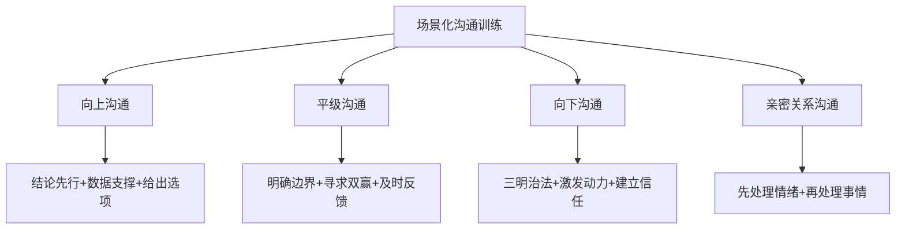

### 11.1 向上沟通

和领导沟通时，最重要的原则是"节省领导的时间"。具体做法：结论先行（先说结论再说原因）、数据说话（用事实和数据支撑你的观点）、给出选项（不要只提问题，要带着方案来——最好是 2-3 个方案供选择）。

### 11.2 平级沟通

和同事沟通时，最容易出现的问题是"边界模糊"和"目标不一致"。建议在沟通前先明确：这件事谁负责什么？标准是什么？时间节点是什么？沟通后用文字确认共识，避免后续扯皮。

### 11.3 亲密关系沟通

和伴侣、家人沟通时，情感的权重远大于信息的权重。记住"先处理情绪，再处理事情"这个原则。对方向你倾诉时，他/她要的不一定是解决方案，可能只是一个理解和陪伴。

## 12.总结回顾这篇文章

### 12.1 一句话核心

**沟通不是技巧，是一套"先听 → 共情 → 提问 → 回应"的系统**——把它做成习惯，技术男也能成为关系高手。

### 12.2 你应该带走的三件事

1. **先处理情绪，再处理事情**：尤其是亲密关系。情绪不通，事情就通不了。
2. **用观察代替评论，用请求代替要求**：非暴力沟通的最小可执行版本。
3. **结构化你的表达**：向上"结论先行+数据+选项"，向下"三明治+激发+信任"。

## 13.我后来发生的改变

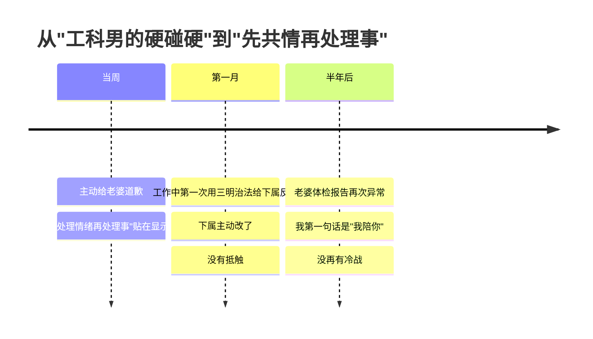

### 13.1 当周：把"五字真言"贴在显示器上

那次冷战和好之后，我做了三件事：

1. 主动给老婆道歉，**承认我把她的"求关心"听成了"在攻击"**
2. 在显示器右下角贴了五个字：**"先情绪，再事"**
3. 打开微信收藏夹，把买了很久没读的《非暴力�YZ通》《关键对话》翻出来——这次真的读完了

最让我意外的是，**老婆看到那张便利贴的时候哭了。她说："你愿意把这个贴在工位上，我就觉得你是真的想改"**。

### 13.2 第一月：工作里也用上了

一个月后我在带的实习生身上验证了这套方法。他写的代码有 5 处明显问题，**搁以前我会直接说"你这写的什么玩意儿"**。这次我憋住了，按三明治：

> "你的整体思路其实没问题，框架搭得挺清楚（**肯定**）。  
> 不过有 5 个地方我们一起看一下，可能可以优化（**建议**）。  
> 改完以后这个模块在团队里就能成为一个标杆 demo（**期待**）。"

实习生的反应让我惊讶——**他不仅没抵触，还主动多改了 3 处他自己发现的小问题**。比起以前一对一吵到半夜，效率高了 10 倍。

### 13.3 半年后：那一句"我陪你"

半年后老婆体检报告又有异常。她跟我说的那一刻我没有像以前那样立刻"理性分析"——我先抱了她，说了三个字：**"我陪你"**。

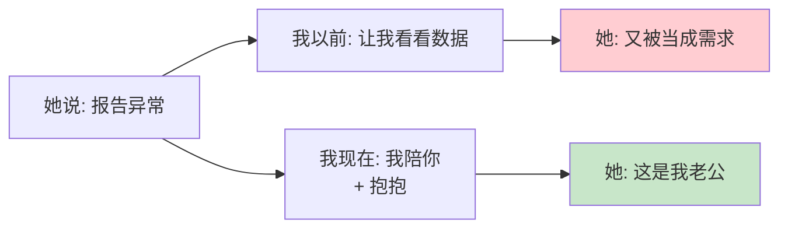

那次之后，我们家就再也没有冷战过。**不是说不再有矛盾，是矛盾出现时我们都知道——先处理情绪，再处理事**。这就是这套沟通系统对我家庭和职场的彻底重塑。

## 14.今天起改变三点

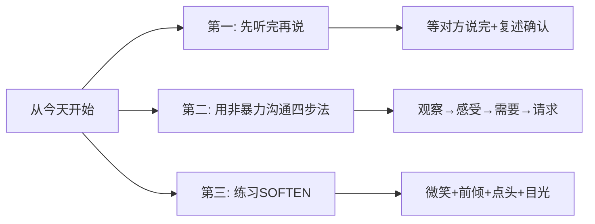

### 14.1 养成"先听完再说"的习惯

从今天开始，在任何沟通中，等对方说完之后再开口。不打断、不急于反驳。听完后先用一句话复述对方的核心意思："你说的是 XX 对吗？"确认理解正确后再表达自己的想法。

### 14.2 用非暴力沟通的四步法

不要说"你总是 XX"，而是说"当我看到 XX（**观察**），我感到 XX（**感受**），因为我需要 XX（**需要**），你能 XX 吗（**请求**）？"用这个结构来组织你的表达，对方会更容易接受。

### 14.3 刻意练习 SOFTEN 原则

在明天的每一次对话中，刻意练习 SOFTEN 原则。保持微笑，身体面向对方，适时前倾，用语调变化来强调重点，保持目光交流，不时点头回应。坚持一周后，你会发现别人对你的态度会有明显变化。

## 15.课后作业思考下

### 15.1 自检类作业

1. 回忆你最近一次沟通不顺利的经历，用非暴力沟通的四要素（观察、感受、需要、请求）重新组织一遍你的表达，看看效果是否会不同。

2. 用螺旋推进法的框架，模拟一次你即将进行的重要沟通（比如和领导谈升职、和合作方谈方案），把五个步骤写下来提前演练。

### 15.2 实践类作业

3. 在接下来一周内，每天选择一次沟通，刻意使用"三明治沟通法"来给出建议或反馈，记录对方的反应有何不同。

4. 找一位信任的朋友或同事，请他/她在和你沟通后给你反馈：你的倾听做得怎么样？有没有打断？有没有给出有效的回应？
