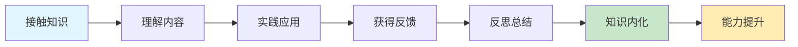
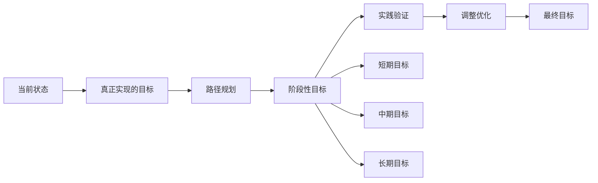
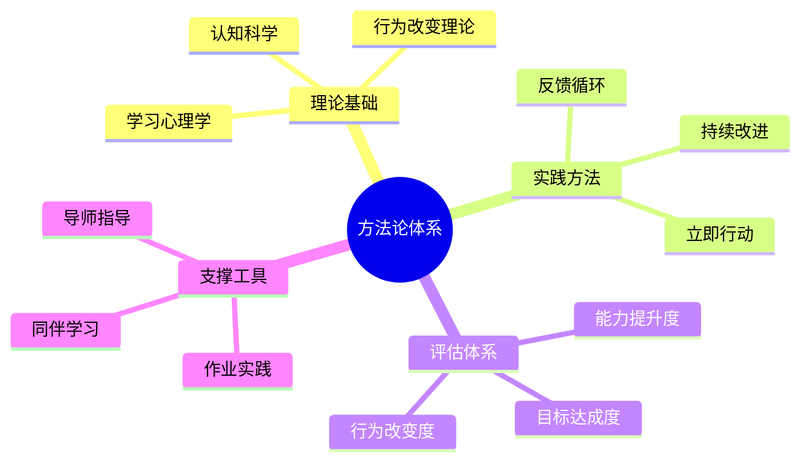
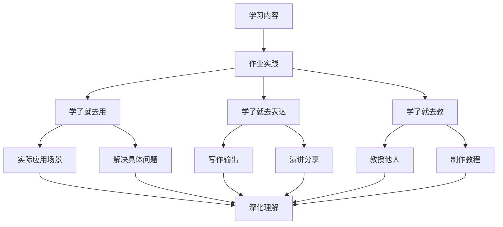
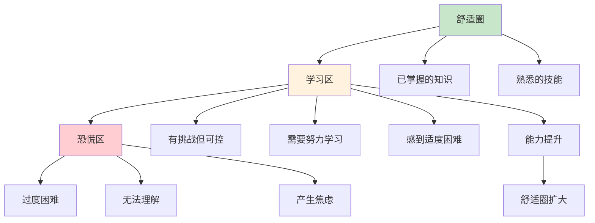
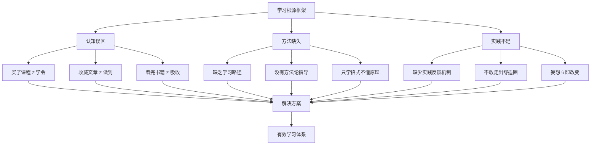
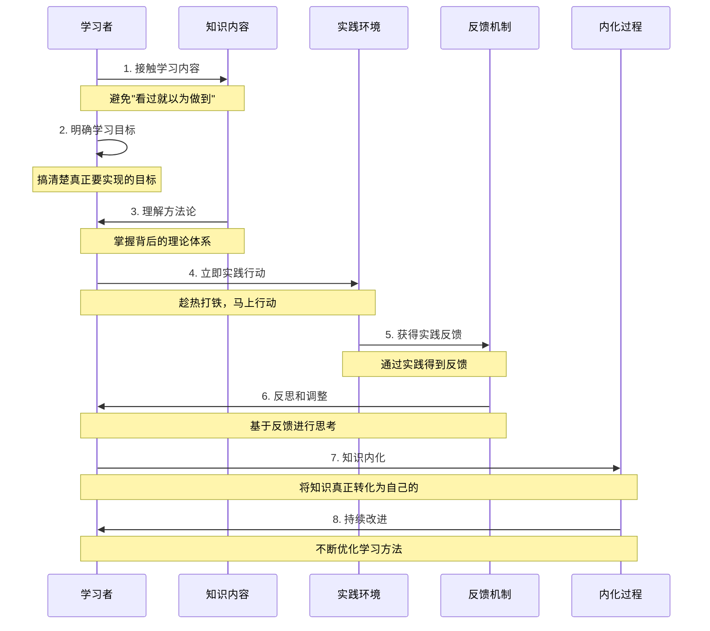
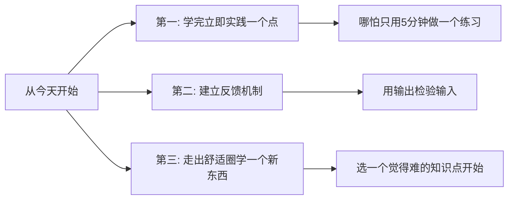

# 1.1书的序言和介绍
#### 目录介绍
- [1.看过就以为做到](#1看过就以为做到)
- [2.真正实现的目标](#2真正实现的目标)
- [3.方法论而非招数](#3方法论而非招数)
- [4.学习要趁热打铁](#4学习要趁热打铁)
- [5.布置作业要实践](#5布置作业要实践)
- [6.走出自己舒适圈](#6走出自己舒适圈)
- [7.不妄想立即改变](#7不妄想立即改变)
- [8.学习根源框架图](#8学习根源框架图)
- [9.今天起改变三点](#9今天起改变三点)
- [10.课后作业思考下](#10课后作业思考下)

## 学习的七大原则

1. **认知转变**：从"看过"到"做到"的思维转换
2. **目标明确**：设定真正可实现的学习目标
3. **方法论导向**：掌握背后的理论体系而非表面招式
4. **立即行动**：趁热打铁，避免拖延
5. **实践驱动**：通过作业和实践加深理解
6. **挑战自我**：主动走出舒适圈
7. **长期视角**：避免妄想立即改变的幻想

## 1.看过就以为做到

网络课程我买了。**但是买了课程不等于学会**。就像你以为学习课程懂了，但一实践或者讨论，又经不起推敲。

文章我都收藏了。**但是收藏不等于做到**。就像你学完的内容，这些知识还是别人的，不是你的。当学完后，这份学习的责任就递交给你了。

书籍我都看完了。**但是看完不等于吸收**。就像你读完的内容，如果不去思考和没有自己的见解或感受。当过段时间，许多知识点也就忘记了。

什么时候才会真正的内化？首先需要实践，并从中得到反馈，经过这样的一个过程，才能把知识真正地内化。**很多时候，缺少了实践反馈机制**。

如何帮助你学得更好，在进行这次课程准备的时候，曾问自己：现在不缺知识，不缺信息吧？答案是肯定的，每天新闻，书籍，博客等都是那么多。

为什么大家会花时间来学习这样一个系列课呢？后来我找到了答案——需要给大家更多的附加值。**这个附加值不应该只是知识，而是怎么更有效地学习和输出**。

- **学习认知误区**：揭示"看过就以为做到"的学习陷阱
- **目标导向学习**：明确真正可实现的学习目标
- **方法论体系**：构建系统性的学习方法论
- **实践驱动**：强调立即行动和实践反馈的重要性

知识内化的条件

## 2.真正实现的目标

很多时候学习东西，看到前方漆黑一片，你不知道自己走得对不对，不知道这么走下去到底有没有效果，会不会浪费时间。

所以，学习路径——真正可以实现的目标，就显得特别重要。一旦能够看到隧道尽头有那么一丝光，你就会告诉自己：“尽管辛苦，但会走到底，因为看到了那个目标。”

如果正好周围有一个火把，你就会觉得：“不是我一个人这么走，原来有那么多伙伴一起走！”你也会告诉自己：“我是对的，我会坚持走！”但是很多时候，我们缺乏这样一个火把。

所以，这是第一点想要分享给大家的：**大家要搞清楚真正要实现的目标是什么，这是让我们坚持下去的理由**。

## 3.方法论而非招数

要思考为什么要这么做，这背后支撑的理论体系是什么？如果你把这两个问题想透，我们每个人都可以掌握各种可变化的招式，来帮助自己更好地成长。

甚至这也能成为改变我们本身思维模式的契机。**很多时候我们焦虑、紧张，觉得好像学习没有效果，更多的是因为没有掌握方法论，只是在学简单的招式**。

方法论 vs 招数

| 维度 | 方法论 | 招数 |
|------|--------|------|
| **深度** | 理解背后原理 | 表面技巧 |
| **适用性** | 可变化应用 | 固定套路 |
| **持续性** | 长期有效 | 短期有效 |
| **思维影响** | 改变思维模式 | 局部改进 |

方法论构建框架

## 4.学习要趁热打铁

学完这一章，可以改变的事情是什么，从明天开始，马上、立刻行动起来，打铁要趁热。很多人学完后，说：“等我以后有空了再复习，先收藏。”

这样就没用了，因为记忆曲线马上就会下降。如果你立刻行动起来，立刻去实践，马上就会得到反馈；一有反馈，我们就会思考；有了思考，再回去重温，这时候知识就容易内化了。

"趁热打铁"原理

- **记忆曲线**：学习后立即实践防止遗忘
- **反馈循环**：实践→反馈→思考→重温→内化
- **行动导向**：从"收藏等待"转向"立即行动"

## 5.布置作业要实践

布置作业。一旦有了作业，就会督促我们更好地去思考、去反思。现在的慢，才是将来的快。

想一想读书的时候，为什么学习的知识点很熟悉，那是因为课前预习，课后演练，这样可以让学习的东西印象更加深刻。

那么作业一般怎么实践呢？**要么学了就去用；要么学了就去表达；要么学了就去教**。在实践的过程中，我们将对学习的知识点印象更加深刻。

## 6.走出自己舒适圈

学习的本质就是难的，因为只有发现难，你才会觉得离开了自己的舒适圈。如果不难，说来说去都是你懂的东西，那就是无效学习。

每一次觉得难时，你才知道，时间没白花。但不要怕，因为实践：通过方法论、立刻行动的要点、作业打卡、学习路径等，来帮助大家不断地去实践。不要怕学习难，就怕你没有开始的勇气。

## 7.不妄想立即改变

我们会学习很多课程，有些人花了钱购买了某课程，然后学习了一段时间发现没有多大的效果，于是便开始吐槽，后面导致许多人加入口水战之中。

不得不说，妄想通过一系列课程就改变生活本质的人，如果听听课程或者学习下就能获取成功或者有好结果，这简直就是幻想……

对于许多优质课程，大牛们提供的知识，或者理论分析工具，或者得出的结论，或者对未来作出的预测，那许多的东西都是经过加工，然后不断精细化的产物，倘若你不深入思考或者探索性学习，也是很难发生质变的。

存在的问题主要有：无法追查问题根源，信息与思维的时效性。重要的不是你看到或者听到了多少东西，重要的是你内化了多少东西。重要的是你把学到的东西内化成自己的，这个是学习的终极目标。

## 8.学习根源框架图

## 9.有效学习时序图

学习成长周期

```mermaid
gantt
    title 学习成长时间线
    dateFormat  X
    axisFormat %s
    
    section 初期阶段
    接触知识     :a1, 0, 1
    理解内容     :a2, after a1, 2
    
    section 实践阶段
    开始实践     :b1, after a2, 3
    获得反馈     :b2, after b1, 2
    调整方法     :b3, after b2, 1
    
    section 内化阶段
    深度思考     :c1, after b3, 4
    知识内化     :c2, after c1, 3
    能力提升     :c3, after c2, 2
    
    section 应用阶段
    熟练应用     :d1, after c3, 5
    创新发展     :d2, after d1, 3
```

## 9.今天起改变三点

**第一，学完任何内容后，立即实践其中一个点。** 不要说"等我有空再复习"，那基本等于不会再看。从今天起，每次学完一个知识点，立即花5分钟做一个小练习或写一段总结。哪怕只是用自己的话复述一遍核心观点，也比纯粹收藏有效100倍。

**第二，为自己建立一个反馈机制。** 最简单的反馈机制就是"输出"。学完一个东西，试着讲给别人听，或者写一段文字发到朋友圈、博客、笔记本上。如果你讲不清楚、写不出来，说明你还没真正理解。这个过程本身就是最好的反馈。

**第三，主动选择一个让你觉得"有点难"的知识点来学习。** 如果你学的东西都觉得很轻松，说明你一直在舒适圈里打转。真正的成长发生在"学习区"——那个让你觉得有挑战但又不至于完全懵的地方。今天就挑一个这样的知识点开始。

## 10.课后作业思考下

1. 审视你过去一个月的学习行为：你买了几门课程？收藏了几篇文章？其中真正实践过的有几个？算一下你的"学习转化率"（实践数/学习数），这个数字让你满意吗？
2. 用一句话写下你当前最重要的学习目标。如果写不出来，说明你的目标还不够明确——花15分钟认真想一想，然后写下来贴在桌面上。
3. 选择本章提到的七大原则中，你做得最差的一条，制定一个为期一周的改进计划。一周后回顾效果。
4. 找一个你最近学完但还没实践过的知识点，今天就用"学了就去用/就去表达/就去教"三种方式中的一种来实践它。

