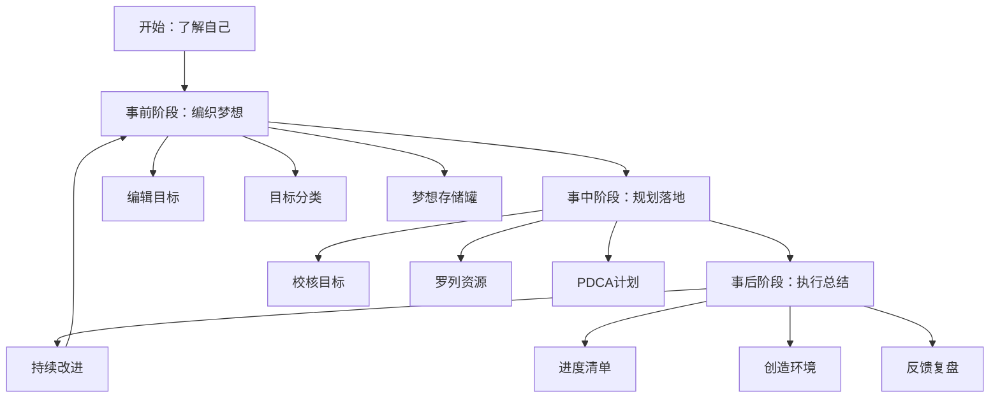
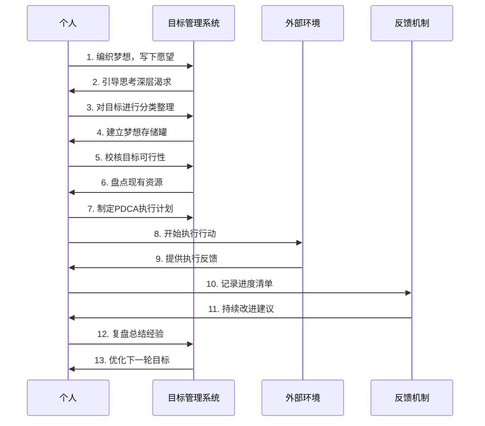
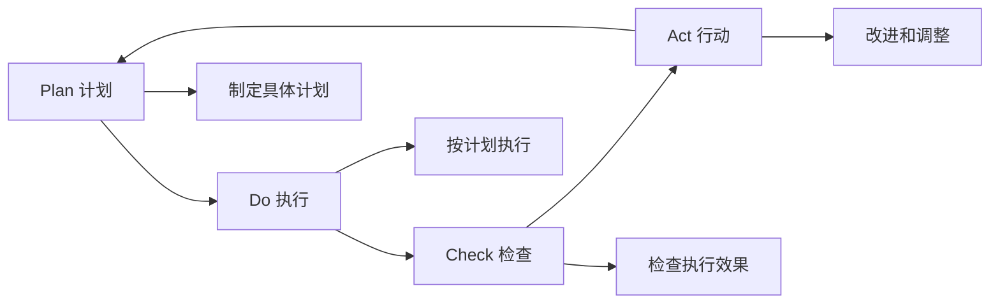
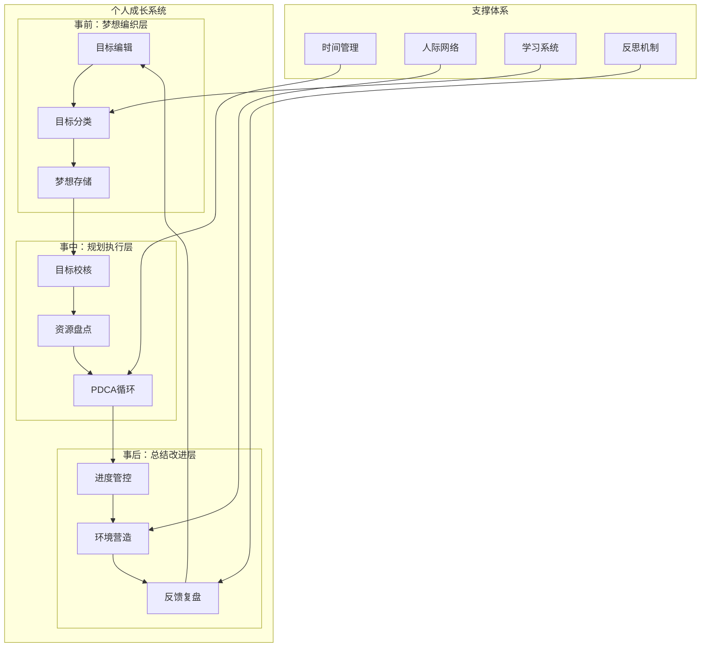

# 自我进阶练习：目标规划与实现体系梳理

## 文档概述

本文档梳理了一套完整的个人目标规划与实现体系，该体系分为三个主要阶段：**事前编织梦想**、**事中详细规划和落地**、**事后持续落实和总结**。

## 核心思想总结

### 整体框架

### 时序图：目标实现流程

## 各阶段核心思想详解

### 事前阶段：编织梦想

#### 1. 编辑目标 - 核心思想
- **本质**：通过深度自我探索，发现内心真正的渴求
- **方法**：无限制地写下所有想要的东西，然后通过7个引导问题深挖
- **价值**：为后续规划提供真实的动力源泉

#### 2. 目标分类 - 核心思想
- **本质**：平衡人生各个维度，避免单一发展
- **分类体系**：
  - 目标分类：健康、修养/知识、爱情/家庭、事业/财富、朋友、社会
  - 知识分类：了解、理解、熟悉、掌握
- **价值**：确保全面发展，建立学习优先级

#### 3. 梦想存储罐 - 核心思想
- **本质**：将抽象梦想具象化，建立持续提醒机制
- **关键要素**：设置时限、选择重点、明确理由
- **价值**：保持目标的可见性和紧迫感

### 事中阶段：规划落地

#### 4. 校核目标 - 核心思想
- **本质**：将欲望转化为可执行的具体目标
- **五大规则**：肯定语气、具体明确、可知完成、主动掌控、价值认可
- **价值**：确保目标的可操作性和现实性

#### 5. 罗列资源 - 核心思想
- **本质**：盘点现有条件，为目标实现做好准备
- **资源类型**：个性、人脉、财物、教育、时间、能力、技能等
- **价值**：明确起点，合理配置资源

#### 6. PDCA计划 - 核心思想
- **本质**：建立系统化的执行循环
- **四个环节**：计划(Plan)、执行(Do)、检查(Check)、行动(Act)
- **价值**：保证执行过程的可控性和持续改进

### 事后阶段：执行总结

#### 7. 进度清单 - 核心思想
- **本质**：建立可视化的进度管控机制
- **原则**：从结果倒推、包含当下可做的事、适度详细
- **价值**：保持执行的节奏感和成就感

#### 8. 创造环境 - 核心思想
- **本质**：构建有利于目标实现的外部条件
- **要素**：找到支持者、寻找榜样、营造物理环境
- **价值**：通过环境力量推动个人成长

#### 9. 反馈复盘 - 核心思想
- **本质**：通过反思实现持续改进
- **内容**：总结成功经验、分析失败原因、感谢支持者
- **价值**：将经验转化为智慧，为下一轮目标提供指导

## 系统架构图

## 关键成功要素

### 1. 心理层面
- **自我认知**：深度了解自己的真实需求
- **动机驱动**：找到充分的实现理由
- **持续性**：建立长期坚持的机制

### 2. 方法层面
- **系统性**：三阶段完整覆盖
- **具体性**：目标明确可执行
- **循环性**：持续改进优化

### 3. 执行层面
- **平衡性**：多维度均衡发展
- **渐进性**：从当下可做的开始
- **环境性**：营造支持性环境

## 实践建议

### 时间安排
- **初次完成**：建议一周内完成整个练习
- **持续维护**：每天查看愿望清单
- **定期复盘**：按月/季度/年度节奏进行

### 工具准备
- 纸笔（用于初始记录）
- 梦想存储罐（物理容器）
- 进度清单模板
- 复盘总结模板

### 注意事项
- 避免好高骛远，保持现实性
- 重视过程而非仅关注结果
- 建立支持网络，避免孤军奋战
- 保持耐心，允许渐进式改变

## 总结

这套目标规划与实现体系的核心价值在于：
1. **系统性**：提供了从梦想到实现的完整路径
2. **实用性**：每个步骤都有具体的操作方法
3. **持续性**：建立了自我改进的循环机制
4. **平衡性**：关注人生各个维度的协调发展

通过这套体系的实践，可以帮助个人建立清晰的人生方向，提高目标实现的成功率，最终实现个人的全面成长和进步。