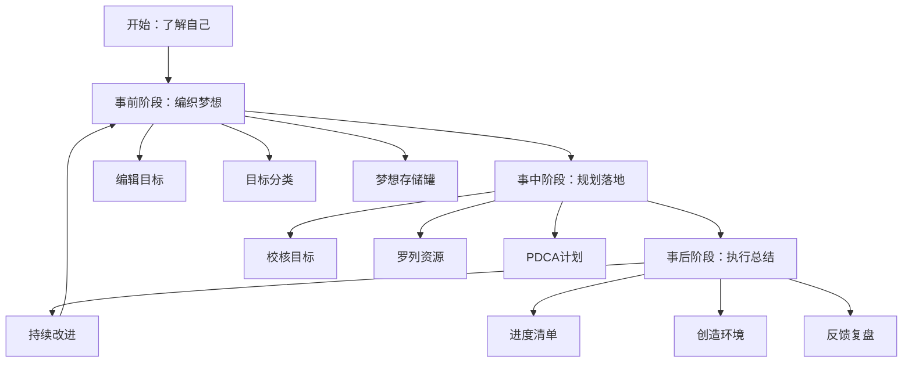
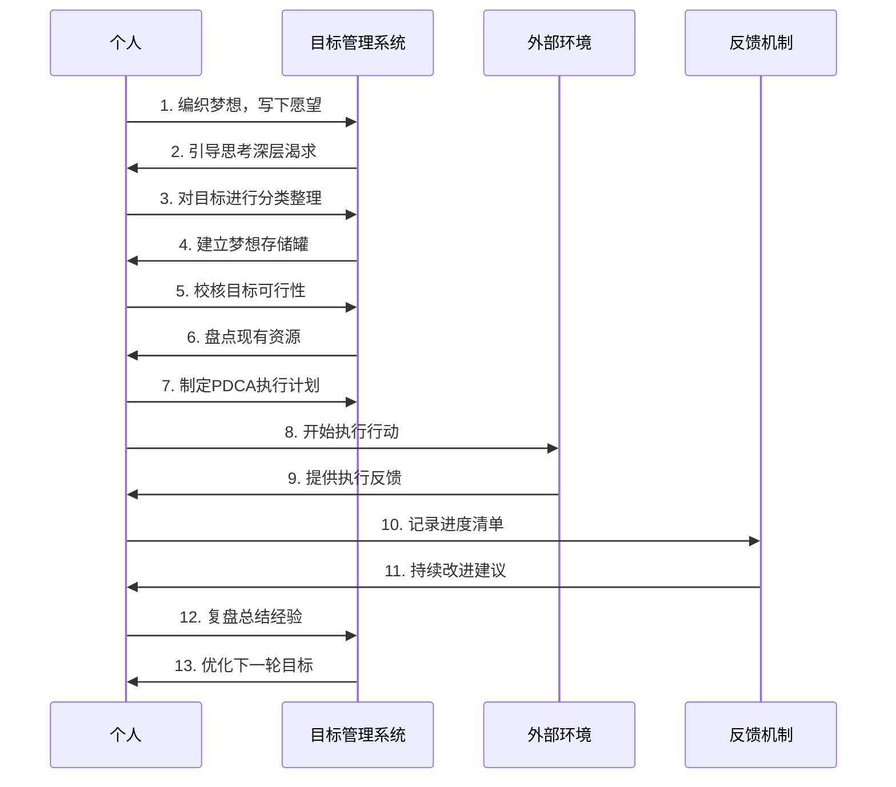

# 1.3一起来做个练习
#### 目录介绍
- 01.这是重要的练习
- 02.事前要编辑目标
- 03.事前对目标分类
- 04.事前梦想存储罐
- 05.事中要校核目标
- 06.事中罗列些资源
- 07.事中用PDCA计划
- 08.事后弄进度清单
- 09.事后创造好环境
- 10.事后反馈和复盘

## 01.这是重要的练习

首先了解自己，这是一个重要的练习，它能让你勇敢地去梦想，去了解自己。当我们不知我们要什么的时候，我们如何去要？所以，这个梦想规划的练习，是让我们去了解自己所要的，以及要如何去要。

让自己做个作业，建议找一个时间静静地坐下来，拿起你的纸与笔，一步一步来做。也许，你没有一次做完所有的步骤，没有关系，第二天再找一个时间，继续你未完的内心历程。

建议，在一周内完成这个练习。几周内，你的内心会越来越稳定而有方向感。因为你渐渐对自己的未来有了规划……

做了作业，还需要不断完善。然后经常拿起来看看，你会慢慢发现。你的眼光开始变得敏锐起来，你能在生活、工作、人际关系中快速地发现有助于自己目标实现的因素，并引为已用。

别人会开始注意到你的改变。几年内，你会发现自己的一些目标在一步一步变在现实。你在无形中，走到一个令自己与他人惊讶的高度。

这个作业从设想到执行，总体规划方案可以分为：**事前编织梦想——>事中详细规划和落地——>事后持续落实和总结**。

个人目标实现的流程如下：

## 02.事前要编辑目标

**开始编织美梦，包括你想拥有的，你想做的，你想成为的，你想体验的**。现在，请坐下来，拿一张纸和一支笔，动手写下你的心愿。

在写的时候，不必管那些目标该用什么方式去达成，就是尽量写。直到你觉得没有什么可以写的时候，你可以看看下面几个问题并回答它们，这些问题会引导你去了解自已内心深处的渴求，这会花上一些时间，但你现在的努力，将是为下一步丰盛的收获作下基础。

1. 1）在你生活中，你认为哪五件事情最有价值？ 
2. 2）在你的生活中，有哪三个最重要的目标？可以先罗列10个目标然后再依次去除！ 
3. 3）假如你只有六个月的生命，你会如何地运用这六个月？ 
4. 4）假如你立刻赚取了第一桶金，在哪些事情上，你的做法会和今天不一样？ 
5. 5）有哪些事是你一直想做，但却不敢尝试去做的？ 
6. 6）在生活中，有哪些活动，你觉得最重要的？ 
7. 7）假如你确定自己不会失败（拥有充实的时间、资源、能力等），你会敢于梦想哪一件事情？

## 03.事前对目标分类

回答完这些问题后，把你所列出的所有目标分成六个类，对学习知识分成四个类。

**目标分类的作用，主要是为了让自己平衡生活和工作，均衡发展。知识分类的作用，主要是为了自己，学习有个优先级**。

对目标分类：**1、健康；2、修养/知识；3、爱情/家庭；4、事业/财富；5、朋友；6、社会。**

对知识分类：**1、了解；2、理解；3、熟悉；4、掌握**。在学校时老师反复强调，如今工作多年慢慢有了点感悟。

## 04.事前梦想存储罐

写完10个愿望后，认真地把最重要的3项圈出来，然后，每天都把自己的自己写的愿望单子从头到尾看一遍，它会不断提醒你想要什么，你自然会在生活中密切关注可以帮助你实现这些愿望的机遇。

随便拿一个罐子，将梦想纸条放到罐子，把它作为梦想储蓄罐，值得注意的是，为最重要的那些愿望各准备一个罐子。当你实现一个梦想的时候就标记一下。

一定设置期限。审视自己所写的，预期希望达成的时限。你希望何时达成呢？有实现时限的才可能叫目标，没时限的只能叫梦想，没落实的只能叫空想。

选出在这一年里对你最重要的三个目标。从你所列出的目标里，选择你最愿意投入的、最令你雀跃欲试的、最能令你满足的三件事，并把他们写下来。

现在建议你明确地、扼要地、肯定地写下你实现它们的真正理由，告诉你自己能实现目标的把握和它们对你的重要性。

如果你做事知道如何找出充分的理由，那你就无所不能，因为追求目标的动机比目标本身更能激励我们。

## 05.事中要校核目标

想通过技术开发一年赚100万，这是欲望不是目标。虽然说设置目标要远大，但是一定要具体，不要吹牛逼。

因为你我大都是普通人……核对你所列的三个目标，是否与形成结果的五大规则相符。

1. 1）用肯定的语气来预期你的结果，说出你希望的而非不希望的； 
2. 2）结果要尽可能具体，还要明确订出完成的期限与项目； 
3. 3）事情完成时你要能知道完成了，可以用todo标注事项掌握进度； 
4. 4）要能抓住主动权，而非任人左右； 
5. 5）是否能够让自己得到价值认可。

## 06.事中罗列些资源

列出你已经拥有的各种重要资源。当你进行一个计划，就得知道该使用哪些工具。

列出一张你所拥有资源的清单，里面包括自己的个性、朋友、财物、教育背景、时限、能力、技能、以及其他。这份清单越详尽越好。

## 07.事中用PDCA计划

毕竟一开始目标或者远景，规划得再好，如果没有落地执行，那么也产出不了任何价值。

所谓 PDCA 执行法，就是把事情的执行过程分成四个环节：计划（Plan）、执行（Do）、检查（Check）和行动（Act），从而把控执行过程，保证具体事项高效高质地落地。

写下要达成目标本身所具有的条件。是坚持的毅力，还是好的方法，还是工具的优势，都写下来。

写下你不能马上达成目标的原因。首先你得从剖析自己的个性开始，是什么原因妨碍你的前进？要达成目标，你得采取什么做法呢？如果你不确定，可以想想有哪位成功者值得你去学习？

你得从最终的成就倒算，记得大学学机械时，有门课程叫做逆向工程，当时不太懂，现在有点顿悟呢。就是先有结果然后逆向推导。往你目前的地位一步步列出所需的做法。

## 08.事后弄进度清单

现在请你针对自己那三个重要目标，制订出实现它们的每一步骤。别忘了，从你的目标往回订步骤，并且自问，我第一步该如何做，才会成功？是什么妨碍了我，我该如何改变自己呢？

一定要记得你的计划得包含今天你可以做的，千万不要好高鹜远和吹牛逼。同时，如果某一天卡住了，可以选择跳过进入下一个目标。过段时间再去看卡点和解决。

进度清单，不要太过于详细，我理解为就是掌控一个全局进度的清单，写好每一个阶段做的事情即可，每次完成一个节奏勾选一下。因为我试过，每周弄清单那种实在太累了，调整成月，季度，年这个节奏会好一点。

## 09.事后创造好环境

有时候，总有些烦心的事情，或者遇到了某坎，不想坚持想躺平了。怎么办？那就找到几个好朋友，相互激烈地讨论，有几个就好。

为自己找一些值得效法的模范。从你周围或从名人当中找出三位在你目标领域中有杰出成就的人。

在你做完这件事，请你阖上眼睛想一想，仿佛他们每一个人都会提供你一些能达成目标的建议，记下他们每一位建议的方法，如同他们与你私谈一样。

为自己创造一个适当的环境。零碎的时间可以学习零碎的知识，版块的时间可以学习比较系统的知识，如果自己比较受环境影响，那就去图书馆。

我刚开始就是去首图图书馆，不管多烦，一去了就心静下来了。

当自己做完这一切，回顾过去，有那些你所列的资源会运用得很纯熟。回顾过去找出你认为最成功的两三次经验，好好想想。

仔细想想是做了什么特别的事，才造成事业、健康、财务、人际关系方面的成功，请记下这个特别的原因。

## 10.事后反馈和复盘

经常反省所做的结果，一定要经常反省，这个反省针对自己做的好的要继续坚持，如果不好的那就要反省自己那些做的不好。每个阶段对结果要有总结，这种总结最好形成模板。

列一张表，写下过去曾是你目标而目前已实现的一些事。你要从其中看看自己学到了些什么，这期间有哪些值得感谢的人，你有哪些特别的成就。

有许多人常常只看到未来，却不知珍惜和善用已经拥用的。

有时候，事情没做好，进度没坚持下来。一定要懂得一点复盘的常识，复盘在于认识自己，来源于围棋事后的反思。这样可以更加精进。复盘可以形成自己模板。

