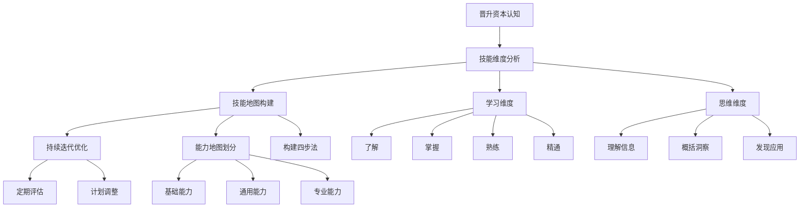
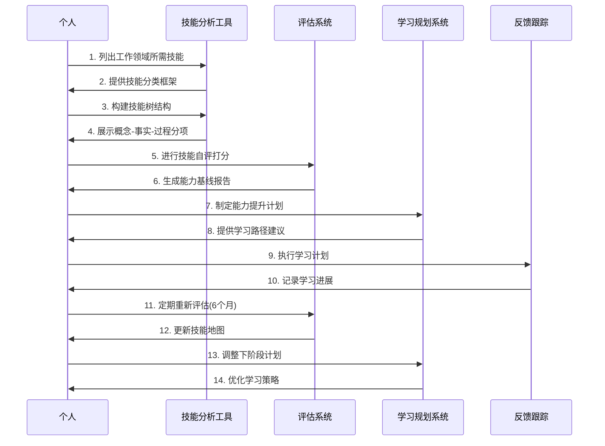
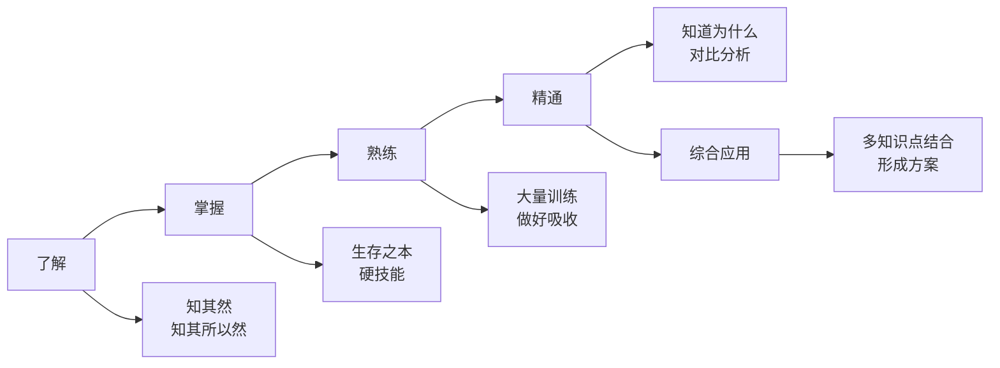
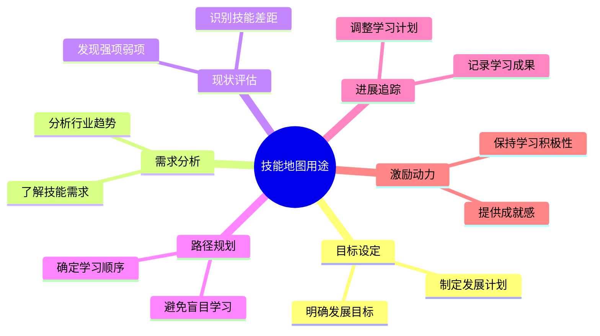
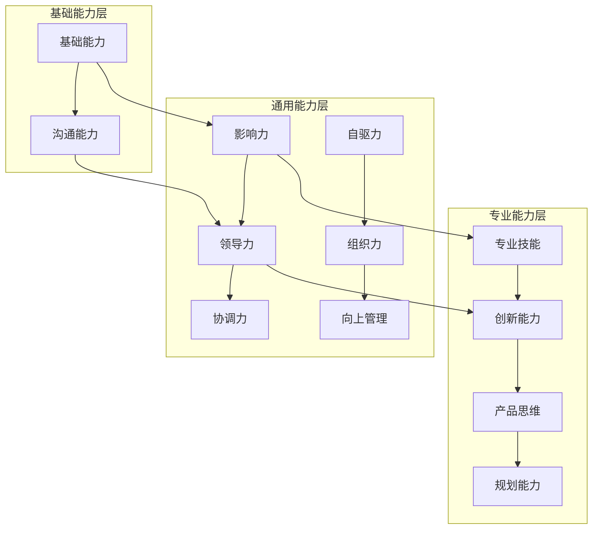
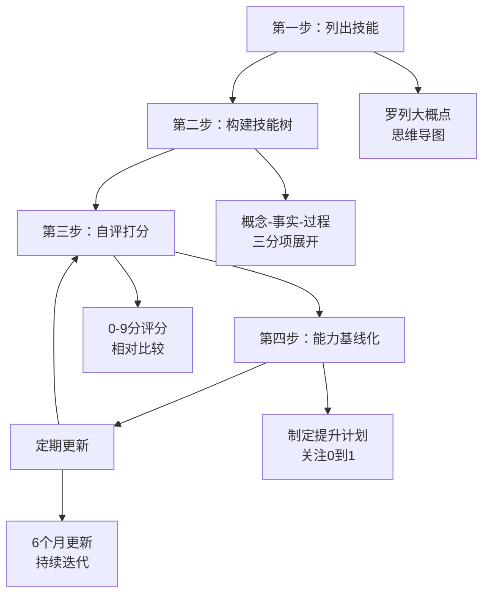
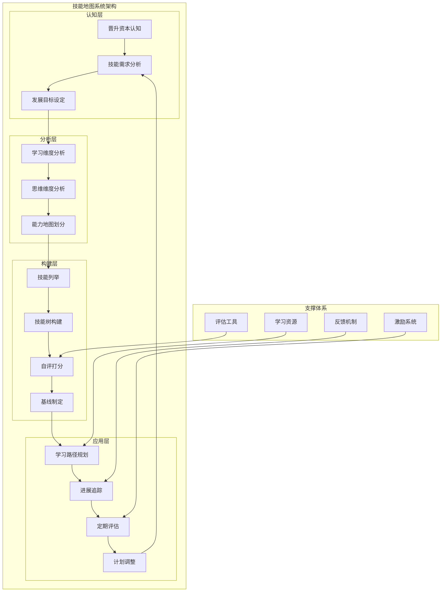

# 技能地图构建与应用体系梳理

## 文档概述

本文档梳理了一套完整的个人技能地图构建与应用体系，旨在帮助个人明确晋升资本、系统规划技能发展、评估现状并制定针对性的提升计划。

## 核心思想总结

### 整体框架



### 技能地图构建时序图



## 各部分核心思想详解

### 1. 晋升资本认知 - 核心思想
- **本质**：明确个人发展的根本依据
- **关键问题**：凭什么达到目标？资本是什么？
- **价值**：建立基于能力的职业发展观
- **痛点解决**：
  - 工作缺乏系统认识
  - 不知道学什么、补什么
  - 学习与实践脱节
  - 知识归类和目标不明确

### 2. 技能学习维度 - 核心思想

#### 四个掌握程度


- **了解**：达到知其然，最好知其所以然
- **掌握**：生存之本的硬技能，可动态加深
- **熟练**：通过大量训练，真正吸收知识
- **精通**：知道为什么，能对比分析优缺点
- **综合应用**：结合多个知识点，形成完整方案

### 3. 技能思维维度 - 核心思想

#### 三个思维层次
```mermaid
pyramid
    title 技能思维金字塔
    "发现应用" : 25
    "概括洞察" : 35  
    "理解信息" : 40
```

- **理解信息**：比较、对比、解释、分类
- **概括洞察**：消化、领会、见解
- **发现应用**：创造、预测、判断、评价

### 4. 技能地图用途 - 核心思想

#### 六大核心用途


### 5. 能力地图划分 - 核心思想

#### 三层能力结构


**基础能力**：
- 基础能力：项目把控、技术掌握、项目拆解
- 沟通能力：跨团队协调、风险控制

**通用能力**：
- 影响力：部门级影响、技术认可
- 领导力：风险管理、资源协调
- 协调力：跨团队协调、计划制定
- 自驱力：自我管理、持续优化
- 组织力：团队凝聚、提高产出
- 向上管理：沟通反馈、信息透传

**专业能力**：
- 专业技能：技术规划、深度理解
- 创新能力：技术决策、业务促进
- 产品思维：需求理解、技术影响力
- 规划能力：业务规划、技术解决

### 6. 技能地图构建四步法 - 核心思想

#### 构建流程图


#### 详细步骤说明

**第一步：列出技能**
- 方法：思维导图罗列
- 内容：概念、事实、过程
- 目标：全面覆盖工作领域

**第二步：构建技能树**
- 概念：任何需要理解的内容
- 事实：任何需要记忆的内容  
- 过程：任何需要练习的内容

**第三步：自评打分**
- 0分：不具备该项能力
- 1分：具备基本能力
- 2分：完全具备能力
- 3分：专家级，可指导他人

**第四步：能力基线化**
- 建立能力基线
- 制定提升计划
- 关注0到1的突破

## 系统架构图



## 关键成功要素

### 1. 系统性思维
- **全面性**：覆盖基础、通用、专业三层能力
- **结构性**：按概念-事实-过程分类
- **层次性**：从了解到精通的递进关系

### 2. 动态管理
- **定期更新**：6个月一次评估调整
- **持续迭代**：长期主义的完善过程
- **灵活调整**：基于现实需要动态优化

### 3. 实用导向
- **问题导向**：解决学什么、怎么评估的痛点
- **目标导向**：基于职业发展需要制定计划
- **结果导向**：关注能力提升的实际效果

## 实践建议

### 构建阶段
1. **准备工作**：收集行业技能要求、分析岗位需求
2. **工具选择**：使用思维导图工具进行可视化
3. **团队协作**：可邀请同事、导师参与评估

### 应用阶段
1. **学习规划**：基于技能地图制定学习计划
2. **资源配置**：合理分配时间和精力
3. **实践验证**：在实际工作中验证技能掌握程度

### 维护阶段
1. **定期评估**：建立固定的评估周期
2. **及时调整**：根据行业变化更新技能要求
3. **经验总结**：记录学习心得和最佳实践

## 注意事项

### 避免的误区
1. **单纯收集**：避免只收集数据不分析应用
2. **静态管理**：避免一次构建后不再更新
3. **脱离实际**：避免技能地图与工作需求脱节

### 关键原则
1. **二八定律**：重点关注最重要的20%技能
2. **0到1突破**：特别关注从无到有的技能获得
3. **长期主义**：将技能地图作为长期发展工具

## 总结

技能地图构建与应用体系的核心价值在于：

1. **系统化**：提供了完整的技能分析和规划框架
2. **可视化**：通过图形化方式直观展示技能结构
3. **可量化**：建立了明确的评估标准和进展追踪
4. **可操作**：提供了具体的构建步骤和应用方法
5. **可持续**：建立了动态更新和持续改进机制

通过这套体系的实践，可以帮助个人：
- 明确职业发展的核心竞争力
- 建立系统化的学习规划
- 实现有针对性的能力提升
- 保持与行业发展同步的技能水平

最终实现从"不知道学什么"到"有计划地成长"的转变，为个人职业发展提供坚实的技能基础。