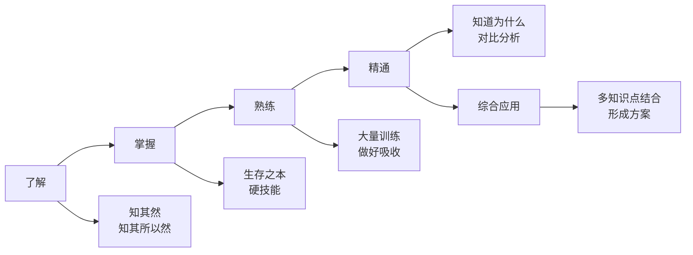
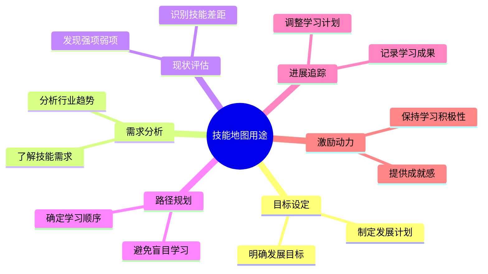
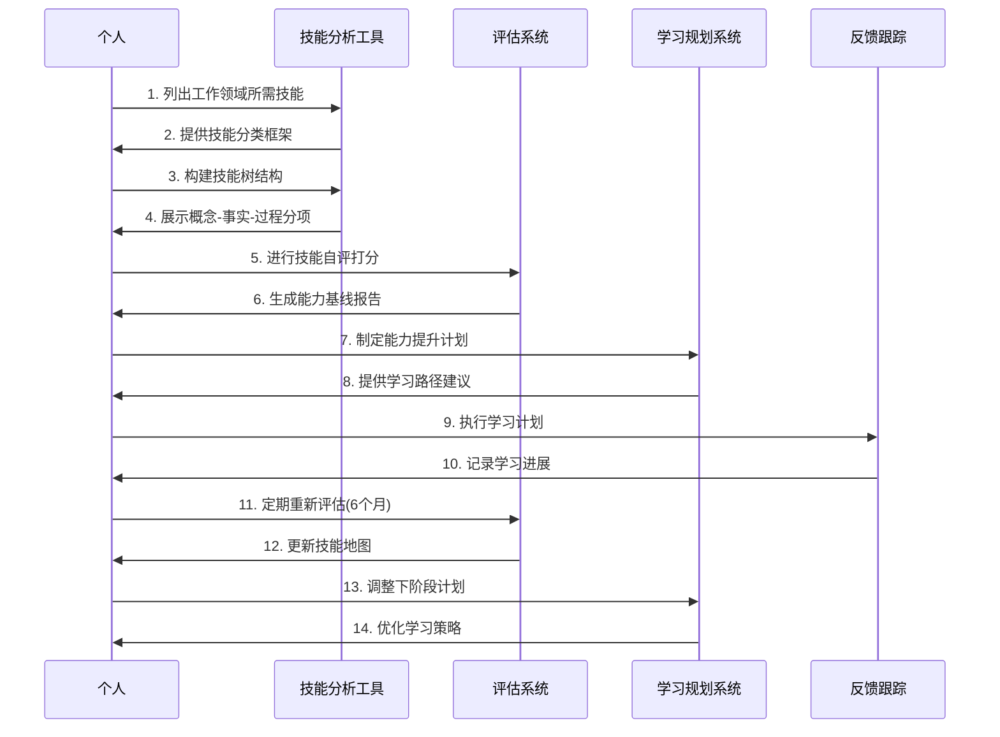
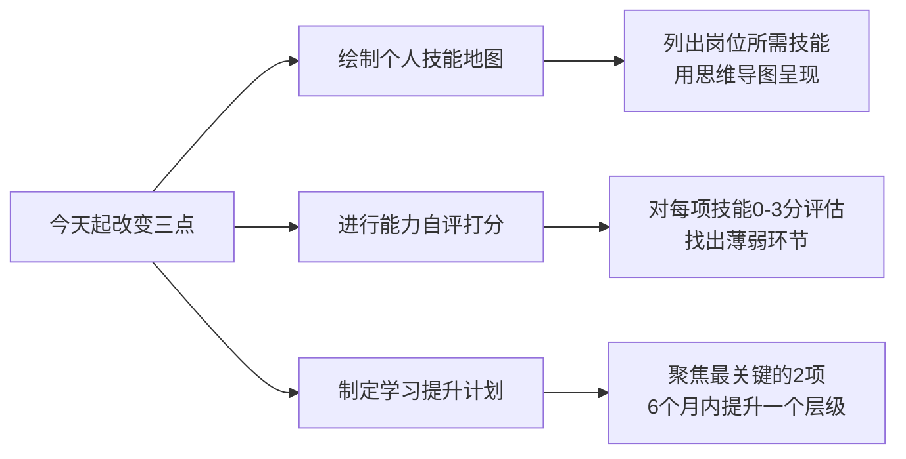

# 1.4要带上技能地图
#### 目录介绍
- [1.晋升资本是什么](#01晋升资本是什么)
- [2.技能的学习维度](#02技能的学习维度)
- [3.技能的思维纬度](#03技能的思维纬度)
- [4.技能地图的用途](#04技能地图的用途)
- [5.能力地图的划分](#05能力地图的划分)
- [6.为何要技能地图](#06为何要技能地图)
- [7.技能地图的目标](#07技能地图的目标)
- [8.技能地图的构建](#08技能地图的构建)
- [9.今天起改变三点](#09今天起改变三点)
- [10.课后作业思考下](#10课后作业思考下)

## 01.晋升资本是什么

有人经常会说一定要找到一份月薪多少多少的工作，争取做到什么什么职位，未来要赚多少的钱。

耐心听完“远大蓝图”，然后想一想：“凭什么达到自己的目标？你的资本是什么？”

如果是你，你该怎么回答这个问题？有着自己的伟大抱负，你有没有想到，要实现这些目标，你的资本是什么？

对于很多已经身在职场的朋友而言，你晋升的资本又是什么？因此，自己需要清楚自己的优势，技能，资源，也就是能力地图！

不管所处什么行业做什么工作，在日常的工作中，你是否有这样的烦恼：

1. 对自己的工作缺乏系统的认识，遇到实际问题时，没有有效的流程或模型，为自己的行动提供方向。
2. 想要做有针对性的学习、查缺补漏，但又不知道自己缺什么，应该从哪里补起。
3. 就算学了一堆干货、课程，但对自己的工作还是没有一点帮助，很难应用到实践中。
4. 学习的过程中，会遇到各种各样的问题。比如，不懂得如何进行知识归类、很难明确自己的学习目标等等。

## 02.技能的学习维度

在技能地图中，需要先开启和点亮哪些部分呢？回顾过去的经历并结合现实的需要，可以从如下四个不同程度的维度来说明：了解；掌握；熟练；精通。

1. 了解，相对掌握不是必需，但也需要达到知其然的程度，甚至知其所以然更好。
2. 掌握，意味着是一开始就要求熟练掌握的硬技能，这是生存之本。而至于掌握的深度，是动态的，倒是可以在行进过程中不断去迭代加深。
3. 熟练，在你掌握一门技能或者某个知识点的情况下，还要经过大量的训练，并且把东西做好，才能让你把东西吸收。
4. 精通，相比熟练更进一步。比如你做了某个方案，你还要知道为什么这样做，和其他方案对比优缺点分析，遇到那么困难以及如何解决等。

综合应用，结合实际多个知识点，在实践中能够形成一套自己的方案，运用所掌握的知识，搞定一件大的方案实践。

## 03.技能的思维纬度

技能思维的培养比较务虚，不好评价和判断。在技能地图中，把思维纬度可以分为三个层次，可以去量化培养，其层次分别是：理解信息，概括洞察，发现应用。

1. 理解信息：比较，对比，解释，分类。
2. 概括洞察：消化，领会，见解。
3. 发现应用：创造，预测，判断，评价。

当明确了目标和内容，必须用技能去实现。那么技能思维就很重要，认知领域非常强调目标的实现，要多用动词去量化或者考核目标的实现。

https://mp.weixin.qq.com/s/L-ZSwDxECMSR20N-87wiYw

## 04.技能地图的用途

技能地图是一种有助于规划、管理和追踪个人发展的工具。可以帮助你设定目标、了解技能需求、评估现状、规划学习路径、追踪进展，并提供动力和激励。

1. 目标设定：技能地图可以帮助你明确和设定自己的技能发展目标。通过绘制技能地图，你可以清楚地看到当前的技能水平和所需的目标水平，从而制定明确的发展计划。
2. 了解技能需求和规划：技能地图可以帮助你了解当前和未来的技能需求。通过分析行业趋势和职业要求，你可以确定哪些技能对于你的职业发展至关重要，并将其纳入技能地图中。
3. 评估现状：技能地图可以帮助你评估自己的现状和技能差距。通过对比目标水平和当前水平，你可以识别出自己的强项和待提升的领域，从而有针对性地进行学习和发展。
4. 规划学习路径：技能地图可以帮助你规划学习路径和顺序。通过将技能按照优先级和依赖关系进行排列，你可以确定学习的先后顺序，避免盲目学习和浪费时间。
5. 追踪进展：技能地图可以帮助你追踪自己的学习进展。你可以在技能地图上标记自己已经掌握的技能，记录学习的时间和成果，以便及时调整学习计划和目标。
6. 提供动力和激励：技能地图可以激励你不断学习和发展。当你看到自己在技能地图上不断填充和提升技能时，会感到成就感和动力，进而保持学习的积极性。

## 05.能力地图的划分

**基础能力**

1. 基础能力：具备规模项目的把控和设计能力，技术上具备完全把握一个技术方向的能力，并擅长将大规模项目拆解成多向中型规模的项目，并保证产品业务能达成预期的目标。
2. 沟通能力：有将事情沟通好的能力，比如跨团队资源协调，具备小组内部沟通计划制定与风险控制能力。

**通用能力**

1. 影响力，能达到部门级范围影响力以及较好的口碑。在技术或者专业素质上被认可。
2. 领导力：能够预见和管理项目风险，协调团队资源，推进项目上线。
3. 协调力：项目涉及跨团队资源协调，具备计划制定与风险控制能力。
4. 自驱力：具备很强的驱能力，能在无人督促下自我管理，不断的去完善和优化。
5. 组织力：有一定的组织能力，能凝聚团队中不同角色，提高团队的战斗力和产出。
6. 向上管理：有良好的向上管理意识，能和上级建立良好的沟通、反馈、建议途径，能在项目的一些重要节点以及重要事件上及时透传有价格的信息。

**专业能力**

1. 专业技能：具备全面的技术规划能力，了解项目和产品自己领域绝大大多的技术原理和实现，深度的了解业务。
2. 创新能力：有模块级的关键的技术决策或者创新点，对业务发展有较大促进作用。善于发现和总结系统问题，并给出解决方案，带来产品功能的创新。
3. 产品思维：能够深入了解产品需求，并能综合权衡产品需求、体验与技术实现，从技术侧给产品合理的建议，在产品开过程中发挥技术影响力。
4. 规划能力：能够把握具体产品方向的研发工作，能制定和推动所负责产品线的业务规划，产出对于团队业务指标产生直接影响。能采用合适的技术，解决具体的技术难题，消除对产品的不利影响。

## 06.为何要技能地图

技能地图主要解决了两个痛点：不清楚现在到底该学什么、不了解如何评估自己是否已达成既定学习目标。

当你构建个人技能地图时，需要思考并规划出所有相关的分项知识与技能，还要标注出目前在这些知识与技能方面的熟练或精通程度。这个过程可以帮助你对自己的实际情况做出评估。

保持专注。构建个人技能地图的时候，你可以采用“二八定律”帮助自己做决策，明确自己最想要什么样的结果。

引导你正确学习。你需要在自己的技能地图中添加适合自己的学习材料，你可以通过网络搜索学习资源、请教身边的专业人士、参加讲座或者学习相关课程等等，获得学习材料。

构建技能地图，你可以平衡好各项学习资源，你可以知道不同技能对于你而言，需要投入的精力占比和优先级。

## 07.技能地图的目标

由于技能地图上罗列的都是能力的抽象，在实际的生活中，还需要将技能具体化，这样做的目的是为了更加方便自己去落实和实践。

举一个简单的例子，针对移动端开发来说，拥有扎实的Java基础，那么具体化是要求掌握面向对象思想，熟练运用数据结构，掌握并发的知识等等，这就是将抽象能力具体化。

针对每一个大的能力抽象，尽可能的把它具体化，这是一个长期不断迭代优化的事项，因此这块可以做一个长期主义者。逐步去完善技能地图的拆分工作。

把学习一种知识或技能所需要的分项知识与技能，通过树状图或思维导图式的视觉呈现方式构建出来。

就个人技能树而言，它可能永远没有终点，你可以不断地往个人技能树上添加内容，比如追加新的分项知识与技能、记录自己的学习进展、添加各种学习资源等等。

## 08.技能地图的构建

技能地图是如何构建的呢？有以下四个步骤：

1. 第一步：将产品或者工作领域需要的技能逐一列出。先罗列大概的点，描绘出概念、事实和过程，最好是用思维导图。
2. 第二步：构建技能树。在构建技能树的时候，你需要先列出概念、事实和进程三个分项，然后再进行展开。
3. 第三步：自评。每个人对自己在每一项技能水平打分：0-9分，从完全不懂到极其精通。每个档是相对比较，不需要有明确的定义。
4. 第四步：能力基线化。将评估结果作为自身能力基线，基于现实能力水平和工作需要制定能力提升计划：需要花多长时间提升到一个层级，尤其关注的是那些从0到1的提升。

初次制作技能地图后，需要定期更新。比如，每隔6个月一次，需要更新自己技能评估，并制定下一步的提升计划。

在第一步中，概念、事实和过程的定义是，概念：任何需要理解的内容。事实：任何需要记忆的内容。进程：任何需要练习的内容。

在第二步中，以学习骑自行车为例，在构建技能树的时候，你需要先列出概念、事实和进程三个分项，然后再进行展开。比如，在概念分项下，你需要罗列前灯、轮胎、戴 / 调整头盔、下车、上车等内容。你也可以在技能树中加亮显示你需要关注的内容，这样能够让你进一步保持在核心事项上的专注力。

第三步是自评打分。分值定义如下：0：None –不具备该项能力；1：Basic –具备基本能力；2：Competent –完全具备能力；3：Professional –专家级，可以指导其他人。

针对自身的能力自评：了解职业发展目标，规划成长路线，宏观地判断出能力短板，从而找准能力提升的方向。寻找匹配能力发展的机会以及制定培训计划等方式帮助达成个人成长目标。

注意问题：避免单纯收集了自己的技能数据，没有分析和复盘开展能力发展的讨论，也没有进一步利用这个技能地图开展组织级能力发展的规划。

## 09.今天起改变三点

**第一点：绘制你的个人技能地图**。今天就花1小时，把你当前岗位和目标岗位所需的所有技能列出来，用思维导图的形式呈现。先列出大的能力模块（基础能力、通用能力、专业能力），再逐步细化到具体技能点。不求一次完美，先搭好框架，后续持续迭代。

**第二点：对自己进行能力自评打分**。参考文中的四级评估体系（0-不具备、1-基本、2-完全具备、3-专家级），给你技能地图上的每一项打分。标记出所有0分和1分的项目，这就是你当前最需要突破的短板。同时也标记出3分的项目，这是你的护城河，要继续保持。

**第三点：制定6个月的能力提升计划**。根据自评结果，运用"二八定律"筛选出最重要的2-3项需要提升的技能，为每项制定具体的学习计划。明确学习资源、时间投入和阶段性目标。6个月后重新自评，检验提升效果，再制定下一轮计划。

## 10.课后作业思考下

**1. 晋升资本盘点**：请认真思考"你的晋升资本是什么？"这个问题。列出你目前拥有的5项最有价值的技能和资源，再列出你目标岗位需要但你还不具备的5项能力。对比之后，你最紧迫需要补齐的是哪一项？

**2. 技能维度自测**：按照"了解-掌握-熟练-精通"四个维度，对你当前工作中最核心的5项技术技能进行分级评估。有几项达到了"熟练"以上？有几项还停留在"了解"阶段？这个分布是否与你的工作年限匹配？

**3. 思维能力提升**：选择你最近完成的一个项目，用"理解信息-概括洞察-发现应用"三个层次来复盘。你在哪个层次投入最多？是否跳过了概括洞察直接进入执行？如何在下一个项目中有意识地锻炼更高层次的思维能力？

**4. 护城河分析**：假设明天你所在的公司突然倒闭，你需要在一周内找到新工作。你会用哪些技能和经验来打动面试官？这些就是你的"护城河"。如果你觉得底气不足，说明需要在哪些方面加强积累？

